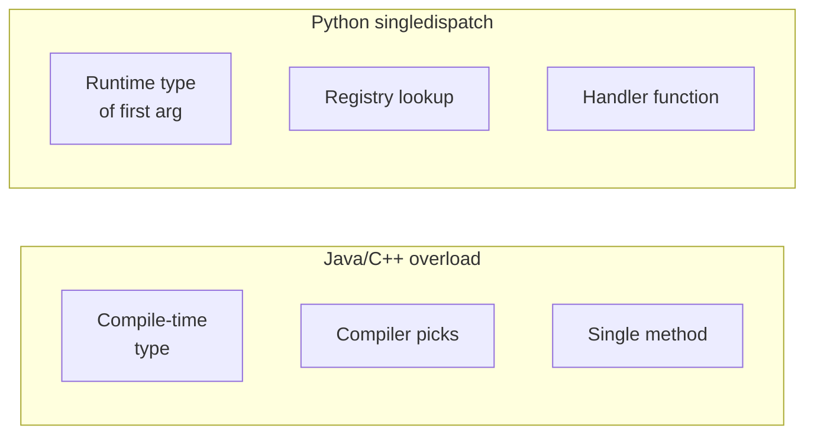
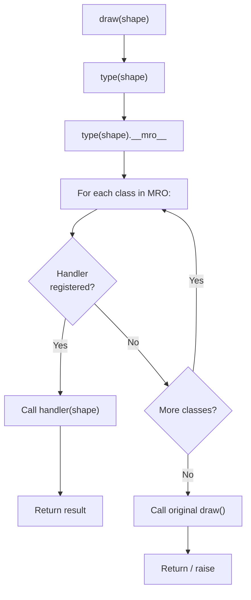
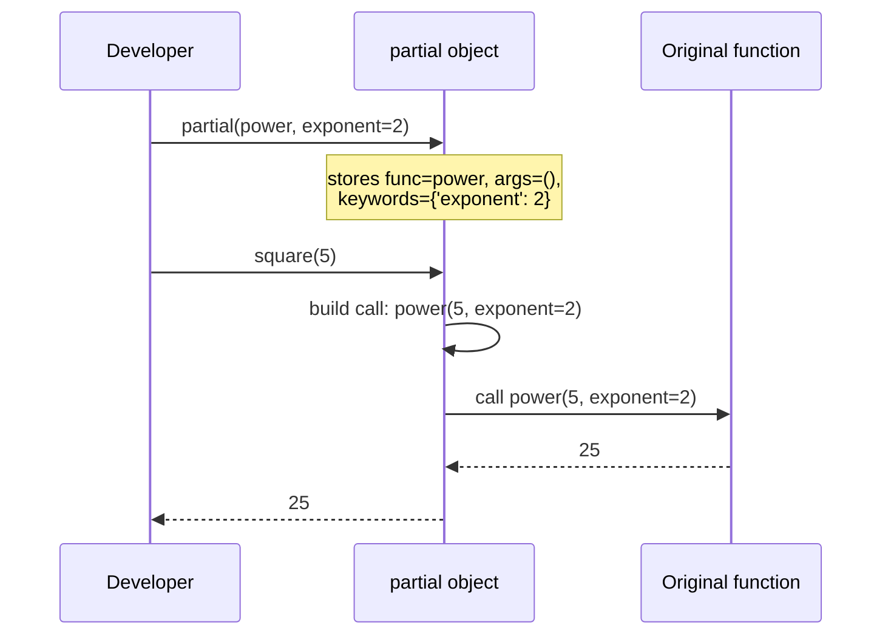

# 2. partial and singledispatch

> [!note] Why this note exists
> `partial` and `singledispatch` are the two `functools` tools that most directly change **how you structure** your code. `partial` is the gateway to function-level reuse — instead of writing yet another small wrapper, you bind arguments and pass the result as a callback. `singledispatch` is Python's answer to ad-hoc polymorphism — the modern replacement for `isinstance` ladders and Visitor-pattern code. This note covers both in depth, plus `partialmethod` and `singledispatchmethod`, and shows how they compare to overloading and currying in other languages.

## Why It Matters

Two patterns dominate real-world Python:

1. **Pass a callback that needs context.** A GUI button needs a click handler; an HTTP framework needs a route handler; a thread pool needs a worker. In each case, the callback signature is fixed by the framework (e.g., `handler(event)`), but your logic needs more data (the current user, the request path, a database session). `partial` lets you capture that context cleanly, without a 4-line `lambda` or a one-off wrapper function.

2. **Behave differently based on the type of one argument.** A `serialize` function should handle `int`, `str`, `list`, `dict`, `datetime`, and your own classes — each with its own logic. Without `singledispatch`, you write a giant `if isinstance(obj, int): ... elif isinstance(obj, str): ...` chain. With it, you register one function per type, and the dispatch table lives in the type system itself.

Both tools turn a structural pattern (boilerplate wrappers, type ladders) into a declarative one (a registry, a bound callable). That's the entire point of functional programming in Python — not purity for its own sake, but **removing accidental complexity**.

## Background

### Currying and partial application

**Currying** (after Haskell Curry) transforms a function `f(a, b, c)` into a chain of single-argument functions: `g(a)(b)(c)`. Some languages (Haskell, OCaml, F#) curry every function by default.

**Partial application** is the more general idea: bind some arguments now, get back a function that takes the rest later. Python doesn't auto-curry, but `functools.partial` gives you explicit partial application:

```python
from functools import partial

def greet(greeting, name):
    return f"{greeting}, {name}!"

hello = partial(greet, "Hello")
hello("Alice")   # 'Hello, Alice!'
hello("Bob")     # 'Hello, Bob!'
```

### Method overloading in other languages

In statically-typed languages (Java, C++, C#), **method overloading** lets you define multiple methods with the same name but different parameter types:

```java
// Java
String format(int x)      { return Integer.toString(x); }
String format(double x)   { return Double.toString(x); }
String format(String x)   { return x; }
```

The compiler picks the right one at **call time** based on the **static** type of each argument. Python doesn't have this — function names are looked up at runtime, and there's no static type to dispatch on. The Pythonic answer is `singledispatch`, which dispatches on the **runtime** type of the **first** argument.



### Why dispatch on only the first argument?

Python functions don't have a privileged receiver (the way methods do — `self`). But in practice, **the first argument is usually the "subject"** of the function: `len(seq)`, `str(x)`, `json.dumps(obj)`, `pickle.dumps(obj)`. Dispatching on the first argument matches this convention.

For methods, the first arg is `self` — not what you want to dispatch on. `singledispatchmethod` skips `self` and dispatches on the second argument.

## Main content

### `partial` — bind arguments, get a callable

```python
from functools import partial

def power(base: float, exponent: float) -> float:
    return base ** exponent

square = partial(power, exponent=2)
cube   = partial(power, exponent=3)
sqrt   = partial(power, exponent=0.5)

square(5)   # 25.0
cube(3)     # 27.0
sqrt(16)    # 4.0
```

The signature of the returned callable is the original signature minus the bound arguments. You can bind positionally, by keyword, or both:

```python
log_msg = partial(print, "[INFO]", sep=" | ")
log_msg("server started", "port=8080")
# [INFO] | server started | port=8080
```

#### `partial` vs `lambda`

```python
square_lambda = lambda x: power(x, exponent=2)
square_partial = partial(power, exponent=2)
```

These are nearly equivalent. Differences:

| Property            | `lambda`                       | `partial`                       |
|---------------------|--------------------------------|---------------------------------|
| Readable in traceback | `<lambda>` (unhelpful)         | `functools.partial(...)` (more helpful) |
| `repr`              | `<function <lambda>>`          | `functools.partial(power, exponent=2)` |
| Late-binding bugs   | Yes (closure over mutable vars) | No (args bound at construction)  |
| Picklable           | No (in most contexts)          | Yes (if wrapped func + args are) |
| Introspection       | Hard                           | `.func`, `.args`, `.keywords`   |

`partial` is more debuggable and picklable. `lambda` is shorter for one-off uses. Use `partial` when you'd otherwise write the same lambda twice.

#### Picklability matters for multiprocessing

```python
from multiprocessing import Pool
from functools import partial

def process(item, factor):
    return item * factor

with Pool(4) as pool:
    # This works because partial is picklable
    results = pool.map(partial(process, factor=10), range(100))
```

A `lambda` here would fail with `PicklingError`. `partial` is your friend across process boundaries.

#### `partial` with classes

`partial` works on any callable, including classes:

```python
import urllib.parse

URL = partial(urllib.parse.ParseResult, scheme='https', params='', query='', fragment='')
api = URL(netloc='api.example.com', path='/v1/users')
```

This is a clean way to define "preset" constructors.

### `partialmethod` — `partial` for unbound methods

```python
from functools import partialmethod

class Temperature:
    def __init__(self, celsius):
        self.celsius = celsius

    def set_temperature(self, scale, value):
        if scale == 'C':
            self.celsius = value
        elif scale == 'F':
            self.celsius = (value - 32) * 5 / 9
        elif scale == 'K':
            self.celsius = value - 273.15

    set_celsius    = partialmethod(set_temperature, 'C')
    set_fahrenheit = partialmethod(set_temperature, 'F')
    set_kelvin     = partialmethod(set_temperature, 'K')

t = Temperature(20)
t.set_fahrenheit(68)
print(t.celsius)   # 20.0
```

`partialmethod` differs from `partial` in two ways:
1. It's a **descriptor** — `self` is passed through automatically when the method is called on an instance.
2. It returns a method-like object, not a plain callable. Useful for IDE introspection.

Without `partialmethod`, you'd write three near-identical one-liner wrappers. With it, the preset methods are declared in one line each.

#### Comparison: `partial` vs `partialmethod`

```python
class C:
    # WRONG — partial doesn't pass self:
    method_a = partial(_impl, 'a')   # will not work as a method

    # RIGHT:
    method_b = partialmethod(_impl, 'a')
```

`partial` binds args at definition time and doesn't know about `self`. `partialmethod` is descriptor-aware and inserts `self` correctly.

### `singledispatch` — overloading by first-arg type

```python
from functools import singledispatch

@singledispatch
def draw(shape) -> str:
    raise TypeError(f"Cannot draw {type(shape).__name__}")

@draw.register
def _(shape: Circle) -> str:
    return f"Drawing circle of radius {shape.radius}"

@draw.register
def _(shape: Square) -> str:
    return f"Drawing square of side {shape.side}"

@draw.register
def _(shape: Triangle) -> str:
    return f"Drawing triangle"
```

Two registration styles:

```python
# Style 1: explicit type
@draw.register(Circle)
def _(shape):
    ...

# Style 2: type annotation (Python 3.7+)
@draw.register
def _(shape: Circle):
    ...
```

Style 2 is cleaner but only works when the annotation is a concrete type (not a string forward-reference, not a generic alias).

#### Dispatch mechanics

`draw(obj)` does:
1. Get `type(obj)`.
2. Walk `type(obj).__mro__` (method resolution order — the class and its base classes, in C3 linearization order).
3. Return the first registered handler found.
4. If none, call the original `draw` (the fallback).

```python
class Shape: ...
class Circle(Shape): ...
class ColoredCircle(Circle): ...

# Register handlers for Shape and Circle
@draw.register(Shape)
def _(s): return "shape"

@draw.register(Circle)
def _(s): return "circle"

draw(ColoredCircle())   # 'circle' — Circle handler wins (more specific in MRO)
```

#### Registering ABCs

```python
from collections.abc import Iterable

@singledispatch
def count_elements(obj):
    return 1

@count_elements.register(Iterable)
def _(obj):
    return sum(1 for _ in obj)

count_elements([1, 2, 3])   # 3
count_elements("hello")     # 5  (str is Iterable)
count_elements(42)          # 1
```

Note: `str` is `Iterable`, so it'll match the iterable handler. If you want a separate `str` handler, register it explicitly — specific registrations win.

#### The fallback function

The function decorated with `@singledispatch` (without `.register`) is the **fallback**. It's called when no registered handler matches:

```python
@singledispatch
def serialize(obj):
    # Fallback: try obj.__serialize__ if defined
    if hasattr(obj, '__serialize__'):
        return obj.__serialize__()
    raise TypeError(f"Cannot serialize {type(obj)}")
```

#### Composing with type annotations

```python
from typing import Union

@singledispatch
def process(value):
    raise TypeError

@process.register(int)
@process.register(float)
def _(value):
    return value * 2

process(5)      # 10
process(2.5)    # 5.0
```

Stacking `@register` decorators registers the same function for multiple types.

### `singledispatchmethod` — for instance methods

```python
from functools import singledispatchmethod

class HTMLRenderer:
    @singledispatchmethod
    def render(self, obj) -> str:
        raise TypeError(f"Cannot render {type(obj)}")

    @render.register(str)
    def _(self, obj: str) -> str:
        return obj.replace('<', '&lt;').replace('>', '&gt;')

    @render.register(int)
    def _(self, obj: int) -> str:
        return f"<span class='num'>{obj}</span>"

    @render.register(list)
    def _(self, obj: list) -> str:
        return '<ul>' + ''.join(f'<li>{self.render(x)}</li>' for x in obj) + '</ul>'

r = HTMLRenderer()
r.render("hello <world>")   # 'hello &lt;world&gt;'
r.render([1, 2, 3])         # '<ul><li><span class="num">1</span></li>...</ul>'
```

`singledispatchmethod` skips `self` and dispatches on the next argument. Without it, the dispatch would happen on the type of `self` — useless, since `self` is always the same class.

#### Combining with `@classmethod`

```python
class Factory:
    @singledispatchmethod
    @classmethod
    def create(cls, obj):
        raise TypeError

    @create.register(str)
    @classmethod
    def _(cls, obj):
        return cls.from_string(obj)
```

Order matters: `@singledispatchmethod` on the outside, `@classmethod` on the inside. (Stacked the other way, the descriptor protocol breaks.)

## Mermaid: dispatch flow



## Mermaid: `partial` evaluation timeline



## Code examples

### `partial` for HTTP route handlers

```python
from functools import partial
from http.server import BaseHTTPRequestHandler, HTTPServer

def make_handler(database):
    class Handler(BaseHTTPRequestHandler):
        def do_GET(self):
            user = database.get_user(self.path)
            self.send_response(200)
            self.end_headers()
            self.wfile.write(str(user).encode())
    return Handler

# Or, with partial:
def handle_request(database, base):
    user = database.get_user(base.path)
    base.send_response(200)
    base.end_headers()
    base.wfile.write(str(user).encode())

# Pre-bind database, then assign:
class Handler(BaseHTTPRequestHandler):
    do_GET = partialmethod(handle_request, db)
```

### `singledispatch` for a SQL compiler

```python
from functools import singledispatch
from dataclasses import dataclass

@dataclass
class Column: name: str
@dataclass
class Table: name: str
@dataclass
class Eq: left: object; right: object
@dataclass
class And: left: object; right: object
@dataclass
class Or: left: object; right: object

@singledispatch
def to_sql(node) -> str:
    raise TypeError(f"Unknown node: {type(node)}")

@to_sql.register(Column)
def _(n): return n.name

@to_sql.register(Table)
def _(n): return n.name

@to_sql.register(Eq)
def _(n): return f"{to_sql(n.left)} = {to_sql(n.right)}"

@to_sql.register(And)
def _(n): return f"({to_sql(n.left)} AND {to_sql(n.right)})"

@to_sql.register(Or)
def _(n): return f"({to_sql(n.left)} OR {to_sql(n.right)})"

query = And(
    Eq(Column("name"), "'Alice'"),
    Or(Eq(Column("age"), "30"), Eq(Column("city"), "'NYC'"))
)
print(to_sql(query))
# (name = 'Alice' AND (age = 30 OR city = 'NYC'))
```

This is the **AST-visitor pattern**, expressed functionally. Adding a new node type means writing one `@to_sql.register` function — no edits to existing code.

### `partial` to convert a 2-arg function into a 1-arg comparator

```python
from functools import partial, cmp_to_key

# A two-arg comparator:
def cmp_with_key(key, a, b):
    ka, kb = key(a), key(b)
    return -1 if ka < kb else (1 if ka > kb else 0)

# Adapt to a 1-arg cmp function:
cmp_by_length = partial(cmp_with_key, len)
sorted(['aaa', 'a', 'aa'], key=cmp_to_key(cmp_by_length))
# ['a', 'aa', 'aaa']
```

### `singledispatchmethod` for a state machine

```python
from functools import singledispatchmethod
from dataclasses import dataclass

@dataclass
class Start: pass
@dataclass
class Running: pid: int
@dataclass
class Stopped: reason: str

class Service:
    def __init__(self):
        self.state = Start()

    @singledispatchmethod
    def handle(self, event):
        raise TypeError(f"Unknown event: {type(event)}")

    @handle.register(Start)
    def _(self, event):
        print("Starting service...")
        self.state = Running(pid=1234)

    @handle.register(Running)
    def _(self, event):
        print(f"Running with pid {event.pid}")

    @handle.register(Stopped)
    def _(self, event):
        print(f"Stopped: {event.reason}")
        self.state = Start()

svc = Service()
svc.handle(Start())         # Starting service...
svc.handle(Running(1234))   # Running with pid 1234
svc.handle(Stopped("crash"))# Stopped: crash
```

## Common Pitfalls

> [!warning] `partial` binds at definition time
> If you bind a mutable object (e.g., a list) and mutate it later, the partial sees the mutation. This is rarely what you want. Bind an immutable copy if needed.

> [!warning] `partial` doesn't expose a useful signature
> `inspect.signature(square)` shows `(*args, **kwargs)` rather than the cleaner `(base)`. (PEP 616/Python 3.8+ improves this slightly via `__wrapped__`-style hints, but it's not perfect.) For introspection-sensitive code, a real wrapper function may be preferable.

> [!warning] `singledispatch` doesn't dispatch on subclasses automatically
> If you register `@draw.register(Circle)` and call `draw(ColoredCircle())`, the `Circle` handler is used (MRO lookup). But if you only registered `Shape`, calling `draw(Circle())` also works (Shape handler) — the lookup walks up. **However**, registering only `Shape` then calling `draw(Circle())` doesn't auto-dispatch to a hypothetical `Circle` handler unless one exists. Plan your registrations.

> [!warning] Annotations must be concrete types
> `@singledispatch def f(x: int | str): ...` doesn't work — the union syntax creates a `types.UnionType`, not a class. Use stacked `@register(int) @register(str)` decorators.

> [!warning] `singledispatch` is per-function
> Two `@singledispatch`-decorated functions have independent registries. If you inherit a class and want to extend the parent's dispatch, you need a custom approach (a class with `singledispatchmethod` and a re-registered function).

> [!warning] `partialmethod` doesn't work with `super()`
> `super().method` returns a bound method; `partialmethod` returns a descriptor. Mixing them is fragile.

> [!warning] Lambda closures and late binding
> ```python
> funcs = [lambda: i for i in range(3)]
> [f() for f in funcs]  # [2, 2, 2] — late binding!
> funcs = [partial(lambda i: i, i) for i in range(3)]
> [f() for f in funcs]  # [0, 1, 2] — bound at construction
> ```
> `partial` captures the value, not the variable.

## Tips and Tricks

> [!tip] `partial` as a configurator
> Configure a function with environment-specific settings once at startup, then pass the configured callable around. This avoids threading config through every call.

> [!tip] `singledispatch` to replace Visitor pattern
> The Visitor pattern is the OOP answer to "add an operation to a closed set of types". `singledispatch` is the functional answer — and it's far less boilerplate.

> [!tip] Use `register` as a decorator AND as a function
> `draw.register(Circle)(handler_fn)` works programmatically — useful when registering handlers from a plugin system or config file.

> [!tip] Cache the dispatch
> `singledispatch` does a dict lookup on every call. For hot paths, the overhead is small but measurable. You can memoize the per-type lookup if needed.

> [!tip] `partial` for `map`/`filter`
> ```python
> squares = map(partial(pow, exponent=2), range(10))
> ```
> Cleaner than `lambda x: x**2` for non-trivial transforms.

> [!tip] Combine with type hints for self-documenting code
> ```python
> def process(data: bytes, *, encoding: str = 'utf-8') -> str: ...
>
> process_utf8 = partial(process, encoding='utf-8')
> ```
> The type checker can follow this; readers can see the parameter being bound.

> [!tip] `singledispatch` for `__init__`-style overloads
> Can't overload `__init__` by argument type in Python? Use a classmethod factory with `singledispatch`:
> ```python
> @classmethod
> @singledispatchmethod
> def from_value(cls, value):
>     raise TypeError
>
> @from_value.register(int)
> @classmethod
> def _(cls, value): return cls(value)
> ```

## Advanced patterns

### Combining `partial` and `singledispatch`

The two tools compose cleanly. Bind arguments to a generic function, then dispatch:

```python
from functools import singledispatch, partial

@singledispatch
def format_value(prefix, value):
    return f"{prefix}{value}"

@format_value.register(int)
def _(prefix, value):
    return f"{prefix}{value:04d}"

@format_value.register(float)
def _(prefix, value):
    return f"{prefix}{value:.2f}"

# Pre-bind the prefix for a specific use case:
format_with_hash = partial(format_value, "#")
format_with_hash(42)      # '#0042'
format_with_hash(3.14)    # '#3.14'
```

Here `partial` captures the prefix argument; `singledispatch` then dispatches on the remaining value argument. The result is a partially-applied, type-dispatched function — a pattern that's very common in compiler / interpreter code.

### `singledispatch` with `functools.reduce`

You can build a small interpreter using `singledispatch` for AST evaluation and `reduce` for sequence operations:

```python
from functools import singledispatch, reduce
from dataclasses import dataclass
from typing import Any

@dataclass
class Lit: value: Any
@dataclass
class Add: left: Any; right: Any
@dataclass
class Mul: left: Any; right: Any
@dataclass
class Seq: exprs: tuple

@singledispatch
def eval_(node, env):
    raise TypeError(f"Unknown node: {type(node)}")

@eval_.register(Lit)
def _(node, env):
    return node.value

@eval_.register(Add)
def _(node, env):
    return eval_(node.left, env) + eval_(node.right, env)

@eval_.register(Mul)
def _(node, env):
    return eval_(node.left, env) * eval_(node.right, env)

@eval_.register(Seq)
def _(node, env):
    return reduce(lambda _, e: eval_(e, env), node.exprs, None)

eval_(Seq((Lit(1), Add(Lit(2), Mul(Lit(3), Lit(4))))), {})
# 14  (returns the last value)
```

This is the standard **AST walker** pattern — dispatch on node type, recurse into children. Adding a new node type means writing one `@eval_.register` function — no edits to existing code. This is the **open/closed principle** at its purest.

### Performance considerations

`partial` adds a thin wrapper layer — each call goes through one extra Python function call. For hot paths, a manual wrapper is marginally faster:

```python
# Manual wrapper — slightly faster:
def square(x):
    return power(x, exponent=2)

# partial — slightly slower, but cleaner:
square = partial(power, exponent=2)
```

The difference is microseconds per call. Use `partial` for clarity; optimize only if profiling shows it matters.

`singledispatch` does a dict lookup on every call (by `type(arg)`). The lookup is O(1) for direct matches, but walks the MRO for subclasses. For hot paths, cache the resolved handler:

```python
@singledispatch
def process(obj): ...

@functools.lru_cache(maxsize=None)
def _resolve(cls):
    # Walk the registry manually; or use process.dispatch(cls)
    return process.dispatch(cls)

def process_cached(obj):
    return _resolve(type(obj))(obj)
```

This is rarely necessary — `singledispatch` is already fast enough for most use cases.

## Active Recall

1. `partial(f, 1, 2)(3)` is equivalent to what call?
2. Why is `partial` picklable but `lambda` isn't (usually)?
3. `partialmethod` differs from `partial` in what two ways?
4. `@singledispatch` dispatches on what? What does it do if no handler matches?
5. Register `@draw.register(Circle)`; what happens when you call `draw(SubCircle())` where `SubCircle(Circle)`?
6. How do you register one handler function for both `int` and `float`?
7. `@singledispatchmethod` skips which argument?
8. Why does `singledispatch` use MRO lookup?
9. Can you use a string annotation (`'Circle'`) with `@register`? Why or why not?
10. Name two reasons `partial` is preferable to a `lambda` for callbacks in production code.

## Next Steps

- [[1. functools Deep Dive]] — the parent note covering all of `functools`.
- [[3. Immutable Patterns]] — pairs naturally with `singledispatch` on immutable dataclasses.
- [[4. map, filter, reduce]] — `partial` shines when composing `map`/`filter` pipelines.
- [[8. Object-Oriented Programming/4. Polymorphism and Duck Typing]] — broader polymorphism context.
- [[10. Pythonic Programming/6. Higher Order Functions]] — the conceptual home for `partial`.
- [[11. Type Hinting/3. Protocols and Structural Typing]] — the typing-based counterpart to runtime dispatch.
