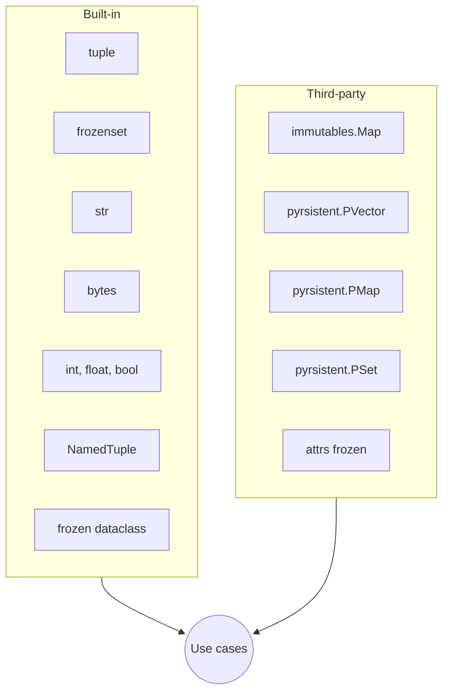
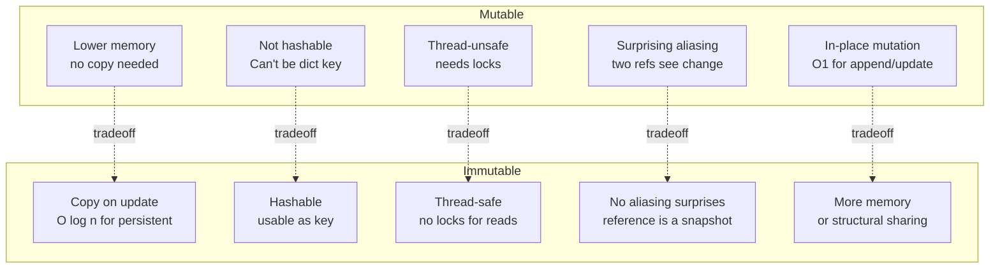
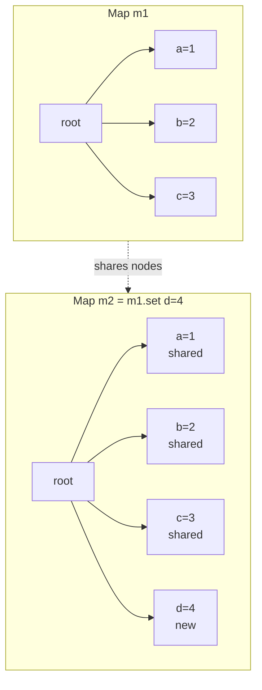

# 3. Immutable Patterns

> [!note] Why this note exists
> Python is not a pure functional language, but **immutability** is a cornerstone of robust, thread-safe, and predictable code. This note covers Python's built-in immutable types (`tuple`, `frozenset`, `NamedTuple`), the modern `@dataclass(frozen=True)`, third-party libraries (`immutables`, `pyrsistent`), and the trade-offs of going immutable in a language whose default collections are mutable. After this note you'll know when immutability pays for itself and when it's just ceremony.

## Why It Matters

Immutability gives you four properties that are very hard to recover once you've lost them:

1. **Predictability** — once you have a reference to an immutable object, you know it will never change. No surprise mutation by another part of the program.
2. **Thread safety** — concurrent readers don't need locks. The object's state is fixed at construction.
3. **Hashability** — immutable objects (with hashable fields) can be dict keys or set members. Mutable objects can't.
4. **Cheap equality** — two immutable objects with the same construction arguments are equal; you don't need to deep-compare.

These properties matter most in:
- **Caches and memoization** — `@lru_cache` requires hashable arguments.
- **Concurrent code** — passing data across threads/async tasks without locking.
- **Configuration** — settings objects that shouldn't change after load.
- **Event sourcing / redux-style state** — represent application state as a series of immutable snapshots.
- **Functional core, imperative shell** — keep the heart of your logic pure; mutate at the boundaries.

Python is not Haskell. The default collections (`list`, `dict`, `set`) are mutable. You'll have to opt into immutability deliberately — but Python gives you the tools to do it well.

## Background

### What "immutable" really means in Python

An object is **immutable** if its **public interface** doesn't expose any operation that changes its state. (Internal mutation that's invisible to the user — like `frozenset` interning, or `tuple` holding mutable elements — doesn't violate this contract from the caller's perspective.)

```python
t = (1, 2, 3)
t[0] = 10    # TypeError: 'tuple' object doesn't support item assignment
```

But immutability is **shallow** in Python:

```python
t = ([1, 2], [3, 4])
t[0].append(99)   # OK — the list inside the tuple is still mutable
print(t)          # ([1, 2, 99], [3, 4])
```

A tuple holds references; it doesn't deeply freeze its contents. For deep immutability, every nested type must also be immutable.

### Hashability vs immutability

These are related but not identical:
- **Hashable** = defines `__hash__` and `__eq__`, and the hash value never changes during the object's lifetime.
- **Immutable** = no mutation API.

In practice: most immutable types are hashable (if their fields are hashable). But you can have an immutable type that's not hashable (e.g., a `frozen=True` dataclass with a `list` field — it can't be hashed), and a mutable type with a custom `__hash__` (don't do this — it lies to dicts).

### Why Python chose mutable defaults

`list`, `dict`, `set` are mutable because most code does most of its work by mutating a collection in place. Building a list of 1000 items with `.append()` is faster than building 1000 immutable cons cells (the Lisp/Haskell style). Python trades purity for ergonomics and performance.

But when you need immutability — for safety, concurrency, or as dict keys — Python gives you the tools below.

## Main content

### Built-in immutable types



#### `tuple` — the workhorse

```python
point = (3, 4)
point[0]      # 3
len(point)    # 2
hash(point)   # only if all elements are hashable
```

`tuple` is the canonical immutable sequence. Cheap, hashable (if elements are), and ubiquitous. The downside: no field names. `(3, 4)` could be `(x, y)` or `(width, height)` or `(red, green)`.

#### `frozenset` — immutable set

```python
fs = frozenset({1, 2, 3})
fs & {2, 3, 4}    # frozenset({2, 3})
hash(fs)          # OK — frozenset is hashable
```

Use `frozenset` when you need a set as a dict key, a set of sets, or a "constant set" that shouldn't be mutated.

#### `str` and `bytes` — immutable text/binary

Strings are immutable in Python. Every "mutation" (`s += 'x'`) creates a new string. CPython has an optimization for in-place append in some cases (string builder), but the abstraction is immutable.

#### `int`, `float`, `bool` — immutable primitives

```python
x = 5
y = x
x += 1   # x is now 6, y is still 5 — int is immutable
```

Numbers are immutable. `x += 1` rebinds `x` to a new int; it doesn't mutate the int object.

### `NamedTuple` — typed, named, immutable

```python
from typing import NamedTuple

class Point(NamedTuple):
    x: float
    y: float
    label: str = "origin"

p = Point(3.0, 4.0, "A")
p.x              # 3.0
p.label          # 'A'
p[0]             # 3.0  (still tuple-like)
hash(p)          # OK
p.x = 5          # AttributeError: can't set attribute
```

`NamedTuple` (the modern `typing` version, not the legacy `collections.namedtuple`) gives you:
- Type annotations (checkable by mypy).
- Default values.
- Tuple compatibility — unpacking, indexing, iteration.
- Hashability (if fields are hashable).
- Tiny memory footprint (same as a tuple).

The downside: no methods beyond what you write. For richer behavior, use a frozen dataclass.

#### Methods on `NamedTuple`

```python
class Point(NamedTuple):
    x: float
    y: float

    def distance_to(self, other: 'Point') -> float:
        return ((self.x - other.x) ** 2 + (self.y - other.y) ** 2) ** 0.5

    def __str__(self) -> str:
        return f"({self.x}, {self.y})"
```

You can define methods, but you can't override `__init__` or add custom logic at construction. For that, use `dataclass(frozen=True)`.

### `@dataclass(frozen=True)` — modern immutable records

```python
from dataclasses import dataclass, replace
from typing import List

@dataclass(frozen=True)
class Point:
    x: float
    y: float

@dataclass(frozen=True)
class Rectangle:
    corner: Point
    width: float
    height: float

p = Point(0, 0)
r = Rectangle(corner=p, width=10, height=5)

r.corner.x = 5    # FrozenInstanceError
r.width = 20      # FrozenInstanceError
```

A frozen dataclass:
- Generates `__init__`, `__repr__`, `__eq__` for you.
- Sets `__hash__` based on all fields (if `frozen=True` and `eq=True`).
- Raises `FrozenInstanceError` (subclass of `AttributeError`) on attribute assignment.
- Supports `replace(obj, **changes)` to make a modified copy.

#### `replace` — the immutable update pattern

```python
from dataclasses import replace

p1 = Point(3, 4)
p2 = replace(p1, x=5)   # Point(x=5, y=4)
p1                       # Point(x=3, y=4) — unchanged
```

`replace` is the standard way to "modify" an immutable object: make a new one with the same fields except those you specify. This is the functional-update pattern from Clojure/OCaml/Haskell.

#### Frozen dataclass with mutable field — a footgun

```python
@dataclass(frozen=True)
class Bad:
    items: list   # mutable!

b = Bad([1, 2, 3])
b.items.append(4)   # Works! The list is mutable even though b is frozen.
hash(b)             # TypeError: unhashable type: 'list'
```

Freezing the dataclass only freezes attribute assignment, not the contents of mutable fields. For true immutability, use `tuple` instead of `list`, `frozenset` instead of `set`, and frozen dataclasses for nested records.

```python
@dataclass(frozen=True)
class Good:
    items: tuple[int, ...]   # immutable

g = Good((1, 2, 3))
hash(g)   # OK
```

#### `__post_init__` with `object.__setattr__`

When you need to compute a derived field at construction:

```python
from dataclasses import dataclass, field

@dataclass(frozen=True)
class Circle:
    radius: float
    area: float = field(init=False)

    def __post_init__(self):
        # frozen dataclass can't use self.area = ..., but we can bypass:
        object.__setattr__(self, 'area', 3.14159 * self.radius ** 2)

c = Circle(5)
c.area   # 78.54
```

`object.__setattr__` skips the frozen check — use it sparingly, only in `__post_init__`, and only for derived (non-mutable) fields.

### Third-party libraries

#### `immutables` — used by Instagram

`immutables.Map` is a high-performance persistent (immutable) map:

```python
import immutables

m1 = immutables.Map({'a': 1, 'b': 2})
m2 = m1.set('c', 3)
m3 = m1.delete('a')

m1   # Map({'a': 1, 'b': 2})  — unchanged
m2   # Map({'a': 1, 'b': 2, 'c': 3})
m3   # Map({'b': 2})
```

Updates return a new map that shares structure with the old one — O(log n) per update, not O(n) copy. Used in production at Instagram for state management.

#### `pyrsistent` — full persistent collections

```python
from pyrsistent import v, m, pset, pvector, pmap

v1 = v(1, 2, 3)
v2 = v1.append(4)        # pvector([1, 2, 3, 4])
v1                       # pvector([1, 2, 3])

m1 = m(a=1, b=2)
m2 = m1.set('c', 3)
m1                       # pmap({'a': 1, 'b': 2})

s1 = pset([1, 2, 3])
s2 = s1.add(4)
```

`pyrsistent` provides `PVector`, `PMap`, `PSet`, and more — all persistent (immutable, structurally-shared) collections. The API mirrors Python's mutable ones, so the cognitive cost is low.

```python
from pyrsistent import freeze, thaw

config = freeze({'db': {'host': 'localhost', 'port': 5432}})
# config is now a pmap with a nested pmap

updated = config.set_in(['db', 'port'], 6543)
# Returns a new pmap with the nested port changed

thaw(updated)
# {'db': {'host': 'localhost', 'port': 6543}}
```

`freeze` and `thaw` convert between mutable and persistent representations.

#### `attrs(frozen=True)` — alternative to dataclasses

```python
import attrs

@attrs.frozen
class Point:
    x: float
    y: float
```

`attrs` predates `dataclasses` and has more features (validators, converters, slots). If `dataclasses` doesn't do what you need, `attrs` probably does.

### When to choose each

| Use case                                  | Choose                                     |
|-------------------------------------------|---------------------------------------------|
| Two/three related values, no behavior     | `tuple` or `NamedTuple`                     |
| Many fields, methods, defaults            | `@dataclass(frozen=True)`                   |
| Set as dict key                           | `frozenset`                                 |
| Persistent map for high-throughput code   | `immutables.Map`                            |
| Full persistent collection library        | `pyrsistent`                                |
| Need validators, slots, custom __init__   | `attrs(frozen=True)`                        |
| Just want to mark a config as "don't mutate" | `@dataclass(frozen=True)` + `tuple` fields |

## Mermaid: mutable vs immutable tradeoffs



## Mermaid: structural sharing in persistent collections



A persistent map update copies only the path from root to the changed node; the rest is shared between old and new versions. This makes updates O(log n) instead of O(n).

## Code examples

### Immutable configuration object

```python
from dataclasses import dataclass, replace, field
from typing import Tuple

@dataclass(frozen=True)
class DatabaseConfig:
    host: str
    port: int
    name: str
    users: Tuple[str, ...] = ()   # tuple, not list

    @property
    def url(self) -> str:
        return f"postgresql://{self.host}:{self.port}/{self.name}"

@dataclass(frozen=True)
class AppConfig:
    database: DatabaseConfig
    debug: bool = False
    allowed_hosts: Tuple[str, ...] = ("localhost",)

# Load once, never mutate:
config = AppConfig(
    database=DatabaseConfig("localhost", 5432, "myapp", ("alice", "bob")),
    debug=True,
)

# "Update" creates a new config:
prod_config = replace(config, debug=False)
```

### Functional state management (redux-style)

```python
from dataclasses import dataclass, replace
from typing import Tuple

@dataclass(frozen=True)
class Todo:
    id: int
    text: str
    done: bool = False

@dataclass(frozen=True)
class TodoState:
    items: Tuple[Todo, ...] = ()

    def add(self, todo: Todo) -> 'TodoState':
        return replace(self, items=self.items + (todo,))

    def toggle(self, todo_id: int) -> 'TodoState':
        new_items = tuple(
            replace(t, done=not t.done) if t.id == todo_id else t
            for t in self.items
        )
        return replace(self, items=new_items)

state = TodoState()
state = state.add(Todo(1, "Write note"))
state = state.add(Todo(2, "Test code"))
state = state.toggle(1)

print(state.items[0])   # Todo(id=1, text='Write note', done=True)
```

Each "mutation" returns a new state; the old state is preserved. This is the foundation of redux-style state management, undo/redo, and time-travel debugging.

### Immutable cache key

```python
from functools import lru_cache
from dataclasses import dataclass

@dataclass(frozen=True)
class Query:
    table: str
    columns: tuple   # must be hashable
    where: tuple = ()

@lru_cache(maxsize=1024)
def execute(query: Query) -> tuple:
    # Pretend to hit a database
    return (query.table, query.columns, query.where)

q = Query("users", ("id", "name"), (("active", True),))
execute(q)
execute(q)   # cached
```

Frozen dataclasses are perfect cache keys: hashable, equal-by-value, and self-documenting.

### Cross-thread snapshot

```python
from dataclasses import dataclass
from threading import Thread
import time

@dataclass(frozen=True)
class Metrics:
    requests: int
    errors: int

    @property
    def error_rate(self) -> float:
        return self.errors / max(self.requests, 1)

# Snapshot is taken once and shared across threads safely:
def worker(snapshot: Metrics):
    for _ in range(10):
        print(snapshot.error_rate)
        time.sleep(0.1)

snap = Metrics(requests=1000, errors=10)
Thread(target=worker, args=(snap,)).start()
```

No locks needed — `snap` is immutable. The worker can read freely.

## Common Pitfalls

> [!warning] Shallow immutability
> A `tuple` of `list`s, or a frozen dataclass with a `list` field, is only "shallowly" immutable. The container can't be reassigned, but its contents can be mutated. Use tuples/frozensets/frozen dataclasses recursively.

> [!warning] Frozen dataclass with mutable defaults
> ```python
> @dataclass(frozen=True)
> class Bad:
>     items: list = []   # ValueError: mutable default not allowed
> ```
> `dataclass` rejects mutable defaults. Use `field(default_factory=tuple)` for immutable defaults, or `field(default_factory=list)` if you really mean mutable (with the shallow-immutability caveat).

> [!warning] `frozen=True` doesn't make `__hash__` automatic if `eq=False`
> If you set `eq=False` on a dataclass (uncommon), `frozen=True` doesn't auto-generate `__hash__` either. Usually you want both default.

> [!warning] `object.__setattr__` is a footgun
> Bypassing the frozen check works, but it's easy to misuse. Only use it in `__post_init__` for derived fields — never for "real" mutation.

> [!warning] Performance: copy-on-every-update
> Naive immutable updates (e.g., `tuple + (x,)`) are O(n). For high-throughput use cases, reach for persistent collections (`immutables`, `pyrsistent`).

> [!warning] Hashing requires hashable fields
> A frozen dataclass with a `list` field can be constructed but not hashed. If you need it as a dict key, all fields must be hashable — use tuples, frozensets, and frozen dataclasses for nested records.

> [!warning] Don't subclass built-ins to "freeze" them
> ```python
> class FrozenList(list):
>     def append(self, *a, **k): raise TypeError
> ```
> This breaks the Liskov substitution principle (callers expect `list` to be mutable). Use a tuple instead.

## Tips and Tricks

> [!tip] Use `replace` for updates
> `dataclasses.replace(obj, field=new_value)` is the idiomatic "update" for frozen dataclasses. It's faster and clearer than manual `dataclasses.asdict` + reconstruction.

> [!tip] `immutables.Map` for config maps
> If your config is naturally a dict (not a dataclass), `immutables.Map` gives you O(log n) updates and full immutability. Used by Instagram in production.

> [!tip] Type-check frozen dataclasses with `mypy --strict-optional`
> Frozen dataclasses play well with mypy. Combine with `typing.Final` for attributes that shouldn't be rebound.

> [!tip] Freeze at the boundary
> Make your domain types immutable, but use mutable collections at the edges (parsing input, building output). This is the **functional core, imperative shell** pattern.

> [!tip] `__slots__` + `frozen=True`
> Combine `@dataclass(frozen=True, slots=True)` (Python 3.10+) for a memory-efficient, immutable record. `slots=True` adds `__slots__` automatically, preventing attribute addition.

> [!tip] Pattern matching on frozen dataclasses
> Python 3.10+ `match`/`case` works on frozen dataclasses:
> ```python
> match point:
>     case Point(x=0, y=0): print("origin")
>     case Point(x=x, y=0): print(f"on x-axis at {x}")
>     case Point(x=0, y=y): print(f"on y-axis at {y}")
>     case Point(x=x, y=y): print(f"at ({x}, {y})")
> ```

> [!tip] Cache with frozen dataclass keys
> A `@lru_cache`-decorated function with a frozen-dataclass argument is a clean, hashable, self-documenting cache key.

## Advanced patterns

### Freezing at the boundary

A common architecture pattern is **functional core, imperative shell**:
- The **core** of your domain logic is fully immutable — pure functions operating on immutable dataclasses.
- The **shell** (I/O, framework integration, database access) is mutable but thin.

```python
# Functional core:
@dataclass(frozen=True)
class Order:
    items: tuple[tuple[str, int, float], ...]   # (sku, qty, price)
    customer_id: str

    @property
    def total(self) -> float:
        return sum(qty * price for _, qty, price in self.items)

    def add_item(self, sku: str, qty: int, price: float) -> 'Order':
        return replace(self, items=self.items + ((sku, qty, price),))

# Imperative shell:
class OrderRepository:
    def __init__(self, db):
        self.db = db

    def load(self, order_id: str) -> Order:
        row = self.db.fetch_one("SELECT * FROM orders WHERE id = ?", order_id)
        return Order(items=tuple(...), customer_id=row['customer_id'])

    def save(self, order: Order) -> None:
        self.db.execute("UPDATE orders SET items = ? WHERE id = ?",
                        json.dumps(order.items), order.id)
```

The `Order` class is purely functional — easy to test, thread-safe, predictable. The repository handles I/O and mutability at the edges.

### Lenses for nested updates

Updating a deeply nested immutable structure is verbose:

```python
@dataclass(frozen=True)
class Address: street: str; city: str
@dataclass(frozen=True)
class User: name: str; address: Address

u = User("Alice", Address("1 Main", "NYC"))

# Naive nested update:
u_updated = replace(u, address=replace(u.address, city="LA"))
```

The `pyrsistent` library provides lenses / `set_in` for this:

```python
from pyrsistent import freeze, thaw
frozen = freeze(u)             # pmap with nested pmap
updated = frozen.set_in(['address', 'city'], "LA")
u_updated = thaw(updated)      # back to nested dataclass (manual conversion)
```

For deeply nested structures, this is far more readable than chained `replace` calls.

### Validation at construction

Immutable objects can't be modified after construction — so validation must happen at construction time. Use `__post_init__`:

```python
from dataclasses import dataclass

@dataclass(frozen=True)
class PositiveInt:
    value: int

    def __post_init__(self):
        if self.value < 0:
            raise ValueError(f"value must be non-negative, got {self.value}")
        # Bypass the frozen check to set a normalized form:
        object.__setattr__(self, 'value', int(self.value))
```

Now `PositiveInt(-5)` raises immediately — no possibility of an invalid state surviving.

### Type-level immutability with `Final`

`typing.Final` declares that a variable shouldn't be rebound:

```python
from typing import Final

MAX_RETRIES: Final[int] = 3
MAX_RETRIES = 5   # mypy error (not enforced at runtime)
```

`Final` is documentation for readers and a check for mypy. Combined with frozen dataclasses, it gives you immutability at both the attribute and variable level.

### Comparison with other languages

| Language   | Default collections | Immutable alternative       |
|------------|---------------------|-----------------------------|
| Python     | mutable             | tuple, frozenset, frozen DC |
| JavaScript | mutable             | `Object.freeze`, Immutable.js |
| Java       | mutable             | `final` + immutable wrappers |
| Scala      | immutable by default | mutable variants opt-in     |
| Haskell    | immutable only      | `IORef`, `MVar` for mutation |
| Rust       | immutable by default | `mut` keyword opt-in        |

Python's choice (mutable by default) optimizes for ergonomics and performance in the common case. The trade-off is that immutability requires opt-in.

## Active Recall

1. What's the difference between immutability and hashability? Can one exist without the other?
2. `t = ([1, 2], 3)` — is `t` hashable? Why or why not?
3. `@dataclass(frozen=True)` with a `list` field — what happens at construction? At hashing?
4. How do you "modify" a frozen dataclass instance?
5. What does `replace(obj, **changes)` do, and what's its time complexity?
6. Why does a persistent map update take O(log n) instead of O(n)?
7. When would you choose `NamedTuple` over `@dataclass(frozen=True)`?
8. What's the Liskov substitution problem with subclassing `list` to make it "frozen"?
9. What does `object.__setattr__` do, and why would you use it in a frozen dataclass?
10. Name two libraries for persistent (immutable) collections in Python.

## Next Steps

- [[1. functools Deep Dive]] — `@lru_cache` and `@cached_property` work best with immutable arguments.
- [[2. partial and singledispatch]] — `singledispatch` on frozen dataclasses is a powerful combination.
- [[8. Object-Oriented Programming/1. Classes and Objects]] — context for dataclasses vs regular classes.
- [[10. Pythonic Programming/6. Higher Order Functions]] — pure functions pair naturally with immutable data.
- [[11. Type Hinting/4. TypedDict and Literal]] — alternative ways to type structured data.
- [[14. Concurrency/8. Synchronization Primitives]] — immutability removes the need for many locks.
