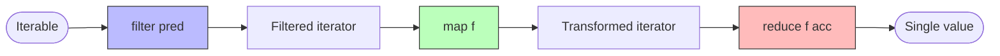
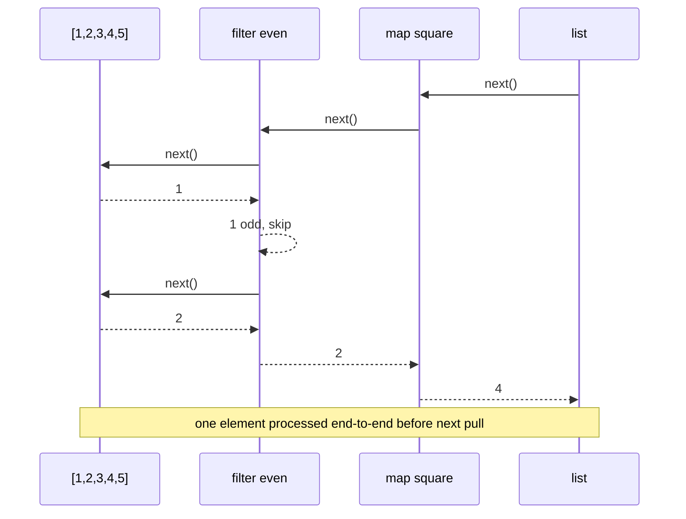

# 4. map, filter, reduce

> [!note] Why this note exists
> `map`, `filter`, and `reduce` are the **holy trinity** of functional programming — the three operations from which most list-transforming logic can be built. Python has all three, but the language has clearly chosen sides: `map` and `filter` are first-class builtins, while `reduce` was demoted to `functools` in Python 3. This note explains each in depth, compares them with the more Pythonic **comprehension** style, and gives you a decision framework for when to reach for which tool.

## Why It Matters

Almost every program does some combination of three things to a collection:
1. **Transform** each element (`map`).
2. **Select** a subset (`filter`).
3. **Combine** all elements into a single value (`reduce`).

These are the **three universal operations** on sequences. Lisp had them in 1958; Haskell has them today; Python has them too — but Python also has list comprehensions, generator expressions, and `sum`/`any`/`all`/`min`/`max`, which cover 95% of practical use cases more readably.

Understanding `map`/`filter`/`reduce` matters for three reasons:
- **You'll encounter them** in legacy code, in functional-style libraries (toolz, fn.py), and in codebases influenced by other languages.
- **They compose cleanly** — `map(f, filter(p, iter))` is a pipeline; the equivalent comprehension is `[[f(x) for x in iter if p(x)]]` which is fine but nests less gracefully.
- **They're lazy** in Python 3 — they return iterators, not lists. This makes them suitable for infinite or very large streams.

## Background

### The three operations, formally

- **`map(f, iterable)`** — applies `f` to each element; returns an iterator yielding `f(x)` for each `x`. Length-preserving.
- **`filter(p, iterable)`** — yields only those `x` for which `p(x)` is truthy. Length-decreasing.
- **`reduce(f, iterable, init=None)`** — folds the iterable into a single value by repeatedly applying `f(acc, x)`.

In mathematical notation:
- `map(f, [x1, x2, x3])` = `[f(x1), f(x2), f(x3)]`
- `filter(p, [x1, x2, x3])` = `[xi for xi in [x1, x2, x3] if p(xi)]`
- `reduce(f, [x1, x2, x3], init)` = `f(f(f(init, x1), x2), x3)`

### History in Python

- **Python 2**: `map`, `filter`, and `reduce` were all builtins. `map` and `filter` returned lists; `reduce` was a builtin too.
- **Python 3 (PEP 3104 / PEP 8)**: `map` and `filter` became lazy (return iterators). `reduce` was moved to `functools` — Guido van Rossum famously disliked it, writing *"I think dropping reduce() is a good thing"* because the same logic is more readable with a loop or a comprehension.

The result is a Python that **has** functional tools but nudges you toward comprehension style. Use `map`/`filter`/`reduce` when they're clearer; use comprehensions when they're clearer (which is most of the time).

## Main content

### `map(func, *iterables)`

```python
nums = [1, 2, 3, 4, 5]
squares = map(lambda x: x ** 2, nums)
list(squares)   # [1, 4, 9, 16, 25]
```

`map` returns an **iterator** in Python 3 — it's lazy. Iterating twice doesn't work:

```python
m = map(str, [1, 2, 3])
list(m)   # ['1', '2', '3']
list(m)   # []  — exhausted
```

#### Multiple iterables

`map` accepts multiple iterables; `func` must take that many arguments. Iteration stops at the shortest iterable:

```python
list(map(lambda x, y: x + y, [1, 2, 3], [10, 20, 30, 40]))
# [11, 22, 33]   — the fourth element of the second iterable is dropped
```

Use `itertools.zip_longest` if you want to pad instead of truncate.

#### `None` as the function

```python
list(map(None, [1, 2, 3], [4, 5, 6]))
# [(1, 4), (2, 5), (3, 6)]
```

Passing `None` makes `map` behave like `zip`. This is a Python 2 leftover and rarely idiomatic — use `zip` directly.

### `filter(predicate, iterable)`

```python
nums = [1, 2, 3, 4, 5, 6]
evens = filter(lambda x: x % 2 == 0, nums)
list(evens)   # [2, 4, 6]
```

`filter` returns an iterator yielding only the elements where `predicate(x)` is truthy.

#### `None` as the predicate

```python
values = [0, 1, "", "a", None, [], [1], False, True]
truthy = filter(None, values)
list(truthy)   # [1, 'a', [1], True]
```

Passing `None` filters out falsy values — useful for removing `None`/empty/zero from a list.

### `functools.reduce(func, iterable, initializer=None)`

```python
from functools import reduce

nums = [1, 2, 3, 4, 5]
product = reduce(lambda a, b: a * b, nums)
print(product)   # 120

# With initializer:
reduce(lambda a, b: a * b, nums, 1)    # 120 (same)
reduce(lambda a, b: a * b, [], 1)      # 1 (empty case is safe with init)
reduce(lambda a, b: a * b, [])         # TypeError — no init, empty iterable
```

`reduce` walks the iterable left to right, accumulating a result. The accumulator starts as `initializer` (if given) or as the first element.

#### Left vs right fold

Python's `reduce` is a **left fold**: `f(f(f(init, x1), x2), x3)`. There's no built-in right fold; you can simulate it:

```python
def reduce_right(f, iterable, init=None):
    items = list(iterable)
    items.reverse()
    if init is None:
        return reduce(lambda a, b: f(b, a), items)
    return reduce(lambda a, b: f(b, a), items, init)

# Subtraction is non-associative — left vs right fold differ:
reduce(lambda a, b: a - b, [1, 2, 3, 4])
# ((1 - 2) - 3) - 4 = -8

reduce_right(lambda a, b: a - b, [1, 2, 3, 4])
# 1 - (2 - (3 - 4)) = 1 - (2 - (-1)) = 1 - 3 = -2
```

Most use cases are associative (sum, product, max, min, set union), so left vs right doesn't matter.

### `map` + `filter` = pipeline

```python
nums = range(100)
result = map(
    lambda x: x ** 2,
    filter(lambda x: x % 2 == 0, nums)
)
# squares of even numbers from 0 to 99
```

Read inside-out: first filter, then map. The pipeline is lazy — nothing is computed until you iterate.

For more complex pipelines, the inside-out reading becomes painful. Two solutions:

#### Solution 1: comprehension (Pythonic)

```python
result = [x ** 2 for x in nums if x % 2 == 0]
```

Reads left-to-right, top-to-bottom. The Python community strongly prefers this for most cases.

#### Solution 2: toolz / itertools pipelines

```python
from toolz import pipe
result = pipe(
    nums,
    filter(lambda x: x % 2 == 0),
    map(lambda x: x ** 2),
    list,
)
```

`toolz.pipe` reads top-to-bottom — the natural data-flow direction. This is closer to Elixir/Elm/F# style.

### When `map`/`filter` beat comprehensions

Comprehensions are usually clearer, but `map`/`filter` win in three cases:

#### 1. You already have a named function

```python
# Comprehension:
[int(x) for x in strings]

# map:
map(int, strings)
```

`map(int, ...)` is shorter and the function is already named. The comprehension adds a `lambda x: int(x)`-style redundancy.

#### 2. You need lazy evaluation in a chain

```python
# This computes everything eagerly:
result = [f2(x) for x in [f1(x) for x in big_list if p(x)]]

# This is fully lazy:
result = list(map(f2, map(f1, filter(p, big_list))))
```

The lazy version processes one element at a time through the whole pipeline, which is memory-efficient for large inputs. (Note: a generator expression would also work: `(f2(f1(x)) for x in big_list if p(x))`.)

#### 3. Parallelism with `multiprocessing.Pool.map`

```python
from multiprocessing import Pool
with Pool(8) as pool:
    results = pool.map(heavy_compute, big_list)
```

`Pool.map` is the parallel version of `map`. No comprehension equivalent without a wrapper.

### When comprehensions win

#### 1. Multi-step transforms with intermediate variables

```python
# Comprehension — clear:
result = [
    format(process(item), precision=2)
    for item in items
    if is_valid(item)
]

# map/filter — nested and inside-out:
result = map(
    lambda x: format(process(x), precision=2),
    filter(is_valid, items)
)
```

#### 2. Conditions more complex than a single predicate

```python
# Comprehension:
result = [
    transform(item)
    for item in items
    if item.is_valid and item.priority > 5
]

# map/filter — needs two filters or a compound lambda:
result = map(
    transform,
    filter(lambda i: i.is_valid and i.priority > 5, items)
)
```

#### 3. You need the index

```python
# Comprehension with enumerate:
result = [transform(item, i) for i, item in enumerate(items)]

# map/filter — needs zip:
result = list(map(lambda pair: transform(pair[1], pair[0]), enumerate(items)))
```

### Common `reduce` patterns

`reduce` is the most powerful of the three — it can express `map`, `filter`, `sum`, `max`, `min`, `any`, `all`, and more. But with great power comes great unreadability. Use it sparingly.

#### `sum` is just `reduce(operator.add, ...)`

```python
from functools import reduce
import operator

reduce(operator.add, [1, 2, 3, 4, 5], 0)   # 15

# Equivalent:
sum([1, 2, 3, 4, 5])   # 15
```

`sum` is more readable. Always prefer it for addition.

#### `max` is `reduce(lambda a, b: a if a > b else b, ...)`

```python
reduce(lambda a, b: a if a > b else b, [3, 7, 2, 9, 1])
# 9

# Equivalent:
max([3, 7, 2, 9, 1])
```

Again, prefer the builtin.

#### `any` and `all` are reduces

```python
reduce(lambda a, b: a or b, [False, True, False])   # True
reduce(lambda a, b: a and b, [True, True, False])   # False

# Equivalent:
any([False, True, False])   # True
all([True, True, False])    # False
```

#### Group by key

```python
from collections import defaultdict
from functools import reduce

def group_by(items, key):
    def upd(acc, x):
        acc[key(x)].append(x)
        return acc
    return reduce(upd, items, defaultdict(list))

group_by(['apple', 'avocado', 'banana', 'cherry'], lambda s: s[0])
# {'a': ['apple', 'avocado'], 'b': ['banana'], 'c': ['cherry']}
```

But — `itertools.groupby` (when sorted) or a simple loop is clearer:

```python
from collections import defaultdict
groups = defaultdict(list)
for item in items:
    groups[key(item)].append(item)
```

#### Build a dict from pairs

```python
pairs = [('a', 1), ('b', 2), ('c', 3)]
result = reduce(lambda acc, p: {**acc, p[0]: p[1]}, pairs, {})
# {'a': 1, 'b': 2, 'c': 3}

# Better:
dict(pairs)
```

#### Flatten one level

```python
nested = [[1, 2], [3, 4], [5, 6]]
reduce(lambda a, b: a + b, nested, [])
# [1, 2, 3, 4, 5, 6]

# Better:
[item for sub in nested for item in sub]
# Or:
list(itertools.chain.from_iterable(nested))
```

The moral: most practical `reduce` uses have a more readable builtin or comprehension equivalent. Reach for `reduce` only when there's no such alternative.

## Mermaid: map/filter/reduce data flow



## Mermaid: lazy evaluation in a pipeline



In a lazy pipeline, each element flows through the whole chain before the next is pulled. Memory usage is O(1) regardless of input size.

## Code examples

### Word frequency (the classic)

```python
from functools import reduce

text = "the quick brown fox jumps over the lazy dog the fox runs"
words = text.split()

# Step 1: map each word to (word, 1)
pairs = map(lambda w: (w, 1), words)

# Step 2: reduce by counting
counts = reduce(
    lambda acc, pair: {**acc, pair[0]: acc.get(pair[0], 0) + pair[1]},
    pairs,
    {}
)
# {'the': 3, 'quick': 1, 'brown': 1, ...}
```

But the simpler version with `collections.Counter` is far clearer:

```python
from collections import Counter
counts = Counter(text.split())
```

### Cumulative sum

```python
from functools import reduce
from itertools import accumulate

nums = [1, 2, 3, 4, 5]

# With reduce — awkward, requires tracking a list:
def cumulative(acc, x):
    acc.append((acc[-1] if acc else 0) + x)
    return acc
reduce(cumulative, nums, [])   # [1, 3, 6, 10, 15]

# itertools.accumulate — clear:
list(accumulate(nums))   # [1, 3, 6, 10, 15]
```

### Composing functions

```python
from functools import reduce

def compose(*funcs):
    """compose(f, g, h)(x) == f(g(h(x)))"""
    return reduce(lambda f, g: lambda x: f(g(x)), funcs)

pipeline = compose(
    lambda x: x + 1,
    lambda x: x * 2,
    lambda x: x ** 2,
)
pipeline(3)   # ((3**2) * 2) + 1 = 19
```

This is a legitimate use of `reduce` — there's no builtin equivalent.

### Tree depth via reduce

```python
from functools import reduce

# In a tree where each node has a `children` list, compute depth:
def depth(node):
    if not node.children:
        return 1
    return 1 + max(depth(c) for c in node.children)

# Or with reduce (functional style):
def depth_reduce(node):
    if not node.children:
        return 1
    return 1 + reduce(max, (depth_reduce(c) for c in node.children))
```

The reduce version expresses "the max of depths" without an intermediate list. The `max(...)` generator version is more idiomatic.

### Lazy infinite pipeline

```python
from itertools import count, islice

def is_prime(n):
    return n > 1 and all(n % i for i in range(2, int(n**0.5) + 1))

primes = filter(is_prime, count(2))
first_10 = list(islice(primes, 10))
# [2, 3, 5, 7, 11, 13, 17, 19, 23, 29]
```

`count(2)` is an infinite iterator; `filter` is lazy; `islice` limits the output. This pattern is impossible with eager comprehensions.

## Common Pitfalls

> [!warning] `map`/`filter` return iterators, not lists
> In Python 2 they returned lists; in Python 3 they're lazy. If you index, slice, or iterate twice, you'll be surprised. Wrap in `list()` if you need a materialized list.

> [!warning] Iterator exhaustion
> ```python
> m = map(int, ['1', '2', '3'])
> list(m)   # [1, 2, 3]
> list(m)   # []  — exhausted
> ```
> If you need to iterate twice, materialize first or use `itertools.tee`.

> [!warning] `reduce` with empty iterable and no initial value
> `reduce(f, [])` raises `TypeError: reduce() of empty iterable with no initial value`. Always pass an explicit initial value when the iterable could be empty.

> [!warning] `reduce` for non-associative operations
> Subtraction, division, and other non-associative ops give different results depending on fold direction. Python's `reduce` is a left fold — be careful with non-associative functions.

> [!warning] Lambdas in `map`/`filter` are hard to debug
> A `lambda` shows as `<lambda>` in tracebacks. For non-trivial transforms, define a named function — your future self will thank you.

> [!warning] Side effects in `map`
> `map(print, items)` returns an iterator; if you never consume it, `print` is never called. This is a common bug in tutorials. Use a `for` loop for side effects, or wrap in `list()`/`any()`/`collections.deque(..., maxlen=0)`.

> [!warning] `map` with multiple iterables of different lengths
> `map` stops at the shortest. If you need padding, use `itertools.zip_longest` instead.

> [!warning] `filter(None, ...)` removes all falsy values
> `filter(None, [0, 1, 2, None, 3])` returns `[1, 2, 3]` — `0` is removed too! If you only want to drop `None`, use `filter(lambda x: x is not None, ...)`.

## Tips and Tricks

> [!tip] Use comprehensions by default
> For most cases, `[f(x) for x in items if p(x)]` is more readable than `map(f, filter(p, items))`. Reserve `map`/`filter` for cases where they're clearly better (named function, lazy pipeline, parallelism).

> [!tip] Reach for `sum`, `any`, `all`, `max`, `min`, `len` first
> These builtins cover 90% of `reduce` use cases. Only use `reduce` when no builtin fits.

> [!tip] Generator expressions for lazy pipelines
> `(f(x) for x in items if p(x))` is lazy and reads more naturally than `map(f, filter(p, items))`. Use it.

> [!tip] `operator` module for common operations
> ```python
> from operator import add, mul, itemgetter, attrgetter
> reduce(add, nums)         # sum
> reduce(mul, nums, 1)      # product
> map(itemgetter(1), pairs) # second element of each pair
> ```
> Cleaner than lambdas.

> [!tip] `itertools.accumulate` for running totals
> ```python
> list(accumulate([1, 2, 3, 4]))   # [1, 3, 6, 10]
> list(accumulate(nums, mul))      # [1, 2, 6, 24]  -- running product
> ```

> [!tip] `more_itertools` for higher-level pipelines
> The third-party `more_itertools` library adds `chunked`, `windowed`, `partition`, `unique_everseen`, and dozens of other tools that compose cleanly with `map`/`filter`.

> [!tip] Profile before optimizing with `map`
> `map(f, items)` can be marginally faster than `[f(x) for x in items]` because it avoids the per-iteration `LOAD_FAST` of the loop variable. But the difference is usually small. Measure before optimizing for it.

> [!tip] `starmap` for unpacking
> ```python
> from itertools import starmap
> pairs = [(2, 3), (4, 5), (6, 7)]
> list(starmap(pow, pairs))   # [8, 1024, 279936]
> ```
> Like `map`, but unpacks each tuple as separate args.

## Advanced patterns

### Combining with `itertools`

The `itertools` module is the natural companion to `map`/`filter`/`reduce`. Together they form a complete functional pipeline toolkit:

```python
from itertools import (
    chain, takewhile, dropwhile, groupby,
    accumulate, starmap, islice, tee,
)
import operator

# chain — concatenate iterables:
list(chain([1, 2], [3, 4], [5]))   # [1, 2, 3, 4, 5]

# takewhile / dropwhile:
list(takewhile(lambda x: x < 5, [1, 4, 6, 3, 2]))   # [1, 4]
list(dropwhile(lambda x: x < 5, [1, 4, 6, 3, 2]))   # [6, 3, 2]

# groupby (must sort first):
data = sorted(['apple', 'avocado', 'banana', 'apricot'], key=lambda s: s[0])
for letter, items in groupby(data, key=lambda s: s[0]):
    print(letter, list(items))
# a ['apple', 'apricot', 'avocado']
# b ['banana']

# accumulate (cumulative sum, product, etc.):
list(accumulate([1, 2, 3, 4]))                  # [1, 3, 6, 10]
list(accumulate([1, 2, 3, 4], operator.mul))    # [1, 2, 6, 24]

# starmap — unpacking map:
list(starmap(pow, [(2, 3), (4, 2)]))   # [8, 16]

# islice — slicing an iterator:
list(islice(count(), 5))    # [0, 1, 2, 3, 4]  from infinite

# tee — duplicate an iterator:
a, b = tee(range(5))
list(a), list(b)   # [0, 1, 2, 3, 4], [0, 1, 2, 3, 4]
```

### `toolz` and `cytoolz` — extended functional toolkit

The third-party `toolz` library (and its Cython port `cytoolz`) provides higher-level functional tools that compose with `map`/`filter`/`reduce`:

```python
from toolz import pipe, curry, compose, memoize, unique, frequencies, merge_with

# pipe — top-to-bottom data flow:
result = pipe(
    [1, 2, 3, 4, 5],
    filter(lambda x: x % 2 == 0),
    map(lambda x: x ** 2),
    sum,
)
# 4 + 16 = 20

# curry — auto-currying:
@curry
def add(a, b, c):
    return a + b + c

add(1)(2)(3)        # 6
add(1, 2)(3)        # 6
add(1)(2, 3)        # 6

# unique — dedupe preserving order:
list(unique([1, 2, 1, 3, 2, 4]))   # [1, 2, 3, 4]

# frequencies — Counter equivalent:
frequencies(['a', 'b', 'a', 'c', 'b', 'a'])
# {'a': 3, 'b': 2, 'c': 1}

# merge_with — combine dicts by key:
merge_with(sum, [{'a': 1, 'b': 2}, {'a': 3, 'c': 4}])
# {'a': 4, 'b': 2, 'c': 4}
```

### Function composition

`reduce` is the natural way to compose an arbitrary number of functions:

```python
from functools import reduce

def compose(*funcs):
    """compose(f, g, h)(x) == f(g(h(x)))"""
    if not funcs:
        return lambda x: x
    return reduce(lambda f, g: lambda x: f(g(x)), funcs)

# Or with proper identity seed:
def compose2(*funcs):
    return reduce(lambda f, g: lambda x: f(g(x)), funcs, lambda x: x)

# Usage:
pipeline = compose(
    str,
    lambda x: x * 2,
    int,
)
pipeline("21")   # str(int("21") * 2) = "42"
```

The `toolz.compose` and `cytoolz.compose` functions provide this with better performance and readability.

### Custom accumulators

`reduce` is the universal accumulator. Here's a moving average:

```python
from functools import reduce
from collections import deque

def moving_average(values, window):
    """Compute moving average using reduce."""
    def update(state, x):
        q, total = state
        q.append(x)
        total += x
        if len(q) > window:
            total -= q.popleft()
        return (q, total)

    initial = (deque(maxlen=window), 0)
    q, total = reduce(update, values, initial)
    # Note: this returns the final state only. For a stream, use a generator.
```

For real streaming work, prefer a generator:

```python
def moving_average_gen(values, window):
    q = deque(maxlen=window)
    total = 0
    for x in values:
        q.append(x)
        total += x
        if len(q) > window:
            total -= q[0]   # deque will auto-popleft
        if len(q) == window:
            yield total / window

list(moving_average_gen([1, 2, 3, 4, 5], 3))
# [2.0, 3.0, 4.0]
```

This is more Pythonic — generators express "stream of values" naturally, while `reduce` expresses "single accumulated value."

### Performance: lazy vs eager

```python
import time

# Eager (list comprehension):
def eager():
    return [x ** 2 for x in range(10**7)]

# Lazy (generator expression):
def lazy():
    return (x ** 2 for x in range(10**7))

# Memory: eager uses ~80MB (list of 10M ints). Lazy uses O(1).
# Time: lazy is slightly faster to "create" (just builds the gen object);
#       both take similar total time when consumed.
```

For large or infinite data, lazy pipelines are essential. For small data, eager is simpler and the memory cost is negligible.

## Active Recall

1. What does `map(f, [1,2,3])` return? What's its type?
2. What does `filter(None, [0, 1, None, 2])` return? Why is this sometimes surprising?
3. `reduce(f, [], 0)` returns what? What about `reduce(f, [])`?
4. Is `reduce` a left fold or right fold? How would you implement a right fold?
5. When does `map(f, [1,2,3], [10,20,30,40])` stop? Why?
6. Write `[x**2 for x in range(10) if x % 2 == 0]` using `map` and `filter`.
7. Why was `reduce` demoted to `functools` in Python 3?
8. Name three builtins that are equivalent to common `reduce` patterns.
9. What's the memory characteristic of a `map`/`filter` pipeline vs a list comprehension?
10. How would you compose three functions `f`, `g`, `h` using `reduce`?

## Next Steps

- [[1. functools Deep Dive]] — `reduce`'s home module, plus `partial` (great for cleaning up `map` calls).
- [[2. partial and singledispatch]] — `partial(f, arg)` is the cleanest way to specialize a function for `map`.
- [[9. Standard Library Deep Dive/5. itertools]] — `accumulate`, `starmap`, `chain`, `takewhile`, `dropwhile` — the proper home for most "advanced `map`/`filter`" needs.
- [[10. Pythonic Programming/1. Comprehensions Deep Dive]] — the Pythonic alternative for most `map`/`filter` cases.
- [[10. Pythonic Programming/6. Higher Order Functions]] — broader HOF context.
- [[15. Memory and Performance/5. Optimization Techniques]] — when lazy pipelines actually save memory.
