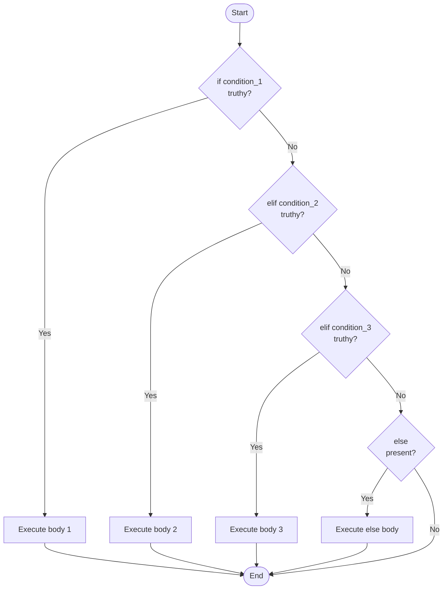

# 1. if-elif-else

## Why This Matters

Conditionals are the most fundamental control-flow primitive in any programming language. They let a program make decisions: "if this is true, do that; otherwise do something else." Every non-trivial Python program contains dozens — usually thousands — of `if` statements. Yet even experienced programmers make mistakes with them: confusing `=` and `==`, misusing truthiness, nesting too deep, or skipping the `else` branch when it would make intent clearer.

This note covers Python's `if`/`elif`/`else` syntax (significantly indented, no braces), truthiness rules (which govern what counts as "true"), the **conditional expression** (ternary operator), nested and chained conditionals, common pitfalls, and Python-specific idioms like the `if-elif-elif` ladder, the `if-else` expression, and the `if x is None` sentinel pattern.

---

## Background

Python's conditional syntax is straightforward:

```python
if condition:
    body
elif another_condition:
    body
else:
    body
```

Key facts:

- **`if`** is required.
- **`elif`** (short for "else if") is optional and can repeat.
- **`else`** is optional and can appear at most once.
- Each condition must be a Python expression that's evaluated for **truthiness**.
- A colon `:` terminates each header line.
- The body is the next block of indented statements.
- Only the first matching branch is executed; the rest are skipped.

There is no `switch` statement in classic Python — that role was traditionally filled by `if-elif` ladders or by dictionary dispatch. Python 3.10 introduced **structural pattern matching** (`match`/`case`), which we cover in [[2. Match-Case (Python 3.10+)]].

---

## Basic Syntax

### Simple `if`

```python
if score > 90:
    grade = "A"
```

### `if`-`else`

```python
if score >= 60:
    grade = "pass"
else:
    grade = "fail"
```

### `if`-`elif`-`else` ladder

```python
if score >= 90:
    grade = "A"
elif score >= 80:
    grade = "B"
elif score >= 70:
    grade = "C"
elif score >= 60:
    grade = "D"
else:
    grade = "F"
```

The conditions are evaluated top-to-bottom. As soon as one is truthy, its body runs and the rest are skipped. This is why you can write `score >= 80` rather than `score >= 80 and score < 90` — by the time we reach the `elif`, we already know `score < 90`.

### One-line `if` (discouraged)

```python
if x > 0: print("positive")
```

PEP 8 discourages this except for the shortest cases. It's hard to read and breaks debugging breakpoints.

### Compound conditions

```python
if age >= 18 and age <= 65:
    ...

if 18 <= age <= 65:    # chained comparison — equivalent, idiomatic
    ...

if role in ("admin", "owner"):
    can_delete = True
```

---

## Truthiness

`if x:` evaluates `bool(x)`. Recall from [[5. Type Conversion]]:

**Falsy**: `False`, `None`, `0`, `0.0`, `0j`, `""`, `[]`, `()`, `{}`, `set()`, `b""`, `range(0)`, custom objects with `__bool__` returning `False` or `__len__` returning 0.

**Truthy**: everything else, including `"False"`, `"0"`, `[0]`, `[[]]`, `" "`, `0.000001`, and `float("nan")`.

```python
items = [1, 2, 3]
if items:                # ← preferred over `if len(items) > 0:`
    print("has items")

user = None
if user is not None:     # ← preferred over `if user:` when None ≠ empty
    print(user.name)
```

> [!warning] None vs empty
> `if x:` treats `None` and `[]` the same (both falsy). If you need to distinguish, use `if x is not None:`. Otherwise, you'll silently treat "no value" the same as "empty value" — a classic source of bugs.

---

## Conditional Expression (Ternary)

Python has a ternary operator, but the syntax is **expression-then-condition**:

```python
value = true_expr if condition else false_expr
```

Examples:

```python
status = "adult" if age >= 18 else "minor"

sign = 1 if x > 0 else (-1 if x < 0 else 0)   # nested — readable up to 1 level

# Idiomatic default
name = provided_name or "anonymous"
```

This is the only conditional *expression* in Python — it produces a value. The `if`/`elif`/`else` *statements* don't produce values.

### Comparison with other languages

| Language | Ternary syntax |
|----------|---------------|
| C, C++, Java, JS | `cond ? a : b` |
| Python | `a if cond else b` |
| Rust | `if cond { a } else { b }` |

Python's order takes getting used to: the *value if true* comes first, then the condition, then the *value if false*. Read it aloud as "a, if cond, else b".

> [!tip] Don't nest ternaries deeply
> `a if cond1 else b if cond2 else c if cond3 else d` is technically legal but unreadable. Use a regular `if-elif-else` block.

---

## Nested Conditionals

You can nest `if` statements inside other `if` statements:

```python
if user.is_active:
    if user.is_admin:
        show_admin_panel()
    else:
        show_user_panel()
else:
    show_login_screen()
```

Deep nesting hurts readability. Refactor with **early returns** (guard clauses) or by extracting helper functions:

```python
def route_user(user):
    if not user.is_active:
        return show_login_screen()
    if user.is_admin:
        return show_admin_panel()
    return show_user_panel()
```

The "guard clause" pattern is widely preferred. It keeps the happy path at the top level and pushes edge cases to the bottom.

---

## Pattern: Sentinel Checks

`if x is None:` is the standard way to check for the absence of a value:

```python
def find_user(user_id):
    user = db.fetch(user_id)
    if user is None:
        raise KeyError(user_id)
    return user
```

Never use `if x == None:` — PEP 8 says `is`. The `is` comparison is faster (identity check vs. equality check) and works even if `__eq__` is overridden weirdly.

Other sentinel-like patterns:

```python
if x is True: ...       # strict True check (not 1, not "yes")
if x is NotImplemented: ...
if x is Ellipsis: ...
```

---

## Pattern: Dictionary Dispatch

When an `if-elif` ladder is checking the value of one expression and dispatching to functions, a dict is often cleaner:

```python
# if-elif ladder
def handle(action):
    if action == "create":
        create()
    elif action == "read":
        read()
    elif action == "update":
        update()
    elif action == "delete":
        delete()
    else:
        raise ValueError(f"unknown action: {action}")

# dict dispatch
ACTIONS = {"create": create, "read": read, "update": update, "delete": delete}

def handle(action):
    try:
        ACTIONS[action]()
    except KeyError:
        raise ValueError(f"unknown action: {action}")
```

Dictionary dispatch is faster for many cases (O(1) lookup vs O(n) ladder), easier to extend (just add to the dict), and clearer when each branch is a single function call.

---

## Flowchart



---

## Annotated Code Examples

### Example 1: BMI calculator

```python
def bmi_category(bmi):
    """Classify BMI per WHO categories."""
    if bmi < 18.5:
        return "underweight"
    elif bmi < 25:
        return "normal"
    elif bmi < 30:
        return "overweight"
    else:
        return "obese"
```

### Example 2: Guard clause

```python
def transfer(amount, from_account, to_account):
    if amount <= 0:
        raise ValueError("amount must be positive")
    if from_account.balance < amount:
        raise InsufficientFunds(from_account, amount)
    if from_account.frozen or to_account.frozen:
        raise AccountFrozen()

    from_account.balance -= amount
    to_account.balance += amount
```

### Example 3: Ternary for default

```python
def greet(name=None):
    name = name if name is not None else "Guest"
    print(f"Hello, {name}!")

# Even better — use `or`:
def greet(name=None):
    print(f"Hello, {name or 'Guest'}!")
```

### Example 4: Avoid `=` vs `==` confusion

In Python, `if x = 5:` is a `SyntaxError`, so you cannot accidentally assign. (In C, this is a famous bug.) But you can still mess up:

```python
if x == True: ...      #  compares to True, fails for x = 1
if x: ...              #  correct
```

### Example 5: Truthiness in collections

```python
def process(items):
    if not items:                  # idiomatic empty check
        return []
    return [transform(x) for x in items]
```

### Example 6: Combined conditions with short-circuit

```python
if user and user.is_admin:        # short-circuit: avoids AttributeError
    ...
```

### Example 7: Multiple comparisons

```python
# Bad
if role == "admin" or role == "owner" or role == "superadmin":
    ...

# Good
if role in ("admin", "owner", "superadmin"):
    ...

# Or for sets:
ADMIN_ROLES = {"admin", "owner", "superadmin"}
if role in ADMIN_ROLES:
    ...
```

---

## Conditional Expressions in Lambdas and Comprehensions

The conditional expression `a if cond else b` appears in many contexts beyond statements:

```python
# In a lambda
classify = lambda x: "even" if x % 2 == 0 else "odd"

# In a list comprehension (transform based on condition)
["even" if x % 2 == 0 else "odd" for x in range(5)]
# ['even', 'odd', 'even', 'odd', 'even']

# In a dict comprehension
{x: ("positive" if x > 0 else "non-positive") for x in [-2, -1, 0, 1, 2]}
# {-2: 'non-positive', -1: 'non-positive', 0: 'non-positive', 1: 'positive', 2: 'positive'}

# In an assignment
status = "ok" if error_count == 0 else "error"
```

When you see `a if cond else b` inside a comprehension, remember:

- The `if` is **inside the output expression**: it transforms each item.
- An `if` at the **end of the comprehension** (after the `for`): it filters items.

```python
[x if x > 0 else 0 for x in data]   # transform: negatives become 0
[x for x in data if x > 0]          # filter: negatives removed
```

These look similar but are very different. See [[6. Comprehensions]].

## Conditional Assignment Idioms

Python has several idioms for "default if missing":

```python
# 1. Ternary
name = provided if provided is not None else "anonymous"

# 2. `or` — works for any falsy value (not just None)
name = provided or "anonymous"

# 3. `if-else` statement
if provided is None:
    name = "anonymous"
else:
    name = provided

# 4. Walrus (Python 3.8+) — useful in conditions
if (name := get_name()) is not None:
    use(name)
else:
    use("anonymous")
```

Choose based on what "missing" means. If only `None` counts as missing, use `is not None`. If any falsy value (None, empty string, empty list, 0) counts, use `or`.

## Branching on Type

For type-based dispatch, use `isinstance`:

```python
def to_str(value):
    if isinstance(value, str):
        return value
    elif isinstance(value, (int, float)):
        return str(value)
    elif isinstance(value, (list, tuple)):
        return ", ".join(to_str(v) for v in value)
    elif value is None:
        return ""
    else:
        return repr(value)
```

For more complex type-based dispatch, consider:

- `functools.singledispatch` — dispatches on the first argument's type.
- `match`/`case` with class patterns (Python 3.10+) — see [[2. Match-Case (Python 3.10+)]].
- Polymorphism via methods — usually cleaner than `if isinstance` chains.

## Common Pitfalls

### 1. `=` vs `==`

```python
if x = 5: ...        # SyntaxError in Python (good!)
if x == 5: ...       # 
```

Python protects you from the classic C bug. But you can still write `if x == True` when you meant `if x:`.

### 2. Comparing to `True`/`False`/`None` with `==`

```python
if x == None: ...    # works but PEP 8 says: use `is`
if x is None: ...    # 
```

### 3. Treating `None` like empty

```python
def f(x):
    if x: ...          #  None and [] both fail
    if x is not None: ...  #  distinguishes
```

### 4. Using `if` for what should be a dict lookup

```python
# Bad
if op == "add": return a + b
elif op == "sub": return a - b
elif op == "mul": return a * b
elif op == "div": return a / b

# Better
import operator
OPS = {"add": operator.add, "sub": operator.sub, "mul": operator.mul, "div": operator.truediv}
return OPS[op](a, b)
```

### 5. Deep nesting

```python
# Bad
if a:
    if b:
        if c:
            do_work()

# Better — combine
if a and b and c:
    do_work()

# Or — guard clause
if not (a and b and c):
    return
do_work()
```

### 6. Misusing `elif` when you mean independent `if`s

```python
# These branches are mutually exclusive — elif is right
if grade >= 90: level = "A"
elif grade >= 80: level = "B"

# These are independent — should be separate ifs
if user.is_admin: enable_admin()
elif user.is_mod: enable_mod()
# The elif means a user who is both admin and mod only gets admin.
# If that's intended, OK. If not, use `if` for both.
```

### 7. Forgetting the colon

```python
if x > 0          # SyntaxError: expected ':'
    do_thing()
```

### 8. Wrong indentation

```python
if x > 0:
print("positive")    # IndentationError
```

### 9. Mutable default check

```python
# Default arg bug
def f(items=[]):
    if items:          # stateful! see [[3. Default and Keyword Arguments]]
        ...
```

### 10. Truthy strings you didn't mean

```python
if "false": ...        # truthy — non-empty string
if "0": ...            # truthy — non-empty string
if " ": ...            # truthy — whitespace is non-empty
```

---

## Tips and Tricks

- **Prefer `if x:` over `if len(x) > 0:`** — Pythonic and works for any container.
- **Prefer `if x is not None:`** when distinguishing missing from empty.
- **Use `in` for membership** rather than chained `or` checks.
- **Use ternary for simple value selection**, not for side effects.
- **Guard clauses beat deep nesting** — keep the happy path unindented.
- **Dictionary dispatch** for many mutually-exclusive cases.
- **Short-circuit** with `and`/`or` to avoid AttributeError on possibly-None objects.
- **Always include `else`** when the default case is meaningful (even if just a comment).
- **Use `assert` for invariants, not for production checks** — asserts are stripped with `-O`.
- **Combine conditions with parentheses** for clarity: `if (a or b) and c:`.

---

## Active Recall

1. Write the syntax of an `if-elif-else` ladder. Which parts are optional?
2. What does it mean for a value to be "truthy" in Python? List all the falsy values.
3. Why is `if x is not None:` safer than `if x:` when checking for missing values?
4. Write a Python ternary expression and explain its evaluation order.
5. What is a guard clause, and why is it preferred over deep nesting?
6. When would you use a dictionary dispatch instead of an `if-elif` ladder?
7. Why does Python raise `SyntaxError` for `if x = 5:`? What bug does this prevent?
8. Show how `if x == True:` differs from `if x:`.
9. Explain how `if a and b and c:` short-circuits.
10. What's the problem with this code: `if op == "+": ... elif op == "-": ...`?
11. Why does PEP 8 recommend `is` over `==` for None?
12. Show a refactoring that flattens a triple-nested `if` into a guard clause.

---

## Next Steps

- Read [[2. Match-Case (Python 3.10+)]] for structural pattern matching — Python's modern alternative to long `if-elif` ladders.
- See [[3. while Loops]] and [[4. for Loops and Iterables]] for repetition.
- See [[5. break, continue, pass]] for finer control inside loops.
- See [[6. Comprehensions]] for declarative filtering — a powerful alternative to `if` inside loops.
- The conditional expression returns a value — combine it with [[6. Lambda Functions]] in Chapter 3.
