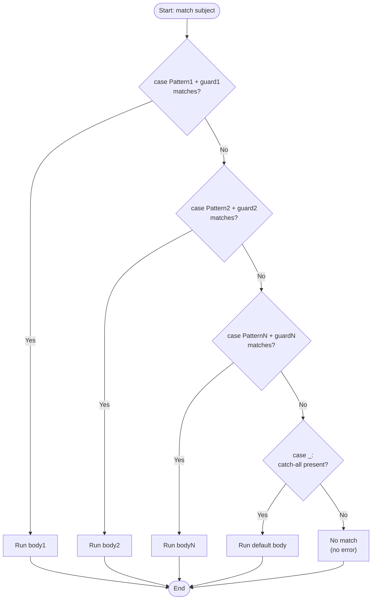

# 2. Match-Case (Python 3.10+)

## Why This Matters

For 30 years, Python had no `switch` statement. The standard idiom was either an `if-elif` ladder or a dictionary dispatch. In Python 3.10 (October 2021), PEP 634 introduced **structural pattern matching** — the `match` and `case` keywords. This is **not** just a `switch`: it is a full-featured pattern-matching system borrowed from ML languages (OCaml, Haskell, Scala, Rust). It can match literals, capture variables, destructure sequences and mappings, match class attributes, and combine these with guards (`if` clauses).

Mastering `match`/`case` lets you write code that handles complex data shapes — JSON, ASTs, command parsers, tagged unions — far more clearly than nested `if`s. It is the most significant addition to Python's control-flow toolbox since comprehensions.

---

## Background

The `match` statement evaluates an expression (the **subject**) and tries to match it against one or more **patterns** introduced by `case`. When a pattern matches, the corresponding block runs. If no pattern matches, execution falls through (no error unless you add a final `case _:` catch-all).

```python
match subject:
    case Pattern1:
        body1
    case Pattern2:
        body2
    case _:
        default_body
```

The `_` is the **wildcard** pattern — it matches anything and is the catch-all (analogous to `default:` in C's switch or `else` in an if-elif ladder).

Key differences from C-style `switch`:

- **No fall-through.** Each `case` runs at most one body. No `break` needed.
- **Patterns, not just values.** You can destructure tuples, lists, dicts, class attributes.
- **Variable capture.** A pattern can bind variables that you then use in the body.
- **Guards.** A `case` can have an `if` clause for additional checks.

`match` is a **soft keyword** — you can still use `match` and `case` as variable names elsewhere. The compiler disambiguates by context.

---

## Literal Patterns

The simplest case: match a specific value.

```python
def http_status(code):
    match code:
        case 200:
            return "OK"
        case 404:
            return "Not Found"
        case 500:
            return "Internal Server Error"
        case _:
            return f"Unknown code: {code}"
```

This is the closest equivalent to a C `switch`. But unlike `switch`, `match` works with any type — strings, tuples, even `None`:

```python
match command:
    case "quit":
        return
    case "help":
        print_help()
    case None:
        print("No command given")
    case _:
        run_command(command)
```

---

## Variable Capture (and the Captured-Value Trap)

A bare name in a pattern is a **capture pattern** — it matches anything and binds the value to that name:

```python
match point:
    case (0, 0):
        print("origin")
    case (0, y):
        print(f"on y-axis at {y}")
    case (x, 0):
        print(f"on x-axis at {x}")
    case (x, y):
        print(f"point at ({x}, {y})")
```

Here, `x` and `y` are *variables* — they capture the corresponding element. The first `case` matches only the literal `(0, 0)`. The next two match points on the axes. The last matches any 2-tuple.

> [!danger] Capture patterns match anything
> A bare name *always matches*. So:
>
> ```python
> match x:
>     case 0:
>         print("zero")
>     case my_value:        # ← matches ANYTHING, captures x as my_value
>         print(my_value)
> ```
>
> If you wanted to match the *value* of a variable `my_value`, you can't — you must use a **value pattern** (dotted name) like `Enum.SOMETHING` or compare explicitly with a guard.

### Value patterns (dotted names)

To match against a named constant, use a dotted name — typically an `Enum` member or class attribute:

```python
from enum import Enum

class Color(Enum):
    RED = 1
    GREEN = 2
    BLUE = 3

match color:
    case Color.RED:
        print("red")
    case Color.GREEN:
        print("green")
    case Color.BLUE:
        print("blue")
```

`Color.RED` is a *value pattern* because of the dot. Bare `RED` would be a *capture pattern*.

---

## Sequence Patterns

You can match lists, tuples, and other sequences by shape:

```python
match collection:
    case []:
        print("empty")
    case [single]:
        print(f"one item: {single}")
    case [first, second]:
        print(f"two items: {first}, {second}")
    case [first, *rest]:
        print(f"first: {first}, rest: {rest}")
```

Notes:

- Square brackets `[]` match any sequence (list, tuple, range, etc.) by **shape**, regardless of the actual type. (Strings are *not* matched as sequences here — they would need explicit handling.)
- The `*rest` syntax captures zero or more remaining items into a list.
- Round parentheses `()` work the same way for tuple-shape patterns: `case (x, y):` matches a 2-tuple.

```python
match shape:
    case (x, y):
        print(f"2D: {x}, {y}")
    case (x, y, z):
        print(f"3D: {x}, {y}, {z}")
```

---

## Mapping Patterns

You can match dicts by key presence (and capture the corresponding values):

```python
match config:
    case {"host": host, "port": port}:
        print(f"connecting to {host}:{port}")
    case {"socket": path}:
        print(f"using unix socket {path}")
    case {}:
        print("empty config")
```

Notes:

- Mapping patterns match if the listed keys are present (extra keys are OK).
- `**rest` captures remaining keys into a dict.
- `{}` matches any mapping, even non-empty ones.

```python
match config:
    case {"host": host, **rest}:
        print(f"host: {host}, rest: {rest}")
```

---

## Class Patterns

You can match instances of a class and destructure their attributes:

```python
class Point:
    def __init__(self, x, y):
        self.x = x
        self.y = y

match p:
    case Point(x=0, y=0):
        print("origin")
    case Point(x=0, y=y):
        print(f"on y-axis at {y}")
    case Point(x=x, y=0):
        print(f"on x-axis at {x}")
    case Point(x=x, y=y):
        print(f"point at ({x}, {y})")
```

For positional patterns, the class needs `__match_args__`:

```python
class Point:
    __match_args__ = ("x", "y")
    def __init__(self, x, y):
        self.x, self.y = x, y

match p:
    case Point(0, 0):
        print("origin")
    case Point(0, y):
        print(f"on y-axis at {y}")
    case Point(x, y):
        print(f"point at ({x}, {y})")
```

`@dataclass` sets `__match_args__` automatically:

```python
from dataclasses import dataclass

@dataclass
class Point:
    x: int
    y: int

match p:
    case Point(0, 0):
        ...
```

---

## Guard Clauses (`if`)

A `case` can have an `if` clause — a *guard* that must also be truthy:

```python
match point:
    case (x, y) if x == y:
        print("on diagonal")
    case (x, y) if x > 0 and y > 0:
        print("in first quadrant")
    case (x, y):
        print(f"elsewhere: ({x}, {y})")
```

The guard runs *after* the pattern matches. Variables captured by the pattern are in scope inside the guard.

---

## OR Patterns (`|`)

Combine multiple patterns with `|`:

```python
match status:
    case 200 | 201 | 202:
        print("success")
    case 400 | 404:
        print("client error")
    case 500 | 502 | 503:
        print("server error")
    case _:
        print("other")
```

You can also bind captured values across `|` — but only if all alternatives bind the same names:

```python
match event:
    case Click(x=x, y=y) | Drag(x=x, y=y):
        print(f"at ({x}, {y})")
```

---

## Nested Patterns

Patterns compose arbitrarily:

```python
match command:
    case ("move", Point(x=x, y=y)):
        move_to(x, y)
    case ("draw", [Point(x=x, y=y), *rest]):
        draw_line(x, y, rest)
    case ("quit",):
        shutdown()
```

This is where `match` shines: it scales to deeply-nested data shapes that would be unreadable as nested `if`s.

---

## Decision Flow



Patterns are tried **top to bottom**; the first match wins. There is no fall-through between cases.

---

## Annotated Code Examples

### Example 1: HTTP method dispatch

```python
def handle_request(method, path):
    match (method, path):
        case ("GET", "/"):
            return index()
        case ("GET", "/users"):
            return list_users()
        case ("GET", "/users/" + user_id):
            return get_user(user_id)
        case ("POST", "/users"):
            return create_user()
        case ("DELETE", "/users/" + user_id):
            return delete_user(user_id)
        case _:
            return not_found(method, path)
```

Note: `"GET"` is a literal pattern because of the quotes; `user_id` (without quotes) is a capture.

### Example 2: AST interpreter

```python
def eval_expr(node):
    match node:
        case Num(value):
            return value
        case Add(left, right):
            return eval_expr(left) + eval_expr(right)
        case Mul(left, right):
            return eval_expr(left) * eval_expr(right)
        case Neg(operand):
            return -eval_expr(operand)
        case _:
            raise ValueError(f"unknown node: {node}")
```

### Example 3: JSON event handling

```python
def handle_event(event):
    match event:
        case {"type": "message", "text": text, "user": user}:
            print(f"{user}: {text}")
        case {"type": "reaction", "emoji": emoji, "user": user}:
            print(f"{user} reacted {emoji}")
        case {"type": "ping"}:
            send_pong()
        case {"type": unknown_type}:
            log(f"unknown event type: {unknown_type}")
        case _:
            log(f"malformed event: {event}")
```

### Example 4: Guard for refined matches

```python
def classify(temp):
    match temp:
        case t if t < 0:
            return "freezing"
        case t if t < 15:
            return "cold"
        case t if t < 25:
            return "mild"
        case t if t < 35:
            return "warm"
        case _:
            return "hot"
```

### Example 5: OR pattern

```python
match command:
    case "q" | "quit" | "exit":
        return
    case "h" | "help" | "?":
        show_help()
    case _:
        run(command)
```

### Example 6: Pattern with `*rest`

```python
match argv[1:]:
    case []:
        run_interactive()
    case ["--help"]:
        show_help()
    case ["--version"]:
        show_version()
    case ["run", *files]:
        run_on(files)
    case _:
        print(f"unknown args: {argv[1:]}")
```

---

## Pattern Matching vs `if-elif` — When to Use Which

`match`/`case` shines when:

- You're dispatching on the **shape** of structured data (tuples, dicts, class instances).
- You need to **capture parts** of the matched value.
- You have many cases with similar but distinct patterns.
- You're writing an interpreter, parser, or event handler.

`if-elif` is better when:

- Conditions are **arbitrary boolean expressions**, not pattern matches.
- You're comparing against **ranges** (`score >= 90`).
- You only have 2-3 simple cases.
- You need to support Python < 3.10.

Example where `match` wins:

```python
# Event handler with structured data
match event:
    case {"type": "click", "x": x, "y": y}:
        handle_click(x, y)
    case {"type": "key", "key": "Escape"}:
        close()
    case {"type": "scroll", "delta": d}:
        scroll(d)
    case {"type": "ping"}:
        send_pong()
    case _:
        log(f"unknown: {event}")
```

The same in `if-elif`:

```python
if isinstance(event, dict) and event.get("type") == "click":
    handle_click(event["x"], event["y"])
elif isinstance(event, dict) and event.get("type") == "key" and event.get("key") == "Escape":
    close()
elif isinstance(event, dict) and event.get("type") == "scroll":
    scroll(event["delta"])
elif isinstance(event, dict) and event.get("type") == "ping":
    send_pong()
else:
    log(f"unknown: {event}")
```

The `match` version is shorter, clearer, and the compiler checks for exhaustiveness (if you use enums).

## Exhaustiveness Checking

If you `match` on an `Enum` and don't include a `case _:` catch-all, some linters can warn you about missing cases. This makes refactoring safer — when you add a new enum member, the linter reminds you to handle it.

```python
from enum import Enum

class Color(Enum):
    RED = 1
    GREEN = 2
    BLUE = 3

def handle(color: Color):
    match color:
        case Color.RED: ...
        case Color.GREEN: ...
        # Missing Color.BLUE! Linter can warn.
```

Without `match`, you'd use a dictionary dispatch (also catches missing cases at runtime via `KeyError`) or a chain of `if-elif` (silent on missing cases).

## Pattern Matching in the Wild

`match`/`case` is increasingly common in:

- **AST processing** — walking syntax trees with class patterns.
- **JSON / API payloads** — destructuring dicts with mapping patterns.
- **CLI argument parsing** — sequence patterns for `sys.argv`.
- **State machines** — matching on `(state, event)` tuples.
- **Error handling** — matching on exception types and attributes.

The official `pytest`, `black`, and `mypy` codebases use `match`/`case` heavily since Python 3.10 became the minimum supported version.

## Common Pitfalls

### 1. Bare name captures everything

```python
match x:
    case 0:
        ...
    case my_var:        # ← matches anything! captures x as my_var
        print(my_var)
```

If you wanted to match the value of an existing variable `my_var`, use a guard or a value pattern (dotted name).

### 2. Order matters

```python
match point:
    case (x, y):          # ← matches everything
        print("generic")
    case (0, 0):          # ← never reached
        print("origin")
```

Always put more specific patterns first.

### 3. Forgetting the wildcard

If no pattern matches and there's no `case _:`, the match silently does nothing. Often that's a bug — add `case _:` for an explicit default.

### 4. Strings match patterns unexpectedly

`match "abc":` with `case "abc":` matches by value (good). But `case x:` matches any string and captures it as `x` — easy to confuse.

### 5. Mapping patterns ignore extra keys

```python
match {"a": 1, "b": 2}:
    case {"a": a}:        # matches! a = 1
        ...
```

If you want to ensure *exactly* the listed keys, use `**rest` and check `not rest` in a guard.

### 6. Class patterns require `__match_args__` for positional matching

```python
class Point:
    def __init__(self, x, y): self.x, self.y = x, y

match p:
    case Point(0, 0): ...   # TypeError: Point() accepts 0 positional sub-patterns (1 given)
```

Add `__match_args__ = ("x", "y")` or use a `@dataclass`.

### 7. Guard runs after pattern match

```python
match x:
    case (a, b) if a > b: ...
    case (a, b): ...
```

The guard is only evaluated *after* the pattern matches. So `(1, 2)` matches the second case, not the first.

### 8. `case _` is just a convention

`_` is a regular identifier — but by convention (and linter support), it's the wildcard. `_` is special only in that it's a capture pattern but the captured value is discarded. You could write `case anything:` and it would also match everything, but `case _:` is the idiomatic catch-all.

---

## Tips and Tricks

- **Use `match` for tagged unions** — when you have data shaped like `{"type": "...", ...}` or `class Event: kind: str`. The compiler catches missing cases if you use `Enum` and exhaustive matching.
- **Reach for `match` when `if-elif` chains get longer than 3-4 cases** with structured data.
- **`@dataclass` makes class patterns trivial** — automatically sets `__match_args__`.
- **Use `case _:` for explicit default** — documents intent.
- **Combine `|` for related cases** — reduces repetition.
- **Guards complement, not replace, patterns** — guard checks what pattern can't express.
- **Linters like `ruff` can warn on overlapping patterns** or missing wildcards.
- **Patterns are evaluated lazily** — short-circuit once a match is found.
- **Don't switch to `match` blindly** — sometimes `if-elif` is still clearer, especially with simple value comparisons.
- **Read PEP 634, 636** — the official tutorial (PEP 636) is excellent.

---

## Active Recall

1. What Python version introduced `match`/`case`, and what PEP?
2. What is the difference between a literal pattern and a capture pattern?
3. Why does `case my_var:` match anything? How do you match against an existing variable's value?
4. Write a `match` statement that classifies a 2-tuple as origin, on-axis, or general.
5. How do you match the first element of a list and capture the rest?
6. What does `case {"host": host, **rest}:` match? What does `rest` contain?
7. Why does a class need `__match_args__` to support positional sub-patterns?
8. What is a guard clause in `match`/`case`, and when is it evaluated?
9. Write a `match` statement using OR patterns (`|`).
10. What happens if no `case` matches and there is no `case _:`?
11. Why is order important in `case` clauses?
12. Show one example where `match` is clearly better than an `if-elif` ladder.

---

## Next Steps

- Read [[3. while Loops]] and [[4. for Loops and Iterables]] for repetition control flow.
- See [[5. break, continue, pass]] for loop modifiers.
- See [[6. Comprehensions]] for declarative filtering that often replaces `if` inside loops.
- For more on `@dataclass` (which auto-generates `__match_args__`), see Chapter 8 ([[1. Object-Oriented Programming]]).
- For full pattern-matching semantics, read PEP 634 (spec) and PEP 636 (tutorial).
