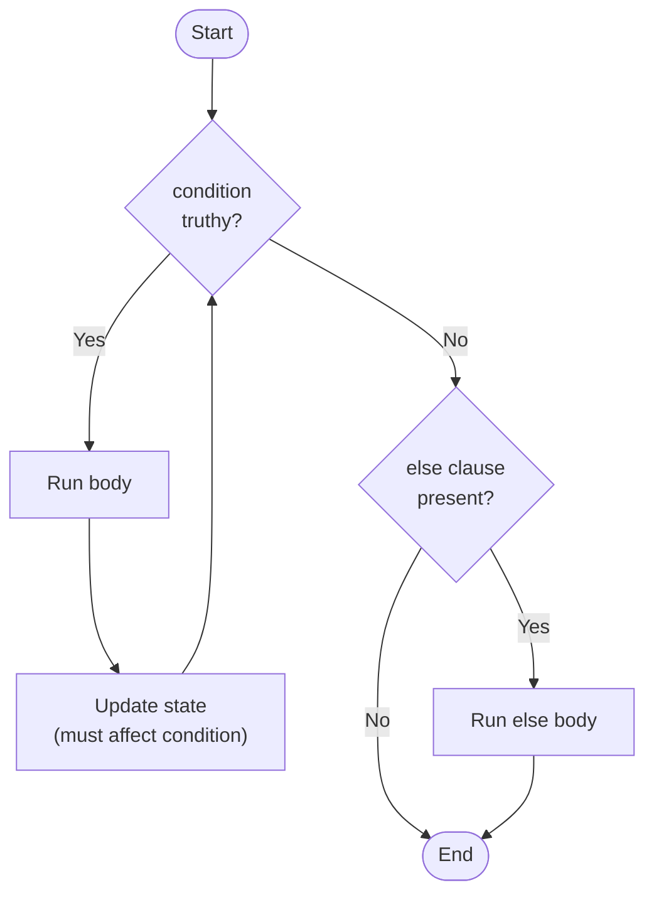

# 3. while Loops

## Why This Matters

Loops let a program repeat work. Python has two main loop constructs: `while` (this note) and `for` (the next note). The `while` loop is the more general of the two — it repeats a block as long as a condition is truthy, with no built-in iteration over a sequence. That makes `while` ideal for **event-driven loops**, **polling**, **retry loops**, **state machines**, and **infinite loops** with explicit `break` exits.

But the very generality that makes `while` useful also makes it dangerous. The classic `while` pitfalls are off-by-one errors, infinite loops, and forgotten update steps. This note covers the syntax, the rarely-seen `while-else` clause, idioms for safe `while` use, and the patterns that turn "spinning" loops into correct, terminating ones.

---

## Background

The `while` loop is the simplest loop construct:

```python
while condition:
    body
```

Python evaluates `condition`. If truthy, it runs `body`, then re-evaluates `condition`. This repeats until `condition` becomes falsy. The body must eventually make the condition false (or `break`); otherwise the loop runs forever.

Key facts:

- The condition is checked **before** each iteration (pre-test loop).
- If the condition is false initially, the body **never runs**.
- The body must change state that affects the condition, or use `break`.
- There is no `do...while` in Python — see the workaround below.

---

## Basic Syntax

### Simple counter

```python
n = 0
while n < 5:
    print(n)
    n += 1
```

### Reading until sentinel

```python
lines = []
while True:
    line = input("> ")
    if line == "quit":
        break
    lines.append(line)
```

### Event-driven loop

```python
while not queue.empty():
    task = queue.get()
    process(task)
```

### Polling with timeout

```python
import time

deadline = time.time() + 30   # 30 seconds
while time.time() < deadline:
    if check_condition():
        break
    time.sleep(0.5)
else:
    raise TimeoutError()
```

---

## The `while-else` Clause

Python loops have an unusual `else` clause that runs only if the loop terminated **without** `break`:

```python
n = 2
while n < 100:
    if is_prime(n):
        print(n)
        break
    n += 1
else:
    print("no prime found")
```

If the `break` runs, the `else` is skipped. If the loop's condition becomes false naturally, the `else` runs.

This is useful for search loops: "if I found it, I broke; if I didn't, I exhausted the loop":

```python
def find_first_prime(limit):
    n = 2
    while n < limit:
        if is_prime(n):
            return n
        n += 1
    else:
        return None   # no prime found
```

> [!warning] `while-else` is confusing
> Most programmers expect `else` to mean "if the loop didn't run." In Python, `else` means "if the loop ran to completion without breaking." This is one of the language's more confusing features. Many style guides suggest replacing `while-else` with explicit flags for clarity. See [[5. break, continue, pass]] for the same construct in `for` loops.

---

## The `do-while` Workaround

Python lacks a `do-while` loop (where the body runs once before the condition is checked). The idiomatic workaround is `while True` + `break`:

```python
while True:
    value = get_input()
    if not valid(value):
        break
    process(value)
```

This runs the body at least once, then breaks when the condition is false. Equivalent to:

```c
do {
    value = get_input();
    process(value);
} while (valid(value));
```

---

## Infinite Loops

`while True:` is a common idiom for an infinite loop that you exit via `break`:

```python
while True:
    command = input("> ")
    if command == "quit":
        break
    handle(command)
```

Infinite loops are not bugs **when there's a clear exit path**. They're idiomatic for REPLs, servers, event loops, and consumers. They're bugs when the exit path is missing or unreachable.

> [!danger] True infinite loop
> If you write `while True: pass` with no `break`, your program hangs forever (until you `Ctrl-C` or kill the process). Always have a clear termination condition.

### Forgetting to update

The most common cause of unintended infinite loops:

```python
n = 0
while n < 5:
    print(n)
    # forgot `n += 1` — runs forever
```

### Update that doesn't progress

```python
n = 0
while n < 5:
    print(n)
    n = n - 1     # n moves AWAY from 5 — infinite loop
```

### Float that never lands

```python
x = 0.0
while x != 1.0:
    x += 0.1
# Float rounding means x never exactly equals 1.0 — runs forever.
```

Use `x < 1.0` instead, or `math.isclose(x, 1.0)`.

---

## Flowchart



---

## Annotated Code Examples

### Example 1: Countdown

```python
n = 10
while n > 0:
    print(n)
    n -= 1
print("Lift off!")
```

### Example 2: Sum of digits

```python
def digit_sum(n):
    total = 0
    while n > 0:
        total += n % 10
        n //= 10
    return total

print(digit_sum(1234))   # 10
```

### Example 3: Euclid's GCD

```python
def gcd(a, b):
    while b:
        a, b = b, a % b
    return a

print(gcd(48, 18))   # 6
```

### Example 4: Retry with backoff

```python
import time, random

def fetch_with_retry(url, max_attempts=5):
    delay = 1.0
    attempt = 0
    while attempt < max_attempts:
        try:
            return fetch(url)
        except TransientError:
            attempt += 1
            time.sleep(delay)
            delay *= 2     # exponential backoff
    raise RuntimeError(f"failed after {max_attempts} attempts")
```

### Example 5: Producer-consumer polling

```python
import queue, time

def consume(q):
    while True:
        try:
            item = q.get(timeout=1.0)
        except queue.Empty:
            if shutdown_requested():
                break
            continue
        process(item)
```

### Example 6: `while-else` search

```python
def find_divisor(n, max_d):
    d = 2
    while d <= max_d:
        if n % d == 0:
            return d
        d += 1
    else:
        return None   # no divisor found
```

### Example 7: Interactive REPL

```python
while True:
    try:
        cmd = input(">>> ").strip()
    except EOFError:
        break
    if not cmd:
        continue
    if cmd in ("quit", "exit"):
        break
    try:
        result = eval(cmd, {}, {})
        if result is not None:
            print(repr(result))
    except Exception as e:
        print(f"Error: {e}")
```

---

## State Machines with `while`

`while` is a natural fit for **state machines** — programs that move between named states. Each iteration processes one event and possibly transitions to a new state.

```python
def run_state_machine(transitions, initial, events):
    state = initial
    for event in events:
        handler = transitions.get((state, event))
        if handler is None:
            raise ValueError(f"no transition from {state} on {event}")
        state = handler(state, event)
    return state

# Example: turnstile
LOCKED, UNLOCKED = "locked", "unlocked"
def on_coin(state, event): return UNLOCKED
def on_push(state, event): return LOCKED if state == UNLOCKED else LOCKED

transitions = {
    (LOCKED, "coin"): on_coin,
    (LOCKED, "push"): on_push,
    (UNLOCKED, "coin"): on_coin,
    (UNLOCKED, "push"): on_push,
}

state = LOCKED
state = transitions[(state, "coin")](state, "coin")   # unlocked
state = transitions[(state, "push")](state, "push")   # locked
```

This pattern scales to game loops, parsers, network protocol handlers, and many other domains. The key is that `while` gives you control over when to read the next event and when to transition.

## `while` with `else` — Search Idiom

The `while-else` construct shines in search loops. The `else` runs only when the loop's condition becomes false naturally (no `break`), so it signals "search exhausted without success":

```python
def find_first_prime_above(n):
    candidate = n + 1
    while candidate < n + 1000:
        if is_prime(candidate):
            return candidate
        candidate += 1
    else:
        # Ran to completion without finding a prime
        return None
```

Without `else`, you'd write:

```python
def find_first_prime_above(n):
    candidate = n + 1
    found = None
    while candidate < n + 1000:
        if is_prime(candidate):
            found = candidate
            break
        candidate += 1
    return found
```

The `else` version is shorter and eliminates the `found` flag, but at the cost of obscure semantics. Many teams forbid `while-else` for readability; others embrace it. Pick a convention and stick with it.

## Loop Variables and Scope

In Python, loop variables **leak** into the enclosing scope after the loop ends:

```python
n = 0
while n < 5:
    n += 1
print(n)   # 5 — variable persists
```

This can be useful (you can read the final value of the counter) but also error-prone (you might accidentally use `n` after the loop expecting 0). To avoid surprises, use a fresh variable name per loop or wrap loops in functions.

## Performance Considerations

`while` loops have per-iteration overhead: condition evaluation, branch prediction, frame state. For tight numeric loops, prefer `for` with `range` (slightly faster due to specialised bytecode) or vectorise with NumPy.

```python
# Slow
i, total = 0, 0
while i < 1_000_000:
    total += i
    i += 1

# Faster (specialised bytecode for range)
total = 0
for i in range(1_000_000):
    total += i

# Fastest (C-level)
total = sum(range(1_000_000))
```

That said, the difference is small unless your loop runs millions of iterations on trivial work. Profile before optimising.

## Backpressure and Rate Limiting

`while` is ideal for **backpressure** — slowing down a producer when the consumer can't keep up:

```python
import time

def produce_with_backpressure(queue, max_size=100):
    while True:
        if queue.qsize() < max_size:
            item = generate_item()
            queue.put(item)
        else:
            time.sleep(0.01)   # back off

def consume_with_rate_limit(queue, rate_per_sec=10):
    interval = 1.0 / rate_per_sec
    while True:
        item = queue.get()
        process(item)
        time.sleep(interval)
```

Both loops are infinite by design — they model long-running services. The exit conditions are external (process signal, exception, queue closed).

## `while` vs `for` — When to Choose Which

Use `while` when:

- The number of iterations is **unknown** ahead of time.
- The loop is **event-driven** (waiting for input, a flag, or external state).
- You need **non-trivial update logic** that doesn't map to a simple range.
- You're implementing a **state machine** or **protocol**.

Use `for` when:

- You're iterating over a **known sequence** (list, file, range, dict).
- The number of iterations is **bounded**.
- The update step is **simple** (next item from iterator).
- You want to express the loop **declaratively**.

As a rule of thumb, `for` is the right choice 90% of the time. `while` is for the remaining cases where the loop's termination depends on dynamic state.

## Common Pitfalls

### 1. Forgetting to update the loop variable

```python
n = 0
while n < 10:
    print(n)
    #  no `n += 1` — infinite loop
```

### 2. Off-by-one

```python
# Print numbers 1..10
n = 1
while n < 10:    #  misses 10
    print(n)
    n += 1

# Correct
n = 1
while n <= 10:   # 
    print(n)
    n += 1
```

### 3. Float comparison

```python
x = 0.0
while x != 1.0:    #  may never terminate
    x += 0.1
```

Use `<` or `math.isclose`.

### 4. Empty iterable confusion

```python
items = []
while items:           # body never runs (items is empty)
    process(items.pop())
```

If you wanted to process the list as long as it's non-empty, the above is correct. But often beginners expect "do once" — they need `while True` + explicit `break`.

### 5. Modifying the loop variable inside the body

```python
n = 0
while n < 10:
    n += 1
    if some_condition:
        n = 0      # resets — possible infinite loop
```

### 6. Mutating the collection being iterated

```python
items = list(range(10))
while items:
    if items[0] % 2 == 0:
        items.pop(0)
        items.append("keep")    # appends — list grows
```

This can lead to surprising iteration order or infinite loops. Build a new list instead.

### 7. Using `while` for what should be `for`

```python
# Bad
i = 0
while i < len(items):
    print(items[i])
    i += 1

# Good
for item in items:
    print(item)
```

`for` is more idiomatic for iterating over a known sequence.

### 8. `while` with side effects in condition

```python
while fetch_next() is not None:
    ...
```

This works but is fragile — if `fetch_next` raises, the loop dies. And if it has cache effects, the loop's behaviour is unclear. Prefer an explicit `while True:` with `break` for readability.

### 9. Accidental shadowing

```python
def f(n):
    while n > 0:
        n = some_function()    # rebinds n
        # original n is lost
```

---

## Tips and Tricks

- **Prefer `for` over `while`** when iterating over a known sequence. `while` is for unknown iteration counts.
- **Use `while True:` + `break`** for do-while style.
- **`enumerate` is your friend** — but only in `for`. For `while`, track the index manually.
- **Set a maximum iteration count** to prevent runaway loops in production: `while cond and attempts < 10000: ...`.
- **Use `else` for search loops** — but only when you're comfortable with the semantics.
- **Beware float conditions** — use `<`, `>`, or `math.isclose`.
- **Avoid mutating the iterated collection** — build a new one or iterate over a copy.
- **Sleep in polling loops** — `while True: if ready(): break; time.sleep(0.1)`. Otherwise you peg a CPU.
- **Use `signal.alarm` or `threading.Timer`** for hard timeouts on untrusted code.
- **Add a counter as a safety net**: `i = 0; while cond: ...; i += 1; if i > MAX: break`.

---

## Active Recall

1. Write the syntax of a `while` loop and explain when the body runs.
2. What happens if the condition is false initially?
3. Explain the `while-else` clause. When does the `else` run?
4. How do you emulate a `do-while` loop in Python?
5. List three common causes of unintended infinite loops.
6. Why does `while x != 1.0: x += 0.1` never terminate?
7. When is `while` preferred over `for`?
8. Show a `while` loop that polls with exponential backoff.
9. What's the difference between `while items:` and `while True:` with `break`?
10. Why is mutating the iterated collection inside a `while` loop risky?
11. Write a `while-else` that searches for a prime in a range.
12. How would you add a safety counter to a `while` loop?

---

## Next Steps

- Read [[4. for Loops and Iterables]] for the more common iteration construct.
- See [[5. break, continue, pass]] for fine-grained loop control (including `for-else`).
- See [[6. Comprehensions]] for declarative alternatives to many `while`/`for` loops.
- See [[8. Generators and yield]] in Chapter 3 for turning `while` loops into lazy producers.
- See Chapter 14 ([[1. Concurrency]]-style topics) for `asyncio` event loops, which are essentially `while` loops under the hood.
