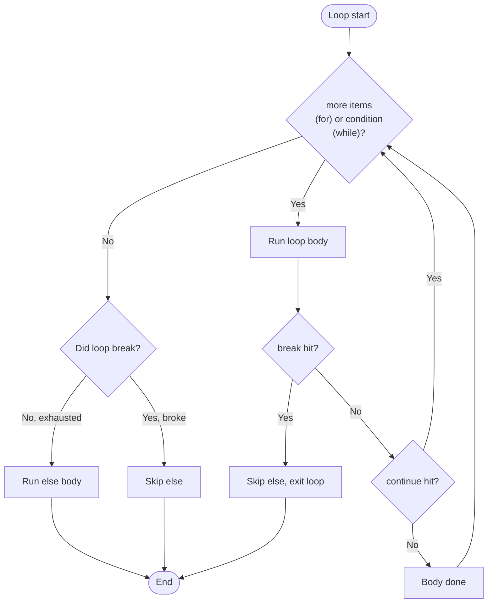
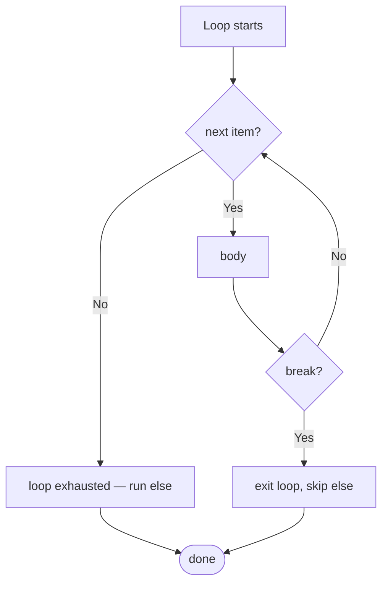

# 5. break, continue, pass

## Why This Matters

Once you have loops (`for`/`while`) and conditionals (`if`/`elif`/`else`), you need ways to control flow **inside** the loop: exit early, skip an iteration, or have a placeholder body that does nothing. Python gives you three statements for this:

- **`break`** — exit the loop immediately.
- **`continue`** — skip the rest of this iteration and start the next one.
- **`pass`** — do nothing; a syntactic placeholder.

Plus the curious **`for-else`/`while-else`** clause, which runs only when a loop completes without `break`. This combination is small but powerful, and misusing any of these keywords is a common source of bugs — from infinite loops caused by `continue` placed before an increment, to dead code caused by `pass` where the author meant `return`.

This note covers each keyword in depth, the loop-else clause, when to use each, and how to refactor code that overuses them.

---

## Background

`break`, `continue`, and `pass` are **simple statements** in Python — they fit on a single line and don't take arguments. They are not expressions; they don't return values. They modify control flow:

- `break` and `continue` only apply to the **innermost** loop they're inside.
- `pass` does nothing — it exists because Python's syntax requires a body after `:` and `pass` is the shortest legal body.
- `else` after a loop is unrelated to `else` after `if`; it means "ran to completion without `break`."

---

## `break` — Exit the Loop

`break` immediately exits the innermost enclosing `for` or `while` loop. Execution continues with the statement after the loop (or with the loop's `else` clause, if any).

```python
for x in [1, 2, 3, -1, 4]:
    if x < 0:
        print(f"found negative: {x}")
        break
    print(x)
# Output:
# 1
# 2
# 3
# found negative: -1
```

### Breaking out of nested loops

`break` only exits one level. To exit multiple loops, common patterns:

```python
# Option 1: flag
found = False
for i in range(n):
    for j in range(m):
        if matrix[i][j] == target:
            found = True
            break
    if found:
        break

# Option 2: extract to a function and `return`
def find(matrix, target):
    for i in range(len(matrix)):
        for j in range(len(matrix[i])):
            if matrix[i][j] == target:
                return (i, j)
    return None

# Option 3: use `for-else` and sentinel
for i in range(n):
    for j in range(m):
        if matrix[i][j] == target:
            print("found")
            break
    else:
        continue     # inner loop finished without break — try next i
    break            # inner loop broke — exit outer too
```

Option 2 (extract to function) is usually the cleanest. Option 3 (`for-else` + `continue`/`break`) is elegant but takes a moment to parse.

### Python 3.8+ doesn't have labeled break

Some languages (Java, Go, Rust) let you label a loop and `break label;` to exit an outer loop. Python does not. The standard advice is "extract to a function and use `return`."

---

## `continue` — Skip This Iteration

`continue` jumps to the next iteration of the innermost loop, skipping the rest of the current body. The loop's update step (e.g., the next item from `for`, or re-evaluating the `while` condition) still happens.

```python
for x in range(10):
    if x % 2 == 0:
        continue       # skip even numbers
    print(x)
# Output: 1 3 5 7 9
```

### Continue in `while`

```python
n = 0
while n < 10:
    n += 1
    if n % 2 == 0:
        continue
    print(n)
# Output: 1 3 5 7 9
```

> [!warning] `continue` before the update
> In a `while` loop, if `continue` skips the update step, the loop may never terminate:
>
> ```python
> n = 0
> while n < 10:
>     if n % 2 == 0:
>         continue    # ← n never increments when even — infinite loop
>     n += 1
> ```
>
> Always place the update step **before** any `continue`, or use a `for` loop where the iterator handles updates.

---

## `pass` — Do Nothing

`pass` is a no-op. It's a placeholder where Python syntax requires a statement but you have nothing to do.

```python
def stub():
    pass            # to be implemented later

class Empty:
    pass

try:
    risky()
except SomeError:
    pass            # silently ignore
```

### Common uses

- **Empty function/class body** while sketching a design.
- **Empty `except` block** to ignore an exception (almost always a bad idea — at least log it).
- **Empty `if`/`else` branch** when you intentionally handle nothing.

```python
if debug:
    pass    # nothing extra in debug mode
else:
    release_setup()
```

> [!tip] `pass` is a code smell
> An empty `except: pass` swallows errors silently. An empty `if/else: pass` is usually backwards logic. Most uses of `pass` can be refactored away. Use it for stubs, not for production.

### Alternatives to `pass`

- **`...` (Ellipsis)** — also valid as a body. Some style guides prefer it over `pass` for stubs because it signals "not implemented yet":
  ```python
  def todo():
      ...
  ```
- **`NotImplementedError`** — for stubs that should crash if called:
  ```python
  def must_override(self):
      raise NotImplementedError
  ```

---

## `for-else` and `while-else`

Both loop forms accept an `else` clause that runs **only if the loop completed without `break`**:

```python
for x in items:
    if matches(x):
        print(f"found {x}")
        break
else:
    print("not found")
```

The `else` runs if:
- The iterable was empty.
- The loop exhausted all items without `break`.

The `else` does **not** run if:
- `break` was executed.
- An exception propagated out of the loop.

```python
# Search a list
def find_prime_divisor(n):
    for d in range(2, n):
        if n % d == 0 and is_prime(d):
            return d
    else:
        return None    # no prime divisor
```



### When `else` is useful

The classic use case is "search with a fallback":

```python
for x in haystack:
    if x == needle:
        print("found")
        break
else:
    print("not found, doing fallback")
    fallback()
```

Without `else`, you'd need a flag:

```python
found = False
for x in haystack:
    if x == needle:
        found = True
        break
if not found:
    fallback()
```

The `else` version is more elegant — once you know the semantics.

> [!warning] `else` after a loop is confusing
> The name is misleading: it has nothing to do with the loop's condition being false. Many programmers go years without knowing it exists. Use it when it makes code clearer; otherwise, a flag is more readable for teams unfamiliar with the idiom.

---

## Annotated Code Examples

### Example 1: `break` for early exit

```python
def first_negative(xs):
    for x in xs:
        if x < 0:
            return x
    return None
```

### Example 2: `continue` to filter

```python
def print_odds(xs):
    for x in xs:
        if x % 2 == 0:
            continue
        print(x)
```

Or equivalently (often cleaner):

```python
def print_odds(xs):
    for x in xs:
        if x % 2 != 0:
            print(x)
```

Prefer the second form — it avoids `continue` for a simple filter.

### Example 3: `for-else` for search

```python
def find_first_even(xs):
    for x in xs:
        if x % 2 == 0:
            return x
    else:
        return None
```

### Example 4: `while-else` with timeout

```python
import time

deadline = time.time() + 5
while time.time() < deadline:
    if check_ready():
        print("ready")
        break
    time.sleep(0.1)
else:
    print("timed out")
```

### Example 5: Nested break via function

```python
def find_in_matrix(matrix, target):
    for i, row in enumerate(matrix):
        for j, value in enumerate(row):
            if value == target:
                return (i, j)
    return None
```

### Example 6: `pass` in stub code

```python
class Animal:
    def speak(self):
        pass     # subclasses override

class Dog(Animal):
    def speak(self):
        return "Woof"
```

### Example 7: `continue` for input validation

```python
for line in lines:
    line = line.strip()
    if not line:
        continue
    if line.startswith("#"):
        continue
    process(line)
```

This pattern (skip blank/comment lines) is common and clear.

### Example 8: Nested break via `for-else`

```python
for i in range(n):
    for j in range(m):
        if matrix[i][j] == target:
            print(f"found at ({i}, {j})")
            break
    else:
        continue     # inner loop didn't break — go to next i
    break            # inner loop did break — exit outer too
```

This is elegant but dense. Document it.

---

## `pass` vs `...` vs `raise NotImplementedError`

For empty function bodies, you have three options:

```python
def stub_pass():
    pass

def stub_ellipsis():
    ...

def stub_raise():
    raise NotImplementedError("not yet implemented")
```

Use them differently:

- **`pass`** — "I have nothing to do here." For empty `except`, empty `if` branches.
- **`...` (Ellipsis)** — "This is a stub; I'll fill it in later." Often used in type stubs (`.pyi` files) and abstract method declarations. PEP 484 introduced this convention.
- **`raise NotImplementedError(...)`** — "This must be overridden." For abstract methods in classes that may be instantiated but not used. Fails loud rather than silent.

```python
class AbstractStorage(ABC):
    @abstractmethod
    def save(self, key, value):
        ...

    def close(self):
        pass   # default no-op; subclasses may override

    def reset(self):
        raise NotImplementedError("subclasses must implement reset")
```

## `break`/`continue` vs Comprehensions

Many loops can be expressed as comprehensions, which are often cleaner:

```python
# Loop with continue
result = []
for x in data:
    if not valid(x):
        continue
    result.append(transform(x))

# Equivalent comprehension
result = [transform(x) for x in data if valid(x)]
```

Comprehensions don't have `break` — they always process the whole iterable. If you need early termination, use a loop with `break`, or `itertools.takewhile`:

```python
from itertools import takewhile

# Process items until invalid
result = [transform(x) for x in takewhile(valid, data)]
```

## `else` in `for` and `while` — A Refresher

```python
for x in items:
    if x == target:
        print("found")
        break
else:
    print("not found")
```

The `else` runs **only if the loop completed without `break`**. This is the opposite of what most people expect ("`else` = if the loop didn't run").

The mental model: think of `else` as "no break" — like the `else` of an `if` runs when the condition is false, the `else` of a loop runs when no `break` was hit.



## Common Pitfalls

### 1. `continue` before update in `while`

```python
n = 0
while n < 5:
    if n == 2:
        continue        # ← n stays 2 forever — infinite loop
    n += 1
    print(n)
```

Fix: increment before the `continue`, or use a `for` loop.

### 2. `break` only exits innermost loop

```python
for i in range(3):
    for j in range(3):
        if j == 1:
            break       # only breaks inner
    print(f"i={i}")    # still runs 3 times
```

To exit both loops, use a flag, return from a function, or raise an exception.

### 3. Empty `except: pass`

```python
try:
    risky()
except:                 #  bare except catches everything, including KeyboardInterrupt
    pass                #  silently swallowed
```

At minimum, catch specific exceptions and log them:

```python
try:
    risky()
except (NetworkError, TimeoutError) as e:
    logger.warning("transient error: %s", e)
```

### 4. `pass` in `if/else` when logic is inverted

```python
# Bad
if x > 0:
    pass
else:
    print("non-positive")

# Good
if x <= 0:
    print("non-positive")
```

### 5. Using `else` after `if` inside a loop, expecting loop-else

```python
for x in xs:
    if x == target:
        print("found")
    else:
        # this is `if-else`, NOT `for-else`!
        print("not found for this x")
```

Indentation matters: `else` aligns with `for` for loop-else; with `if` for conditional-else.

### 6. Forgetting `break` in a `match`/`case`-like `if-elif` chain

Python doesn't fall through `if-elif` branches — no `break` needed. But some beginners add `break` inside an `if` and confuse it with the surrounding loop.

### 7. `continue` after `print` skipping future work

```python
for x in xs:
    print(f"start {x}")
    if x % 2 == 0:
        continue
    print(f"end {x}")   # skipped for even x
```

Make sure skipped work is intentional.

### 8. `pass` as a body when a docstring is expected

```python
def f():
    pass    # ← no docstring
```

A docstring is a string expression, not a statement — `pass` and a docstring are both valid bodies but only the docstring is captured as `__doc__`.

### 9. `break` outside a loop is a `SyntaxError`

```python
if x:
    break    # SyntaxError: 'break' outside loop
```

### 10. Using `pass` in `try`/`finally` to skip cleanup

```python
try:
    risky()
finally:
    pass     # ← pointless; just remove the finally
```

If `finally` does nothing, drop it.

---

## Tips and Tricks

- **`break` is for "I found what I was looking for."** Use it freely in search loops.
- **`continue` is for "skip this one."** Prefer restructuring over `continue` when possible.
- **`pass` is a placeholder.** Remove it as soon as you have real code.
- **`for-else` is a search idiom.** Use it for "found vs. not found" patterns.
- **Extract nested loops into functions** so you can `return` to exit all levels.
- **Don't catch `BaseException`** — `KeyboardInterrupt` and `SystemExit` should propagate.
- **Replace empty `except: pass` with logging** — even `logger.debug` is better than silence.
- **Use `...` (Ellipsis) for stubs** — communicates "intentionally empty" better than `pass`.
- **Use `NotImplementedError` for unimplemented abstract methods** — fails loud, not silent.
- **Refactor `continue` ladders** — deeply nested `continue` chains are hard to read.

---

## Active Recall

1. What does `break` do? What about `continue`? And `pass`?
2. Why does `continue` placed before the update step in a `while` loop cause an infinite loop?
3. How do you break out of a nested loop in Python (given no labeled break)?
4. Explain the `for-else` and `while-else` clause. When does `else` run?
5. Why is an empty `except: pass` considered a code smell?
6. Show two ways to write a "search with fallback" using `for-else` and using a flag.
7. What's the difference between `pass` and `...` as a stub body?
8. Where would you use `continue` for input filtering? Show an example.
9. Why does `break` outside a loop raise a `SyntaxError`?
10. What's a common refactoring for "this `if/else` has `pass` in one branch"?
11. How does the inner-loop-with-outer-break idiom using `for-else` and `continue` work?
12. Show a safer alternative to `except: pass`.

---

## Next Steps

- Read [[6. Comprehensions]] for declarative filtering that often replaces `continue`.
- See [[1. if-elif-else]] for the conditional context where `pass` often appears.
- See [[7. Decorators]] in Chapter 3 for `try`/`except` patterns inside wrappers.
- See [[8. Generators and yield]] in Chapter 3 for an alternative to early-exit loops.
- For `try`/`except`/`finally` in depth, see Chapter 5 ([[1. Error Handling]]-style topics).
