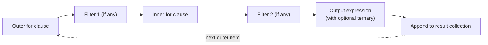

# 6. Comprehensions

## Why This Matters

Comprehensions are one of Python's most loved features. They let you build lists, dicts, sets, and generators **declaratively** in a single expression — what would take 4–6 lines of `for` loops and `append` calls collapses into one readable line. Comprehensions are not just sugar: they are typically **faster** than the equivalent loop (the bytecode is specialised), they make intent obvious, and they chain naturally with `if` filters and function calls.

But comprehension syntax is dense. Once you nest two or three `for` clauses, add an `if` filter, and throw in a conditional expression, comprehension code becomes unreadable. This note covers all four comprehension forms (list, dict, set, generator), the filter and multi-loop syntax, when to use and when to avoid comprehensions, and the performance characteristics that make them the idiomatic Pythonic choice.

---

## Background

Comprehensions came to Python in version 2.0 (2000) for lists, with PEP 202. Dict and set comprehensions followed in 2.7 (2010) via PEP 274. Generator expressions arrived in 2.4 (2004) via PEP 289. They share a common syntactic shape:

```
[ expression for target in iterable if condition ]
{ expression for target in iterable if condition }
{ key: value for target in iterable if condition }
( expression for target in iterable if condition )
```

You can read each as: "build a collection of `expression`s, where `target` comes from `iterable`, optionally filtered by `condition`."

The brackets/braces determine the result type:
- `[...]` → list
- `{...}` (single expr) → set
- `{k: v ...}` → dict
- `(...)` → generator expression (lazy)

---

## List Comprehensions

### Basic form

```python
squares = [x * x for x in range(5)]
# [0, 1, 4, 9, 16]
```

Equivalent `for` loop:

```python
squares = []
for x in range(5):
    squares.append(x * x)
```

### With a filter

```python
even_squares = [x * x for x in range(10) if x % 2 == 0]
# [0, 4, 16, 36, 64]
```

Equivalent `for` loop:

```python
even_squares = []
for x in range(10):
    if x % 2 == 0:
        even_squares.append(x * x)
```

### With a conditional expression (ternary in the result)

```python
labels = ["even" if x % 2 == 0 else "odd" for x in range(5)]
# ['even', 'odd', 'even', 'odd', 'even']
```

This is different from the `if` filter — the ternary is in the **expression** position, the filter is at the **end**.

```python
# Filter then transform: only even x, label them
[x for x in range(10) if x % 2 == 0]
# [0, 2, 4, 6, 8]

# Transform all x: label even/odd
["even" if x % 2 == 0 else "odd" for x in range(5)]
# ['even', 'odd', 'even', 'odd', 'even']

# Both: filter even, then label
["even" if x % 2 == 0 else "odd" for x in range(10) if x % 2 == 0]
# ['even', 'even', 'even', 'even', 'even']
```

### Multiple `for` clauses (nested)

```python
pairs = [(x, y) for x in range(3) for y in range(3)]
# [(0,0),(0,1),(0,2),(1,0),(1,1),(1,2),(2,0),(2,1),(2,2)]
```

Read left-to-right like nested `for` loops; outer loop first:

```python
pairs = []
for x in range(3):
    for y in range(3):
        pairs.append((x, y))
```

### Multiple `if` filters

```python
result = [(x, y) for x in range(5) if x % 2 == 0 for y in range(5) if y % 2 == 1]
# [(0, 1), (0, 3), (2, 1), (2, 3), (4, 1), (4, 3)]
```

Each `if` filters the most recent `for` clause's items.

---

## Dict Comprehensions

```python
squares = {x: x * x for x in range(5)}
# {0: 0, 1: 1, 2: 4, 3: 9, 4: 16}

# Invert a dict (be careful with duplicate values)
inv = {v: k for k, v in original.items()}

# Filter
evens = {k: v for k, v in d.items() if v % 2 == 0}
```

### Build from two lists

```python
keys = ["a", "b", "c"]
values = [1, 2, 3]
d = {k: v for k, v in zip(keys, values)}
# Or simpler: dict(zip(keys, values))
```

### Counter from a list

```python
words = "the cat sat on the mat the cat".split()
counts = {w: words.count(w) for w in set(words)}
# Better: use collections.Counter
```

---

## Set Comprehensions

```python
unique = {x % 3 for x in range(10)}
# {0, 1, 2}

# Deduplicate a list while applying a transform
unique_lengths = {len(w) for w in ["a", "bb", "ccc", "a", "bb"]}
# {1, 2, 3}
```

Sets are unordered, so iteration order varies. Useful when you only care about membership.

---

## Generator Expressions

Replace the `[]` (or `{}`) with `()` to get a **generator expression** — a lazy one-shot iterable:

```python
squares_list = [x * x for x in range(10)]      # list, materialised
squares_gen  = (x * x for x in range(10))      # generator, lazy

print(type(squares_list))   # <class 'list'>
print(type(squares_gen))    # <class 'generator'>

for x in squares_gen:
    print(x)
```

Generator expressions:

- Are **lazy** — they compute items on demand.
- Are **one-shot** — once exhausted, you must rebuild.
- Use **O(1) memory** regardless of the underlying range size.
- Are slower per-item than a list comprehension (due to generator overhead) but far more memory-efficient.

Use them when:

- You're feeding into another consumer (`sum`, `max`, `any`, `sorted`, etc.).
- The full list would be huge.
- You only iterate once.

```python
total = sum(x * x for x in range(1_000_000))    # no list materialised
```

> [!tip] Drop the parens when calling a function
> `sum((x*x for x in xs))` is legal, but `sum(x*x for x in xs)` is the idiomatic form — Python lets you omit the inner parens of a generator expression when it's the sole argument to a call.

See [[8. Generators and yield]] in Chapter 3 for full generator coverage.

---

## Evaluation Order



Read comprehension left-to-right:

1. The first `for` is the outermost loop.
2. Each subsequent `for` is nested inside.
3. Each `if` filters the most recent `for`'s items.
4. The leftmost expression (before the first `for`) is the **output expression**, evaluated last with all targets in scope.

Equivalent general expansion:

```python
[expr for a in A if cond_a for b in B if cond_b ...]

# Becomes:
result = []
for a in A:
    if cond_a:
        for b in B:
            if cond_b:
                result.append(expr)
```

---

## Annotated Code Examples

### Example 1: Squares

```python
[x * x for x in range(10)]
# [0, 1, 4, 9, 16, 25, 36, 49, 64, 81]
```

### Example 2: Even squares

```python
[x * x for x in range(10) if x % 2 == 0]
# [0, 4, 16, 36, 64]
```

### Example 3: Cartesian product

```python
[(x, y) for x in range(2) for y in range(2)]
# [(0, 0), (0, 1), (1, 0), (1, 1)]
```

### Example 4: Flatten a matrix

```python
matrix = [[1, 2, 3], [4, 5, 6], [7, 8, 9]]
flat = [x for row in matrix for x in row]
# [1, 2, 3, 4, 5, 6, 7, 8, 9]
```

### Example 5: Dict from two lists

```python
keys = ["a", "b", "c"]
values = [1, 2, 3]
d = {k: v for k, v in zip(keys, values)}
# {'a': 1, 'b': 2, 'c': 3}
```

### Example 6: Invert a dict

```python
original = {"a": 1, "b": 2, "c": 3}
inverted = {v: k for k, v in original.items()}
# {1: 'a', 2: 'b', 3: 'c'}
```

### Example 7: Word lengths (set)

```python
words = "the quick brown fox jumps".split()
lengths = {len(w) for w in words}
# {3, 5, 5, 3, 5} → {3, 5}
```

### Example 8: Generator for sum

```python
total = sum(x * x for x in range(1, 101))
# 338350 — computed lazily, no list materialised
```

### Example 9: Filter + transform

```python
users = [{"name": "Alice", "age": 30}, {"name": "Bob", "age": 17}, {"name": "Carol", "age": 25}]
adults = [u["name"] for u in users if u["age"] >= 18]
# ['Alice', 'Carol']
```

### Example 10: Conditional expression

```python
labels = ["even" if x % 2 == 0 else "odd" for x in range(5)]
# ['even', 'odd', 'even', 'odd', 'even']
```

### Example 11: Dict comprehension with filter

```python
counts = {"a": 5, "b": 0, "c": 3, "d": 0}
non_zero = {k: v for k, v in counts.items() if v > 0}
# {'a': 5, 'c': 3}
```

### Example 12: Nested comprehension (use carefully)

```python
# Identity matrix
identity = [[1 if i == j else 0 for j in range(3)] for i in range(3)]
# [[1, 0, 0], [0, 1, 0], [0, 0, 1]]
```

The **outer** comprehension builds the rows; the inner builds each row. Note that the outer is read last when scanning left-to-right — Python evaluates it as `[<inner> for i in range(3)]`, so the inner is the expression.

---

## When to Avoid Comprehensions

### 1. When the body is too complex

```python
# Bad
result = [complex_function(x) for x in data if some_filter(x) and other_filter(x) and not excluded(x)]
```

If you need three filters and a complex transform, use a regular loop:

```python
result = []
for x in data:
    if not (some_filter(x) and other_filter(x) and not excluded(x)):
        continue
    result.append(complex_function(x))
```

### 2. When you need side effects

```python
# Bad — comprehension used for side effects, result discarded
[print(x) for x in data]

# Good
for x in data:
    print(x)
```

Comprehensions are for **building collections**, not for side effects.

### 3. When you need exception handling

```python
# Can't put try/except in a comprehension
result = []
for x in data:
    try:
        result.append(parse(x))
    except ParseError:
        result.append(None)
```

If you need `try`/`except` in the body, use a loop. (You can extract a helper function and call it from the comprehension, but the comprehension alone can't catch.)

### 4. When the comprehension is too long

PEP 8 and most style guides suggest keeping comprehensions to one logical line, or at most a few lines if formatted clearly:

```python
# OK — multi-line but readable
result = [
    transform(x)
    for x in data
    if x is not None and is_valid(x)
]
```

If it doesn't fit on 2-3 lines, use a loop.

### 5. When nesting exceeds two levels

```python
# Hard to read
flat = [x for row in matrix for col in row for x in col]

# Better
flat = []
for row in matrix:
    for col in row:
        flat.extend(col)
```

### 6. When you're sharing state between iterations

```python
# Bad — using comprehension for state mutation
accumulator = 0
result = [(accumulator := accumulator + x) for x in data]
```

Walrus makes this possible but it's confusing. Use a loop or `itertools.accumulate`.

---

## Common Pitfalls

### 1. Forgetting that `if` filters, ternary transforms

```python
[x if x > 0 else 0 for x in data]   # ternary in expression — transforms
[x for x in data if x > 0]          # filter — keeps only positives
```

These are very different.

### 2. Modifying the source list during comprehension

```python
xs = [1, 2, 3]
result = [xs.append(x * 2) for x in xs]
# result is [None, None, None] — append returns None
# xs is now [1, 2, 3, 2, 4, 6]
```

Comprehensions should not have side effects.

### 3. Variable scope leakage (Python 2)

In Python 2, list comprehension variables leaked into the enclosing scope. In Python 3, they don't:

```python
# Python 3
[x for x in range(5)]
print(x)   # NameError — x is not defined here
```

### 4. Set comprehension with unhashable items

```python
{[1, 2] for _ in range(1)}   # TypeError: unhashable type: 'list'
```

Sets require hashable items.

### 5. Dict comprehension key collisions

```python
{v: k for k, v in [(1, 'a'), (2, 'b'), (1, 'c')]}
# {1: 'c', 2: 'b'} — last value wins
```

### 6. Generator expression exhausted

```python
gen = (x for x in range(3))
print(list(gen))   # [0, 1, 2]
print(list(gen))   # [] — exhausted
```

### 7. Reading nested comprehensions backwards

```python
flat = [x for row in matrix for x in row]
```

Read: "for each row in matrix, for each x in row, put x in the result." Don't try to read right-to-left.

### 8. Using `()` for a tuple comprehension (doesn't exist)

```python
(x for x in range(5))   # generator, not tuple
tuple(x for x in range(5))   # the way to make a tuple
```

There is no "tuple comprehension" — use `tuple(genexpr)`.

### 9. Confusing generator with list

```python
gen = (x for x in range(5))
print(gen[2])   # TypeError: generator indices don't work
```

If you need indexing, materialise with `list()`.

### 10. Performance surprise: huge generator in `len()`

```python
gen = (x for x in range(10**9))
print(len(gen))   # TypeError: generator has no len
```

Generators don't know their length until exhausted.

---

## Tips and Tricks

- **Default to comprehensions** for simple transform/filter on a sequence.
- **Use `dict(zip(...))` over a dict comprehension** for parallel lists — clearer.
- **Use `Counter` over a dict comprehension** for counting — built-in and powerful.
- **Use generator expressions in `sum`, `any`, `all`, `max`, `min`** — avoids materialising a list.
- **Multi-line comprehensions are fine** if formatted clearly.
- **Walrus `:=` lets you cache a computation** in a comprehension: `[y for x in data if (y := f(x)) > 0]`.
- **`itertools`** complements comprehensions for advanced patterns.
- **Avoid more than two `for` clauses** in one comprehension — extract a function.
- **Profile if performance matters** — comprehensions are usually faster than loops but not always.
- **Read comprehensions left-to-right** as "build these expressions from these sources filtered by these conditions."

---

## Active Recall

1. Write a list comprehension that produces the squares of even numbers from 0 to 9.
2. What's the difference between an `if` filter and an `if/else` ternary in a comprehension?
3. How do you build a dict from two parallel lists using a comprehension? What's the simpler alternative?
4. What is a generator expression, and how does it differ from a list comprehension?
5. Why might `sum(x*x for x in range(1_000_000))` be better than `sum([x*x for x in range(1_000_000)])`?
6. Read this comprehension aloud and say what it produces: `[x for row in matrix for x in row if x > 0]`.
7. Why can't you put `try`/`except` directly in a comprehension?
8. What's the rule of thumb for when to use a comprehension vs a regular `for` loop?
9. Show how to flatten a 3-level nested list with a comprehension. When would you not do this?
10. Why does `{[1, 2]}` raise a `TypeError`?
11. What does the walrus operator let you do inside a comprehension?
12. Why is `[print(x) for x in data]` a code smell?

---

## Next Steps

- Read [[8. Generators and yield]] in Chapter 3 for the full power of lazy iteration.
- See [[6. Lambda Functions]] in Chapter 3 for combining comprehensions with `map`/`filter`/`sorted`.
- See [[1. Standard Library Deep Dive]]-style topics (Chapter 9) for `itertools`, `collections`, and `functools`.
- For performance profiling of comprehensions vs loops, see Chapter 15 ([[1. Memory and Performance]]-style topics).
- For functional-Python deep dives, see Chapter 19 ([[1. Functional Python]]).
