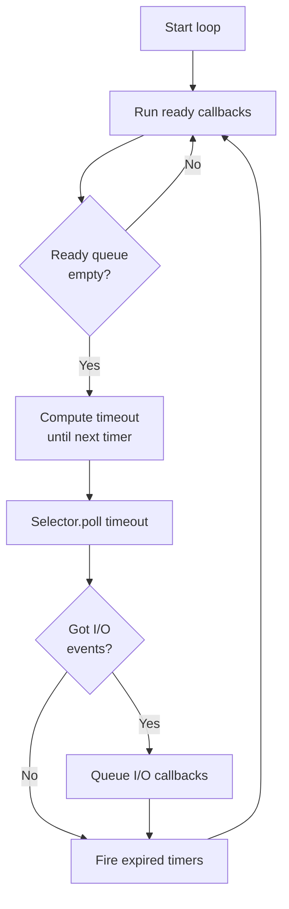
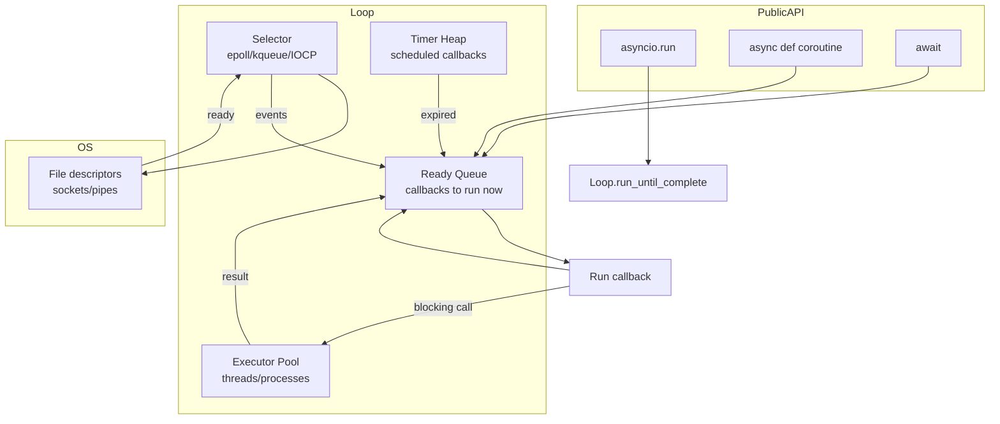

# 1. Event Loops

> [!note] Why this note exists
> [[14. Concurrency/4. asyncio Basics]] introduced the event loop at a beginner level — `asyncio.run(main())` and a few `await` calls. This note is the **mastery treatment**: how the event loop actually works internally, how to choose and configure loop policies, when to reach for `uvloop`, how to run blocking code safely via executors, and how the loop's task scheduling affects correctness. After this note you'll be able to debug async problems at the loop level — not just write code that "mostly works."

## Why It Matters

The **event loop** is the heart of `asyncio`. It's the scheduler that decides which coroutine runs when, the I/O multiplexer that knows when a socket is readable, the timer queue that fires `asyncio.sleep` callbacks, and the executor dispatcher that runs blocking code in thread/process pools. Every `await` eventually hands control back to the loop; every `asyncio.create_task` registers a coroutine with the loop's ready queue.

Understanding the loop matters because:
- **Most async bugs are loop bugs.** A "frozen" coroutine, a task that never completes, a callback that runs twice, a `CancelledError` that propagates unexpectedly — these are all loop-level behaviors, not syntax errors.
- **Performance is loop-determined.** The default `asyncio.SelectorEventLoop` uses `epoll` on Linux and `kqueue` on macOS. `uvloop` (a Cython reimplementation) is 2–4× faster for HTTP-style workloads. Choosing the wrong loop can leave 4× performance on the table.
- **Cross-thread and cross-process work needs loop knowledge.** `loop.call_soon_threadsafe`, `asyncio.run_coroutine_threadsafe`, and the GIL mean async code doesn't compose with threads automatically.
- **Production deployments need loop tuning.** Debug mode, slow-callback detection, exception handlers, and signal handling all live at the loop level.

## Background

### What an event loop is

An event loop is a program that repeatedly:
1. Checks the **ready queue** — callbacks scheduled to run now (e.g., a coroutine resumed after `await`).
2. Polls I/O selectors for **ready I/O** — sockets with data to read, file descriptors that can be written, timers that have fired.
3. Runs ready callbacks in FIFO order until the queue is empty.
4. Computes the next timer deadline and polls I/O with that timeout.
5. Repeats.



The loop never **blocks on a single I/O operation**. It blocks on the selector — waiting for any of the registered file descriptors to become ready — and dispatches the resulting callbacks. This is how a single-threaded loop can handle thousands of concurrent connections.

### Why single-threaded?

A single-threaded event loop:
- Needs no locks for application state — only one coroutine runs at a time.
- Avoids context-switch overhead from the OS scheduler.
- Has predictable, low-latency scheduling (microseconds, not milliseconds).

The cost: any **synchronous** operation (CPU-bound work, blocking I/O) stalls the entire loop. A `time.sleep(1)` in your coroutine freezes every other coroutine for that second. This is why `await asyncio.sleep(1)` exists — it yields control to the loop.

### The selector abstraction

The loop doesn't talk to `epoll`/`kqueue`/`select` directly. It uses the `selectors` module, which abstracts the OS's best available multiplexer:

| OS        | Mechanism  | Selector             |
|-----------|-----------|----------------------|
| Linux     | `epoll`   | `EpollSelector`      |
| macOS/BSD | `kqueue`  | `KqueueSelector`     |
| Windows   | IOCP*     | `_WindowsSelector`   |
| Fallback  | `select`  | `SelectSelector`     |

*Windows sockets work with IOCP, but file I/O doesn't — that's why `asyncio` on Windows uses ProactorEventLoop by default (Python 3.8+) and `loop.run_in_executor` for files.

## Main content

### `asyncio.run()` — the modern entry point

```python
import asyncio

async def main():
    print("hello")
    await asyncio.sleep(1)
    print("world")

asyncio.run(main())
```

`asyncio.run()` (Python 3.7+):
1. Creates a new event loop.
2. Runs the coroutine to completion.
3. Cancels any remaining tasks.
4. Shuts down async generators.
5. Closes the loop.

Always use `asyncio.run` as your program's entry point. It handles setup and teardown correctly. Don't manage loops manually unless you have a specific reason (embedding asyncio in another framework, running multiple loops in one process, etc.).

### `asyncio.get_event_loop()` — the legacy API

```python
loop = asyncio.get_event_loop()
loop.run_until_complete(main())
loop.close()
```

This was the standard way before Python 3.7. It's now deprecated in some contexts:
- `asyncio.get_event_loop()` outside a running loop issues a `DeprecationWarning` in 3.10+ and will eventually raise.
- Inside a coroutine, it returns the running loop.

Prefer `asyncio.run()` for top-level scripts. Use `asyncio.get_running_loop()` inside coroutines to fetch the current loop.

### `asyncio.get_running_loop()` — inside a coroutine

```python
async def handler():
    loop = asyncio.get_running_loop()
    # Use loop for low-level operations
    ...
```

This is the correct way to access the loop from inside async code. It raises `RuntimeError` if no loop is running — a useful guard.

### Loop policies

A **loop policy** is a process-global object that decides which loop class to instantiate. The default policy on Unix creates a `SelectorEventLoop`; on Windows it creates a `ProactorEventLoop` (3.8+).

```python
import asyncio
import asyncio.windows_events  # Windows-only

# Override the default policy (Windows, to use SelectorEventLoop):
if asyncio.get_event_loop_policy().__class__.__name__ == 'WindowsProactorEventLoopPolicy':
    asyncio.set_event_loop_policy(asyncio.WindowsSelectorEventLoopPolicy())
```

You'd switch policies on Windows if a library you use doesn't support IOCP (older `aiohttp` versions, some database drivers).

### Custom event loops: `uvloop`

`uvloop` is a drop-in replacement for the default `asyncio` loop, built on `libuv` (the same library Node.js uses). It's 2–4× faster for I/O-heavy workloads.

```bash
pip install uvloop
```

```python
import asyncio
import uvloop

asyncio.set_event_loop_policy(uvloop.EventLoopPolicy())

async def main():
    await asyncio.sleep(1)

asyncio.run(main())
```

Or, more explicitly:

```python
uvloop.install()
asyncio.run(main())
```

`uvloop` is Unix-only (no Windows). Use it in production servers when you control the deployment environment and care about throughput. Some frameworks (Sanic, FastAPI/Starlette under Uvicorn) auto-use uvloop when available.

When to use uvloop:
- Linux/macOS deployment.
- I/O-bound workload (HTTP servers, proxies).
- You've benchmarked and confirmed a real speedup.

When NOT to use uvloop:
- Windows (not supported).
- You need Windows-specific loop features (named pipes, certain COM interop).
- Your workload is CPU-bound (uvloop doesn't help).

### Running synchronous code: `run_in_executor`

The loop is single-threaded. Any blocking call — `time.sleep`, `requests.get`, `numpy` computation, file I/O on Linux — stalls every coroutine.

```python
import time

async def bad():
    # BAD: blocks the entire loop for 1 second
    time.sleep(1)
```

Use `loop.run_in_executor` to push blocking work to a thread or process pool:

```python
import asyncio
import time
from concurrent.futures import ThreadPoolExecutor

def blocking_work(n):
    time.sleep(n)
    return f"slept {n}s"

async def good():
    loop = asyncio.get_running_loop()
    result = await loop.run_in_executor(None, blocking_work, 1)
    print(result)

asyncio.run(good())
```

`None` for the executor uses the default `ThreadPoolExecutor` (Python 3.8+; before that, `loop.run_in_executor(None, ...)` used the loop's default executor, which you'd configure via `loop.set_default_executor`).

#### Custom executors

```python
from concurrent.futures import ThreadPoolExecutor, ProcessPoolExecutor

# CPU-bound work → process pool:
async def heavy_compute():
    loop = asyncio.get_running_loop()
    with ProcessPoolExecutor() as pool:
        result = await loop.run_in_executor(pool, cpu_intensive_function, data)
    return result

# I/O-bound work with limited parallelism → small thread pool:
async def fetch(url):
    loop = asyncio.get_running_loop()
    with ThreadPoolExecutor(max_workers=10) as pool:
        return await loop.run_in_executor(pool, requests.get, url)
```

Rule of thumb:
- **I/O-bound blocking** (legacy `requests`, sync DB drivers) → thread pool.
- **CPU-bound** (numpy, compression, hashing) → process pool (to escape the GIL).

#### `asyncio.to_thread` (Python 3.9+) — convenience wrapper

```python
import asyncio
import time

def blocking(n):
    time.sleep(n)
    return n

async def main():
    result = await asyncio.to_thread(blocking, 1)
    print(result)

asyncio.run(main())
```

`asyncio.to_thread(func, *args, **kwargs)` is shorthand for `loop.run_in_executor(None, func, *args)`. Use it for the common case of "run this blocking function in the default thread pool."

### Loop internals: the ready queue and timers

```python
import asyncio

async def task(name, delay):
    print(f"{name} start")
    await asyncio.sleep(delay)
    print(f"{name} end after {delay}s")

async def main():
    await asyncio.gather(
        task("A", 1),
        task("B", 2),
        task("C", 0.5),
    )

asyncio.run(main())
# Output:
# A start
# B start
# C start
# C end after 0.5s
# A end after 1s
# B end after 2s
```

What happens:
1. `gather` schedules all three tasks.
2. The loop runs `task("A")` until it hits `await asyncio.sleep(1)` — A is suspended, scheduled to resume in 1s.
3. Same for B (2s) and C (0.5s).
4. The loop has nothing in the ready queue, so it polls the selector with a 0.5s timeout (next timer).
5. After 0.5s, C's timer fires — C is added to the ready queue.
6. C runs to completion.
7. After 1s, A's timer fires — A completes.
8. After 2s, B's timer fires — B completes.

### `loop.call_soon`, `loop.call_later`, `loop.call_at`

Lower-level scheduling primitives:

```python
loop = asyncio.get_running_loop()

# Run a callback as soon as possible (next loop iteration):
loop.call_soon(print, "hello")

# Run a callback after N seconds:
loop.call_later(2.5, print, "delayed")

# Run a callback at a specific loop time:
loop.call_at(loop.time() + 5, print, "at +5s")
```

`loop.time()` returns the loop's monotonic clock. These are the primitives `asyncio.sleep` is built on. You rarely need them directly — `await asyncio.sleep` is the high-level wrapper.

### Cross-thread communication

```python
import asyncio
import threading

def worker(loop):
    # From another thread, schedule a coroutine on the loop:
    asyncio.run_coroutine_threadsafe(some_coro(), loop)

async def main():
    loop = asyncio.get_running_loop()
    t = threading.Thread(target=worker, args=(loop,))
    t.start()
    t.join()
    await asyncio.sleep(0.1)
```

Two key APIs:
- `loop.call_soon_threadsafe(callback, *args)` — schedule a regular callback from another thread.
- `asyncio.run_coroutine_threadsafe(coro, loop)` — schedule a coroutine and get a `concurrent.futures.Future` back.

These are essential when integrating asyncio with thread-based code (e.g., a GUI callback that needs to schedule async work).

### Signal handling

```python
import asyncio
import signal

async def main():
    loop = asyncio.get_running_loop()
    stop = asyncio.Event()

    def on_sigint():
        print("SIGINT received, shutting down...")
        stop.set()

    loop.add_signal_handler(signal.SIGINT, on_sigint)
    loop.add_signal_handler(signal.SIGTERM, on_sigint)

    await stop.wait()
    print("Cleanup...")

asyncio.run(main())
```

`loop.add_signal_handler` is Unix-only. On Windows, signal handling is limited (only `SIGINT` is reliable).

### Exception handler

```python
import asyncio

def on_exception(loop, context):
    msg = context.get("message", "Unhandled exception")
    exception = context.get("exception")
    print(f"Loop error: {msg} / {exception}")
    # Optionally: log, send to monitoring, etc.

async def main():
    loop = asyncio.get_running_loop()
    loop.set_exception_handler(on_exception)
    # ... do work that might raise in callbacks ...

asyncio.run(main())
```

The exception handler catches:
- Exceptions in `loop.call_soon` callbacks.
- Unhandled exceptions in tasks that aren't awaited.
- Other loop-level errors.

It does NOT catch exceptions that propagate normally through awaited coroutines (those go to the caller).

### Debug mode

```python
import asyncio
import logging

logging.basicConfig(level=logging.DEBUG)

async def main():
    loop = asyncio.get_running_loop()
    loop.set_debug(True)
    # ... do work ...

asyncio.run(main())
```

Or set the env var:

```bash
PYTHONASYNCIODEBUG=1 python my_app.py
```

Debug mode enables:
- **Slow callback detection** — logs callbacks that take >100ms (configurable via `loop.slow_callback_duration`).
- **Coroutines never awaited** warnings — catches `coroutine_function()` without `await`.
- **Source line tracking** for better tracebacks.
- **Strict thread-safety checks**.

## Mermaid: event loop architecture



## Mermaid: lifecycle of an async task

```mermaid
sequenceDiagram
    participant Code as User code
    participant Loop as Event loop
    participant Task as asyncio.Task
    participant Sel as Selector

    Code->>Loop: create_task(coro())
    Loop->>Task: wraps coro
    Task->>Loop: schedule first step
    Loop->>Task: run until await
    Task->>Sel: register socket for read
    Note over Task: suspended
    Sel-->>Loop: socket ready
    Loop->>Task: resume
    Task->>Code: return result
```

## Code examples

### A minimal HTTP server using the loop directly

```python
import asyncio

async def handle_client(reader, writer):
    addr = writer.get_extra_info('peername')
    print(f"Connection from {addr}")
    data = await reader.read(1024)
    message = data.decode()
    response = f"HTTP/1.1 200 OK\r\nContent-Length: 13\r\n\r\nHello, World!"
    writer.write(response.encode())
    await writer.drain()
    writer.close()

async def main():
    server = await asyncio.start_server(handle_client, '127.0.0.1', 8080)
    async with server:
        await server.serve_forever()

asyncio.run(main())
```

### Running CPU-bound work without blocking the loop

```python
import asyncio
import time

def cpu_heavy(n):
    total = 0
    for i in range(n):
        total += i ** 2
    return total

async def main():
    loop = asyncio.get_running_loop()

    # BAD: blocks the loop
    # result = cpu_heavy(10**7)

    # GOOD: run in a process pool
    result = await loop.run_in_executor(
        None, cpu_heavy, 10**7
    )
    print(f"Result: {result}")

asyncio.run(main())
```

### Mixing asyncio with a synchronous GUI loop

```python
import asyncio
import tkinter as tk
from threading import Thread

class App:
    def __init__(self):
        self.root = tk.Tk()
        self.label = tk.Label(self.root, text="Ready")
        self.label.pack()
        self.root.after(100, self.start_async_loop)

    def start_async_loop(self):
        # Run asyncio in a background thread
        self.loop = asyncio.new_event_loop()
        self.thread = Thread(target=self._run_loop, daemon=True)
        self.thread.start()

    def _run_loop(self):
        asyncio.set_event_loop(self.loop)
        self.loop.run_until_complete(self.async_work())

    async def async_work(self):
        for i in range(10):
            await asyncio.sleep(1)
            # Update GUI from the asyncio thread — must use thread-safe call
            self.label.after(0, lambda i=i: self.label.config(text=f"Step {i}"))

    def run(self):
        self.root.mainloop()

App().run()
```

### Slow-callback detection in production

```python
import asyncio
import logging

async def slow_callback():
    import time
    time.sleep(0.5)   # 500ms — way too slow

async def main():
    loop = asyncio.get_running_loop()
    loop.set_debug(True)
    loop.slow_callback_duration = 0.1   # log anything slower than 100ms

    logging.basicConfig(level=logging.WARNING)
    loop.call_soon(slow_callback)
    await asyncio.sleep(1)

asyncio.run(main())
# WARNING:asyncio:Executing <slow_callback ...> took 0.500 seconds
```

## Common Pitfalls

> [!warning] Calling blocking functions in async code
> `time.sleep`, `requests.get`, `socket.recv`, `re.search` on huge inputs — all block the loop. Wrap with `await asyncio.to_thread(...)` or `loop.run_in_executor`.

> [!warning] Forgetting to `await` a coroutine
> ```python
> async def main():
>     asyncio.sleep(1)   # coroutine never awaited!
> ```
> You'll get a `RuntimeWarning: coroutine 'sleep' was never awaited`. Always `await` coroutines.

> [!warning] Using `asyncio.get_event_loop()` in modern code
> Outside a running loop, this is deprecated. Use `asyncio.run(main())` for top-level, `asyncio.get_running_loop()` inside coroutines.

> [!warning] Multiple `asyncio.run()` calls in one program
> Each `asyncio.run()` creates and tears down a new loop. Mixing this with persistent resources (DB connections, HTTP clients) leads to "different event loop" errors. Use a single `asyncio.run()` and pass resources down.

> [!warning] Nesting loops in threads
> Each thread can have only one running loop. `asyncio.run` in a thread creates a new loop for that thread — but `asyncio.run_coroutine_threadsafe` is the right way to call async code across threads.

> [!warning] Signal handlers don't work on Windows
> `loop.add_signal_handler` raises `NotImplementedError` on Windows. Use `signal.signal` (limited to SIGINT) or restructure your app.

> [!warning] `uvloop` is not a drop-in for everything
> Some libraries (older `aiohttp`, certain database drivers) have uvloop-specific issues. Test before deploying.

> [!warning] Tasks created but never awaited
> ```python
> async def main():
>     asyncio.create_task(work())   # not stored, may be GC'd
> ```
> The task can be garbage-collected before completing. Always keep a reference: `task = asyncio.create_task(...)`.

> [!warning] Loop is closed but you try to use it
> After `asyncio.run()` returns, the loop is closed. If you tried to schedule something later (e.g., a callback that fires after `run` returns), it'll fail. Restructure so all async work happens inside the `run`.

## Tips and Tricks

> [!tip] Always use `asyncio.run()` at the top
> It handles loop creation, teardown, task cancellation, and async generator shutdown correctly. Don't manage loops manually unless you have a specific reason.

> [!tip] Profile with debug mode in development
> `loop.set_debug(True)` catches slow callbacks, un-awaited coroutines, and other issues that are invisible in production mode. Turn it on in staging.

> [!tip] Use `uvloop` in production on Linux
> For HTTP servers, 2–4× throughput is a one-line change. Many frameworks (Uvicorn, Sanic) auto-detect it.

> [!tip] Keep blocking work out of the loop
> `asyncio.to_thread` (3.9+) is the cleanest API. For CPU-bound work, use a `ProcessPoolExecutor` to escape the GIL.

> [!tip] Set a custom exception handler
> The default just logs. In production, send unhandled task exceptions to your monitoring system (Sentry, Datadog, etc.).

> [!tip] Use `loop.time()` for monotonic timing
> Don't use `time.time()` — it's wall-clock and can jump. `loop.time()` is monotonic and tied to the loop's scheduler.

> [!tip] Configure the default executor
> ```python
> loop.set_default_executor(ThreadPoolExecutor(max_workers=20))
> ```
> Tune the thread pool size for your workload (I/O-bound = more threads, CPU-bound = fewer or use process pool).

> [!tip] Graceful shutdown with signals
> Combine `loop.add_signal_handler` (Unix) with `asyncio.Event` to coordinate clean shutdown of long-running servers.

## Active Recall

1. What does `asyncio.run(main())` do under the hood? List at least four steps.
2. When would you use `asyncio.get_running_loop()` instead of `asyncio.get_event_loop()`?
3. What's the difference between `SelectorEventLoop` and `ProactorEventLoop`? Which is default on Windows?
4. How much faster is `uvloop` typically? When can't you use it?
5. Why does `time.sleep(1)` in a coroutine freeze the loop? What's the fix?
6. `loop.run_in_executor(None, func, *args)` uses what kind of pool by default?
7. `asyncio.to_thread` (3.9+) is shorthand for what?
8. What does `loop.call_later(2.5, callback)` do? Is it the same as `await asyncio.sleep(2.5)` then call?
9. How do you schedule a coroutine from another thread? What does it return?
10. What does debug mode detect? Name at least three things.

## Next Steps

- [[2. Async Generators]] — generators that yield control to the loop, enabling streaming async pipelines.
- [[3. Async Context Managers]] — `async with` and the `__aenter__`/`__aexit__` protocol.
- [[4. Task Groups (Python 3.11+)]] — the structured-concurrency primitive built on top of the loop.
- [[14. Concurrency/4. asyncio Basics]] — the intro note.
- [[14. Concurrency/5. async-await]] — the language-level treatment.
- [[14. Concurrency/7. Concurrent Futures]] — the executor model that powers `run_in_executor`.
