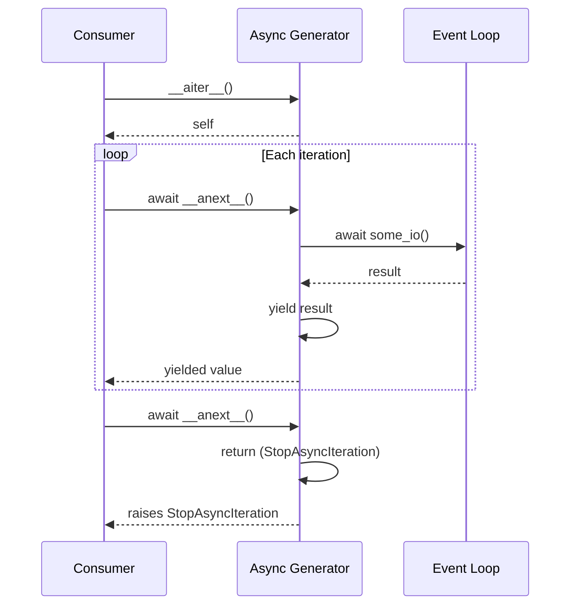
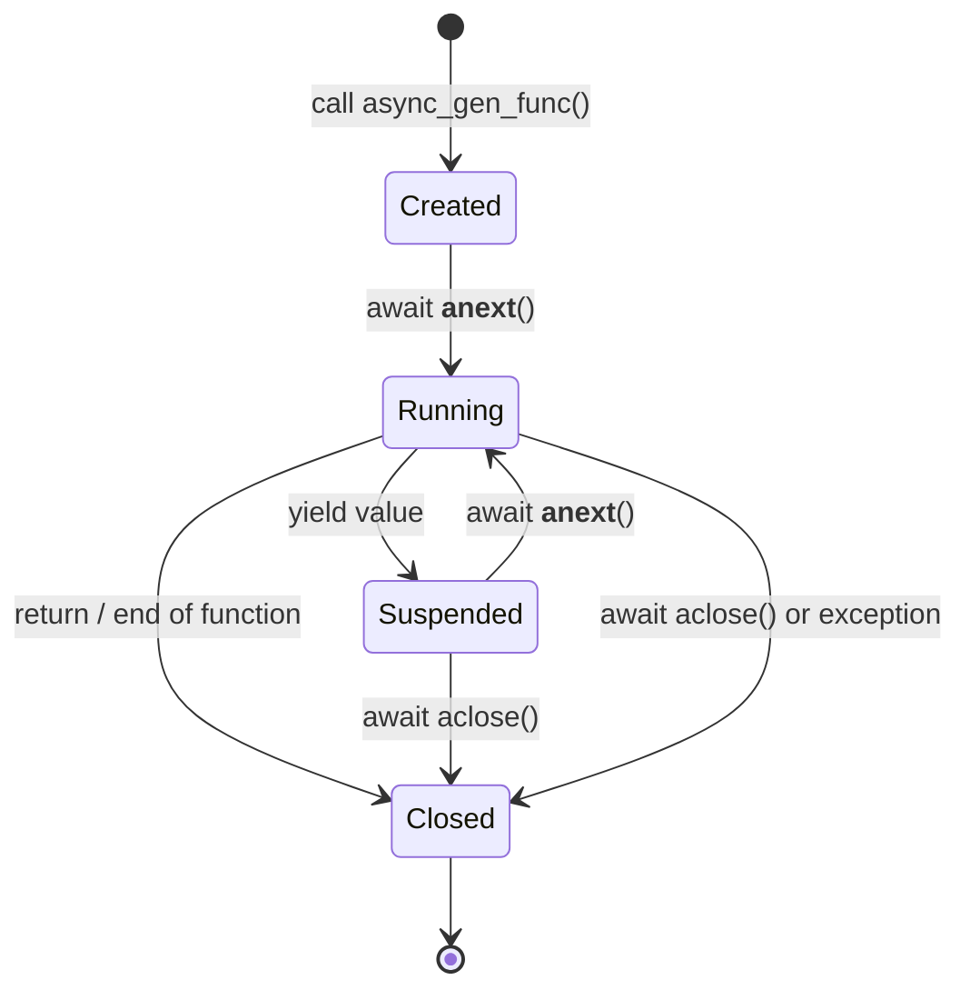

# 2. Async Generators

> [!note] Why this note exists
> [[10. Pythonic Programming/2. Generators and Iterators]] introduced sync generators. [[14. Concurrency/5. async-await]] introduced coroutines. Async generators are the **intersection**: functions that look like generators (`yield`) but can also `await` — perfect for streaming data from async sources (HTTP responses, database cursors, message queues, WebSocket streams). This note covers the `async def` + `yield` syntax, `async for`, async comprehensions, and the patterns for building clean async pipelines.

## Why It Matters

A surprising amount of real-world data doesn't arrive all at once:
- A **large HTTP response** arrives in chunks.
- A **database cursor** yields rows one at a time.
- A **WebSocket** pushes messages over time.
- A **log tail** produces lines as they're written.
- A **Kafka topic** streams events continuously.

For each of these, you want code that:
1. Doesn't buffer the entire stream in memory (could be gigabytes).
2. Reads lazily — only fetches the next chunk when the consumer is ready.
3. Can `await` I/O between elements (e.g., `await socket.recv()`).

Sync generators solve (1) and (2) but can't do (3) — they have no `await`. Coroutines solve (3) but return a single value, not a stream. **Async generators** solve all three.

Async generators are the foundation of modern async streaming libraries: `httpx` async streaming, `asyncpg` cursors, `aiokafka` consumers, `websockets` message loops — all use async generators under the hood. Knowing how they work lets you build your own streaming abstractions and debug the ones you depend on.

## Background

### The `async def` + `yield` syntax

```python
async def stream_lines(reader):
    while True:
        line = await reader.readline()
        if not line:
            break
        yield line
```

Combining `async def` with `yield` defines an **async generator function**. Calling it returns an **async generator object** — not a coroutine, not a regular generator.

Three rules:
1. The function is defined with `async def`.
2. The body contains `yield` (anywhere, any number).
3. The body can `await` between yields.

### What you get back

```python
gen = stream_lines(reader)
type(gen)   # <class 'async_generator'>
```

The async generator object implements two dunder methods:
- `__anext__` — an async method that resumes the generator and returns the next yielded value (or raises `StopAsyncIteration`).
- `__aiter__` — returns `self` (async generators are their own async iterators).

You can't call `next(gen)` — there's no sync `__next__`. You can't `for line in gen` — there's no sync `__iter__`. You must use `await gen.__anext__()` or, more commonly, `async for`.

### `async for` — the consumer syntax

```python
async def consume(reader):
    async for line in stream_lines(reader):
        print(line.decode().rstrip())
```

`async for` is the async counterpart of `for`. It:
1. Calls `__aiter__()` on the target (or accepts an async iterable directly).
2. Awaits `__anext__()` on the iterator.
3. On `StopAsyncIteration`, exits the loop.
4. Otherwise, binds the value to the loop variable and runs the body.

### Async iterables vs async iterators

- An **async iterable** has `__aiter__` (which returns an async iterator).
- An **async iterator** has `__anext__` (and usually `__aiter__` returning self).

Async generators implement both, so they're both async iterables and async iterators.

You can write a class-based async iterator:

```python
class AsyncCounter:
    def __init__(self, limit):
        self.limit = limit
        self.current = 0

    def __aiter__(self):
        return self

    async def __anext__(self):
        if self.current >= self.limit:
            raise StopAsyncIteration
        self.current += 1
        await asyncio.sleep(0.1)   # simulate async work
        return self.current - 1

async def main():
    async for n in AsyncCounter(3):
        print(n)
# 0, 1, 2
```

Use a class when you need state that doesn't fit the generator pattern (multiple methods, external cancellation, etc.). Use `async def` + `yield` for everything else — it's simpler.

## Main content

### The basics

```python
import asyncio

async def count_to(n):
    for i in range(n):
        await asyncio.sleep(0.1)
        yield i

async def main():
    async for n in count_to(5):
        print(n)

asyncio.run(main())
# 0, 1, 2, 3, 4
```

Each `yield` produces a value and suspends the generator. The next `async for` iteration resumes it.

### `yield from` doesn't exist for async — use `async for` + `yield`

In sync generators, `yield from sub_gen` delegates to a sub-generator. There's **no `async yield from`** — you must explicitly delegate:

```python
async def chain(*agens):
    for agen in agens:
        async for item in agen:
            yield item
```

This is the standard pattern for chaining async generators.

### Async comprehensions

Python 3.6+ supports three kinds of async comprehension:

```python
# Async list comprehension:
results = [x async for x in stream]

# Async set comprehension:
results = {x async for x in stream}

# Async dict comprehension:
results = {k: v async for k, v in stream}

# Async generator expression (creates an async generator):
results = (x async for x in stream)
```

These require `async def` context. They're the async counterpart of `[x for x in sync_iter]`.

#### Conditional async comprehensions

```python
even = [x async for x in stream if x % 2 == 0]
```

The `if` clause can also be async, but the expression is sync:

```python
filtered = [
    process(x)
    async for x in stream
    if await is_valid(x)
]
```

### Composing async generators

The killer feature of async generators is **lazy composition** — pipeline stages that each process one item at a time:

```python
import asyncio

async def numbers(start, end):
    for n in range(start, end):
        await asyncio.sleep(0.05)
        yield n

async def evens(agen):
    async for n in agen:
        if n % 2 == 0:
            yield n

async def squared(agen):
    async for n in agen:
        yield n ** 2

async def limited(agen, count):
    async for i, n in enumerate(agen):
        if i >= count:
            break
        yield n

async def main():
    pipeline = limited(squared(evens(numbers(1, 100))), 5)
    async for x in pipeline:
        print(x)
# 4, 16, 36, 64, 100   — first 5 even squares
```

Each stage pulls from the previous one. Memory is O(1) — only one item is in flight at any moment.

### Teardown: `aclose()` and `finally`

Async generators support cleanup with `finally` blocks:

```python
async def read_stream(url):
    reader = await open_reader(url)
    try:
        async for chunk in reader:
            yield chunk
    finally:
        await reader.close()
```

If the consumer breaks early (e.g., `break` in `async for`, or an exception), the generator's `finally` runs when `aclose()` is called.

```python
async def main():
    gen = read_stream(url)
    async for chunk in gen:
        if b"END" in chunk:
            break
    await gen.aclose()   # explicit teardown
```

The loop also calls `aclose()` automatically during garbage collection (Python 3.10+) or via `loop.shutdown_asyncgens()` (called by `asyncio.run`). But explicit `aclose()` is good practice for long-running consumers.

### The async generator protocol in detail



When `await __anext__()` is called:
1. The generator resumes from where it last yielded.
2. It runs until the next `yield` (or `return`/exception/end-of-function).
3. If `yield`, the yielded value is returned to the caller.
4. If the function ends, `StopAsyncIteration` is raised.
5. If an exception propagates, it's raised to the caller.

### `athrow` and `aclose`

You can throw an exception into a generator from outside, just like sync generators:

```python
async def gen():
    try:
        yield 1
    except ValueError as e:
        print(f"caught: {e}")
        yield 2

g = gen()
v = await g.__anext__()   # 1
await g.athrow(ValueError, "boom")
# prints "caught: boom", then returns 2
v = await g.__anext__()   # 2
```

`aclose()` is sugar for `athrow(GeneratorExit)`:

```python
async def gen():
    try:
        yield 1
        yield 2
    except GeneratorExit:
        print("cleaning up")
        # don't yield here — that's an error
        return

g = gen()
await g.__anext__()   # 1
await g.aclose()      # prints "cleaning up"
```

### Async generator pipelines: a realistic example

```python
import asyncio
import aiohttp

async def fetch_pages(urls):
    async with aiohttp.ClientSession() as session:
        for url in urls:
            async with session.get(url) as response:
                yield url, await response.text()

async def extract_links(html):
    # Pretend parser:
    for href in find_all_hrefs(html):
        yield href

async def dedupe(agen):
    seen = set()
    async for item in agen:
        if item not in seen:
            seen.add(item)
            yield item

async def crawl(urls, max_pages=10):
    pipeline = dedupe(
        href
        async for url, html in fetch_pages(urls)
        async for href in extract_links(html)
    )
    count = 0
    async for href in pipeline:
        print(href)
        count += 1
        if count >= max_pages:
            break

asyncio.run(crawl(["https://example.com"]))
```

This pipeline is fully lazy and uses O(seen) memory regardless of how many pages are crawled.

## Mermaid: async generator flow


Each arrow represents one async iteration — the consumer pulls one item at a time through the whole chain.

## Mermaid: lifecycle of an async generator



## Code examples

### Streaming a large file from disk (chunked)

```python
import asyncio
import aiofiles

async def read_chunks(path, chunk_size=65536):
    async with aiofiles.open(path, 'rb') as f:
        while True:
            chunk = await f.read(chunk_size)
            if not chunk:
                break
            yield chunk

async def count_bytes(path):
    total = 0
    async for chunk in read_chunks(path):
        total += len(chunk)
    return total

# Process a 100GB file with constant memory
asyncio.run(count_bytes("/data/huge.bin"))
```

### An async iterator that wraps a queue

```python
import asyncio

class AsyncStream:
    """Bridges a sync producer (running in a thread) to async consumers."""
    def __init__(self):
        self.queue = asyncio.Queue()

    def __aiter__(self):
        return self

    async def __anext__(self):
        item = await self.queue.get()
        if item is None:   # sentinel
            raise StopAsyncIteration
        return item

    async def feed(self, items):
        for item in items:
            await self.queue.put(item)
        await self.queue.put(None)

async def main():
    stream = AsyncStream()
    feeder = asyncio.create_task(stream.feed([1, 2, 3, 4, 5]))
    async for item in stream:
        print(item)
    await feeder
```

### WebSocket message stream

```python
import asyncio
import websockets

async def messages(uri):
    async with websockets.connect(uri) as ws:
        async for message in ws:
            yield message

async def main():
    async for msg in messages("ws://echo.example.com"):
        print(msg)

asyncio.run(main())
```

The `websockets` library's connection is itself an async iterator — `async for msg in ws` reads messages as they arrive.

### Backpressure with `asyncio.Queue`

```python
import asyncio

async def producer(queue, n):
    for i in range(n):
        await asyncio.sleep(0.01)   # simulate work
        await queue.put(i)
    await queue.put(None)   # sentinel

async def consumer(queue):
    while True:
        item = await queue.get()
        if item is None:
            break
        await asyncio.sleep(0.05)   # simulate slow consumer
        print(item)
        queue.task_done()

async def main():
    q = asyncio.Queue(maxsize=10)   # backpressure!
    await asyncio.gather(producer(q, 100), consumer(q))

asyncio.run(main())
```

`maxsize=10` means the producer blocks on `put` when the queue is full, until the consumer catches up. This is **backpressure** — essential for streaming pipelines.

### Combining with `asyncio.gather`

```python
async def process_stream(stream):
    async for item in stream:
        await process(item)

async def fan_out(source, n_workers):
    queue = asyncio.Queue(maxsize=100)
    workers = [asyncio.create_task(process_stream(queue)) for _ in range(n_workers)]

    async for item in source:
        await queue.put(item)

    for _ in workers:
        await queue.put(None)
    await asyncio.gather(*workers)
```

A producer async generator feeding a pool of async workers — clean, idiomatic, and memory-bounded.

## Common Pitfalls

> [!warning] Forgetting `async` in the consumer
> ```python
> for x in my_async_gen():   # TypeError: 'async_generator' is not iterable
> ```
> Use `async for`. Async generators are not sync iterables.

> [!warning] Yielding from inside a sync `for` loop
> ```python
> async def gen():
>     for x in range(10):   # sync loop, fine
>         yield x
> ```
> This is OK. The `for` is sync; the `yield` makes the function async. Just remember: the loop body can `await`.

> [!warning] Mixing `return value` and `yield` in async generators
> ```python
> async def gen():
>     yield 1
>     return 2   # SyntaxError in older Pythons; in 3.7+ it's allowed but the value is discarded
> ```
> `return value` in an async generator stops iteration; the value is **ignored**. Use `StopAsyncIteration` value only via `return` (no value).

> [!warning] Generator leaks
> If you break out of `async for` without `aclose()`, the generator may not be cleaned up promptly. Python 3.10+ runs `aclose` during GC, but it's safer to be explicit:
> ```python
> gen = stream()
> try:
>     async for x in gen:
>         if done: break
> finally:
>     await gen.aclose()
> ```

> [!warning] Async generators in non-async contexts
> You can't iterate an async generator from sync code. You must be inside `async def` (or use `asyncio.run`).

> [!warning] Slow consumers block producers
> If your consumer is slow and you're not using a queue with `maxsize`, the producer will pile up items in memory. Use `asyncio.Queue(maxsize=N)` for backpressure.

> [!warning] Exception in `finally` block
> If an exception in a `finally` block of an async generator escapes, the consumer sees it. Make sure cleanup code is bulletproof (or wrap in `try/except`).

> [!warning] `await` outside `async def`
> Async comprehensions and `async for` are only legal inside `async def`. A script-level `[x async for x in gen]` is a `SyntaxError`.

## Tips and Tricks

> [!tip] Use async generators for streaming I/O
> Any source that yields data over time — HTTP, files, sockets, queues — is a perfect async generator. Wrap once, reuse everywhere.

> [!tip] Compose with helper functions
> Write small, focused async generators (`evens`, `squared`, `dedupe`, `take`) and chain them. This is the Unix pipe philosophy, async-style.

> [!tip] Use `asyncio.Queue` for backpressure
> A queue with `maxsize` enforces flow control — the producer waits when the consumer is slow. Essential for memory-bounded pipelines.

> [!tip] Explicit `aclose()` for long-lived generators
> In long-running servers, don't rely on GC. Call `await gen.aclose()` when you're done.

> [!tip] Async comprehensions are convenient but eager
> `[x async for x in gen]` materializes the whole list. For large streams, use the async generator expression `(x async for x in gen)` and iterate lazily.

> [!tip] Test with `asyncio.iscoroutine` and `asyncio.isasyncgen`
> `asyncio.isasyncgen(obj)` returns `True` for async generator objects. Useful for type-checking in library code.

> [!tip] Combine with `asyncio.TaskGroup` (Python 3.11+)
> See [[4. Task Groups (Python 3.11+)]] — TaskGroups make it easy to spawn parallel consumers of an async generator and gather their results.

> [!tip] Profile with `asyncio.get_event_loop().set_debug(True)`
> Slow callbacks (e.g., a synchronous chunk inside an async generator) will be logged.

## Advanced patterns

### Async generator-based state machines

Async generators can encode stateful streaming logic compactly:

```python
import asyncio

async def line_processor(reader):
    """State machine that processes lines, tracking context."""
    in_section = False
    section_lines = 0

    async for line in reader:
        line = line.rstrip()
        if line.startswith("BEGIN SECTION"):
            in_section = True
            section_lines = 0
            continue
        elif line.startswith("END SECTION"):
            in_section = False
            yield f"=== section had {section_lines} lines ==="
            continue

        if in_section:
            section_lines += 1
            yield f"section: {line}"
        else:
            yield f"outside: {line}"
```

Each yield produces a value while preserving the generator's local state (`in_section`, `section_lines`) between iterations. This is a clean way to write streaming parsers.

### Merging multiple async streams

```python
import asyncio
import random

async def merge(*agen_list):
    """Merge multiple async generators, yielding items as they arrive."""
    queue = asyncio.Queue()
    active = len(agen_list)

    async def producer(agen):
        nonlocal active
        try:
            async for item in agen:
                await queue.put(item)
        finally:
            active -= 1
            if active == 0:
                await queue.put(None)   # sentinel

    tasks = [asyncio.create_task(producer(a)) for a in agen_list]

    try:
        while True:
            item = await queue.get()
            if item is None:
                break
            yield item
    finally:
        for t in tasks:
            t.cancel()
        await asyncio.gather(*tasks, return_exceptions=True)

async def source(name, count):
    for i in range(count):
        await asyncio.sleep(random.uniform(0, 0.1))
        yield f"{name}-{i}"

async def main():
    async for item in merge(source("A", 5), source("B", 3), source("C", 4)):
        print(item)

asyncio.run(main())
```

This is a **fan-in** pattern — multiple producers, one consumer. Combined with the fan-out pattern below, you can build complex routing topologies.

### Buffered async pipelines

For high-throughput pipelines, buffer between stages to smooth out variance:

```python
import asyncio

async def buffered(agen, buffer_size=100):
    """Buffer items between producer and consumer for smooth throughput."""
    queue = asyncio.Queue(maxsize=buffer_size)
    sentinel = object()

    async def fill():
        try:
            async for item in agen:
                await queue.put(item)
        finally:
            await queue.put(sentinel)

    task = asyncio.create_task(fill())
    try:
        while True:
            item = await queue.get()
            if item is sentinel:
                break
            yield item
    finally:
        await task
```

The `maxsize=100` provides **bounded buffering** — the producer pauses if the consumer falls behind, preventing memory blowup. This is the standard pattern for streaming pipelines that need to handle variance.

### Async generators vs channels

Languages like Go and Rust use **channels** for async communication. Python's async generators + `asyncio.Queue` provide similar functionality:

| Concept            | Go channel          | Python equivalent                |
|--------------------|---------------------|----------------------------------|
| Send to channel    | `ch <- value`       | `await queue.put(value)`         |
| Receive from channel | `value := <-ch`   | `value = await queue.get()`      |
| Bounded buffer     | `make(chan T, N)`   | `asyncio.Queue(maxsize=N)`       |
| Close channel      | `close(ch)`         | `await queue.put(sentinel)`      |
| Select (multiplex) | `select { case ... }` | `asyncio.wait` / `Queue.get`    |

The Go pattern is more concise; the Python pattern is more flexible (any async generator can serve as a source).

### Testing async generators

```python
import asyncio
import pytest

async def my_gen():
    yield 1
    yield 2
    yield 3

@pytest.mark.asyncio
async def test_my_gen():
    items = [item async for item in my_gen()]
    assert items == [1, 2, 3]

# With error handling:
@pytest.mark.asyncio
async def test_my_gen_partial():
    """Test that we can consume part of an async generator."""
    gen = my_gen()
    first = await gen.__anext__()
    assert first == 1
    await gen.aclose()   # cleanup
```

`pytest-asyncio` provides `@pytest.mark.asyncio` for async tests. Async generators are consumed with `async for` or `__anext__`/`aclose`.

## Active Recall

1. What two keywords define an async generator? What can't you do in an async generator that you can in a regular one?
2. `async for x in gen` does what three things under the hood?
3. How do you delegate from one async generator to another? (Hint: there's no `async yield from`.)
4. Write an async comprehension that filters items via an async predicate.
5. What does `await gen.aclose()` do? When should you call it explicitly?
6. How do you implement an async iterator as a class? Which two dunder methods are required?
7. What's the memory characteristic of a chained async generator pipeline?
8. How does `asyncio.Queue(maxsize=N)` provide backpressure?
9. Can you `yield` from inside a `finally` block in an async generator? Why or why not?
10. What's the difference between an async iterable and an async iterator?

## Next Steps

- [[1. Event Loops]] — the loop schedules async generator resumption.
- [[3. Async Context Managers]] — pairs naturally (e.g., `async with` to open a stream, `async for` to read it).
- [[4. Task Groups (Python 3.11+)]] — for parallel consumers of a stream.
- [[10. Pythonic Programming/2. Generators and Iterators]] — sync generators, the foundation.
- [[14. Concurrency/5. async-await]] — the underlying language feature.
- [[9. Standard Library Deep Dive/5. itertools]] — `chain`, `takewhile`, `dropwhile` have async equivalents in `itertools`-style libraries.
