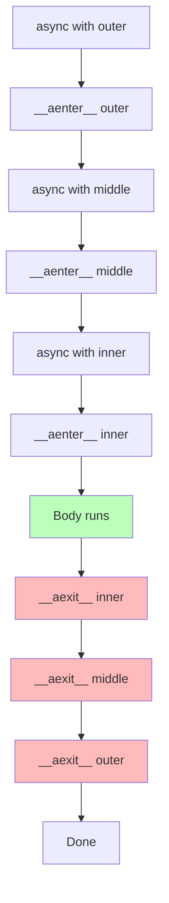

# 3. Async Context Managers

> [!note] Why this note exists
> [[5. Error Handling/4. Context Managers]] and [[10. Pythonic Programming/3. Context Managers]] covered the sync `with` statement and the `__enter__`/`__exit__` protocol. This note covers the **async** version: `async with`, the `__aenter__`/`__aexit__` dunder protocol, the `@asynccontextmanager` decorator, and the patterns for managing async resources (DB connections, HTTP sessions, file handles via `aiofiles`, locks, semaphores). After this note you'll know when to write a class-based async context manager vs a decorator-based one, and how to make your async resources release cleanly even under exceptions.

## Why It Matters

Resources need cleanup. A database connection must be returned to the pool. A file must be closed. A lock must be released. A network session must be torn down. In sync code, `with` solves this — the `__exit__` method runs even if the body raises.

In async code, the cleanup itself is often async:
- Closing an HTTP session sends a `Connection: close` frame.
- Releasing a distributed lock calls a Redis `DEL`.
- Closing a DB connection runs `COMMIT`/`ROLLBACK` over the wire.

A sync `__exit__` can't `await` these — it would block the event loop. The async context manager protocol adds `__aenter__` and `__aexit__`, both coroutines, so setup and teardown can `await` properly.

Without async context managers, you'd write `try`/`finally` with explicit `await` calls in the `finally` block — workable but verbose and error-prone. `async with` makes resource management as clean as its sync counterpart.

## Background

### Sync vs async context managers

```python
# Sync:
class SyncResource:
    def __enter__(self):
        self.open()
        return self
    def __exit__(self, exc_type, exc, tb):
        self.close()
        return False

with SyncResource() as r:
    r.use()

# Async:
class AsyncResource:
    async def __aenter__(self):
        await self.open()
        return self
    async def __aexit__(self, exc_type, exc, tb):
        await self.close()
        return False

async with AsyncResource() as r:
    await r.use()
```

The differences:
- Method names: `__enter__`/`__exit__` → `__aenter__`/`__aexit__`.
- Methods are coroutines (`async def`).
- Statement: `with` → `async with`.
- Must be used inside `async def` (or with `asyncio.run`).

### The protocol in detail

`async with expr as var: body` evaluates to:

1. Evaluate `expr` to get a context manager object `cm`.
2. `var = await cm.__aenter__()`.
3. Run `body`.
4. Whether `body` completes normally or raises, `await cm.__aexit__(exc_type, exc, tb)` runs.
   - If `body` raised, `exc_type`, `exc`, `tb` are the exception's class, instance, and traceback.
   - If `body` completed normally, all three are `None`.
5. If `__aexit__` returns a truthy value, the exception is **suppressed** (rarely what you want).
6. If `__aexit__` returns a falsy value (or `None`), the exception propagates.

### Why not just `try`/`finally`?

You can always write:

```python
r = AsyncResource()
await r.open()
try:
    await r.use()
finally:
    await r.close()
```

This works, but:
- It's 4 lines instead of 2.
- It's easy to forget the `try`/`finally` when adding the second `await r.use()`.
- It doesn't compose: you can't pass `r` to a function that expects a context manager.
- It doesn't suppress exceptions cleanly (you'd need a `return True` semantic).

`async with` makes the cleanup **structural** — tied to the syntactic block, not to the developer's discipline.

## Main content

### Class-based async context managers

```python
import asyncio

class AsyncTimer:
    def __init__(self, name):
        self.name = name

    async def __aenter__(self):
        self.start = asyncio.get_running_loop().time()
        print(f"{self.name}: enter")
        return self

    async def __aexit__(self, exc_type, exc, tb):
        elapsed = asyncio.get_running_loop().time() - self.start
        print(f"{self.name}: exit after {elapsed:.3f}s")
        if exc:
            print(f"{self.name}: exception {exc!r}")
        return False   # don't suppress

async def main():
    async with AsyncTimer("op1"):
        await asyncio.sleep(0.5)

asyncio.run(main())
# op1: enter
# op1: exit after 0.500s
```

Key points:
- `__aenter__` returns the object that gets bound by `as`. Often `self`, but can be anything (e.g., the underlying connection).
- `__aexit__` always runs, even on exception.
- Return `False` (or `None`) to propagate exceptions. Return `True` only when you intentionally suppress (rare).

### The `@asynccontextmanager` decorator

For simple cases, a class is overkill. `contextlib.asynccontextmanager` wraps an async generator into a context manager:

```python
from contextlib import asynccontextmanager
import asyncio

@asynccontextmanager
async def timer(name):
    start = asyncio.get_running_loop().time()
    print(f"{name}: enter")
    try:
        yield   # the body of `async with` runs here
    finally:
        elapsed = asyncio.get_running_loop().time() - start
        print(f"{name}: exit after {elapsed:.3f}s")

async def main():
    async with timer("op1"):
        await asyncio.sleep(0.5)
```

The yield point is where the body runs. Code before `yield` is `__aenter__`; code after (in `finally`) is `__aexit__`.

#### Yielding a value

```python
@asynccontextmanager
async def db_transaction(conn):
    await conn.execute("BEGIN")
    try:
        yield conn
        await conn.execute("COMMIT")
    except Exception:
        await conn.execute("ROLLBACK")
        raise

async with db_transaction(conn) as tx:
    await tx.execute("INSERT ...")
```

The yielded value is bound by `as`. This is the most common pattern — yield a resource that the body uses.

#### Exception handling

```python
@asynccontextmanager
async def safe_op():
    try:
        yield
    except ValueError as e:
        print(f"swallowed: {e}")
        # No re-raise → suppresses the exception
    except Exception:
        print("re-raising")
        raise
```

If the generator body (between `yield` and the rest) catches an exception without re-raising, the exception is suppressed — equivalent to `__aexit__` returning `True`. This is consistent with how sync `@contextmanager` works.

### Common real-world async context managers

#### HTTP sessions

```python
import aiohttp
import asyncio

async def fetch_all(urls):
    async with aiohttp.ClientSession() as session:
        results = []
        for url in urls:
            async with session.get(url) as response:
                results.append(await response.text())
        return results
```

Two nested async context managers:
- `ClientSession()` — manages the connection pool and lifecycle.
- `session.get(url)` — manages a single request/response.

Both have async `__aexit__` that closes the underlying connection.

#### Database connections (asyncpg)

```python
import asyncpg
import asyncio

async def get_user(user_id):
    conn = await asyncpg.connect("postgresql://localhost/mydb")
    try:
        return await conn.fetchrow("SELECT * FROM users WHERE id=$1", user_id)
    finally:
        await conn.close()

# Better with a context manager wrapper:
from contextlib import asynccontextmanager

@asynccontextmanager
async def db_connection(*args, **kwargs):
    conn = await asyncpg.connect(*args, **kwargs)
    try:
        yield conn
    finally:
        await conn.close()

async def get_user(user_id):
    async with db_connection("postgresql://localhost/mydb") as conn:
        return await conn.fetchrow("SELECT * FROM users WHERE id=$1", user_id)
```

#### File I/O with `aiofiles`

```python
import aiofiles
import asyncio

async def read_config(path):
    async with aiofiles.open(path, 'r') as f:
        return await f.read()

async def write_log(path, message):
    async with aiofiles.open(path, 'a') as f:
        await f.write(message + "\n")
```

`aiofiles.open()` returns an async context manager that closes the file in `__aexit__`. Use it for any file I/O in async code — sync `open()` blocks the loop.

> [!note] Why aiofiles?
> On Linux, regular file reads aren't truly async — they complete in microseconds — but they still block the calling thread. `aiofiles` runs them in a thread pool via `loop.run_in_executor`, so they don't stall the loop. On Windows, true async file I/O exists (IOCP), and `asyncio`'s `ProactorEventLoop` can use it.

#### Locks and semaphores

```python
import asyncio

async def critical_section(lock, resource):
    async with lock:
        # Only one task at a time runs this
        await resource.update()

async def rate_limited(urls, max_concurrent=10):
    sem = asyncio.Semaphore(max_concurrent)

    async def fetch(url):
        async with sem:
            return await http_get(url)

    return await asyncio.gather(*[fetch(u) for u in urls])
```

`asyncio.Lock` and `asyncio.Semaphore` are both async context managers. Acquiring in `__aenter__`, releasing in `__aexit__` — even on exception.

### Async `ExitStack` — dynamic composition

Sometimes you don't know at write-time how many resources you'll acquire. `contextlib.AsyncExitStack` lets you push context managers dynamically:

```python
from contextlib import AsyncExitStack
import asyncio

async def process_files(paths):
    async with AsyncExitStack() as stack:
        files = [
            await stack.enter_async_context(aiofiles.open(p, 'r'))
            for p in paths
        ]
        # All files will be closed when the `async with` exits
        for f in files:
            content = await f.read()
            print(content)
```

`AsyncExitStack` enters each context manager as you push it, and exits them in reverse order on teardown. This is essential when the number of resources is dynamic.

### Composing multiple async context managers

For a fixed number of resources, just nest:

```python
async with conn_a, conn_b, conn_c:
    ...
```

This is shorthand for nested `async with` blocks:

```python
async with conn_a:
    async with conn_b:
        async with conn_c:
            ...
```

Acquired in order, released in reverse. If any `__aenter__` fails, the previously entered ones are exited.

### Suppressing exceptions

```python
from contextlib import suppress

async def safe_delete(path):
    async with suppress(FileNotFoundError):
        async with aiofiles.open(path) as f:
            ...
        await aiofiles.os.remove(path)
```

`suppress(*exceptions)` is an async context manager (in 3.10+; before, use the sync version which works for both) that swallows the given exceptions.

## Mermaid: async context manager protocol

```mermaid
sequenceDiagram
    participant Code as User code
    participant CM as Context manager
    participant Loop as Event loop

    Code->>CM: async with CM() as r
    CM->>Loop: await __aenter__()
    Loop-->>CM: returns resource r
    CM-->>Code: r bound
    Code->>Code: run body
    alt Body completes
        Code->>CM: await __aexit__(None, None, None)
    else Body raises Exc
        Code->>CM: await __aexit__(Exc, instance, tb)
    end
    CM->>Loop: cleanup (e.g., close connection)
    alt __aexit__ returns False
        CM-->>Code: exception propagates
    else __aexit__ returns True
        CM-->>Code: exception suppressed
    end
```

## Mermaid: nested context managers



Teardown happens in reverse order — like a stack. If any `__aexit__` raises, the outer ones still run (with the original exception chained).

## Code examples

### A connection-pool context manager

```python
from contextlib import asynccontextmanager
import asyncio

class AsyncConnectionPool:
    def __init__(self, max_size=10):
        self.max_size = max_size
        self.semaphore = asyncio.Semaphore(max_size)
        self.connections = asyncio.Queue()

    async def acquire(self):
        await self.semaphore.acquire()
        try:
            conn = self.connections.get_nowait()
        except asyncio.QueueEmpty:
            conn = await self._create()
        return conn

    async def release(self, conn):
        await self.connections.put(conn)
        self.semaphore.release()

    async def _create(self):
        # Pretend to open a real connection
        await asyncio.sleep(0.01)
        return {"id": id(self), "alive": True}

    async def _close(self, conn):
        conn["alive"] = False

    @asynccontextmanager
    async def connection(self):
        conn = await self.acquire()
        try:
            yield conn
        finally:
            await self.release(conn)

async def main():
    pool = AsyncConnectionPool(max_size=5)

    async def worker(i):
        async with pool.connection() as conn:
            print(f"worker {i}: using {conn['id']}")
            await asyncio.sleep(0.1)

    await asyncio.gather(*[worker(i) for i in range(20)])

asyncio.run(main())
```

### Timing multiple async operations

```python
from contextlib import asynccontextmanager
import asyncio

@asynccontextmanager
async def timed(name, results):
    start = asyncio.get_running_loop().time()
    try:
        yield
    finally:
        elapsed = asyncio.get_running_loop().time() - start
        results[name] = elapsed

async def main():
    results = {}
    async with timed("total", results):
        async with timed("step1", results):
            await asyncio.sleep(0.3)
        async with timed("step2", results):
            await asyncio.sleep(0.5)

    print(results)
    # {'step1': 0.300, 'step2': 0.500, 'total': 0.801}

asyncio.run(main())
```

### Database transaction with rollback

```python
from contextlib import asynccontextmanager
import asyncpg

@asynccontextmanager
async def transaction(conn):
    await conn.execute("BEGIN")
    try:
        yield conn
        await conn.execute("COMMIT")
    except Exception:
        await conn.execute("ROLLBACK")
        raise

async def transfer(conn, from_id, to_id, amount):
    async with transaction(conn):
        await conn.execute("UPDATE accounts SET balance = balance - $1 WHERE id = $2", amount, from_id)
        await conn.execute("UPDATE accounts SET balance = balance + $1 WHERE id = $2", amount, to_id)
```

If either UPDATE fails, the entire transaction rolls back. The exception propagates so the caller knows.

### AsyncExitStack for dynamic resources

```python
from contextlib import AsyncExitStack
import aiofiles
import asyncio

async def merge_files(paths, output_path):
    async with AsyncExitStack() as stack:
        inputs = [
            await stack.enter_async_context(aiofiles.open(p, 'r'))
            for p in paths
        ]
        output = await stack.enter_async_context(aiofiles.open(output_path, 'w'))

        for f in inputs:
            async for line in f:
                await output.write(line)
```

All input files and the output file are closed when the `async with` exits, even if an exception is raised mid-merge.

## Common Pitfalls

> [!warning] Using sync `with` for async resources
> ```python
> with aiohttp.ClientSession() as session:   # WRONG
>     ...
> ```
> This calls sync `__enter__`/`__exit__`, which (if defined) won't `await` cleanup properly. Use `async with`.

> [!warning] Forgetting `await` in `__aenter__`/`__aexit__`
> ```python
> class Bad:
>     def __aenter__(self):   # not async!
>         ...
> ```
> `async with` requires `__aenter__` and `__aexit__` to be awaitable. If they're not async, you'll get a `TypeError` when `async with` tries to `await` them.

> [!warning] Yielding more than once in `@asynccontextmanager`
> ```python
> @asynccontextmanager
> async def bad():
>     yield 1
>     yield 2   # RuntimeError: async generator didn't stop
> ```
> The generator must yield exactly once.

> [!warning] Not handling exceptions in `__aexit__`
> If your cleanup code raises, the original exception is masked. Always wrap critical cleanup in `try`/`except`:
> ```python
> async def __aexit__(self, *exc):
>     try:
>         await self.close()
>     except Exception:
>         # log, but don't mask the original exception
>         pass
>     return False
> ```

> [!warning] Mixing sync and async context managers
> Sync context managers can be used in async code:
> ```python
> async def main():
>     with open("file") as f:   # sync, but legal
>         data = f.read()
> ```
> But if the sync operation blocks the loop (e.g., a slow file), use the async version (`aiofiles.open`).

> [!warning] Suppressing exceptions unintentionally
> `__aexit__` returning `True` suppresses the exception. Most of the time you want `False` (or `None`). Only suppress when you really mean it.

> [!warning] Forgetting `try`/`finally` around `yield` in `@asynccontextmanager`
> ```python
> @asynccontextmanager
> async def bad():
>     await acquire()
>     yield   # if body raises, cleanup is skipped!
>     await release()
> ```
> Use `try`/`finally`:
> ```python
> @asynccontextmanager
> async def good():
>     await acquire()
>     try:
>         yield
>     finally:
>         await release()
> ```

> [!warning] Async context managers can't be reused
> Most async context managers are designed for a single `async with` block. Reusing them across multiple `async with` statements can lead to subtle bugs (state from the previous run leaking in).

## Tips and Tricks

> [!tip] Prefer `@asynccontextmanager` for simple cases
> It's 3–5 lines vs a 10-line class. Reserve class-based for cases with multiple `__aenter__`/`__aexit__` paths or complex state.

> [!tip] Always use `try`/`finally` around `yield`
> The body might raise; you must still clean up. The pattern is mechanical but essential.

> [!tip] Use `AsyncExitStack` for dynamic resource sets
> When the number of resources is determined at runtime, `AsyncExitStack` handles acquisition and teardown correctly.

> [!tip] Combine with `asyncio.Lock` for serial sections
> ```python
> async with lock, db_connection() as conn:
>     await conn.execute("UPDATE ...")
> ```
> Acquire lock and connection atomically; release both on exit.

> [!tip] Return useful objects from `__aenter__`
> `__aenter__` doesn't have to return `self`. Often it returns the underlying resource (e.g., a connection), hiding the wrapper from the caller.

> [!tip] Test cleanup with deliberate exceptions
> ```python
> async with my_resource() as r:
>     raise RuntimeError("test")
> # Verify cleanup ran
> ```
> Make sure your `__aexit__` runs correctly when the body raises.

> [!tip] Timeouts via `asyncio.timeout` (Python 3.11+)
> ```python
> async with asyncio.timeout(2.0):
>     await slow_operation()
> ```
> Cleaner than the older `asyncio.wait_for`. Raises `TimeoutError` on expiry.

> [!tip] Use `suppress` for expected exceptions
> ```python
> from contextlib import suppress
> async with suppress(FileNotFoundError):
>     await aiofiles.os.remove(path)
> ```

## Advanced patterns

### Reentrant vs non-reentrant context managers

Most async context managers are **non-reentrant** — they can only be entered once at a time per instance. `asyncio.Lock` is non-reentrant: if you try to acquire it twice from the same task, you deadlock.

For reentrant behavior, track ownership:

```python
import asyncio
from contextlib import asynccontextmanager

class ReentrantAsyncLock:
    def __init__(self):
        self._lock = asyncio.Lock()
        self._owner = None
        self._count = 0

    @asynccontextmanager
    async def __call__(self):
        task = asyncio.current_task()
        if self._owner is task:
            self._count += 1
        else:
            await self._lock.acquire()
            self._owner = task
            self._count = 1
        try:
            yield
        finally:
            self._count -= 1
            if self._count == 0:
                self._lock.release()
                self._owner = None
```

This allows the same task to enter the lock multiple times without deadlocking. Use sparingly — reentrancy is often a sign of confused control flow.

### Async context manager pools

A pool that hands out resources via async context managers:

```python
import asyncio
from contextlib import asynccontextmanager

class AsyncPool:
    def __init__(self, factory, max_size=10):
        self._factory = factory
        self._semaphore = asyncio.Semaphore(max_size)
        self._available = asyncio.Queue()
        self._all = []

    async def _create(self):
        obj = await self._factory()
        self._all.append(obj)
        return obj

    @asynccontextmanager
    async def acquire(self):
        await self._semaphore.acquire()
        try:
            try:
                obj = self._available.get_nowait()
            except asyncio.QueueEmpty:
                obj = await self._create()
            yield obj
            await self._available.put(obj)
        finally:
            self._semaphore.release()

    async def close(self):
        for obj in self._all:
            if hasattr(obj, 'close'):
                await obj.close()

async def db_factory():
    # Pretend to create a DB connection
    await asyncio.sleep(0.01)
    return {'id': id(object()), 'closed': False}

async def main():
    pool = AsyncPool(db_factory, max_size=3)

    async def worker(i):
        async with pool.acquire() as conn:
            print(f"worker {i}: got {conn['id']}")
            await asyncio.sleep(0.1)

    await asyncio.gather(*[worker(i) for i in range(10)])
    await pool.close()
```

This is the standard pattern for connection pools (databases, HTTP clients, etc.) in async code.

### Composing with timeouts

```python
import asyncio

async def fetch_with_fallbacks(url, primary_timeout=1.0, fallback_timeout=5.0):
    """Try primary source, fall back to secondary on timeout."""
    try:
        async with asyncio.timeout(primary_timeout):
            async with primary_source() as src:
                return await src.fetch(url)
    except TimeoutError:
        pass

    async with asyncio.timeout(fallback_timeout):
        async with fallback_source() as src:
            return await src.fetch(url)
```

Each `async with` is an independent cleanup scope. Combining them gives you layered resource management with timeout enforcement.

### Async context managers and structured concurrency

TaskGroups are themselves async context managers. Combining them with other async context managers gives you powerful structured patterns:

```python
import asyncio

async def process_with_workers(source, n_workers=4):
    """Spawn n_workers tasks that consume from a shared queue."""
    queue = asyncio.Queue(maxsize=100)
    results = []

    async def worker():
        while True:
            item = await queue.get()
            if item is None:
                queue.task_done()
                return
            try:
                result = await process(item)
                results.append(result)
            finally:
                queue.task_done()

    async with asyncio.TaskGroup() as tg:
        for _ in range(n_workers):
            tg.create_task(worker())

        async for item in source:
            await queue.put(item)

        # Send poison pills:
        for _ in range(n_workers):
            await queue.put(None)

    return results
```

The `TaskGroup` ensures all workers exit cleanly (or are cancelled on failure). The `async for` over `source` produces items; the `queue` provides bounded buffering.

### Comparing sync vs async context managers

| Property            | `with`                          | `async with`                    |
|---------------------|---------------------------------|----------------------------------|
| Dunder methods      | `__enter__`, `__exit__`         | `__aenter__`, `__aexit__`        |
| Method type         | sync                            | async (coroutines)              |
| Use site            | any code                        | inside `async def`               |
| Cleanup             | runs on exit/exception          | runs on exit/exception (awaited) |
| Mixing              | `with` in `async def` works if not blocking | `async with` in sync code = SyntaxError |
| Common examples     | `open()`, `threading.Lock`      | `aiofiles.open()`, `asyncio.Lock` |

A class can implement both `__enter__`/`__exit__` and `__aenter__`/`__aexit__` if it should work in both contexts (rare; usually you pick one).

## Active Recall

1. What are the two dunder methods required for an async context manager? Are they sync or async?
2. `async with expr as var: body` — when does `__aexit__` run? What are its arguments?
3. What does `__aexit__` returning `True` do? Returning `False` (or `None`)?
4. How does `@asynccontextmanager` turn a generator into a context manager?
5. Why must `yield` in an `@asynccontextmanager` generator be wrapped in `try`/`finally`?
6. Name three real-world async context managers in the standard library or popular packages.
7. What does `AsyncExitStack` do? When would you use it?
8. Can you use a sync `with` inside `async def`? When is it appropriate vs not?
9. How would you implement a database transaction wrapper?
10. What's the order of `__aexit__` calls for nested `async with A, B, C`?

## Next Steps

- [[1. Event Loops]] — async context managers run inside the loop; the loop handles their cleanup.
- [[2. Async Generators]] — async generators have their own cleanup (`aclose`); combine with `async with` for streaming resource management.
- [[4. Task Groups (Python 3.11+)]] — `TaskGroup` is itself an async context manager; tasks are cancelled on exit.
- [[5. Error Handling/4. Context Managers]] — sync context managers, the foundation.
- [[10. Pythonic Programming/3. Context Managers]] — deeper sync coverage.
- [[14. Concurrency/8. Synchronization Primitives]] — `Lock`, `Semaphore`, `Event`, `Condition` (all async context managers).
