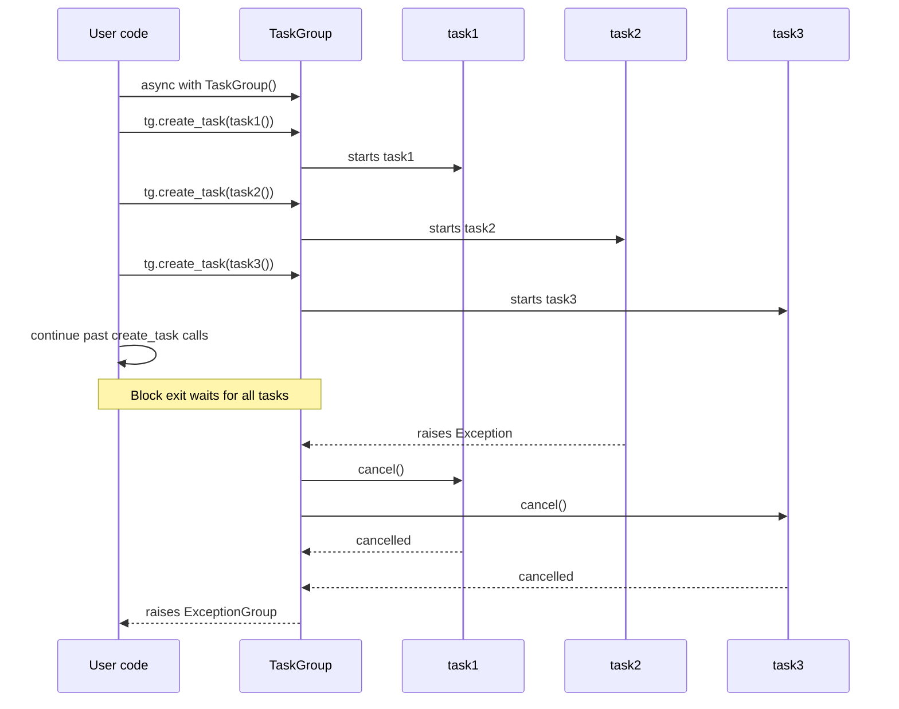

# 4. Task Groups (Python 3.11+)

> [!note] Why this note exists
> [[14. Concurrency/5. async-await]] introduced `asyncio.gather` and `asyncio.create_task` as the workhorses of concurrent async code. Python 3.11 introduced `asyncio.TaskGroup`, a structured-concurrency primitive that is **safer, more readable, and replaces `gather` in most new code**. This note covers `TaskGroup`, the new `ExceptionGroup` (`except*`) syntax, cancellation semantics, and how to migrate from `gather` to `TaskGroup`. After this note you'll understand why TaskGroups are considered a strict improvement and when (rarely) you might still want `gather`.

## Why It Matters

Before Python 3.11, the canonical way to run multiple coroutines concurrently was:

```python
results = await asyncio.gather(coro1(), coro2(), coro3())
```

This works but has three problems:
1. **Silent exception loss.** If one coroutine raises and `gather` was called with `return_exceptions=False` (the default), the exception propagates immediately — but the other coroutines keep running, unaware that their sibling failed. They might do pointless work, leak resources, or interact with a now-invalid shared state.
2. **Cancellation is opt-in and fragile.** To cancel siblings on first failure, you must write `gather(*tasks, return_exceptions=False)` and manually cancel each task in a `try`/`except`. Easy to forget, easy to get wrong.
3. **No structured lifetime.** Tasks created with `create_task` outlive the `gather` call if you forget to await them. There's no syntactic block tying a task's lifetime to a scope.

`asyncio.TaskGroup` (PEP 654) solves all three:
1. **All exceptions are collected** into an `ExceptionGroup`, not lost.
2. **Cancellation is automatic** — if one task fails, all not-yet-finished siblings are cancelled.
3. **The `async with` block defines the lifetime** — the group doesn't exit until all tasks are done.

This is **structured concurrency**, the async analog of structured programming (`for`/`while`/`if` blocks). Just as `goto` was replaced by structured control flow, `gather` + manual task management is being replaced by `TaskGroup`.

## Background

### Structured concurrency

The term was coined by Nathaniel J. Smith (in the context of Python's `trio` library) and means:

> Concurrency where the lifetime of a child task is bounded by the lifetime of a syntactic block in the parent.

In other words: a task spawned inside `async with TaskGroup()` cannot outlive the `with` block. The block doesn't exit until all child tasks complete (or are cancelled and awaited). This makes the control flow **lexically apparent** — you can see the concurrency by reading the code, not by tracing task references.

### PEP 654 and ExceptionGroup

PEP 654 (Python 3.11) added `ExceptionGroup` — a single exception object that wraps multiple raised exceptions. This is necessary because a `TaskGroup` may have multiple tasks fail at the same time; raising them one at a time would lose information.

PEP 654 also added the `except*` syntax to handle `ExceptionGroup`s cleanly:

```python
try:
    ...
except* ValueError as eg:
    # eg is an ExceptionGroup containing only ValueError instances
    ...
except* TypeError as eg:
    ...
```

`except*` filters an `ExceptionGroup` by exception type, recursively — unlike `except` which would only match if the top-level exception were that type.

### The `TaskGroup` API

```python
async with asyncio.TaskGroup() as tg:
    tg.create_task(coro1())
    tg.create_task(coro2())
    tg.create_task(coro3())
# All tasks are done here.
```

Three things to know:
1. `TaskGroup` is an async context manager (entered via `async with`).
2. You spawn tasks via `tg.create_task(coro)` — same as `asyncio.create_task`, but tied to the group.
3. The `async with` block doesn't exit until all tasks have finished (or been cancelled and awaited).

If any task raises, the group:
1. Cancels all not-yet-finished tasks.
2. Awaits their cancellation.
3. Raises an `ExceptionGroup` containing all the exceptions (the original failure plus any `CancelledError`s).

## Main content

### Basic usage

```python
import asyncio

async def fetch(url, delay):
    await asyncio.sleep(delay)
    return f"data from {url}"

async def main():
    async with asyncio.TaskGroup() as tg:
        t1 = tg.create_task(fetch("a", 1))
        t2 = tg.create_task(fetch("b", 2))
        t3 = tg.create_task(fetch("c", 0.5))

    # Block exited — all tasks done
    print(t1.result(), t2.result(), t3.result())

asyncio.run(main())
# data from c (after 0.5s)
# data from a (after 1s)
# data from b (after 2s)
# Final prints: all results
```

Note: you don't `await` the tasks inside the `async with`. They run concurrently; the block waits for them.

### Exception handling with `except*`

```python
import asyncio

async def good():
    await asyncio.sleep(0.1)
    return "ok"

async def bad_value():
    await asyncio.sleep(0.1)
    raise ValueError("bad value")

async def bad_type():
    await asyncio.sleep(0.1)
    raise TypeError("bad type")

async def main():
    try:
        async with asyncio.TaskGroup() as tg:
            tg.create_task(good())
            tg.create_task(bad_value())
            tg.create_task(bad_type())
    except* ValueError as eg:
        print(f"ValueErrors: {eg.exceptions}")
    except* TypeError as eg:
        print(f"TypeErrors: {eg.exceptions}")

asyncio.run(main())
# ValueErrors: (ValueError('bad value'),)
# TypeErrors: (TypeError('bad type'),)
```

Both exceptions are reported — neither is lost. The `good()` task's result is implicitly discarded (it didn't fail), but you can store its task reference and check `t.done()` if needed.

### `except*` semantics

```python
try:
    ...
except* SomeError as eg:
    # eg is an ExceptionGroup of SomeError instances (possibly nested)
    ...
except* OtherError:
    # No `as` — just suppresses
    ...
# Any exceptions not matching except* clauses are re-raised
```

`except*` differs from `except`:
- `except E` matches if the raised exception is an instance of `E`.
- `except* E` matches any instances of `E` **inside** an `ExceptionGroup`, recursively. The handler receives an `ExceptionGroup` containing only the matching exceptions.

If an `ExceptionGroup` contains both matching and non-matching exceptions, only the matching ones are passed to the handler; the rest propagate (potentially to other `except*` clauses or out of the `try`).

### Cancellation semantics

When a task in a `TaskGroup` raises:
1. The group cancels all other not-yet-finished tasks.
2. Each cancelled task receives `asyncio.CancelledError` at its next `await`.
3. The task can catch `CancelledError` (e.g., to do cleanup) but should re-raise it (or let it propagate).
4. After all tasks finish (or are cancelled), the group raises an `ExceptionGroup`.

```python
import asyncio

async def slow_worker(name, delay):
    try:
        await asyncio.sleep(delay)
        return f"{name} done"
    except asyncio.CancelledError:
        print(f"{name} cancelled, cleaning up...")
        raise   # important: re-raise!

async def fail_fast():
    await asyncio.sleep(0.1)
    raise RuntimeError("fail fast")

async def main():
    try:
        async with asyncio.TaskGroup() as tg:
            tg.create_task(slow_worker("A", 5))
            tg.create_task(slow_worker("B", 5))
            tg.create_task(fail_fast())
    except* RuntimeError as eg:
        print(f"Got: {eg.exceptions}")

asyncio.run(main())
# fail_fast raises after 0.1s
# A cancelled, cleaning up...
# B cancelled, cleaning up...
# Got: (RuntimeError('fail fast'),)
```

The whole `main` finishes in ~0.1s, not 5s — cancellation kicked in immediately.

### Cancelling a `TaskGroup` from outside

You can cancel an entire `TaskGroup` by cancelling the task that owns it:

```python
async def worker(tg):
    async with tg:
        tg.create_task(long_running_1())
        tg.create_task(long_running_2())

async def main():
    task = asyncio.create_task(worker(asyncio.TaskGroup()))
    await asyncio.sleep(0.5)
    task.cancel()
    try:
        await task
    except asyncio.CancelledError:
        print("worker cancelled")
```

When `task.cancel()` is called, the `async with` block is exited via cancellation, which cancels all the group's tasks.

### Replacing `gather` with `TaskGroup`

| Pattern                            | `gather`                                  | `TaskGroup`                                 |
|------------------------------------|-------------------------------------------|---------------------------------------------|
| Run N tasks, collect results       | `await asyncio.gather(*coros)`            | `async with tg: t = tg.create_task(...)`    |
| Stop on first exception            | `gather(*coros, return_exceptions=False)` (default) | `async with tg: tg.create_task(...)`  |
| Continue on exceptions, collect all| `gather(*coros, return_exceptions=True)`  | Manually: `try/except*` around `tg`         |
| Cancel siblings on first failure   | Manual                                    | Automatic                                    |
| Task lifetime tied to scope        | No                                         | Yes                                          |
| All exceptions reported            | First one only (others lost)              | All in `ExceptionGroup`                      |

#### Migration example

```python
# Old (gather):
async def old():
    results = await asyncio.gather(
        fetch("a"),
        fetch("b"),
        fetch("c"),
    )
    return results

# New (TaskGroup):
async def new():
    async with asyncio.TaskGroup() as tg:
        t1 = tg.create_task(fetch("a"))
        t2 = tg.create_task(fetch("b"))
        t3 = tg.create_task(fetch("c"))
    return [t1.result(), t2.result(), t3.result()]
```

Slightly more verbose, but:
- All exceptions are preserved.
- Siblings are cancelled on failure.
- The lifetime is structural.

For collecting results more concisely, a helper:

```python
async def gather(*coros):
    async with asyncio.TaskGroup() as tg:
        tasks = [tg.create_task(c) for c in coros]
    return [t.result() for t in tasks]
```

### When to still use `gather`

`gather` is not deprecated. Use it when:
1. **You need `return_exceptions=True` semantics** (collect results, don't propagate errors). `TaskGroup` doesn't have a direct equivalent — you'd write `try`/`except*` for each expected exception type.
2. **You're migrating gradually** — `gather` is fine in pre-3.11 code or when you don't want to refactor.
3. **You have a dynamic list of tasks** — `gather` accepts an iterable; `TaskGroup` requires `create_task` calls (which can be in a loop, but is slightly more verbose).

For new code, default to `TaskGroup`. Reach for `gather` only when its specific semantics are what you want.

### Nested TaskGroups

`TaskGroup`s compose — you can nest them:

```python
async def main():
    async with asyncio.TaskGroup() as outer:
        t1 = outer.create_task(fetch("a"))
        async with asyncio.TaskGroup() as inner:
            t2 = inner.create_task(fetch("b"))
            t3 = inner.create_task(fetch("c"))
        # inner done
        t4 = outer.create_task(fetch("d"))
    # outer done
```

If a task in `inner` fails, `inner` cancels its siblings, then raises. The exception propagates to `outer`, which cancels its remaining tasks (including `t1` and `t4`), then raises an `ExceptionGroup` of `ExceptionGroup`s.

This composition is what makes structured concurrency scale to complex concurrent programs.

## Mermaid: TaskGroup vs gather

```mermaid
graph TB
    subgraph Gather[asyncio.gather]
        G1[Start coro1, coro2, coro3]
        G2[coro2 raises]
        G3[coro1, coro3 still running<br/>unaware of failure]
        G4[gather raises coro2 error]
        G5[coro1, coro3 leak<br/>if caller doesn't await]
    end
    subgraph TaskGroup[asyncio.TaskGroup]
        T1[Start coro1, coro2, coro3]
        T2[coro2 raises]
        T3[Group cancels coro1, coro3]
        T4[All tasks awaited]
        T5[Group raises ExceptionGroup]
    end
    G1 --> G2 --> G3 --> G4 --> G5
    T1 --> T2 --> T3 --> T4 --> T5
```



## Mermaid: TaskGroup lifecycle



## Code examples

### Concurrent fetch with structured error handling

```python
import asyncio

async def fetch(session, url):
    async with session.get(url) as response:
        response.raise_for_status()
        return await response.text()

async def fetch_all(urls):
    async with asyncio.TaskGroup() as tg:
        tasks = [tg.create_task(fetch(session, url)) for url in urls]
    return [t.result() for t in tasks]

async def main():
    import aiohttp
    async with aiohttp.ClientSession() as session:
        try:
            results = await fetch_all(session, [
                "https://example.com/1",
                "https://example.com/2",
                "https://example.com/bad",
            ])
            print(results)
        except* aiohttp.ClientResponseError as eg:
            print(f"HTTP errors: {eg.exceptions}")
        except* asyncio.TimeoutError as eg:
            print(f"Timeouts: {eg.exceptions}")

asyncio.run(main())
```

If multiple URLs fail, all the failures are collected in one `ExceptionGroup` — no error is lost.

### Cancellation cleanup pattern

```python
import asyncio

async def worker(name, queue):
    try:
        while True:
            item = await queue.get()
            if item is None:
                return
            print(f"{name} processing {item}")
            await asyncio.sleep(0.1)
    except asyncio.CancelledError:
        print(f"{name} received cancellation, draining...")
        # Drain queue if needed, then re-raise
        raise

async def producer(queue, n):
    for i in range(n):
        await queue.put(i)
        await asyncio.sleep(0.05)
    # Put poison pills for all workers
    for _ in range(3):
        await queue.put(None)

async def main():
    queue = asyncio.Queue()
    async with asyncio.TaskGroup() as tg:
        tg.create_task(producer(queue, 10))
        for name in ["A", "B", "C"]:
            tg.create_task(worker(name, queue))

asyncio.run(main())
```

If `producer` raises, all workers are cancelled — they each run their `except CancelledError` cleanup.

### Structured fan-out / fan-in

```python
import asyncio

async def fetch_one(session, url):
    async with session.get(url) as resp:
        return await resp.json()

async def fetch_all_concurrent(session, urls, max_concurrent=10):
    semaphore = asyncio.Semaphore(max_concurrent)

    async def bounded_fetch(url):
        async with semaphore:
            return await fetch_one(session, url)

    async with asyncio.TaskGroup() as tg:
        tasks = [tg.create_task(bounded_fetch(url)) for url in urls]
    return [t.result() for t in tasks]
```

Concurrency is bounded by the semaphore; the `TaskGroup` ensures all fetches complete (or are cancelled on first failure).

### Nested groups for hierarchical cancellation

```python
async def process_user(user_id):
    async with asyncio.TaskGroup() as tg:
        tg.create_task(fetch_profile(user_id))
        tg.create_task(fetch_orders(user_id))
        tg.create_task(fetch_recommendations(user_id))

async def process_all_users(user_ids):
    try:
        async with asyncio.TaskGroup() as outer:
            for uid in user_ids:
                outer.create_task(process_user(uid))
    except* UserNotFoundError as eg:
        print(f"Missing users: {[e.user_id for e in eg.exceptions]}")
```

If one user's profile fetch fails, that user's inner `TaskGroup` cancels their other fetches, then propagates the failure to the outer group, which cancels all other users' processing.

### Combining `TaskGroup` with `asyncio.timeout` (Python 3.11+)

```python
import asyncio

async def fetch_with_timeout(urls, timeout=5):
    try:
        async with asyncio.timeout(timeout):
            async with asyncio.TaskGroup() as tg:
                tasks = [tg.create_task(fetch(url)) for url in urls]
            return [t.result() for t in tasks]
    except* TimeoutError as eg:
        print(f"Timeout: {eg.exceptions}")
        return []
```

`asyncio.timeout` is itself an async context manager that cancels everything inside it on expiry. Combined with `TaskGroup`, you get timeout + structured concurrency in a few lines.

## Common Pitfalls

> [!warning] Forgetting to use `except*` with `ExceptionGroup`
> ```python
> try:
>     async with tg:
>         ...
> except ValueError:   # WRONG — top-level exception is ExceptionGroup
>     ...
> ```
> Use `except* ValueError` to filter inside the group. Using plain `except ValueError` won't match because the top-level exception is `ExceptionGroup`, not `ValueError`.

> [!warning] Forgetting to re-raise `CancelledError`
> ```python
> async def task():
>     try:
>         await work()
>     except asyncio.CancelledError:
>         cleanup()
>         # Missing `raise` — cancellation swallowed!
> ```
> Always re-raise `CancelledError` after cleanup. Otherwise the cancellation signal is lost and the task continues running.

> [!warning] Creating tasks after the group has exited
> ```python
> async with asyncio.TaskGroup() as tg:
>     pass
> tg.create_task(...)   # RuntimeError
> ```
> `create_task` must be called inside the `async with` block.

> [!warning] Mixing `gather` and `TaskGroup` carelessly
> If you `gather` tasks created by `tg.create_task`, you have two lifetimes to manage. Pick one model — usually `TaskGroup` alone.

> [!warning] Exceptions from `async with` block itself
> ```python
> async with asyncio.TaskGroup() as tg:
>     tg.create_task(coro())
>     raise ValueError("oops")   # raised inside the block
> ```
> The `ValueError` cancels all not-yet-finished tasks in the group, then is wrapped in an `ExceptionGroup` along with any task failures and `CancelledError`s.

> [!warning] ExceptionGroup nesting
> A nested `TaskGroup` can produce `ExceptionGroup`s inside `ExceptionGroup`s. `except*` handles this recursively, but if you iterate `eg.exceptions` manually, you may need to recurse.

> [!warning] Pre-3.11 code can't use `TaskGroup`
> The `exceptiongroup` backport package provides `ExceptionGroup` and `except*` semantics on older Pythons, but `TaskGroup` itself requires 3.11+. For libraries supporting older versions, use `gather` or the `anyio` library (which provides a similar API across versions).

## Tips and Tricks

> [!tip] Default to `TaskGroup` in new code
> It's safer, more readable, and the future of asyncio. Reach for `gather` only when you need its specific semantics.

> [!tip] Use `except*` for type-based filtering
> ```python
> try:
>     async with tg:
>         ...
> except* NetworkError as eg:
>     log_network_errors(eg)
> except* ValidationError as eg:
>     log_validation_errors(eg)
> ```
> Each handler receives only its type's exceptions.

> [!tip] Inspect `ExceptionGroup` for debugging
> `eg.exceptions` is a tuple of the contained exceptions (possibly nested groups). Print them all:
> ```python
> def print_all(eg, indent=0):
>     for e in eg.exceptions:
>         if isinstance(e, ExceptionGroup):
>             print_all(e, indent + 2)
>         else:
>             print(" " * indent + repr(e))
> ```

> [!tip] Use `anyio` for cross-runtime compatibility
> `anyio.TaskGroup` works on both asyncio and trio, and on Python 3.7+. Useful if you target older versions or want to support trio.

> [!tip] Combine with `asyncio.timeout`
> For bounded concurrent work, wrap the `TaskGroup` in `async with asyncio.timeout(seconds)`. On timeout, all tasks are cancelled cleanly.

> [!tip] Store task references to access results
> ```python
> async with asyncio.TaskGroup() as tg:
>     t1 = tg.create_task(fetch("a"))
>     t2 = tg.create_task(fetch("b"))
> # After the block, both tasks are done:
> print(t1.result(), t2.result())
> ```

> [!tip] Profile cancellation
> `asyncio`'s debug mode logs cancellations. Use it to verify your cancellation logic.

## Advanced patterns

### Pipelining with TaskGroup

A common pattern is to spawn a producer task plus several consumer tasks:

```python
import asyncio

async def producer(queue, n):
    for i in range(n):
        await asyncio.sleep(0.01)
        await queue.put(i)
    # Sentinel for each consumer:
    return None

async def consumer(queue, name):
    while True:
        item = await queue.get()
        if item is None:
            return
        print(f"{name}: processed {item}")
        await asyncio.sleep(0.05)
        queue.task_done()

async def pipeline(items=20, n_consumers=3):
    queue = asyncio.Queue(maxsize=10)

    async with asyncio.TaskGroup() as tg:
        # Producer:
        async def produce_all():
            for i in range(items):
                await queue.put(i)
            for _ in range(n_consumers):
                await queue.put(None)

        tg.create_task(produce_all())

        # Consumers:
        for i in range(n_consumers):
            tg.create_task(consumer(queue, f"C{i}"))

asyncio.run(pipeline())
```

The TaskGroup ensures all consumers complete before the block exits. If one consumer raises, the others are cancelled.

### Time-limited TaskGroup

Combine `TaskGroup` with `asyncio.timeout` to bound total runtime:

```python
import asyncio

async def with_overall_timeout(tasks, timeout=5.0):
    """Run a list of coroutines with an overall timeout."""
    try:
        async with asyncio.timeout(timeout):
            async with asyncio.TaskGroup() as tg:
                task_handles = [tg.create_task(t) for t in tasks]
            return [t.result() for t in task_handles]
    except* TimeoutError:
        print("Overall timeout exceeded")
        return None
```

The `asyncio.timeout` cancels everything inside (including the TaskGroup) on expiry. All tasks get a `CancelledError` they can clean up from.

### Graceful degradation

Use `ExceptionGroup` to handle partial failures:

```python
import asyncio

async def fetch_one(url):
    # Simulate failure for some URLs
    if "bad" in url:
        raise ValueError(f"bad URL: {url}")
    await asyncio.sleep(0.1)
    return f"data from {url}"

async def fetch_all(urls):
    results = {}
    try:
        async with asyncio.TaskGroup() as tg:
            tasks = {url: tg.create_task(fetch_one(url)) for url in urls}

        for url, task in tasks.items():
            if not task.cancelled():
                results[url] = task.result()
    except* ValueError as eg:
        # Log failures but keep partial results
        for exc in eg.exceptions:
            print(f"Failed: {exc}")
        # Recover successful results (those not cancelled)
        for url, task in tasks.items():
            if not task.cancelled() and task.done() and not task.exception():
                results[url] = task.result()

    return results

asyncio.run(fetch_all(["good1", "good2", "bad1", "good3"]))
```

This pattern is **graceful degradation** — accept partial success when full success isn't possible. The `except*` filter lets you handle each exception type differently.

### Recursive TaskGroups

TaskGroups can be created inside other TaskGroups for hierarchical work:

```python
import asyncio

async def process_batch(batch_id, items):
    async with asyncio.TaskGroup() as tg:
        for item in items:
            tg.create_task(process_item(batch_id, item))
    # All items in this batch done

async def process_all(batches):
    async with asyncio.TaskGroup() as outer:
        for batch_id, items in batches.items():
            outer.create_task(process_batch(batch_id, items))
```

If one batch fails, its inner TaskGroup cancels its items, then raises to the outer TaskGroup, which cancels all other batches. The result is hierarchical cancellation — failure in one subtree cancels only that subtree, then propagates upward.

### Comparison with `anyio` and `trio`

`anyio` is a library that provides a TaskGroup-like API across both asyncio and trio:

```python
import anyio

async def main():
    async with anyio.create_task_group() as tg:
        tg.start_soon(work_a)
        tg.start_soon(work_b)

anyio.run(main)
```

`anyio.TaskGroup` works on Python 3.7+ and on both asyncio and trio. Use it if you need to support older Python or want to be trio-compatible.

`trio` is a separate async runtime (not asyncio) that pioneered structured concurrency in Python:

```python
import trio

async def main():
    async with trio.open_nursery() as nursery:
        nursery.start_soon(work_a)
        nursery.start_soon(work_b)

trio.run(main)
```

`asyncio.TaskGroup` (3.11+) is essentially a port of trio's nursery concept to asyncio. If you've used trio, the model is the same.

## Active Recall

1. What three problems with `gather` does `TaskGroup` solve?
2. What's the difference between `except E` and `except* E`?
3. When a task in a `TaskGroup` raises, what happens to the other tasks?
4. Can a task spawned by `tg.create_task` outlive the `async with` block?
5. What's an `ExceptionGroup`? Can it be nested?
6. Why must you re-raise `CancelledError` in a worker's cleanup code?
7. When should you still use `gather` instead of `TaskGroup`?
8. What does `tg.create_task` return? How do you get the result?
9. How would you combine `TaskGroup` with a timeout?
10. How does a nested `TaskGroup` propagate failures to its parent?

## Next Steps

- [[1. Event Loops]] — the loop schedules task execution and cancellation.
- [[2. Async Generators]] — pairs with `TaskGroup` for parallel stream consumers.
- [[3. Async Context Managers]] — `TaskGroup` is itself an async context manager.
- [[14. Concurrency/5. async-await]] — the underlying language feature.
- [[14. Concurrency/7. Concurrent Futures]] — the older executor-based API.
- [[5. Error Handling/3. Exception Hierarchy]] — broader exception context, including the new `ExceptionGroup`.
