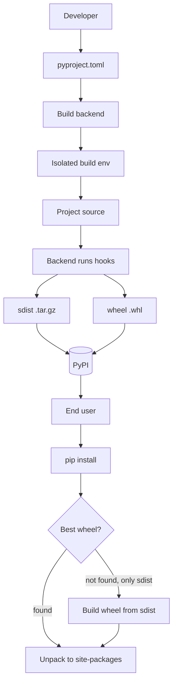
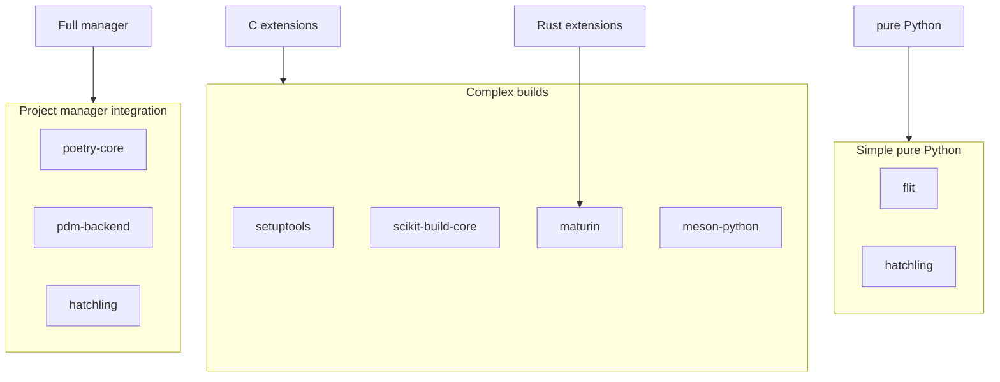

# 1. Wheels and Build Systems

> [!note] Why this note exists
> [[7. Modules and Packages/4. pyproject.toml and Packaging|pyproject.toml]] introduced the modern packaging config file. This note is the **mastery treatment**: what a **wheel** actually is (the file format, the naming convention, the contents), the difference between **pure Python** and **platform** wheels, the **PEP 517** build interface, and the major **build backends** (`setuptools`, `hatchling`, `flit`, `poetry-core`). After this note you'll know how to choose a backend, what `pip install` actually does under the hood, and how to debug a wheel-build failure.

## Why It Matters

For most of Python's history, installing a package meant downloading a source distribution (`sdist`), unpacking it, and running `python setup.py install` — which executed arbitrary code in the package's `setup.py`. This was slow (every install was a build), insecure (arbitrary code execution), and fragile (no isolation between the build environment and the install environment).

The **wheel** format (PEP 427, 2012+) changed this. A wheel is a pre-built archive — install is just unpacking. No `setup.py` execution, no compiler required at install time, no surprise code. Wheels turned Python packaging from "build at install" to "build once, install everywhere."

The **build backend** ecosystem has also matured. Where `setuptools` was once the only game in town, today you can choose:
- `setuptools` — the established default, ubiquitous support.
- `hatchling` — modern, fast, from the Hatch project.
- `flit` — minimal, designed for simple pure-Python packages.
- `poetry-core` — Poetry's build backend, lock-file-aware.
- `pdm-backend` — PDM's backend, similar philosophy to Poetry.
- `scikit-build-core` — for projects that need CMake.
- `maturin` — for Rust-based extensions.

Each backend speaks the **PEP 517** interface, so `pip` (and other installers) can work with any of them.

## Background

### The history of Python packaging

| Era           | Mechanism                         | Notes                                |
|---------------|-----------------------------------|--------------------------------------|
| 1990s         | `distutils`                       | Standard library, basic              |
| 2000s         | `setuptools` (extension of distutils) | `easy_install`, `setup.py`        |
| 2008          | `pip`                             | Replaces `easy_install`              |
| 2012 (PEP 427)| Wheels                            | Pre-built binary distributions       |
| 2015 (PEP 513)| manylinux1                        | Cross-distro Linux wheels            |
| 2017 (PEP 517)| Build backend interface           | `setup.py` no longer required        |
| 2019 (PEP 518)| `pyproject.toml` for build deps   | Reproducible builds                  |
| 2020+         | manylinux2014, musllinux, etc.    | Modern Linux wheel tags              |

The trajectory: from "execute arbitrary code at install time" to "declare build deps, run a sandboxed build, install a pre-built archive."

### sdist vs wheel

- **Source distribution (`sdist`)**: a `.tar.gz` containing the source code, `pyproject.toml`, and any build scripts. Built by the package author. To install, pip must build it (run the build backend, produce a wheel, install the wheel). Slower, requires build deps.
- **Wheel (`.whl`)**: a pre-built ZIP archive. Installed by unpacking into `site-packages`. Fast, no build required.

When you `pip install foo`, pip:
1. Looks up `foo` on PyPI.
2. Picks the best available file: a wheel matching your platform/Python version if possible, else the sdist.
3. If wheel: downloads and unpacks.
4. If sdist: downloads, builds a wheel in an isolated environment (per PEP 517), then unpacks.

Wheels are why `pip install numpy` is fast today — the wheel has pre-compiled C extensions; you don't need a compiler.

## Main content

### What's inside a wheel?

A `.whl` file is just a ZIP with a specific naming convention and a few extra files:

```
my_package-1.0.0-py3-none-any.whl
├── my_package/
│   ├── __init__.py
│   ├── module_a.py
│   └── module_b.py
├── my_package-1.0.0.dist-info/
│   ├── METADATA          # package name, version, dependencies, etc.
│   ├── WHEEL             # wheel format metadata
│   ├── RECORD            # hash of every file in the wheel
│   ├── entry_points.txt  # console_scripts, etc.
│   └── top_level.txt     # top-level package names
```

Key files:
- **`METADATA`** — the package's metadata (name, version, summary, dependencies, etc.).
- **`WHEEL`** — wheel-specific info (generator, tag, root-is-purelib).
- **`RECORD`** — `(path, hash, size)` for every file. Used for uninstall and integrity verification.
- **`entry_points.txt`** — declares console scripts and other entry points.

### Wheel naming convention

A wheel filename has the form:

```
{distribution}-{version}(-{build tag})?-{python tag}-{abi tag}-{platform tag}.whl
```

Examples:
- `requests-2.31.0-py3-none-any.whl` — pure Python, works on any Python 3, any platform.
- `numpy-1.25.0-cp311-cp311-manylinux_2_17_x86_64.whl` — CPython 3.11 ABI, manylinux platform, x86-64.
- `cryptography-41.0.1-cp37-abi3-macosx_10_12_x86_64.whl` — ABI3 stable ABI, macOS x86-64.

The four tags:

#### Python tag
- `py3` — any Python 3.
- `cp311` — CPython 3.11 specifically.
- `pp38` — PyPy 3.8.
- `ip3` — IronPython 3.

#### ABI tag
- `none` — no specific ABI (pure Python or stable ABI).
- `cp311` — CPython 3.11 ABI.
- `abi3` — Stable ABI (works on CPython 3.9+ if built with `Py_LIMITED_API`).

#### Platform tag
- `any` — any platform.
- `linux_x86_64` — generic Linux x86-64 (rare; usually `manylinux` instead).
- `manylinux_2_17_x86_64` — manylinux2014, glibc 2.17+, x86-64.
- `musllinux_1_1_x86_64` — Alpine Linux (musl libc).
- `macosx_10_9_x86_64` — macOS 10.9+ on x86-64.
- `macosx_11_0_arm64` — Apple Silicon.
- `win_amd64` — Windows x86-64.
- `win32` — Windows x86.

### Pure Python vs platform wheels

#### Pure Python wheel

```
requests-2.31.0-py3-none-any.whl
```

Tag `py3-none-any` means: works on any Python 3, any ABI, any platform. The wheel contains only `.py` files. The author builds one wheel and it's used by all installers.

```toml
# pyproject.toml for a pure-Python package using flit:
[build-system]
requires = ["flit_core >=3.4,<4"]
build-backend = "flit_core.buildapi"

[project]
name = "my_package"
version = "1.0.0"
```

#### Platform wheel

```
numpy-1.25.0-cp311-cp311-manylinux_2_17_x86_64.whl
```

Tag `cp311-cp311-manylinux_2_17_x86_64` means: CPython 3.11 only, CPython 3.11 ABI, manylinux on x86-64. The wheel contains compiled `.so` files. The author must build **one wheel per (Python version × platform)** combination they support.

For numpy 1.25, that's roughly:
- Python: 3.9, 3.10, 3.11, 3.12 (4 versions)
- Platforms: manylinux x86-64, manylinux aarch64, musllinux x86-64, musllinux aarch64, macOS x86-64, macOS arm64, Windows x86-64, Windows x86-32 (8 platforms)
- Total: ~32 wheels.

That's why binary-extension packages use CI matrices — each combination needs its own build.

### PEP 517: the build interface

PEP 517 defines a standard interface between **frontend** (pip, build, etc.) and **backend** (setuptools, hatchling, etc.). The frontend calls these hooks on the backend:

- `build_wheel(wheel_directory, config_settings=None, metadata_directory=None)` — build a wheel.
- `build_sdist(sdist_directory, config_settings=None)` — build an sdist.
- (Optional) `build_editable(...)` — for `pip install -e` (PEP 660).
- (Optional) `get_requires_for_build_*` — declare build-time dependencies.

The frontend runs the backend in an isolated environment, with only the deps in `[build-system].requires` installed. This means:
- Your system `setuptools` version doesn't matter — the version in `requires` is used.
- Build dependencies are declared explicitly, not implicit.

### `pyproject.toml` `[build-system]` table

```toml
[build-system]
requires = ["setuptools>=61.0", "wheel"]
build-backend = "setuptools.build_meta"
```

- `requires` — list of packages needed to run the build backend. Installed in the isolated build env.
- `build-backend` — the Python module that implements the PEP 517 hooks.

### The major build backends

#### setuptools

```toml
[build-system]
requires = ["setuptools>=61.0"]
build-backend = "setuptools.build_meta"

[project]
name = "my_package"
version = "0.1.0"
dependencies = ["requests>=2.20"]
```

`setuptools` is the default — most packages use it, it has the longest track record, and it supports C extensions, SWIG, and other complex builds. If you're not sure which backend to use, use setuptools.

Pros:
- Universal support, every CI/CD system understands it.
- Handles C extensions, SWIG, Fortran, etc.
- Mature, well-documented.

Cons:
- Configuration can be verbose for simple projects.
- Historical cruft (`setup.py`, `setup.cfg`, `MANIFEST.in`).

#### hatchling

```toml
[build-system]
requires = ["hatchling"]
build-backend = "hatchling.build"

[project]
name = "my_package"
version = "1.0.0"
dependencies = ["requests"]

[tool.hatch.build.targets.wheel]
packages = ["src/my_package"]
```

`hatchling` is the backend for the Hatch project (a modern Python project manager). Cleanly designed, fast, supports dynamic versioning from VCS, environment markers, and more.

Pros:
- Modern, clean configuration.
- Fast.
- First-class support for `src/` layout.
- Active development.

Cons:
- Less mature ecosystem than setuptools.
- Not all third-party tools support every hatchling feature.

#### flit

```toml
[build-system]
requires = ["flit_core >=3.4,<4"]
build-backend = "flit_core.buildapi"

[project]
name = "my_package"
version = "1.0.0"
dynamic = ["description"]
```

`flit` is designed for **simple pure-Python packages**. No C extensions, no complex build logic. The package's `__init__.py` can declare `__version__` and `__doc__`, which flit reads.

Pros:
- Minimal config.
- Perfect for small libraries.
- Fast.

Cons:
- Pure Python only — no C extensions.
- Limited customization.

#### poetry-core

```toml
[build-system]
requires = ["poetry-core>=1.0.0"]
build-backend = "poetry.core.masonry.api"

[tool.poetry]
name = "my_package"
version = "1.0.0"
authors = ["Your Name <you@example.com>"]

[tool.poetry.dependencies]
python = "^3.9"
requests = "^2.20"
```

`poetry-core` is the build backend for the Poetry project manager. Uses Poetry's `[tool.poetry]` config style (not the standard `[project]`).

Pros:
- Tight integration with Poetry's dependency resolver and lockfile.
- Version constraint syntax (`^1.0`, `~1.0.0`).
- Single tool for build + dependency management.

Cons:
- Non-standard config (`[tool.poetry]` vs `[project]`).
- Not all tooling understands Poetry's metadata format.
- Slower than hatchling for simple builds.

#### Other backends

- **`pdm-backend`** — PDM's backend, similar to Poetry's philosophy but uses standard `[project]`.
- **`scikit-build-core`** — for projects using CMake (common in scientific Python).
- **`maturin`** — for Rust-based extensions (PyO3).
- **`meson-python`** — Meson-based, used by NumPy and SciPy.

### Building a wheel manually

You don't need pip to build a wheel — the `build` tool is the standard:

```bash
pip install build
python -m build                  # builds sdist and wheel
python -m build --wheel          # wheel only
python -m build --sdist          # sdist only
```

`build` reads `pyproject.toml`, creates an isolated environment with the build deps, and runs the backend's hooks.

### Inspecting a wheel

```bash
# List contents:
unzip -l my_package-1.0.0-py3-none-any.whl

# View METADATA:
unzip -p my_package-1.0.0-py3-none-any.whl my_package-1.0.0.dist-info/METADATA

# View entry points:
unzip -p my_package-1.0.0-py3-none-any.whl my_package-1.0.0.dist-info/entry_points.txt

# View RECORD (hashes):
unzip -p my_package-1.0.0-py3-none-any.whl my_package-1.0.0.dist-info/RECORD
```

Or programmatically:

```python
import zipfile
with zipfile.ZipFile("my_package-1.0.0-py3-none-any.whl") as z:
    print(z.namelist())
    with z.open("my_package-1.0.0.dist-info/METADATA") as f:
        print(f.read().decode())
```

## Mermaid: wheel build flow



## Mermaid: build backend comparison



## Code examples

### Minimal pure-Python package with flit

Project layout:
```
my_package/
├── pyproject.toml
└── my_package/
    └── __init__.py
```

`pyproject.toml`:
```toml
[build-system]
requires = ["flit_core >=3.4,<4"]
build-backend = "flit_core.buildapi"

[project]
name = "my_package"
authors = [{name = "Your Name", email = "you@example.com"}]
readme = "README.md"
license = {file = "LICENSE"}
requires-python = ">=3.9"
classifiers = [
    "Programming Language :: Python :: 3",
    "License :: OSI Approved :: MIT License",
]
dependencies = ["requests>=2.20"]
dynamic = ["version", "description"]

[project.optional-dependencies]
dev = ["pytest>=7.0", "ruff"]

[project.scripts]
my_package = "my_package.cli:main"

[tool.flit.module]
name = "my_package"
```

`my_package/__init__.py`:
```python
"""My package's docstring (read by flit for the description)."""
__version__ = "1.0.0"
```

Build and inspect:
```bash
pip install build
python -m build
# dist/my_package-1.0.0-py3-none-any.whl
# dist/my_package-1.0.0.tar.gz
```

### Setuptools with C extension

```toml
[build-system]
requires = ["setuptools>=61.0", "wheel"]
build-backend = "setuptools.build_meta"

[project]
name = "fastlib"
version = "1.0.0"
requires-python = ">=3.9"

[tool.setuptools]
package-dir = {"" = "src"}

[tool.setuptools.packages.find]
where = ["src"]
```

`setup.py` (still useful for C extensions):
```python
from setuptools import setup, Extension

module = Extension(
    "fastlib._core",
    sources=["src/fastlib/_core.c"],
    extra_compile_args=["-O3"],
)

setup(ext_modules=[module])
```

Build wheels for multiple platforms using `cibuildwheel`:
```bash
pip install cibuildwheel
cibuildwheel --output-dir wheelhouse
```

`cibuildwheel` runs in CI (GitHub Actions, GitLab CI, etc.) and produces wheels for every supported platform/Python combination.

### Console scripts (entry points)

```toml
[project.scripts]
myapp = "my_package.cli:main"

[project.gui-scripts]
myapp-gui = "my_package.gui:main"

[project.entry-points."my_package.plugins"]
plugin_a = "my_package.plugins:a"
```

After install, `myapp` is a command-line script that calls `my_package.cli:main`. The `[project.entry-points."..."]` table declares plugin points that other packages can register.

### Dynamic versioning from VCS (hatchling)

```toml
[build-system]
requires = ["hatchling", "hatch-vcs"]
build-backend = "hatchling.build"

[project]
name = "my_package"
dynamic = ["version"]

[tool.hatch.version]
source = "vcs"

[tool.hatch.version.raw-options]
local_scheme = "no-local-version"
```

Version is read from git tags — no manual version bumping in code.

### Inspecting metadata without installing

```python
import zipfile
from email.parser import Parser

def read_metadata(whl_path):
    with zipfile.ZipFile(whl_path) as z:
        # Find the .dist-info/METADATA file
        meta_name = next(n for n in z.namelist() if n.endswith(".dist-info/METADATA"))
        with z.open(meta_name) as f:
            return Parser().parse(f)

meta = read_metadata("my_package-1.0.0-py3-none-any.whl")
print(f"Name: {meta['Name']}")
print(f"Version: {meta['Version']}")
print(f"Requires-Python: {meta['Requires-Python']}")
print(f"Requires-Dist: {meta.get_all('Requires-Dist')}")
```

## Common Pitfalls

> [!warning] Missing `[build-system]` table
> ```toml
> # Without [build-system], pip falls back to setup.py + setuptools
> # This is deprecated and may stop working in future pip versions.
> ```
> Always declare `[build-system]` in `pyproject.toml`.

> [!warning] Platform wheel on the wrong platform
> `numpy-1.25.0-cp311-cp311-manylinux_2_17_x86_64.whl` won't install on macOS or Windows. pip should refuse, but if you force it, you'll get import errors.

> [!warning] ABI mismatch
> A `cp311` (CPython 3.11) wheel won't work on CPython 3.10 or 3.12. Use `abi3` (stable ABI) if you want one wheel for multiple Python versions.

> [!warning] `setup.py` only (no `pyproject.toml`)
> Pre-PEP 517, `setup.py` was the only config. Modern pip still supports it (with warnings), but you lose build isolation and reproducibility. Migrate to `pyproject.toml`.

> [!warning] Wrong `pyproject.toml` format for backend
> `poetry-core` expects `[tool.poetry]`; `hatchling` expects `[tool.hatch]`; setuptools/flit/pdm use `[project]`. Mixing them silently breaks the build.

> [!warning] Missing files in the wheel
> If your package has data files (e.g., `.json`, `.sql`), you must declare them. setuptools has `MANIFEST.in` and `package_data`; hatchling has `[tool.hatch.build.targets.wheel.force-include]`. Otherwise they're not in the wheel.

> [!warning] Build isolation hiding local dependencies
> PEP 517 builds in an isolated env. If your `setup.py` imports a local module (e.g., `from my_package.version import __version__`), it'll fail because `my_package` isn't installed in the build env. Use `[tool.setuptools.dynamic]` to read version from a file instead.

> [!warning] Building binary wheels without cibuildwheel
> If you build a `manylinux` wheel on your Ubuntu machine, it'll likely only work on similar systems. Use `cibuildwheel` (which runs in Docker with the official manylinux images) for portable binary wheels.

> [!warning] Forgetting to upload both sdist and wheel
> Some users (rare platforms, unusual Python builds) may need the sdist. Always upload both to PyPI.

## Tips and Tricks

> [!tip] Use `python -m build` for clean builds
> It respects PEP 517 isolation. Don't run `python setup.py bdist_wheel` directly — it skips the build backend interface.

> [!tip] Match backend to project type
> - Simple pure Python: `flit` or `hatchling`.
> - Project managed by Poetry/PDM/Hatch: that tool's backend.
> - C extensions: `setuptools` or `scikit-build-core`/`meson-python` for complex builds.
> - Rust extensions: `maturin`.

> [!tip] Use `cibuildwheel` for binary wheels
> It handles the manylinux/musllinux/macOS/Windows matrix for you. Don't reinvent it.

> [!tip] Pin your build dependencies
> ```toml
> requires = ["setuptools>=64,<69"]
> ```
> This prevents your build from breaking when a new setuptools version changes behavior.

> [!tip] Inspect wheels with `wheel` CLI
> ```bash
> pip install wheel
> wheel unpack my_package-1.0.0-py3-none-any.whl
> ```
> Unpacks the wheel to a directory for inspection.

> [!tip] Test your wheel before uploading
> ```bash
> python -m build
> pip install --force-reinstall dist/my_package-1.0.0-py3-none-any.whl
> python -c "import my_package; print(my_package.__version__)"
> ```

> [!tip] Use `twine check` to validate metadata
> ```bash
> twine check dist/*
> ```
> Catches common metadata issues before uploading to PyPI.

> [!tip] Stable ABI (`abi3`) for binary extensions
> Build with `Py_LIMITED_API` and tag as `abi3` — one wheel works on Python 3.9+. Trade-off: limited C API surface.

## Active Recall

1. What's the difference between an sdist and a wheel?
2. Decode the wheel name `numpy-1.25.0-cp311-cp311-manylinux_2_17_x86_64.whl` — what does each part mean?
3. What does a `py3-none-any` wheel contain? What doesn't it contain?
4. List the four PEP 517 hooks a backend can implement.
5. What does `pip install` do if no compatible wheel is found, only an sdist?
6. Name four major build backends and one trade-off of each.
7. Why does PEP 517 use build isolation? What problem does it solve?
8. How would you build wheels for Linux, macOS, and Windows from a CI pipeline?
9. What's the difference between `cp311` and `abi3` ABI tags?
10. How do you inspect the contents of a wheel without installing it?

## Next Steps

- [[2. Publishing Packages]] — how to upload wheels to PyPI.
- [[3. Dependency Resolution]] — what happens after the wheel is downloaded.
- [[7. Modules and Packages/4. pyproject.toml and Packaging]] — the parent note.
- [[7. Modules and Packages/5. Dependency Management]] — broader context.
- [[15. Memory and Performance/4. cProfile and timeit]] — useful for measuring build backend performance.
- [[22. Native Extensions/3. Cython]] — building C extensions via Cython (which produces wheels).
