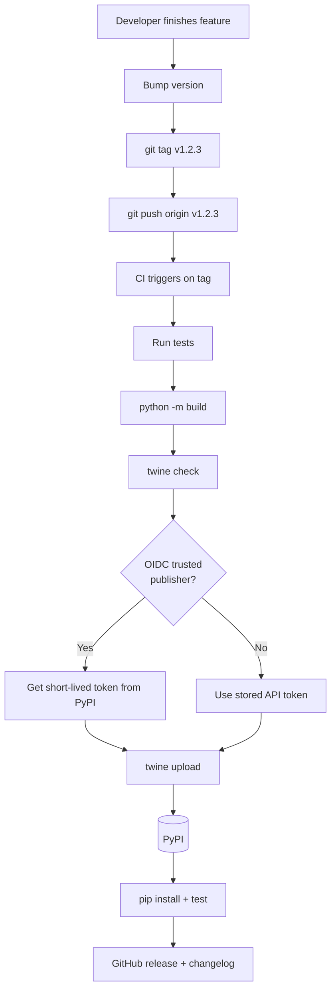
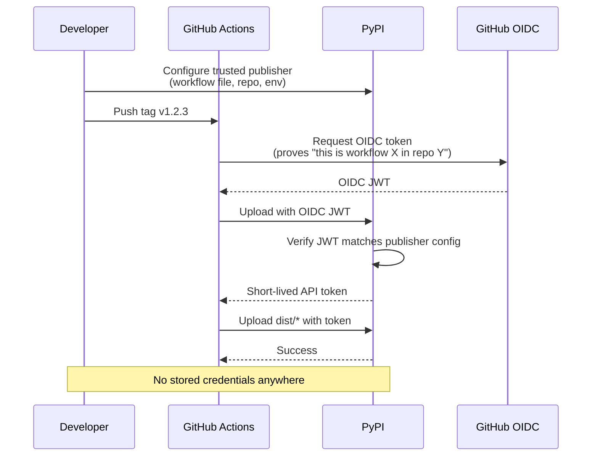

# 2. Publishing Packages

> [!note] Why this note exists
> [[1. Wheels and Build Systems]] covered building wheels. This note covers the **next step**: getting those wheels onto PyPI (and TestPyPI) so users can `pip install` them. It covers the publishing workflow, versioning schemes (semver, calver), `twine upload`, **trusted publishing** (OIDC) for CI-based releases, signed packages, and the deprecation process. After this note you'll be able to publish a package safely and reproducibly, with a release pipeline you can trust.

## Why It Matters

You wrote a library. You built the wheel. Now what?

Publishing it correctly matters because:
- **PyPI is permanent.** Once a version is uploaded, you cannot re-upload the same version (even if it's broken). You must publish a new version. This is by design — it ensures reproducible installs for anyone who pinned the broken version.
- **Security.** Your PyPI credentials, if leaked, let attackers push malware as your package. This has happened many times (e.g., `colourama`, `pytorch` typosquats). Modern publishing uses **trusted publishing (OIDC)** to eliminate stored credentials entirely.
- **Discoverability.** Good metadata (description, classifiers, project URLs, README) is what makes your package findable on PyPI and Google.
- **Deprecation policy.** Users depend on your package. Breaking changes need a clear policy (semver + deprecation warnings + migration guide).

Publishing is a one-way ratchet — once a version is out, it's out. Doing it carefully is worth the effort.

## Background

### PyPI vs TestPyPI

- **PyPI** (`pypi.org`) — the real package index. `pip install foo` pulls from here.
- **TestPyPI** (`test.pypi.org`) — a separate, sandboxed instance for testing your publishing workflow. Packages uploaded here don't appear on real PyPI; users must `pip install --index-url https://test.pypi.org/simple/ foo`.

Use TestPyPI to verify your release process end-to-end before doing a real release. Accounts on TestPyPI are separate from PyPI.

### What PyPI stores

For each package version, PyPI stores:
- All uploaded files (sdist, wheels).
- The metadata from each file's `METADATA`.
- The README (rendered as HTML on the project page).
- Upload timestamps and uploader info.

PyPI computes aggregate download stats, but doesn't track who downloaded what. The `RECORD` file inside each wheel lets users verify integrity post-install.

### Authentication methods

Three ways to authenticate to PyPI:

1. **Username + password** — works but weak. Don't use for CI.
2. **API token** (`pypi-AgEIcHl...`) — a per-account or per-project token. Better than password; can be scoped to a single project. Stored as a secret in CI.
3. **Trusted publishing (OIDC)** — no stored credentials at all. CI proves its identity via OIDC, gets a short-lived token from PyPI. The modern, recommended way.

## Main content

### The publishing workflow


### Step 1: Version your package

Choose a versioning scheme and stick to it. Two common choices:

#### Semantic Versioning (semver)

Format: `MAJOR.MINOR.PATCH` (e.g., `1.4.2`).
- **MAJOR** bump: breaking changes.
- **MINOR** bump: new features, backward-compatible.
- **PATCH** bump: bug fixes, backward-compatible.

Semver is the most common Python convention. Examples: `requests`, `flask`, `django`.

```toml
[project]
version = "1.4.2"
```

#### Calendar Versioning (calver)

Format: `YYYY.MM.DD` or `YYYY.MM.micro` (e.g., `2024.1.15`).
- Reflects the release date, not the change type.
- Good for projects with frequent, time-based releases (Ubuntu-style).

Examples: `pip` (sort of), `pytz`, `certifi`. Less common in Python than semver.

#### Pre-release and dev versions

PEP 440 defines the canonical format:
- `1.0.0a1` — alpha 1.
- `1.0.0b1` — beta 1.
- `1.0.0rc1` — release candidate 1.
- `1.0.0.dev1` — dev release (before alpha).
- `1.0.0.post1` — post-release (after final).

pip understands these and orders them correctly. Users can `pip install foo>=1.0.0rc1` to get RC versions, or `pip install foo` (which excludes pre-releases by default).

#### Dynamic versioning from VCS

Don't hardcode the version in `pyproject.toml` if you're using git tags. Use a backend that reads it dynamically:

```toml
# hatchling + hatch-vcs
[build-system]
requires = ["hatchling", "hatch-vcs"]
build-backend = "hatchling.build"

[project]
dynamic = ["version"]

[tool.hatch.version]
source = "vcs"
```

Then `git tag v1.2.3 && git push --tags` and your build will use `1.2.3`.

### Step 2: Build the distributions

```bash
pip install build
python -m build
# dist/my_package-1.2.3-py3-none-any.whl
# dist/my_package-1.2.3.tar.gz
```

Always build both sdist and wheel. Some users need the sdist (unusual platforms, source-only environments like NixOS).

### Step 3: Validate

```bash
pip install twine
twine check dist/*
# Checking dist/my_package-1.2.3-py3-none-any.whl: PASSED
# Checking dist/my_package-1.2.3.tar.gz: PASSED
```

`twine check` validates that the README renders correctly (it's included in the long_description) and that metadata is well-formed.

### Step 4: Test on TestPyPI

```bash
twine upload --repository testpypi dist/*
# Enter your TestPyPI credentials / token
```

Then verify by installing:

```bash
pip install --index-url https://test.pypi.org/simple/ \
            --extra-index-url https://pypi.org/simple/ \
            my_package==1.2.3
```

The `--extra-index-url` falls back to real PyPI for dependencies not on TestPyPI.

### Step 5: Upload to PyPI

```bash
twine upload dist/*
```

Or with an API token in `~/.pypirc`:

```ini
[pypi]
username = __token__
password = pypi-AgEIcHl...your-token...
```

```bash
twine upload dist/*     # uses ~/.pypirc by default
```

### Step 6: Verify the release

```bash
pip install --upgrade my_package
python -c "import my_package; print(my_package.__version__)"
```

Check the project page on `pypi.org/project/my_package/`. Make sure the README renders, the version is correct, and the right files are listed.

### Step 7: Announce and tag

- Create a GitHub release pointing to the tag.
- Write release notes (CHANGELOG.md or auto-generated from commits).
- Announce on your blog, Twitter/Mastodon, mailing lists, Discord.

### Trusted publishing (OIDC)

Trusted publishing eliminates stored credentials. The setup is:

1. On PyPI, navigate to your project → "Publishing" → "Add a publisher".
2. Select "GitHub" (or GitLab, etc.) and fill in:
   - Workflow filename (e.g., `release.yml`).
   - Repository owner/name.
   - Environment name (e.g., `pypi`).
3. PyPI generates a publisher configuration that trusts your CI workflow.
4. In CI, use `pypa/gh-action-pypi-publish` with no token — it requests one from PyPI via OIDC.

Example GitHub Actions workflow:

```yaml
name: Release

on:
  push:
    tags: ['v*']

jobs:
  build:
    runs-on: ubuntu-latest
    steps:
      - uses: actions/checkout@v4
      - uses: actions/setup-python@v5
        with:
          python-version: '3.12'
      - run: pip install build
      - run: python -m build
      - uses: actions/upload-artifact@v4
        with:
          name: dist
          path: dist/

  publish:
    needs: build
    runs-on: ubuntu-latest
    environment: pypi   # required for trusted publishing
    permissions:
      id-token: write   # required for OIDC
    steps:
      - uses: actions/download-artifact@v4
        with:
          name: dist
          path: dist/
      - uses: pypa/gh-action-pypi-publish@release/v1
        # no password! OIDC handles it.
```

This is the **recommended** modern publishing setup. No tokens to rotate, no credentials to leak, full audit trail.

### `~/.pypirc` reference

For non-OIDC uploads (manual, or with a token):

```ini
[distutils]
index-servers =
    pypi
    testpypi

[pypi]
username = __token__
password = pypi-AgEIcHl...your-token...

[testpypi]
repository = https://test.pypi.org/legacy/
username = __token__
password = pypi-AgEIcHl...your-testpypi-token...
```

```bash
twine upload --repository pypi dist/*      # uses [pypi]
twine upload --repository testpypi dist/*  # uses [testpypi]
```

### Signed packages (sigstore)

PEP 458 (TUF) and PEP 740 (sigstore) are rolling out. PyPI now supports **sigstore signing** — each uploaded file is signed with a short-lived sigstore certificate tied to the uploader's identity (GitHub account, email, etc.).

```bash
pip install sigstore twine
twine upload --sign dist/*   # or use --attestations in modern twine
```

Users can verify signatures with `pip install --require-hashes` or via `sigstore verify`. As of 2024, this is opt-in but increasingly standard.

### Deprecation policy

When you must make a breaking change:

1. **Announce** in a minor release with a `DeprecationWarning`.
2. **Wait** at least one minor cycle (typically 6 months).
3. **Remove** in the next major version.

```python
import warnings

def old_function():
    warnings.warn(
        "old_function is deprecated, use new_function instead",
        DeprecationWarning,
        stacklevel=2,
    )
    return new_function()
```

In tests:
```python
import warnings
warnings.filterwarnings("error", category=DeprecationWarning)
```

This turns deprecation warnings into errors so you catch them early.

### Yanking a release

If a release is broken (but not malicious), you can **yank** it. Yanked releases:
- Stay downloadable for users who explicitly pin them (e.g., `my_package==1.2.3`).
- Are excluded from `pip install my_package` (which picks the latest non-yanked version).
- Show a warning on the PyPI project page.

```bash
# Yank via the PyPI web UI, or:
pip install pypi-simple-api  # not standard, but third-party tools exist
```

Yanking is the right move when a release has a critical bug — you can't delete it, but you can prevent new users from accidentally installing it.

### Deleting a release

You can request file deletion from PyPI in two cases:
- Within 72 hours of upload (you can self-delete via the web UI).
- After 72 hours, only for legal/security reasons (email PyPI admins).

The 72-hour window is for "oops, I uploaded the wrong file." After that, files are permanent — by design, for reproducibility.

## Mermaid: publishing workflow



## Mermaid: trusted publishing (OIDC)



## Code examples

### Complete release workflow with OIDC

`.github/workflows/release.yml`:
```yaml
name: Release

on:
  push:
    tags: ['v*']

permissions:
  contents: write
  id-token: write

jobs:
  build:
    runs-on: ubuntu-latest
    steps:
      - uses: actions/checkout@v4
        with:
          fetch-depth: 0   # for hatch-vcs

      - uses: actions/setup-python@v5
        with:
          python-version: '3.12'

      - name: Install build tools
        run: pip install build twine

      - name: Build distributions
        run: python -m build

      - name: Check distributions
        run: twine check dist/*

      - name: Upload artifacts
        uses: actions/upload-artifact@v4
        with:
          name: dist
          path: dist/

  testpypi:
    needs: build
    runs-on: ubuntu-latest
    environment: testpypi
    steps:
      - uses: actions/download-artifact@v4
        with: { name: dist, path: dist/ }
      - uses: pypa/gh-action-pypi-publish@release/v1
        with:
          repository-url: https://test.pypi.org/legacy/

  pypi:
    needs: testpypi
    runs-on: ubuntu-latest
    environment: pypi
    steps:
      - uses: actions/download-artifact@v4
        with: { name: dist, path: dist/ }
      - uses: pypa/gh-action-pypi-publish@release/v1

  github-release:
    needs: pypi
    runs-on: ubuntu-latest
    steps:
      - uses: actions/download-artifact@v4
        with: { name: dist, path: dist/ }
      - name: Create GitHub release
        uses: softprops/action-gh-release@v2
        with:
          files: dist/*
          generate_release_notes: true
```

### Manual release script

For when you don't want CI:

```bash
#!/usr/bin/env bash
set -euo pipefail

# 1. Ensure clean working tree
git update-index --refresh
git diff-index --quiet HEAD --

# 2. Bump version
VERSION="${1:-}"
if [[ -z "$VERSION" ]]; then
    echo "Usage: release.sh VERSION (e.g., 1.2.3)"
    exit 1
fi

# 3. Update version in pyproject.toml
sed -i "s/^version = \".*\"/version = \"$VERSION\"/" pyproject.toml
git add pyproject.toml
git commit -m "Bump version to $VERSION"

# 4. Tag
git tag "v$VERSION"
git push origin main "v$VERSION"

# 5. Build
rm -rf dist/
python -m build
twine check dist/*

# 6. Upload
twine upload dist/*
echo "Released $VERSION"
```

### Verifying a published package

```python
import subprocess
import sys

def verify_release(package, version):
    # Install in a fresh venv
    subprocess.run([sys.executable, "-m", "venv", "/tmp/check"], check=True)
    pip = ["/tmp/check/bin/pip"]
    subprocess.run(pip + ["install", f"{package}=={version}"], check=True)
    result = subprocess.run(
        ["/tmp/check/bin/python", "-c", f"import {package}; print({package}.__version__)"],
        capture_output=True, text=True, check=True
    )
    installed = result.stdout.strip()
    assert installed == version, f"Expected {version}, got {installed}"
    print(f"OK: {package} {version} installed correctly")

verify_release("my_package", "1.2.3")
```

### Deprecation helper

```python
import warnings
import functools

def deprecated(reason, replacement=None):
    def decorator(func):
        msg = f"{func.__name__} is deprecated: {reason}"
        if replacement:
            msg += f"; use {replacement} instead"

        @functools.wraps(func)
        def wrapper(*args, **kwargs):
            warnings.warn(msg, DeprecationWarning, stacklevel=2)
            return func(*args, **kwargs)
        return wrapper
    return decorator

@deprecated("will be removed in 2.0", replacement="new_func")
def old_func():
    return "old"
```

## Common Pitfalls

> [!warning] Re-uploading a yanked/deleted version
> PyPI rejects re-uploads of the same version, even if you yanked or deleted files. Once a version is published, it's permanent. Bump the version.

> [!warning] README doesn't render on PyPI
> If your README uses relative image links or unsupported reST/Sphinx directives, PyPI shows an error. Use `twine check` before uploading — it catches most rendering issues.

> [!warning] Forgetting `--repository-url` for TestPyPI
> `twine upload dist/*` defaults to real PyPI. Always pass `--repository testpypi` (or use `~/.pypirc`) for TestPyPI.

> [!warning] Long-lived API tokens in CI
> Storing a PyPI API token as a GitHub secret works, but the token lives forever (until you rotate it). If the secret leaks, attackers can publish as you. Use trusted publishing (OIDC) instead.

> [!warning] Wrong environment in trusted publishing config
> If you specified `environment: pypi` in PyPI's trusted publisher config, your workflow MUST use `environment: pypi` too. Mismatch → OIDC fails.

> [!warning] Not pinning build deps
> If `requires = ["setuptools"]` (no version), a new setuptools release could break your build. Pin: `["setuptools>=64,<70"]`.

> [!warning] Missing `permissions: id-token: write`
> GitHub Actions OIDC requires `id-token: write` permission. Without it, the upload fails with a confusing error.

> [!warning] Uploading the wrong dist
> Always `rm -rf dist/` before `python -m build`. Old wheels from a previous version will be uploaded if you do `twine upload dist/*` without cleaning.

> [!warning] Tag mismatch with version
> If you tag `v1.2.3` but your `pyproject.toml` says `1.2.4`, users will be confused. Use dynamic versioning from VCS (e.g., `hatch-vcs`) to keep them in sync.

> [!warning] Breaking changes without deprecation
> Removing a public API without warning breaks users. Always deprecate first, document the migration, and give at least one minor cycle of notice.

## Tips and Tricks

> [!tip] Use trusted publishing (OIDC) for CI
> It eliminates stored credentials. Set it up once and your releases are secure by default.

> [!tip] Always test on TestPyPI first
> A complete test of the publishing workflow — including `pip install` from the published package — catches issues before real users hit them.

> [!tip] Automate releases from tags
> Tag → CI builds → CI publishes → CI creates GitHub release. No manual steps; consistent results.

> [!tip] Generate release notes from commits
> GitHub's `generate_release_notes: true` (in `softprops/action-gh-release`) auto-creates notes from PR titles. Saves you writing them by hand.

> [!tip] Use `CHANGELOG.md`
> Keep a structured changelog (e.g., Keep a Changelog format). It's the source of truth for "what changed."

> [!tip] Yank, don't delete
> If a release has a critical bug, yank it. Users who explicitly pinned it still get it (reproducibility), but new users get the latest non-yanked version.

> [!tip] Pin your build deps
> ```toml
> requires = ["setuptools>=64,<69"]
> ```
> Prevents build breakage from new backend versions.

> [!tip] Sign your packages
> Use `twine upload --attestations` (sigstore) to attach cryptographic signatures. Users can verify with `pip install --require-hashes`.

> [!tip] Have a security policy
> Add a `SECURITY.md` to your repo explaining how to report vulnerabilities. PyPI can display it.

> [!tip] Set up a `pyproject.toml` `urls` table
> ```toml
> [project.urls]
> Homepage = "https://example.com"
> Documentation = "https://my_package.readthedocs.io"
> Source = "https://github.com/me/my_package"
> Issues = "https://github.com/me/my_package/issues"
> Changelog = "https://github.com/me/my_package/blob/main/CHANGELOG.md"
> ```
> These appear on the PyPI project page.

## Active Recall

1. What's the difference between PyPI and TestPyPI? Why use TestPyPI?
2. Can you re-upload the same version of a package after yanking it? After deleting files?
3. What are the three authentication methods for PyPI? Which is recommended?
4. What is trusted publishing (OIDC), and why is it safer than API tokens?
5. What's the format for an alpha version per PEP 440? A release candidate?
6. What's the difference between semver and calver? When would you choose each?
7. What does `twine check` validate?
8. How would you deprecate a function in Python? What warning class?
9. What does yanking a release do? Does it delete the files?
10. What `permissions` field is required in GitHub Actions for OIDC?

## Next Steps

- [[1. Wheels and Build Systems]] — the previous step: building what you publish.
- [[3. Dependency Resolution]] — what installers do after your package is on PyPI.
- [[7. Modules and Packages/4. pyproject.toml and Packaging]] — the config file you publish from.
- [[7. Modules and Packages/5. Dependency Management]] — broader dependency context.
- [[12. Testing/6. Coverage and CI]] — CI setup that powers automated releases.
- [[13. Logging/1. The logging Module]] — for runtime diagnostics in your released package.
