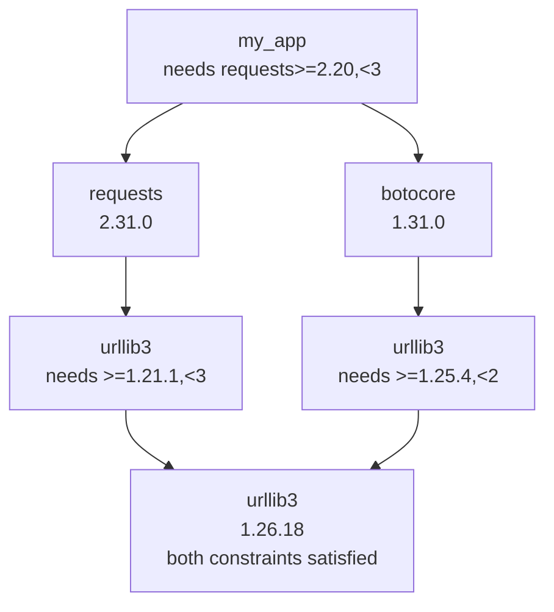
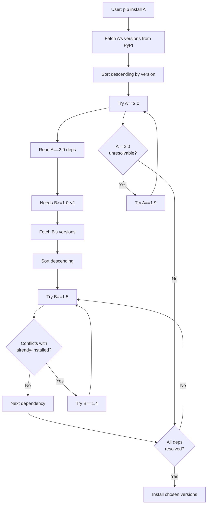
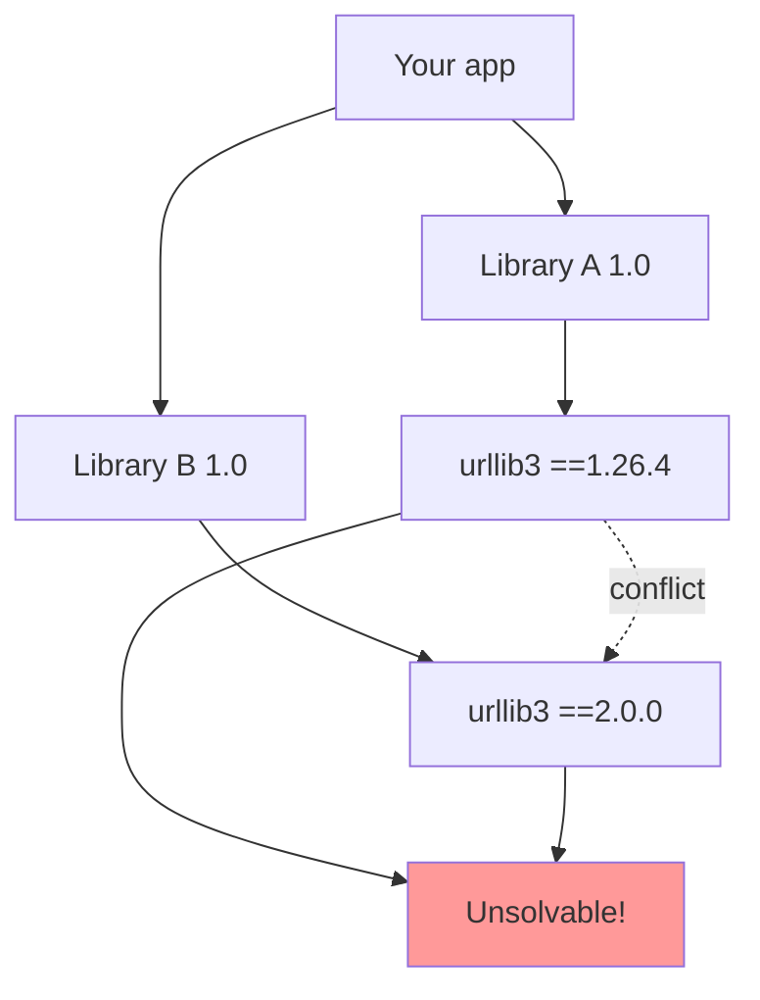

# 3. Dependency Resolution

> [!note] Why this note exists
> [[1. Wheels and Build Systems]] covered building wheels, [[2. Publishing Packages]] covered uploading them. This note is about what `pip install` does **after** downloading your package: figuring out which versions of your dependencies (and their dependencies, recursively) to install, given multiple conflicting constraints. This is **dependency resolution** — a problem that's deceptively hard, and the source of much "dependency hell." After this note you'll understand pip's backtracking resolver, why `poetry`/`uv`/`pdm` exist, what lock files are for, and how to design dependencies that play well with others.

## Why It Matters

You wrote `my_package`. It depends on `requests>=2.20`. `requests` depends on `urllib3>=1.21.1,<3`. Your other dependency, `botocore`, depends on `urllib3>=1.25.4,<1.27` (in older versions). Your colleague's environment has `urllib3==2.0` already installed. What version of `urllib3` does pip pick?

This is the **dependency resolution problem**. Given a graph of packages with version constraints, find an assignment of versions that satisfies all constraints simultaneously. The general problem is **NP-hard** (it's a constraint satisfaction problem). In practice, package ecosystems have additional structure (semver, compatible version ranges) that makes most instances tractable — but pathological cases still blow up.

Why this matters:
- **A bad resolver can install incompatible versions**, breaking your code at runtime.
- **A slow resolver can take minutes** to install a small package, if the version constraints are tight.
- **Dependency hell** — conflicting constraints between libraries — is the most common reason users can't upgrade.
- **Reproducibility** — installing on your laptop vs. CI vs. production must produce the same versions. Lock files solve this.

Understanding the resolver helps you write `dependencies = [...]` lines that don't cause pain for your users.

## Background

### The resolution problem, formally

Given:
- A root package to install (e.g., `my_package`).
- For each package, a set of available versions (from PyPI).
- For each version, a list of dependencies with version constraints.

Find an assignment `version(p)` for each package `p` such that:
- For the root: any version that satisfies the user's request.
- For each dependency edge `(p, q, constraint)`: `version(q)` satisfies `constraint`.
- The constraints are transitive (dependencies of dependencies must also resolve).

If no assignment exists, the problem is **unsatisfiable** — pip must report a conflict.

### Why it's hard

Three sources of complexity:

1. **Exponential search space.** If your package has 10 dependencies, each with 5 viable versions, that's `5^10 ≈ 10 million` combinations.
2. **Circular dependencies.** Package A depends on B which depends on A. The resolver must handle this without infinite loops.
3. **Optional dependencies and environment markers.** `extra == "test"` and `sys_platform == "linux"` complicate the constraint logic.

In practice, semver constraints narrow the space dramatically: `>=2.0,<3` often has only one viable latest version. But when multiple packages pin tightly (e.g., `==1.2.3`), conflicts become intractable.

### The dependency graph



The resolver picks `urllib3==1.26.18` because it satisfies both `requests`'s constraint (`<3`) and `botocore`'s constraint (`<2`). If both packages pinned `urllib3` to incompatible exact versions, resolution would fail.

## Main content

### pip's resolver

#### Pre-2020: the legacy resolver

Before pip 20.3 (released Nov 2020), pip used a **greedy resolver**: for each dependency, pick the latest version, install it, move on. If a later dependency conflicted with an already-installed version, pip **downgraded** the existing one — but it didn't backtrack to try earlier choices.

This was fast but produced broken environments when constraints were tight:
- `pip install A B` where `A` needs `urllib3<2` and `B` needs `urllib3>=2` would silently install `urllib3==2.x` (the latest), then `A` would fail at import time.

#### Post-2020: the backtracking resolver

pip 20.3 introduced a **backtracking resolver** (PEP 590 era). It does a depth-first search:
1. For each dependency, try the latest matching version.
2. Recurse into its dependencies.
3. If a conflict is found, **backtrack** — try the next-latest version of the most recent choice.
4. Repeat until a consistent assignment is found, or all options are exhausted.

This produces correct results but can be slow. The classic symptom: `pip install` takes minutes and prints messages like `INFO: pip is looking at multiple versions of X to determine which version is compatible with other requirements.`

```bash
# Force the new resolver (default since 20.3):
pip install --use-feature=2020-resolver my_package

# Show what pip is doing during resolution:
pip install -v my_package
```

#### pip's resolver quirks

- **Picks the latest version by default.** If you don't pin, you get the latest compatible.
- **No lock file.** Re-running `pip install` on another machine may install different (newer) versions if PyPI has changed.
- **Doesn't pre-download.** Each version trial downloads metadata (and sometimes the package itself).
- **No global optimization.** pip doesn't try to find the "best" assignment — just the first one that works.

### Poetry's resolver

`poetry` (since 2018) introduced a more sophisticated resolver:
- Uses a **PubGrub**-style algorithm (inspired by Dart's `pub`).
- Generates a **lock file** (`poetry.lock`) pinning every transitive dependency.
- Supports version constraint operators beyond PEP 440 (`^1.2.3` for "compatible with 1.2.3", `~1.2.3` for "patch-level only").

```bash
pip install poetry
poetry new my_project
cd my_project
poetry add requests
poetry install   # installs from poetry.lock
```

`poetry.lock` is the file you commit. It records the exact versions installed, ensuring reproducibility.

### uv's resolver

`uv` (2024, from Astral) is a fast Python installer/resolver written in Rust:
- Resolves and installs 10–100× faster than pip.
- Drop-in `pip`/`pip-tools` replacement.
- Generates a `uv.lock` file.
- Supports both library-style and application-style projects.

```bash
pip install uv
uv pip install -r requirements.txt
uv pip compile requirements.in -o requirements.txt   # like pip-compile
uv pip sync requirements.txt                          # like pip-sync
```

`uv` is becoming the de facto standard for performance-sensitive workflows (CI, Docker builds).

### PDM's resolver

`pdm` (Python Dependency Master) is another modern alternative:
- PEP 582 (no virtualenv, uses `__pypackages__`).
- Lock file (`pdm.lock`).
- Build backend (`pdm-backend`).
- Similar to Poetry but with a different philosophy (PEP 582 vs venv).

### pip-tools: lock files for pip

If you don't want to switch to Poetry/PDM/uv, `pip-tools` adds lock-file support to vanilla pip:

```bash
pip install pip-tools

# Write requirements.in:
echo "requests>=2.20" > requirements.in

# Compile to a locked requirements.txt:
pip-compile requirements.in
# Produces:
# requests==2.31.0
# certifi==2023.7.22
# charset-normalizer==3.2.0
# idna==3.4
# urllib3==1.26.18

# Install from locked file:
pip-sync requirements.txt   # installs exactly these versions, removes others
```

`pip-compile` resolves the full dependency graph and writes the result. `pip-sync` ensures your environment matches the file exactly (installing, upgrading, and uninstalling as needed).

### Dependency hell: causes and cures

#### Cause 1: Tight pins by libraries

A **library** (something other code imports) should never use `==` pins in its dependencies. Use `>=` ranges. If you pin `urllib3==1.26.4`, every user of your library must also pin that version — which conflicts with everyone else who did the same.

**Fix:** Use `>=` and `<` ranges that allow upgrades:
```toml
# Bad (library):
dependencies = ["urllib3==1.26.4"]

# Good (library):
dependencies = ["urllib3>=1.26.4,<3"]
```

#### Cause 2: Loose ranges that span breaking changes

`>=1.0` with no upper bound can include breaking 2.0 releases. If you depend on `requests>=2.20` and `requests` 3.0 is released with breaking changes, your code breaks.

**Fix:** Use `<` to exclude the next major:
```toml
dependencies = ["requests>=2.20,<3"]
```

#### Cause 3: Diamond dependencies with incompatible pins

```
your_app
├── A==1.0 (needs urllib3==1.26.4)
└── B==1.0 (needs urllib3==2.0.0)
```

Unsolvable. Either A or B must relax its constraint, or your app must drop one.

**Fix:** File a bug with A or B asking them to widen their constraints. If they refuse, fork or vendor.

#### Cause 4: Un-pinned direct dependencies in apps

An **application** (something you deploy, not import) should pin **everything** (transitively), via a lock file. Otherwise:
- Deploy on Monday: install `urllib3==1.26.18`.
- Deploy on Tuesday: `urllib3==2.0.0` was released; install picks it.
- App breaks because `requests` doesn't yet support `urllib3==2.0`.

**Fix:** Use a lock file (`poetry.lock`, `requirements.txt` from `pip-compile`, `uv.lock`). Update intentionally with `pip-compile --upgrade`.

### Version constraint operators

PEP 440 defines the canonical syntax. The most common operators:

| Operator | Meaning                                  | Example                |
|----------|------------------------------------------|------------------------|
| `==1.2`  | Exactly 1.2 (or 1.2.x with `==1.2.*`)    | `urllib3==1.26.4`      |
| `!=1.2`  | Not 1.2                                  | `urllib3!=1.26.0`      |
| `>=1.2`  | 1.2 or higher                            | `urllib3>=1.26.4`      |
| `>1.2`   | Strictly higher than 1.2                 | `urllib3>1.26.4`       |
| `<=1.2`  | 1.2 or lower                             | `urllib3<=1.26.4`      |
| `<1.2`   | Strictly lower than 1.2                  | `urllib3<2`            |
| `~=1.2.3`| Compatible: `>=1.2.3,<1.3` (PEP 440)     | `urllib3~=1.26.4`      |
| `===1.2` | Exact (arbitrary equality, rare)         | `name===1.2`           |

Poetry/PDM add:
- `^1.2.3` — `>=1.2.3,<2.0.0` (compatible with major).
- `~1.2.3` — `>=1.2.3,<1.3.0` (compatible with minor).

`~=1.2.3` is the PEP 440 equivalent of Poetry's `~1.2.3`.

### Environment markers

Dependencies can be conditional on the environment:

```toml
[project]
dependencies = [
    "requests>=2.20",
    "colorama; sys_platform == 'win32'",
    "uvloop>=0.17; platform_system != 'Windows' and python_version >= '3.8'",
]

[project.optional-dependencies]
test = ["pytest>=7.0", "pytest-cov"]
docs = ["sphinx"]
```

Markers supported (PEP 508):
- `python_version`, `python_full_version`, `implementation_name`, `implementation_version`
- `os_name`, `sys_platform`, `platform_machine`, `platform_python_implementation`, `platform_system`, `platform_release`, `platform_version`
- `extra` (for optional dependencies)

### Optional dependencies (extras)

```toml
[project.optional-dependencies]
dev = ["pytest>=7.0", "ruff"]
test = ["pytest>=7.0", "pytest-cov", "pytest-xdist"]
docs = ["sphinx", "sphinx-rtd-theme"]
all = ["my_package[dev,test,docs]"]
```

Users install extras with square brackets:
```bash
pip install my_package[dev]
pip install my_package[dev,test]
```

### Lock files vs requirements.txt

| Aspect            | `requirements.txt` (pinned) | `poetry.lock` / `uv.lock` / `pdm.lock` |
|-------------------|-----------------------------|-----------------------------------------|
| Format            | Plain text, one package per line | JSON/TOML, includes hashes              |
| Hash verification | Optional (`--require-hashes`)   | Built-in                                |
| Source            | Manual or `pip-compile`         | Tool-managed                            |
| Cross-platform    | Often platform-specific         | Often multi-platform (per-env markers)  |
| Editor support    | Plain text                     | Tool-specific                           |

For applications, use a lock file. For libraries, don't commit a lock file (let the user resolve); commit only `pyproject.toml` with appropriate ranges.

## Mermaid: dependency resolution algorithm



## Mermaid: dependency hell scenario



## Code examples

### A library `pyproject.toml` with careful version ranges

```toml
[project]
name = "my_library"
version = "1.0.0"
requires-python = ">=3.9"
dependencies = [
    # Wide ranges — let the user's environment pick:
    "requests>=2.20,<3",
    "urllib3>=1.26,<3",
    # Platform-conditional:
    "uvloop>=0.17; platform_system != 'Windows' and python_version >= '3.8'",
    # Optional Python version features:
    "tomli>=1.0; python_version < '3.11'",
    # No upper bound on certifi (it's stable):
    "certifi",
]

[project.optional-dependencies]
test = [
    "pytest>=7.0,<9",
    "pytest-cov>=4.0",
]
docs = [
    "sphinx>=7.0",
    "furo>=2024.0",
]
```

### An application with `pip-tools` lock files

`requirements.in`:
```
requests>=2.20,<3
flask>=3.0
gunicorn>=21.0
psycopg[binary]>=3.1
```

Generate `requirements.txt`:
```bash
pip install pip-tools
pip-compile requirements.in --generate-hashes --output-file requirements.txt
```

`requirements.txt` (excerpt):
```
#
# This file is autogenerated by pip-compile with Python 3.12
# To update, run:
#
#    pip-compile requirements.in
#
certifi==2024.2.2 \
    --hash=sha256:...
    --hash=sha256:...
flask==3.0.2 \
    --hash=sha256:...
    --hash=sha256:...
gunicorn==21.2.0 \
    --hash=sha256:...
    ...
```

Install:
```bash
pip install --require-hashes -r requirements.txt
```

Hash verification guarantees the installed files match what you compiled — protecting against supply-chain attacks on PyPI.

### Poetry project

```bash
poetry new my_app
cd my_app
poetry add requests
poetry add --group dev pytest ruff
poetry install
```

`pyproject.toml`:
```toml
[tool.poetry]
name = "my_app"
version = "0.1.0"
description = ""
authors = ["You <you@example.com>"]

[tool.poetry.dependencies]
python = "^3.11"
requests = "^2.31"

[tool.poetry.group.dev.dependencies]
pytest = "^8.0"
ruff = "^0.3"

[build-system]
requires = ["poetry-core"]
build-backend = "poetry.core.masonry.api"
```

`poetry.lock` is committed. CI runs `poetry install --no-update` to install exact locked versions.

### uv for fast resolution

```bash
# Initialize a project:
uv init my_app
cd my_app

# Add a dependency:
uv add requests

# Install from lock:
uv sync

# Or use uv as a faster pip:
uv pip install -r requirements.txt
uv pip compile requirements.in -o requirements.txt
uv pip sync requirements.txt
```

`uv.lock` is committed; `uv sync` installs exactly what's in the lock, fast.

### Resolving a conflict: debugging pip

```bash
pip install --verbose my_package 2>&1 | tee install.log
# Look for "INFO: This is taking longer than usual" messages
# and "pip is looking at multiple versions of X..."
```

If pip is taking forever, the cause is usually:
- A dependency with no upper bound that recently had a breaking release.
- Multiple packages pinning the same dependency to incompatible versions.

Find the offender:
```bash
pip install pipdeptree
pipdeptree --warn fail
# Warns about dependency conflicts in your current environment
```

## Common Pitfalls

> [!warning] Using `==` pins in a library
> A library that pins `urllib3==1.26.4` forces every user to use exactly that version, conflicting with other libraries. Use ranges (`>=1.26.4,<3`).

> [!warning] No upper bound on dependencies
> `dependencies = ["requests"]` (no version constraint) lets any version install — including future breaking releases. Pin a range: `["requests>=2.20,<3"]`.

> [!warning] Not using a lock file for applications
> Without a lock file, `pip install -r requirements.txt` on Tuesday may install different (newer) versions than on Monday. Use `pip-compile` or `uv lock` or `poetry lock`.

> [!warning] Committing a lock file for a library
> Libraries should NOT commit `poetry.lock` / `uv.lock`. The library's users need to resolve against their own environment, not yours. Only applications need lock files.

> [!warning] Mixing pip and Poetry/PDM/uv in one project
> Each tool has its own lock file format and resolution algorithm. Mixing them leads to conflicts. Pick one tool per project.

> [!warning] Pre-release versions installed by accident
> pip excludes pre-releases by default, but if you specify `>=1.0.0rc1`, you opt in. Be careful with `==1.0.0rc1` in CI — your prod env won't have it unless explicitly requested.

> [!warning] Forgetting `--require-hashes` with locked requirements
> If your `requirements.txt` has hashes but you don't pass `--require-hashes`, pip ignores them. Always pass it (or use `pip-sync` from pip-tools, which respects hashes by default).

> [!warning] Resolving against an outdated PyPI cache
> pip caches package metadata. If a new version was just released, `pip cache purge` may be needed.

> [!warning] Resolver runs forever
> Tight constraints (e.g., multiple `==` pins) can make pip's backtracking explode. Loosen constraints, or use `uv` (much faster).

> [!warning] Environment markers aren't evaluated correctly in older pip
> Some markers (`platform_machine == 'arm64'`) require recent pip versions. Update pip if markers misbehave.

## Tips and Tricks

> [!tip] Use `uv` for speed
> For CI and local dev, `uv` is 10–100× faster than pip. Drop-in replacement for most use cases.

> [!tip] Lock applications, range libraries
> Applications: lock every transitive dependency. Libraries: declare wide ranges, let the user resolve.

> [!tip] Use `extras` for optional features
> ```toml
> [project.optional-dependencies]
> async = ["aiohttp>=3.0"]
> sync = ["requests>=2.20"]
> ```
> Users install `my_package[async]` or `my_package[sync]` as needed.

> [!tip] Pin major versions, allow patch updates
> `>=2.20,<3` lets users get bug fixes (2.31.0) without breaking changes (3.0). This is the standard library convention.

> [!tip] Use `~=` for compatibility
> `urllib3~=1.26.4` means `>=1.26.4,<1.27` — compatible with minor 1.26, patch updates allowed. The PEP 440 form of Poetry's `~`.

> [!tip] Run `pipdeptree` to inspect
> ```bash
> pip install pipdeptree
> pipdeptree
> pipdeptree --packages my_package   # show only my_package's tree
> pipdeptree --warn fail             # exit nonzero on conflicts
> ```

> [!tip] Use `pip-audit` for security
> ```bash
> pip install pip-audit
> pip-audit
> ```
> Checks your installed packages against the PyPI advisory database.

> [!tip] Document your supported versions
> `requires-python = ">=3.9"` plus classifiers (`Programming Language :: Python :: 3.9`, etc.) makes your support policy explicit.

> [!tip] Use Dependabot / Renovate
> These bots open PRs when dependencies have updates. Review, test, merge. Don't auto-merge — even semver-compatible updates can break things.

> [!tip] Test against multiple versions in CI
> Use a matrix: Python 3.9, 3.10, 3.11, 3.12, 3.13. This catches version-specific issues early.

## Active Recall

1. What's the difference between pip's legacy resolver (pre-2020) and the current backtracking resolver?
2. Why is the dependency resolution problem NP-hard in general?
3. What's a lock file, and when should you commit one? When should you NOT?
4. What's the difference between Poetry's `^1.2.3` and `~1.2.3`?
5. Convert `urllib3>=1.26.4,<1.27` to the PEP 440 `~=` form.
6. How do you declare a dependency that only installs on Windows?
7. Why shouldn't a library use `==1.2.3` pins in its dependencies?
8. Name three modern alternatives to pip's resolver.
9. What does `pipdeptree --warn fail` do?
10. How does `--require-hashes` improve security?

## Next Steps

- [[1. Wheels and Build Systems]] — how the resolved packages are built.
- [[2. Publishing Packages]] — the other side: being a good dependency for others.
- [[7. Modules and Packages/5. Dependency Management]] — the parent note.
- [[7. Modules and Packages/3. Virtual Environments]] — isolating resolved deps per project.
- [[7. Modules and Packages/4. pyproject.toml and Packaging]] — the config file where deps are declared.
- [[12. Testing/6. Coverage and CI]] — testing across multiple dependency versions.
