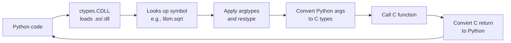
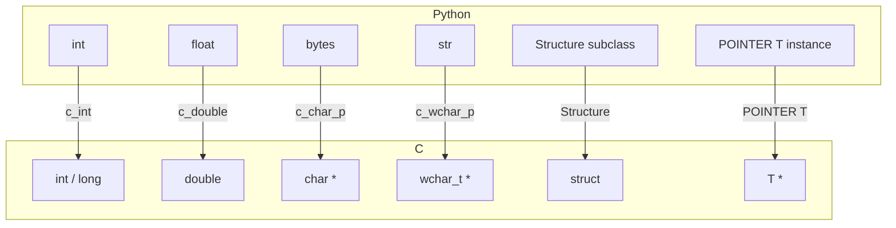

# 1. ctypes

> [!note] Why this note exists
> `ctypes` is Python's **standard library** module for calling C functions from shared libraries (`.so` on Linux, `.dylib` on macOS, `.dll` on Windows) — no compiler required. It's the lowest-overhead way to bind a few C functions into Python without writing any C extension code. This note covers loading libraries, declaring function prototypes, working with pointers and structures, and the cross-platform gotchas that make `ctypes` tricky. After this note you'll be able to call any C function from Python in minutes — and know when to reach for [[2. cffi]] or [[3. Cython]] instead.

## Why It Matters

Python is slow at CPU-bound work, but it's an excellent **glue** language — it can call into C libraries that are fast. `ctypes` is the simplest glue layer: it lets you load a `.so`/`.dll` and call its functions directly, with no compilation step.

Use cases:
- **Calling system libraries** — `libc` (math, string, file functions), `librt`, `libdl`, Windows API.
- **Calling pre-compiled third-party C libraries** — e.g., `libcurl`, `libxml2`, `libsqlite3`.
- **Quick prototyping** — try out a C API before writing a real binding.
- **Embedding in pure-Python packages** — `ctypes`-based bindings ship as pure Python (no build step for users).

The trade-off: `ctypes` is **dynamic** — it doesn't know the C function signatures at compile time. You must declare them at runtime, and mistakes (wrong argument type, wrong return type, missing pointer indirection) cause segfaults, not Python exceptions. For production bindings, `cffi` (next note) is usually a better choice — it's safer, faster, and more readable.

## Background

### Foreign Function Interfaces (FFI)

An FFI lets code in one language call functions written in another. Python has several FFIs for C:

| Tool        | Standard? | Compiler needed? | Type safety | Use case                          |
|-------------|-----------|------------------|-------------|------------------------------------|
| `ctypes`    | Yes       | No               | Runtime     | Quick calls to existing libraries  |
| `cffi`      | No        | API mode: yes; ABI mode: no | Compile-time (API) | Production bindings         |
| Cython      | No        | Yes              | Compile-time | Tight Python-C integration         |
| `pybind11`  | No        | Yes (C++)        | Compile-time | C++ bindings                       |
| C API       | Yes       | Yes (C)          | Compile-time | Maximum control, max complexity    |

`ctypes` is the lowest-friction option — pure Python, no compilation. It's also the least safe and the slowest at the boundary (each call involves dynamic type conversion).

### ABI vs API

Two ways to call a C function:
- **ABI (Application Binary Interface)** — call by symbol address. You load the `.so` and look up the function name. No headers needed, no compilation. This is what `ctypes` does (and `cffi` in ABI mode).
- **API (Application Programming Interface)** — call via a C compiler, using the library's header files. The compiler knows the exact signatures; you get type safety and (sometimes) better performance. This is what `cffi` API mode, Cython, and pybind11 do.

ABI is faster to set up but more fragile — if the library's ABI changes (different struct layout, different calling convention), your code breaks silently. API is more work upfront but more robust.

## Main content

### Loading a shared library

```python
import ctypes
import ctypes.util

# Find the library's path (searches standard locations):
libm_path = ctypes.util.find_library('m')   # 'libm.so.6' on Linux

# Load it:
libm = ctypes.CDLL(libm_path)              # Linux/macOS
# Or Windows:
# user32 = ctypes.WinDLL('user32.dll')      # Windows stdcall
# kernel32 = ctypes.KernelDLL('kernel32.dll')

# Call a function:
result = libm.sqrt(16.0)
print(result)   # 4.0
```

Three loader classes:
- `ctypes.CDLL` — uses the **cdecl** calling convention (caller cleans the stack). Standard for most C libraries on Linux/macOS.
- `ctypes.WinDLL` — uses **stdcall** (callee cleans). Windows API functions.
- `ctypes.OleDLL` — stdcall + returns `HRESULT`. Windows COM.

Pick the one matching the library's calling convention. Wrong choice = segfault.

### Specifying argument and return types

By default, `ctypes` assumes every C function takes `int` arguments and returns `int`. This is **wrong** for most real functions:

```python
# Without prototypes — wrong! sqrt expects double, returns double
result = libm.sqrt(16.0)
# 'result' is an int (truncated!), and we may have corrupted the FP register
```

Always declare `argtypes` and `restype`:

```python
import ctypes

libm = ctypes.CDLL(ctypes.util.find_library('m'))

libm.sqrt.argtypes = [ctypes.c_double]
libm.sqrt.restype = ctypes.c_double

result = libm.sqrt(16.0)
print(result)   # 4.0 (correct double)
```

`argtypes` is a list — one entry per argument. `restype` is a single type. Common types:

| ctypes type          | C type               |
|----------------------|----------------------|
| `c_int`              | `int`                |
| `c_uint`             | `unsigned int`       |
| `c_long`             | `long`               |
| `c_longlong`         | `long long`          |
| `c_size_t`           | `size_t`             |
| `c_float`            | `float`              |
| `c_double`           | `double`             |
| `c_char_p`           | `char *` (string)    |
| `c_wchar_p`          | `wchar_t *`          |
| `c_void_p`           | `void *`             |
| `POINTER(T)`         | `T *`                |
| `Structure` subclass | `struct {...}`       |
| `c_char * N`         | `char[N]` (array)    |

### Strings

Python `bytes`  C `char *`:

```python
libc = ctypes.CDLL(ctypes.util.find_library('c'))

# C: size_t strlen(const char *s)
libc.strlen.argtypes = [ctypes.c_char_p]
libc.strlen.restype = ctypes.c_size_t

libc.strlen(b"hello")   # 5
```

Note the `b"hello"` — `c_char_p` requires bytes, not str. To pass a string, encode first:

```python
libc.strlen("hello".encode('utf-8'))   # 5
```

#### Getting a string back

```python
# C: char *strdup(const char *s)
libc.strdup.argtypes = [ctypes.c_char_p]
libc.strdup.restype = ctypes.c_char_p

dup = libc.strdup(b"hello")
print(dup)   # b'hello'
```

The returned `c_char_p` is automatically converted to Python `bytes`.

> [!warning] Memory leaks
> C functions that return `char *` (like `strdup`) often expect the caller to `free` the result. `ctypes` doesn't free for you — you must call `libc.free(ptr)` explicitly. Otherwise, you leak memory.

### Pointers

```python
# C: int strtol(const char *nptr, char **endptr, int base)
libc.strtol.argtypes = [ctypes.c_char_p, ctypes.POINTER(ctypes.c_char_p), ctypes.c_int]
libc.strtol.restype = ctypes.c_long

endptr = ctypes.c_char_p()
result = libc.strtol(b"123abc", ctypes.byref(endptr), 10)
print(result)         # 123
print(endptr.value)   # b'abc'  — the unparsed suffix
```

`ctypes.byref(x)` is shorthand for `ctypes.pointer(x)` — passes a pointer to `x`. Use it when a function wants `T *` and you have a `T`.

`ctypes.POINTER(T)` creates a pointer-to-T type. `ctypes.pointer(x)` creates an actual pointer object to `x`.

### Structures

```c
struct point {
    int x;
    int y;
};
```

In Python:

```python
class Point(ctypes.Structure):
    _fields_ = [
        ("x", ctypes.c_int),
        ("y", ctypes.c_int),
    ]

# Pass by value:
libgraphics.draw_point.argtypes = [Point]
libgraphics.draw_point.restype = ctypes.c_int
libgraphics.draw_point(Point(10, 20))

# Pass by pointer:
libgraphics.translate_point.argtypes = [ctypes.POINTER(Point)]
p = Point(10, 20)
libgraphics.translate_point(ctypes.byref(p))
print(p.x, p.y)   # modified in place
```

#### Nested structures

```python
class Line(ctypes.Structure):
    _fields_ = [
        ("start", Point),
        ("end", Point),
    ]

line = Line(Point(0, 0), Point(10, 10))
```

#### Packed structures (`_pack_`)

```python
class Packed(ctypes.Structure):
    _pack_ = 1   # no padding
    _fields_ = [
        ("a", ctypes.c_uint8),
        ("b", ctypes.c_uint32),
    ]
```

Use `_pack_` when interfacing with C code that uses `#pragma pack` or `__attribute__((packed))`.

#### Bit fields

```python
class Flags(ctypes.Structure):
    _fields_ = [
        ("a", ctypes.c_uint32, 1),   # 1 bit
        ("b", ctypes.c_uint32, 3),   # 3 bits
        ("c", ctypes.c_uint32, 4),   # 4 bits
    ]
```

### Arrays

```python
# C: int arr[10];
IntArray = ctypes.c_int * 10

arr = IntArray()
arr[0] = 42
arr[1] = 99
print(arr[0], arr[1])

# Pass to C:
lib.process_array.argtypes = [IntArray, ctypes.c_size_t]
lib.process_array(arr, len(arr))
```

### Function pointers (callbacks)

Pass a Python function to C as a callback:

```python
# C signature: void qsort(void *base, size_t nmemb, size_t size,
#                        int (*compar)(const void *, const void *));

CMPFUNC = ctypes.CFUNCTYPE(ctypes.c_int, ctypes.c_void_p, ctypes.c_void_p)

def cmp(a, b):
    av = ctypes.cast(a, ctypes.POINTER(ctypes.c_int))[0]
    bv = ctypes.cast(b, ctypes.POINTER(ctypes.c_int))[0]
    return -1 if av < bv else (1 if av > bv else 0)

libc.qsort.argtypes = [
    ctypes.c_void_p, ctypes.c_size_t, ctypes.c_size_t, CMPFUNC
]
libc.qsort.restype = None

arr = (ctypes.c_int * 5)(5, 3, 1, 4, 2)
libc.qsort(arr, 5, ctypes.sizeof(ctypes.c_int), CMPFUNC(cmp))
print(list(arr))   # [1, 2, 3, 4, 5]
```

`CFUNCTYPE` creates a function pointer type. `CFUNCTYPE(func)` wraps a Python callable. Keep a reference to the wrapped function — if it's garbage-collected, calling it from C crashes.

### `c_void_p` and casting

```python
# Generic pointer — when you don't care about the pointee type:
ptr = ctypes.c_void_p(lib.malloc(1024))

# Cast to a typed pointer:
typed = ctypes.cast(ptr, ctypes.POINTER(ctypes.c_int))
typed[0] = 42
```

### Error handling

Many C libraries use `errno` (Linux/macOS) or `GetLastError` (Windows) to report errors. `ctypes` exposes them:

```python
import ctypes

libc = ctypes.CDLL(ctypes.util.find_library('c'), use_errno=True)

# After a failing call:
err = ctypes.get_errno()
if err != 0:
    msg = ctypes.strerror(err)
    print(f"Error {err}: {msg}")
```

On Windows:

```python
ctypes.windll.kernel32.GetLastError()
ctypes.FormatError(code)
```

### GIL release

By default, `ctypes` holds the GIL during the C call — meaning no other Python thread can run. For long-running C calls, release the GIL:

```python
# Decorator-style isn't available; you set restype to a special value:
# Actually, you can use ctypes.PYFUNCTYPE for callbacks that need the GIL,
# or just accept the GIL is held.

# For long calls, consider cffi (which releases by default) or
# running the call in a thread pool.
```

`ctypes` does release the GIL for some calls, but the rules are subtle. For guaranteed GIL release, use `cffi`.

## Mermaid: ctypes binding flow



## Mermaid: type mapping



## Code examples

### Calling libc string functions

```python
import ctypes
import ctypes.util

libc = ctypes.CDLL(ctypes.util.find_library('c'))

# strlen
libc.strlen.argtypes = [ctypes.c_char_p]
libc.strlen.restype = ctypes.c_size_t
assert libc.strlen(b"hello") == 5

# strcmp
libc.strcmp.argtypes = [ctypes.c_char_p, ctypes.c_char_p]
libc.strcmp.restype = ctypes.c_int
assert libc.strcmp(b"abc", b"abc") == 0
assert libc.strcmp(b"abc", b"abd") < 0

# memcpy
libc.memcpy.argtypes = [
    ctypes.c_void_p, ctypes.c_void_p, ctypes.c_size_t
]
libc.memcpy.restype = ctypes.c_void_p

dst = (ctypes.c_char * 6)()
src = b"hello"
libc.memcpy(dst, src, len(src) + 1)
print(dst.value)   # b'hello'
```

### Calling a custom C library

`mylib.c`:
```c
#include <stdint.h>

uint64_t factorial(uint32_t n) {
    uint64_t result = 1;
    for (uint32_t i = 2; i <= n; i++) {
        result *= i;
    }
    return result;
}

typedef struct {
    int32_t x;
    int32_t y;
} Point;

void translate(Point *p, int32_t dx, int32_t dy) {
    p->x += dx;
    p->y += dy;
}
```

Build:
```bash
gcc -shared -fPIC -O2 -o libmylib.so mylib.c
```

Python:
```python
import ctypes

class Point(ctypes.Structure):
    _fields_ = [("x", ctypes.c_int32), ("y", ctypes.c_int32)]

lib = ctypes.CDLL("./libmylib.so")

lib.factorial.argtypes = [ctypes.c_uint32]
lib.factorial.restype = ctypes.c_uint64
print(lib.factorial(20))   # 2432902008176640000

lib.translate.argtypes = [ctypes.POINTER(Point), ctypes.c_int32, ctypes.c_int32]
lib.translate.restype = None

p = Point(1, 2)
lib.translate(ctypes.byref(p), 10, 20)
print(p.x, p.y)   # 11 22
```

### Reading system information on Linux

```python
import ctypes

libc = ctypes.CDLL(ctypes.util.find_library('c'))

class Sysinfo(ctypes.Structure):
    _fields_ = [
        ("uptime", ctypes.c_long),
        ("loads", ctypes.c_ulong * 3),
        ("totalram", ctypes.c_ulong),
        ("freeram", ctypes.c_ulong),
        ("sharedram", ctypes.c_ulong),
        ("bufferram", ctypes.c_ulong),
        ("totalswap", ctypes.c_ulong),
        ("freeswap", ctypes.c_ulong),
        ("procs", ctypes.c_ushort),
        ("totalhigh", ctypes.c_ulong),
        ("freehigh", ctypes.c_ulong),
        ("mem_unit", ctypes.c_uint),
        ("_f", ctypes.c_char * 0),
    ]

libc.sysinfo.argtypes = [ctypes.POINTER(Sysinfo)]
libc.sysinfo.restype = ctypes.c_int

info = Sysinfo()
if libc.sysinfo(ctypes.byref(info)) == 0:
    print(f"Uptime: {info.uptime} seconds")
    print(f"Total RAM: {info.totalram * info.mem_unit / (1024**3):.1f} GB")
    print(f"Free RAM:  {info.freeram * info.mem_unit / (1024**3):.1f} GB")
    print(f"Load averages: {list(info.loads)}")
```

### Windows message box

```python
import ctypes

user32 = ctypes.WinDLL('user32')

# int MessageBoxW(HWND hWnd, LPCWSTR lpText, LPCWSTR lpCaption, UINT uType);
user32.MessageBoxW.argtypes = [
    ctypes.c_void_p, ctypes.c_wchar_p, ctypes.c_wchar_p, ctypes.c_uint
]
user32.MessageBoxW.restype = ctypes.c_int

MB_OK = 0x00000000
result = user32.MessageBoxW(0, "Hello from Python!", " ctypes Demo", MB_OK)
print(f"User clicked: {result}")
```

### Callbacks: custom sort comparator

```python
import ctypes

libc = ctypes.CDLL(ctypes.util.find_library('c'))

COMPARE_FUNC = ctypes.CFUNCTYPE(
    ctypes.c_int,
    ctypes.POINTER(ctypes.c_int),
    ctypes.POINTER(ctypes.c_int),
)

def descending(a, b):
    a_val = a[0]
    b_val = b[0]
    if a_val < b_val:
        return 1
    elif a_val > b_val:
        return -1
    return 0

# Keep a reference so the callback isn't GC'd:
cb = COMPARE_FUNC(descending)

libc.qsort.argtypes = [
    ctypes.c_void_p, ctypes.c_size_t, ctypes.c_size_t, COMPARE_FUNC
]
libc.qsort.restype = None

arr = (ctypes.c_int * 10)(5, 2, 8, 1, 9, 3, 7, 4, 6, 0)
libc.qsort(arr, len(arr), ctypes.sizeof(ctypes.c_int), cb)
print(list(arr))   # [9, 8, 7, 6, 5, 4, 3, 2, 1, 0]
```

## Common Pitfalls

> [!warning] Not declaring `argtypes` and `restype`
> Default is `int` arguments and `int` return. Calling `sqrt(16.0)` without `restype = c_double` truncates to int and may corrupt FP state. Always declare prototypes.

> [!warning] Wrong calling convention
> `CDLL` = cdecl (Linux/macOS). `WinDLL` = stdcall (Windows API). Calling a stdcall function via `CDLL` corrupts the stack → segfault.

> [!warning] Forgetting `byref` for pointers
> ```python
> libc.stat("/etc/passwd", stat_buf)   # WRONG — passes struct, not pointer
> libc.stat("/etc/passwd", ctypes.byref(stat_buf))   # CORRECT
> ```

> [!warning] Strings: bytes vs str
> `c_char_p` requires `bytes`. Passing a `str` raises `ctypes.ArgumentError`. Encode first.

> [!warning] Memory leaks from C-returned strings
> `strdup`, `getenv`, and similar return `char *` that the caller must `free`. `ctypes` doesn't track this. Wrap and free explicitly.

> [!warning] Garbage-collected callbacks
> ```python
> libc.qsort(arr, n, size, CMPFUNC(my_cmp))   # CB GC'd after this line!
> ```
> If the function stores the callback for later use, it'll be a dangling pointer. Always keep a reference: `cb = CMPFUNC(my_cmp); libc.qsort(..., cb)`.

> [!warning] Struct layout differences across platforms
> C struct layout depends on alignment, padding, and word size. A `struct` that works on Linux x86-64 may have different layout on Windows or ARM. Test on every target platform.

> [!warning] GIL is held during ctypes calls
> Long-running C functions block all Python threads. For concurrent C work, use `cffi` (releases GIL) or run in a thread pool.

> [!warning] Cross-version ABI changes
> If the C library's struct layout changes between versions, your `ctypes` code breaks silently. There's no compile-time check.

> [!warning] `find_library` returning `None`
> On some systems `find_library` doesn't search all paths. Pass the full path to `CDLL`: `ctypes.CDLL("/usr/lib/libm.so.6")`.

## Tips and Tricks

> [!tip] Always declare prototypes
> Set `argtypes` and `restype` once at module load. This catches type errors and prevents silent truncation.

> [!tip] Wrap calls in Python helpers
> ```python
> def sqrt(x: float) -> float:
>     return libm.sqrt(x)
> ```
> Add type hints, docstrings, and error checking. Users call the Python wrapper, not the raw ctypes binding.

> [!tip] Use `cffi` for production
> `cffi` is faster, safer (compile-time type checking in API mode), and more readable. Reach for `ctypes` only for quick scripts.

> [!tip] Keep callback references
> Store them as module-level variables or in a long-lived container. Don't let them be GC'd.

> [!tip] Use `ctypes.sizeof` for portability
> `ctypes.sizeof(ctypes.c_int)` is 4 on most platforms but not guaranteed. Use it instead of hardcoding.

> [!tip] Use `c_bool` for booleans
> C99 `_Bool` is 1 byte; don't use `c_int` for it.

> [!tip] Memory-managed strings with `free`
> ```python
> def safe_strdup(s: bytes) -> bytes:
>     ptr = libc.strdup(s)
>     try:
>         return ctypes.cast(ptr, ctypes.c_char_p).value
>     finally:
>         libc.free(ptr)
> ```

> [!tip] Test on every target platform
> Struct layout, calling conventions, and library availability vary. Run your test suite on Linux, macOS, and Windows in CI.

> [!tip] Use `restype = None` for void functions
> Otherwise ctypes assumes `int` return, which can leave garbage in the return register.

## Advanced patterns

### Wrapping a C library as a Python module

A clean pattern: declare prototypes at module load, expose Python-friendly wrappers:

```python
# mylib.py
import ctypes
import ctypes.util
import os

_lib_path = ctypes.util.find_library('mylib') or os.path.join(
    os.path.dirname(__file__), 'libmylib.so'
)
_lib = ctypes.CDLL(_lib_path)

# Declare prototypes:
_lib.mylib_init.argtypes = []
_lib.mylib_init.restype = ctypes.c_int

_lib.mylib_compute.argtypes = [ctypes.POINTER(ctypes.c_double), ctypes.c_size_t]
_lib.mylib_compute.restype = ctypes.c_double

_lib.mylib_cleanup.argtypes = []
_lib.mylib_cleanup.restype = None

# Initialize:
if _lib.mylib_init() != 0:
    raise RuntimeError("mylib_init failed")

# Python-friendly wrapper:
def compute(values):
    arr = (ctypes.c_double * len(values))(*values)
    return _lib.mylib_compute(arr, len(values))

import atexit
atexit.register(_lib.mylib_cleanup)
```

Users get a clean Python API; the ctypes layer is hidden.

### Variadic functions

Variadic C functions (like `printf`) need special handling:

```python
libc = ctypes.CDLL(ctypes.util.find_library('c'))

# printf is variadic — declare argtypes as None for "any":
libc.printf.argtypes = None   # or omit
libc.printf.restype = ctypes.c_int

libc.printf(b"Hello, %s! You are %d years old.\n", b"Alice", 30)
```

Setting `argtypes = None` tells ctypes to skip type checking and convert each argument based on its Python type. This is less safe but required for variadic functions.

### Working with file descriptors

ctypes can interact with file descriptors:

```python
import ctypes
import os

libc = ctypes.CDLL(ctypes.util.find_library('c'))

# ssize_t read(int fd, void *buf, size_t count);
libc.read.argtypes = [ctypes.c_int, ctypes.c_void_p, ctypes.c_size_t]
libc.read.restype = ctypes.c_ssize_t

# ssize_t write(int fd, const void *buf, size_t count);
libc.write.argtypes = [ctypes.c_int, ctypes.c_void_p, ctypes.c_size_t]
libc.write.restype = ctypes.c_ssize_t

# Open a pipe:
r, w = os.pipe()

# Write to the pipe via libc:
msg = b"hello\n"
libc.write(w, msg, len(msg))

# Read from the pipe via libc:
buf = ctypes.create_string_buffer(1024)
n = libc.read(r, buf, 1024)
print(buf.raw[:n])   # b'hello\n'
```

This is rarely needed (Python's `os` module handles file descriptors natively), but useful when integrating with C libraries that need raw fds.

### Handling unions

```c
union value {
    int i;
    float f;
    char bytes[4];
};
```

In Python:

```python
class Value(ctypes.Union):
    _fields_ = [
        ("i", ctypes.c_int),
        ("f", ctypes.c_float),
        ("bytes", ctypes.c_char * 4),
    ]

v = Value()
v.i = 0x40490FDB   # IEEE 754 for 3.14159...
print(v.f)         # 3.1415927410125732
print(v.bytes)     # b'\xdb\x0fI@'
```

`ctypes.Union` mirrors C `union` — all fields share the same memory.

### Calling conventions on Windows

```python
import ctypes

# Most Windows API functions use stdcall (callee cleans):
user32 = ctypes.WinDLL('user32')   # stdcall

# Some functions (rare) use cdecl:
# msvcrt = ctypes.CDLL('msvcrt')   # cdecl

# ANSI vs Unicode: prefer 'W' (wide) variants for Unicode:
user32.MessageBoxW.argtypes = [
    ctypes.c_void_p, ctypes.c_wchar_p, ctypes.c_wchar_p, ctypes.c_uint
]
user32.MessageBoxW.restype = ctypes.c_int
user32.MessageBoxW(0, "Hello", " ctypes", 0)
```

The `W` suffix on Windows API functions indicates the Unicode (wide-char) version. Always prefer `W` over `A` (ANSI) for new code.

### Comparison summary

| Feature                    | ctypes            | cffi (ABI)         | cffi (API)         | Cython             |
|----------------------------|--------------------|--------------------|--------------------|--------------------|
| Stdlib (no install)        | Yes                | No                 | No                 | No                 |
| Compiler required          | No                 | No                 | Yes                | Yes                |
| Type safety                | Runtime            | Runtime            | Compile-time       | Compile-time       |
| Performance per call       | Slowest            | Fast               | Fastest            | Fastest            |
| GIL released               | Sometimes          | Yes                | Yes                | Manual (`nogil`)   |
| Use for quick prototyping  | Yes                | Yes                | No                 | No                 |
| Use for production         | Limited            | Yes                | Yes                | Yes                |

For new production bindings, prefer cffi (API mode) or Cython. Use ctypes for quick scripts and one-off integrations.

## Active Recall

1. What's the difference between `CDLL`, `WinDLL`, and `OleDLL`?
2. Why must you declare `argtypes` and `restype`? What's the default?
3. How do you pass a `bytes` string to a C function expecting `char *`? What about a `str`?
4. `ctypes.byref(x)` vs `ctypes.pointer(x)` — what's the difference?
5. How do you define a struct in `ctypes`? What's the `_fields_` attribute?
6. What's the `_pack_` attribute for?
7. How do you pass a Python function as a callback to C?
8. What happens if a callback is garbage-collected while C still holds a reference to it?
9. Does `ctypes` release the GIL during C calls? What are the implications?
10. When would you reach for `cffi` or Cython instead of `ctypes`?

## Next Steps

- [[2. cffi]] — the safer, faster, more readable alternative.
- [[3. Cython]] — for tight Python-C integration with type annotations.
- [[5. pybind11]] — for C++ bindings (when C++ is the source language).
- [[4. Numba]] — JIT for numerical code; complements ctypes for performance.
- [[16. Python Internals/5. The C API]] — the underlying C API that ctypes abstracts.
- [[16. Python Internals/3. The Execution Model]] — how Python's execution model interacts with native code.
