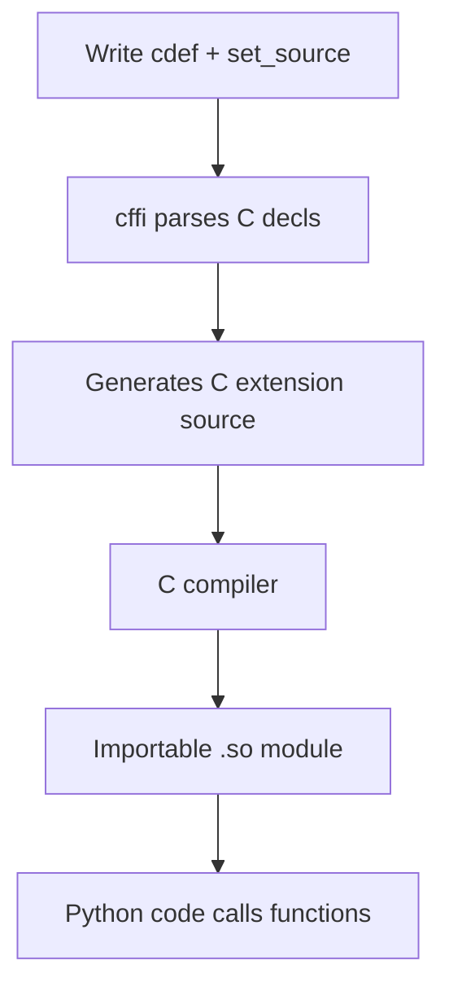
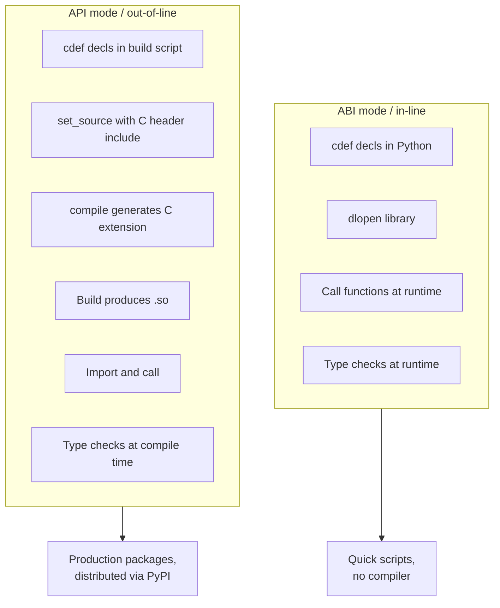

# 2. cffi

> [!note] Why this note exists
> [[1. ctypes]] covered Python's standard-library FFI for calling C functions. This note covers **cffi** (C Foreign Function Interface), a third-party library that solves the same problem more cleanly: you write the C declarations directly in Python, the types are checked at compile time (in API mode), and performance is often better than `ctypes`. `cffi` is the binding layer used by PyPy (for its JIT-friendly C calls), `cryptography` (the most-installed crypto library), and many others. After this note you'll know when to choose `cffi` over `ctypes`, and how to write bindings in both ABI and API modes.

## Why It Matters

`ctypes` works, but it has three chronic problems:
1. **No type safety.** You declare `argtypes` at runtime as Python objects; a typo (e.g., `c_int` vs `c_uint`) silently corrupts data instead of erroring.
2. **Verbose and repetitive.** Every function needs `argtypes` and `restype` lines; structs need `_fields_`; the C header information is effectively re-encoded in Python.
3. **GIL held during calls.** `ctypes` releases the GIL only in specific cases. For long-running C functions, this serializes Python threads.

`cffi` solves all three:
1. **Compile-time type checking (API mode).** You write actual C declarations; `cffi` parses them and generates a C extension at build time. Type errors are caught by the C compiler.
2. **Concise declarations.** You paste C declarations into a string — no re-encoding. The header file is the source of truth.
3. **GIL released by default.** `cffi` releases the GIL during C calls (unless you explicitly request it back), so Python threads can run concurrently.

`cffi` is the choice of:
- **PyPy** — its primary C interop layer; the JIT can inline cffi calls.
- **`cryptography`** — used by HTTPS everywhere; performance and safety are critical.
- **`psycopg** (psycopg3)** — modern PostgreSQL driver.
- Many scientific and systems libraries.

If you're writing a binding that will see real use, `cffi` is almost always the right choice over `ctypes`.

## Background

### ABI mode vs API mode

`cffi` has two modes:

- **ABI mode** (`ffi.dlopen`) — loads the `.so`/`.dll` directly, like `ctypes`. No compiler needed. You declare the C types but they're checked at runtime. Fast to set up; less safe.
- **API mode** (`ffi.cdef` + `ffi.set_source` + compile) — generates a C extension module from your declarations. Requires a compiler at build time, but gives compile-time type checking and (often) better performance.

ABI mode is the quick prototyping path. API mode is the production path. Most real bindings use API mode.

### How `cffi` works



In API mode, you run `ffi.compile()` (or set up `cffi` as a build backend) to generate the C extension. The resulting module is a regular Python extension (`.so`/`.pyd`), importable like any other.

In ABI mode, the parse step happens at runtime; no compilation is needed.

## Main content

### ABI mode: the quick path

```python
from cffi import FFI

ffi = FFI()

# Declare the C types and function signatures you'll use:
ffi.cdef("""
    int printf(const char *format, ...);
    size_t strlen(const char *s);
    char *strdup(const char *s);
    void free(void *ptr);
""")

# Load the library:
libc = ffi.dlopen(None)   # None = use the C library linked to Python itself

# Call:
libc.printf(b"Hello, %s!\n", b"world")
print(libc.strlen(b"hello"))   # 5

# strdup returns char* — must free
dup = libc.strdup(b"hello")
try:
    print(ffi.string(dup))   # b'hello'
finally:
    libc.free(dup)
```

`ffi.dlopen(None)` opens the C library that's already linked to Python (libc on Linux/macOS). For other libraries:

```python
libm = ffi.dlopen("libm.so.6")
libcurl = ffi.dlopen("libcurl.so.4")
```

#### Strings in ABI mode

`ffi.string(char_ptr)` converts a C `char *` to Python `bytes`. The reverse — passing bytes to a C function expecting `char *` — happens automatically (cffi manages a buffer that's valid for the duration of the call).

For `char *` that you want to mutate, allocate explicitly:

```python
buf = ffi.new("char[]", 256)   # 256-byte buffer
libc.gethostname(buf, 256)
hostname = ffi.string(buf)
print(hostname)   # b'myhost'
```

`ffi.new("char[]", 256)` allocates a C `char[256]` and returns a pointer to it. The memory is freed when the Python object is GC'd.

### API mode: the production path

Project layout:
```
my_project/
├── setup.py            (or pyproject.toml)
├── _build.py           (cffi setup script)
└── my_package/
    └── __init__.py
```

`_build.py`:
```python
from cffi import FFI

ffi = FFI()

# Declarations (a subset of the C header):
ffi.cdef("""
    typedef struct {
        int x;
        int y;
    } Point;

    int factorial(int n);
    void translate(Point *p, int dx, int dy);
""")

# Source: includes the actual C header
ffi.set_source(
    "_my_cffi_module",
    """
    #include "mylib.h"
    """,
    libraries=["mylib"],
    library_dirs=["/usr/local/lib"],
    include_dirs=["/usr/local/include"],
)

if __name__ == "__main__":
    ffi.compile(verbose=True)
```

`mylib.h`:
```c
typedef struct {
    int x;
    int y;
} Point;

int factorial(int n);
void translate(Point *p, int dx, int dy);
```

`mylib.c`:
```c
#include "mylib.h"

int factorial(int n) {
    int result = 1;
    for (int i = 2; i <= n; i++) result *= i;
    return result;
}

void translate(Point *p, int dx, int dy) {
    p->x += dx;
    p->y += dy;
}
```

Build:
```bash
python _build.py
# Generates _my_cffi_module.c, then compiles to _my_cffi_module.*.so
```

Use:
```python
from _my_cffi_module import ffi, lib

print(lib.factorial(5))   # 120

p = ffi.new("Point *")
p.x = 1
p.y = 2
lib.translate(p, 10, 20)
print(p.x, p.y)   # 11 22
```

#### Integrating with setuptools

For distribution, integrate cffi with your build system:

```python
# setup.py
from setuptools import setup, Extension
setup(
    name="my_package",
    version="1.0.0",
    cffi_modules=["_build.py:ffi"],
    setup_requires=["cffi>=1.0"],
    install_requires=["cffi>=1.0"],
)
```

Or `pyproject.toml`:
```toml
[build-system]
requires = ["setuptools>=61", "cffi>=1.0"]
build-backend = "setuptools.build_meta"

[project]
name = "my_package"
version = "1.0.0"
dependencies = ["cffi>=1.0"]
```

When users `pip install` your package, cffi generates and compiles the C extension on their machine. They need a C compiler — but they get full type safety.

### Out-of-line vs in-line

`cffi` docs use these terms:
- **In-line (ABI mode)**: `ffi.cdef` + `ffi.dlopen`. All in Python; no compilation.
- **Out-of-line (API mode)**: `ffi.cdef` + `ffi.set_source` + `ffi.compile`. Generates C extension.

Use in-line for quick scripts and prototyping. Use out-of-line for production bindings distributed as packages.

### Working with pointers and memory

```python
from cffi import FFI
ffi = FFI()

ffi.cdef("""
    void *malloc(size_t size);
    void free(void *ptr);
    int *int_alloc(int n);
""")

libc = ffi.dlopen(None)

# Allocate via C:
ptr = libc.malloc(100)
try:
    # Use ptr...
    pass
finally:
    libc.free(ptr)

# Or use ffi.new — automatic memory management:
arr = ffi.new("int[]", 10)   # int[10], freed when arr is GC'd
for i in range(10):
    arr[i] = i * i
print(arr[5])   # 25

# Pointer to scalar:
x = ffi.new("int *")
x[0] = 42
print(x[0])   # 42

# Cast:
void_ptr = ffi.cast("void *", arr)
```

`ffi.new` is the standard way to allocate C memory. The object it returns holds the memory; when the object is garbage-collected, the memory is freed (cffi uses a destructor under the hood).

### Structures and arrays

```python
ffi.cdef("""
    typedef struct {
        int x, y;
        char name[32];
    } Particle;

    typedef struct {
        Particle parts[100];
        int count;
    } System;
""")

# Create a Particle:
p = ffi.new("Particle *")
p.x = 10
p.y = 20
ffi.memmove(p.name, b"electron", 9)   # copy bytes into the char[32]
print(ffi.string(p.name))   # b'electron'

# Create a System:
sys = ffi.new("System *")
sys.parts[0].x = 1
sys.parts[0].y = 2
sys.count = 1
```

### Strings

```python
# char * → bytes:
c_str = lib.some_function_returning_char_star()
py_bytes = ffi.string(c_str)   # bytes

# For wide chars:
ffi.string(wchar_ptr, max_len=100)

# bytes → char * (temporary, valid for one call):
lib.func(b"hello")

# bytes → char[] (persistent buffer):
buf = ffi.new("char[]", b"hello")   # 6 bytes: 'h','e','l','l','o','\0'
```

### Function pointers (callbacks)

```python
ffi.cdef("""
    typedef int (*compare_func)(const void *, const void *);
    void qsort(void *base, size_t nmemb, size_t size, compare_func cmp);
""")

@ffi.callback("compare_func")
def cmp(a, b):
    av = ffi.cast("int *", a)[0]
    bv = ffi.cast("int *", b)[0]
    return -1 if av < bv else (1 if av > bv else 0)

arr = ffi.new("int[]", [5, 3, 1, 4, 2])
libc.qsort(arr, 5, ffi.sizeof("int"), cmp)
print(list(arr))   # [1, 2, 3, 4, 5]
```

`@ffi.callback("type")` wraps a Python function as a C function pointer. Like `ctypes.CFUNCTYPE`, you must keep a reference to the callback (cffi does some of this automatically, but for callbacks stored in C, be careful).

### Error handling

```python
ffi.cdef("""
    int open(const char *pathname, int flags);
    int close(int fd);
    ssize_t read(int fd, void *buf, size_t count);
""")

import errno

O_RDONLY = 0
fd = libc.open(b"/etc/hostname", O_RDONLY)
if fd < 0:
    err = ffi.errno   # reads C errno
    raise OSError(err, os.strerror(err))

try:
    buf = ffi.new("char[]", 256)
    n = libc.read(fd, buf, 256)
    if n < 0:
        err = ffi.errno
        raise OSError(err, os.strerror(err))
    print(ffi.string(buf, n))   # first n bytes
finally:
    libc.close(fd)
```

`ffi.errno` is a property that reads/writes C's `errno` (with the GIL held, so it's safe).

### GIL release

By default, cffi releases the GIL during C calls. To hold the GIL (rarely needed):

```python
@ffi.callback("compare_func", error=-1)
def cmp(a, b):
    # This callback runs with the GIL held (Python code, after all)
    ...
```

For C functions that call back into Python, cffi handles the GIL acquisition automatically. For long-running C functions, the GIL is released, allowing other Python threads to run.

## Mermaid: cffi API vs ABI



## Mermaid: cffi compilation pipeline

```mermaid
sequenceDiagram
    participant Dev as Developer
    participant Script as _build.py
    participant Cffi as cffi library
    participant CC as C compiler
    participant User as End user

    Dev->>Script: writes cdef + set_source
    Dev->>Cffi: python _build.py
    Cffi->>Cffi: parse cdef
    Cffi->>Cffi: generate _mod.c
    Cffi->>CC: compile _mod.c
    CC-->>Cffi: _mod.so
    Cffi-->>Dev: module ready

    Note over User: At install time:
    User->>Cffi: pip install package
    Cffi->>CC: compile _mod.c
    CC-->>User: _mod.so installed
    User->>User: import _mod; lib.func()
```

## Code examples

### A complete cffi binding (API mode)

`build_mylib.py`:
```python
from cffi import FFI

ffi = FFI()

ffi.cdef("""
    typedef struct {
        int width;
        int height;
        float *data;   // width * height floats
    } Image;

    Image *image_new(int width, int height);
    void image_free(Image *img);
    float image_get(const Image *img, int x, int y);
    void image_set(Image *img, int x, int y, float value);
    void image_blur(Image *img, int radius);
""")

ffi.set_source(
    "_mylib",
    """
    #include "mylib.h"
    """,
    sources=["src/mylib.c"],
    include_dirs=["src"],
    extra_compile_args=["-O3"],
)

if __name__ == "__main__":
    ffi.compile(verbose=True)
```

Wrapper in `mylib.py`:
```python
from _mylib import ffi, lib

class Image:
    def __init__(self, width: int, height: int):
        self._img = lib.image_new(width, height)
        if not self._img:
            raise MemoryError("image_new failed")

    def __del__(self):
        if hasattr(self, '_img') and self._img:
            lib.image_free(self._img)

    def __getitem__(self, key):
        x, y = key
        return lib.image_get(self._img, x, y)

    def __setitem__(self, key, value):
        x, y = key
        lib.image_set(self._img, x, y, value)

    def blur(self, radius: int):
        lib.image_blur(self._img, radius)

    @property
    def width(self):
        return self._img.width

    @property
    def height(self):
        return self._img.height

# Usage:
img = Image(100, 100)
img[50, 50] = 1.0
img.blur(5)
print(img[50, 50])
```

The wrapper turns the C API into a clean Python class — callers never see `ffi` or `lib`.

### Reading a system file with cffi

```python
from cffi import FFI
ffi = FFI()

ffi.cdef("""
    typedef struct _IO_FILE FILE;
    FILE *fopen(const char *path, const char *mode);
    int fclose(FILE *fp);
    char *fgets(char *buf, int size, FILE *fp);
""")

libc = ffi.dlopen(None)

def read_first_line(path: str) -> str:
    fp = libc.fopen(path.encode(), b"r")
    if not fp:
        raise OSError(f"fopen failed for {path}")

    try:
        buf = ffi.new("char[]", 4096)
        if libc.fgets(buf, 4096, fp):
            return ffi.string(buf).decode()
        return ""
    finally:
        libc.fclose(fp)

print(read_first_line("/etc/hostname"))
```

### Calling a C++ library (with `extern "C"` wrapper)

C++ doesn't have a stable ABI; you can't call C++ methods directly via cffi. Wrap them:

```cpp
// mylib.cpp
#include "mylib.h"

class Image {
public:
    int w, h;
    Image(int w, int h) : w(w), h(h) {}
    int area() const { return w * h; }
};

extern "C" {
    Image *image_new(int w, int h) { return new Image(w, h); }
    void image_free(Image *img) { delete img; }
    int image_area(const Image *img) { return img->area(); }
}
```

cffi treats `extern "C"` functions as plain C — perfect for bridging C++.

### Performance: cffi vs ctypes

```python
# A trivial C function: int add(int a, int b) { return a + b; }

# ctypes:
import ctypes
lib = ctypes.CDLL("./libadd.so")
lib.add.argtypes = [ctypes.c_int, ctypes.c_int]
lib.add.restype = ctypes.c_int

# cffi (ABI):
from cffi import FFI
ffi = FFI()
ffi.cdef("int add(int a, int b);")
lib2 = ffi.dlopen("./libadd.so")

# Benchmark:
import timeit
print(timeit.timeit(lambda: lib.add(1, 2), number=1_000_000))
print(timeit.timeit(lambda: lib2.add(1, 2), number=1_000_000))
```

cffi is typically 1.5–3× faster than ctypes per call (less type conversion overhead). For tight loops calling C many times, this matters.

## Common Pitfalls

> [!warning] Forgetting `ffi.string()` for `char *` returns
> If a C function returns `char *`, cffi gives you a `cdata` object, not bytes. Wrap with `ffi.string()` to get bytes.

> [!warning] Memory management confusion
> `ffi.new("T *")` allocates and auto-frees. `lib.malloc(...)` allocates via C and requires explicit `lib.free(...)`. Don't mix them.

> [!warning] Buffer lifetime for callbacks
> If a C function stores a callback or buffer for later use, ensure the Python object stays alive. Store it as a module-level variable or in a long-lived container.

> [!warning] ABI mode + struct layout drift
> ABI mode trusts the C library's binary layout. If the library updates with a different struct layout, your code silently breaks. Use API mode for production.

> [!warning] `cdef` syntax errors
> cffi's C parser is limited. It supports function declarations, structs, typedefs, and macros (`#define`). It does NOT support full C — function bodies, complex expressions in `#define`, etc. For complex headers, use `ffi.set_source` with `#include` and only declare what you use in `cdef`.

> [!warning] Macros that aren't simple constants
> `#define MAX_SIZE 256` works in `cdef`. `#define FOO(x) ((x) * 2)` doesn't. Use `ffi.set_source` and define constants in C.

> [!warning] C++ name mangling
> You can't call C++ methods directly — the names are mangled. Always wrap with `extern "C"`.

> [!warning] Threading and the GIL
> cffi releases the GIL by default. If your C function calls back into Python (via a callback), cffi re-acquires the GIL. But if your C function uses Python C API directly (not via the callback), it'll crash — there's no GIL held.

> [!warning] `ffi.cast` vs Python type coercion
> `ffi.cast("int", x)` casts a Python int to a C int. It doesn't change the underlying type of a cdata object. For type conversion, use `int(cdata)` or `float(cdata)`.

## Tips and Tricks

> [!tip] Use API mode for production
> ABI mode is fine for prototyping, but API mode gives type safety and performance. The build step is one-time cost.

> [!tip] Wrap cffi calls in Python classes
> The raw `lib.func()` calls are awkward. Wrap them in a Python class with `__init__`, `__del__`, properties, etc. Users get a clean Python API.

> [!tip] Use `ffi.new` for memory management
> `ffi.new("T *")` allocates and auto-frees via Python GC. Much safer than manual `malloc`/`free`.

> [!tip] Use `ffi.gc` for C-managed memory
> If a C function returns a pointer that needs `lib.free(ptr)`, wrap it:
> ```python
> ptr = ffi.gc(lib.malloc(100), lib.free)
> # When ptr is GC'd, lib.free is called automatically.
> ```

> [!tip] Read headers from files
> ```python
> with open("mylib.h") as f:
>     ffi.cdef(f.read())
> ```
> Keeps declarations in sync with the C header.

> [!tip] Use `ffi.typeof` for introspection
> `ffi.typeof("Point")` returns the type object; useful for debugging.

> [!tip] Test on multiple platforms
> Like ctypes, cffi code is sensitive to struct layout and library paths. CI on Linux, macOS, Windows.

> [!tip] Benchmark before assuming cffi is faster
> cffi is usually faster than ctypes, but for very small calls the difference is negligible. Profile your hot path.

> [!tip] Use `ffi.from_buffer` for zero-copy
> ```python
> buf = bytearray(1024)
> ptr = ffi.from_buffer("char[]", buf)
> lib.fill(ptr, 1024)
> # buf now contains the data — no copy
> ```

## Active Recall

1. What are the two modes of cffi? Which one requires a compiler?
2. What's the difference between `ffi.dlopen` and `ffi.set_source`?
3. How do you allocate a C `int[10]` array in cffi? When is it freed?
4. How do you convert a returned `char *` to Python bytes?
5. How do you pass a Python function as a C callback?
6. Why is API mode safer than ABI mode?
7. How does cffi handle the GIL? Does it release it during C calls?
8. What's `ffi.errno` for? When would you use it?
9. How would you call a C++ class method via cffi?
10. Name three popular libraries that use cffi for their bindings.

## Next Steps

- [[1. ctypes]] — the standard-library alternative; compare and contrast.
- [[3. Cython]] — for tight Python-C integration with type annotations.
- [[5. pybind11]] — for C++ bindings specifically.
- [[4. Numba]] — JIT for numerical code; a different performance strategy.
- [[7. Modules and Packages/4. pyproject.toml and Packaging]] — packaging cffi-based extensions.
- [[15. Memory and Performance/5. Optimization Techniques]] — broader optimization context.
