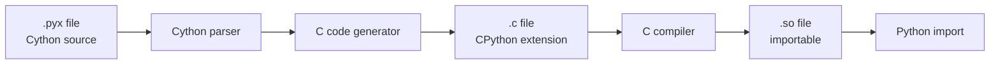
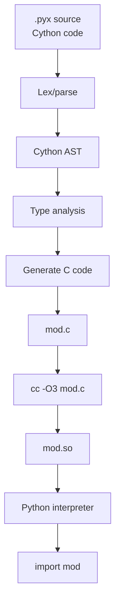

# 3. Cython

> [!note] Why this note exists
> [[1. ctypes]] and [[2. cffi]] are FFI tools — they let Python call existing C code. **Cython** is different: it's a **superset of Python** that compiles to C, letting you write Python-like code that runs at near-C speed. With type annotations, Cython can deliver 10–100× speedups over pure Python. This note covers the Cython language (`.pyx`/`.pxd` files), the build process, the performance model, and when Cython beats alternatives like Numba. After this note you'll be able to take a slow Python function and ship a Cython-accelerated version.

## Why It Matters

Python is slow for tight numerical loops — each operation involves dynamic dispatch, type checking, and reference counting. A pure-Python matrix multiply is ~100× slower than C.

Cython solves this by:
- Accepting **pure Python syntax** — your existing `.py` file is valid Cython.
- Adding **optional type annotations** (`cdef int i`, `cdef double x`) that let it generate straight-line C code with no Python overhead.
- Compiling to a C extension, which CPython loads as a normal module.

Use cases:
- **Numerical kernels** — matrix operations, signal processing, simulations.
- **Wrapping C/C++ libraries** — Cython generates the binding code.
- **Performance-critical hot paths** — speed up just the slow function, keep the rest in Python.
- **Scientific Python infrastructure** — NumPy, pandas, scikit-learn, spaCy all use Cython internally.

The biggest names using Cython: NumPy (parts), pandas (much of the core), scikit-learn, spaCy, lxml, gevent, uvloop (Cython wrapper over libuv). When you use these libraries, you're running Cython code at near-C speed.

## Background

### Cython = Python + C types

```python
# Pure Python (valid Cython):
def fib(n):
    if n < 2:
        return n
    return fib(n-1) + fib(n-2)
```

```cython
# Cython with types:
cpdef int fib(int n):
    if n < 2:
        return n
    return fib(n-1) + fib(n-2)
```

The `cpdef int fib(int n)` declaration tells Cython:
- `cpdef` — generate both a C function (fast, internal) and a Python function (callable from outside).
- `int` return type — no Python object overhead for the return.
- `int n` — argument is a C int, not a Python object.

The compiled version runs at C speed — no Python interpreter overhead for the loop body.

### How Cython compiles



Cython:
1. Parses your `.pyx` file.
2. Generates a `.c` file using CPython's C API.
3. Compiles the `.c` to a `.so`/`.pyd` extension module.
4. You `import` the module like any Python module.

The generated C is ugly but correct — you don't read it, you just trust it.

## Main content

### File types: `.pyx`, `.pxd`, `.py`

- **`.pyx`** — Cython source. Your main code.
- **`.pxd`** — Cython "header." Declares types, structs, and external C functions that `.pyx` files use.
- **`.py`** — Pure Python. Cython 3+ supports compiling pure Python files with type hints for speedup.

### Pure Python mode (Cython 3+)

You can write regular `.py` files with type hints and compile them with Cython — no `.pyx` needed:

```python
# fib.py
def fib(n: int) -> int:
    if n < 2:
        return n
    return fib(n-1) + fib(n-2)
```

Compile with:
```bash
cython -3 fib.py
# Produces fib.c, then compile to fib.*.so
```

Cython reads the type hints and uses them. This is the simplest way to start — write Python, get some speedup.

But pure Python mode can only do so much — there's no `cdef`, no ` nogil`, no manual memory management. For maximum speed, you need `.pyx`.

### `cdef` — C-level declarations

```cython
# fib.pyx
def fib(int n):
    cdef int i
    cdef int a = 0
    cdef int b = 1
    for i in range(n):
        a, b = b, a + b
    return a
```

`cdef` declares C variables. They're not Python objects — no reference counting, no GC, no overhead. They're stack-allocated C variables.

#### `cdef` functions

```cython
cdef int _fib(int n):
    if n < 2:
        return n
    return _fib(n-1) + _fib(n-2)
```

`cdef` functions are C functions — callable from Cython but not from Python. Fastest, but invisible to Python.

#### `cpdef` functions

```cython
cpdef int fib(int n):
    if n < 2:
        return n
    return fib(n-1) + fib(n-2)
```

`cpdef` generates both a C function (fast) and a Python wrapper (callable). Cython picks the C version when called from Cython, the Python version when called from Python.

#### `def` functions

```cython
def fib(n):
    ...
```

Plain Python functions. Visible from Python, but arguments are Python objects (slow).

### Types

```cython
cdef int i                  # C int
cdef long l                 # C long
cdef double x               # C double
cdef float f                # C float
cdef char c                 # C char
cdef unsigned int u         # C unsigned int
cdef int *ptr               # pointer to int
cdef int arr[10]            # C array
cdef double[:, :] mat       # typed memoryview (NumPy 2D)
```

### Typed Memoryviews — the NumPy bridge

```cython
# matmul.pyx
import numpy as np
cimport numpy as np

def matmul(double[:, :] A, double[:, :] B):
    cdef int n = A.shape[0]
    cdef int m = A.shape[1]
    cdef int p = B.shape[1]
    cdef double[:, :] C = np.zeros((n, p), dtype=np.float64)

    cdef int i, j, k
    cdef double s
    for i in range(n):
        for j in range(p):
            s = 0.0
            for k in range(m):
                s += A[i, k] * B[k, j]
            C[i, j] = s
    return np.asarray(C)
```

`double[:, :]` is a **typed memoryview** — a view over a NumPy array (or any buffer-protocol object) with C-level access. Indexing `A[i, k]` compiles to direct memory access, no Python overhead.

Usage:
```python
import numpy as np
from matmul import matmul

A = np.random.rand(100, 100)
B = np.random.rand(100, 100)
C = matmul(A, B)
```

This is typically 50–100× faster than the equivalent pure-Python loop.

### The `nogil` context

Cython can release the GIL:

```cython
# heavy_compute.pyx
cdef double _compute(double[:] data) nogil:
    cdef double total = 0
    cdef int i
    for i in range(data.shape[0]):
        total += data[i] * data[i]
    return total

def compute(double[:] data):
    cdef double result
    with nogil:
        result = _compute(data)
    return result
```

`nogil` blocks run without the GIL — other Python threads can run concurrently. Useful for CPU-bound work parallelized with `cython.parallel.prange`:

```cython
from cython.parallel import prange

def parallel_sum(double[:] data):
    cdef double total = 0
    cdef int i
    with nogil:
        for i in prange(data.shape[0], num_threads=8):
            total += data[i]
    return total
```

`prange` is `range` that uses OpenMP for parallelism. Requires a compiler with OpenMP support (`-fopenmp` on GCC).

### Cython and C++

Cython can call C++:

```cython
# dist: language=c++
# vector_demo.pyx

# distutils: language = c++

from libcpp.vector cimport vector

def use_vector():
    cdef vector[int] v
    v.push_back(1)
    v.push_back(2)
    v.push_back(3)
    print(v[0], v[1], v[2])
    print("size:", v.size())
```

`# distutils: language = c++` tells the build to use a C++ compiler. `libcpp.vector` wraps `std::vector`.

### Calling external C functions

`mymath.h`:
```c
double fast_sin(double x);
```

`wrapper.pyx`:
```cython
cdef extern from "mymath.h":
    double fast_sin(double x)

def py_fast_sin(double x):
    return fast_sin(x)
```

Cython generates the C code to include `mymath.h` and call `fast_sin`. You link the library via setup.py.

### `pxd` files — declaration headers

`mymath.pxd`:
```cython
cdef extern from "mymath.h":
    double fast_sin(double x)
    double fast_cos(double x)
    void init_mymath()
```

`wrapper.pyx`:
```cython
from mymath cimport fast_sin, fast_cos, init_mymath

def py_fast_sin(double x):
    return fast_sin(x)
```

The `.pxd` separates declarations from implementation, like a C header.

### Building with `setuptools`

`setup.py`:
```python
from setuptools import setup, Extension
from Cython.Build import cythonize
import numpy

extensions = [
    Extension(
        "matmul",
        ["matmul.pyx"],
        include_dirs=[numpy.get_include()],
    ),
]

setup(
    name="matmul",
    ext_modules=cythonize(extensions, compiler_directives={
        'language_level': 3,
        'boundscheck': False,
        'wraparound': False,
        'cdivision': True,
    }),
)
```

Build:
```bash
python setup.py build_ext --inplace
# Generates matmul.c, then matmul.*.so
```

### Compiler directives

Directives control how Cython generates C:

| Directive                  | Effect                                                    |
|---------------------------|-----------------------------------------------------------|
| `boundscheck=False`       | Skip array bounds checks (faster, unsafe if buggy)        |
| `wraparound=False`        | Disable `arr[-1]` negative indexing (faster)              |
| `cdivision=True`          | Use C division semantics (no ZeroDivisionError)           |
| `language_level=3`        | Python 3 semantics                                        |
| `initializedcheck=False`  | Skip memoryview initialization checks                     |
| `nonecheck=False`         | Skip None checks on method/attribute access               |
| `profile=True`            | Enable profiling hooks                                    |

```cython
# cython: boundscheck=False, wraparound=False, cdivision=True
def fast_loop(double[:] data):
    cdef int i, n = data.shape[0]
    cdef double s = 0
    for i in range(n):
        s += data[i]
    return s
```

Top-of-file comment syntax (`# cython: ...`) sets directives for the whole module.

### Performance: what to expect

| Pattern                            | Speedup vs pure Python |
|------------------------------------|------------------------|
| `def` function with no types       | ~1.5–2×                |
| `cpdef` with typed args            | ~10–50×                |
| Tight loop with `cdef` vars        | ~50–200×               |
| Typed memoryview + `boundscheck=False` | ~100–500×          |
| `nogil` parallelism (8 cores)      | ~800× (8× the 100×)    |

The exact numbers depend on the workload, but orders-of-magnitude speedups are typical.

### When to use Cython vs alternatives

| Need                                    | Use                       |
|-----------------------------------------|---------------------------|
| Speed up a single numerical function    | [[4. Numba]] (no compile) |
| Tight integration with C/C++ library    | Cython or [[5. pybind11]] |
| Ship a binary extension to PyPI         | Cython                    |
| Call existing C library, no compile     | [[2. cffi]] ABI           |
| Parallel CPU work, OpenMP               | Cython (`prange`)         |
| C++ class wrapping                      | pybind11 (cleaner)        |
| Just-in-time numerical                  | Numba                     |

## Mermaid: Cython compilation



## Mermaid: Cython type system

```mermaid
graph TB
    subgraph PythonObjects
        PO[PyObject *<br/>def args, return]
    end
    subgraph CTypes
        C1[cdef int<br/>cdef double]
        C2[ctypedef struct]
        C3[memoryview<br/>double[:, :]]
        C4[pointer<br/>int *]
    end
    subgraph Bridge
        B1[cpdef<br/>Python and C entry]
        B2[def<br/>Python entry, C body]
        B3[cdef<br/>C only]
    end
    PythonObjects --> Bridge
    CTypes --> Bridge
    Bridge --> GenC[C code generation]
```

## Code examples

### A complete Cython package

Project layout:
```
fastlib/
├── pyproject.toml
├── setup.py
├── fastlib/
│   ├── __init__.py
│   └── _core.pyx
```

`fastlib/_core.pyx`:
```cython
# cython: boundscheck=False, wraparound=False, cdivision=True, language_level=3

import numpy as np
cimport numpy as cnp

cnp.import_array()

def euclidean_distance(double[:, :] X):
    """Compute pairwise Euclidean distances between rows of X."""
    cdef int n = X.shape[0]
    cdef int d = X.shape[1]
    cdef double[:, :] D = np.zeros((n, n), dtype=np.float64)

    cdef int i, j, k
    cdef double s, diff
    for i in range(n):
        for j in range(i + 1, n):
            s = 0.0
            for k in range(d):
                diff = X[i, k] - X[j, k]
                s += diff * diff
            D[i, j] = D[j, i] = s ** 0.5
    return np.asarray(D)

cpdef double dot_product(double[:] a, double[:] b) except? -1:
    cdef int n = a.shape[0]
    cdef double s = 0.0
    cdef int i
    for i in range(n):
        s += a[i] * b[i]
    return s
```

`fastlib/__init__.py`:
```python
from ._core import euclidean_distance, dot_product

__all__ = ["euclidean_distance", "dot_product"]
```

`setup.py`:
```python
from setuptools import setup, Extension
from Cython.Build import cythonize
import numpy

extensions = [
    Extension(
        "fastlib._core",
        ["fastlib/_core.pyx"],
        include_dirs=[numpy.get_include()],
        extra_compile_args=["-O3"],
    )
]

setup(
    name="fastlib",
    version="0.1.0",
    packages=["fastlib"],
    ext_modules=cythonize(
        extensions,
        compiler_directives={"language_level": "3"},
    ),
    install_requires=["numpy"],
)
```

Build & use:
```bash
pip install -e .
python -c "
import numpy as np
from fastlib import euclidean_distance, dot_product
X = np.random.rand(100, 10)
D = euclidean_distance(X)
print(D.shape)   # (100, 100)
print(dot_product(X[0], X[1]))
"
```

### Wrapping a C library with `.pxd`

`foo.h`:
```c
typedef struct {
    int x, y;
} Point;

Point *point_new(int x, int y);
void point_free(Point *p);
int point_distance_squared(const Point *a, const Point *b);
```

`foo.pxd`:
```cython
cdef extern from "foo.h":
    ctypedef struct Point:
        int x
        int y

    Point *point_new(int x, int y)
    void point_free(Point *p)
    int point_distance_squared(const Point *a, const Point *b)
```

`foo_wrapper.pyx`:
```cython
from foo cimport Point, point_new, point_free, point_distance_squared

cdef class PyPoint:
    cdef Point *_ptr

    def __cinit__(self, int x, int y):
        self._ptr = point_new(x, y)
        if not self._ptr:
            raise MemoryError()

    def __dealloc__(self):
        if self._ptr:
            point_free(self._ptr)

    @property
    def x(self):
        return self._ptr.x

    @property
    def y(self):
        return self._ptr.y

    def distance_squared(self, PyPoint other):
        return point_distance_squared(self._ptr, other._ptr)
```

`cdef class` defines a C-level Python class with `__cinit__` (C-level init, faster than `__init__`) and `__dealloc__` (destructor). The wrapper gives users a clean Python object that manages the underlying C resource.

### Parallel computation with `prange`

```cython
# cython: boundscheck=False, wraparound=False, cdivision=True
# distutils: extra_compile_args = -fopenmp
# distutils: extra_link_args = -fopenmp

from cython.parallel import prange

def parallel_compute(double[:] data):
    cdef Py_ssize_t n = data.shape[0]
    cdef Py_ssize_t i
    cdef double total = 0.0

    with nogil:
        for i in prange(n, num_threads=8, schedule='static'):
            total += data[i] ** 2

    return total
```

`prange` distributes iterations across OpenMP threads. The `with nogil` block is required — OpenMP threads can't hold the GIL.

### Using `cython.inline` for quick experiments

```python
import Cython.Inline as inline

code = """
def fib(int n):
    cdef int a = 0, b = 1, i
    for i in range(n):
        a, b = b, a + b
    return a
"""

mod = inline.cython_inline(code)
print(mod.fib(50))
```

Cython compiles, loads, and returns the module — useful for experimentation without setting up a full build.

## Common Pitfalls

> [!warning] Forgetting `language_level=3`
> Without this, Cython defaults to Python 2 semantics. Always set `compiler_directives={'language_level': '3'}` or use `# cython: language_level=3` at the top of `.pyx` files.

> [!warning] `boundscheck=False` on buggy code
> Disabling bounds checks makes incorrect indexing a buffer overrun — silent memory corruption. Develop with checks on, disable for the final build.

> [!warning] Forgetting `cnp.import_array()`
> If you `cimport numpy`, you must call `cnp.import_array()` once in your module. Otherwise NumPy's C API isn't initialized and segfaults ensue.

> [!warning] Python objects in `nogil` blocks
> You can't manipulate Python objects (lists, dicts, even `print`) inside `with nogil:` — the GIL isn't held. Convert to C types before the block, do work, convert back after.

> [!warning] `cpdef` and overrideable methods
> A `cpdef` method can be overridden by a Python subclass, but the override is only called when accessed from Python — not from Cython. Use `def` if you need full polymorphism.

> [!warning] Memoryview ownership
> `double[:] mv = some_array` is a view — it doesn't own the memory. If the underlying array is freed or modified, the view is invalid. Use `np.asarray(mv)` to make a copy when needed.

> [!warning] NumPy version mismatches
> If you build against NumPy 1.20 and the user has NumPy 1.26, the ABI may differ (especially for the deprecated NumPy C API). Pin a minimum NumPy version, or build with `NPY_NO_DEPRECATED_API`.

> [!warning] Hardcoded paths in `setup.py`
> Don't hardcode `/usr/include` — use `numpy.get_include()` and let the compiler find system headers. Otherwise your package won't build on other systems.

> [!warning] Slow compilation
> Cython can take 30+ seconds to compile a large `.pyx`. Use `--inplace` for development, and only build the final wheel in CI.

> [!warning] Not using typed memoryviews
> `cdef double[:] mv` is 10–100× faster than `cdef object arr` (Python object). Always use typed memoryviews for NumPy arrays.

## Tips and Tricks

> [!tip] Profile before optimizing
> Use `cProfile` to find the slow functions. Optimize only the hot paths; leave the rest in pure Python.

> [!tip] Use `cython -a` to find Python interaction
> ```bash
> cython -a mymodule.pyx
> ```
> Generates an HTML file with lines colored by "Python interaction" — yellow lines call into Python (slow), white lines are pure C. Optimize the yellow lines.

> [!tip] Use `cdef class` for performance-critical data
> A `cdef class` stores attributes as C variables — no `__dict__`, faster access.

> [!tip] Use `cpdef` for both-speed functions
> `cpdef` gives you a fast C version (called from Cython) and a Python wrapper (called from Python). Best of both worlds.

> [!tip] Disable checks in final builds
> `boundscheck=False`, `wraparound=False`, `cdivision=True`, `initializedcheck=False` together can give 2–5× speedup. Develop with them on, disable for release.

> [!tip] Use `prange` for CPU-bound parallel work
> Combine with `nogil` and OpenMP for near-linear scaling across cores.

> [!tip] Ship pre-built wheels
> Don't make users compile. Use `cibuildwheel` in CI to build wheels for every platform/Python combination.

> [!tip] Use `cdef extern` for C libraries
> Wrapping C in Cython is cleaner than `cffi` for libraries you'll call often — Cython's type system makes the binding compile-time-checked.

> [!tip] Consider Numba for quick wins
> If your function is purely numerical and doesn't need C/C++ integration, `@numba.njit` is often as fast as Cython with no compilation step.

> [!tip] Use `cython.inline` for prototyping
> Skip the setup.py for one-off experiments. Useful for benchmarking.

## Active Recall

1. What file extensions does Cython use? What's the difference between them?
2. What's the difference between `def`, `cdef`, and `cpdef` functions?
3. What's a typed memoryview? How does it relate to NumPy?
4. What does `# cython: boundscheck=False` do? When is it dangerous?
5. How do you release the GIL in Cython? What can't you do inside a `nogil` block?
6. What does `prange` do? What compiler flag does it require?
7. How do you wrap a C library? What's the role of a `.pxd` file?
8. What's `cdef class`? How does it differ from a regular Python class?
9. Name three well-known projects that use Cython.
10. When would you reach for Numba instead of Cython?

## Next Steps

- [[1. ctypes]] and [[2. cffi]] — alternative FFI strategies.
- [[4. Numba]] — JIT compilation; often comparable performance with no build step.
- [[5. pybind11]] — for C++ bindings specifically.
- [[21. Packaging and Distribution/1. Wheels and Build Systems]] — packaging Cython extensions into wheels.
- [[15. Memory and Performance/5. Optimization Techniques]] — broader optimization strategies.
- [[15. Memory and Performance/4. cProfile and timeit]] — for finding the hot paths to Cython-ize.
