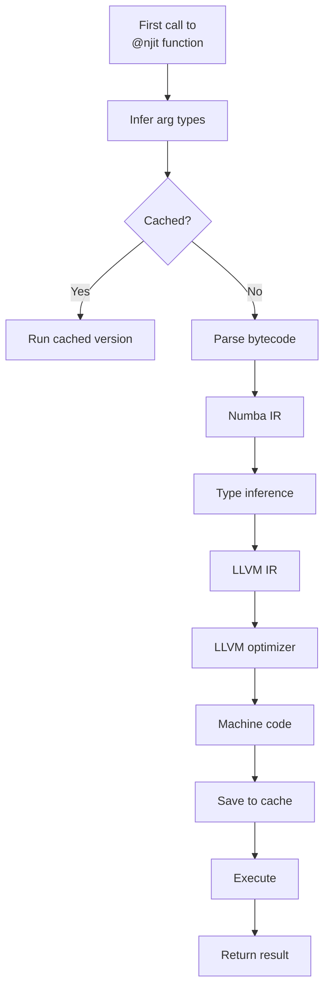
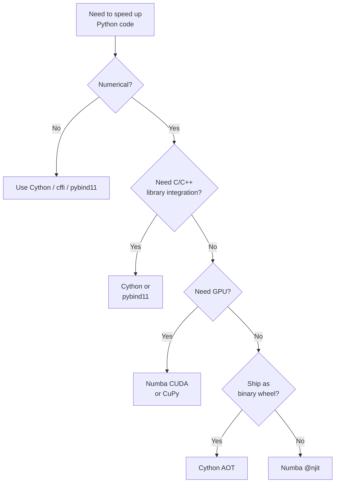

# 4. Numba

> [!note] Why this note exists
> [[3. Cython]] speeds up Python by compiling it ahead-of-time to C. **Numba** takes a different approach: it uses a **just-in-time (JIT) compiler** to translate Python functions to optimized machine code at runtime, with no separate build step and no `.pyx` files. For numerical code, Numba often matches Cython's performance with much less ceremony. This note covers `@jit` / `@njit`, NumPy integration, `@vectorize`, `@guvectorize`, CUDA support, and when Numba beats Cython (and vice versa). After this note you'll be able to drop `@njit` on a slow function and get a 100× speedup.

## Why It Matters

Numba is the **fastest path** from slow Python to fast code, when your code is numerical:
- Add one decorator: `@njit`.
- No C compiler needed by the user (Numba ships with LLVM).
- No `.pyx` files, no `setup.py`, no build step.
- Often 50–500× faster than pure Python for tight numerical loops.

Numba is the JIT of choice for:
- **Numerical computing** — scientific simulations, signal processing, statistics.
- **NumPy-heavy code** — Numba understands NumPy arrays natively.
- **CUDA kernels** — write GPU kernels in Python syntax.
- **Pandas internals** — pandas uses Numba for some operations.
- **Datashader, Dask-ml, scikit-learn (some)** — performance-critical numerical code.

If your hot path is `for i in range(N): compute(arr[i])` with NumPy arrays, Numba is usually the right answer.

## Background

### JIT vs AOT

- **Ahead-of-time (AOT) compilation** — Cython's approach. Compile the code once (at build time); ship the binary. Users get fast code with no compilation overhead at install time.
- **Just-in-time (JIT) compilation** — Numba's approach. The function is compiled the first time it's called. Subsequent calls use the cached compiled version.

JIT trade-offs:
- **Pro**: No build step; the user's Python code IS the optimized code.
- **Pro**: Can specialize to the actual argument types at runtime (e.g., `int64` vs `float64` get separate compilations).
- **Con**: First call is slow (compilation time, seconds).
- **Con**: Limited Python subset — Numba can't compile arbitrary Python.

### Numba's architecture

```mermaid
flowchart LR
    PyFunc[Python function] --> Decorator[@njit]
    Decorator --> Compile[LLVM-based compiler]
    Compile --> BC[LLVM bytecode]
    BC --> Machine[x86/ARM machine code]
    Machine --> Cache[In-memory cache]
    Cache --> Call[Subsequent calls]
    PyFunc -.->|first call| Call
```

Numba:
1. Parses the Python bytecode.
2. Infers types from the actual arguments.
3. Translates to LLVM IR (intermediate representation).
4. LLVM compiles to native machine code.
5. Caches the result; future calls with the same types skip compilation.

### The "Numba Python subset"

Numba supports a subset of Python:
- Numerical types (int, float, complex).
- NumPy arrays and operations.
- Tuples, lists (typed), dicts (in recent versions).
- `if`/`for`/`while`/`with` blocks.
- Many builtins (`len`, `range`, `abs`, `min`, `max`, `sum`, etc.).
- User-defined functions and classes (limited).

What it doesn't support:
- Arbitrary Python objects (strings are partially supported).
- Most third-party libraries (no `requests`, no `pandas` inside `@njit`).
- Dynamic features (`eval`, `exec`, metaclass tricks).
- Some NumPy features (constantly improving; check the docs).

If a function uses unsupported features, `@njit` raises an error at compile time.

## Main content

### `@jit` vs `@njit`

```python
from numba import jit, njit

# Old style:
@jit(nopython=True)
def f(x):
    return x * 2

# New style (recommended):
@njit
def f(x):
    return x * 2
```

- `@jit` — Numba's original decorator. Defaults to "object mode" (falls back to Python if compilation fails). Slow.
- `@jit(nopython=True)` — forces "nopython mode" — pure compiled code, no Python objects. Fast.
- `@njit` — shorthand for `@jit(nopython=True)`. Always use this.

If your code can't compile in nopython mode, `@njit` raises an error. This is what you want — silent fallback to slow Python is a footgun.

### Basic usage

```python
import numpy as np
from numba import njit

@njit
def sum_squares(arr):
    total = 0.0
    for i in range(arr.shape[0]):
        total += arr[i] ** 2
    return total

arr = np.random.rand(10_000_000)
print(sum_squares(arr))   # First call: ~1s (includes compilation)
print(sum_squares(arr))   # Subsequent: ~10ms (cached)
```

The first call compiles; subsequent calls use the cached version. The compiled function runs at near-C speed.

### Type specialization

Numba compiles a separate version for each argument type combination:

```python
@njit
def add(a, b):
    return a + b

add(1, 2)           # compiles int64 + int64
add(1.0, 2.0)       # compiles float64 + float64 (separate version)
add(np.array([1]), np.array([2]))  # compiles array + array
```

Each combination is cached, so:
- First call to each combination: slow (compilation).
- Subsequent calls: fast.

To see what's been compiled:
```python
add.signatures   # [(int64, int64), (float64, float64), ...]
```

### NumPy integration

Numba understands NumPy arrays natively. Indexing, slicing, broadcasting, ufuncs — all compile to efficient C:

```python
@njit
def normalize(arr):
    min_val = arr.min()
    max_val = arr.max()
    return (arr - min_val) / (max_val - min_val)

arr = np.random.rand(1000)
normalized = normalize(arr)
```

For operations on the whole array, NumPy's built-in ufuncs are usually as fast as Numba (they're already C). Numba wins on **custom loops** that NumPy doesn't have a built-in for:

```python
@njit
def custom_metric(a, b):
    """Weighted Euclidean distance."""
    total = 0.0
    for i in range(a.shape[0]):
        diff = a[i] - b[i]
        total += (i + 1) * diff * diff
    return total ** 0.5
```

In pure Python+NumPy, this would be `np.sqrt(np.sum(np.arange(1, n+1) * (a - b) ** 2))` — multiple intermediate arrays, memory-inefficient. Numba fuses it into one pass.

### `@vectorize` — make a ufunc

NumPy ufuncs broadcast element-wise operations. `@vectorize` lets you write a ufunc in Python:

```python
from numba import vectorize
import numpy as np

@vectorize(['float64(float64, float64)'])
def add(x, y):
    return x + y

a = np.array([1, 2, 3])
b = np.array([4, 5, 6])
print(add(a, b))   # [5. 7. 9.] — broadcasts like np.add
```

The string `'float64(float64, float64)'` is the type signature. The result is a real NumPy ufunc — usable with `out=`, `where=`, broadcasting, accumulation, etc.

Multiple signatures:
```python
@vectorize([
    'int64(int64, int64)',
    'float64(float64, float64)',
    'complex128(complex128, complex128)',
])
def add(x, y):
    return x + y
```

### `@guvectorize` — generalized ufuncs

For functions that operate on sub-arrays (e.g., a sliding window):

```python
from numba import guvectorize
import numpy as np

@guvectorize(['void(float64[:], float64[:])'], '(n)->(n)')
def double_in_place(arr, out):
    for i in range(arr.shape[0]):
        out[i] = arr[i] * 2

arr = np.arange(12).reshape(3, 4)
result = np.zeros_like(arr)
double_in_place(arr, result)
# Each row of `arr` is doubled and written to `result`
```

The signature `'(n)->(n)'` says: input is a 1D array of length n, output is a 1D array of length n. NumPy applies this to each 1D slice of the input. Used in scikit-learn and astropy for sliding-window computations.

### Parallel execution with `parallel=True`

```python
from numba import njit, prange

@njit(parallel=True)
def parallel_sum(arr):
    total = 0.0
    for i in prange(arr.shape[0]):
        total += arr[i]
    return total

arr = np.random.rand(10_000_000)
print(parallel_sum(arr))
```

`parallel=True` enables Numba's auto-parallelizer. `prange` is `range` that's explicitly parallelizable — Numba distributes iterations across cores.

Caveats:
- Not all loops can be parallelized (data dependencies).
- The compiler detects reductions (sum, min, max) automatically.
- Overhead for small arrays makes parallel slower than serial.

### `nogil=True` — release the GIL

```python
@njit(nogil=True)
def heavy_computation(arr):
    ...

# Now you can run multiple instances in threads:
import threading
threads = [threading.Thread(target=heavy_computation, args=(arr,)) for _ in range(4)]
for t in threads: t.start()
for t in threads: t.join()
```

With `nogil=True`, the compiled function releases the GIL — Python threads can run it concurrently. Useful for I/O-bound work mixed with computation, or for calling from async code.

### `cache=True` — persistent compilation cache

```python
@njit(cache=True)
def expensive_to_compile(data):
    ...
```

Compilation results are cached to disk (in `__pycache__`). Subsequent runs of the Python program skip recompilation — first call is fast. Useful for functions that take seconds to compile.

### Ahead-of-time compilation (AOT)

Numba also supports AOT compilation (rarely needed):

```python
from numba.pycc import CC

cc = CC('my_compiled_module')
cc.verbose = True

@cc.export('add', 'f8(f8, f8)')
def add(a, b):
    return a + b

cc.compile()
```

Produces a native shared library that doesn't require Numba at runtime. Useful for shipping to environments without Numba installed.

### CUDA support

Numba can compile Python functions to CUDA kernels:

```python
from numba import cuda
import numpy as np

@cuda.jit
def add_kernel(a, b, c):
    i = cuda.grid(1)   # global thread index
    if i < c.size:
        c[i] = a[i] + b[i]

n = 10_000_000
a = np.random.rand(n)
b = np.random.rand(n)
c = np.zeros_like(a)

# Copy to GPU:
d_a = cuda.to_device(a)
d_b = cuda.to_device(b)
d_c = cuda.device_array_like(c)

# Launch kernel:
threads_per_block = 256
blocks_per_grid = (n + threads_per_block - 1) // threads_per_block
add_kernel[blocks_per_grid, threads_per_block](d_a, d_b, d_c)

# Copy back:
c = d_c.copy_to_host()
```

CUDA Numba is for NVIDIA GPUs. For AMD or general GPU compute, consider PyOpenCL or CuPy.

### Typing and signatures

You can specify a signature explicitly to skip type inference:

```python
@njit('float64(float64[:], float64[:])')
def dot(a, b):
    s = 0.0
    for i in range(a.shape[0]):
        s += a[i] * b[i]
    return s
```

This:
- Skips type inference (faster compilation).
- Only allows the specified signature (calling with other types raises).
- Is the only way to use `@vectorize` and `@guvectorize`.

### Inspecting compilation

```python
@njit
def f(x):
    return x * 2

f(1)               # compiles
f.inspect_types()  # prints the inferred types and IR
f.signatures       # list of compiled signatures
f.inspect_cfg(f.signatures[0])   # control flow graph
```

`inspect_types()` is the primary debugging tool — it shows what Numba inferred for each variable.

## Mermaid: Numba JIT flow



## Mermaid: Numba vs Cython decision



## Code examples

### A performance comparison

```python
import numpy as np
import time
from numba import njit

def py_sum_squares(arr):
    total = 0.0
    for i in range(arr.shape[0]):
        total += arr[i] ** 2
    return total

@njit
def nb_sum_squares(arr):
    total = 0.0
    for i in range(arr.shape[0]):
        total += arr[i] ** 2
    return total

arr = np.random.rand(10_000_000)

# Warm up Numba:
nb_sum_squares(arr[:10])

t1 = time.perf_counter()
py_sum_squares(arr)
print(f"Pure Python: {time.perf_counter() - t1:.3f}s")

t1 = time.perf_counter()
nb_sum_squares(arr)
print(f"Numba:       {time.perf_counter() - t1:.3f}s")

# Typical results:
# Pure Python: 2.5s
# Numba:       0.012s   (~200x speedup)
```

### Mandelbrot set

```python
import numpy as np
from numba import njit

@njit
def mandelbrot(c, max_iter):
    z = 0 + 0j
    for n in range(max_iter):
        if abs(z) > 2:
            return n
        z = z * z + c
    return max_iter

@njit(parallel=True)
def mandelbrot_grid(xmin, xmax, ymin, ymax, width, height, max_iter):
    out = np.zeros((height, width), dtype=np.int32)
    for i in range(height):
        for j in range(width):
            x = xmin + (xmax - xmin) * j / (width - 1)
            y = ymin + (ymax - ymin) * i / (height - 1)
            out[i, j] = mandelbrot(complex(x, y), max_iter)
    return out

result = mandelbrot_grid(-2, 1, -1, 1, 1000, 1000, 256)
# 1M pixels in <1 second
```

### Custom NumPy ufunc

```python
import numpy as np
from numba import vectorize

@vectorize(['float64(float64, float64, float64)'])
def weighted_avg(a, b, w):
    return a * (1 - w) + b * w

a = np.array([1.0, 2.0, 3.0])
b = np.array([4.0, 5.0, 6.0])
w = 0.5

print(weighted_avg(a, b, w))   # [2.5 3.5 4.5]

# Works with broadcasting:
print(weighted_avg(a, b, np.array([0.0, 0.5, 1.0])))   # [1. 3.5 6.]
```

### Sliding window with `@guvectorize`

```python
import numpy as np
from numba import guvectorize

@guvectorize(['void(float64[:], float64[:])'], '(n)->()')
def window_mean(arr, out):
    s = 0.0
    for i in range(arr.shape[0]):
        s += arr[i]
    out[0] = s / arr.shape[0]

data = np.random.rand(1000)
# Compute 5-element sliding window means:
from numpy.lib.stride_tricks import sliding_window_view
windows = sliding_window_view(data, 5)
result = window_mean(windows)
print(result.shape)   # (996,)
```

### Threading with `nogil=True`

```python
import numpy as np
import threading
from numba import njit

@njit(nogil=True)
def heavy(arr):
    total = 0.0
    for i in range(arr.shape[0]):
        total += np.sin(arr[i]) * np.cos(arr[i])
    return total

arr = np.random.rand(10_000_000)
results = [0.0] * 4

def worker(idx):
    results[idx] = heavy(arr)

threads = [threading.Thread(target=worker, args=(i,)) for i in range(4)]
for t in threads: t.start()
for t in threads: t.join()
print(results)
```

Without `nogil=True`, the GIL would serialize the threads. With it, they run in parallel — up to 4× speedup on a 4-core machine.

## Common Pitfalls

> [!warning] First call is slow
> The first call to a `@njit` function compiles it — taking milliseconds to seconds. For production, warm up the function at startup or use `cache=True`.

> [!warning] Unsupported Python features
> `@njit` can't compile arbitrary Python. Strings, dicts (some support), custom objects, and most third-party libraries won't work. Check the supported features list.

> [!warning] Object mode silently slow
> `@jit` (without `nopython=True`) falls back to "object mode" if compilation fails — slower than pure Python. Always use `@njit` to fail loudly.

> [!warning] Type instability
> ```python
> @njit
> def f(x):
>     if x > 0:
>         return 1.0
>     else:
>         return 0   # int, not float!
> ```
> Numba may infer the return type as `float64` (from `1.0`), then struggle with the `0` (int). Be consistent: `return 0.0`.

> [!warning] Type changes trigger recompilation
> Calling `f(np.array([1,2]))` (int) and then `f(np.array([1.0, 2.0]))` (float) compiles two versions. For tight loops with varying types, normalize first.

> [!warning] `parallel=True` overhead
> For small arrays, the parallel overhead exceeds the speedup. Only enable for large arrays (typically >100K elements).

> [!warning] Recursion
> Numba supports recursion, but it's often slower than iteration (no tail-call optimization). Prefer iteration.

> [!warning] Global state
> Modifying globals from inside `@njit` doesn't work — Numba reads them at compile time and uses the value then.

> [!warning] NumPy version compatibility
> Numba pins specific NumPy versions. If you upgrade NumPy, you may need to upgrade Numba too.

> [!warning] CUDA requires NVIDIA hardware
> `numba.cuda` only works with NVIDIA GPUs. For AMD or general GPU compute, use CuPy or PyOpenCL.

## Tips and Tricks

> [!tip] Use `@njit` by default
> Skip `@jit` — `@njit` is the modern default and fails loudly if compilation isn't possible.

> [!tip] Use `cache=True` for slow-to-compile functions
> Compilation results are saved to disk; subsequent runs of the program skip recompilation.

> [!tip] Specify signatures to skip type inference
> ```python
> @njit('float64(float64[:])')
> def f(x): ...
> ```
> Faster compilation, but locks you to one type.

> [!tip] Use `@vectorize` to make ufuncs
> Custom NumPy ufuncs are first-class — usable with `out=`, `where=`, broadcasting, accumulation.

> [!tip] Profile before parallelizing
> `parallel=True` adds overhead. Use it only for large arrays where the speedup exceeds the overhead.

> [!tip] Use `nogil=True` for thread-based parallelism
> Combine with `threading` to run multiple Numba functions in parallel without the GIL.

> [!tip] Use `numba.prange` for explicit parallelism
> `prange` is `range` that Numba knows is parallelizable. Combine with `parallel=True`.

> [!tip] Inspect with `inspect_types()`
> If performance isn't what you expect, look at the inferred types. Surprise `object` types are the usual culprit.

> [!tip] Warm up at startup
> For server applications, call your `@njit` functions with sample data at startup so the first user request isn't slow.

> [!tip] Consider `numba.typed.List` and `Dict`
> Numba can't use regular Python lists/dicts inside `@njit`. Use `from numba.typed import List, Dict` for typed versions.

## Active Recall

1. What's the difference between `@jit` and `@njit`? Which should you use by default?
2. Why is the first call to a `@njit` function slow? What can you do about it?
3. What is "nopython mode"? What happens if a function can't compile in it?
4. How does Numba handle different argument types? E.g., `f(np.array([1]))` vs `f(np.array([1.0]))`.
5. What does `@vectorize` produce? How does it differ from `@njit`?
6. What's `@guvectorize` for? Give an example use case.
7. How do you parallelize a loop with Numba?
8. What does `nogil=True` do? Why is it useful?
9. What Python features are NOT supported by Numba? Give three examples.
10. When would you choose Numba over Cython? When the reverse?

## Next Steps

- [[3. Cython]] — AOT compilation alternative; choose based on workflow.
- [[1. ctypes]] and [[2. cffi]] — for calling existing C code.
- [[5. pybind11]] — for C++ bindings.
- [[15. Memory and Performance/5. Optimization Techniques]] — broader optimization strategies.
- [[15. Memory and Performance/4. cProfile and timeit]] — for finding the hot paths.
- [[15. Memory and Performance/2. Reference Counting and GC]] — Numba bypasses Python's GC for compiled code.
