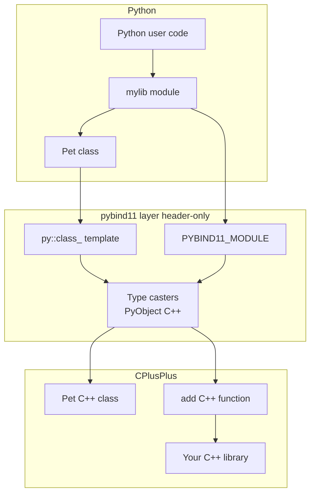
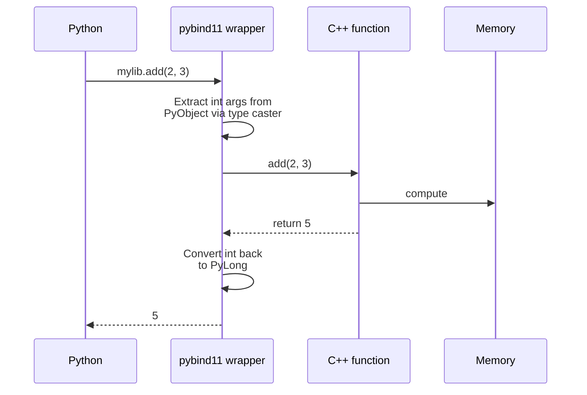

# 5. pybind11

> [!note] Why this note exists
> [[1. ctypes]] and [[2. cffi]] are for C. [[3. Cython]] is a Python superset. **pybind11** is the tool for binding **C++** to Python — it lets you expose C++ classes, functions, exceptions, and even NumPy arrays to Python with minimal boilerplate. It's a header-only library built on the CPython C API, with C++11 type-safe syntax. This note covers the binding model, class wrapping, exception translation, NumPy interop via `pybind11/numpy.h`, and how pybind11 compares to Cython and cffi. After this note you'll be able to take any C++ library and expose it to Python cleanly.

## Why It Matters

C++ has become the dominant language for high-performance computing libraries: TensorFlow, PyTorch, OpenCV, Arrow, scikit-learn (parts), xtensor, GDAL — all C++ cores with Python bindings. The quality of those bindings determines the user experience.

pybind11 is the modern choice because:
- **Header-only** — drop `pybind11.h` into your include path; no link step.
- **Type-safe** — the C++ compiler checks your bindings at build time. No runtime type errors like ctypes.
- **Concise** — expose a class in 5–10 lines vs. hundreds for raw CPython C API.
- **C++11+ features** — lambdas, smart pointers, move semantics, templates, SFINAE all work.
- **NumPy interop** — built-in support for passing arrays between C++ and Python with zero copy.
- **Exception translation** — C++ exceptions become Python exceptions automatically.
- **Cross-references C++ chapter 21** — pybind11 is the de facto standard for the kind of C++  Python interop covered there.

The main alternative, **Boost.Python**, is heavier (requires linking Boost) and older. pybind11 was created as a modern, lightweight replacement.

## Background

### The CPython C API

Python's C API lets you write C extensions directly:
```c
static PyObject *my_func(PyObject *self, PyObject *args) {
    int x;
    if (!PyArg_ParseTuple(args, "i", &x)) return NULL;
    return PyLong_FromLong(x * 2);
}
```

This is verbose and error-prone. Every argument needs manual parsing; every return needs manual conversion; every error needs manual `NULL` checks. pybind11 wraps all this in C++ templates — you write:

```cpp
m.def("my_func", [](int x) { return x * 2; });
```

The compiler generates the boilerplate.

### Header-only libraries

A "header-only" C++ library has no `.cpp` files to compile or link — you just `#include` the headers. Trade-offs:
- **Pro**: No build step for the library itself; just include and use.
- **Pro**: Templates are fully instantiated for your types.
- **Con**: Compile times are longer (every translation unit includes everything).
- **Con**: ABI compatibility is per-compiler (no pre-compiled `.so`).

For pybind11, this means: install via `pip install pybind11`, include `<pybind11/pybind11.h>`, and you're ready.

### pybind11 vs Cython vs cffi vs ctypes

| Tool       | Source language | Compiler | Type safety | NumPy interop | Best for                       |
|------------|----------------|----------|-------------|---------------|--------------------------------|
| ctypes     | (none)         | No       | Runtime     | Manual        | Quick calls to existing C libs |
| cffi       | (declarations)| Optional | Compile (API)| Manual       | Wrapping C libraries, PyPy     |
| Cython     | Python superset| Required | Compile     | Excellent     | Mixed Python/C codebases       |
| pybind11   | C++            | Required | Compile     | Built-in      | Exposing C++ to Python         |

The right tool depends on what you're integrating:
- Existing C library, no compile: ctypes (ABI) or cffi (ABI).
- Existing C library, want safety: cffi (API) or Cython.
- Existing C++ library: pybind11.
- Want to speed up Python: Cython or Numba.

## Main content

### Minimal example

`example.cpp`:
```cpp
#include <pybind11/pybind11.h>

namespace py = pybind11;

int add(int a, int b) {
    return a + b;
}

PYBIND11_MODULE(example, m) {
    m.doc() = "pybind11 example module";
    m.def("add", &add, "A function that adds two numbers");
}
```

`CMakeLists.txt` (or use `setuptools`):
```cmake
cmake_minimum_required(VERSION 3.18)
project(example)

find_package(pybind11 CONFIG REQUIRED)

pybind11_add_module(example example.cpp)
```

Build:
```bash
pip install pybind11
mkdir build && cd build
cmake .. && make
```

Use:
```python
import example
print(example.add(2, 3))   # 5
```

### Functions

```cpp
#include <pybind11/pybind11.h>

namespace py = pybind11;

int add(int a, int b) { return a + b; }
double multiply(double a, double b) { return a * b; }
void greet(const std::string& name) { /* ... */ }

PYBIND11_MODULE(mylib, m) {
    m.def("add", &add, "Add two integers");
    m.def("multiply", &multiply, "Multiply two doubles");
    m.def("greet", &greet, "Greet someone");

    // Lambda:
    m.def("square", [](int x) { return x * x; });

    // Default arguments:
    m.def("pow", [](int base, int exp) { /* ... */ },
          py::arg("base"), py::arg("exp") = 2);

    // Keyword args:
    m.def("subtract", [](int a, int b) { return a - b; },
          py::arg("a"), py::arg("b"));
}
```

Use:
```python
import mylib
mylib.add(2, 3)             # 5
mylib.pow(2)                # 4  (default exp=2)
mylib.pow(2, 10)            # 1024
mylib.pow(base=2, exp=10)   # 1024
mylib.subtract(b=3, a=10)   # 7
```

### Classes

```cpp
#include <pybind11/pybind11.h>
#include <string>

namespace py = pybind11;

class Pet {
public:
    Pet(const std::string& name) : name_(name) {}
    void setName(const std::string& name) { name_ = name; }
    const std::string& getName() const { return name_; }
private:
    std::string name_;
};

PYBIND11_MODULE(example, m) {
    py::class_<Pet>(m, "Pet")
        .def(py::init<const std::string&>())
        .def("setName", &Pet::setName)
        .def("getName", &Pet::getName);
}
```

Use:
```python
import example
p = example.Pet("Rex")
print(p.getName())   # 'Rex'
p.setName("Fido")
print(p.getName())   # 'Fido'
```

#### Properties

```cpp
py::class_<Pet>(m, "Pet")
    .def(py::init<const std::string&>())
    .def_property("name", &Pet::getName, &Pet::setName)
    .def_property_readonly("initial", [](const Pet& p) {
        return std::string(1, p.getName()[0]);
    });
```

Use:
```python
p = example.Pet("Rex")
print(p.name)      # 'Rex'
p.name = "Fido"
print(p.initial)   # 'F'
```

#### Methods and `py::overload_cast`

When a C++ class has overloaded methods, pybind11 needs to know which one:

```cpp
class Tool {
public:
    int compute(int x) { return x * 2; }
    double compute(double x) { return x * 2.0; }
};

py::class_<Tool>(m, "Tool")
    .def(py::init<>())
    .def("compute", py::overload_cast<int>(&Tool::compute), "int version")
    .def("compute", py::overload_cast<double>(&Tool::compute), "double version");
```

#### Inheritance

```cpp
class Animal {
public:
    virtual ~Animal() = default;
    virtual std::string sound() const = 0;
};

class Dog : public Animal {
public:
    std::string sound() const override { return "woof!"; }
};

py::class_<Animal>(m, "Animal");
py::class_<Dog, Animal>(m, "Dog")
    .def(py::init<>())
    .def("sound", &Dog::sound);
```

The second template argument `Animal` tells pybind11 that `Dog` inherits from `Animal`. Python sees the same hierarchy.

#### Cross-language inheritance

pybind11 supports overriding C++ virtual methods in Python:

```cpp
class PyAnimal : public Animal {
public:
    using Animal::Animal;
    std::string sound() const override {
        PYBIND11_OVERRIDE_PURE(std::string, Animal, sound);
    }
};

py::class_<Animal, PyAnimal>(m, "Animal")
    .def(py::init<>())
    .def("sound", &Animal::sound);
```

Now Python can subclass `Animal` and override `sound`:
```python
class Cat(example.Animal):
    def sound(self):
        return "meow!"

c = Cat()
print(c.sound())   # 'meow!'
```

### STL containers

```cpp
#include <pybind11/stl.h>

std::vector<int> square_all(const std::vector<int>& xs) {
    std::vector<int> result;
    for (int x : xs) result.push_back(x * x);
    return result;
}

m.def("square_all", &square_all);
```

```python
mylib.square_all([1, 2, 3, 4])   # [1, 4, 9, 16]
```

`pybind11/stl.h` enables automatic conversion between `std::vector`/`std::string`/`std::map`/etc. and Python lists/strings/dicts. There's overhead per conversion (copy), but the syntax is clean.

### Exceptions

pybind11 translates C++ exceptions automatically:
- `std::exception` → Python `Exception` (with the message).
- `std::runtime_error` → Python `RuntimeError`.
- `std::logic_error` → Python `ValueError`.
- `std::bad_alloc` → Python `MemoryError`.

Custom exceptions:

```cpp
class MyError : public std::exception {
public:
    MyError(const std::string& msg) : msg_(msg) {}
    const char* what() const noexcept override { return msg_.c_str(); }
private:
    std::string msg_;
};

PYBIND11_MODULE(mylib, m) {
    // Register the exception:
    static py::exception<MyError> exc(m, "MyError");
    py::register_exception_translator([](std::exception_ptr p) {
        try {
            if (p) std::rethrow_exception(p);
        } catch (const MyError& e) {
            PyErr_SetString(exc.ptr(), e.what());
        }
    });

    m.def("fail", []() -> void { throw MyError("oops"); });
}
```

Use:
```python
import mylib
try:
    mylib.fail()
except mylib.MyError as e:
    print(e)   # 'oops'
```

### NumPy interop via `pybind11/numpy.h`

```cpp
#include <pybind11/pybind11.h>
#include <pybind11/numpy.h>

namespace py = pybind11;

// Accept a NumPy array, return a new one:
py::array_t<double> square_array(py::array_t<double> input) {
    auto buf = input.request();
    auto result = py::array_t<double>(buf.size);
    auto result_buf = result.request();

    double *ptr_in = static_cast<double*>(buf.ptr);
    double *ptr_out = static_cast<double*>(result_buf.ptr);

    for (size_t i = 0; i < buf.size; i++) {
        ptr_out[i] = ptr_in[i] * ptr_in[i];
    }

    result.resize({buf.shape[0]});
    return result;
}

PYBIND11_MODULE(mylib, m) {
    m.def("square_array", &square_array);
}
```

Use:
```python
import numpy as np
import mylib
arr = np.array([1.0, 2.0, 3.0, 4.0])
print(mylib.square_array(arr))   # [1. 4. 9. 16.]
```

`py::array_t<T>` is the typed NumPy array wrapper. `.request()` gives you a `buffer_info` with `.ptr`, `.shape`, `.strides`, `.size` — direct memory access without copying.

#### Zero-copy with `py::array_t` and `Eigen`/`xtensor`

For matrices, you can interop with Eigen or xtensor without copies:

```cpp
#include <pybind11/eigen.h>
#include <Eigen/Dense>

Eigen::MatrixXd matmul(const Eigen::MatrixXd& A, const Eigen::MatrixXd& B) {
    return A * B;
}

m.def("matmul", &matmul);
```

```python
import numpy as np
A = np.random.rand(100, 100)
B = np.random.rand(100, 100)
C = mylib.matmul(A, B)   # No copies — Eigen views the NumPy memory
```

### Smart pointers and lifetime

pybind11 handles `std::shared_ptr`, `std::unique_ptr`, and Python reference counting automatically. When the Python wrapper is GC'd, the C++ object is destroyed (if no other C++ references exist).

```cpp
class Resource {
public:
    Resource() { std::cout << "created\n"; }
    ~Resource() { std::cout << "destroyed\n"; }
};

std::shared_ptr<Resource> create_resource() {
    return std::make_shared<Resource>();
}

m.def("create_resource", &create_resource);
```

```python
r = mylib.create_resource()
# 'created' printed
del r
# 'destroyed' printed (when GC runs)
```

### Enumerations

```cpp
enum class Color { Red, Green, Blue };

py::enum_<Color>(m, "Color")
    .value("Red", Color::Red)
    .value("Green", Color::Green)
    .value("Blue", Color::Blue)
    .export_values();
```

```python
print(mylib.Color.Red)         # Color.Red
print(mylib.Color.Red == 0)    # True (if export_values called)
```

### Building with `setuptools`

```python
# setup.py
from setuptools import setup, Extension
from pybind11.setup_helpers import Pybind11Extension, build_ext

ext_modules = [
    Pybind11Extension(
        "mylib",
        sources=["src/mylib.cpp"],
        cxx_std=17,
        extra_compile_args=["-O3"],
    ),
]

setup(
    name="mylib",
    version="0.1.0",
    ext_modules=ext_modules,
    cmdclass={"build_ext": build_ext},
)
```

Or `pyproject.toml`:
```toml
[build-system]
requires = ["setuptools>=61", "pybind11>=2.10"]
build-backend = "setuptools.build_meta"

[project]
name = "mylib"
version = "0.1.0"
```

`pip install .` builds the C++ extension and installs the Python wrapper.

### Building with CMake

For complex projects, CMake is the standard:

```cmake
cmake_minimum_required(VERSION 3.18)
project(mylib LANGUAGES CXX)

set(CMAKE_CXX_STANDARD 17)
set(CMAKE_CXX_STANDARD_REQUIRED ON)

find_package(Python COMPONENTS Interpreter Development.Module REQUIRED)
find_package(pybind11 CONFIG REQUIRED)

pybind11_add_module(mylib src/mylib.cpp)
target_link_libraries(mylib PRIVATE some_cpp_lib)
```

This handles finding Python, pybind11, and the C++ compiler. Use `scikit-build-core` as a build backend to integrate CMake with pip.

## Mermaid: pybind11 binding architecture



## Mermaid: data flow for a function call



## Code examples

### A complete C++ library with Python bindings

`matrix.h`:
```cpp
#pragma once
#include <vector>
#include <cstddef>

class Matrix {
public:
    Matrix(size_t rows, size_t cols);
    double at(size_t i, size_t j) const;
    void set(size_t i, size_t j, double value);
    Matrix multiply(const Matrix& other) const;
    size_t rows() const { return rows_; }
    size_t cols() const { return cols_; }
private:
    std::vector<double> data_;
    size_t rows_, cols_;
};
```

`matrix.cpp`:
```cpp
#include "matrix.h"

Matrix::Matrix(size_t rows, size_t cols)
    : data_(rows * cols, 0.0), rows_(rows), cols_(cols) {}

double Matrix::at(size_t i, size_t j) const {
    return data_[i * cols_ + j];
}

void Matrix::set(size_t i, size_t j, double value) {
    data_[i * cols_ + j] = value;
}

Matrix Matrix::multiply(const Matrix& other) const {
    Matrix result(rows_, other.cols_);
    for (size_t i = 0; i < rows_; i++) {
        for (size_t j = 0; j < other.cols_; j++) {
            double sum = 0;
            for (size_t k = 0; k < cols_; k++) {
                sum += at(i, k) * other.at(k, j);
            }
            result.set(i, j, sum);
        }
    }
    return result;
}
```

`bindings.cpp`:
```cpp
#include <pybind11/pybind11.h>
#include <pybind11/numpy.h>
#include "matrix.h"

namespace py = pybind11;

PYBIND11_MODULE(matrixlib, m) {
    py::class_<Matrix>(m, "Matrix")
        .def(py::init<size_t, size_t>())
        .def("at", &Matrix::at)
        .def("set", &Matrix::set)
        .def("multiply", &Matrix::multiply)
        .def_property_readonly("rows", &Matrix::rows)
        .def_property_readonly("cols", &Matrix::cols)

        // Convenience: construct from a NumPy array
        .def(py::init([](py::array_t<double> arr) {
            auto buf = arr.request();
            if (buf.ndim != 2) throw std::runtime_error("Need 2D array");
            Matrix m(buf.shape[0], buf.shape[1]);
            for (size_t i = 0; i < buf.shape[0]; i++) {
                for (size_t j = 0; j < buf.shape[1]; j++) {
                    double* ptr = static_cast<double*>(buf.ptr);
                    m.set(i, j, ptr[i * buf.shape[1] + j]);
                }
            }
            return m;
        }))
        ;
}
```

`CMakeLists.txt`:
```cmake
cmake_minimum_required(VERSION 3.18)
project(matrixlib LANGUAGES CXX)

set(CMAKE_CXX_STANDARD 17)
find_package(pybind11 CONFIG REQUIRED)

pybind11_add_module(matrixlib bindings.cpp matrix.cpp)
```

Use:
```python
import numpy as np
import matrixlib

# From dimensions:
m1 = matrixlib.Matrix(3, 3)
m1.set(0, 0, 1.0)

# From NumPy:
arr = np.eye(3)
m2 = matrixlib.Matrix(arr)

result = m1.multiply(m2)
print(result.at(0, 0))
```

### Exposing an iterator

```cpp
class Range {
public:
    Range(int start, int end) : start_(start), end_(end) {}
    class Iterator {
    public:
        Iterator(int v) : v_(v) {}
        int operator*() const { return v_; }
        Iterator& operator++() { v_++; return *this; }
        bool operator!=(const Iterator& o) const { return v_ != o.v_; }
    private:
        int v_;
    };
    Iterator begin() const { return Iterator(start_); }
    Iterator end() const { return Iterator(end_); }
private:
    int start_, end_;
};

py::class_<Range>(m, "Range")
    .def(py::init<int, int>())
    .def("__iter__", [](const Range& r) {
        return py::make_iterator(r.begin(), r.end());
    });
```

```python
for x in matrixlib.Range(0, 5):
    print(x)   # 0 1 2 3 4
```

`py::make_iterator` wraps a C++ iterator pair as a Python iterator.

### Custom type caster (advanced)

For a C++ type pybind11 doesn't know about, write a caster:

```cpp
namespace pybind11 { namespace detail {
    template <>
    struct type_caster<MyType> {
        PYBIND11_TYPE_CASTER(MyType, _("MyType"));

        // Python → C++
        bool load(handle src, bool) {
            if (!src) return false;
            // Convert Python object to MyType...
            value = MyType(...);
            return true;
        }

        // C++ → Python
        static handle cast(MyType src, return_value_policy, handle) {
            // Convert MyType to Python object...
            return py::str(src.toString()).release().ptr();
        }
    };
}}
```

This integrates `MyType` into pybind11's conversion system — used automatically when a function takes or returns it.

## Common Pitfalls

> [!warning] Missing `py::class_` template argument for inheritance
> ```cpp
> py::class_<Dog>(m, "Dog")   // WRONG — doesn't know about Animal
> ```
> Always specify the base: `py::class_<Dog, Animal>(m, "Dog")`.

> [!warning] Lifetime and dangling pointers
> If a C++ function returns a raw pointer to internal state, and the Python wrapper outlives the C++ object, you get a dangling pointer. Use `std::shared_ptr` or be careful with `return_value_policy`.

> [!warning] Copies of large arrays
> Without `py::array_t` (NumPy interop), passing a `std::vector<double>` copies the data on every call. For large arrays, use `py::array_t` with `py::capsule` for memory management.

> [!warning] GIL held by default
> pybind11 holds the GIL during C++ function calls. For long-running functions, release it:
> ```cpp
> m.def("long_running", []() {
>     py::gil_scoped_release release;
>     // C++ code here runs without the GIL
> });
> ```

> [!warning] Exception in destructors
> C++ destructors that throw are problematic. Wrap them in `try`/`catch` and log instead — don't let exceptions escape.

> [!warning] Symbol clashes with other extensions
> If your extension and another export the same symbol (rare with pybind11, but possible), the second import fails. Use anonymous namespaces or `static`.

> [!warning] Missing virtual method override trampolines
> If a C++ class has virtual methods you want Python to override, you need a "trampoline" class (like `PyAnimal` above) that calls into Python. Forgetting this means Python overrides are silently ignored.

> [!warning] Compile-time blow-up
> pybind11 is heavily templated. Large binding files can take minutes to compile. Split into multiple `.cpp` files, or use precompiled headers.

> [!warning] ABI mismatches
> If you build against Python 3.11 and run on Python 3.12, the CPython ABI has changed and your extension crashes. Build separate wheels for each Python version (or use the stable ABI, `Py_LIMITED_API`).

> [!warning] Forgetting `#include <pybind11/stl.h>`
> Without this, `std::vector`, `std::string`, etc. don't convert automatically. Add the include once per module.

## Tips and Tricks

> [!tip] Use `scikit-build-core` for CMake integration
> If your project uses CMake, `scikit-build-core` is the modern build backend that integrates pip with CMake seamlessly.

> [!tip] Release the GIL for long-running functions
> ```cpp
> m.def("compute", []() {
>     py::gil_scoped_release release;
>     /* heavy C++ code */
> });
> ```
> Other Python threads can run during your C++ work.

> [!tip] Use `py::array_t` for NumPy interop
> It's the cleanest way to pass arrays. Use `.request()` to get a `buffer_info` for direct memory access.

> [!tip] Use `py::cast` for explicit conversions
> ```cpp
> py::object obj = py::cast(my_cpp_value);
> ```
> Useful in callbacks and dynamic code.

> [!tip] Write docstrings
> ```cpp
> m.def("add", &add, "Add two integers", py::arg("a"), py::arg("b"));
> ```
> They appear in `help()` and IDE tooltips.

> [!tip] Use `py::module_::import` to access other Python modules
> ```cpp
> py::module_ np = py::module_::import("numpy");
> py::object array = np.attr("array")(py::make_tuple(1, 2, 3));
> ```

> [!tip] Ship pre-built wheels with `cibuildwheel`
> Don't make users compile. Use `cibuildwheel` in CI to build for every platform/Python combination.

> [!tip] Use `py::class_::def_property_readonly` for computed properties
> Avoids the overhead of a getter method call.

> [!tip] Test bindings with pytest
> Your binding is a Python module — test it with pytest like any other. Set up CI to build the wheel and run tests on every platform.

> [!tip] Cross-ref C++ chapter 21
> This note's pybind11 coverage complements the C++ Vault's chapter 21 (Python bindings from C++ side). The two perspectives together give the full picture.

## Active Recall

1. What makes pybind11 "header-only"? What are the trade-offs?
2. What's the `PYBIND11_MODULE` macro for? What are its arguments?
3. How do you expose a C++ class with a constructor and methods?
4. How do you handle overloaded C++ methods in pybind11?
5. How do you allow Python to override a C++ virtual method?
6. What's `py::array_t<T>` for? How does it interop with NumPy?
7. How do you release the GIL during a long-running C++ function?
8. How are C++ exceptions translated to Python? Name two automatic mappings.
9. How do you use `std::shared_ptr` with pybind11?
10. When would you choose pybind11 over Cython? Over cffi?

## Next Steps

- [[1. ctypes]] and [[2. cffi]] — C bindings, lighter weight but less type-safe.
- [[3. Cython]] — Python-superset approach; better for mixed codebases.
- [[4. Numba]] — JIT for numerical Python; no C++ needed.
- [[21. Packaging and Distribution/1. Wheels and Build Systems]] — packaging pybind11 extensions.
- [[21. Packaging and Distribution/2. Publishing Packages]] — shipping them to PyPI.
- [[16. Python Internals/5. The C API]] — the underlying C API that pybind11 wraps.
