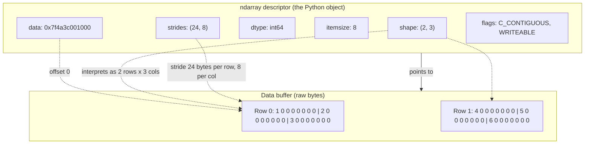
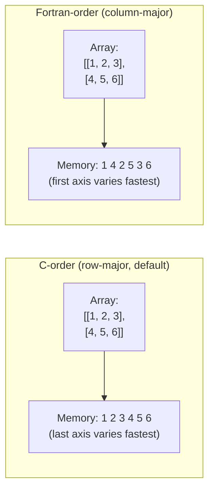

# 1. NumPy Basics

> [!note] Why this note exists
> NumPy (Numerical Python) is the foundational library for scientific computing in Python. Its core data structure, the `ndarray`, is a homogeneous n-dimensional array that ships with vectorised arithmetic, broadcasting, linear-algebra primitives, and a C-level execution engine. Every downstream data-science library — Pandas, SciPy, scikit-learn, TensorFlow, PyTorch, matplotlib — is either built on top of NumPy or mirrors its array protocol. This note covers the *anatomy* of an `ndarray`: the `dtype`, the `shape`, the `strides`, the `itemsize`, the memory layout (C-order vs Fortran-order), and a head-to-head comparison with Python lists. Understanding this anatomy is what separates "I use NumPy" from "I understand why my NumPy code is fast" — and is the prerequisite for the rest of [[23. NumPy/2. Array Creation|Chapter 23]].

## Why It Matters

Most Python code that does numerical work — statistics, machine learning, image processing, finance, simulation, physics — eventually hits NumPy. Knowing the basics lets you:

- **Reason about performance.** A vectorised NumPy operation can be 10–100× faster than the equivalent Python loop. Knowing *why* (contiguous memory, no per-element type dispatch, SIMD instructions, cache locality) lets you spot the slow patterns.
- **Choose the right `dtype`.** Picking `float32` instead of `float64` halves your memory footprint and doubles your SIMD throughput. Picking `int8` for an image channel lets the whole image fit in L2 cache. Bad dtype choices silently destroy performance.
- **Understand views vs copies.** Slicing a NumPy array returns a *view* — a window into the same memory. Modifying the view modifies the original. This is the source of half the bugs in beginner NumPy code.
- **Read other libraries.** Pandas `Series` is an `ndarray` + an `Index`. PyTorch `Tensor` mirrors the `ndarray` API. TensorFlow `Tensor` historically did too. Knowing NumPy is the universal lingua franca of array computing.
- **Avoid the "Python is slow" trap.** Python isn't slow for numerical work — *pure-Python loops* over Python `int` and `float` objects are slow. NumPy replaces that with bulk C-level operations on contiguous memory. The single biggest performance win in most Python programs is "stop looping, start vectorising."

## Background

### A brief history

- **1995:** Jim Hugunin writes `Numeric`, the first array library for Python.
- **2001:** Travis Oliphant releases `NumArray`, a rewrite that fixes some of `Numeric`'s design flaws but breaks backward compatibility.
- **2005:** Oliphant merges the two into **NumPy 1.0**, taking the best of both. This is the library we use today.
- **2008 onward:** SciPy, Pandas, scikit-learn, matplotlib all build on NumPy.
- **2020:** NEP 50 (NumPy Enhancement Proposal) — the new casting rules in NumPy 2.0.
- **2024:** NumPy 2.0 released — first major version bump in over a decade. Cleans up deprecated APIs, tightens the C API, introduces a new string dtype.

NumPy is one of the most stable APIs in the Python ecosystem. Code written for NumPy 1.4 in 2010 will mostly still run on NumPy 2.0 in 2024.

### The Python list problem

Consider summing two lists of one million floats in pure Python:

```python
a = [float(i) for i in range(1_000_000)]
b = [float(i) for i in range(1_000_000)]
c = [x + y for x, y in zip(a, b)]
```

What happens here:

1. Each `float(i)` constructs a `PyFloatObject` — a heap-allocated Python object with a reference count, a type pointer, and the actual 8-byte double. So each float costs ~24 bytes minimum, not 8.
2. The list comprehension calls `zip`, `next`, `PyNumber_Add` for each pair — each call does type dispatch, refcount manipulation, and a function call.
3. The result is *another* million `PyFloatObject` allocations.
4. None of this is cache-friendly — the float objects are scattered across the heap.

The equivalent NumPy code:

```python
import numpy as np
a = np.arange(1_000_000, dtype=np.float64)
b = np.arange(1_000_000, dtype=np.float64)
c = a + b
```

Here:

1. `a` is one contiguous 8 MB block of memory (8 bytes × 1 000 000 floats, packed back-to-back).
2. `a + b` dispatches to a single C-level loop that uses SIMD instructions to add 4 or 8 floats per CPU instruction.
3. The result is another contiguous 8 MB block.
4. Cache-friendly: the CPU prefetcher loves contiguous memory.

On a modern CPU, the NumPy version is typically 30–100× faster than the list version, and uses ~3× less memory.

## Main content

### The `ndarray` object

The `ndarray` (n-dimensional array) is NumPy's central data structure. It is:

- **Homogeneous** — every element has the same `dtype`.
- **Fixed-size** — you cannot append; you create a new array.
- **N-dimensional** — 1D, 2D, 3D, ..., N-D, all the same type.
- **Contiguous (usually)** — elements are laid out as a single memory block (with caveats — see *strides* below).

```python
import numpy as np

a = np.array([1, 2, 3, 4, 5])
print(type(a))  # <class 'numpy.ndarray'>
print(a.ndim)   # 1 (number of dimensions)
print(a.shape)  # (5,) (size along each dimension)
print(a.size)   # 5 (total number of elements)
print(a.dtype)  # int64 (on most 64-bit systems)
print(a.itemsize)  # 8 (bytes per element)
print(a.nbytes)    # 40 (total bytes = size * itemsize)
```

### Anatomy of an `ndarray`

An `ndarray` is a *descriptor* of a memory block. It does not "contain" the data — it points to it. The descriptor holds:

| Field        | Meaning                                                   | Example for `np.array([[1,2],[3,4]])` |
| ------------ | --------------------------------------------------------- | ------------------------------------- |
| `data`       | Pointer to the first byte of the data buffer              | `0x7f4a3c001000`                      |
| `dtype`      | Element type (size + interpretation)                      | `int64`                               |
| `shape`      | Tuple of sizes along each axis                            | `(2, 2)`                              |
| `strides`    | Bytes to skip to advance one step along each axis         | `(16, 8)`                             |
| `itemsize`   | Bytes per element                                         | `8`                                   |
| `flags`      | Memory layout flags (C-contiguous, F-contiguous, writable)| `C_CONTIGUOUS : True`                |

The *data buffer* is just a flat sequence of bytes. NumPy uses the `shape`, `strides`, and `dtype` to *interpret* those bytes as a multidimensional array. This is why slicing is cheap: a view is just a new descriptor pointing into the same buffer with different `shape`/`strides`.

```python
a = np.array([[1, 2, 3], [4, 5, 6]])
print(a.shape)     # (2, 3)
print(a.strides)   # (24, 8) — to move down a row, skip 24 bytes; to move right a column, skip 8 bytes
print(a.dtype)     # int64
print(a.itemsize)  # 8

# A view: same buffer, different descriptor
v = a[0, :]        # first row, all columns
print(v)           # [1 2 3]
print(v.base is a) # True — v is a view into a's buffer
```

### The `dtype` system

NumPy's `dtype` describes both the *size* and the *interpretation* of each element. Common dtypes:

| Category    | Examples                                              |
| ----------- | ----------------------------------------------------- |
| Booleans    | `bool`                                                |
| Integers    | `int8`, `int16`, `int32`, `int64`, `uint8`, `uint16`, `uint32`, `uint64` |
| Floats      | `float16`, `float32`, `float64`, `float128` (platform)|
| Complex     | `complex64`, `complex128`, `complex256`               |
| Strings     | `str_`, `bytes_`, `unicode_`                          |
| Datetime    | `datetime64`, `timedelta64`                           |
| Objects     | `object` (Python objects — slow, breaks vectorisation)|

Rules of thumb:

- **Default `int` is platform-dependent.** On most 64-bit systems, `np.array([1, 2, 3])` produces `int64`. On Windows, it was historically `int32` (this changed in NumPy 1.19+).
- **Default `float` is always `float64`.**
- **Prefer the smallest dtype that fits your data.** Image pixels are `uint8` (0–255). Audio samples are `int16` or `float32`. ML weights are usually `float32`. Don't use `float64` for things that don't need 15 significant digits.
- **`object` dtype is a code smell.** It means you have a Python list inside a NumPy array — vectorisation breaks, performance collapses. Usually you wanted Pandas.

```python
np.array([1, 2, 3]).dtype           # int64
np.array([1.0, 2.0, 3.0]).dtype     # float64
np.array([True, False]).dtype       # bool
np.array(["a", "b"]).dtype          # <U1 (one-char unicode)
np.array([1, 2, 3], dtype=np.int8)  # int8
np.array([1, 2, 3], dtype="float32")  # float32 — string alias works
```

### Promotion rules

When you mix dtypes in an operation, NumPy promotes them to a common type:

```python
np.array([1], dtype=np.int8) + np.array([1], dtype=np.int16)   # int16
np.array([1], dtype=np.int32) + np.array([1.0], dtype=np.float32)  # float64 (since NumPy 2.0)
# Note: in NumPy 1.x, this was float32. NEP 50 changed this in 2.0.
```

Read the [NEP 50 documentation](https://numpy.org/neps/nep-0050-scalar-promotion.html) for the full promotion table. The TL;DR is: **Python scalars are weak** — they adopt the array's dtype — but NumPy scalars are strong.

### Memory layout: C-order vs Fortran-order

NumPy arrays are laid out in memory in one of two orders:

- **C-order (row-major, default):** the last axis varies fastest. `a[i, j]` for a 2D array means `i` rows of `j` elements each, contiguous in memory.
- **Fortran-order (column-major):** the first axis varies fastest. `a[i, j]` means columns of `i` elements each, contiguous in memory.

```python
a = np.array([[1, 2, 3], [4, 5, 6]])
print(a.flags['C_CONTIGUOUS'])  # True
print(a.flags['F_CONTIGUOUS'])  # False

b = np.asfortranarray(a)
print(b.flags['C_CONTIGUOUS'])  # False
print(b.flags['F_CONTIGUOUS'])  # True
```

Why does this matter? **Cache locality.** If you iterate over the fast-varying axis (columns in C-order), each successive element is right next to the previous one in memory — the CPU prefetcher streams it in. If you iterate over the slow-varying axis (rows in C-order), each successive element is `stride` bytes away — the CPU may need to fetch a new cache line for every access.

```python
a = np.random.rand(10000, 10000)

# Summing column-by-column in a C-contiguous array is slow:
%timeit a.sum(axis=0)   # ~5 ms — column sums cross cache lines

# Summing row-by-row is fast:
%timeit a.sum(axis=1)   # ~2 ms — row sums are contiguous
```

The 2-3× difference here is purely memory layout.

### Comparison with Python lists

| Aspect                     | Python list                        | NumPy `ndarray`                          |
| -------------------------- | ---------------------------------- | ---------------------------------------- |
| Element types              | Heterogeneous (any Python object)  | Homogeneous (one `dtype`)                |
| Memory                     | Pointers to heap-allocated objects | Contiguous buffer of raw bytes           |
| Element size               | 8 bytes (pointer) + object overhead| `dtype.itemsize` (1–16 bytes)            |
| `a + b`                    | List concatenation                 | Element-wise addition                    |
| `a * 3`                    | Repeats the list 3 times           | Multiplies each element by 3             |
| `a[i][j]` vs `a[i, j]`     | Only `a[i][j]`                     | Both work; `a[i, j]` is faster           |
| Slicing                    | Always a shallow copy              | A *view* (shares memory)                 |
| Appending                  | `list.append` is O(1) amortised    | No `append`; you must allocate a new array|
| Vectorised math            | No                                 | Yes — fast C-level operations            |
| Best for                   | Heterogeneous data, small lists    | Large homogeneous numerical data         |

The biggest semantic gotcha: `+` and `*` mean different things!

```python
# Python list
[1, 2, 3] + [4, 5]      # [1, 2, 3, 4, 5] — concatenation
[1, 2, 3] * 2           # [1, 2, 3, 1, 2, 3] — repetition

# NumPy array
np.array([1, 2, 3]) + np.array([4, 5, 6])  # [5 7 9] — element-wise
np.array([1, 2, 3]) * 2                     # [2 4 6] — element-wise scaling
```

### The `ndarray` anatomy diagram



### C-order vs Fortran-order



### When you should *not* use NumPy

- **Heterogeneous data.** A table with strings, ints, floats, dates is better in Pandas (which uses NumPy internally per column).
- **Small arrays.** The overhead of constructing an `ndarray` is ~100 ns. For a 3-element list, pure Python wins.
- **Sparse data.** If 99% of your entries are zero, use `scipy.sparse` — a dense NumPy array will blow up memory.
- **GPU compute.** Use CuPy, PyTorch, or JAX — same API, runs on GPU.
- **Symbolic math.** Use SymPy — NumPy is for numerical work, not symbolic.

## Common Pitfalls

1. **Forgetting `+` and `*` mean different things.** `np.array([1,2,3]) + [4,5,6]` is element-wise addition (and works because of broadcasting), not concatenation. If you want concatenation, use `np.concatenate` or `np.append`.

2. **Trusting the default `int` dtype.** On Windows or some 32-bit platforms, `np.array([1, 2, 3])` may be `int32`. Always specify `dtype=np.int64` (or whatever you actually want) for cross-platform code.

3. **Surprised by integer overflow.** `np.array([200], dtype=np.int8) + np.array([100], dtype=np.int8)` wraps to `int8(-128+...)` silently — no error. Use a larger dtype or be aware.

4. **Using `object` dtype accidentally.** `np.array([1, "a", 3.0])` produces an `object` array — slow, no vectorisation. If you find yourself with `object` dtype, you probably wanted Pandas.

5. **Assuming `a.shape == (3,)` and `a.shape == (3, 1)` are the same.** The first is a 1D array of length 3; the second is a 2D column vector. They behave differently in broadcasting. Use `a[:, np.newaxis]` to add an axis.

6. **Modifying a slice modifies the original.** `b = a[0:5]; b[0] = 99` — `a[0]` is now 99. Use `a[0:5].copy()` if you need a true copy.

7. **Forgetting that scalar arithmetic doesn't always upcast.** In NumPy 1.x, `np.array([1], dtype=np.int8) + 1` stayed `int8`. In NumPy 2.0 (NEP 50), the Python scalar `1` is "weak" and adopts the array's dtype, so this still stays `int8` — surprising if you expected `int64`.

8. **Mixing `nan` with integer arrays.** NaN is a floating-point concept. `np.array([1, 2, np.nan])` silently upcasts to `float64`. Use `pd.NA` (Pandas) or `np.ma` (masked arrays) for nullable integers.

9. **Confusing `a.flags['C_CONTIGUOUS']` with `a.flags['F_CONTIGUOUS']`.** An array can be both if it's 1D or has a single element; otherwise exactly one is true (unless you explicitly created a non-contiguous view).

10. **Assuming `a.T` makes a copy.** It doesn't — it's a view with reversed strides. Modifying `a.T[0, 0]` modifies `a[0, 0]`.

11. **Forgetting that `np.array()` infers dtype from input.** `np.array([1, 2, 3.0])` is `float64` because one element is a float. If you want `int64`, pass `dtype=np.int64` explicitly.

12. **Iterating over an `ndarray` with a Python `for` loop.** `for x in big_array: ...` is slow — you lose all vectorisation. Use vectorised operations or `np.apply_along_axis` if you really need a per-element function (but prefer a ufunc).

13. **Calling `len(a)` on a multidimensional array.** `len(a)` returns `a.shape[0]` — the size of the first axis only. Use `a.size` for total elements.

14. **Assuming `bool(np.array([1, 2]))` is `True`.** It raises `ValueError: The truth value of an array with more than one element is ambiguous`. Use `a.any()` or `a.all()`.

15. **Forgetting that `np.array` copies by default.** `np.array(existing_array)` makes a copy. Use `np.asarray` to avoid the copy if the input is already an array.

16. **Treating `dtype=object` arrays like normal arrays.** Most ufuncs don't work on `object` arrays; those that do call back into Python, defeating the purpose.

17. **Believing `int64` and `np.int64` are different.** They're the same. NumPy registers its types with the `numbers` ABCs, so `isinstance(np.int64(5), numbers.Integral)` is `True`.

18. **Expecting `np.float128` to be 128-bit everywhere.** On x86-64 Linux, it's actually 80-bit extended precision padded to 16 bytes. On Windows/ARM, it may be `float64`. Don't rely on it for portable precision.

## Tips and Tricks

- **Always specify `dtype` for non-trivial arrays.** Default inference is convenient but a footgun for cross-platform code.
- **Use `np.asarray` to normalise inputs.** If a function takes "array-like" input, `arr = np.asarray(arr)` ensures you have an array without copying if one was passed.
- **Use `np.result_type` to predict the result dtype without computing.** `np.result_type(np.int8, np.float32, np.int64)` returns `float64`.
- **Check `a.flags['C_CONTIGUOUS']` before passing to external libraries.** Many C libraries require contiguous arrays; pass `np.ascontiguousarray(a)` to be safe.
- **Use `a.strides` to diagnose slow operations.** If strides look weird (e.g., `(64, 64, 8)` for a 3D array), the array is a view with a strange layout — copying it may speed things up.
- **Prefer `float32` over `float64` for ML.** Halves memory and doubles SIMD throughput; the precision loss is usually irrelevant.
- **Use `np.errstate` to control floating-point warnings.** `with np.errstate(divide='ignore'): ...` for legitimate divide-by-zero (e.g., in safe-softmax).
- **`a.view(np.uint8)` lets you reinterpret the raw bytes.** Useful for serialisation, hashing, or debugging dtype issues.
- **`a.tobytes()` and `np.frombuffer` round-trip arrays to/from bytes.** For zero-copy sharing, use the buffer protocol.
- **Use `np.shares_memory(a, b)` to check if two arrays overlap.** Critical when writing in-place ufuncs.
- **`a.base` tells you what an array is a view of.** If `a.base is None`, the array owns its memory.
- **The `ndim` of a scalar is 0.** `np.array(5).ndim == 0`. This is sometimes useful for generic code.
- **Use `np.broadcast_arrays` to align shapes explicitly** when debugging broadcasting issues.
- **For better-than-double precision, use `mpmath` or `decimal.Decimal`.** NumPy's `float128` is platform-inconsistent.
- **`np.printoptions` context manager** lets you change print formatting locally: `with np.printoptions(precision=3, suppress=True): print(a)`.
- **`np.seterr(all='raise')`** turns every floating-point warning into an exception — invaluable for debugging numerical issues.
- **Read the array interface (`__array_interface__`)** to understand what other libraries see when they consume your array.

## Active Recall

1. What does `ndarray` stand for? What are its three defining properties?
2. What is the difference between `shape`, `strides`, and `itemsize`?
3. How many bytes does `np.array([1.0, 2.0, 3.0], dtype=np.float32).nbytes` return? Why?
4. Why is a NumPy array typically 30–100× faster than a Python list for numerical work? Give three reasons.
5. What is the default `int` dtype on most modern 64-bit Linux systems? Why is this platform-dependent?
6. What does `np.array([1, 2, 3]) + np.array([4, 5, 6])` return? Contrast with the equivalent list operation.
7. What is the difference between C-order and Fortran-order memory layout? Which is NumPy's default?
8. Why does iterating over columns of a C-contiguous 2D array tend to be slower than iterating over rows?
9. What does `a.strides` tell you? Compute the strides for a `(3, 4)` `int64` C-contiguous array.
10. What is `a.base`? When is it `None`?
11. What is the difference between `np.array(a)` and `np.asarray(a)` when `a` is already an `ndarray`?
12. What is `np.result_type` for? Give an example where you'd use it.
13. What happens if you call `bool(np.array([1, 2]))`? Why?
14. Why does `np.array([1, 2, np.nan])` end up being `float64` even though the integers look like `int`?
15. What does the `flags` attribute expose? Name two flags.
16. What is `a.T`? Is it a view or a copy?
17. What is the smallest dtype you could use to store pixel values in the range 0–255?
18. What is the NEP 50 change in NumPy 2.0 about? Why does it matter?
19. When would you reach for `dtype=object`? Why is it usually a code smell?
20. How would you check whether two arrays share memory?

## Next Steps

- [[23. NumPy/2. Array Creation|2. Array Creation]] — `np.array`, `np.zeros`, `np.ones`, `np.arange`, `np.linspace`, `np.random`, and the rest of the constructor zoo.
- [[23. NumPy/3. Indexing and Slicing|3. Indexing and Slicing]] — basic, fancy, and boolean indexing; views vs copies in depth.
- [[23. NumPy/4. Universal Functions|4. Universal Functions]] — the element-wise vectorised operations that make NumPy fast.
- [[23. NumPy/5. Broadcasting|5. Broadcasting]] — how arrays of different shapes interact.
- [[23. NumPy/7. Performance and Vectorization|7. Performance and Vectorization]] — why NumPy is fast, and how to write fast NumPy code.
- [[24. Pandas/1. Pandas Basics|24. Pandas Basics]] — Pandas builds on the `ndarray`; learn the next layer up.
- [[15. Memory and Performance/5. Optimization Techniques|Optimization Techniques]] — the broader optimisation ladder NumPy sits on.
- [[22. Native Extensions/4. Numba|Numba]] — JIT compilation of NumPy-style code for further speedups.
