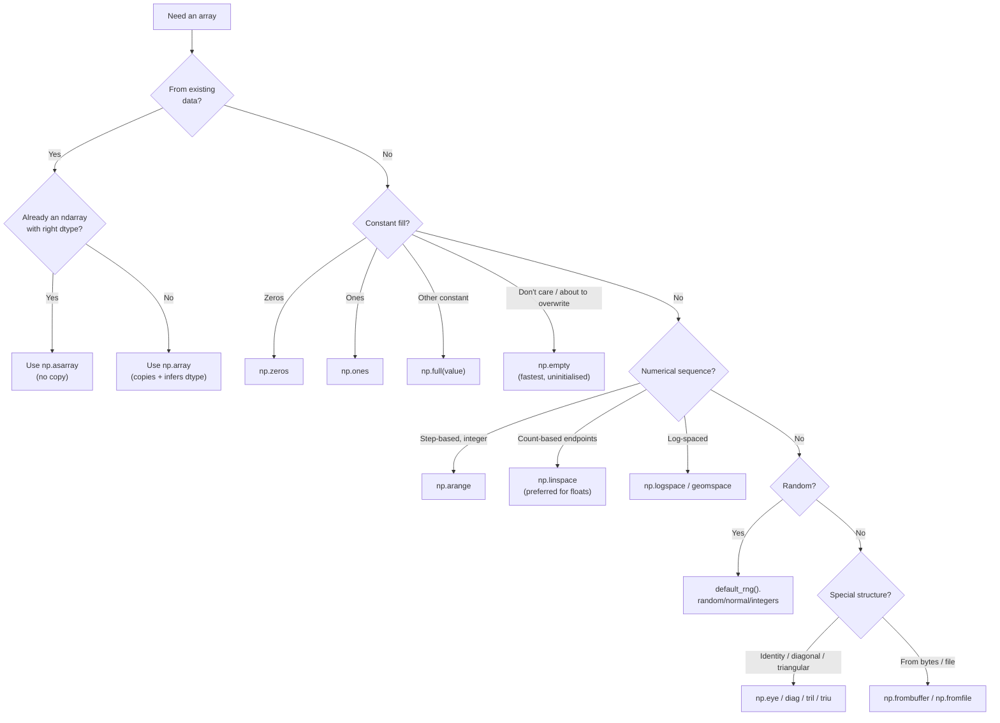

# 2. Array Creation

> [!note] Why this note exists
> NumPy offers two dozen different ways to construct an array, and picking the right one matters: some create the array in C with zero initialisation cost, some copy existing data, some generate numerical sequences, some pull from random distributions, and some read from disk. This note is a guided tour through the constructor zoo — `np.array`, `np.zeros`, `np.ones`, `np.empty`, `np.full`, `np.arange`, `np.linspace`, `np.logspace`, `np.eye`, `np.identity`, `np.diag`, the `np.random` module, and the lower-level `fromfile`/`frombuffer`/`fromfunction` family. Knowing which constructor fits a given job is the difference between code that reads naturally and code that fumbles through `np.array(list(range(...)))` for everything. Read alongside [[23. NumPy/1. NumPy Basics|1. NumPy Basics]] for the underlying anatomy.

## Why It Matters

Almost every NumPy program starts by *creating* an array. Picking the right constructor lets you:

- **Avoid hidden copies.** `np.array(some_existing_array)` copies; `np.asarray` doesn't. Use the wrong one and you've doubled your memory for no reason.
- **Get zero-initialised memory cheaply.** `np.zeros((1000, 1000), dtype=np.float32)` allocates and zeroes 4 MB in one C call. Doing it with a list comprehension and `np.array` is ~50× slower.
- **Generate sequences without loops.** `np.linspace(0, 1, 1000)` is one call. `[0 + i/999 for i in range(1000)]` is a loop with a floating-point surprise.
- **Pull from the right random distribution.** `np.random.randn` is standard normal; `np.random.rand` is uniform; `np.random.randint` is integer uniform; `np.random.choice` is sampling. Wrong function, wrong statistics.
- **Read binary data efficiently.** `np.fromfile` reads a binary blob straight into an `ndarray` with no Python loop in sight.
- **Control dtype from the start.** Every constructor accepts a `dtype` argument. Specifying it upfront is faster and clearer than casting later.

## Background

### The constructor landscape

NumPy's array constructors fall into roughly six categories:

1. **From existing data** — `np.array`, `np.asarray`, `np.ascontiguousarray`, `np.copy`.
2. **Filled with a constant** — `np.zeros`, `np.ones`, `np.full`, `np.empty` (uninitialised).
3. **Numerical sequences** — `np.arange`, `np.linspace`, `np.logspace`, `np.geomspace`.
4. **Special matrices** — `np.eye`, `np.identity`, `np.diag`, `np.tri`, `np.vander`.
5. **Random arrays** — `np.random.rand`, `randn`, `randint`, `choice`, `rand` (the new Generator API).
6. **Low-level / I/O** — `np.fromfile`, `np.frombuffer`, `np.fromfunction`, `np.fromiter`, `np.fromstring`.

Each has its niche. Master them and you'll never write `np.array([0]*1000)` again.

### The `np.array` vs `np.asarray` distinction

The most common beginner mistake is reaching for `np.array` everywhere. Here's the rule:

- `np.array(data, dtype=None, copy=True)` — **always copies** by default.
- `np.asarray(data, dtype=None)` — **copies only if necessary** (e.g., wrong dtype, or input is a list).
- `np.asanyarray(data)` — like `asarray`, but preserves subclasses (e.g., `np.matrix`).
- `np.ascontiguousarray(data)` — like `asarray`, but ensures C-contiguous memory layout.

When writing a function that accepts "array-like" input, **always start with `arr = np.asarray(arr)`**. This guarantees `arr` is an `ndarray` without forcing a copy if the caller already passed one.

## Main content

### From existing data

```python
import numpy as np

# From a list
a = np.array([1, 2, 3])

# From a nested list (2D)
b = np.array([[1, 2, 3], [4, 5, 6]])

# From a tuple (same as from a list)
c = np.array((1.0, 2.0, 3.0))

# With explicit dtype
d = np.array([1, 2, 3], dtype=np.float32)

# np.asarray — no copy if already an array
e = np.asarray(d)  # same object as d if dtype matches
e is d  # True

# np.array — forces a copy
f = np.array(d)
f is d  # False

# Copy explicitly
g = d.copy()  # or np.copy(d)
```

### Filled with a constant

```python
# Zeros — initialised to 0
z = np.zeros((3, 4))                 # float64 by default
z_int = np.zeros((3, 4), dtype=np.int32)

# Ones — initialised to 1
o = np.ones(5)
o_2d = np.ones((2, 3), dtype=np.float32)

# Full — initialised to any value
f = np.full((2, 2), 7)
f_str = np.full((3,), "hello", dtype="<U5")

# Empty — uninitialised memory!
e = np.empty((2, 2))  # contains whatever was in that memory region
# Use case: you're about to overwrite every element anyway.
# Speed: ~2-3x faster than np.zeros for large arrays (no zeroing pass).
```

> [!warning] `np.empty` returns garbage
> `np.empty` does **not** initialise the memory. You'll get whatever bytes were there before — often zeros (because the OS gives you zeroed pages), but you cannot rely on it. Always overwrite every element before reading.

### Numerical sequences

```python
# arange — like range(), but returns an array
a = np.arange(10)             # [0 1 2 3 4 5 6 7 8 9]
b = np.arange(0, 1, 0.1)      # [0.  0.1 0.2 0.3 0.4 0.5 0.6 0.7 0.8 0.9]
c = np.arange(0, 10, 2, dtype=np.float32)

# linspace — N evenly spaced points between two endpoints
lin = np.linspace(0, 1, 11)   # [0.  0.1 0.2 ... 1.0]
# Default includes endpoint. Set endpoint=False to exclude.
lin_no_end = np.linspace(0, 1, 10, endpoint=False)

# logspace — N points spaced evenly on a log scale
log = np.logspace(0, 3, 4)    # [1, 10, 100, 1000]  (= 10 ** linspace(0, 3, 4))
# Pass base=2 for binary logs:
log2 = np.logspace(0, 10, 11, base=2)  # [1, 2, 4, 8, ..., 1024]

# geomspace — N points with a constant geometric ratio
geo = np.geomspace(1, 1000, 4)  # [1, 10, 100, 1000]
```

> [!warning] Floating-point `arange` is a footgun
> `np.arange(0, 1, 0.1)` *should* produce 10 points, but due to floating-point error in the step calculation it sometimes produces 11 or 9. **Prefer `np.linspace` for floating-point sequences** — you specify the count, not the step, so there's no ambiguity.

### Special matrices

```python
# Identity matrix
I = np.eye(3)                  # 3x3 identity, float64
I_int = np.eye(3, dtype=np.int8)

# Identity (square only — same as eye but doesn't accept M, N)
I2 = np.identity(4)

# Diagonal matrix from a 1D array
D = np.diag([1, 2, 3])         # 3x3 with [1, 2, 3] on the diagonal
D_off = np.diag([1, 2], k=1)   # offset diagonal (above main)

# Extract diagonal from a 2D array
M = np.array([[1, 2, 3], [4, 5, 6], [7, 8, 9]])
d = np.diag(M)                 # [1, 5, 9]

# Upper/lower triangular
T = np.tri(3)                  # 3x3 lower triangular of ones
U = np.triu(M)                 # upper triangle of M
L = np.tril(M)                 # lower triangle of M

# Vandermonde matrix
V = np.vander([1, 2, 3], N=3)  # for polynomial fitting
# [[1 1 1]
#  [4 2 1]
#  [9 3 1]]
```

### Random arrays

NumPy has two random APIs. The legacy `np.random.*` functions use a global state; the modern `np.random.default_rng()` returns a `Generator` object with better statistical properties and is preferred for new code.

```python
# === Legacy API (uses global state) ===
np.random.seed(42)
a = np.random.rand(3, 4)            # uniform in [0, 1), shape (3, 4)
b = np.random.randn(1000)           # standard normal (mean 0, std 1)
c = np.random.randint(0, 10, size=5)  # uniform integers in [0, 10)
d = np.random.choice([1, 2, 3, 4], size=10)  # sample from array
e = np.random.uniform(0, 5, size=5) # uniform in [0, 5)
f = np.random.normal(100, 15, size=1000)  # mean=100, std=15

# === Modern API (recommended) ===
rng = np.random.default_rng(seed=42)
a = rng.random((3, 4))              # uniform in [0, 1)
b = rng.standard_normal(1000)       # standard normal
c = rng.integers(0, 10, size=5)     # note: high is EXCLUSIVE here (legacy was inclusive for high)
d = rng.choice([1, 2, 3, 4], size=10)
e = rng.uniform(0, 5, size=5)
f = rng.normal(100, 15, size=1000)

# Shuffle vs permutation
arr = np.arange(10)
rng.shuffle(arr)              # in-place shuffle
perm = rng.permutation(10)    # returns a new permuted array

# Reproducible multi-process code: each worker gets its own Generator
# via rng.spawn(n_workers) (NumPy 1.25+).
```

> [!tip] Prefer `default_rng` for new code
> The legacy `np.random.seed`/`np.random.rand` API mutates a single global state, which is unsafe in multithreaded code and produces statistically worse streams. The `Generator` API is faster, has better statistical properties (PCG64 algorithm), and is the future.

### Low-level constructors

```python
# frombuffer — interpret raw bytes as an array (zero-copy)
buf = b'\x01\x00\x00\x00\x02\x00\x00\x00\x03\x00\x00\x00'
arr = np.frombuffer(buf, dtype=np.int32)
# [1 2 3]  — note: little-endian because x86

# fromfile — read binary data from disk
# arr = np.fromfile('data.bin', dtype=np.float32)
# Note: this is platform-dependent for endianness. Use '<f4' or '>f4' for portability.

# fromfunction — call a function with coordinate indices
def f(i, j):
    return i * 10 + j
grid = np.fromfunction(f, (3, 4), dtype=int)
# [[ 0  1  2  3]
#  [10 11 12 13]
#  [20 21 22 23]]

# fromiter — consume an iterator
arr = np.fromiter((x*x for x in range(5)), dtype=np.float64, count=5)

# meshgrid — coordinate matrices from coordinate vectors
x = np.linspace(0, 1, 3)
y = np.linspace(0, 1, 2)
X, Y = np.meshgrid(x, y)
# X = [[0.  0.5 1. ]
#      [0.  0.5 1. ]]
# Y = [[0.  0.  0. ]
#      [1.  1.  1. ]]
# Use indexing='ij' for matrix-style (vs default 'xy' for plotting).
```

### Specialised constructors

```python
# np.zeros_like / ones_like / empty_like / full_like
a = np.array([[1, 2, 3], [4, 5, 6]], dtype=np.float32)
b = np.zeros_like(a)      # same shape and dtype as a, filled with zeros
c = np.ones_like(a)
d = np.empty_like(a)
e = np.full_like(a, 9)

# np.tile — repeat an array
tiled = np.tile([1, 2, 3], 4)            # [1 2 3 1 2 3 1 2 3 1 2 3]
tiled_2d = np.tile([[1, 2], [3, 4]], (2, 3))

# np.repeat — repeat each element
repeated = np.repeat([1, 2, 3], 3)       # [1 1 1 2 2 2 3 3 3]

# np.concatenate / vstack / hstack / dstack
a = np.array([1, 2, 3])
b = np.array([4, 5, 6])
c = np.concatenate([a, b])     # [1 2 3 4 5 6]
d = np.vstack([a, b])          # 2x3
e = np.hstack([a, b])          # [1 2 3 4 5 6]

# np.stack — stack along a new axis
s = np.stack([a, b], axis=0)   # 2x3, axis 0
s1 = np.stack([a, b], axis=1)  # 3x2

# np.block — assemble from nested lists of arrays
M = np.block([[np.eye(2), np.zeros((2, 2))],
              [np.ones((2, 2)), np.eye(2)]])
```

### Constructor categories diagram

```mermaid
flowchart TB
    root["np.* constructors"]

    root --> from_data["From existing data"]
    root --> filled["Filled with constant"]
    root --> sequences["Numerical sequences"]
    root --> special["Special matrices"]
    root --> random["Random arrays"]
    root --> low_level["Low-level / IO"]

    from_data --> np_array["np.array<br/>(copy by default)"]
    from_data --> np_asarray["np.asarray<br/>(copy only if needed)"]
    from_data --> np_copy["np.copy / arr.copy()"]

    filled --> np_zeros["np.zeros"]
    filled --> np_ones["np.ones"]
    filled --> np_full["np.full"]
    filled --> np_empty["np.empty<br/>(uninitialised!)"]

    sequences --> np_arange["np.arange<br/>(step-based)"]
    sequences --> np_linspace["np.linspace<br/>(count-based)"]
    sequences --> np_logspace["np.logspace / geomspace"]

    special --> np_eye["np.eye / np.identity"]
    special --> np_diag["np.diag"]
    special --> np_tril["np.tril / np.triu / np.tri"]
    special --> np_vander["np.vander"]

    random --> np_rand_legacy["Legacy: np.random.rand / randn / randint"]
    random --> np_rand_modern["Modern: default_rng().random / standard_normal / integers"]

    low_level --> np_frombuffer["np.frombuffer<br/>(zero-copy from bytes)"]
    low_level --> np_fromfile["np.fromfile<br/>(from disk)"]
    low_level --> np_fromfunction["np.fromfunction"]
    low_level --> np_fromiter["np.fromiter"]
```



### Decision flowchart



### Performance comparison: filling an array

The same operation — create an array of 1 000 000 zeros — done four ways:

```python
import numpy as np
import timeit

# Method 1: list comprehension -> np.array (slowest)
def m1():
    return np.array([0.0] * 1_000_000)

# Method 2: np.zeros (fastest — single C call)
def m2():
    return np.zeros(1_000_000)

# Method 3: np.empty then fill (no zeroing, then loop in C)
def m3():
    a = np.empty(1_000_000)
    a.fill(0.0)
    return a

# Method 4: np.full (one C call)
def m4():
    return np.full(1_000_000, 0.0)

# Typical timings (ms):
# m1: 25 ms
# m2: 0.5 ms
# m3: 1.0 ms
# m4: 0.6 ms
```

The lesson: **for large arrays, never go through Python lists**. Use the dedicated constructors.

## Common Pitfalls

1. **Using `np.array(big_list)` when you meant `np.zeros(n)`.** The list construction is ~50× slower for large arrays.

2. **Floating-point `np.arange` surprises.** `np.arange(0, 1, 0.1)` can produce 10 or 11 elements depending on floating-point rounding. Use `np.linspace(0, 1, 10, endpoint=False)` for predictable counts.

3. **`np.empty` without overwriting.** Reading from an `empty` array before writing is undefined behaviour — you'll get garbage. Always overwrite every element.

4. **Confusing `np.random.randint(0, 10)` with `rng.integers(0, 10)`.** The legacy `randint` is `[low, high)` — half-open. The modern `integers` defaults to `[low, high)` too, but accepts `endpoint=True` for `[low, high]`. Don't mix them up.

5. **Forgetting `default_rng` is per-instance.** Calling `np.random.default_rng()` with no seed gives you a non-reproducible stream. For reproducibility, *always* pass `seed=...` — and store the rng in a variable.

6. **Assuming `np.zeros((3, 4))` is `int`.** The default dtype is `float64`. Pass `dtype=np.int32` if you want integers.

7. **Modifying an array returned by `np.frombuffer`.** `np.frombuffer(buf, writable=True)` shares memory with the source bytes object. Mutating it can corrupt immutable-looking state. Treat `frombuffer` results as read-only by default.

8. **Endianness bugs with `np.fromfile`.** A file written on a little-endian x86 machine may read wrong on a big-endian system (rare today, but still — embedded). Always specify the byte order: `dtype='<f4'` (little) or `dtype='>f4'` (big).

9. **Using `np.diag` on a 2D array vs a 1D array.** Same function, two behaviours: 1D input → constructs a diagonal matrix; 2D input → extracts the diagonal. Read the input shape before assuming.

10. **Forgetting `np.eye` is float by default.** `np.eye(3).dtype` is `float64`. Pass `dtype=int` if you want an integer identity.

11. **Believing `np.asarray` never copies.** It copies if the dtype doesn't match. `np.asarray([1, 2, 3], dtype=np.float32)` copies.

12. **`np.empty_like` for uninitialised "scratch" arrays.** It's fine *if* you overwrite every element. If you only overwrite part, you'll read garbage.

13. **`np.random.seed(42)` in library code.** This mutates global state and breaks the caller's reproducibility. Always accept a `seed` or `rng` parameter instead.

14. **`np.array([[1, 2], [3, 4, 5]])` (ragged input).** In NumPy 1.x this silently created an `object` array; in NumPy 2.0 it raises `ValueError`. If you have ragged data, use a list of arrays or Pandas.

15. **Forgetting that `np.random.choice` without `replace=False` allows duplicates.** If you're sampling without replacement, set `replace=False`.

16. **Using `np.tile` when you meant `np.repeat`.** `tile([1,2,3], 2)` = `[1,2,3,1,2,3]`; `repeat([1,2,3], 2)` = `[1,1,2,2,3,3]`. Different!

17. **`np.fromfunction(f, (3, 4))` — confusing function signature.** The function receives *coordinate arrays* (broadcast 1D meshes), not scalars. `f(i, j)` is called once with 2D `i` and `j` arrays, not 12 times.

18. **Expecting `np.full((3,), "hello")` to work.** It will, but it'll truncate or pad strings to fit the dtype. Specify `dtype='<U10'` or use `object` dtype if you need variable-length strings.

## Tips and Tricks

- **`np.asarray` is the universal "make this an array" call.** Use it in function bodies to accept "array-like" input.
- **`np.zeros_like(existing)` is the cleanest way to create a scratch array matching an existing one.**
- **Use `np.empty` when you'll overwrite every element anyway** — it skips the zeroing pass.
- **For reproducible code, pass `seed=` to `default_rng` and store the `Generator`.** Never call `np.random.seed` in libraries.
- **`np.full((N,), value, dtype=...)` is clearer than `np.zeros(N) + value`** and faster.
- **`np.linspace` is preferred over `np.arange` for floating-point ranges** — no rounding surprises.
- **For coordinate grids, use `np.meshgrid(x, y, indexing='ij')`** for matrix-style indexing; `'xy'` (default) is for plotting.
- **`np.frombuffer(buf, dtype='...').reshape(shape)` is the zero-copy way to wrap binary protocols.**
- **`np.diag(arr, k=n)` for offset diagonals** — `k=1` is the superdiagonal, `k=-1` is the subdiagonal.
- **`np.eye(N, M, k=1)` makes a rectangular matrix with ones on the offset diagonal** — useful for shift operators.
- **`np.broadcast_to(arr, shape)`** lets you create a "stretched" view of an array without copying — great for memory-efficient broadcasting.
- **`np.tile(A, reps)` vs `A * reps` (for integers)** — they're not the same. `tile` repeats the array; `*` does element-wise multiplication.
- **`np.block` lets you assemble block matrices from a nested Python list of arrays.** Excellent for partitioned matrices.
- **`np.mgrid[0:3, 0:4]`** is a shorthand for `np.meshgrid(np.arange(3), np.arange(4), indexing='ij')` — useful for index grids.
- **`np.ogrid[0:3, 0:4]`** is the open (sparse) variant — returns 1D arrays that broadcast to the full grid. Memory-efficient.
- **`np.fromiter(gen, dtype=..., count=N)`** — if you know `count`, pass it; otherwise NumPy has to grow the buffer dynamically.
- **For unit tests, use `np.testing.assert_array_equal`** instead of `assert np.array_equal(a, b)`. It gives much better error messages.
- **`np.set_printoptions(precision=3, suppress=True)`** makes large arrays readable in debug output.
- **`rng.spawn(n)` (NumPy 1.25+)** gives you reproducible independent child streams for parallel workers.
- **`np.lib.stride_tricks.sliding_window_view(arr, w)`** creates a view of all sliding windows of size `w` — zero-copy, the foundation of efficient rolling-window code.

## Active Recall

1. What's the difference between `np.array(a)` and `np.asarray(a)` when `a` is already an `ndarray`?
2. When would you use `np.empty` instead of `np.zeros`? What's the safety rule?
3. Why is `np.linspace(0, 1, 10)` preferred over `np.arange(0, 1, 0.1)` for floating-point sequences?
4. What does `np.logspace(0, 3, 4, base=10)` return? Why is it useful?
5. What's the difference between `np.eye(3)` and `np.identity(3)`?
6. What does `np.diag([1, 2, 3])` return? What about `np.diag(np.array([[1,2],[3,4]]))`?
7. How do you create an upper-triangular matrix from a 2D array?
8. What's the modern way to generate random numbers in NumPy? Why prefer it over `np.random.rand`?
9. How do you make `rng = np.random.default_rng(seed=42)` reproducible across multiple processes?
10. What's the difference between `np.tile([1,2,3], 2)` and `np.repeat([1,2,3], 2)`?
11. What does `np.full((2, 2), 7, dtype=np.int8)` produce? Why specify dtype?
12. When would you use `np.frombuffer`? What's the safety concern?
13. Why is `np.fromfile('data.bin', dtype='f4')` potentially non-portable?
14. What's the function signature NumPy expects from `np.fromfunction`?
15. How would you create a 1000x1000 scratch array of `float32` matching an existing array `a`?
16. Why does `np.zeros_like(a)` copy `a`'s dtype but not its values?
17. What's the difference between `np.stack([a, b], axis=0)` and `np.vstack([a, b])` for 1D `a` and `b`?
18. How would you sample 10 unique items from `[1, 2, 3, 4, 5, 6, 7, 8, 9, 10]`?
19. What's `np.lib.stride_tricks.sliding_window_view` for? Why is it zero-copy?
20. What's wrong with calling `np.random.seed(42)` inside a library function?

## Next Steps

- [[23. NumPy/1. NumPy Basics|1. NumPy Basics]] — the anatomy of the `ndarray` you're constructing.
- [[23. NumPy/3. Indexing and Slicing|3. Indexing and Slicing]] — what you do once the array exists.
- [[23. NumPy/4. Universal Functions|4. Universal Functions]] — element-wise operations on the arrays you created.
- [[23. NumPy/7. Performance and Vectorization|7. Performance and Vectorization]] — why these constructors beat Python loops.
- [[23. NumPy/6. Linear Algebra|6. Linear Algebra]] — uses of `np.eye`, `np.diag`, `np.vander` in real linear algebra.
- [[24. Pandas/7. IO and File Formats|24. IO and File Formats]] — `np.fromfile` and `np.save`/`np.load` for persistence.
- [[24. Pandas/2. Series and DataFrame|Series and DataFrame]] — Pandas wraps `ndarray` constructors with labelled indexes.
