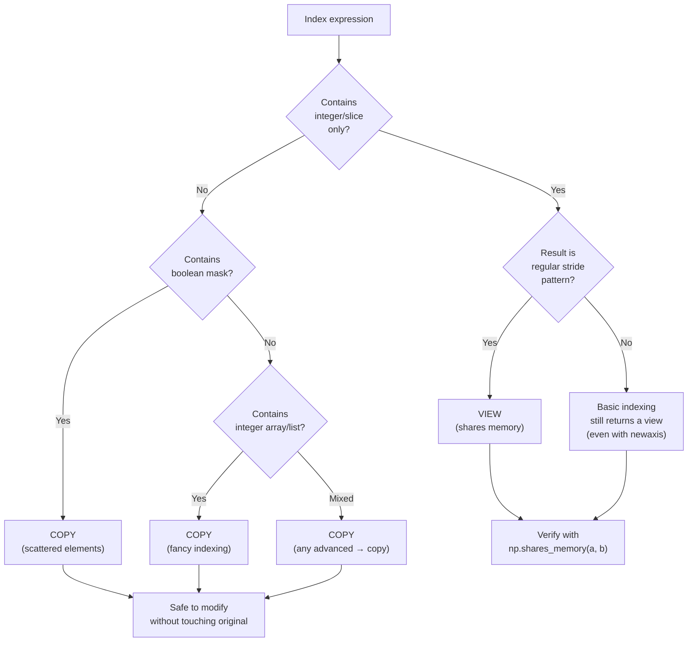
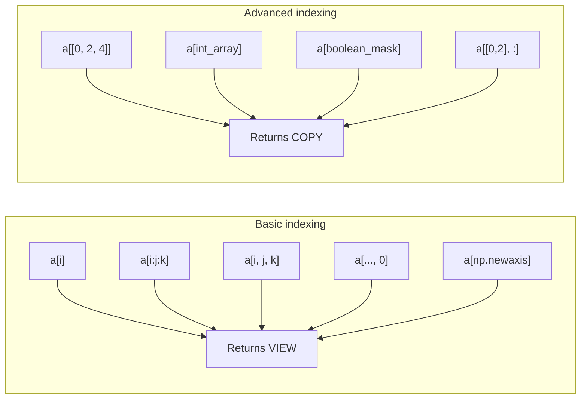

# 3. Indexing and Slicing

> [!note] Why this note exists
> Indexing is the most-used NumPy operation and the source of half its bugs. This note covers the four indexing modes — basic, multidimensional, boolean, and fancy — and the critical distinction between *views* (which share memory with the original) and *copies* (which don't). Misunderstanding that distinction is the classic NumPy footgun: you slice an array, modify the slice, and silently corrupt the original. Read alongside [[23. NumPy/1. NumPy Basics|1. NumPy Basics]] for the underlying descriptor model that makes views possible.

## Why It Matters

NumPy's indexing is more powerful than Python's, and the rules are subtle:

- **Basic indexing** (`a[i]`, `a[i:j]`, `a[i, j]`) returns a *view*. Modify the view, modify the original. This is fast (zero-copy) but surprising.
- **Fancy indexing** (`a[[0, 2, 4]]`) returns a *copy*. Modify the copy, the original is untouched. Slower (allocates), but safe.
- **Boolean indexing** (`a[a > 5]`) returns a *copy*. Same caveat.
- **Mixed indexing** (`a[[0, 2], :]` — fancy + basic) returns a *copy*. The rules are non-obvious.

Knowing which is which lets you:

- **Avoid the "I modified a slice and broke my data" bug.** Add `.copy()` when you mean it.
- **Avoid unnecessary copies.** A 10 GB array sliced to 1 GB is a view — instant. With a copy, it's a 10-second allocation.
- **Express complex queries concisely.** Boolean masks replace Python `if`-loops; fancy indexing replaces nested `for`s.
- **Reason about performance.** A view that crosses cache lines is slower than a contiguous copy. Sometimes copying first is faster.
- **Write idiomatic NumPy.** Most NumPy "code golf" wins are indexing tricks: `a[np.arange(N), idx]`, `np.ix_`, `np.take_along_axis`.

## Background

### Why NumPy indexing is non-trivial

Python lists have one indexing mode: integers (and slices, which always copy). NumPy has *four* modes, plus interactions between them. The reason is performance: NumPy wants to return views wherever possible so that slicing is O(1), but it can't always do that — when the selected elements aren't a regular stride pattern, a copy is forced.

The other reason is expressiveness. NumPy arrays are often 2D, 3D, or higher; you need multidimensional indexing. And you want to filter rows by a boolean condition, or select scattered indices — these are common data-analysis operations that pure Python can't express concisely.

### The view/copy contract

Here's the rule, in one sentence: **basic indexing returns a view; advanced (fancy or boolean) indexing returns a copy.**

```python
import numpy as np

a = np.arange(10)

# Basic: view
v = a[2:5]
v[0] = 99
print(a)  # [0 1 99 3 4 5 6 7 8 9] — a was modified!

# Fancy: copy
f = a[[0, 2, 4]]
f[0] = -1
print(a)  # [0 1 99 3 4 5 6 7 8 9] — a was NOT modified
```

When in doubt, check `np.shares_memory(a, b)` — it returns `True` if the two arrays overlap in memory.

## Main content

### Basic indexing

Basic indexing is what you get with integers and slices. It always returns a view.

```python
import numpy as np

a = np.arange(10)
a[0]        # 0 (scalar)
a[-1]       # 9 (negative indexing works)
a[2:5]      # [2 3 4] (slice)
a[:5]       # [0 1 2 3 4]
a[5:]       # [5 6 7 8 9]
a[::2]      # [0 2 4 6 8] (step)
a[::-1]     # [9 8 7 6 5 4 3 2 1 0] (reversed)
a[1:7:2]    # [1 3 5] (start, stop, step)

# Views — modifications propagate
v = a[2:5]
v[0] = 99
print(a)    # [0 1 99 3 4 5 6 7 8 9]
```

### Multidimensional indexing

For multi-dimensional arrays, separate indices with commas. The trailing axes can be omitted (they default to `:`).

```python
M = np.array([[1, 2, 3],
              [4, 5, 6],
              [7, 8, 9]])

M[0]            # [1 2 3]      — first row
M[0, :]         # [1 2 3]      — same thing
M[:, 0]         # [1 4 7]      — first column
M[1, 2]         # 6            — element at (1, 2)
M[0:2]          # [[1 2 3], [4 5 6]] — first two rows
M[0:2, 1:]      # [[2 3], [5 6]] — submatrix
M[::2, ::2]     # [[1 3], [7 9]] — every other row, every other col

# Higher dimensions
T = np.arange(24).reshape(2, 3, 4)
T[0]            # shape (3, 4) — first "slab"
T[0, 1]         # shape (4,)   — first slab, second row
T[0, 1, 2]      # scalar       — first slab, second row, third col
T[..., 0]       # shape (2, 3) — first column at the deepest axis
# ... means "all remaining axes"
```

The `...` (ellipsis) is a shorthand for "as many `:` as needed". Useful for higher-dimensional arrays.

```python
T = np.arange(24).reshape(2, 3, 4)
T[..., -1]      # shape (2, 3) — last column of each row of each slab
T[0, ..., -1]   # shape (3,)   — same but only first slab
```

### Boolean indexing

Boolean indexing selects elements where a boolean mask is `True`. It always returns a copy.

```python
a = np.array([1, 2, 3, 4, 5, 6, 7, 8, 9, 10])

# Mask must match the array's shape
mask = a > 5
print(mask)              # [False False False False False  True  True  True  True  True]
print(a[mask])           # [6 7 8 9 10]

# Equivalent shorthand
print(a[a > 5])          # [6 7 8 9 10]

# Compound conditions (use & | ~, not and or not — they don't work on arrays)
print(a[(a > 3) & (a < 8)])   # [4 5 6 7]
print(a[(a < 3) | (a > 8)])   # [1 2 9 10]
print(a[~(a > 5)])            # [1 2 3 4 5]

# Assignment via boolean mask — modifies in place
a[a > 5] = 0
print(a)  # [1 2 3 4 5 0 0 0 0 0]

# Boolean indexing on 2D
M = np.array([[1, 2, 3], [4, 5, 6], [7, 8, 9]])
M[M > 4] = 0
# M is now [[1 2 3], [4 0 0], [0 0 0]]

# Row selection by mask
rows = np.array([True, False, True])
print(M[rows])  # first and third rows

# Boolean masks from np.where and np.isnan
data = np.array([1.0, np.nan, 3.0, np.nan, 5.0])
print(data[np.isnan(data)])       # [nan nan]
print(data[~np.isnan(data)])      # [1. 3. 5.]
print(np.where(np.isnan(data), 0, data))  # [1. 0. 3. 0. 5.]
```

### Fancy indexing

Fancy indexing uses integer arrays (or lists) to select scattered indices. Always returns a copy.

```python
a = np.arange(10)

# Single-dimension fancy
a[[0, 2, 4]]              # [0 2 4]
a[[3, 1, 1, 7]]           # [3 1 1 7] — duplicates are fine
a[np.array([0, 2, 4])]    # same, with array instead of list

# Negative indices work
a[[-1, -2, -3]]           # [9 8 7]

# Multidimensional fancy indexing
M = np.array([[1, 2, 3], [4, 5, 6], [7, 8, 9]])

# Pairs of indices — selects (0,0), (1,1), (2,2) → diagonal
M[[0, 1, 2], [0, 1, 2]]   # [1 5 9]

# This is NOT a submatrix! It's element-wise pairs.
# To get a submatrix (cross product), use np.ix_:
rows = [0, 2]
cols = [1, 2]
M[np.ix_(rows, cols)]
# [[2 3]
#  [8 9]]

# Fancy indexing + slicing (mixed)
M[[0, 2], :]              # rows 0 and 2, all columns — shape (2, 3)
M[:, [0, 2]]              # all rows, cols 0 and 2 — shape (3, 2)

# Assignment via fancy indexing
a[[0, 2, 4]] = -1
# a is now [-1 1 -1 3 -1 5 6 7 8 9]

# Useful pattern: shuffle rows of a matrix
perm = np.random.permutation(M.shape[0])
M_shuffled = M[perm]
```

### `np.where`, `np.nonzero`, `np.argmax` — derived indexing tools

```python
a = np.array([1, -2, 3, -4, 5])

# np.where — indices where condition is True
indices = np.where(a > 0)        # (array([0, 2, 4]),)
a[indices]                       # [1 3 5]

# np.where with three args: ternary element-wise
np.where(a > 0, a, 0)            # [1 0 3 0 5]

# np.nonzero — indices of non-zero elements
np.nonzero(a)                    # (array([0, 1, 2, 3, 4]),) — all of them here

# np.argmax / np.argmin — index of max/min
np.argmax(a)                     # 4 (value 5)
np.argmin(a)                     # 3 (value -4)

# In 2D, argmax flattens by default — use axis=
M = np.array([[1, 2, 3], [4, 5, 6]])
np.argmax(M, axis=0)             # [1 1 1] — max in each col is row 1
np.argmax(M, axis=1)             # [2 2]    — max in each row is col 2

# np.take_along_axis — gather along an axis using index arrays
idx = np.argmax(M, axis=1, keepdims=True)
np.take_along_axis(M, idx, axis=1).ravel()  # [3 6]
```

### `np.ix_` — the cross-product helper

When you want a submatrix defined by row indices × column indices, `np.ix_` builds the open mesh:

```python
M = np.arange(12).reshape(3, 4)

# Want rows 0, 2 and cols 1, 3
# Naive: M[[0, 2], [1, 3]] gives [1, 11] — element pairs, NOT submatrix!
M[[0, 2], [1, 3]]   # array([1, 11])

# Correct: use np.ix_
M[np.ix_([0, 2], [1, 3])]
# array([[ 1,  3],
#        [ 9, 11]])
```

`np.ix_` is the bridge between "I have lists of row and column indices" and "give me the cross product".

### Slicing with steps and negative strides

```python
a = np.arange(20)

a[::2]       # [0 2 4 6 8 10 12 14 16 18] — every other
a[::-1]      # reversed
a[5:15:3]    # [5 8 11 14]
a[15:5:-1]   # [15 14 13 12 11 10 9 8 7 6] — negative step
a[::-2]      # [19 17 15 13 11 9 7 5 3 1]

# Strides: slicing lets you create views with arbitrary strides.
# Useful for downsampling, but watch out for cache-line crossings.
img = np.random.rand(512, 512, 3)
thumbnail = img[::8, ::8]  # 64x64x3 view — no copy!
```

### The view vs copy decision tree



### Indexing modes summary



### Modifying in place vs creating a new array

```python
a = np.arange(10)

# In-place modification via basic indexing (view)
a[2:5] = -1            # a is now [0 1 -1 -1 -1 5 6 7 8 9]
a[::2] *= 10           # a is now [0 1 -10 -1 -10 5 60 7 80 9]

# In-place via boolean mask
a[a < 0] = 0           # a is now [0 1 0 0 0 5 60 7 80 9]

# In-place via fancy indexing
a[[0, 1]] = 99         # a is now [99 99 0 0 0 5 60 7 80 9]

# NOT in-place: assigning a slice to a new variable creates a view, not a copy
b = a[2:5]
b[0] = 777             # modifies a[2] too!

# Force a copy when you need one
b = a[2:5].copy()
b[0] = 888             # a is unchanged
```

### Common idioms

```python
# 1. Conditional replacement (vectorised ternary)
a = np.array([1, -2, 3, -4, 5])
a = np.where(a < 0, 0, a)        # clip negatives to zero

# 2. Clip outliers
a = np.clip(a, 0, 4)              # values < 0 → 0, > 4 → 4

# 3. Top-k elements
a = np.random.rand(100)
top5 = np.sort(a)[-5:]            # the 5 largest values
top5_idx = np.argsort(a)[-5:]     # their indices

# 4. One-hot encoding
labels = np.array([0, 2, 1, 0, 2])
one_hot = np.zeros((labels.size, 3))
one_hot[np.arange(labels.size), labels] = 1
# [[1 0 0]
#  [0 0 1]
#  [0 1 0]
#  [1 0 0]
#  [0 0 1]]

# 5. Gather along an axis
M = np.arange(12).reshape(3, 4)
cols = np.array([1, 3, 0])        # one column index per row
M[np.arange(3), cols]             # [1, 7, 8]

# 6. Fancy assignment with duplicates (last write wins)
a = np.zeros(5)
a[[0, 0, 1, 1]] = [1, 2, 3, 4]    # a is [2, 4, 0, 0, 0]
# For sums instead, use np.add.at:
a = np.zeros(5)
np.add.at(a, [0, 0, 1, 1], [1, 2, 3, 4])
# a is [3, 7, 0, 0, 0]
```

## Common Pitfalls

1. **Modifying a slice modifies the original.** `b = a[2:5]; b[0] = 99` changes `a[2]`. Use `a[2:5].copy()` if you want independence.

2. **`a[[0, 2], [1, 3]]` is not a submatrix.** It returns element pairs `(0,1)` and `(2,3)`, not the cross product. Use `np.ix_` for the cross product.

3. **Using `and`/`or`/`not` on boolean arrays.** These raise `ValueError: truth value is ambiguous`. Use `&`/`|`/`~` and parenthesise: `(a > 0) & (a < 5)`.

4. **Forgetting parentheses in compound masks.** `a > 0 & a < 5` is parsed as `a > (0 & a) < 5` — bitwise `&` binds tighter than comparisons. Always parenthesise: `(a > 0) & (a < 5)`.

5. **Mixing basic and advanced indexing produces a copy.** `a[[0, 2], :]` looks like a slice, but the fancy part wins — it's a copy. Modify at your peril.

6. **Fancy indexing with duplicate indices in assignment.** `a[[0, 0, 1]] = [1, 2, 3]` doesn't sum — last write wins. Use `np.add.at(a, [0, 0, 1], [1, 2, 3])` for accumulation.

7. **Using a Python list of booleans when you meant a boolean array.** `[True, False, True]` works for fancy indexing, but `list(range(N)) > 5` doesn't — lists don't support element-wise comparison. Convert to `np.array` first.

8. **Negative strides reversing shape.** `a[::-1]` is the same array reversed — `a.shape` doesn't change. If you expected a 2D array's first axis to reverse, write `a[::-1, :]`.

9. **`np.where(condition)` vs `np.where(condition, x, y)`.** One returns indices, the other returns values. Same function, different signatures — confusing.

10. **Assigning incompatible shapes via boolean mask.** `a[a > 5] = [10, 20]` works only if exactly two elements satisfy the mask. If the count differs, you get a shape mismatch. Use `np.where(a > 5, [10, 20], a)` instead.

11. **Forgetting `axis=` in `argmax`.** `np.argmax(M)` returns the flat index of the max. Use `np.argmax(M, axis=0)` for per-column or `axis=1` for per-row.

12. **`a[1, 2]` vs `a[1][2]`.** Both work, but `a[1, 2]` is faster (single C call) and produces a view in one step. The chained `a[1][2]` creates an intermediate view.

13. **Boolean mask shape mismatch.** `M[mask]` requires `mask.shape` to match `M.shape` exactly (or be broadcastable). A 1D mask on a 2D array is interpreted as row selection, which surprises beginners.

14. **Modifying the result of `np.where(a > 0, a, 0)`.** This returns a *new* array, not a view. Modifying it doesn't change `a`.

15. **`a[None]` is `a[np.newaxis]` is `a.reshape(1, *a.shape)`.** Three ways to add a leading axis. Pick one and be consistent.

16. **Ellipsis only works once.** `a[..., 0, ...]` raises `IndexError: an index can only have a single ellipsis`. Use explicit `:` instead.

17. **`a[[0, 1, 2]]` returns a copy even if the indices happen to be contiguous.** NumPy doesn't check contiguity — it always copies for fancy indexing. Use `a[0:3]` for a view.

18. **`np.choose` is rarely what you want.** It's a confusing function for "select from multiple arrays based on indices". Use `np.take_along_axis` or direct fancy indexing instead.

## Tips and Tricks

- **Check `np.shares_memory(a, b)` if unsure whether modifying `b` will change `a`.**
- **Use `.copy()` liberally in test code.** Production code should avoid copies, but tests should be explicit.
- **`np.ix_(rows, cols)` for submatrix selection** — much clearer than the equivalent broadcasting trick.
- **`a[np.arange(N), idx]` is the canonical "one index per row" gather.** Use `np.take_along_axis(a, idx[:, None], axis=1)` for the general N-D case.
- **`np.where(cond, x, y)` replaces `if cond: x else: y`** in a vectorised way. It evaluates both branches fully — don't use it for short-circuit semantics.
- **`np.select([cond1, cond2], [val1, val2], default=val3)`** for multi-branch vectorised conditionals.
- **`np.clip(a, lo, hi)`** is shorthand for `np.minimum(np.maximum(a, lo), hi)`.
- **`np.argmax(a, axis=...)` returns the first occurrence of the max.** Use `np.argmax(a[::-1], axis=...)` and reverse if you want the last.
- **`np.argsort(a, kind='stable')`** for stable sort (preserves order of equal elements).
- **`a[..., np.newaxis]` adds a trailing axis.** Same as `a.reshape(*a.shape, 1)`.
- **`a[np.newaxis, ...]` adds a leading axis.** Same as `a.reshape(1, *a.shape)`.
- **`np.squeeze(a)` removes all length-1 axes.** `np.squeeze(a, axis=0)` removes only axis 0.
- **`a.flat` is an iterator over all elements.** `a.ravel()` returns a flat view (or copy if non-contiguous).
- **`a.nonzero()` returns a tuple of per-axis index arrays.** Useful for sparse data extraction.
- **`np.diag_indices(n)` returns the indices of the main diagonal.** `M[np.diag_indices(3)] = 0` zeros the diagonal.
- **`np.triu_indices(n, k=1)` returns upper-triangular indices** (excluding diagonal when k=1). Useful for pairwise operations.
- **For one-hot encoding, the `a[np.arange(N), labels] = 1` trick is the fastest.** Beats `np.eye(N)[labels]` and any loop.
- **`np.put_along_axis(a, idx, values, axis)`** is the in-place version of `take_along_axis`.
- **`np.choose(idx, [a, b, c])`** selects `a` where `idx==0`, `b` where `idx==1`, etc. Useful but cryptic.
- **For large fancy-index gathers, `np.take(a, idx, axis=...)` is sometimes faster than `a[idx]`** because it can use a faster memory access pattern.

## Active Recall

1. What are the four indexing modes in NumPy?
2. Which mode returns a view? Which return a copy?
3. What does `np.shares_memory(a, b)` tell you?
4. Why does `a[2:5][0] = 99` modify `a`?
5. What's the difference between `a[[0, 2], [1, 3]]` and `a[np.ix_([0, 2], [1, 3])]`?
6. Why does `a > 0 and a < 5` raise an error? What's the fix?
7. What does `np.where(a > 0)` return? What does `np.where(a > 0, x, y)` return?
8. How do you reverse an array? How about reversing only the first axis of a 2D array?
9. What does `a[..., 0]` do on a 3D array?
10. How would you select every other row and every other column of a 2D array?
11. What's the difference between `a[1, 2]` and `a[1][2]`?
12. What's `np.newaxis`? Give two equivalent ways to add a leading axis.
13. What happens when you do `a[[0, 0, 1]] = [1, 2, 3]`? How do you make it accumulate instead?
14. How would you replace all NaN values in an array with zero?
15. What does `np.argmax(M)` return for a 2D `M`? How do you get the max per column?
16. What does `np.take_along_axis` do? When is it useful?
17. How would you one-hot encode the labels `[0, 2, 1, 0]` using NumPy indexing?
18. What's the rule for ellipsis (`...`) in multidimensional indexing?
19. How can you tell if `b = a[mask]` shares memory with `a`?
20. When would you use `.copy()` explicitly on a slice?

## Next Steps

- [[23. NumPy/1. NumPy Basics|1. NumPy Basics]] — the descriptor model that makes views possible.
- [[23. NumPy/2. Array Creation|2. Array Creation]] — you have to make arrays before indexing them.
- [[23. NumPy/4. Universal Functions|4. Universal Functions]] — operations that combine with indexing.
- [[23. NumPy/5. Broadcasting|5. Broadcasting]] — the rules for combining differently-shaped arrays.
- [[23. NumPy/7. Performance and Vectorization|7. Performance and Vectorization]] — why views and vectorised indexing beat Python loops.
- [[24. Pandas/3. Indexing and Selection|24. Indexing and Selection]] — Pandas `loc`/`iloc` build on these concepts with labels.
- [[24. Pandas/4. Data Cleaning|24. Data Cleaning]] — boolean masks are the workhorse of data filtering.
