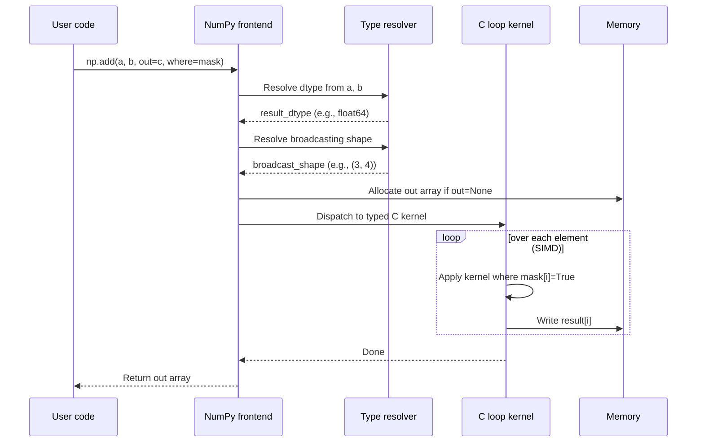

# 4. Universal Functions

> [!note] Why this note exists
> A **universal function** (`ufunc`) is a NumPy function that operates element-wise on an `ndarray`, dispatching to a tight C loop (often SIMD-vectorised) instead of per-element Python dispatch. `+`, `-`, `*`, `/`, `np.sqrt`, `np.exp`, `np.sin`, `np.greater`, `np.logical_and` — they're all ufuncs. This note covers the ufunc categories (arithmetic, mathematical, comparison, logical, trigonometric, bitwise), the `out=` parameter for zero-allocation operations, the `where=` parameter for conditional application, the `axes`/`keepdims` parameters for reductions, and how ufuncs interact with [[23. NumPy/5. Broadcasting|broadcasting]]. Mastering ufuncs is what lets you write the one-line NumPy expression that replaces a fifty-line Python loop.

## Why It Matters

Ufuncs are the engine of NumPy's speed. Knowing them well lets you:

- **Replace Python loops with one-liners.** `np.sqrt(arr)` instead of `[math.sqrt(x) for x in arr]` — 50× faster.
- **Avoid hidden allocations with `out=`.** `np.sqrt(arr, out=arr)` modifies in place; no temporary array.
- **Apply conditional logic without `if`-statements.** `np.add(a, b, where=mask)` adds only where the mask is True.
- **Reduce along specific axes.** `np.add.reduce(a, axis=0)` sums along axis 0; `np.add.accumulate(a)` is a cumulative sum.
- **Compose ufuncs fluently.** `np.exp(np.log(a) + b)` — every operator is a ufunc, every composition is one C-level pass per ufunc.
- **Write custom ufuncs** via `np.frompyfunc` or `numba.vectorize` when the standard library doesn't have what you need.

## Background

### What makes a ufunc "universal"

A ufunc is a function $f: \mathbb{R}^n \to \mathbb{R}^m$ that NumPy broadcasts element-wise over arrays. Formally, it has these properties:

1. **Element-wise** — each output element depends only on the corresponding input element(s) (after broadcasting).
2. **Type-generic** — implements the same operation for many dtypes (int8, int64, float32, float64, complex, etc.).
3. **Broadcasting-aware** — handles inputs of different shapes per the broadcasting rules.
4. **Allocates only if needed** — accepts an `out=` parameter to write into an existing array.
5. **Supports `where=`** — applies only to elements matching a boolean mask.

Under the hood, a ufunc is a C struct holding function pointers for each (input_dtype, output_dtype) combination. When you call `np.add(a, b)`, NumPy inspects `a.dtype` and `b.dtype`, picks the right C function pointer, and runs a tight loop over the elements — often using SIMD instructions to process 4 or 8 elements per CPU instruction.

### Why this matters for performance

Consider the difference:

```python
import math
import numpy as np

arr = np.random.rand(1_000_000)

# Slow: Python loop, per-element dispatch
result = [math.sqrt(x) for x in arr]              # ~200 ms

# Fast: ufunc, C loop with SIMD
result = np.sqrt(arr)                              # ~2 ms (100x faster)

# Even faster: in-place, no allocation
result = np.empty_like(arr)
np.sqrt(arr, out=result)                            # ~1.5 ms
```

The 100× speedup isn't magic — it's the absence of per-element Python overhead, plus SIMD vectorisation.

## Main content

### Arithmetic ufuncs

Every Python arithmetic operator on `ndarray` dispatches to a ufunc:

| Operator | Equivalent ufunc | Notes |
| -------- | ---------------- | ----- |
| `a + b`  | `np.add`         | Addition |
| `a - b`  | `np.subtract`    | Subtraction |
| `a * b`  | `np.multiply`    | Element-wise multiplication (NOT matrix multiplication — use `@`) |
| `a / b`  | `np.true_divide` | Always returns float, even for int inputs |
| `a // b` | `np.floor_divide`| Floor division |
| `a % b`  | `np.mod` / `np.remainder` | Modulo |
| `a ** b` | `np.power`       | Exponentiation |
| `-a`     | `np.negative`    | Unary negation |
| `+a`     | `np.positive`    | Unary plus (copy) |
| `abs(a)` | `np.abs` / `np.absolute` | Absolute value |
| `a @ b`  | `np.matmul`      | Matrix multiplication (this is NOT a ufunc — it's a gufunc) |

```python
import numpy as np

a = np.array([1, 2, 3, 4])
b = np.array([10, 20, 30, 40])

a + b       # [11 22 33 44]
np.add(a, b)  # same thing

a * b       # [10 40 90 160]  — element-wise, NOT matrix product
np.multiply(a, b)

a / b       # [0.1 0.1 0.1 0.1] — always float
a // b      # [0 0 0 0]        — floor division, int output for int inputs

a ** 2      # [1 4 9 16]
np.power(a, 2)

# In-place operators
c = a.copy()
c += b       # equivalent to np.add(c, b, out=c)
```

### Mathematical ufuncs

```python
a = np.array([1.0, 2.0, 3.0, 4.0])

# Exponentials and logarithms
np.exp(a)           # [e^1 e^2 e^3 e^4]
np.log(a)           # natural log
np.log2(a)          # base-2 log
np.log10(a)         # base-10 log
np.expm1(a)         # exp(a) - 1 — accurate for small a
np.log1p(a)         # log(1 + a) — accurate for small a

# Powers and roots
np.sqrt(a)          # square root
np.cbrt(a)          # cube root
np.square(a)        # a**2

# Rounding
np.floor(a)         # round down
np.ceil(a)          # round up
np.trunc(a)         # truncate toward zero
np.rint(a)          # round to nearest integer
np.round(a, 2)      # round to 2 decimals

# Signs
np.abs(a)           # absolute value
np.sign(a)          # -1, 0, or 1
np.negative(a)      # -a
np.positive(a)      # +a (returns a copy)
np.fabs(a)          # absolute value (always float)

# Extrema
np.maximum(a, b)    # element-wise max (NOT np.max, which is a reduction)
np.minimum(a, b)    # element-wise min
np.fmax(a, b)       # like maximum but propagates NaN differently
np.fmin(a, b)

# Misc
np.isnan(a)         # boolean: True where NaN
np.isinf(a)         # True where +inf or -inf
np.isfinite(a)      # True where finite (not NaN, not inf)
np.copysign(a, b)   # magnitudes from a, signs from b
```

> [!warning] `np.max` vs `np.maximum`
> These are easy to confuse. `np.max(a)` (or `a.max()`) is a *reduction* — returns a single scalar, the maximum of the whole array. `np.maximum(a, b)` is a *ufunc* — returns an array of the element-wise maxima. Same for `np.min` vs `np.minimum`.

### Trigonometric ufuncs

```python
x = np.linspace(0, 2 * np.pi, 100)

np.sin(x), np.cos(x), np.tan(x)
np.arcsin(x), np.arccos(x), np.arctan(x)
np.arctan2(y, x)    # 2-arg arctan — handles quadrants correctly
np.hypot(x, y)      # sqrt(x^2 + y^2) — overflow-safe
np.degrees(x)       # radians → degrees
np.radians(x)       # degrees → radians

# Hyperbolic
np.sinh(x), np.cosh(x), np.tanh(x)
np.arcsinh(x), np.arccosh(x), np.arctanh(x)
```

### Comparison ufuncs

Each Python comparison operator maps to a ufunc that returns a boolean array:

| Operator | Equivalent ufunc |
| -------- | ---------------- |
| `a == b` | `np.equal`       |
| `a != b` | `np.not_equal`   |
| `a < b`  | `np.less`        |
| `a <= b` | `np.less_equal`  |
| `a > b`  | `np.greater`     |
| `a >= b` | `np.greater_equal` |

```python
a = np.array([1, 2, 3, 4, 5])
b = np.array([5, 4, 3, 2, 1])

a < b       # [ True  True False False False]
a == b      # [False False  True False False]

# Equivalent explicit forms
np.less(a, b)
np.equal(a, b)
```

These are useful when you want to pass a comparison as a function (e.g., to `np.frompyfunc` or to compose into a pipeline).

### Logical ufuncs

Logical ufuncs combine boolean arrays:

```python
a = np.array([True, True, False, False])
b = np.array([True, False, True, False])

np.logical_and(a, b)    # [ True False False False]
np.logical_or(a, b)     # [ True  True  True False]
np.logical_xor(a, b)    # [False  True  True False]
np.logical_not(a)       # [False False  True  True]

# On non-boolean arrays, treats 0 as False, anything else as True
x = np.array([0, 1, 2, 0])
y = np.array([0, 0, 1, 1])
np.logical_and(x, y)    # [False False  True False]
```

> [!tip] Use bitwise operators on boolean arrays
> For boolean arrays, `&`, `|`, `^`, `~` are equivalent to `logical_and`, `logical_or`, `logical_xor`, `logical_not` — and they're more concise. Just remember to parenthesise: `(a > 0) & (a < 5)`.

### Bitwise ufuncs

For integer arrays, the bitwise operators are also ufuncs:

```python
a = np.array([0b1100, 0b1010], dtype=np.uint8)
b = np.array([0b1010, 0b0011], dtype=np.uint8)

a & b       # bitwise AND  -> [0b1000, 0b0010]
a | b       # bitwise OR   -> [0b1110, 0b1011]
a ^ b       # bitwise XOR  -> [0b0110, 0b1001]
~a          # bitwise NOT  -> [0b11110011, 0b11110101] (for uint8)
a << 2      # left shift
a >> 1      # right shift
```

### The `out=` parameter — zero-allocation operations

Every ufunc accepts an `out=` parameter to write the result into an existing array instead of allocating a new one.

```python
a = np.random.rand(1_000_000)
b = np.random.rand(1_000_000)

# Allocating: creates a temporary
c = np.add(a, b)             # allocates 8 MB

# In-place: no allocation
c = np.empty_like(a)
np.add(a, b, out=c)          # writes directly into c

# Even better: write into one of the inputs
np.add(a, b, out=a)          # a = a + b, no allocation

# Multiple outputs (e.g., np.modf returns fractional and integer parts)
frac = np.empty_like(a)
intp = np.empty_like(a)
np.modf(a, out=(frac, intp))
```

Use `out=` for hot loops where the allocation cost dominates. For one-off operations, the readability cost isn't worth it.

### The `where=` parameter — conditional application

```python
a = np.array([1.0, 2.0, 3.0, 4.0])
b = np.array([10.0, 20.0, 30.0, 40.0])
mask = np.array([True, False, True, False])

# Apply np.add only where mask is True.
# Unmasked positions in `out` are LEFT UNINITIALISED — supply an out= with sensible defaults.
result = np.zeros_like(a)
np.add(a, b, out=result, where=mask)
# result is [11. 0. 33. 0.]
# (positions 1 and 3 retain the value from out= — zero here)
```

> [!warning] `where=` leaves unmasked positions undefined
> When you use `where=mask`, the positions where `mask` is `False` are *not written to*. They contain whatever was in `out=` before. Always initialise `out=` to a sensible default (e.g., `np.zeros_like`) or use `np.where(mask, np.add(a, b), default)` instead.

### Reductions, accumulations, and outer products

Every binary ufunc has three derived methods:

```python
a = np.array([1, 2, 3, 4, 5])

# 1. reduce — collapse an axis to a single value
np.add.reduce(a)            # 15 (sum of all elements)
np.multiply.reduce(a)       # 120 (product of all elements)
np.add.reduce(a, axis=0)    # axis-aware reduction

# 2. accumulate — running cumulative result
np.add.accumulate(a)        # [1 3 6 10 15] (cumulative sum)
np.multiply.accumulate(a)   # [1 2 6 24 120] (cumulative product)

# 3. outer — apply f to every (a_i, b_j) pair
np.add.outer([1, 2], [10, 20, 30])
# [[11 21 31]
#  [12 22 32]]

np.multiply.outer([1, 2, 3], [10, 20])
# [[10 20]
#  [20 40]
#  [30 60]]

# 4. reduceat — segmented reduction (less common, used for histogram-like ops)
np.add.reduceat(a, [0, 2, 4])
# [1+2, 3+4, 5] = [3, 7, 5]
```

These are the primitives behind `np.sum`, `np.cumsum`, `np.cumprod`, etc. In fact, `a.sum()` is just `np.add.reduce(a)`.

### `keepdims=` for shape-preserving reductions

```python
M = np.array([[1, 2, 3], [4, 5, 6]])  # shape (2, 3)

M.sum(axis=0)         # [5 7 9] — shape (3,)
M.sum(axis=0, keepdims=True)  # [[5 7 9]] — shape (1, 3)

# Why keepdims? So the result broadcasts back against M:
row_means = M.mean(axis=1, keepdims=True)  # shape (2, 1)
M_centered = M - row_means                  # broadcasts (2,3) - (2,1) -> (2,3)
```

`keepdims=True` is essential when you want to subtract per-row means, normalise per-column, etc.

### Special functions

```python
x = np.linspace(0, 5, 10)

# Special functions (in np.special? no — these are in np directly)
np.sinh(x)              # hyperbolic sine
np.sigmoid = lambda x: 1 / (1 + np.exp(-x))  # not built-in, but trivial

# Floating-point manipulation
np.signbit(x)           # True where sign bit is set (negative)
np.copysign(1.0, x)     # 1.0 with the sign of x
np.frexp(x)             # mantissa and exponent (returns tuple)
np.ldexp(mant, exp)     # mant * 2**exp (inverse of frexp)
np.nextafter(1.0, 2.0)  # the next float after 1.0 toward 2.0

# NaN-aware reductions
a = np.array([1.0, np.nan, 3.0, np.nan, 5.0])
np.sum(a)               # nan — NaN propagates
np.nansum(a)            # 9.0 — NaN treated as zero
np.nanmean(a)           # 3.0 — NaN ignored in mean
np.nanmax(a)            # 5.0
np.nanargmax(a)         # 4 — index of max ignoring NaN
```

### Custom ufuncs

```python
# np.frompyfunc — wraps a Python function as a ufunc (slow — calls Python per element)
def my_func(x):
    return x * x + 1 if x > 0 else 0

uf = np.frompyfunc(my_func, 1, 1)  # 1 input, 1 output
uf(np.array([-1, 0, 1, 2]))  # [0, 0, 2, 5] (object dtype — slow)

# np.vectorize — similar, but with broadcasting and dtype support
vf = np.vectorize(my_func, otypes=[np.float64])
vf(np.array([-1, 0, 1, 2]))  # [0. 0. 2. 5.] (float64 — still slow)

# numba.vectorize — JIT-compiles to native code (fast)
from numba import vectorize, float64

@vectorize([float64(float64)])
def my_func_fast(x):
    return x * x + 1 if x > 0 else 0.0

my_func_fast(np.array([-1.0, 0.0, 1.0, 2.0]))  # [0. 0. 2. 5.] — fast!
```

> [!warning] `np.vectorize` is NOT vectorised
> Despite the name, `np.vectorize` is a thin wrapper around a Python loop. It gives you broadcasting semantics but no speedup. For real speed, use `numba.vectorize` or rewrite your function using existing ufuncs.

### Ufunc categories overview

```mermaid
flowchart TB
    root["np ufuncs"]

    root --> arithmetic["Arithmetic"]
    root --> math["Mathematical"]
    root --> trig["Trigonometric"]
    root --> comparison["Comparison"]
    root --> logical["Logical"]
    root --> bitwise["Bitwise"]
    root --> fp["Floating-point"]
    root --> nan_aware["NaN-aware reductions"]

    arithmetic --> add_["add, subtract, multiply,<br/>divide, floor_divide,<br/>mod, power, negative, positive"]
    math --> math_["sqrt, cbrt, square, exp, log,<br/>log2, log10, expm1, log1p,<br/>floor, ceil, trunc, rint, around"]
    trig --> trig_["sin, cos, tan, arcsin,<br/>arccos, arctan, arctan2,<br/>hypot, degrees, radians,<br/>sinh, cosh, tanh"]
    comparison --> comp_["equal, not_equal, less,<br/>less_equal, greater,<br/>greater_equal"]
    logical --> log_["logical_and, logical_or,<br/>logical_xor, logical_not"]
    bitwise --> bit_["bitwise_and, bitwise_or,<br/>bitwise_xor, invert,<br/>left_shift, right_shift"]
    fp --> fp_["isnan, isinf, isfinite,<br/>signbit, copysign,<br/>frexp, ldexp, nextafter"]
    nan_aware --> nan_["nansum, nanmean, nanstd,<br/>nanmax, nanmin, nanargmax,<br/>nanargmin, nanmedian, nanpercentile"]

    root --> methods["Methods (every binary ufunc)"]
    methods --> m_reduce["reduce (collapse axis)"]
    methods --> m_accumulate["accumulate (cumulative)"]
    methods --> m_outer["outer (cross product)"]
    methods --> m_reduceat["reduceat (segmented)"]
```



### Ufunc dispatch flow



### Composing ufuncs

Because every operator is a ufunc, complex expressions compose naturally:

```python
# Softmax: exp(x - max(x)) / sum
def softmax(x):
    x = x - x.max(axis=-1, keepdims=True)   # subtract max for stability
    e = np.exp(x)                            # ufunc
    return e / e.sum(axis=-1, keepdims=True) # ufunc + reduction

# Sigmoid: 1 / (1 + exp(-x))
def sigmoid(x):
    return 1.0 / (1.0 + np.exp(-x))

# Log-sum-exp: log(sum(exp(x))) — numerically stable
def logsumexp(x):
    m = x.max(axis=-1, keepdims=True)
    return m.squeeze(-1) + np.log(np.exp(x - m).sum(axis=-1, keepdims=True)).squeeze(-1)

# Standardise per column
def standardise(X):
    return (X - X.mean(axis=0)) / X.std(axis=0)

# ReLU activation
def relu(x):
    return np.maximum(0, x)   # ufunc, not np.max
```

Each line is one or two ufunc calls — total execution is one C pass per ufunc, with no Python interpreter overhead in the inner loop.

## Common Pitfalls

1. **Confusing `np.max` (reduction) with `np.maximum` (ufunc).** `np.max(a)` returns a scalar; `np.maximum(a, b)` returns an element-wise array.

2. **Using `+` for array concatenation.** `a + b` on NumPy arrays is element-wise addition, not concatenation. Use `np.concatenate([a, b])`.

3. **`a / b` always returns float.** `np.array([1, 2]) / np.array([2, 4])` returns `[0.5, 1.0]`, not `[0, 0]`. Use `//` for integer division.

4. **Integer overflow with `**`.** `np.array([200], dtype=np.int8) ** 2` overflows silently — `int8` can't hold 40000. Use a larger dtype.

5. **Forgetting `np.expm1` / `np.log1p` for small values.** `np.exp(x) - 1` loses precision for small `x`; `np.expm1(x)` is accurate. Same for `np.log(1 + x)` vs `np.log1p(x)`.

6. **Using `np.where` when you want `np.where=`.** `np.where(cond, x, y)` evaluates both `x` and `y` fully — no short-circuit. If `y` has a divide-by-zero, you'll get a warning even where `cond` is True. Use `np.errstate` to suppress.

7. **`out=` shape mismatch.** `np.add(a, b, out=c)` requires `c` to be broadcastable to the result shape and have the right dtype. Mismatch raises `ValueError`.

8. **`where=` without `out=` leaves garbage.** Without `out=`, NumPy allocates an array but doesn't initialise the unmasked positions. You'll get random values. Always pass `out=` with a sensible default.

9. **NaN propagates through everything.** `1.0 + np.nan` is `nan`. `np.array([1, np.nan]).sum()` is `nan`. Use `np.nansum` to ignore NaN.

10. **`&` vs `and` on boolean arrays.** `and` raises `ValueError`; `&` works but binds tighter than comparisons. Parenthesise: `(a > 0) & (a < 5)`.

11. **`np.abs` on complex numbers returns magnitude, not real part.** `np.abs(3 + 4j)` is `5.0`. Use `np.real` and `np.imag` for the components.

12. **`np.sign(0)` is `0`, not `1` or `-1`.** If you want a strictly nonzero sign, write `np.where(x == 0, 1, np.sign(x))`.

13. **`np.power(0, 0)` is `1`.** Convention from combinatorics, but it can surprise you if you expect NaN.

14. **`np.sqrt(-1)` returns `nan` and emits a warning.** If you want complex results, cast first: `np.sqrt(np.array([-1], dtype=complex))` is `[1j]`.

15. **Forgetting that `np.matmul` is NOT a ufunc.** It's a "gufunc" (generalised ufunc) — it has different broadcasting and `out=` semantics.

16. **`np.divide` vs `np.true_divide` vs `np.floor_divide`.** `np.divide` is an alias for `true_divide` (always float). `floor_divide` (`//`) preserves integer dtype.

17. **Mixing dtypes can upcast in surprising ways.** In NumPy 2.0 (NEP 50), `np.array([1], dtype=np.int32) + np.float32(1.0)` returns `float64` because NumPy scalars are "strong" — they pull arrays up to their dtype.

18. **`np.vectorize` for performance.** It's a Python loop in disguise — no SIMD, no C speed. Use `numba.vectorize` or rewrite with built-in ufuncs.

## Tips and Tricks

- **`a @ b` for matrix multiplication** (Python 3.5+). It's `np.matmul`, not `np.multiply`.
- **Use `out=` for hot loops.** Saves allocation cost — significant for arrays > 1 MB.
- **`np.maximum(a, 0)` is ReLU.** Faster than `np.where(a > 0, a, 0)`.
- **`np.logaddexp(a, b)`** computes `log(exp(a) + exp(b))` accurately. Used in log-space probability.
- **`np.hypot(x, y)`** computes `sqrt(x^2 + y^2)` without overflow — use it instead of the formula.
- **`np.arctan2(y, x)`** is the 2-argument arctan — handles all four quadrants correctly.
- **`np.degrees` / `np.radians`** are clearer than multiplying by `180 / np.pi`.
- **`np.errstate`** as a context manager: `with np.errstate(divide='ignore'): ...`.
- **`np.errstate(all='raise')`** turns every floating-point issue into an exception — great for debugging.
- **`np.seterr(over='warn')`** globally configures overflow behaviour.
- **`a.cumsum()` and `a.cumprod()`** are shorthands for `np.add.accumulate(a)` and `np.multiply.accumulate(a)`.
- **`np.diff(a)`** computes `a[1:] - a[:-1]`. Useful for time-series differences.
- **`np.ediff1d`** is a more flexible `diff` that flattens and handles edge cases.
- **`np.gradient(a)`** computes numerical gradients — useful for image processing and physics.
- **`np.trapz(y, x)`** integrates using the trapezoidal rule.
- **`np.interp(x, xp, fp)`** does linear interpolation — replaces hand-rolled `bisect` code.
- **`np.clip(a, lo, hi)`** is shorthand for `np.minimum(np.maximum(a, lo), hi)`.
- **`np.fmin` / `np.fmax`** propagate NaN differently than `np.minimum` / `np.maximum` — they ignore NaN instead of propagating it.
- **`np.isclose(a, b, rtol=1e-5, atol=1e-8)`** for floating-point equality. Use `np.allclose` for arrays.
- **`np.signbit(x)`** is faster than `x < 0` for floats (reads the sign bit directly).
- **`np.choose(idx, [arr0, arr1, arr2])`** is a vectorised switch — useful but cryptic. `np.select` is clearer for multi-condition cases.

## Active Recall

1. What's a ufunc? Name three properties that distinguish it from a regular function.
2. What's the ufunc equivalent of `a + b`? Of `a ** 2`? Of `a // b`?
3. What's the difference between `np.max(a)` and `np.maximum(a, b)`?
4. What does `np.add.reduce(a)` do? What's the more common spelling?
5. What does `np.add.accumulate(a)` do? What's the more common spelling?
6. What does `np.add.outer([1, 2], [10, 20, 30])` return?
7. What does the `out=` parameter do? When would you use it?
8. What does the `where=` parameter do? What's the gotcha when you don't pass `out=`?
9. How do you compute the element-wise max of two arrays? Element-wise min?
10. How do you compute the cumulative sum? Cumulative product?
11. What does `keepdims=True` do? When is it useful?
12. How do you sum an array that contains NaN? What about mean?
13. What's the difference between `np.divide` and `np.floor_divide`?
14. Why is `np.expm1(x)` preferred over `np.exp(x) - 1` for small `x`?
15. What's the canonical way to compute `sqrt(x^2 + y^2)`? Why not write the formula directly?
16. What's `np.arctan2` for? Why is it different from `np.arctan`?
17. How does the `&` operator relate to `np.logical_and`? When does it not work?
18. What's the difference between `np.vectorize` and `numba.vectorize`? Why does it matter?
19. What's the issue with `np.where(cond, x, y)` when `y` has a divide-by-zero?
20. How would you implement ReLU (max(0, x)) as a single ufunc call?

## Next Steps

- [[23. NumPy/1. NumPy Basics|1. NumPy Basics]] — the array anatomy ufuncs operate on.
- [[23. NumPy/2. Array Creation|2. Array Creation]] — creating the arrays you'll compute on.
- [[23. NumPy/3. Indexing and Slicing|3. Indexing and Slicing]] — combine ufuncs with boolean masks for powerful filtering.
- [[23. NumPy/5. Broadcasting|5. Broadcasting]] — how ufuncs handle differently-shaped inputs.
- [[23. NumPy/6. Linear Algebra|6. Linear Algebra]] — `np.matmul`, `np.linalg`, and friends.
- [[23. NumPy/7. Performance and Vectorization|7. Performance and Vectorization]] — why ufuncs are fast, and how to use `np.einsum` for advanced patterns.
- [[24. Pandas/2. Series and DataFrame|Series and DataFrame]] — Pandas wraps these ufuncs with labelled indexing.
