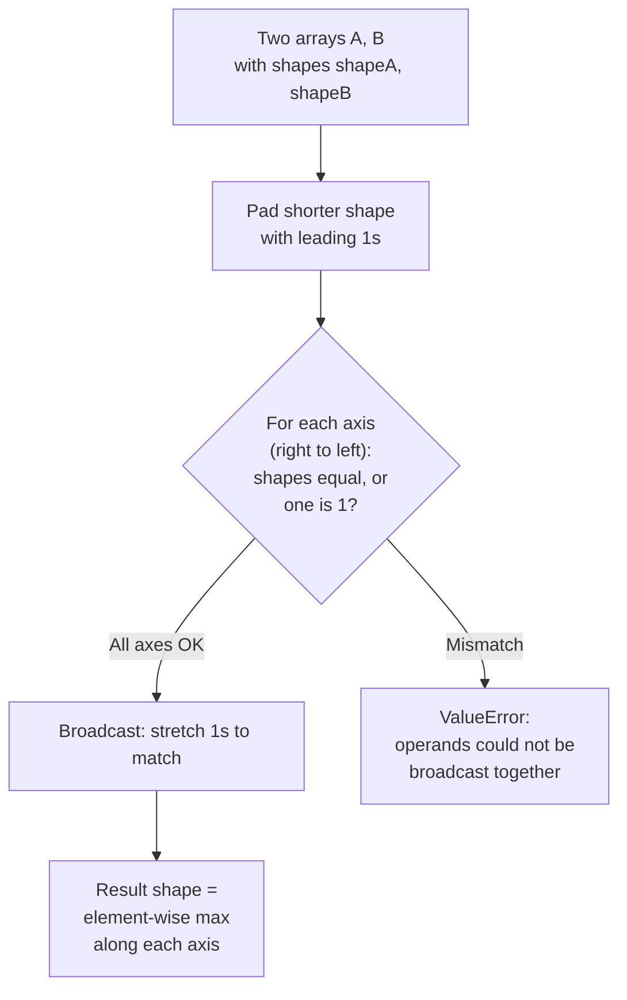
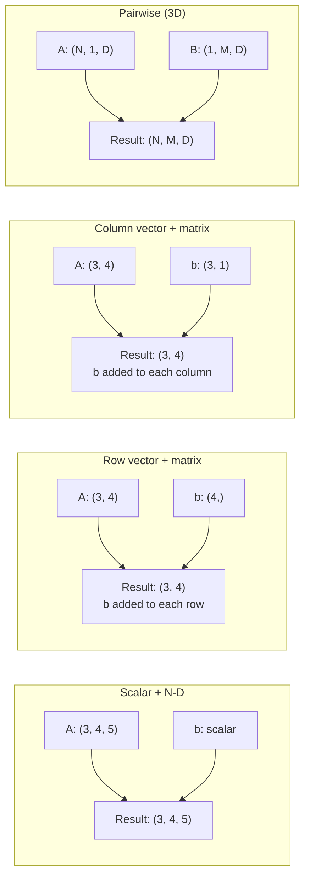

# 5. Broadcasting

> [!note] Why this note exists
> Broadcasting is the rule NumPy uses to perform element-wise operations on arrays of different shapes — without copying data to align them. With broadcasting, you can add a 1D row vector to every row of a 2D matrix, scale a 3D volume by a 2D slice, or compute pairwise distances between two sets of points, all in a single line. This note covers the broadcasting rules, the canonical patterns (scalar + array, row + matrix, column + matrix), the `np.newaxis` / `np.expand_dims` / `np.broadcast_to` helpers, and the most common pitfalls (shape mismatches, hidden copies, axis-alignment bugs). Broadcasting is the single most powerful NumPy concept — and the one most likely to silently produce wrong answers if you misread the rules.

## Why It Matters

Without broadcasting, every operation between arrays of different shapes would require an explicit `np.tile` or a Python loop. With it, you can:

- **Write vectorised code without loops.** Subtracting the mean of each row from each element is a one-liner: `X - X.mean(axis=1, keepdims=True)`.
- **Save memory.** Broadcasting doesn't copy — it produces a *virtual* view that the ufunc iterates over. A 1 KB row vector "broadcast" against a 1 GB matrix doesn't allocate 1 GB.
- **Express pairwise operations concisely.** The distance matrix between two point sets, `||a[i] - b[j]||`, is one expression: `np.linalg.norm(a[:, None, :] - b[None, :, :], axis=2)`.
- **Reason about shape.** Once you internalise the rules, you can look at `A.shape = (3, 1, 5)` and `B.shape = (2, 5)` and immediately know the result is `(3, 2, 5)`.
- **Avoid the `for`-loop trap.** Most beginner NumPy loops over axes are actually broadcast opportunities in disguise.

## Background

### The problem broadcasting solves

You have:
- `A` of shape `(3, 4)` — a 3-row, 4-column matrix.
- `b` of shape `(4,)` — a 1D vector of length 4.

You want `C[i, j] = A[i, j] + b[j]` — add `b` to every row of `A`. Without broadcasting, you'd write:

```python
C = np.empty_like(A)
for i in range(A.shape[0]):
    C[i] = A[i] + b
```

With broadcasting:

```python
C = A + b   # b is automatically broadcast to shape (3, 4)
```

NumPy notices that `A` is `(3, 4)` and `b` is `(4,)`, and "stretches" `b` along a new leading axis to make it `(3, 4)`. Crucially, this stretch is *virtual* — NumPy doesn't actually allocate a 3×4 copy of `b`. The ufunc's inner C loop knows to walk over `b`'s 4 elements three times.

### The broadcasting rules

NumPy compares the shapes of two arrays element-wise, starting from the **trailing** (right-most) dimension and moving left. Two dimensions are compatible when:

1. They are equal, **or**
2. One of them is 1.

If both conditions fail, NumPy raises `ValueError: operands could not be broadcast together`. If a dimension is 1, the array is "stretched" (broadcast) along that axis to match the other.

If one array has fewer dimensions than the other, its shape is left-padded with 1s until the ranks match.

### The rules in action

| `A.shape` | `B.shape` | Result | Why |
| --------- | --------- | ------ | --- |
| `(3, 4)`  | `(4,)`    | `(3, 4)` | `B` padded to `(1, 4)`, then stretched to `(3, 4)` |
| `(3, 4)`  | `(3, 1)`  | `(3, 4)` | `B` stretched along axis 1 |
| `(3, 4)`  | `(1, 4)`  | `(3, 4)` | `B` stretched along axis 0 |
| `(3, 4)`  | `(3, 4)`  | `(3, 4)` | equal — no broadcasting |
| `(3, 4)`  | scalar    | `(3, 4)` | scalar broadcasts to any shape |
| `(3, 4)`  | `(2,)`    | ValueError | 4 ≠ 2, incompatible |
| `(3, 4)`  | `(3,)`    | ValueError | trailing dim 4 ≠ 3, incompatible |
| `(3, 1, 5)` | `(2, 5)` | `(3, 2, 5)` | `B` padded to `(1, 2, 5)`, then both stretched |
| `(3, 4)`  | `(1, 3, 4)` | `(1, 3, 4)` then squeezed? No: `(3, 4)` is padded to `(1, 3, 4)`, then both stretched to `(1, 3, 4)`. Actually no stretching needed; result is `(1, 3, 4)`. But `A` would be stretched from `(1, 3, 4)` — wait, it's already `(3, 4)` padded to `(1, 3, 4)`, and `B` is `(1, 3, 4)`. So result is `(1, 3, 4)` (no stretching needed). |

## Main content

### The three canonical patterns

#### Pattern 1: Scalar + array

The simplest broadcast. A scalar is treated as a 0-d array and broadcasts to any shape.

```python
a = np.array([1, 2, 3, 4])
a + 10          # [11 12 13 14]
a * 2           # [2 4 6 8]
a > 2           # [False False True True]

M = np.ones((3, 4))
M * 5           # 3x4 of fives
```

#### Pattern 2: Row vector + matrix

A 1D vector of length `N` broadcasts against the *last* axis of any array.

```python
A = np.array([[1, 2, 3],
              [4, 5, 6],
              [7, 8, 9]])     # shape (3, 3)
b = np.array([10, 20, 30])    # shape (3,)

A + b
# [[11 22 33]
#  [14 25 36]
#  [17 28 39]]
# b is added to every row.

# Column-wise broadcast needs a column vector — see Pattern 3.
```

#### Pattern 3: Column vector + matrix

To broadcast along the *first* axis (down columns), you need a 2D column vector of shape `(N, 1)`:

```python
A = np.array([[1, 2, 3],
              [4, 5, 6],
              [7, 8, 9]])       # shape (3, 3)
c = np.array([[100], [200], [300]])  # shape (3, 1)

A + c
# [[101 102 103]
#  [204 205 206]
#  [307 308 309]]
# c is added to every column.

# Equivalent: use np.newaxis to add the trailing axis
c2 = np.array([100, 200, 300])[:, np.newaxis]  # shape (3, 1)
A + c2  # same result
```

### `np.newaxis` and `np.expand_dims`

`np.newaxis` (alias `None`) inserts a new axis of length 1 at the specified position. This is the standard way to convert a 1D vector into a row or column vector for broadcasting.

```python
v = np.array([1, 2, 3, 4])   # shape (4,)

v[np.newaxis, :]              # shape (1, 4) — row vector
v[:, np.newaxis]              # shape (4, 1) — column vector

# Three equivalent spellings
v[None, :]
v.reshape(1, -1)
np.expand_dims(v, axis=0)

# Adding multiple axes
v[np.newaxis, :, np.newaxis]  # shape (1, 4, 1)
```

`np.expand_dims(v, axis=...)` is the more readable alternative when you're writing library code — it's explicit about which axis is being added. `v[None]` and `v[:, None]` are idiomatic for quick scripts.

### `np.broadcast_to` — explicit stretching

If you want to *actually* create the broadcasted array (as a view, not a copy):

```python
v = np.array([1, 2, 3])    # shape (3,)
stretched = np.broadcast_to(v, (4, 3))
# array([[1, 2, 3],
#        [1, 2, 3],
#        [1, 2, 3],
#        [1, 2, 3]])
# Note: this is a VIEW with zero strides along axis 0. Modifying it is unsafe.
stretched.strides  # (0, 8) — zero stride on axis 0
```

`np.broadcast_to` is useful for:
- Debugging — see exactly what NumPy will "see" when it broadcasts.
- APIs that don't broadcast for you (rare).
- Explicit memory savings — the broadcast view uses the original array's memory.

### `np.broadcast_arrays` — align multiple arrays

To get the broadcasted views of multiple arrays at once:

```python
A = np.zeros((3, 1))
B = np.zeros((1, 4))
A_b, B_b = np.broadcast_arrays(A, B)
A_b.shape  # (3, 4)
B_b.shape  # (3, 4)

# Useful for vectorised conditional logic where you need the broadcasted shapes
# to match.
```

### Realistic example: standardising rows

```python
# X is (N, D) — N samples, D features
X = np.random.rand(100, 5)

# Subtract the per-row mean (axis=1)
row_means = X.mean(axis=1, keepdims=True)  # shape (100, 1)
X_centered = X - row_means                  # broadcast (100, 5) - (100, 1)

# Divide by per-row std
row_stds = X.std(axis=1, keepdims=True)
X_normalised = X_centered / row_stds
```

Without `keepdims=True`, `row_means.shape` would be `(100,)` and broadcasting against `X.shape = (100, 5)` would fail (trailing dim 5 vs 100 mismatch). `keepdims=True` preserves the axis so broadcasting works.

### Realistic example: pairwise distances

```python
# Two sets of points: A is (N, D), B is (M, D)
A = np.random.rand(100, 3)
B = np.random.rand(50, 3)

# Pairwise Euclidean distances: result shape (N, M)
# Trick: ||A[i] - B[j]|| = sqrt(sum((A[i] - B[j])^2))
# Use newaxis to make A (N, 1, D) and B (1, M, D); they broadcast to (N, M, D).
diff = A[:, np.newaxis, :] - B[np.newaxis, :, :]   # shape (100, 50, 3)
dists = np.sqrt((diff ** 2).sum(axis=2))            # shape (100, 50)

# Memory: diff is 100*50*3*8 = 120 KB. Fine.
# For larger N, M: use scipy.spatial.distance.cdist — same algorithm, no temp.
```

### Broadcasting with reductions

Reductions (`sum`, `mean`, `max`, etc.) interact with broadcasting in subtle ways. Use `keepdims=True` when you want the result to broadcast back against the original.

```python
M = np.array([[1, 2, 3], [4, 5, 6]])  # shape (2, 3)

# Per-column mean
col_means = M.mean(axis=0)              # shape (3,) — [2.5, 3.5, 4.5]
M - col_means                            # broadcast (2, 3) - (3,) — works!

# Per-row mean
row_means = M.mean(axis=1)              # shape (2,) — [2, 5]
# M - row_means  # FAILS: trailing dim 3 vs 2 don't match.

row_means = M.mean(axis=1, keepdims=True)  # shape (2, 1) — [[2], [5]]
M - row_means                                # broadcast (2, 3) - (2, 1) — works!
```

### Broadcasting with assignment

```python
# In-place broadcasting
A = np.zeros((3, 4))
A += np.array([1, 2, 3, 4])  # adds the row vector to every row
# A is now [[1,2,3,4], [1,2,3,4], [1,2,3,4]]

# Note: A = A + b would also work, but creates a temporary.
# A += b is in-place. But beware: A += b uses A's dtype for the result.
# If b is a higher-precision type, this can silently downcast.

A = np.zeros((3, 4), dtype=np.float32)
A += np.array([1, 2, 3, 4], dtype=np.float64)  # works, but precision is lost
```

### Broadcasting rules diagram



### Common broadcasting shapes



### Outer products via broadcasting

```python
a = np.array([1, 2, 3])
b = np.array([10, 20, 30, 40])

# Outer product: a[i] * b[j]
a[:, np.newaxis] * b[np.newaxis, :]
# [[10 20 30 40]
#  [20 40 60 80]
#  [30 60 90 120]]

# Equivalent: np.outer(a, b)
# But broadcasting is more general — works for any ufunc, not just multiply.
```

### Broadcast-friendly code style

```python
# BAD: explicit loop, no broadcasting
def pairwise_distances_bad(A, B):
    N, M = len(A), len(B)
    D = np.zeros((N, M))
    for i in range(N):
        for j in range(M):
            D[i, j] = np.sqrt(((A[i] - B[j]) ** 2).sum())
    return D

# GOOD: broadcasting, single ufunc chain
def pairwise_distances_good(A, B):
    diff = A[:, None, :] - B[None, :, :]
    return np.sqrt((diff ** 2).sum(axis=-1))

# BEST for huge arrays: use scipy.spatial.distance.cdist
# (same algorithm, but avoids materialising the (N, M, D) intermediate)
```

## Common Pitfalls

1. **Trailing-axis mismatch.** `A.shape = (3, 4)` + `b.shape = (3,)` raises `ValueError`. You wanted a column vector: `b[:, None]` makes it `(3, 1)`, then broadcasting works.

2. **Forgetting `keepdims=True` after a reduction.** `M - M.mean(axis=1)` fails because `M.mean(axis=1)` has shape `(2,)` but `M` is `(2, 3)`. Use `M.mean(axis=1, keepdims=True)` to keep the axis as size 1.

3. **Adding a leading axis when you meant a trailing one.** `v[None, :]` makes a row vector; `v[:, None]` makes a column vector. Pick the right one for your broadcast direction.

4. **In-place broadcasting silently downcasts.** `A += b` uses `A`'s dtype. If `b` is `float64` and `A` is `float32`, precision is lost. Use `A = A + b` if you need to upcast.

5. **Broadcasting doesn't copy, so views can be misleading.** `np.broadcast_to(v, (1000, 3))` doesn't allocate 24 KB — it's a 24-byte view with zero strides. Don't pass it to code that expects a contiguous array.

6. **Surprising result shapes from `np.newaxis` in the wrong position.** `A[None, :, None]` for `A.shape = (3, 4)` produces `(1, 3, 1, 4)`, not `(3, 4, 1)` as you might expect. Count your axes carefully.

7. **Boolean mask broadcasting is tricky.** A mask of shape `(N,)` against an array of shape `(N, M)` doesn't do what you think — it broadcasts as a row mask, not a column mask. Use `mask[:, None]` for a column mask.

8. **Mixing `np.matrix` (deprecated) with `ndarray`.** `np.matrix` overloads `*` as matrix multiplication; `ndarray` uses element-wise. Stick to `ndarray` + `@` for matrix product.

9. **Forgetting that scalars are "weak" in NEP 50.** In NumPy 2.0, `np.array([1], dtype=np.int8) + 1` stays `int8` because Python `1` adopts the array's dtype. This can cause overflow where NumPy 1.x didn't.

10. **Pairwise distance with `(N, M, D)` intermediate blows up memory.** For N = M = 10000 and D = 100, that's 80 GB. Use `scipy.spatial.distance.cdist` or compute in chunks.

11. **Expecting `np.outer(a, b)` and `a[:, None] * b[None, :]` to behave differently.** They're the same for multiplication, but the broadcasting form works for any ufunc — `np.subtract.outer` exists too.

12. **`np.broadcast_to` returns a read-only view by default.** Trying to write to it raises `ValueError`. Pass the result through `.copy()` if you need a writable array.

13. **Broadcasting with `np.where(cond, x, y)` evaluates both branches.** Even where `cond` is False, `x` is computed (and vice versa). If one branch has a divide-by-zero, you'll get a warning.

14. **`np.apply_along_axis` is not vectorised.** It calls your Python function once per slice — slow. Use broadcasting + ufuncs instead.

15. **`axis=-1` is the broadcasting-friendly axis.** Operations on the last axis work with 1D inputs naturally. Plan your shapes around this.

16. **Stacking arrays along a new axis.** `np.stack([a, b, c], axis=0)` adds a leading axis; `axis=-1` adds a trailing one. Pick the right one for downstream broadcasting.

17. **Forgetting that `+` between arrays of the same shape is element-wise.** `np.array([1, 2]) + np.array([3, 4])` is `[4, 6]`, not `[1, 2, 3, 4]`. Use `np.concatenate` for that.

18. **Mixed dtype broadcasting promotes per NEP 50 rules.** In NumPy 2.0, scalar/array promotion changed — be careful with code written for NumPy 1.x.

## Tips and Tricks

- **`keepdims=True` after every reduction you'll broadcast back.** It's the universal "preserve the axis for broadcasting" flag.
- **`v[:, None]` is shorter than `v.reshape(-1, 1)`.** Use `None` / `np.newaxis` for ad-hoc reshaping.
- **`np.expand_dims(v, axis=...)` is more readable for library code.** Makes the axis choice explicit.
- **Pairwise distances: use `np.linalg.norm(A[:, None] - B[None, :], axis=-1)`.** Clear and reasonably fast for moderate sizes.
- **For huge pairwise distances, use `scipy.spatial.distance.cdist`.** Avoids the (N, M, D) intermediate.
- **Outer product via broadcasting: `a[:, None] * b[None, :]`.** More general than `np.outer`.
- **Check shapes with `np.broadcast_shapes(s1, s2, ...)`** — returns the result shape without computing anything.
- **`np.broadcast_to(v, target_shape)`** creates a view — use it when an API requires a specific shape but you don't want to copy.
- **`-1` in `reshape` means "infer this axis".** `v.reshape(-1, 1)` makes a column vector of any 1D input.
- **`np.squeeze(a)` removes all length-1 axes.** Useful after operations that add spurious singleton axes.
- **`a[None]` is shorthand for `a[np.newaxis]`.** Both add a leading axis.
- **For per-row operations, the axis is 1, not 0.** Beginners often confuse "rows" (axis 0 index) with "the row axis" (axis 0 itself).
- **`np.einsum` is broadcasting on steroids.** When broadcasting gets confusing, einsum lets you write the index pattern explicitly.
- **`np.add.reduceat(a, indices)`** for segmented reductions — useful for variable-length group sums.
- **Broadcasting works with assignment too.** `A[:, 0] = b` broadcasts `b` across the column.
- **For 3D+ arrays, draw the shapes on paper.** Humans can't visualise 5D arrays; explicit shape arithmetic is safer.
- **`a.transpose()` reverses strides, not shape.** A `(3, 4)` array's transpose is `(4, 3)`, but they share memory.
- **`np.moveaxis(a, src, dst)`** moves axes without copying — use it to rearrange for broadcasting.
- **For chain broadcasting, use `np.broadcast_arrays` to align everything upfront.** Easier to debug.
- **If you see `ValueError: operands could not be broadcast`, print the shapes.** The error message tells you the shapes — read it!

## Active Recall

1. State the two conditions under which two dimensions are "compatible" for broadcasting.
2. What's the result shape of `(3, 1, 5) + (2, 5)`?
3. What's the result shape of `(3, 4) + (3,)`? Why does it fail?
4. How do you turn a 1D vector of shape `(4,)` into a column vector of shape `(4, 1)`?
5. What's the difference between `v[None, :]` and `v[:, None]`?
6. What does `keepdims=True` do in a reduction? When would you use it?
7. Why does `np.broadcast_to(v, (1000, 3))` not allocate 24 KB?
8. How would you subtract the per-column mean from each element of a matrix?
9. How would you compute the pairwise Euclidean distance between two point sets?
10. What's the issue with `A += b` when `A` is `float32` and `b` is `float64`?
11. What's `np.newaxis`? Give two equivalent spellings.
12. What does `np.broadcast_arrays(A, B)` return?
13. Why is `np.apply_along_axis` slow? What's the broadcasting alternative?
14. What's the broadcasting-safe way to compute an outer product?
15. How would you debug a `ValueError: operands could not be broadcast` error?
16. What's the rule for broadcasting with `np.where(cond, x, y)`?
17. How does `axis=-1` interact with broadcasting?
18. What's `np.broadcast_shapes` for?
19. Why might `np.broadcast_to` return a read-only array?
20. What's the "column vector pattern" for broadcasting along the first axis?

## Next Steps

- [[23. NumPy/1. NumPy Basics|1. NumPy Basics]] — the underlying array model that makes broadcasting possible.
- [[23. NumPy/4. Universal Functions|4. Universal Functions]] — broadcasting is the rules ufuncs use to align inputs.
- [[23. NumPy/3. Indexing and Slicing|3. Indexing and Slicing]] — `np.newaxis` is part of indexing.
- [[23. NumPy/6. Linear Algebra|6. Linear Algebra]] — matrix multiplication has its own (different) broadcasting rules.
- [[23. NumPy/7. Performance and Vectorization|7. Performance and Vectorization]] — `np.einsum` and `np.where` build on broadcasting.
- [[24. Pandas/2. Series and DataFrame|Series and DataFrame]] — Pandas broadcasts with alignment by index, not just shape.
- [[24. Pandas/5. GroupBy Operations|GroupBy Operations]] — `transform` returns broadcasts back to the original shape.
