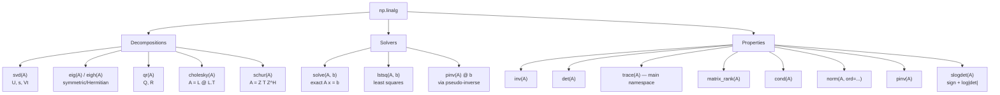
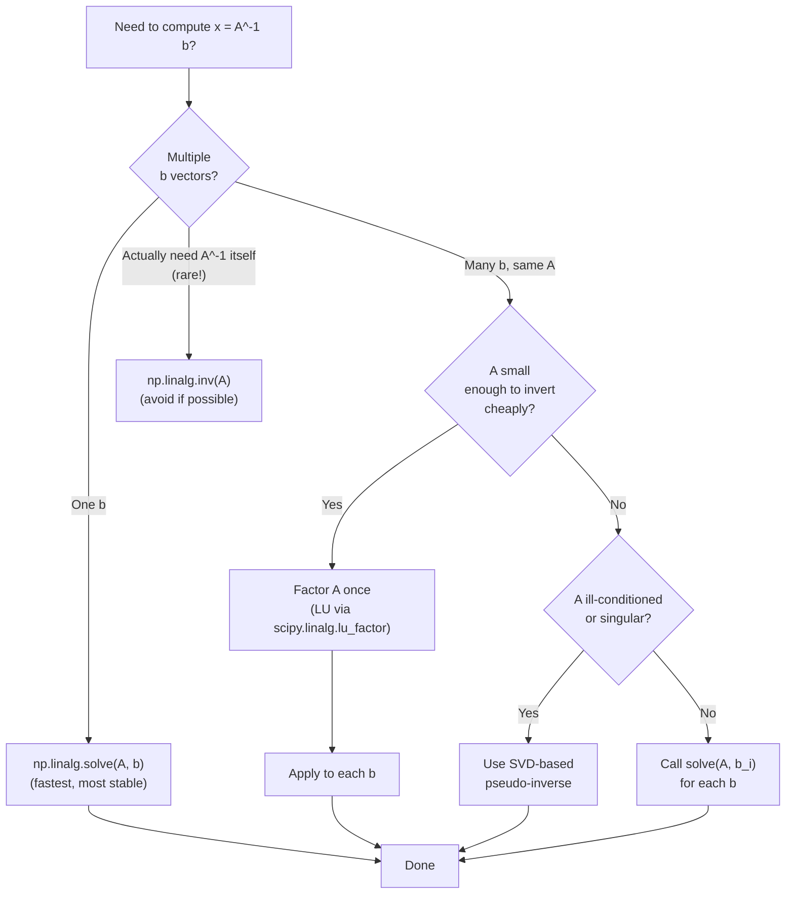

# 6. Linear Algebra

> [!note] Why this note exists
> NumPy ships a complete linear-algebra subsystem: matrix multiplication, inversions, determinants, traces, eigenvalues, eigenvectors, singular value decomposition (SVD), linear-system solvers, least-squares fitting, and matrix norms. This note covers `np.matmul` (the `@` operator), `np.dot`, the `np.linalg` module, the matrix-vs-element-wise-multiplication distinction (the most common beginner mistake), and how to choose between `np.linalg`, `scipy.linalg`, and BLAS/LAPACK backends. Read alongside [[23. NumPy/5. Broadcasting|5. Broadcasting]] (matrix `@` has different broadcasting rules) and [[23. NumPy/7. Performance and Vectorization|7. Performance and Vectorization]] (why you should never invert matrices when you can solve).

## Why It Matters

Linear algebra is the language of science, engineering, ML, graphics, optimisation, and statistics. NumPy's `np.linalg` is the foundation that every higher-level library (scikit-learn, PyTorch, TensorFlow, SciPy) builds on. Knowing it well lets you:

- **Distinguish `*` from `@`.** `A * B` is element-wise; `A @ B` is matrix multiplication. Mixing them up is the most common NumPy bug.
- **Solve linear systems efficiently.** `np.linalg.solve(A, b)` is faster and more numerically stable than `np.linalg.inv(A) @ b`. The inversion is wasted work.
- **Compute eigenvalues / SVD.** PCA, spectral clustering, matrix compression, and pseudo-inverses all reduce to these primitives.
- **Fit models with least squares.** Linear regression, polynomial fitting, and many ML algorithms are `np.linalg.lstsq` under the hood.
- **Reason about numerical stability.** Condition numbers, SVD truncation, and pivoted LU matter when your matrix is ill-conditioned.
- **Choose the right backend.** NumPy uses BLAS/LAPACK; switching to OpenBLAS or MKL can give 5-10× speedups for large matrices.

## Background

### Why NumPy has a `linalg` module

Pure NumPy ufuncs are element-wise — they don't know about matrix structure. Matrix operations (multiplication, inversion, factorisation) need access to entire rows/columns at once, which is what `np.linalg` provides. Under the hood, `np.linalg` calls into LAPACK (Linear Algebra PACKage) — a Fortran library written in the 1970s and 1990s that remains the gold standard for dense linear algebra.

### The `*` vs `@` confusion

The single most common NumPy linear-algebra mistake is using `*` when you meant matrix multiplication:

```python
A = np.array([[1, 2], [3, 4]])
B = np.array([[5, 6], [7, 8]])

A * B   # element-wise: [[5, 12], [21, 32]]
A @ B   # matrix:       [[19, 22], [43, 50]]
np.dot(A, B)   # matrix (legacy): same as @ for 2D
np.matmul(A, B)  # matrix (explicit): same as @
```

Python 3.5 (PEP 465) introduced `@` as the matrix-multiplication operator specifically because `np.dot` was confusing and `*` was already taken for element-wise. **Always use `@`** for matrix multiplication in modern code.

### `np.dot` vs `np.matmul` vs `@`

These three are *almost* the same, with subtle differences:

| Function    | 1D input behavior | N-D input behavior |
| ----------- | ----------------- | ------------------ |
| `np.dot`    | Inner product (returns scalar) | Treats first N-2 axes as "batch", last 2 as matrices |
| `np.matmul` (`@`) | 1D × 1D = scalar; 1D × 2D = treats 1D as row vector; 2D × 1D = treats 1D as column vector | Treats first N-2 axes as "batch" via broadcasting |
| `np.matmul` (`@`) | Doesn't allow scalar inputs | Broadcasting follows the standard rules |

The practical rule: **use `@` always**, and avoid mixing 1D and 2D in matrix products — promote 1D to `(1, N)` or `(N, 1)` with `np.newaxis` for clarity.

```python
v = np.array([1, 2, 3])
M = np.array([[1, 2, 3], [4, 5, 6]])  # shape (2, 3)

# v @ M works because v is treated as a row vector
v @ M   # shape (3,)

# M @ v works because v is treated as a column vector
M @ v   # shape (2,)

# For batched matmul, use np.matmul with broadcasting:
A = np.random.rand(10, 3, 4)   # 10 matrices of shape (3, 4)
B = np.random.rand(10, 4, 5)   # 10 matrices of shape (4, 5)
C = A @ B   # shape (10, 3, 5) — batched matmul
```

## Main content

### Matrix multiplication

```python
import numpy as np

A = np.array([[1, 2], [3, 4]])
B = np.array([[5, 6], [7, 8]])

# Modern (Python 3.5+): use @
C = A @ B
# [[1*5 + 2*7, 1*6 + 2*8],
#  [3*5 + 4*7, 3*6 + 4*8]]
# = [[19, 22], [43, 50]]

# Equivalent alternatives
C = np.matmul(A, B)  # explicit
C = np.dot(A, B)     # legacy, works for 2D
C = A.dot(B)         # method form

# 1D vectors: dot product (inner product)
v = np.array([1, 2, 3])
w = np.array([4, 5, 6])
v @ w  # 32 = 1*4 + 2*5 + 3*6

# Outer product: use np.outer, or broadcasting
np.outer(v, w)  # shape (3, 3)
v[:, None] * w[None, :]  # same thing

# Batched matmul (3D+): use @ with broadcasting
A = np.random.rand(5, 3, 4)
B = np.random.rand(5, 4, 2)
C = A @ B   # shape (5, 3, 2) — 5 independent matrix products

# Mixed batch + broadcast: B can be (4, 2) and broadcasts to all 5
B = np.random.rand(4, 2)
C = A @ B   # shape (5, 3, 2) — B applied to all 5 matrices in A
```

### Matrix inversion, determinant, trace

```python
A = np.array([[4, 7], [2, 6]])

# Inverse
A_inv = np.linalg.inv(A)
# Verify: A @ A_inv should be the identity
print(A @ A_inv)  # [[1. 0.], [0. 1.]] (up to floating point)

# Determinant
det = np.linalg.det(A)  # 4*6 - 7*2 = 10

# Trace (sum of diagonal)
trace = np.trace(A)  # 4 + 6 = 10
# np.trace is in the main namespace, not np.linalg

# Rank
rank = np.linalg.matrix_rank(A)  # 2 (full rank)

# Condition number — small = well-conditioned
cond = np.linalg.cond(A)  # ~4.5

# Pseudo-inverse (for non-square or singular matrices)
pinv = np.linalg.pinv(A)  # Moore-Penrose pseudo-inverse
```

> [!warning] Don't invert if you can solve
> `np.linalg.inv(A) @ b` is **slower** and **less numerically stable** than `np.linalg.solve(A, b)`. Inversion costs $O(n^3)$ and produces a dense matrix; solving costs $O(n^3)$ but only factors the matrix once internally. Always prefer `solve` for linear systems. Use `inv` only when you genuinely need the inverse itself (rare).

### Solving linear systems

```python
# Solve A x = b for x
A = np.array([[3, 1], [1, 2]])
b = np.array([9, 8])

x = np.linalg.solve(A, b)  # [2. 3.]  — checks: 3*2 + 1*3 = 9, 1*2 + 2*3 = 8

# Multiple right-hand sides: b is (N, K), x is (N, K)
A = np.array([[3, 1], [1, 2]])
B = np.array([[9, 1], [8, 2]])  # shape (2, 2) — two RHS vectors
X = np.linalg.solve(A, B)  # shape (2, 2)

# Why solve > inv @ b:
# - Faster: solve uses LU with partial pivoting; inv then @ does 2x the work.
# - More stable: solve doesn't form the inverse explicitly, avoiding extra rounding.
# - Less memory: solve doesn't allocate the inverse matrix.
```

### Least squares — fitting models

```python
# Solve Ax = b in the least-squares sense (when A is not square or singular)
# Minimises ||Ax - b||^2

# Linear regression: y = X @ beta
# X has shape (N, D), y has shape (N,). We want beta of shape (D,).
N, D = 100, 3
X = np.random.rand(N, D)
true_beta = np.array([1.0, 2.0, 3.0])
y = X @ true_beta + 0.01 * np.random.randn(N)  # noisy observations

# Solve via least squares
beta, residuals, rank, sv = np.linalg.lstsq(X, y, rcond=None)
# beta: estimated coefficients — close to [1, 2, 3]
# residuals: sum of squared residuals
# rank: effective rank of X
# sv: singular values of X

# Polynomial fitting via Vandermonde matrix
x = np.linspace(0, 1, 50)
y = 2 + 3*x + 4*x**2 + 0.1 * np.random.randn(50)
V = np.vander(x, N=3)  # shape (50, 3): columns are x^2, x^1, x^0
coeffs, *_ = np.linalg.lstsq(V, y, rcond=None)
# coeffs ≈ [4, 3, 2] (highest power first)
```

### Eigenvalues and eigenvectors

```python
# Eigen-decomposition: A v = lambda v
A = np.array([[2, 1], [1, 3]])

eigenvalues, eigenvectors = np.linalg.eig(A)
# eigenvalues: array([1.382, 3.618])  (may be complex for non-symmetric matrices)
# eigenvectors: columns are the eigenvectors

# Verify: A @ v[:, 0] = eigenvalues[0] * v[:, 0]
print(A @ eigenvectors[:, 0] - eigenvalues[0] * eigenvectors[:, 0])  # ~[0, 0]

# For symmetric (or Hermitian) matrices, use eigh — faster and guarantees real output
A_sym = np.array([[2, 1], [1, 3]])  # symmetric
evals, evecs = np.linalg.eigh(A_sym)
# evals are sorted ascending
# evecs are orthonormal (evecs.T @ evecs = I)

# Eigendecomposition of a covariance matrix → PCA
cov = np.cov(X, rowvar=False)  # covariance matrix
evals, evecs = np.linalg.eigh(cov)
# Sort descending
order = np.argsort(evals)[::-1]
evals = evals[order]
evecs = evecs[:, order]
# Top-k principal components:
k = 2
components = evecs[:, :k]  # shape (D, k)
X_pca = X @ components      # shape (N, k)
```

### Singular Value Decomposition (SVD)

SVD factorises any matrix $A$ (of shape $M \times N$) as $A = U \Sigma V^T$, where $U$ is $M \times M$ orthogonal, $\Sigma$ is $M \times N$ diagonal, and $V$ is $N \times N$ orthogonal. It's the workhorse of numerical linear algebra.

```python
A = np.random.rand(5, 3)

# Full SVD
U, s, Vt = np.linalg.svd(A, full_matrices=True)
# U: shape (5, 5) — orthogonal
# s: shape (3,)  — singular values (1D, sorted descending)
# Vt: shape (3, 3) — orthogonal

# Compact SVD (only the non-zero part)
U, s, Vt = np.linalg.svd(A, full_matrices=False)
# U: shape (5, 3)
# s: shape (3,)
# Vt: shape (3, 3)

# Reconstruct A from its SVD
Sigma = np.diag(s)
A_reconstructed = U @ Sigma @ Vt
# np.allclose(A, A_reconstructed) is True

# Truncated SVD for low-rank approximation (data compression)
k = 2  # keep top 2 singular values
A_low_rank = U[:, :k] @ np.diag(s[:k]) @ Vt[:k, :]
# This is the best rank-k approximation (Eckart-Young theorem)

# Pseudo-inverse via SVD
# pinv(A) = V @ diag(1/s) @ U^T
pinv_svd = Vt.T @ np.diag(1.0 / s) @ U.T
# Equivalent: np.linalg.pinv(A)

# Condition number = max(s) / min(s)
cond = s[0] / s[-1]
```

### Matrix norms

```python
A = np.random.rand(5, 5)

# Frobenius norm (default for matrices)
np.linalg.norm(A)              # sqrt(sum of squares of all elements)
np.linalg.norm(A, 'fro')       # explicit

# 2-norm (largest singular value)
np.linalg.norm(A, 2)

# 1-norm (max column sum)
np.linalg.norm(A, 1)

# Inf-norm (max row sum)
np.linalg.norm(A, np.inf)

# Nucleus norm (sum of singular values)
np.linalg.norm(A, 'nuc')

# Vector norms (1D input)
v = np.array([3, 4])
np.linalg.norm(v)         # 5.0 (2-norm, default)
np.linalg.norm(v, 1)      # 7.0 (sum of absolute values)
np.linalg.norm(v, np.inf) # 4.0 (max absolute value)
np.linalg.norm(v, -np.inf) # 3.0 (min absolute value)
```

### Other useful functions

```python
# QR decomposition
Q, R = np.linalg.qr(A)

# Cholesky decomposition (for symmetric positive-definite matrices)
L = np.linalg.cholesky(A_sym_posdef)  # A = L @ L.T

# LU decomposition (scipy.linalg.lu — not in np.linalg)
# import scipy.linalg
# P, L, U = scipy.linalg.lu(A)

# Schur decomposition
T, Z = np.linalg.schur(A)

# Solve a triangular system (faster than full solve)
# If you've already done LU and want to back-substitute:
# scipy.linalg.solve_triangular

# Tensor dot product (Einstein-like contractions)
A = np.random.rand(3, 4, 5)
B = np.random.rand(5, 6)
C = np.tensordot(A, B, axes=([2], [0]))  # shape (3, 4, 6)
# Or use np.einsum for full generality — see Performance note.

# Cross product (3D vectors only)
a = np.array([1, 0, 0])
b = np.array([0, 1, 0])
np.cross(a, b)  # [0, 0, 1]

# Outer product
np.outer([1, 2, 3], [10, 20])  # shape (3, 2)
```

### Linear algebra operation map



### Solve vs inv decision flow



### Realistic example: PCA from scratch

```python
# Principal Component Analysis via eigendecomposition of the covariance matrix
def pca(X, n_components):
    # X: shape (N, D)
    # Centre the data
    X_centered = X - X.mean(axis=0)
    # Covariance matrix: shape (D, D)
    cov = np.cov(X_centered, rowvar=False)
    # Eigendecomposition (symmetric matrix → use eigh)
    evals, evecs = np.linalg.eigh(cov)
    # Sort descending (eigh returns ascending)
    order = np.argsort(evals)[::-1]
    evecs = evecs[:, order]
    evals = evals[order]
    # Project onto top-k components
    components = evecs[:, :n_components]  # shape (D, k)
    X_pca = X_centered @ components       # shape (N, k)
    return X_pca, components, evals

# Or, equivalently, via SVD (often more numerically stable)
def pca_svd(X, n_components):
    X_centered = X - X.mean(axis=0)
    U, s, Vt = np.linalg.svd(X_centered, full_matrices=False)
    components = Vt[:n_components].T  # shape (D, k)
    X_pca = U[:, :n_components] * s[:n_components]  # shape (N, k)
    return X_pca, components, s**2 / (X.shape[0] - 1)
```

### Realistic example: linear regression

```python
# Ordinary least squares: beta = (X^T X)^-1 X^T y
# Don't compute this directly — use lstsq instead.

N, D = 100, 3
X = np.random.rand(N, D)
true_beta = np.array([1.0, 2.0, 3.0])
y = X @ true_beta + 0.1 * np.random.randn(N)

# Method 1: lstsq (recommended)
beta_lstsq, *_ = np.linalg.lstsq(X, y, rcond=None)

# Method 2: normal equations (numerically bad if X is ill-conditioned)
beta_normal = np.linalg.solve(X.T @ X, X.T @ y)

# Method 3: pseudo-inverse (general; same as lstsq when X is full rank)
beta_pinv = np.linalg.pinv(X) @ y

# All three give the same answer for well-conditioned X.
# lstsq is preferred — uses SVD, handles rank-deficiency gracefully.
```

## Common Pitfalls

1. **Using `*` for matrix multiplication.** `A * B` is element-wise. Use `@` for matrix product.

2. **Inverting when you should solve.** `inv(A) @ b` is slower and less stable than `solve(A, b)`. Use `inv` only when you need the inverse itself (rare).

3. **Forgetting that `eig` may return complex values.** For non-symmetric matrices, eigenvalues can be complex even if the input is real. Use `eigh` for symmetric matrices to guarantee real output.

4. **Computing `A^T A` for least squares.** This squares the condition number. Use `lstsq` (which uses SVD) instead — it handles ill-conditioned matrices gracefully.

5. **`np.linalg.inv` on a singular matrix.** Raises `LinAlgError: Singular matrix`. Use `pinv` if you need a pseudo-inverse.

6. **`np.linalg.det` returns 0 for singular matrices.** But for nearly-singular matrices, det can be tiny but non-zero. Check the condition number too.

7. **SVD's `s` is 1D, not 2D.** `np.linalg.svd` returns singular values as a 1D array, not a diagonal matrix. You need `np.diag(s)` to reconstruct $A$.

8. **Confusing `eig` and `eigh` ordering.** `eig` returns eigenvalues in arbitrary order; `eigh` returns them ascending. Sort manually if you need a specific order.

9. **`np.linalg.norm` defaults differ for vectors and matrices.** For 1D input, default is 2-norm; for 2D input, default is Frobenius. Be explicit when it matters.

10. **Forgetting that `solve` requires square `A`.** Non-square systems need `lstsq` or `pinv`.

11. **`np.linalg.matrix_rank` uses a default tolerance.** For exact-rank checks on integer matrices, pass `tol=0`.

12. **Numerical "almost zero" eigenvalues.** A matrix that's mathematically rank-deficient may have tiny non-zero eigenvalues due to floating-point. Threshold before claiming rank deficiency.

13. **`@` doesn't broadcast over scalars.** `2 @ A` raises `TypeError`. Use `2 * A` for scalar multiplication.

14. **`np.dot` vs `np.matmul` for higher dimensions.** `np.dot(A, B)` for 3D treats the first axis as batch; `np.matmul(A, B)` broadcasts. The semantics differ — pick one and be consistent.

15. **`pinv` is more expensive than `inv`.** Pseudo-inverse uses SVD; only use it when the matrix might be singular or non-square.

16. **Forgetting that `np.cross` only works for 3D (or 2D as a special case).** Higher-dimensional cross products don't exist.

17. **Cholesky on a non-positive-definite matrix.** Raises `LinAlgError`. Verify with eigenvalues first if unsure.

18. **`np.linalg.cond` with no `ord` defaults to 2-norm.** For other norms, pass `ord=1` or `ord=np.inf` explicitly.

## Tips and Tricks

- **Use `@` for matrix multiplication.** It's the modern, unambiguous operator.
- **`np.linalg.solve(A, b)` > `inv(A) @ b`.** Faster and more stable.
- **`np.linalg.lstsq` for linear regression.** Handles rank deficiency and non-square systems.
- **`np.linalg.eigh` for symmetric matrices.** Faster than `eig` and guarantees real output.
- **`np.linalg.svd` is your swiss-army knife.** Low-rank approximation, pseudo-inverse, condition number, PCA — all from SVD.
- **Check `np.linalg.cond(A)` before solving.** If it's > 1e10, expect garbage from `solve`.
- **`np.trace` is in the main namespace, not `np.linalg`.** Same for `np.cross` and `np.outer`.
- **`scipy.linalg` has more functions than `np.linalg`.** LU decomposition, triangular solvers, matrix functions (`expm`, `logm`).
- **Use `scipy.sparse.linalg` for large sparse matrices.** Dense `np.linalg` on a 100k × 100k sparse matrix is suicide.
- **For batched operations, `np.matmul` broadcasts.** `A @ B` with `A.shape = (B, N, M)` and `B.shape = (M, K)` gives `(B, N, K)`.
- **`np.tensordot` for general tensor contractions.** `np.einsum` is even more general — see [[23. NumPy/7. Performance and Vectorization|7. Performance and Vectorization]].
- **`A.T` is the transpose.** For complex matrices, use `A.conj().T` for conjugate transpose (Hermitian).
- **`np.linalg.slogdet` for log-determinants.** Avoids overflow for large matrices.
- **`np.linalg.multi_dot([A, B, C, D])`** picks the optimal parenthesisation — faster than chaining `@`.
- **BLAS/LAPACK backend matters.** NumPy linked against MKL or OpenBLAS is 5-10× faster for large matrices. Check with `np.show_config()`.
- **`np.linalg.cholesky` is faster than `inv` for symmetric positive-definite matrices.** Use it as a pre-factorisation for repeated solves.
- **For ridge regression, solve `(X^T X + lambda I) beta = X^T y`.** Don't invert.
- **`np.linalg.qr` for QR decomposition** — useful for orthogonal projections and Gram-Schmidt.
- **`scipy.linalg.lu_factor` + `lu_solve`** for solving many systems with the same A.
- **Use `np.linalg.norm` for vector norms too.** Same function as matrix norms — just pass `ord` explicitly.

## Active Recall

1. What's the difference between `A * B` and `A @ B`?
2. When should you use `np.linalg.solve` instead of `np.linalg.inv`?
3. What's the difference between `np.dot` and `np.matmul`?
4. What does `np.linalg.lstsq` return? When would you use it?
5. What's the difference between `np.linalg.eig` and `np.linalg.eigh`?
6. What does `np.linalg.svd` return? Why is `s` 1D and not 2D?
7. How would you compute the pseudo-inverse of a matrix?
8. How would you compute the rank of a matrix? What's the gotcha for integer matrices?
9. What does `np.linalg.cond(A)` tell you? Why does it matter?
10. How would you compute PCA from scratch using NumPy?
11. What's the Eckart-Young theorem?
12. What does `np.linalg.norm` return by default for a 1D array? For a 2D array?
13. How do you do batched matrix multiplication with broadcasting?
14. What's `np.linalg.multi_dot` for?
15. What's the issue with computing `A^T A` for least squares?
16. How would you do Cholesky decomposition? What precondition does the matrix need?
17. What's the relationship between `np.linalg.pinv` and SVD?
18. What's `np.linalg.slogdet` for? When would you use it over `np.linalg.det`?
19. How does the choice of BLAS/LAPACK backend affect performance?
20. When would you reach for `scipy.linalg` instead of `np.linalg`?

## Next Steps

- [[23. NumPy/1. NumPy Basics|1. NumPy Basics]] — the array model that linear algebra operates on.
- [[23. NumPy/4. Universal Functions|4. Universal Functions]] — element-wise operations (the `*` side of the `*` vs `@` distinction).
- [[23. NumPy/5. Broadcasting|5. Broadcasting]] — matrix `@` has its own broadcasting rules.
- [[23. NumPy/7. Performance and Vectorization|7. Performance and Vectorization]] — `np.einsum`, the generalised tensor contraction tool.
- [[24. Pandas/2. Series and DataFrame|Series and DataFrame]] — Pandas `.dot()` method wraps `np.dot` with index alignment.
- [[24. Pandas/5. GroupBy Operations|GroupBy Operations]] — group-wise linear regressions are a common pattern.
- [[22. Native Extensions/4. Numba|Numba]] — JIT-compiling custom linear algebra kernels for GPUs/TPUs.
