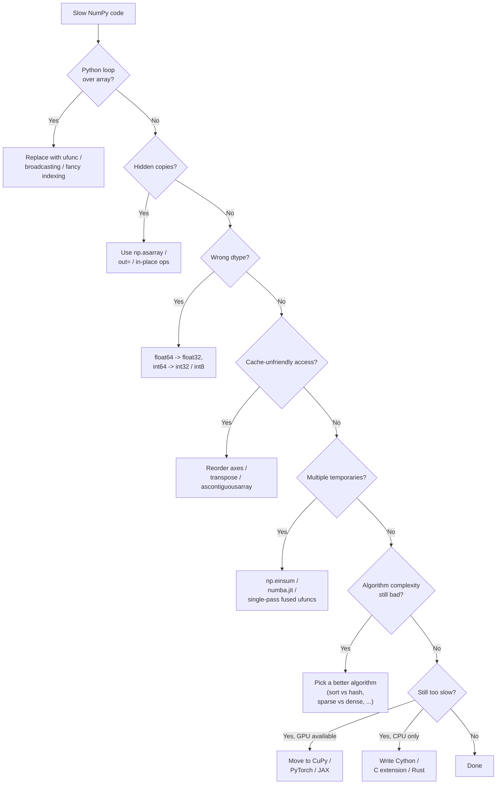
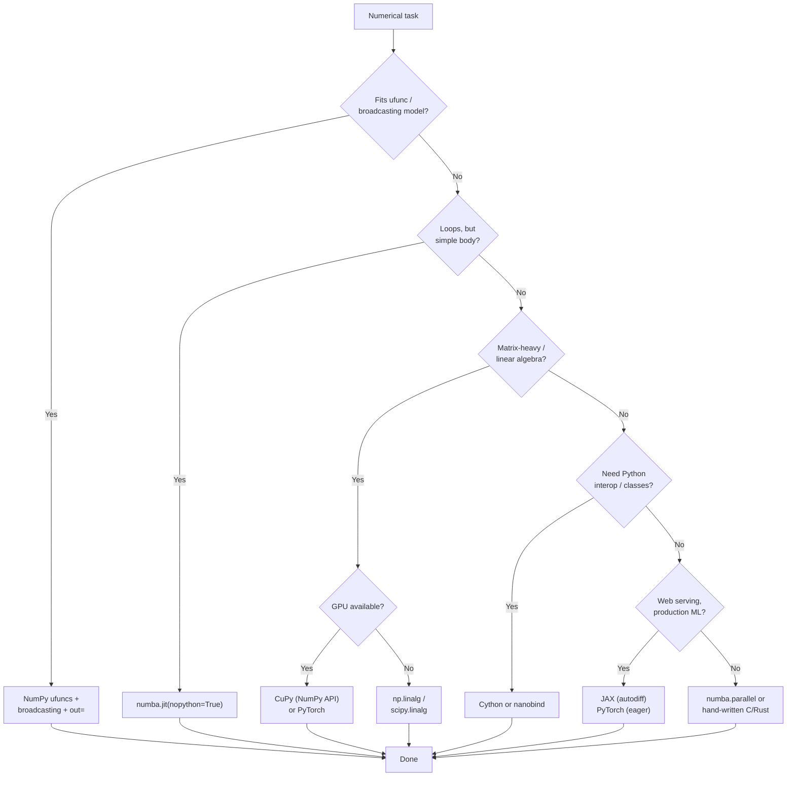

# 7. Performance and Vectorization

> [!note] Why this note exists
> NumPy's whole reason for existing is speed. This note explains *why* NumPy is fast (C implementation, SIMD vectorisation, cache locality, no per-element Python overhead), *how* to write code that exploits it (vectorisation, `out=`, `where=`, `np.einsum`), and *when* to reach for alternatives (Numba, Cython, PyTorch, GPU). It also punctures the `np.vectorize` myth — that function is a Python loop in disguise, not a vectorisation tool. Read alongside [[23. NumPy/4. Universal Functions|4. Universal Functions]] and [[23. NumPy/5. Broadcasting|5. Broadcasting]] — those are the building blocks; this note is the strategy for using them well.

## Why It Matters

Performance is the entire point of NumPy. Understanding vectorisation lets you:

- **Get 10–100× speedups for free.** Replacing a Python loop with a ufunc is usually a one-line change with a 50× payoff.
- **Avoid the "Python is slow" trap.** Python isn't slow — *pure-Python numerical loops* are slow. NumPy replaces them with bulk C operations.
- **Reason about memory layout.** C-contiguous vs Fortran-contiguous can be a 3× speed difference. Cache-friendly access patterns are everything.
- **Choose the right tool.** NumPy for general work; Numba for JIT-compiled numerical kernels; Cython for C extensions; PyTorch/JAX for GPU; CuPy for drop-in GPU NumPy.
- **Write scalable code.** The difference between $O(N)$ and $O(N^2)$ algorithms matters less than the constant factor — and NumPy's constant factor is small.
- **Avoid the profiling trap.** Knowing *which* NumPy operations are fast (ufuncs, `@`, fancy indexing) and which are slow (`np.vectorize`, `np.apply_along_axis`, Python `for` over array elements) saves you from optimising the wrong thing.

## Background

### Why NumPy is fast — the four pillars

1. **C implementation.** Every ufunc is a C function with a tight inner loop. There's no Python interpreter in the hot path.
2. **Homogeneous, contiguous memory.** An `ndarray` is a single block of bytes with a known stride. The CPU prefetcher streams it in; the cache lines are utilised fully.
3. **SIMD vectorisation.** Modern CPUs can do 4–16 float operations per instruction (AVX2, AVX-512). NumPy's C loops detect SIMD support at build time and use it.
4. **No per-element type dispatch.** A Python `+` checks the types of both operands, looks up `__add__`, possibly falls back to `__radd__`. NumPy's `+` knows the dtype at compile time and just runs.

The combined effect: a 1M-element `np.sqrt(a)` is ~100× faster than `[math.sqrt(x) for x in a]`, and uses ~3× less memory.

### The vectorisation mental model

> **Vectorisation** = expressing your computation as a sequence of whole-array operations rather than per-element operations.

The key insight: a Python `for` loop over a million elements runs the interpreter a million times. A single ufunc call runs the interpreter once and the C loop a million times. The interpreter cost dominates for small arrays; the C loop dominates for large arrays. Vectorisation eliminates the interpreter cost.

```python
# Slow: 1M Python iterations
result = [x * 2 + 1 for x in big_array]

# Fast: 1 Python iteration, 1M C iterations
result = big_array * 2 + 1
```

### What kills performance

- **Python loops over array elements.** `for x in arr:` is 100× slower than `arr * 2`.
- **`np.vectorize` and `np.apply_along_axis`.** These are Python loops in disguise.
- **Per-element indexing in a hot loop.** `arr[i] = ...` inside a Python `for` is slow.
- **Small arrays.** NumPy has ~1 µs of per-operation overhead. For 10-element arrays, pure Python wins.
- **Cache-unfriendly access.** Iterating over columns of a C-contiguous 2D array crosses cache lines.
- **Implicit copies.** `np.array(arr)` copies; `np.asarray(arr)` doesn't. Wasted memory = wasted time.
- **Wrong dtype.** `float64` where `float32` would do costs 2× memory and 2× compute.

## Main content

### The benchmark that drives the point home

```python
import numpy as np
import timeit

N = 1_000_000
a = np.random.rand(N)
b = np.random.rand(N)

# Python loop
def python_loop():
    return [x + y for x, y in zip(a, b)]

# NumPy vectorised
def numpy_vec():
    return a + b

# NumPy with out=
c = np.empty_like(a)
def numpy_inplace():
    np.add(a, b, out=c)

# Typical timings:
# python_loop:    ~80 ms
# numpy_vec:      ~1 ms   (80x faster)
# numpy_inplace:  ~0.7 ms (5% faster still — no allocation)
```

For 1M elements, NumPy is ~80× faster. The gap widens for larger arrays because Python's per-element cost scales linearly, while NumPy's cost is dominated by memory bandwidth.

### The vectorisation checklist

When you see a Python loop over a NumPy array, ask:

1. **Is this a ufunc?** `f(x) for x in arr` → `np.<ufunc>(arr)`.
2. **Is this a reduction?** `sum(x for x in arr)` → `arr.sum()` or `np.add.reduce(arr)`.
3. **Is this an accumulation?** Running totals → `np.add.accumulate(arr)` or `arr.cumsum()`.
4. **Is this a broadcast?** `for i: M[i] = M[i] - row_mean[i]` → `M - M.mean(axis=1, keepdims=True)`.
5. **Is this a where?** `for i: if cond[i]: result[i] = x[i]` → `np.where(cond, x, default)`.
6. **Is this a gather/scatter?** `for i: result[idx[i]] = arr[i]` → `result[idx] = arr` (fancy indexing).
7. **Is this a sliding window?** `for i: result[i] = arr[i:i+w].mean()` → `np.convolve` or `sliding_window_view`.
8. **Is this a histogram?** `for i: bins[arr[i]] += 1` → `np.bincount` or `np.histogram`.
9. **Is this a sort/search?** `for i: ... bisect ...` → `np.searchsorted`.
10. **Is this a custom numerical kernel?** Use `numba.jit` or rewrite with `np.einsum`.

### `np.where`, `np.select`, `np.piecewise`

These three functions replace conditional Python code:

```python
a = np.array([1, -2, 3, -4, 5])

# np.where: vectorised ternary
b = np.where(a > 0, a, 0)        # [1, 0, 3, 0, 5] — clip negatives to zero
# Equivalent: np.maximum(a, 0)

# np.select: multi-branch
conditions = [a < -3, a < 0, a >= 0]
choices = [-999, -1, 1]
b = np.select(conditions, choices)  # [1, -1, 1, -999, 1]

# np.piecewise: function-valued branches
b = np.piecewise(a, [a < 0, a >= 0], [lambda x: -x, lambda x: x])
# [1, 2, 3, 4, 5] — absolute value

# For simple cases, prefer ufuncs:
np.abs(a)              # same as piecewise above, 10x faster
np.maximum(a, 0)       # same as np.where(a > 0, a, 0)
```

### `np.einsum` — Einstein summation

`np.einsum` is NumPy's most powerful general-purpose tool. It expresses tensor contractions in a compact string notation, often beating the equivalent chain of `np.dot` and `np.transpose` calls.

```python
import numpy as np

# Matrix multiplication: C = A @ B
A = np.random.rand(3, 4)
B = np.random.rand(4, 5)
C = np.einsum('ij,jk->ik', A, B)  # same as A @ B

# Trace of a matrix
A = np.random.rand(5, 5)
tr = np.einsum('ii->', A)  # same as np.trace(A)

# Transpose
T = np.einsum('ij->ji', A)  # same as A.T

# Diagonal
d = np.einsum('ii->i', A)   # same as np.diag(A)

# Outer product
a = np.array([1, 2, 3])
b = np.array([10, 20])
O = np.einsum('i,j->ij', a, b)  # same as np.outer(a, b)

# Batched matmul: A is (B, N, M), B is (B, M, K), result is (B, N, K)
A = np.random.rand(10, 3, 4)
B = np.random.rand(10, 4, 5)
C = np.einsum('bij,bjk->bik', A, B)  # same as A @ B

# Bilinear form: x^T A y
x = np.random.rand(3)
y = np.random.rand(4)
A = np.random.rand(3, 4)
result = np.einsum('i,ij,j->', x, A, y)

# Sum over an axis
S = np.einsum('ij->i', A)  # row sums — same as A.sum(axis=1)

# Hadamard (element-wise) product
H = np.einsum('ij,ij->ij', A, A)  # same as A * A

# The 'optimize' parameter (NumPy 1.12+) chooses the best contraction order:
result = np.einsum('ij,jk,kl->il', A, B, C, optimize='optimal')
# For multi-tensor contractions, this can be 100x faster than the naive order.
```

`np.einsum` is the universal tool when:
- You're contracting multiple tensors with shared indices.
- The pattern doesn't fit a named function.
- You want one C-level pass instead of a chain of temporaries.

The trade-off: einsum strings are cryptic. Use it when the alternative is multiple `np.tensordot` and `np.transpose` calls; use named functions when the operation is simple.

### Memory layout: C vs Fortran order

```python
a = np.random.rand(10000, 10000)

# Sum along axis 0 (column sums) — crosses cache lines in C-order
%timeit a.sum(axis=0)   # ~5 ms

# Sum along axis 1 (row sums) — contiguous in C-order
%timeit a.sum(axis=1)   # ~2 ms (2-3x faster)

# Force Fortran order — now axis 0 is contiguous
a_f = np.asfortranarray(a)
%timeit a_f.sum(axis=0) # ~2 ms (now faster)
%timeit a_f.sum(axis=1) # ~5 ms (now slower)
```

**Rule of thumb:** in C-order (default), the *last* axis is contiguous. Operations along the last axis are fastest.

### `np.lib.stride_tricks.sliding_window_view` — zero-copy rolling windows

```python
from numpy.lib.stride_tricks import sliding_window_view

arr = np.arange(10)
windows = sliding_window_view(arr, 3)
# array([[0, 1, 2],
#        [1, 2, 3],
#        ...
#        [7, 8, 9]])
# This is a VIEW — no memory allocation! 8 windows of 3 elements each, sharing memory with arr.

# Compute rolling mean
rolling_mean = windows.mean(axis=1)  # shape (8,)

# For 2D arrays (rolling along last axis):
M = np.random.rand(1000, 1000)
windows = sliding_window_view(M, 7, axis=1)  # shape (1000, 994, 7)
rolling = windows.mean(axis=-1)              # shape (1000, 994)
```

This is the canonical pattern for time-series rolling windows, convolutions, and stencils.

### Avoiding `np.vectorize`

```python
# SLOW: np.vectorize is a Python loop in disguise
@np.vectorize
def my_func(x):
    return x ** 2 + 1 if x > 0 else 0

result = my_func(big_array)  # ~100 ms for 1M elements

# FAST: rewrite as ufunc chain
result = np.where(big_array > 0, big_array ** 2 + 1, 0)  # ~2 ms (50x faster)

# FAST alternative: numba
from numba import vectorize, float64

@vectorize([float64(float64)])
def my_func_numba(x):
    return x ** 2 + 1 if x > 0 else 0.0

result = my_func_numba(big_array)  # ~2 ms (50x faster than np.vectorize)
```

The rule: **`np.vectorize` is for broadcasting semantics, not speed.** If you need speed, either rewrite with built-in ufuncs or use `numba.vectorize`.

### `np.frompyfunc` — slightly faster than `np.vectorize`, still slow

```python
# Wraps a Python function as a ufunc. Calls Python per element. Slow.
def my_func(x):
    return x * 2

uf = np.frompyfunc(my_func, 1, 1)
result = uf(big_array)  # ~100 ms, object dtype
# Use only when you can't rewrite with built-in ufuncs and don't want Numba.
```

### The `numba.jit` alternative

```python
from numba import jit
import numpy as np

@jit(nopython=True)
def mandelbrot(c, max_iter):
    z = 0.0j
    for n in range(max_iter):
        if abs(z) > 2:
            return n
        z = z * z + c
    return max_iter

@jit(nopython=True)
def mandelbrot_grid(cs, max_iter):
    out = np.empty(cs.shape, dtype=np.int32)
    for i in range(cs.shape[0]):
        for j in range(cs.shape[1]):
            out[i, j] = mandelbrot(cs[i, j], max_iter)
    return out

# 100x100 grid, 1000 iterations
cs = np.array([complex(x, y) for x in np.linspace(-2, 1, 100)
                                for y in np.linspace(-1.5, 1.5, 100)]).reshape(100, 100)
result = mandelbrot_grid(cs, 1000)
# Numba makes this Python loop run at C speed — typically within 2x of pure C.
```

Numba is the right tool when:
- The computation doesn't fit NumPy's ufunc model.
- You need loops (stencils, iterative algorithms, recursive structures).
- You don't want to write C.

### Profiling NumPy code

```python
import cProfile
import pstats

# Profile a function
def my_pipeline(arr):
    arr = arr * 2 + 1
    arr = np.sqrt(arr)
    arr = arr - arr.mean()
    return arr

cProfile.run('my_pipeline(big_array)', 'out.prof')
stats = pstats.Stats('out.prof')
stats.sort_stats('cumulative').print_stats(20)

# Or use %prun in IPython/Jupyter:
# %prun -s cumulative my_pipeline(big_array)

# Line-level profiling
# pip install line_profiler
# %load_ext line_profiler
# %lprun -f my_pipeline my_pipeline(big_array)

# Memory profiling
# pip install memory_profiler
# %load_ext memory_profiler
# %mprun -f my_pipeline my_pipeline(big_array)
```

### The optimisation ladder



### When to use what — decision tree



### Performance comparison: common patterns

```python
import numpy as np
import timeit

N = 1_000_000
arr = np.random.rand(N)

# 1. Element-wise sqrt
def m_python():
    return [np.sqrt(x) for x in arr]  # ~150 ms
def m_numpy():
    return np.sqrt(arr)              # ~1.5 ms (100x)

# 2. Conditional sum
def m_python_cond():
    return sum(x for x in arr if x > 0.5)  # ~80 ms
def m_numpy_cond():
    return arr[arr > 0.5].sum()            # ~5 ms (16x)

# 3. Binned sum (histogram-like)
bins = np.random.randint(0, 10, N)
def m_python_bin():
    out = [0.0] * 10
    for b, v in zip(bins, arr):
        out[b] += v                      # ~300 ms
def m_numpy_bin():
    return np.bincount(bins, weights=arr)  # ~2 ms (150x)

# 4. Pairwise distances (small N)
A = np.random.rand(100, 3)
B = np.random.rand(100, 3)
def m_python_pair():
    out = np.zeros((100, 100))
    for i in range(100):
        for j in range(100):
            out[i, j] = np.sqrt(((A[i] - B[j]) ** 2).sum())  # ~30 ms
def m_numpy_pair():
    diff = A[:, None] - B[None] :]
    return np.sqrt((diff ** 2).sum(-1))  # ~0.3 ms (100x)

# 5. Sliding window mean
def m_python_slide():
    out = np.empty(N - 7)
    for i in range(N - 7):
        out[i] = arr[i:i+7].mean()  # ~500 ms
def m_numpy_slide():
    from numpy.lib.stride_tricks import sliding_window_view
    return sliding_window_view(arr, 7).mean(axis=1)  # ~5 ms (100x)
```

### Memory-efficient patterns

```python
# BAD: creates three temporary arrays
result = np.sqrt(np.exp(np.square(arr)))

# BETTER: chain with out= to avoid temporaries (but readability suffers)
tmp1 = np.empty_like(arr)
np.square(arr, out=tmp1)
tmp2 = np.empty_like(arr)
np.exp(tmp1, out=tmp2)
result = np.empty_like(arr)
np.sqrt(tmp2, out=result)

# GOOD (in modern NumPy): just chain — NumPy fuses simple ops internally
# Actually, NumPy does NOT fuse ufuncs. The "better" approach above IS faster,
# but only marginally, and the readability cost is high. Profile before optimising.

# For truly fused ops, use numba:
from numba import vectorize, float64

@vectorize([float64(float64)])
def fused(x):
    return np.sqrt(np.exp(x * x))
# This compiles to a single loop with no temporaries.
```

### When NOT to vectorise

- **Small arrays.** For < 100 elements, the per-call overhead of NumPy exceeds the loop savings.
- **Heterogeneous data.** Use Pandas or Python lists.
- **Complex branching logic.** If your inner loop has 20 branches, vectorisation becomes unreadable. Use `numba.jit` instead.
- **Side effects.** If you need to log, write to disk, or call APIs per element, vectorisation doesn't apply.

## Common Pitfalls

1. **Using `np.vectorize` for speed.** It's a Python loop — no SIMD, no speedup. Use `numba.vectorize` or rewrite with built-in ufuncs.

2. **Using `np.apply_along_axis` for speed.** Same problem — Python loop per slice. Vectorise the operation directly.

3. **Iterating over array elements in a Python `for` loop.** `for x in arr: ...` is ~100× slower than a ufunc. If you must loop, use `numba.jit`.

4. **Allocating temporary arrays in a hot loop.** `result = a + b + c + d` creates three temporaries. Use `out=` or `numba.vectorize` to fuse.

5. **Wrong memory layout.** Iterating over columns of a C-contiguous 2D array is 3× slower than rows. Transpose or use `asfortranarray` when needed.

6. **Using `float64` everywhere.** ML and image processing often don't need 15 significant digits. `float32` halves memory and doubles SIMD throughput.

7. **Calling `np.array(existing_array)` instead of `np.asarray`.** The first always copies; the second doesn't when the input is already an array.

8. **Building arrays by appending.** `np.append` allocates a new array each time — O(n²). Pre-allocate or use a list and convert at the end.

9. **Using Python lists as intermediates.** `list(arr)` then `np.array(list)` — copies twice, loses vectorisation. Stay in NumPy.

10. **Forgetting `out=` for repeated operations.** `result = a + b` in a loop allocates a new `result` each iteration. Reuse a pre-allocated buffer with `np.add(a, b, out=result)`.

11. **`np.einsum` without `optimize=True`.** For multi-tensor contractions, the naive order can be 100× slower than the optimal. Always pass `optimize='optimal'` for non-trivial expressions.

12. **Ignoring BLAS/LAPACK backend.** NumPy linked against reference BLAS is 10× slower than OpenBLAS or MKL. Check with `np.show_config()`.

13. **Premature optimisation.** Profile before optimising. Most code spends time in 10% of its lines; the other 90% can stay readable.

14. **Trusting `timeit` on tiny arrays.** For < 1000 elements, NumPy's per-call overhead dominates. Benchmark on realistic sizes.

15. **Not using `np.errstate` to suppress expected warnings.** A divide-by-zero in a hot loop spams warnings — slow.

16. **Using `np.where` when a ufunc would do.** `np.where(a > 0, a, 0)` is slower than `np.maximum(a, 0)`.

17. **Forgetting that `arr *= scalar` is in-place.** Faster than `arr = arr * scalar` for large arrays.

18. **Building pandas DataFrames row-by-row.** Same O(n²) trap. Build a NumPy array and construct the DataFrame once.

## Tips and Tricks

- **Default to ufuncs + broadcasting.** 95% of NumPy performance is "use the obvious thing".
- **Use `out=` for hot loops.** Saves allocation cost.
- **`np.where(cond, x, y)` for vectorised ternary.** `np.maximum(a, 0)` if you just need a clip.
- **`np.select` for multi-branch logic.** Cleaner than nested `np.where`.
- **`np.einsum('ij,jk->ik', A, B)` for tensor contractions.** Add `optimize='optimal'` for multi-tensor cases.
- **`np.bincount(idx, weights=values)` for grouped sums.** Faster than a `for` loop or `np.add.at`.
- **`np.searchsorted(sorted_arr, vals)` for binary search.** Faster than `bisect` in a loop.
- **`np.lib.stride_tricks.sliding_window_view` for rolling windows.** Zero-copy.
- **`np.lib.stride_tricks.as_strided` for arbitrary stride tricks.** Powerful but dangerous — easy to read garbage memory.
- **Use `numba.jit(nopython=True)` for loops that don't fit ufuncs.** Often within 2× of hand-written C.
- **Use `numba.vectorize` to write custom ufuncs.** Gets SIMD for free.
- **Profile before optimising.** `cProfile` for call counts, `line_profiler` for line-level, `py-spy` for sampling in production.
- **Check `np.show_config()` for BLAS backend.** MKL or OpenBLAS = fast; "reference BLAS" = slow.
- **`np.ascontiguousarray(a)` to ensure C-contiguous before external calls.** Cheap if already contiguous; copies otherwise.
- **`a.ravel()` for a flat view.** Faster than `a.flatten()` (which copies).
- **`a.flags['C_CONTIGUOUS']` to check layout.** Diagnose slow operations by checking this.
- **For sparse data, use `scipy.sparse`.** A 99% sparse matrix as dense uses 100× the memory.
- **For GPU, use `cupy` (drop-in NumPy) or `torch` (differentiable).**
- **`np.errstate(divide='ignore')` to silence expected warnings in hot loops.**
- **Prefer `arr.astype(dtype, copy=False)` over `np.array(arr, dtype=dtype)`.** The first doesn't copy if dtypes already match.
- **For 1M+ element operations, memory bandwidth is the bottleneck.** Reducing dtype size or doing fewer passes matters more than algorithmic micro-opts.
- **`np.add.at(a, idx, vals)` for unbuffered accumulation.** Slower than `a[idx] += vals` for unique idx, but correct for duplicates.
- **Use `np.einsum_path` to inspect the contraction order NumPy chose.** Useful for debugging slow einsums.

## Active Recall

1. Why is NumPy faster than pure Python for numerical work? Give four reasons.
2. What's vectorisation? Give a one-line definition.
3. Why is `np.vectorize` not actually vectorised?
4. How would you replace `[x ** 2 for x in arr]` with a vectorised expression?
5. What does `out=` do? When would you use it?
6. What's `np.einsum` for? Give an example where it's better than chaining `np.dot`.
7. Why does `np.einsum('ij,jk,kl->il', A, B, C)` need `optimize='optimal'`?
8. What's the difference between C-order and Fortran-order in terms of cache locality?
9. How would you compute a rolling 7-element mean without a Python loop?
10. How would you implement grouped sum (sum of `values` per `group` index) without a loop?
11. What's `numba.jit(nopython=True)` for? When does it beat NumPy?
12. What's `numba.vectorize`? How does it differ from `np.vectorize`?
13. How would you profile NumPy code line-by-line?
14. What does `np.show_config()` tell you? Why does it matter?
15. What's `np.lib.stride_tricks.as_strided` for? What's the danger?
16. Why is `np.maximum(a, 0)` faster than `np.where(a > 0, a, 0)`?
17. Why is `a += b` faster than `a = a + b`?
18. What's the problem with `np.append` in a loop?
19. When would you use `cupy` instead of NumPy?
20. Name three common NumPy anti-patterns that kill performance.

## Next Steps

- [[23. NumPy/1. NumPy Basics|1. NumPy Basics]] — the array anatomy that makes vectorisation possible.
- [[23. NumPy/4. Universal Functions|4. Universal Functions]] — the building blocks of vectorised code.
- [[23. NumPy/5. Broadcasting|5. Broadcasting]] — eliminating loops over axes.
- [[23. NumPy/6. Linear Algebra|6. Linear Algebra]] — `np.einsum` and batched matmul.
- [[24. Pandas/2. Series and DataFrame|Series and DataFrame]] — Pandas vectorises over labelled columns.
- [[15. Memory and Performance/5. Optimization Techniques|Optimization Techniques]] — the broader optimisation ladder.
- [[22. Native Extensions/4. Numba|Numba]] — JIT compilation for numerical kernels.
- [[22. Native Extensions/3. Cython|Cython]] — writing C extensions with Python syntax.
