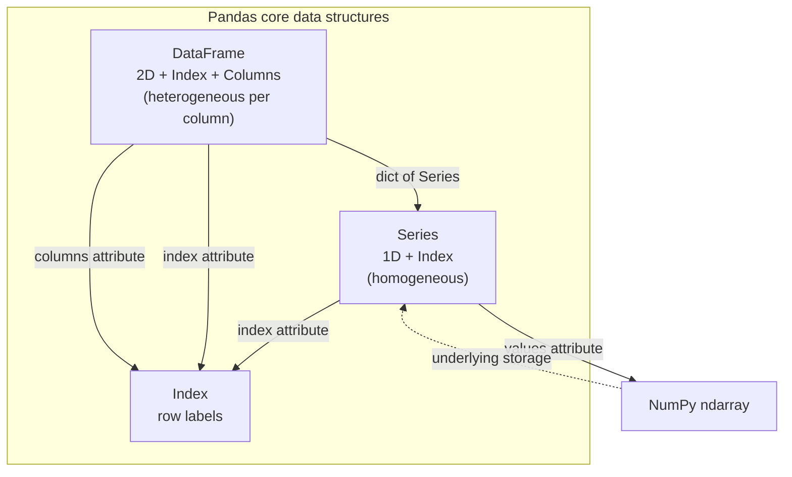
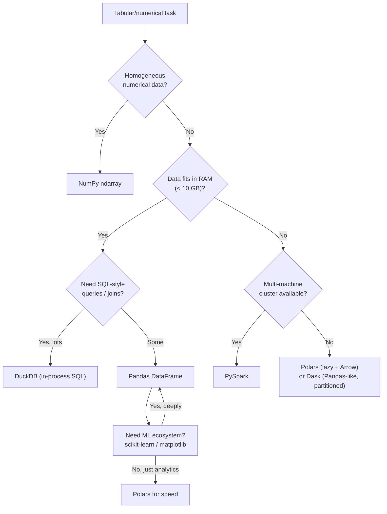

# 1. Pandas Basics

> [!note] Why this note exists
> Pandas is the de-facto standard library for tabular data analysis in Python — built on NumPy, modelled after R's `data.frame`, and used everywhere from Jupyter notebooks to production ETL pipelines. This note is the conceptual foundation for [[24. Pandas/2. Series and DataFrame|Chapter 24]]: what Pandas is, why it exists, the three core data structures (`Series`, `DataFrame`, `Index`), how it differs from NumPy (heterogeneous vs homogeneous) and from SQL (in-memory vs server, imperative vs declarative), and when to reach for it vs alternatives. Read this first if you're new to Pandas; the rest of the chapter assumes you understand the mental model presented here.

## Why It Matters

Pandas is the most-used data analysis library in the Python ecosystem. Knowing its conceptual model lets you:

- **Choose the right tool.** Pandas for tabular data, NumPy for homogeneous numerical arrays, Polars for larger-than-RAM workloads, DuckDB for SQL-style analytics, PySpark for cluster-scale.
- **Understand the `Series`/`DataFrame`/`Index` trinity.** Every Pandas operation manipulates one of these three. Confusing them is the root cause of most beginner bugs.
- **Reason about performance.** Pandas is built on NumPy — vectorisation applies. But the index lookup adds overhead; some operations are slower than the NumPy equivalent.
- **Avoid the "Pandas is just a dict of lists" mental model.** It's actually a dict of NumPy arrays with a labelled index. The difference matters when you start doing joins, group-bys, and time-series resampling.
- **Bridge to SQL.** Most Pandas operations have SQL equivalents. Knowing the mapping (SELECT, WHERE, GROUP BY, JOIN) makes both SQL and Pandas easier to learn.

## Background

### A brief history

- **2008:** Wes McKinney starts Pandas at AQR Capital Management to replace Excel/R workflows for quantitative finance.
- **2009:** Open-sourced.
- **2010s:** Pandas becomes the standard for Python data analysis. SciPy, scikit-learn, matplotlib all integrate with it.
- **2020:** Pandas 1.0 introduces a new NA type, optional copy-on-write, and the StringDtype.
- **2023:** Pandas 2.0 introduces PyArrow-backed arrays — faster, nullable types, better string handling.
- **2024+:** Copy-on-write becomes the default (Pandas 3.0). The Polars library emerges as a faster, multi-threaded alternative; Pandas adopts some of its ideas.

### The problem Pandas solves

NumPy is great for homogeneous numerical arrays. But real-world data is:

- **Heterogeneous:** a column of names (strings), ages (ints), salaries (floats), join dates (datetimes).
- **Labelled:** rows have identifiers (customer IDs, timestamps), not just integer positions.
- **Missing:** some cells are empty, encoded as NaN, None, NA, or empty string.
- **Time-indexed:** financial, sensor, and event data is naturally indexed by timestamp.
- **Relational:** multiple tables joined by keys, like SQL.

NumPy's `ndarray` handles none of these well. You'd end up with `dtype=object` arrays (slow), integer indexing (loses labels), and `np.nan` everywhere (only works for floats).

Pandas solves this by wrapping NumPy arrays with:

1. **An `Index`** — labels for rows. Can be integers, strings, dates, or tuples (MultiIndex).
2. **`Series`** — a 1D NumPy array + an Index.
3. **`DataFrame`** — a dict of `Series` sharing a common row Index. Each column can have its own dtype.

The result: spreadsheet-like semantics with NumPy-level speed.

## Main content

### The three core data structures

#### `Series` — 1D labelled array

```python
import pandas as pd

s = pd.Series([10, 20, 30, 40], index=['a', 'b', 'c', 'd'])
# a    10
# b    20
# c    30
# d    40
# dtype: int64

s.values    # array([10, 20, 30, 40])  — the underlying NumPy array
s.index     # Index(['a', 'b', 'c', 'd'], dtype='object')
s.dtype     # dtype('int64')
s.name      # None (Series can have a name)

s['b']      # 20 — label-based access
s.iloc[1]   # 20 — position-based access
```

A `Series` is essentially `ndarray + Index + optional name`. The values must be homogeneous (one dtype), like a NumPy array.

#### `DataFrame` — 2D labelled table

```python
df = pd.DataFrame({
    'name': ['Alice', 'Bob', 'Charlie'],
    'age': [30, 25, 35],
    'salary': [70000.0, 80000.0, 90000.0],
})
#       name  age  salary
# 0    Alice   30   70000
# 1      Bob   25   80000
# 2  Charlie   35   90000

df.columns      # Index(['name', 'age', 'salary'], dtype='object')
df.index        # RangeIndex(start=0, stop=3, step=1)
df.dtypes       # column dtypes:
# name       object
# age         int64
# salary    float64
# dtype: object

df.values       # 2D NumPy array (with object dtype if columns are mixed)
```

A `DataFrame` is a dict-like collection of `Series`, all sharing the same Index. Each column can have a different dtype — that's the key difference from NumPy.

#### `Index` — labels for rows (and columns)

```python
idx = pd.Index(['a', 'b', 'c', 'd'])
# Index(['a', 'b', 'c', 'd'], dtype='object')

# Specialised index types:
pd.RangeIndex(0, 10, 2)        # like Python range
pd.DatetimeIndex(['2024-01-01', '2024-01-02'])  # for time series
pd.MultiIndex.from_tuples([('a', 1), ('a', 2), ('b', 1)])  # hierarchical
pd.CategoricalIndex(['low', 'med', 'high'])  # categorical
pd.IntervalIndex.from_breaks([0, 1, 2])       # for binned data
```

The `Index` is more than just labels — it supports set operations (`idx1.union(idx2)`, `idx1.intersection(idx2)`), is hashable, and is used for fast lookups in joins and group-bys.

### Pandas vs NumPy

| Aspect              | NumPy `ndarray`                  | Pandas `DataFrame`                      |
| ------------------- | -------------------------------- | --------------------------------------- |
| Element types       | Homogeneous (one dtype)          | Heterogeneous (per-column dtype)        |
| Row labels          | Implicit integers (0..N-1)       | Arbitrary `Index` (strings, dates, ...) |
| Column labels       | None (just shape)                | Named columns                           |
| Missing data        | NaN (floats only)                | NaN, NA, None, pd.NA — per dtype        |
| String handling     | Awkward (object dtype or `<U`)   | First-class via StringDtype / PyArrow   |
| Time series         | `datetime64` is just a dtype     | First-class: resampling, rolling, shifts|
| Joins / merges      | Manual                           | `pd.merge`, `df.join`                   |
| Group-by            | Manual                           | `df.groupby`                            |
| IO                  | `np.save`/`np.load`, `np.fromfile`| `pd.read_csv`, `read_parquet`, `read_sql`, ... |
| Performance         | Faster (no index overhead)       | Slightly slower (label lookups)         |
| Best for            | Numerical arrays, ML features    | Tabular data, ETL, exploration          |

Pandas is *built on* NumPy — every numeric `Series` is a thin wrapper around an `ndarray`. The extra overhead is the index machinery.

### Pandas vs SQL

| Aspect            | SQL                                  | Pandas                                |
| ----------------- | ------------------------------------ | ------------------------------------- |
| Data location     | Server (Postgres, MySQL, ...)        | In-memory                             |
| Scale             | Terabytes                            | Megabytes to low gigabytes            |
| Execution model   | Declarative (query planner optimises)| Imperative (you write the steps)      |
| Schema            | Enforced                             | Inferred (mutable, per-column)        |
| SELECT            | `SELECT col FROM t`                  | `df['col']` or `df.col`               |
| WHERE             | `WHERE x > 5`                        | `df[df['x'] > 5]`                     |
| GROUP BY          | `GROUP BY col`                       | `df.groupby('col')`                   |
| JOIN              | `JOIN t2 ON t1.id = t2.id`           | `pd.merge(t1, t2, on='id')`           |
| ORDER BY          | `ORDER BY col`                       | `df.sort_values('col')`               |
| DISTINCT          | `SELECT DISTINCT col`                | `df['col'].unique()`                  |
| Window functions  | `OVER (PARTITION BY ...)`            | `df.groupby(...).transform(...)`      |
| CTEs              | `WITH cte AS (...)`                  | Assign intermediate DataFrames         |
| Transactions      | ACID                                 | None (single-process)                  |

Pandas is *not* a replacement for SQL at scale — it's a replacement for SQL at the laptop scale. For multi-terabyte analytics, use DuckDB, Spark, or a real database.

### Pandas vs Polars

Polars is a newer (2020+) library that's faster, multi-threaded, and uses Apache Arrow natively:

| Aspect           | Pandas                                | Polars                               |
| ---------------- | ------------------------------------- | ------------------------------------ |
| Language         | Python (wraps NumPy/Cython)           | Rust (native)                        |
| Threading        | Single-threaded (mostly)              | Multi-threaded by default            |
| Memory backend   | NumPy arrays (with PyArrow option 2.0)| Apache Arrow natively                |
| API style        | Eager (mostly)                        | Lazy (with query optimiser) + eager  |
| Syntax           | Index-heavy                           | Expression-based (no index)          |
| Ecosystem        | Huge (every library integrates)       | Growing                              |
| Speed            | Good                                  | Often 5-50× faster                   |
| Best for         | Exploration, integration              | Pipelines, larger-than-memory data   |

In 2024+, **consider Polars for new projects that don't need Pandas ecosystem integration**. Pandas 2.0+ adopted some Arrow features; Pandas 3.0 will adopt more.

### The Pandas data-structure triangle



### Pandas vs NumPy vs SQL decision



### The mental model: "dict of Series"

A `DataFrame` is best understood as a dict of `Series`, where each `Series` shares the same Index:

```python
df = pd.DataFrame({'a': [1, 2, 3], 'b': [4, 5, 6]})

# These are equivalent:
df['a']           # column 'a' as a Series
df.a              # attribute access (works only for valid Python identifiers)

# Each column is its own Series:
type(df['a'])     # <class 'pandas.core.series.Series'>
df['a'].values    # array([1, 2, 3]) — NumPy array

# Adding a column:
df['c'] = df['a'] + df['b']

# Removing a column:
del df['c']
# or:
c = df.pop('c')

# The Index is shared:
df.index is df['a'].index  # True
```

### Operations overview (covered in detail later)

```python
import pandas as pd

# Load (see Ch 24.7)
df = pd.read_csv('data.csv')

# Inspect (Ch 24.2)
df.head()
df.info()
df.describe()

# Select (Ch 24.3)
df['age']
df.loc[5:10, ['name', 'age']]
df[df['age'] > 18]

# Clean (Ch 24.4)
df.dropna()
df.fillna(0)
df['age'] = df['age'].astype(int)

# Transform (Ch 24.2, 24.5)
df['age_group'] = df['age'] // 10 * 10
grouped = df.groupby('age_group')['salary'].mean()

# Time series (Ch 24.6)
ts = df.set_index('date')['salary']
ts.resample('M').sum()

# Save (Ch 24.7)
df.to_parquet('out.parquet')
```

Each of these operations gets a dedicated note in this chapter.

### Pandas ecosystem integration

Pandas integrates with nearly every Python data library. Knowing the integration points lets you move data between tools without copy/convert overhead:

- **NumPy** — every numeric `Series` is a thin wrapper around an `ndarray`. `df['col'].values` gives you the raw array; `np.asarray(df)` gives a 2D array (object dtype if mixed). Most NumPy ufuncs work directly on Series.
- **scikit-learn** — `estimator.fit(df[['feature_cols']], df['target'])` works out of the box. Use `ColumnTransformer` for mixed-type preprocessing.
- **matplotlib** — `df.plot()` is a one-liner; `df['col'].hist()` is a one-liner. Pandas registers `plot` as a method on Series and DataFrames.
- **SQLAlchemy** — `pd.read_sql(query, engine)` accepts any SQLAlchemy engine or DBAPI connection. `df.to_sql(...)` writes back.
- **PyArrow** — `df.to_arrow()` (2.0+) and `pa.Table.from_pandas(df)` / `pa.Table.to_pandas()` for zero-copy exchange.
- **Polars / DuckDB** — both can convert Pandas DataFrames in either direction: `pl.from_pandas(df)`, `duckdb.sql("SELECT * FROM df")`.
- **PyTorch / TensorFlow** — `torch.utils.data.DataLoader(df.values)` or `tf.data.Dataset.from_tensor_slices(dict(df))`.

### Index types in depth

The `Index` is more than a row label — it's a typed, set-like, hashable structure. Pandas ships several specialised `Index` types, each tuned for a different workload:

```python
import pandas as pd

# RangeIndex — default for new DataFrames, integer-step like range()
pd.RangeIndex(0, 10, 2)

# Int64Index / Float64Index (deprecated in 2.0; use NumericIndex)
pd.Index([1, 2, 3], dtype='int64')

# DatetimeIndex — for time series (see Ch 24.6)
pd.date_range('2024-01-01', periods=10, freq='D')

# TimedeltaIndex — for durations
pd.timedelta_range('0 days', periods=10, freq='H')

# PeriodIndex — for fixed-length periods (quarters, months)
pd.period_range('2024Q1', periods=4, freq='Q')

# CategoricalIndex — for low-cardinality categoricals
pd.CategoricalIndex(['low', 'med', 'high'])

# IntervalIndex — for binned data
pd.interval_range(0, 10, freq=2)

# MultiIndex — hierarchical
pd.MultiIndex.from_tuples([('a', 1), ('a', 2), ('b', 1)])

# Index methods
idx1 = pd.Index(['a', 'b', 'c'])
idx2 = pd.Index(['b', 'c', 'd'])
idx1.union(idx2)            # ['a', 'b', 'c', 'd']
idx1.intersection(idx2)     # ['b', 'c']
idx1.difference(idx2)       # ['a']
idx1.isin(['a', 'z'])       # [True, False, False]
```

Each Index type supports set operations (`union`, `intersection`, `difference`, `symmetric_difference`), which Pandas uses internally for joins and reindexing. Knowing the right Index type for your data saves memory and unlocks specialised operations: `DatetimeIndex` enables resampling; `MultiIndex` enables hierarchical selection; `CategoricalIndex` speeds up group-by.

### Pandas configuration

```python
# Display options
pd.set_option('display.max_rows', 100)
pd.set_option('display.max_columns', 50)
pd.set_option('display.width', 200)
pd.set_option('display.precision', 3)

# Use PyArrow backend (Pandas 2.0+)
pd.set_option('mode.copy_on_write', True)  # default in Pandas 3.0
df = pd.read_csv('data.csv', dtype_backend='pyarrow')

# Suppress chained-assignment warnings (Pandas 3.0 makes this strict)
pd.set_option('mode.chained_assignment', 'raise')
```

### Installing Pandas

```bash
pip install pandas            # basic
pip install 'pandas[performance]'  # includes pyarrow, fastparquet, etc.
pip install 'pandas[all]'    # everything

# Or via conda:
conda install pandas
```

Pandas 2.0+ requires Python 3.9+. Pandas 3.0 (forthcoming) will require Python 3.10+.

## Common Pitfalls

1. **Confusing `Series` and `DataFrame`.** A single column is a `Series`; multiple columns is a `DataFrame`. `df['col']` returns a `Series`; `df[['col']]` returns a 1-column `DataFrame`.

2. **Treating the Index as "just row numbers".** It's not — it's a labelled axis. Operations align by index, which surprises beginners who expect position-based behaviour.

3. **Using `df.col` for column access.** Works only for valid Python identifiers and not for columns named like `count`, `index`, `size` (which collide with DataFrame methods). Use `df['col']` always.

4. **Modifying a slice of a DataFrame.** `df[df['age'] > 18]['salary'] = 100` raises a `SettingWithCopyWarning`. Use `df.loc[df['age'] > 18, 'salary'] = 100`. (Pandas 3.0 makes this an error.)

5. **Expecting Pandas to enforce a schema.** It doesn't — columns can have mixed dtypes after operations. Use `df.astype()` or PyArrow for strict typing.

6. **Treating `NaN` as "the same as None"**. In a float column, `None` becomes `NaN`. In an object column, `None` stays `None`. In an `Int64` (nullable) column, both become `pd.NA`. Confusing these leads to weird `isnull()` results.

7. **Using `==` to compare to NaN.** `np.nan == np.nan` is `False`. Use `pd.isna(x)` or `x != x`.

8. **Iterating over rows with `for ... in df.iterrows()`.** Slow. Use vectorised operations or `itertuples()` if you must loop.

9. **Using Python lists as intermediate storage.** Building a DataFrame row-by-row with `df.append` is O(n²). Build a list of dicts and use `pd.DataFrame(list_of_dicts)` once.

10. **Forgetting that `df['col']` returns a view, not a copy.** Modifying it can affect the original. Use `.copy()` if you need independence (Pandas 3.0's copy-on-write makes this safer).

11. **Defaulting to `inplace=True`.** Pandas 3.0 will deprecate most `inplace=True` arguments. Use `df = df.method()` instead.

12. **Mixing integer and label indexing.** `df[5]` is ambiguous — does it mean column 5 (label) or row 5 (position)? Use `df.iloc[5]` for position, `df.loc[label]` for label.

13. **Expecting `df.sort_values()` to modify in place.** It doesn't (without `inplace=True`). Same for almost all Pandas methods.

14. **Using `df.append()` to add rows.** Deprecated. Use `pd.concat([df, new_df])`.

15. **Reading CSVs without `dtype` specification.** Pandas infers, which can be slow and produce `object` columns where you wanted strings. Pass `dtype={'col': 'int32'}`.

16. **Using `df.values` on a mixed-dtype DataFrame.** Returns an `object` array — slow and breaks vectorisation. Use `df.to_numpy(dtype=...)` or select specific columns.

17. **Forgetting that `pd.read_csv` returns a DataFrame, not a Series.** Even for a single-column CSV, you get a DataFrame. Use `squeeze=True` (deprecated in 2.0) or `[col]` to get a Series.

18. **Trusting `df.info()` for memory usage on object columns.** Object columns store pointers; the actual string data isn't counted. Use `df.info(memory_usage='deep')` for the true number.

## Tips and Tricks

- **Use `df.head()`, `df.tail()`, `df.sample(5)` to peek.** Don't `print(df)` on a million-row frame.
- **`df.info(memory_usage='deep')` for accurate memory stats.** Especially for object columns.
- **`df.describe(include='all')` to summarise non-numeric columns too.**
- **Use `dtype_backend='pyarrow'` (Pandas 2.0+) for nullable types and faster strings.**
- **`pd.set_option('mode.copy_on_write', True)`** to opt into Pandas 3.0 behaviour early.
- **`df.columns = df.columns.str.lower().str.replace(' ', '_')`** to clean column names.
- **`df = df.convert_dtypes()`** to upgrade to nullable pandas dtypes (Int64, String, etc.).
- **Use `pd.api.types.is_numeric_dtype(s)` to check column types programmatically.**
- **`pd.concat([df1, df2], ignore_index=True)`** to stack DataFrames.
- **`df.memory_usage(deep=True)` per-column memory breakdown.**
- **`df.to_dict('records')` for a list-of-dicts representation.**
- **`df.to_dict('list')` for a dict-of-lists representation.**
- **`df.style` for HTML-styled DataFrames in Jupyter.**
- **`pd.set_eng_float_format(accuracy=3)` for engineering notation in display.**
- **`pd.options.display.float_format = '{:,.2f}'.format` for thousands separators.**
- **Use `df.attrs` to attach metadata (Pandas 1.0+).**
- **`pd.testing.assert_frame_equal(df1, df2)` for unit tests.** Much better than `df1 == df2`.
- **For big speedups, consider Polars for new pipelines.** Pandas 3.0 will narrow the gap, but Polars is still faster today.
- **`pd.Categorical` for low-cardinality string columns.** Saves memory and speeds up group-by.
- **`df.query("age > 18 and salary < 100000")` for SQL-style filtering.** Slower than boolean indexing but more readable for complex conditions.

## Active Recall

1. What are the three core Pandas data structures? Describe each in one sentence.
2. What's the relationship between a `Series` and a NumPy `ndarray`?
3. What's the relationship between a `DataFrame` and a `Series`?
4. How does Pandas differ from NumPy? Give three differences.
5. How does Pandas differ from SQL? When would you choose one over the other?
6. What's the `Index`? Can it be something other than integers?
7. Why is `df['col']` preferred over `df.col`?
8. What's the difference between `df[['col']]` and `df['col']`?
9. Why does `df[df['age'] > 18]['salary'] = 100` raise a warning? What's the fix?
10. How would you peek at the first 10 rows of a DataFrame?
11. How would you check the memory usage of a DataFrame accurately (including object columns)?
12. What's the difference between `Int64` and `int64` in Pandas?
13. What's PyArrow's role in Pandas 2.0+?
14. What does copy-on-write (Pandas 3.0) change about slice mutation?
15. Why shouldn't you build a DataFrame row-by-row with `df.append`?
16. How would you stack two DataFrames vertically?
17. What's the Pandas equivalent of SQL's `WHERE`? Of `GROUP BY`? Of `JOIN`?
18. What's Polars? Why might you choose it over Pandas?
19. What's `pd.Categorical` for? When would you use it?
20. How would you test that two DataFrames are equal?

## Next Steps

- [[23. NumPy/1. NumPy Basics|NumPy Basics]] — Pandas is built on NumPy; understand the substrate.
- [[24. Pandas/2. Series and DataFrame|2. Series and DataFrame]] — construction, inspection, dtypes.
- [[24. Pandas/3. Indexing and Selection|3. Indexing and Selection]] — `loc`, `iloc`, `at`, `iat`, `query`.
- [[24. Pandas/4. Data Cleaning|4. Data Cleaning]] — NaN, duplicates, type conversion.
- [[24. Pandas/5. GroupBy Operations|5. GroupBy Operations]] — split-apply-combine.
- [[24. Pandas/6. Time Series|6. Time Series]] — the killer feature for finance and sensor data.
- [[24. Pandas/7. IO and File Formats|7. IO and File Formats]] — CSV, Parquet, SQL, and friends.
