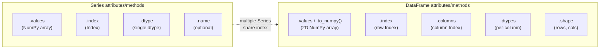
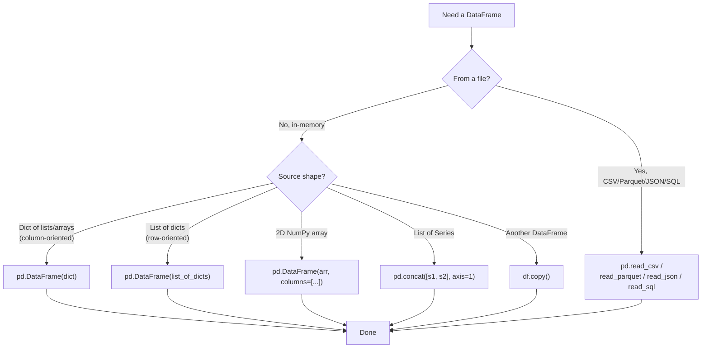

# 2. Series and DataFrame

> [!note] Why this note exists
> `Series` and `DataFrame` are the two workhorses of Pandas — every analysis you'll write starts by constructing one of them and ends by inspecting the result. This note covers the construction patterns (from dicts, lists of dicts, NumPy arrays, CSVs, and other DataFrames), the attributes (`index`, `columns`, `dtypes`, `shape`, `values`), the inspection methods (`head`, `tail`, `info`, `describe`, `value_counts`), and the modern nullable dtype system (`Int64`, `String`, `boolean`) introduced in Pandas 1.0+ and expanded with PyArrow in 2.0. Read alongside [[24. Pandas/1. Pandas Basics|1. Pandas Basics]] for the conceptual model and [[24. Pandas/3. Indexing and Selection|3. Indexing and Selection]] for how to access elements once they exist.

## Why It Matters

Construction and inspection are the first and last steps of every analysis. Knowing them well lets you:

- **Build DataFrames from any source.** Dicts, lists, NumPy arrays, CSVs, Excel files, SQL queries, JSON, Parquet — all have a one-line constructor.
- **Pick the right dtype upfront.** `Int64` (nullable) vs `int64` (NumPy, no NaN); `String` vs `object`; `category` for low-cardinality strings. Wrong choice = slow code or surprising NaN behaviour.
- **Inspect data quickly.** `df.info()`, `df.describe()`, `df.head()`, `df.value_counts()` — the four-method toolkit that tells you 80% of what you need to know about a new dataset.
- **Avoid memory blowups.** A DataFrame with `object` columns where you wanted `category`, or `float64` where `float32` would do, can use 4× the RAM.
- **Use PyArrow-backed types (Pandas 2.0+).** Faster strings, real nullable integers, native decimals, and better integration with the Arrow ecosystem.

## Background

### The construction landscape

Pandas DataFrames can be constructed from:

| Source | Constructor | Notes |
| ------ | ----------- | ----- |
| Dict of lists/arrays | `pd.DataFrame({'a': [1,2], 'b': [3,4]})` | Each key → column |
| List of dicts | `pd.DataFrame([{'a':1, 'b':3}, {'a':2, 'b':4}])` | Each dict → row |
| 2D NumPy array | `pd.DataFrame(arr, columns=[...])` | Must pass column names |
| List of Series | `pd.DataFrame([s1, s2])` | Each Series → row (use `.T` if you want columns) |
| Another DataFrame | `df.copy()` or `pd.DataFrame(df)` | Always copies |
| CSV | `pd.read_csv('file.csv')` | See [[24. Pandas/7. IO and File Formats|24. IO]] |
| Excel | `pd.read_excel('file.xlsx')` | Requires `openpyxl` |
| SQL | `pd.read_sql(query, conn)` | Requires SQLAlchemy |
| JSON | `pd.read_json('file.json')` | Various orientations |
| Parquet | `pd.read_parquet('file.parquet')` | Requires pyarrow or fastparquet |
| HTML | `pd.read_html(url)` | Returns a list of DataFrames (one per `<table>`) |
| Clipboard | `pd.read_clipboard()` | For pasting from Excel |

### The dtype system

Pandas has three layers of dtype support:

1. **NumPy-backed (legacy, default).** `int64`, `float64`, `bool`, `datetime64[ns]`, `object`. Limitations: no NaN in integer columns (integers become float64), `object` columns store Python objects (slow), strings have no native type.

2. **Pandas nullable (1.0+).** `Int64`, `Int32`, `UInt8`, `Float64`, `boolean`, `string`. These support `pd.NA` as a missing-value marker that works for all types. Use `df.convert_dtypes()` to upgrade.

3. **PyArrow-backed (2.0+).** `int64[pyarrow]`, `string[pyarrow]`, `bool[pyarrow]`, etc. Faster, real nullable, native decimals, larger type system. Use `dtype_backend='pyarrow'` in `read_csv` or `df.convert_dtypes(dtype_backend='pyarrow')`.

```python
import pandas as pd
import numpy as np

# NumPy-backed (default)
s1 = pd.Series([1, 2, 3])               # int64
s1_na = pd.Series([1, 2, np.nan])       # float64! (int upcast for NaN)

# Pandas nullable
s2 = pd.Series([1, 2, pd.NA], dtype='Int64')   # Int64 — keeps integer with NA
s3 = pd.Series(['a', 'b', pd.NA], dtype='string')  # string (nullable)

# PyArrow-backed (Pandas 2.0+)
s4 = pd.Series([1, 2, pd.NA], dtype='int64[pyarrow]')  # Arrow-backed
s5 = pd.Series(['a', 'b', pd.NA], dtype='string[pyarrow]')
```

## Main content

### Constructing Series

```python
import pandas as pd
import numpy as np

# From a list (default integer index)
pd.Series([1, 2, 3, 4])
# 0    1
# 1    2
# 2    3
# 3    4
# dtype: int64

# With a custom index
pd.Series([1, 2, 3], index=['a', 'b', 'c'])

# From a dict (keys become index)
pd.Series({'a': 1, 'b': 2, 'c': 3})

# From a NumPy array
pd.Series(np.random.rand(5))

# With a name
s = pd.Series([1, 2, 3], name='count')

# With explicit dtype
pd.Series([1, 2, 3], dtype='float32')
pd.Series([1, 2, 3], dtype='Int64')        # nullable
pd.Series([1, 2, 3], dtype='int64[pyarrow]')  # Arrow-backed

# Scalar with an index (broadcasts the scalar to all index positions)
pd.Series(5, index=['a', 'b', 'c'])
# a    5
# b    5
# c    5
```

### Constructing DataFrames

#### From a dict of lists

```python
df = pd.DataFrame({
    'name': ['Alice', 'Bob', 'Charlie'],
    'age': [30, 25, 35],
    'salary': [70000.0, 80000.0, 90000.0],
})
#       name  age  salary
# 0    Alice   30   70000
# 1      Bob   25   80000
# 2  Charlie   35   90000

# With a custom index
df = pd.DataFrame({...}, index=['row1', 'row2', 'row3'])
```

#### From a list of dicts

```python
records = [
    {'name': 'Alice', 'age': 30, 'salary': 70000.0},
    {'name': 'Bob', 'age': 25, 'salary': 80000.0},
    {'name': 'Charlie', 'age': 35, 'salary': 90000.0},
]
df = pd.DataFrame(records)
# Same result as above. Missing keys become NaN.
```

#### From a NumPy array

```python
arr = np.random.rand(5, 3)
df = pd.DataFrame(arr, columns=['a', 'b', 'c'])
```

#### From a list of Series

```python
s1 = pd.Series([1, 2, 3], name='a')
s2 = pd.Series([4, 5, 6], name='b')
df = pd.concat([s1, s2], axis=1)  # each Series becomes a column
# Or:
df = pd.DataFrame({s1.name: s1, s2.name: s2})
```

#### From another DataFrame (copy)

```python
df_copy = df.copy()         # deep copy (default)
df_shallow = df.copy(deep=False)  # shallow — shares underlying arrays

# Note: in Pandas 2.0+ with copy-on-write enabled, even shallow copies are
# safe — writes are transparently duplicated.
```

### Attributes

```python
df = pd.DataFrame({
    'name': ['Alice', 'Bob', 'Charlie'],
    'age': [30, 25, 35],
    'salary': [70000.0, 80000.0, 90000.0],
})

# Shape and size
df.shape          # (3, 3) — (rows, columns)
df.size           # 9 — total cells
df.ndim           # 2

# Labels
df.index          # RangeIndex(start=0, stop=3, step=1)
df.columns        # Index(['name', 'age', 'salary'], dtype='object')

# Types
df.dtypes         # column dtype Series
df['age'].dtype   # single column's dtype

# Underlying data
df.values         # 2D NumPy array (object dtype if mixed)
df.to_numpy()     # same, but newer API; accepts dtype= arg
df['age'].values  # 1D NumPy array

# Memory
df.memory_usage(deep=True)   # bytes per column
df.memory_usage(deep=True).sum()  # total bytes

# Names
df.columns.name = 'attributes'  # names the column axis
df.index.name = 'id'            # names the row axis
```

### Inspection methods

```python
# First / last rows
df.head()       # first 5 (or pass n)
df.head(10)     # first 10
df.tail()       # last 5
df.sample(5)    # 5 random rows

# Quick summary
df.info()                       # column dtypes, non-null counts, memory
df.info(memory_usage='deep')    # accurate memory including strings
df.info(verbose=False)          # compact summary

# Descriptive statistics
df.describe()                   # numeric columns only
df.describe(include='all')      # all columns
df.describe(include=['object']) # only object columns

# Per-column
df['age'].value_counts()        # frequency counts
df['age'].unique()              # unique values
df['age'].nunique()             # count of unique values

# Quick stats
df['salary'].mean()
df['salary'].median()
df['salary'].std()
df['salary'].min(), df['salary'].max()
df['salary'].quantile([0.25, 0.5, 0.75])
```

### Modifying structure

```python
# Add a column
df['age_squared'] = df['age'] ** 2

# Add a column at a specific position
df.insert(0, 'id', [1, 2, 3])  # column 'id' at position 0

# Drop columns
df = df.drop(columns=['age_squared'])
df = df.drop('age_squared', axis=1)  # equivalent

# Drop rows
df = df.drop(index=[0, 2])  # drop rows by label

# Rename
df = df.rename(columns={'age': 'years'})
df = df.rename(index={0: 'row0'})

# Reset index (turns index into a column, gives new RangeIndex)
df = df.reset_index()
df = df.reset_index(drop=True)  # don't keep old index as a column

# Set index
df = df.set_index('id')
df = df.set_index(['id', 'year'])  # MultiIndex

# Sort
df = df.sort_values('salary')
df = df.sort_values(['age', 'salary'], ascending=[True, False])
df = df.sort_index()  # sort by index labels

# Transpose
df_t = df.T  # rows <-> columns
```

### Sorting and ranking

```python
# Sort by column values
df = df.sort_values('salary')
df = df.sort_values('salary', ascending=False)
df = df.sort_values(['dept', 'salary'], ascending=[True, False])
df = df.sort_values('salary', kind='stable')  # stable sort (preserves ties' order)
df = df.sort_values('salary', na_position='first')  # NaNs at top or bottom

# Sort by index
df = df.sort_index()
df = df.sort_index(ascending=False, axis=1)  # sort columns by name

# Sort by multiple indexes (MultiIndex)
df = df.sort_index(level=['dept', 'team'])

# nlargest / nsmallest — top/bottom N (faster than sort_values + head)
df.nlargest(5, 'salary')
df.nsmallest(3, 'age')
df.nlargest(5, ['salary', 'age'])  # ties broken by second column

# Rank
df['rank'] = df['salary'].rank()                    # average rank for ties (default)
df['rank'] = df['salary'].rank(method='min')        # min rank for ties
df['rank'] = df['salary'].rank(method='dense')      # 1, 2, 2, 3 (no gaps)
df['rank'] = df['salary'].rank(method='first')      # rank by appearance
df['rank'] = df['salary'].rank(pct=True)            # percentile rank
df['rank'] = df['salary'].rank(ascending=False)
```

### Arithmetic and statistical methods

```python
# Element-wise arithmetic between columns (auto-aligned by index)
df['total'] = df['salary'] + df['bonus']
df['ratio'] = df['salary'] / df['years']

# Reductions
df['salary'].sum()
df['salary'].mean()
df['salary'].median()
df['salary'].std()                # sample std (ddof=1, default)
df['salary'].var(ddof=0)          # population std (ddof=0)
df['salary'].quantile([0.25, 0.5, 0.75])
df['salary'].cumsum()
df['salary'].cummax()
df['salary'].cummin()
df['salary'].cumprod()

# Difference and pct change
df['salary'].diff()                # salary - salary.shift(1)
df['salary'].pct_change()          # relative change

# Correlation
df['salary'].corr(df['years'])     # Pearson
df['salary'].corr(df['years'], method='spearman')
df.corr()                          # full correlation matrix
df.cov()                           # covariance matrix

# Cross-tabulation
pd.crosstab(df['dept'], df['level'])
pd.crosstab(df['dept'], df['level'], normalize='index')  # row-wise %

# Binning
pd.cut(df['age'], bins=[0, 25, 35, 50, 100],
       labels=['<25', '25-35', '35-50', '50+'])
pd.qcut(df['salary'], q=4, labels=['Q1', 'Q2', 'Q3', 'Q4'])  # quantile bins
```

### Type conversion

```python
# Single column
df['age'] = df['age'].astype(np.int32)
df['age'] = df['age'].astype('Int64')  # nullable
df['salary'] = df['salary'].astype('float32')

# Multiple columns
df = df.astype({'age': 'int32', 'salary': 'float32'})

# Convert all inference-friendly columns to nullable types
df = df.convert_dtypes()                          # Pandas nullable
df = df.convert_dtypes(dtype_backend='pyarrow')   # PyArrow (2.0+)

# String to datetime
df['date'] = pd.to_datetime(df['date_str'])

# Numeric to category
df['country'] = df['country'].astype('category')

# Category to dummy variables
dummies = pd.get_dummies(df['country'], prefix='country')
```

### Adding and combining

```python
# Append a row (deprecated — use pd.concat)
new_row = pd.DataFrame([{'name': 'Dave', 'age': 40, 'salary': 100000.0}])
df = pd.concat([df, new_row], ignore_index=True)

# Append multiple DataFrames
df_all = pd.concat([df1, df2, df3], ignore_index=True)

# Horizontal concatenation (add columns)
df_wide = pd.concat([df1, df2], axis=1)

# Merge (SQL JOIN)
merged = pd.merge(df_employees, df_departments, on='dept_id', how='left')

# Join (index-based)
joined = df1.join(df2, how='inner', lsuffix='_left', rsuffix='_right')
```

### Series vs DataFrame side by side



### Construction decision tree



### Dtype promotion and NA handling

```python
import pandas as pd
import numpy as np

# NumPy-backed: int + NaN -> float (loses integer dtype!)
s = pd.Series([1, 2, 3], dtype='int64')
s.iloc[1] = np.nan   # silently upcast to float64

# Pandas nullable Int64 keeps integer
s = pd.Series([1, 2, 3], dtype='Int64')
s.iloc[1] = pd.NA    # still Int64, with NA marker

# Object dtype + None (slow but flexible)
s = pd.Series(['a', None, 'c'], dtype='object')

# String dtype (Pandas 1.0+) — better
s = pd.Series(['a', None, 'c'], dtype='string')

# PyArrow-backed (2.0+) — best
s = pd.Series(['a', None, 'c'], dtype='string[pyarrow]')

# Why does this matter? Performance:
import timeit
big = pd.Series(['hello'] * 1_000_000 + [None])
%timeit big.str.upper()   # object: ~100 ms; string[pyarrow]: ~5 ms
```

### Categorical dtype

```python
# Low-cardinality strings (e.g., country codes) benefit from category
df['country'] = df['country'].astype('category')

# Memory: 'US', 'UK', 'CA' as object = 3 pointers per row.
# As category = 1 integer per row + 3-element lookup table.

# Operations are faster too:
df.groupby('country')['salary'].mean()  # faster on category

# Ordered categories
df['size'] = pd.Categorical(df['size'], categories=['S', 'M', 'L'], ordered=True)
df[df['size'] > 'M']  # works because category is ordered

# Caveat: adding a new category requires .cat.add_categories()
```

### Inspection patterns

```python
# A new dataset — what to run first:
df = pd.read_csv('data.csv')

print(df.shape)           # rows, columns
print(df.head())          # peek
print(df.info())          # dtypes, missing counts
print(df.describe())      # numeric summary
print(df.describe(include='object'))  # categorical summary
print(df.isna().sum())    # missing per column
print(df.duplicated().sum())  # duplicate rows

# For categorical columns:
for col in df.select_dtypes(include=['object', 'category']):
    print(f"\n{col}:")
    print(df[col].value_counts().head(10))

# For numeric columns:
df.hist(figsize=(12, 8), bins=30)  # quick distribution check
```

### Index operations

```python
# Set / reset / reindex
df = df.set_index('id')              # use 'id' as the index
df = df.set_index(['dept', 'id'])    # MultiIndex
df = df.reset_index()                # index becomes a column
df = df.reset_index(drop=True)       # discard old index

# Reindex to a new set of labels (introduces NaN for missing)
s = pd.Series([1, 2, 3], index=['a', 'b', 'c'])
s.reindex(['a', 'b', 'c', 'd', 'e'])  # 'd' and 'e' are NaN

# Reindex with fill
s.reindex(['a', 'b', 'c', 'd'], fill_value=0)

# Align two DataFrames by index
df1.align(df2)             # returns (df1_aligned, df2_aligned)
df1.align(df2, join='inner')  # only common index
df1.align(df2, fill_value=0)

# Rename axis labels
df.rename(columns={'old': 'new'})
df.rename(index={'a': 'A'})
df.rename_axis('id', axis=0)         # name the index
df.rename_axis('attributes', axis=1) # name the columns

# Check index properties
df.index.is_unique       # are all labels unique?
df.index.has_duplicates  # any duplicates?
df.index.is_monotonic_increasing
df.index.dtype
```

## Common Pitfalls

1. **`df['col']` returns a Series, `df[['col']]` returns a DataFrame.** Mixing these up causes shape mismatch errors downstream.

2. **`df.col` for column access fails on reserved names.** `df.size`, `df.count`, `df.index` are DataFrame methods/attributes, not columns. Use `df['size']` always.

3. **Default `int64` + NaN becomes `float64`.** If you have integer data with missing values, use `Int64` (nullable) or `int64[pyarrow]`.

4. **`object` dtype is slow.** Strings in `object` columns are Python objects — no SIMD, no fast string ops. Use `string` (Pandas 1.0+) or `string[pyarrow]` (2.0+).

5. **`df.values` on mixed-dtype DataFrames returns `object` array.** Use `df.to_numpy(dtype='float64')` or select specific columns.

6. **Forgetting that `df.copy()` defaults to deep copy.** It's safe but slow. Use `df.copy(deep=False)` for a shallow view (or rely on copy-on-write in Pandas 3.0).

7. **`pd.concat` with `ignore_index=False` (default) creates duplicate index labels.** Usually you want `ignore_index=True` when stacking.

8. **Using `df.append` (deprecated).** Use `pd.concat([df, new_df])` instead. `df.append` is removed in Pandas 2.0.

9. **Reading CSV without `dtype` specification.** Pandas infers, which can produce `object` for strings and `int64` where you wanted `Int32`. Pass `dtype=` explicitly.

10. **`df.astype('int')` on a column with NaN raises.** Use `df.astype('Int64')` (nullable) or fillna first.

11. **`pd.to_datetime` on a Series with mixed formats is slow.** Pass `format='%Y-%m-%d'` for a 10× speedup.

12. **`df.info()` without `memory_usage='deep'` underestimates memory for object columns.** It only counts pointer sizes, not the underlying strings.

13. **Building a DataFrame row-by-row with `pd.concat` in a loop is O(n²).** Build a list of records and call `pd.DataFrame(records)` once.

14. **`df = df.drop(...)` doesn't modify in place by default.** Without `inplace=True`, you must reassign. Pandas 3.0 will deprecate `inplace=True` — get used to `df = df.method()`.

15. **`df.insert` modifies in place.** Unlike most Pandas methods, `insert` doesn't return a new DataFrame. Easy to miss.

16. **`df.set_index('id')` returns a new DataFrame.** You must reassign: `df = df.set_index('id')`.

17. **`df.dtypes` returns a Series, not a dict.** To access a single column's dtype, use `df['col'].dtype` or `df.dtypes['col']`.

18. **`pd.Categorical` without `ordered=True` is unordered.** Comparisons like `df[df['size'] > 'M']` raise `TypeError` on unordered categoricals.

## Tips and Tricks

- **`df.convert_dtypes()` upgrades to nullable types.** Run this after `read_csv` for cleaner NA handling.
- **`dtype_backend='pyarrow'` (Pandas 2.0+) for Arrow-backed types.** Often 5-10× faster for string operations.
- **`df.memory_usage(deep=True).sum()` for true memory size.** Critical before deciding whether to chunk.
- **`df.select_dtypes(include='number')` to filter columns by dtype.** Useful for plotting or applying the same transform to numeric columns.
- **`pd.api.types.is_numeric_dtype(s)` for programmatic dtype checks.**
- **`df.astype({...})` for batch type conversion.** Cleaner than chained `astype` calls.
- **`pd.CategoricalDtype(categories=['S','M','L'], ordered=True)` for reusable categorical types.**
- **`df.insert(loc, name, value)` to add a column at a specific position.** Rare but useful.
- **`df.pop('col')` to remove and return a column.** Like `dict.pop`.
- **`df.assign(new_col=...)` for chainable column creation.** `df.assign(age_sq=lambda d: d['age'] ** 2)`.
- **`df.eval('age_sq = age ** 2', inplace=True)` for string-expression column creation.** Sometimes faster than Python-level arithmetic.
- **`df.value_counts(subset=['col1', 'col2'])` for multi-column frequency tables.** Replaces `groupby` + `size`.
- **`pd.crosstab(df['a'], df['b'])` for contingency tables.**
- **`df.pipe(func, *args)` for chaining functions that take a DataFrame.** Cleaner than nested function calls.
- **`pd.testing.assert_frame_equal` for tests.** Handles NaN comparison correctly.
- **`df.style.applymap(...)` for styled HTML output in Jupyter.**
- **`pd.set_option('display.max_columns', None)` to show all columns.**
- **`pd.set_option('display.float_format', '{:,.2f}'.format)` for thousands separators.**
- **`df.to_dict('records')` to export as a list of dicts.** Useful for API responses.
- **`df.to_dict('tight')` for a compact serialisable form.** Round-trips with `pd.DataFrame.from_dict(..., orient='tight')`.
- **`df.attrs` to attach arbitrary metadata.** Survives most operations.

## Active Recall

1. Construct a DataFrame from a dict of lists, a list of dicts, and a 2D NumPy array.
2. What's the difference between `df['col']` and `df[['col']]`?
3. What does `df.values` return on a mixed-dtype DataFrame? What's the alternative?
4. Why does `pd.Series([1, 2, np.nan])` end up as `float64`? What's the fix?
5. What's the difference between `int64`, `Int64`, and `int64[pyarrow]`?
6. What does `df.convert_dtypes()` do?
7. What does `dtype_backend='pyarrow'` do in `pd.read_csv`?
8. How would you add a column at a specific position?
9. How would you drop a row by index label? A column by name?
10. What's the difference between `df.set_index('id')` and `df.reset_index()`?
11. What's `pd.Categorical` for? When does ordering matter?
12. How would you accurately measure a DataFrame's memory usage?
13. What's the difference between `df.info()` and `df.describe()`?
14. How would you check the unique values in a column? Their counts?
15. Why is `df.append` deprecated? What's the replacement?
16. How would you stack three DataFrames vertically?
17. What's the difference between `pd.merge` and `df.join`?
18. What's `df.assign` for? Give an example.
19. How would you convert a string column to datetime?
20. What's the canonical first-look inspection pipeline for a new DataFrame?

## Next Steps

- [[24. Pandas/1. Pandas Basics|1. Pandas Basics]] — the conceptual model.
- [[24. Pandas/3. Indexing and Selection|3. Indexing and Selection]] — accessing elements of the structures you just built.
- [[24. Pandas/4. Data Cleaning|4. Data Cleaning]] — handling the NaNs and dtypes you'll discover.
- [[24. Pandas/5. GroupBy Operations|5. GroupBy Operations]] — aggregating your DataFrame.
- [[24. Pandas/6. Time Series|6. Time Series]] — using datetime indexes.
- [[24. Pandas/7. IO and File Formats|7. IO and File Formats]] — loading data from disk.
- [[23. NumPy/1. NumPy Basics|NumPy Basics]] — the underlying array model.
