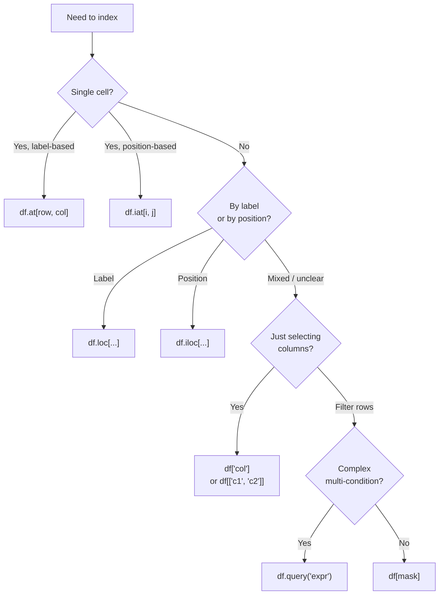

# 3. Indexing and Selection

> [!note] Why this note exists
> Pandas indexing is famously confusing — there's `[]`, `loc`, `iloc`, `at`, `iat`, `query`, `isin`, and the dreaded `SettingWithCopyWarning`. This note is the field guide: when to use each method, how they differ on label vs position semantics, why chained indexing is dangerous, and how to express SQL-like selections (`SELECT`, `WHERE`, `WHERE col IN (...)`) idiomatically. Read alongside [[24. Pandas/2. Series and DataFrame|2. Series and DataFrame]] for the structures being indexed, and [[24. Pandas/4. Data Cleaning|4. Data Cleaning]] for the boolean-mask patterns you'll use to filter rows.

## Why It Matters

Indexing is the most-used Pandas operation. The four-method split (`[]`, `loc`, `iloc`, `at`/`iat`) exists for good reasons — label-based and position-based access have different semantics — but the result is that beginners often:

- Use `df[5]` expecting row 5 (gets column '5' or raises).
- Chain `df[df['age'] > 18]['name']` and get a `SettingWithCopyWarning`.
- Mix `loc` and `iloc` and get the wrong rows.
- Don't know `query()` exists, so they write nested boolean masks that nobody can read.

Knowing the indexing API well lets you:

- **Pick the right method instantly.** `loc` for labels, `iloc` for positions, `at`/`iat` for single cells, `[]` for columns.
- **Avoid `SettingWithCopyWarning`.** Use `df.loc[mask, 'col'] = value` instead of `df[mask]['col'] = value`.
- **Write readable filter expressions.** `df.query("age > 18 and dept == 'eng'")` beats `df[(df['age'] > 18) & (df['dept'] == 'eng')]` for complex conditions.
- **Reason about index alignment.** Pandas aligns on labels, not positions — knowing this prevents a class of bugs.
- **Select efficiently.** `at`/`iat` are 10× faster than `loc`/`iloc` for single cells.

## Background

### Why four indexing methods

Pandas supports two access semantics:

1. **Label-based.** `df.loc['a']` selects the row whose index label is `'a'`. If your index is `['a', 'b', 'c']`, this is unambiguous.
2. **Position-based.** `df.iloc[0]` selects the first row, regardless of what its label is. If the index is `['a', 'b', 'c']`, `iloc[0]` returns the 'a' row.

These can give different results when the index isn't `RangeIndex(0, N)`:

```python
df = pd.DataFrame({'x': [10, 20, 30]}, index=['a', 'b', 'c'])
df.loc['a']   # row with label 'a' — x=10
df.iloc[0]    # first row — also x=10 here
df.iloc['a']  # TypeError
df.loc[0]     # KeyError — no label 0
```

The split exists because real-world data has non-integer indexes (strings, dates, IDs), and you need to be explicit about which semantics you want. Python's `[]` operator is overloaded:

- `df['col']` — column selection by label.
- `df[boolean_mask]` — row filtering.
- `df[5:10]` — row slicing by *position* (confusingly, not label).

The `[]` operator is fine for column access and basic filtering, but for anything else, prefer the explicit `loc`/`iloc`.

### The `SettingWithCopyWarning` problem

```python
df = pd.DataFrame({'age': [20, 25, 30, 35], 'salary': [50, 60, 70, 80]})

# Chain indexing — Pandas can't tell if you mean to modify df or a copy
df[df['age'] > 25]['salary'] = 999   # SettingWithCopyWarning, may not modify df

# Correct: use loc with row mask + column selector
df.loc[df['age'] > 25, 'salary'] = 999   # modifies df, no warning
```

The warning exists because `df[mask]` *might* return a copy (depending on Pandas internals), so the subsequent `['salary'] = 999` might modify the copy and not the original. Pandas 3.0 makes this an error — get used to the `loc` pattern now.

## Main content

### Column selection with `[]`

```python
df = pd.DataFrame({
    'name': ['Alice', 'Bob', 'Charlie'],
    'age': [30, 25, 35],
    'salary': [70, 80, 90],
})

# Single column (Series)
df['age']           # Series, shape (3,)
df.age              # attribute access — works only for valid identifiers

# Multiple columns (DataFrame)
df[['name', 'age']]  # DataFrame, shape (3, 2)

# Column by position (rarely used)
df[df.columns[0]]    # first column

# Add a column
df['bonus'] = df['salary'] * 0.1
```

> [!warning] `df.col` is unsafe for some column names
> `df.count`, `df.size`, `df.index` are DataFrame methods/attributes — they don't return the column. Always use `df['col']`.

### `df.loc` — label-based

`loc` selects by label. It accepts row labels, column labels, or both:

```python
df = pd.DataFrame({
    'name': ['Alice', 'Bob', 'Charlie'],
    'age': [30, 25, 35],
}, index=['a', 'b', 'c'])

# Row by label
df.loc['a']           # Series — row 'a'
df.loc[['a', 'c']]    # DataFrame — rows 'a' and 'c'

# Row + column
df.loc['a', 'name']   # scalar — 'Alice'
df.loc[['a', 'b'], ['name', 'age']]   # DataFrame

# Slicing (label-inclusive! unlike Python slicing)
df.loc['a':'c']       # rows 'a', 'b', 'c' — INCLUSIVE of 'c'
df.loc[:, 'name':'age']  # all rows, columns 'name' through 'age'

# Boolean mask (row filtering)
df.loc[df['age'] > 28]                # rows where age > 28
df.loc[df['age'] > 28, 'name']        # just the names of those rows
df.loc[df['age'] > 28, ['name', 'age']]   # multiple columns

# Assignment via loc
df.loc['a', 'age'] = 31               # modify a single cell
df.loc[df['age'] > 28, 'salary'] = 999  # conditional assignment
```

> [!tip] `loc` slices are inclusive on both ends
> Python lists slice `[start:stop]` exclusive of `stop`. Pandas `loc['a':'c']` is inclusive of `'c'` — because labels can be non-numeric, "up to but not including" doesn't make sense. `iloc` follows Python's exclusive convention.

### `df.iloc` — position-based

`iloc` mirrors `loc` but uses integer positions:

```python
# Row by position
df.iloc[0]            # first row
df.iloc[-1]           # last row
df.iloc[[0, 2]]       # first and third rows

# Row + column
df.iloc[0, 1]         # first row, second column (scalar)
df.iloc[0:2, 0:2]     # 2x2 sub-matrix (exclusive, Python-style)

# Boolean mask (rarely used with iloc — prefer loc)
df.iloc[[True, False, True]]   # rows 0 and 2

# Assignment
df.iloc[0, 1] = 26
```

### `df.at` and `df.iat` — single-cell access

For getting or setting a single cell, `at`/`iat` are 5–10× faster than `loc`/`iloc`:

```python
# at — label-based, single cell
df.at['a', 'age']     # get
df.at['a', 'age'] = 31  # set

# iat — position-based, single cell
df.iat[0, 1]          # get
df.iat[0, 1] = 31     # set
```

Use these in tight loops where `loc` would be too slow. For vectorised operations, you don't need them.

### Boolean indexing

```python
# Single condition
df[df['age'] > 28]

# Multiple conditions (use &, |, ~ — not and, or, not)
df[(df['age'] > 25) & (df['age'] < 35)]
df[(df['age'] < 25) | (df['age'] > 35)]
df[~(df['age'] > 28)]

# Isin — equivalent to SQL IN
df[df['name'].isin(['Alice', 'Charlie'])]

# Negation of isin
df[~df['name'].isin(['Alice'])]

# String matching
df[df['name'].str.startswith('A')]
df[df['name'].str.contains('li', case=False)]

# Null checks
df[df['salary'].isna()]
df[df['salary'].notna()]

# Between
df[df['age'].between(25, 35)]

# Combine with column selection via loc
df.loc[df['age'] > 28, ['name', 'salary']]
```

> [!warning] Parenthesise compound boolean conditions
> `df['age'] > 25 & df['age'] < 35` is parsed as `df['age'] > (25 & df['age']) < 35` — bitwise `&` binds tighter than comparisons. Always parenthesise: `(df['age'] > 25) & (df['age'] < 35)`.

### `df.query` — SQL-style filtering

```python
# Basic
df.query('age > 28')
df.query('age > 25 and age < 35')
df.query('age > 25 or salary > 85')
df.query('not age > 28')

# String columns
df.query("name == 'Alice'")
df.query("name in ['Alice', 'Charlie']")
df.query("name not in ['Bob']")

# Refer to local variables with @
threshold = 28
df.query('age > @threshold')

# Column-to-column comparison
df.query('salary > age * 2')

# Index access
df.query('index == "a"')

# For DataFrames with multi-index:
df.query('level_0 == "a"')

# Performance: query() is sometimes faster than boolean indexing for large frames
# because it avoids materialising intermediate boolean arrays. Often similar though.
```

`query` is most useful for:
- Complex multi-condition filters where boolean indexing gets unreadable.
- Filters that reference local Python variables (`@var`).
- Generated code (you can build query strings programmatically).

It's less useful for:
- Simple single-column filters (boolean indexing is clearer).
- Filters involving complex function calls (query can't express `str.upper()`).

### Indexing methods comparison

```mermaid
flowchart TB
    root["Pandas indexing methods"]

    root --> bracket["df[...]<br/>(ambiguous)"]
    root --> loc["df.loc[...]<br/>(label-based)"]
    root --> iloc["df.iloc[...]<br/>(position-based)"]
    root --> at_iat["df.at / df.iat<br/>(single cell)"]
    root --> query["df.query()<br/>(string expression)"]
    root --> isin["df.isin()<br/>(membership)"]

    bracket --> b1["df['col'] -> Series<br/>(column by label)"]
    bracket --> b2["df[['c1', 'c2']] -> DataFrame"]
    bracket --> b3["df[mask] -> filtered rows"]
    bracket --> b4["df[5:10] -> rows 5-9<br/>(position-based, exclusive)"]

    loc --> l1["df.loc[label] -> row<br/>(by label, inclusive slicing)"]
    loc --> l2["df.loc[mask, 'col'] -> set cells"]
    loc --> l3["df.loc['a':'c'] -> INCLUSIVE"]

    iloc --> i1["df.iloc[0] -> first row"]
    iloc --> i2["df.iloc[0:2] -> EXCLUSIVE"]
    iloc --> i3["df.iloc[0, 1] -> scalar"]

    at_iat --> a1["df.at['a', 'col'] -> scalar (fast)"]
    at_iat --> a2["df.iat[0, 1] -> scalar (fast)"]

    query --> q1["df.query('age > 28')"]
    query --> q2["df.query('col > @local_var')"]

    isin --> i4["df[df['col'].isin([...])]"]
```



### When to use what



### Setting values safely

```python
# BAD — chained indexing, raises SettingWithCopyWarning
df[df['age'] > 25]['salary'] = 999

# GOOD — single .loc access
df.loc[df['age'] > 25, 'salary'] = 999

# BAD — modifying a column slice in place
subset = df[df['age'] > 25]
subset['salary'] = 999  # may or may not modify df

# GOOD — explicit copy
subset = df[df['age'] > 25].copy()
subset['salary'] = 999  # modifies subset, not df

# GOOD — modify via loc
df.loc[df['age'] > 25, 'salary'] = 999

# Conditional assignment with np.where
import numpy as np
df['category'] = np.where(df['age'] > 30, 'senior', 'junior')

# Vectorised conditional with multiple branches
df['category'] = np.select(
    [df['age'] < 25, df['age'] < 35, df['age'] >= 35],
    ['junior', 'mid', 'senior'],
    default='unknown',
)
```

### Index alignment

Pandas aligns on labels when combining Series/DataFrames:

```python
s1 = pd.Series([1, 2, 3], index=['a', 'b', 'c'])
s2 = pd.Series([10, 20, 30], index=['b', 'c', 'd'])

s1 + s2
# a     NaN   (s2 has no 'a')
# b    12.0
# c    23.0
# d     NaN   (s1 has no 'd')
# dtype: float64

# Fill non-matching with 0 instead of NaN
s1.add(s2, fill_value=0)
# a     1.0
# b    12.0
# c    23.0
# d    30.0
```

This is powerful but surprising if you expected position-based behaviour. Use `.values` (NumPy) if you want position-based arithmetic:

```python
s1.values + s2.values  # array([11, 22, 33]) — position-based, no alignment
```

### MultiIndex indexing

```python
# Create a MultiIndex DataFrame
df = pd.DataFrame({
    'value': [1, 2, 3, 4],
}, index=pd.MultiIndex.from_tuples(
    [('a', 1), ('a', 2), ('b', 1), ('b', 2)],
    names=['letter', 'number'],
))

# Select by outer level
df.loc['a']          # all rows where letter='a'

# Select by tuple (specific row)
df.loc[('a', 1)]     # the row where letter='a', number=1

# Cross-section (xs) — select by inner level
df.xs(1, level='number')   # all rows where number=1, regardless of letter

# Partial slicing
df.loc[('a', ):('b', )]    # all rows where letter is 'a' or 'b'

# Query by index
df.query('letter == "a"')
```

### Reshaping: melt, pivot, stack, unstack

Pandas has a family of methods for reshaping between long and wide formats. These are cousins of indexing — they rearrange how data is laid out:

```python
# melt: wide -> long (gather columns into rows)
wide = pd.DataFrame({
    'id': [1, 2, 3],
    'q1': [10, 20, 30],
    'q2': [15, 25, 35],
})
long = wide.melt(id_vars='id', var_name='quarter', value_name='revenue')
#    id quarter  revenue
# 0   1      q1       10
# 1   2      q1       20
# ...

# pivot: long -> wide (spread rows into columns)
wide2 = long.pivot(index='id', columns='quarter', values='revenue')
# quarter  q1  q2
# id
# 1        10  15
# 2        20  25
# 3        30  35

# pivot_table: like pivot but with aggregation (handles duplicate index entries)
pd.pivot_table(long, index='id', columns='quarter', values='revenue', aggfunc='sum')

# stack / unstack: move between index levels and columns
df_multi = wide.set_index('id')
stacked = df_multi.stack()        # columns become inner index level
unstacked = stacked.unstack()     # back to original

# explode: expand list-valued rows
df = pd.DataFrame({'a': [[1, 2, 3], [4, 5]], 'b': ['x', 'y']})
df.explode('a')
#      a  b
# 0    1  x
# 0    2  x
# 0    3  x
# 1    4  y
# 1    5  y
```

### Common idioms

```python
# 1. Filter + select + assign in one line
df.loc[df['age'] > 25, 'category'] = 'senior'

# 2. Where clause with column selection (SELECT col FROM df WHERE cond)
df.loc[df['age'] > 25, ['name', 'salary']]

# 3. Top-N per group
df.sort_values('salary', ascending=False).groupby('dept').head(3)

# 4. Update a column based on another
df.loc[df['salary'] < 60, 'salary'] = df['salary'] * 1.5

# 5. Sample N rows
df.sample(n=10)
df.sample(frac=0.1)  # 10% of rows

# 6. Random split
df_train = df.sample(frac=0.8, random_state=42)
df_test = df.drop(df_train.index)

# 7. Get rows where index matches a list
df.loc[df.index.intersection(some_list)]

# 8. Iteration (prefer vectorised alternatives)
for idx, row in df.iterrows():   # slow
    ...
for row in df.itertuples():      # faster
    ...

# 9. Apply a function to each row (slow — prefer vectorisation)
df.apply(lambda row: row['salary'] / row['age'], axis=1)

# 10. Cross-tab / pivot
pd.crosstab(df['dept'], df['level'])
df.pivot_table(values='salary', index='dept', columns='level', aggfunc='mean')

# 11. Select by absolute position in sorted order
df.nlargest(5, 'salary')        # top 5 by salary (faster than sort_values + head)
df.nsmallest(3, 'age')          # bottom 3 by age

# 12. Conditional column update
df.loc[df['age'] < 25, 'category'] = 'junior'
df.loc[df['age'].between(25, 35), 'category'] = 'mid'
df.loc[df['age'] > 35, 'category'] = 'senior'

# 13. Map a column to new values (like SQL CASE)
df['dept_code'] = df['dept'].map({'eng': 1, 'sales': 2, 'hr': 3})

# 14. Cut a numeric column into bins
df['age_group'] = pd.cut(df['age'], bins=[0, 25, 35, 50, 100],
                         labels=['<25', '25-35', '35-50', '50+'])

# 15. Quantile-based bins
df['salary_quartile'] = pd.qcut(df['salary'], q=4,
                                 labels=['Q1', 'Q2', 'Q3', 'Q4'])
```

## Common Pitfalls

1. **`df[5]` doesn't select row 5.** It tries to select column 5 (KeyError if no such column). Use `df.iloc[5]` for row 5.

2. **Chained indexing: `df[mask]['col'] = val`.** Raises `SettingWithCopyWarning` and may silently fail. Use `df.loc[mask, 'col'] = val`.

3. **Forgetting `&`/`|` need parentheses.** `(df['a'] > 5) & (df['b'] < 3)` — without parens, `&` binds tighter than `>`.

4. **Mixing `loc` and `iloc` semantics.** `df.loc[0]` is by label (could be KeyError if 0 isn't a label); `df.iloc[0]` is by position (always the first row).

5. **`loc['a':'c']` is inclusive.** Unlike Python slicing, both endpoints are included. `iloc[0:2]` is exclusive (Python-style).

6. **`df.col` for columns named like methods.** `df.count`, `df.size`, `df.values` are DataFrame attributes, not columns. Always use `df['col']`.

7. **Boolean mask shape mismatch.** `df[df['age'] > 25]` requires the mask to match `df`'s index exactly. A mask from a different DataFrame won't work without reindexing.

8. **Index alignment surprises in arithmetic.** `s1 + s2` aligns on labels, not positions. Use `.values` or `np.asarray` for position-based.

9. **Using `==` to compare with NaN.** `np.nan == np.nan` is `False`. Use `pd.isna()` or `.isna()`.

10. **`df.set_index('col', drop=False)` to keep the column.** Default is `drop=True`, which removes the column from the data.

11. **Forgetting that `loc` accepts boolean masks.** `df.loc[df['age'] > 25, 'name']` is the idiomatic filter+select.

12. **`df.iloc[boolean_mask]` works but is rarely idiomatic.** Use `df.loc[mask]` instead — same result, clearer intent.

13. **`query` with column names containing spaces.** Doesn't work — `df.query("first name == 'Alice'")` is a syntax error. Use backticks: `df.query("\`first name\` == 'Alice'")` (Pandas 0.25+).

14. **`df.isin([1, 2, 3])` on a DataFrame (not Series).** Returns a same-shape DataFrame of booleans — useful but easy to misread.

15. **Resetting index loses data.** `df.reset_index(drop=True)` discards the old index. Without `drop=True`, the old index becomes a column.

16. **Modifying a copy instead of the original.** `subset = df[mask]; subset['col'] = val` may not modify `df`. Always use `loc` for in-place modification, or `.copy()` explicitly.

17. **`df.sample(frac=1)` to shuffle.** Works but `df = df.sample(frac=1).reset_index(drop=True)` is the canonical pattern.

18. **Using `df.iterrows()` in production code.** Slow. Use `itertuples()` if you must loop, or vectorise.

## Tips and Tricks

- **`df.loc[mask, col] = value` is the safe assignment pattern.** Use it instead of chained indexing.
- **`df.at[row, col]` for single-cell get/set.** 10× faster than `loc`.
- **`df.query("age > 25 and dept == 'eng'")` for complex filters.** More readable than nested boolean masks.
- **`@var` in `query` to reference Python variables.**
- **`df[col].isin(values)` for SQL `IN`.** `~df[col].isin(values)` for `NOT IN`.
- **`df[col].between(lo, hi)` for range filters.** Cleaner than `(df[col] >= lo) & (df[col] <= hi)`.
- **`df[col].str.contains(pattern, case=False, regex=True)` for text search.**
- **`df.sample(n=10)` or `df.sample(frac=0.1)` for random subsets.** Pass `random_state=` for reproducibility.
- **`df.nlargest(n, 'col')` / `df.nsmallest(n, 'col')` for top/bottom N.** Faster than `sort_values().head(n)`.
- **`df.drop_duplicates(subset=['col1', 'col2'])` to deduplicate.**
- **`df.duplicated(keep=False)` to mark ALL duplicates (not just the second+ occurrences).**
- **`pd.crosstab(df['a'], df['b'])` for contingency tables.**
- **`df.pivot_table(...)` for Excel-style pivots.**
- **`df.melt(...)` to wide-to-long reshape.**
- **`df.explode('col')` to expand list-valued rows into multiple rows.**
- **`df.itertuples()` for fast row iteration.** Faster than `iterrows`, returns namedtuples.
- **`df.to_dict('records')` for a list of dicts.**
- **`df.style.applymap(...)` for HTML styling in Jupyter.**
- **`pd.set_option('mode.copy_on_write', True)` to opt into Pandas 3.0 behaviour.**
- **For hierarchical data, use `MultiIndex` and `df.xs(level=...)`.**
- **`df.loc[pd.IndexSlice[:, 'inner'], :]` for complex MultiIndex slicing.**

## Active Recall

1. What's the difference between `df.loc` and `df.iloc`?
2. Is `df.loc['a':'c']` inclusive or exclusive? What about `df.iloc[0:2]`?
3. What's `df.at`? When is it better than `df.loc`?
4. Why does `df[df['age'] > 25]['salary'] = 999` raise a warning? What's the fix?
5. How do you combine two boolean conditions in Pandas? Why do you need parentheses?
6. What's the Pandas equivalent of SQL `WHERE col IN (1, 2, 3)`?
7. How do you reference a Python variable inside `df.query`?
8. What does `df.between(25, 35)` return? What's it shorthand for?
9. How would you select rows where `col` is null? Not null?
10. What does `df.loc[mask, 'col'] = value` do that `df[mask]['col'] = value` doesn't?
11. How do you select a single cell? What's the fastest method?
12. What's the difference between `df['col']` and `df.col`?
13. How would you shuffle a DataFrame?
14. How would you get the top 5 rows by a column?
15. What does `df.reset_index()` do? What about `drop=True`?
16. How would you select rows from a MultiIndex DataFrame by the inner level only?
17. What's `pd.IndexSlice` for?
18. How does index alignment work when adding two Series?
19. What's the canonical way to iterate over rows if you must?
20. What does `df.explode('col')` do?

## Next Steps

- [[24. Pandas/2. Series and DataFrame|2. Series and DataFrame]] — the structures being indexed.
- [[24. Pandas/1. Pandas Basics|1. Pandas Basics]] — the conceptual model.
- [[24. Pandas/4. Data Cleaning|4. Data Cleaning]] — boolean masks for filtering bad data.
- [[24. Pandas/5. GroupBy Operations|5. GroupBy Operations]] — `groupby` returns a special indexed object.
- [[24. Pandas/6. Time Series|6. Time Series]] — `DatetimeIndex` for time-based selection.
- [[24. Pandas/7. IO and File Formats|7. IO and File Formats]] — setting index on read.
- [[23. NumPy/3. Indexing and Slicing|NumPy Indexing]] — the underlying array indexing model.
