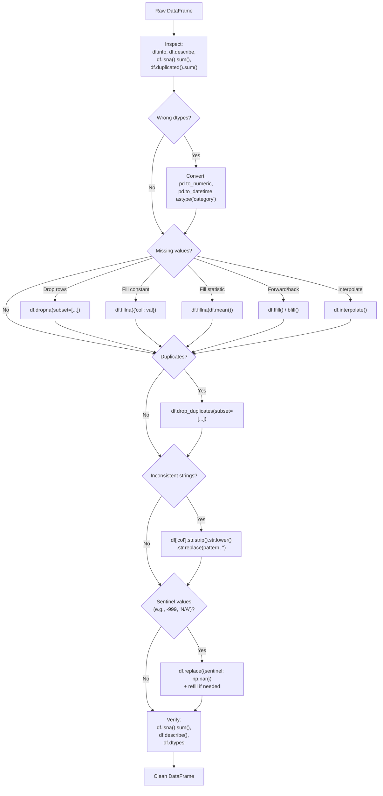

# 4. Data Cleaning

> [!note] Why this note exists
> Real-world data is messy: missing values, duplicate rows, wrong types, inconsistent string casing, outliers encoded as 999, dates in three different formats, and "N/A" strings in numeric columns. Pandas ships a complete toolkit for cleaning it: `isna`/`isnull`, `dropna`/`fillna`, `ffill`/`bfill`, `interpolate`, `duplicated`/`drop_duplicates`, `astype`, `.str` accessor, and `.dt` accessor. This note covers the full workflow — detect → clean → verify — for each kind of dirty data, with attention to the modern nullable types (`Int64`, `string`, `boolean`) that fix long-standing NaN headaches. Read alongside [[24. Pandas/2. Series and DataFrame|2. Series and DataFrame]] for dtype background and [[24. Pandas/3. Indexing and Selection|3. Indexing and Selection]] for the boolean-mask patterns you'll use to filter bad rows.

## Why It Matters

Data scientists spend 60–80% of their time cleaning data. Knowing the Pandas cleaning API well lets you:

- **Handle missing data correctly.** `NaN`, `None`, `pd.NA`, `NaT`, and empty strings all behave differently. Knowing which to use when prevents subtle bugs.
- **Choose the right imputation strategy.** Drop, fill with constant, forward-fill, interpolate, or model-based — each has tradeoffs.
- **Deduplicate reliably.** `drop_duplicates` with `subset=` and `keep=` handles most cases; `df.duplicated(keep=False)` finds all duplicates for inspection.
- **Convert types early.** String-encoded numbers, mixed date formats, and integer columns with NaN are all fixable in one line each — but only if you know the right method.
- **Use string and datetime accessors fluently.** `.str.lower()`, `.str.replace()`, `.str.extract()`, `.dt.year`, `.dt.tz_convert()` — these are the workhorses for text and time data.
- **Detect outliers and sentinel values.** The "999 means missing" convention is everywhere; recognising and replacing it is half the cleaning battle.

## Background

### The five kinds of dirty data

1. **Missing values.** Encoded as NaN, None, pd.NA, NaT, empty string, or sentinels (-999, "N/A").
2. **Wrong types.** Numbers stored as strings, dates stored as strings, categories stored as object.
3. **Duplicates.** Exact duplicates (all columns), or partial duplicates (same key, different other fields).
4. **Inconsistent strings.** "USA" vs "U.S.A." vs "United States"; leading/trailing whitespace; mixed casing.
5. **Outliers and sentinels.** Values that are technically valid but represent missing data (e.g., age = 999).

### The missing-value type system

Pandas has evolved through three generations of missing-value handling:

| Generation | Missing marker | Applicable to | Limitation |
| ---------- | -------------- | ------------- | ---------- |
| NumPy (legacy) | `np.nan` | Float columns only | Int + NaN → float (loses type) |
| Pandas 1.0+ | `pd.NA` | Nullable types: `Int64`, `string`, `boolean`, `Float64` | Optional, must opt in |
| PyArrow (2.0+) | `pd.NA` (via Arrow nulls) | All Arrow-backed types | Best performance; modern default |

```python
import pandas as pd
import numpy as np

# Legacy: NaN upcasts int to float
s = pd.Series([1, 2, np.nan])   # dtype: float64
s.iloc[0]   # 1.0 (not 1)

# Pandas nullable: keeps integer with NA
s = pd.Series([1, 2, pd.NA], dtype='Int64')  # dtype: Int64
s.iloc[0]   # 1 (integer, not float)

# PyArrow (2.0+): same semantics, faster
s = pd.Series([1, 2, pd.NA], dtype='int64[pyarrow]')

# For strings:
s = pd.Series(['a', None, 'c'], dtype='object')       # legacy — slow
s = pd.Series(['a', None, 'c'], dtype='string')        # Pandas nullable
s = pd.Series(['a', None, 'c'], dtype='string[pyarrow]')  # fastest
```

### Detecting missing values

```python
df = pd.DataFrame({
    'name': ['Alice', None, 'Charlie'],
    'age': [30, np.nan, 35],
    'salary': [70.0, 80.0, np.nan],
})

# Per-cell: boolean mask
df.isna()        # same as df.isnull() — they're aliases
df.notna()       # opposite

# Per-column: count of missing
df.isna().sum()
# name      1
# age       1
# salary    1
# dtype: int64

# Per-row: count of missing
df.isna().sum(axis=1)

# Per-column: fraction missing
df.isna().mean()

# Total missing
df.isna().sum().sum()

# Any missing in a column?
df.isna().any()        # boolean per column
df.isna().any().any()  # any at all?

# Rows with any missing
df[df.isna().any(axis=1)]

# Rows with ALL missing (rare but happens)
df[df.isna().all(axis=1)]
```

## Main content

### Dropping missing data

```python
# Drop rows with ANY missing
df_clean = df.dropna()

# Drop rows where ALL columns are missing
df_clean = df.dropna(how='all')

# Drop rows with at least 2 missing
df_clean = df.dropna(thresh=2)  # 'thresh' = minimum non-null count

# Drop columns with any missing
df_clean = df.dropna(axis=1)

# Drop based on specific columns
df_clean = df.dropna(subset=['age', 'salary'])

# In-place (deprecated in Pandas 3.0 — use reassignment)
df = df.dropna()
```

### Filling missing data

```python
# Fill with a constant
df['age'].fillna(0)
df['name'].fillna('Unknown')

# Fill with a statistic
df['age'].fillna(df['age'].mean())
df['age'].fillna(df['age'].median())
df['age'].fillna(df['age'].mode().iloc[0])  # mode can be multi-valued

# Forward fill (carry last value forward) — useful for time series
df['value'].ffill()       # alias for df.fillna(method='ffill')
df['value'].bfill()       # backward fill

# Limit the number of consecutive fills
df['value'].ffill(limit=2)   # only fill 2 consecutive NaNs

# Interpolation (linear by default)
df['value'].interpolate()
df['value'].interpolate(method='linear')     # default
df['value'].interpolate(method='time')       # for time-indexed data
df['value'].interpolate(method='polynomial', order=2)
df['value'].interpolate(method='spline', order=3)
df['value'].interpolate(limit_direction='both')

# Different fill per column
df.fillna({'name': 'Unknown', 'age': df['age'].mean(), 'salary': 0})

# Fill with group-wise statistic
df['salary'] = df.groupby('dept')['salary'].transform(lambda s: s.fillna(s.mean()))
# Each NaN filled with the mean salary of that person's department.
```

### Handling duplicates

```python
df = pd.DataFrame({
    'name': ['Alice', 'Bob', 'Alice', 'Charlie', 'Bob'],
    'age': [30, 25, 30, 35, 25],
    'salary': [70, 80, 70, 90, 80],
})

# Detect: which rows are duplicates (excluding the first occurrence)?
df.duplicated()
# 0    False
# 1    False
# 2     True   (dup of row 0)
# 3    False
# 4     True   (dup of row 1)

# Mark ALL duplicates (including the first occurrence)
df.duplicated(keep=False)
# 0     True
# 1     True
# 2     True
# 3    False
# 4     True

# Last occurrence is the "original"
df.duplicated(keep='last')

# Deduplicate specific columns
df.duplicated(subset=['name'])
df.duplicated(subset=['name', 'age'])

# Drop duplicates
df_clean = df.drop_duplicates()                       # full-row duplicates
df_clean = df.drop_duplicates(subset=['name'])        # one row per name
df_clean = df.drop_duplicates(subset=['name'], keep='last')  # keep last

# Aggregate duplicates (instead of dropping)
df.groupby('name').agg({'age': 'first', 'salary': 'sum'})
```

### Type conversion

```python
# Basic astype
df['age'] = df['age'].astype('int32')
df['age'] = df['age'].astype('Int64')  # nullable
df['salary'] = df['salary'].astype('float32')

# Convert multiple columns at once
df = df.astype({'age': 'int32', 'salary': 'float32'})

# Numeric string to number
df['price'] = pd.to_numeric(df['price'])               # int/float
df['price'] = pd.to_numeric(df['price'], errors='coerce')  # NaN for invalid
df['price'] = pd.to_numeric(df['price'], downcast='integer')  # smallest int

# String to datetime
df['date'] = pd.to_datetime(df['date_str'])
df['date'] = pd.to_datetime(df['date_str'], format='%Y-%m-%d')  # faster with format
df['date'] = pd.to_datetime(df['date_str'], errors='coerce')
df['date'] = pd.to_datetime(df[['year', 'month', 'day']])  # from columns

# String to category
df['country'] = df['country'].astype('category')

# Convert all nullable inference-friendly types
df = df.convert_dtypes()
df = df.convert_dtypes(dtype_backend='pyarrow')
```

### The `.str` accessor — string methods on Series

```python
s = pd.Series(['  Alice Smith  ', 'Bob JONES', 'charlie brown'])

# Case
s.str.lower()
s.str.upper()
s.str.title()       # 'Alice Smith'
s.str.capitalize()  # 'Alice smith'
s.str.swapcase()

# Whitespace
s.str.strip()
s.str.lstrip()
s.str.rstrip()

# Replace
s.str.replace('Smith', 'Johnson')
s.str.replace(r'\s+', ' ', regex=True)  # collapse whitespace
s.str.replace(r'[^a-zA-Z]', '', regex=True)  # keep only letters

# Pattern matching
s.str.contains('li', case=False)
s.str.startswith('A')
s.str.endswith('brown')
s.str.match(r'^[A-Z][a-z]+')  # full match
s.str.fullmatch(r'\w+ \w+')   # full match

# Extract (returns DataFrame with capture groups as columns)
s.str.extract(r'(\w+)\s+(\w+)')  # first and last name

# Find all matches
s.str.findall(r'\w+')

# Split
s.str.split()                  # list of words per row
s.str.split(expand=True)       # DataFrame with one column per word
s.str.split(',', expand=True)  # split on commas

# Length
s.str.len()

# Concatenate
s.str.cat(sep=', ')  # join all values into a single string

# Padding
s.str.pad(width=20, side='left', fillchar='0')  # zero-pad
s.str.zfill(10)  # zero-fill to width 10
```

### The `.dt` accessor — datetime methods on Series

```python
dates = pd.Series(pd.date_range('2024-01-01', periods=5, freq='D'))
# 0   2024-01-01
# 1   2024-01-02
# ...

# Components
dates.dt.year
dates.dt.month
dates.dt.day
dates.dt.hour
dates.dt.minute
dates.dt.second
dates.dt.dayofweek    # Monday=0, Sunday=6
dates.dt.day_name()   # 'Monday', 'Tuesday', ...
dates.dt.month_name() # 'January', ...
dates.dt.quarter
dates.dt.weekofyear   # deprecated in 2.0; use .dt.isocalendar().week
dates.dt.isocalendar()  # DataFrame with year, week, day

# Boolean checks
dates.dt.is_month_start
dates.dt.is_month_end
dates.dt.is_leap_year

# Time zone
dates_utc = dates.dt.tz_localize('UTC')
dates_et = dates_utc.dt.tz_convert('US/Eastern')

# Floor / ceil / round to frequency
dates.dt.floor('D')    # round down to day
dates.dt.ceil('H')     # round up to hour
dates.dt.round('15min')

# Combine date and time
pd.to_datetime(df['date']) + pd.to_timedelta(df['hour'], unit='h')
```

### Replacing sentinel values

```python
# Replace specific values
df['age'].replace(-999, np.nan)           # single value
df['age'].replace([-999, -1], np.nan)     # multiple values
df['age'].replace({-999: np.nan, -1: 0})  # mapping

# Replace in entire DataFrame
df.replace({'N/A': np.nan, 'NULL': np.nan, '': np.nan})

# Replace with regex
df['phone'].replace(r'\D', '', regex=True)  # keep digits only

# Clip outliers
df['age'].clip(lower=0, upper=120)

# Winsorise (clip to percentiles)
lo, hi = df['salary'].quantile([0.01, 0.99])
df['salary'] = df['salary'].clip(lo, hi)
```

### The cleaning workflow



### Comprehensive example

```python
import pandas as pd
import numpy as np

# Messy data
df = pd.DataFrame({
    'name': ['  Alice ', 'Bob', 'alice', 'Charlie', 'Bob'],
    'age': [30, 25, -999, 35, 25],
    'salary': ['$70,000', '$80,000', 'N/A', '$90,000', '$80,000'],
    'join_date': ['2020-01-15', '2021-03-20', '2020-01-15', '2022-07-10', '2021-03-20'],
})

# Step 1: Standardise names (strip + lower + title)
df['name'] = df['name'].str.strip().str.lower().str.title()

# Step 2: Replace age sentinel with NaN, convert to Int64
df['age'] = df['age'].replace(-999, np.nan).astype('Int64')

# Step 3: Clean salary — strip $ and commas, replace N/A with NaN
df['salary'] = (df['salary']
                .replace('N/A', np.nan)
                .str.replace('$', '', regex=False)
                .str.replace(',', '', regex=False)
                .astype('float64'))

# Step 4: Convert date column
df['join_date'] = pd.to_datetime(df['join_date'])

# Step 5: Deduplicate
df = df.drop_duplicates()

# Step 6: Fill remaining NaN if desired
df['age'] = df['age'].fillna(df['age'].median())

print(df)
#       name   age   salary join_date
# 0    Alice  30.0  70000.0 2020-01-15
# 1      Bob  25.0  80000.0 2021-03-20
# 2    Alice  30.0  70000.0 2020-01-15   <- wait, alice dedup
# 3  Charlie  35.0  90000.0 2022-07-10
# Note: the third row was 'alice' lowercase, after .title() it became 'Alice',
# which made it a duplicate of row 0. drop_duplicates() removed it.
```

### Outlier detection

```python
# Statistical: z-score
z = (df['salary'] - df['salary'].mean()) / df['salary'].std()
outliers = df[abs(z) > 3]

# IQR method
q1, q3 = df['salary'].quantile([0.25, 0.75])
iqr = q3 - q1
lo, hi = q1 - 1.5 * iqr, q3 + 1.5 * iqr
outliers = df[(df['salary'] < lo) | (df['salary'] > hi)]

# Clip
df['salary'] = df['salary'].clip(lo, hi)

# Cap to percentiles (winsorise)
lo_p, hi_p = df['salary'].quantile([0.01, 0.99])
df['salary'] = df['salary'].clip(lo_p, hi_p)
```

### Validation with assertions

After cleaning, assert what you expect. Catching schema violations early prevents silent downstream bugs:

```python
# Schema assertions
assert df['age'].notna().all(), "age has missing values"
assert (df['age'] >= 0).all(), "age has negative values"
assert (df['age'] <= 120).all(), "age has unrealistic values"
assert df['email'].str.contains('@').all(), "email format invalid"
assert df['salary'].dtype == 'float64'
assert len(df) == df['id'].nunique(), "duplicate IDs"

# Use pandas-testing for DataFrame equality in unit tests
from pandas.testing import assert_frame_equal
assert_frame_equal(df_cleaned, expected_df)

# Or use a schema library like pandera (third-party):
# import pandera as pa
# schema = pa.DataFrameSchema({
#     'age': pa.Column(int, checks=pa.Check.ge(0)),
#     'salary': pa.Column(float, nullable=True),
# })
# schema.validate(df)
```

### Group-wise cleaning

Many cleaning operations need group awareness — for example, filling missing salaries with the *department* mean rather than the global mean:

```python
# Fill NaN with group-wise mean (preserves group structure)
df['salary'] = df.groupby('dept')['salary'].transform(
    lambda s: s.fillna(s.mean())
)

# Drop groups with too few members
df = df.groupby('dept').filter(lambda g: len(g) >= 5)

# Deduplicate keeping the latest record per group
df = df.sort_values('updated_at').drop_duplicates('user_id', keep='last')

# Normalise within group (z-score)
df['salary_z'] = df.groupby('dept')['salary'].transform(
    lambda s: (s - s.mean()) / s.std()
)

# Forward-fill within group (don't carry values across users!)
df = df.sort_values(['user_id', 'timestamp'])
df['value'] = df.groupby('user_id')['value'].ffill()
```

### Memory-efficient cleaning

```python
# Downcast numeric columns
df['age'] = pd.to_numeric(df['age'], downcast='integer')   # int8/int16/int32
df['salary'] = pd.to_numeric(df['salary'], downcast='float')  # float32

# Convert low-cardinality strings to category
for col in df.select_dtypes(include=['object']):
    if df[col].nunique() / len(df) < 0.5:  # <50% unique
        df[col] = df[col].astype('category')

# Or use PyArrow backend
df = df.convert_dtypes(dtype_backend='pyarrow')
```

### Merging and joining cleaned data

After cleaning, you often need to combine multiple DataFrames. Pandas provides four merge types mirroring SQL JOIN semantics:

```python
# Inner join (only rows with matching keys in both)
pd.merge(df1, df2, on='id', how='inner')

# Left join (all rows from df1, NaN for unmatched df2)
pd.merge(df1, df2, on='id', how='left')

# Outer join (all rows from both, NaN for unmatched)
pd.merge(df1, df2, on='id', how='outer')

# Different column names in each DataFrame
pd.merge(df1, df2, left_on='user_id', right_on='id', how='left')

# Multi-key join
pd.merge(df1, df2, on=['dept', 'team'], how='inner')

# Suffixes for overlapping non-key columns
pd.merge(df1, df2, on='id', suffixes=('_left', '_right'))

# Index-based join
df1.join(df2, how='inner', lsuffix='_l', rsuffix='_r')

# Concatenate (stack) — vertical
pd.concat([df1, df2, df3], ignore_index=True)

# Concatenate — horizontal
pd.concat([df1, df2], axis=1)

# Verify integrity (catch duplicate keys)
pd.merge(df1, df2, on='id', how='left', validate='m:1')  # many-to-one expected
# Options: '1:1', '1:m', 'm:1', 'm:m'
```

The `validate` parameter is a cheap integrity check — if your mental model says "each left row matches at most one right row", `validate='m:1'` will raise if a left row accidentally matches multiple right rows (a sign of dirty keys).

## Common Pitfalls

1. **Treating `NaN` and `None` interchangeably.** In float columns they're the same; in object columns they're different. Use `pd.NA` with nullable types for consistency.

2. **`df.fillna(method='ffill')` is deprecated.** Use `df.ffill()` directly.

3. **Forgetting `errors='coerce'` in `pd.to_numeric`/`pd.to_datetime`.** Without it, invalid values raise `ValueError` and stop the conversion.

4. **`astype('int')` on a column with NaN raises.** Use `astype('Int64')` (nullable) or `fillna` first.

5. **Modifying `df[mask]` instead of using `df.loc[mask, col]`.** Same `SettingWithCopyWarning` as indexing — see [[24. Pandas/3. Indexing and Selection|3. Indexing and Selection]].

6. **`df.replace('old', 'new')` without `regex=True` won't apply patterns.** `df.replace(r'\s+', '_', regex=True)`.

7. **`df.fillna(0)` on a datetime column.** Raises `TypeError`. Use `pd.NaT` for datetime Na, or fill with a specific date.

8. **`df.duplicated()` doesn't include the first occurrence.** Use `keep=False` to mark all duplicates.

9. **Forward-filling across group boundaries.** `df.ffill()` after a sort doesn't respect group boundaries. Use `df.groupby('group')['col'].ffill()`.

10. **`pd.to_datetime` without `format=` is slow on large datasets.** Always pass `format='%Y-%m-%d'` (or similar) when you know it.

11. **Trusting `df.describe()` for outlier detection.** The `min`/`max` are sensitive to a single bad value. Use IQR or percentile-based clipping.

12. **Sentinel values not detected.** `-999`, `9999`, `"N/A"`, `"NULL"`, `""` — all need explicit replacement. Run `df['col'].value_counts().head(20)` to spot them.

13. **`df.dropna()` on a wide DataFrame with sparse missing.** Drops too many rows. Use `subset=` to focus on critical columns.

14. **`df.fillna(df.mean())` fills with the wrong mean.** If you have group structure, you want `df.groupby('group').apply(lambda g: g.fillna(g.mean()))` or `transform`.

15. **`df.astype('category')` without specifying categories.** Uses observed values; new values added later raise. Use `pd.CategoricalDtype(categories=[...], ordered=False)` for control.

16. **Whitespace in strings trips equality checks.** `'Alice' != 'Alice '` — always `.str.strip()` first.

17. **`pd.to_numeric` with `errors='coerce'` silently drops bad values.** Check how many NaNs were created: `df['col'].isna().sum()` before and after.

18. **Modifying `df.index` directly.** Use `df = df.reset_index()` or `df.set_index(...)` — direct index mutation is fragile.

## Tips and Tricks

- **`df.convert_dtypes()` after `read_csv` for clean nullable types.**
- **`pd.to_numeric(s, errors='coerce', downcast='integer')` for safe numeric conversion.**
- **`pd.to_datetime(s, format='%Y-%m-%d', errors='coerce')` for safe date conversion.**
- **`s.str.strip().str.lower().str.title()` is the canonical name-cleaning chain.**
- **`df.replace({'': np.nan, 'N/A': np.nan, 'NULL': np.nan})` for null-string cleanup.**
- **`df.ffill()` and `df.bfill()` for time-series gaps.** Use `limit=` to cap fill distance.
- **`df.interpolate(method='time')` for time-indexed data** — respects irregular timestamps.
- **`df.drop_duplicates(subset=[...], keep='last')` for "keep the latest" dedup.**
- **`df.duplicated(keep=False)` to find all duplicates for inspection.**
- **`df.clip(lo, hi)` for outlier capping.** `df['col'].clip(*df['col'].quantile([0.01, 0.99]))` for winsorising.
- **`df['col'].astype('category')` for low-cardinality strings.** Saves memory and speeds up group-by.
- **`pd.CategoricalDtype(categories=['S','M','L'], ordered=True)` for ordinal categoricals.**
- **`s.str.extract(r'(\d+)')` to extract numeric parts from strings.**
- **`s.str.split(',', expand=True)` to split into columns.**
- **`df['col'].str.contains(pattern, case=False, regex=True, na=False)`** for text search with NaN handling.
- **`df['date'].dt.tz_localize('UTC').dt.tz_convert('US/Eastern')`** for timezone conversion.
- **`df['date'].dt.day_name()`** for human-readable day names.
- **`df.memory_usage(deep=True)` to verify memory savings after cleaning.**
- **`df.isna().mean()` per column to find columns worth dropping.**
- **`df.value_counts(dropna=False)` to see NaN counts alongside values.**
- **Always inspect before/after cleaning with `df.info()` and `df.head(10)`.** Cleaning without inspection is just guessing.

## Active Recall

1. What's the difference between `np.nan`, `None`, and `pd.NA`?
2. Why does `pd.Series([1, 2, np.nan]).dtype` become `float64`? What's the fix?
3. What's the difference between `Int64` and `int64`?
4. How would you count missing values per column? Per row?
5. What's the difference between `df.dropna()` and `df.dropna(how='all')`?
6. What does `df.dropna(thresh=5)` do?
7. How would you fill missing values with the column mean? With the median?
8. What's `df.ffill()`? When would you use it?
9. What's `df.interpolate(method='time')` for? Why is it different from linear interpolation?
10. How would you find all duplicate rows (including the first occurrence)?
11. How would you deduplicate based on a single column, keeping the last occurrence?
12. How would you convert a string column of prices like "$1,234.56" to floats?
13. How would you convert a string column of dates to datetime, handling invalid values?
14. What's `df['col'].str.strip().str.lower().str.title()` for?
15. How would you replace the sentinel value `-999` with `NaN`?
16. How would you cap outliers using the IQR method?
17. What's `df.convert_dtypes()` for? What's the PyArrow alternative?
18. How would you extract the first word from a string column?
19. How would you get the day of the week from a datetime column?
20. What's the canonical cleaning workflow? List the steps.

## Next Steps

- [[24. Pandas/2. Series and DataFrame|2. Series and DataFrame]] — the structures and dtypes you're cleaning.
- [[24. Pandas/3. Indexing and Selection|3. Indexing and Selection]] — `loc` for safe conditional modification.
- [[24. Pandas/5. GroupBy Operations|5. GroupBy Operations]] — group-wise filling and deduplication.
- [[24. Pandas/6. Time Series|6. Time Series]] — `ffill`, `bfill`, `interpolate` in time-index context.
- [[24. Pandas/7. IO and File Formats|7. IO and File Formats]] — clean on read with `dtype`, `na_values`, `parse_dates`.
- [[24. Pandas/1. Pandas Basics|1. Pandas Basics]] — the conceptual model.
- [[23. NumPy/4. Universal Functions|Universal Functions]] — `np.where`, `np.select` for vectorised conditionals.
