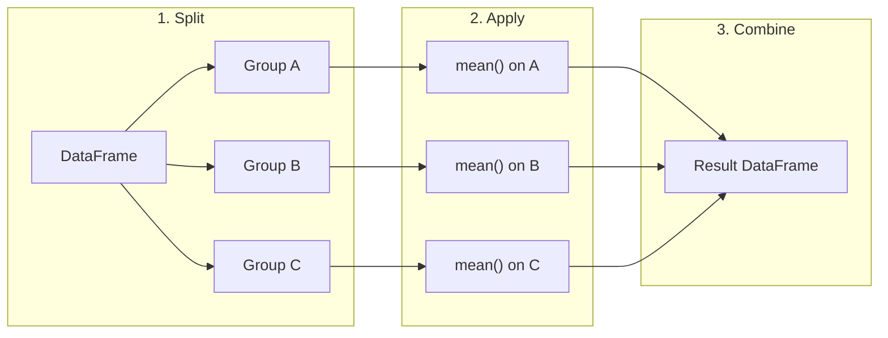
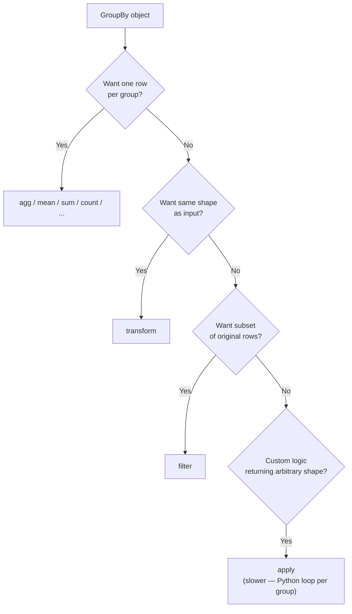
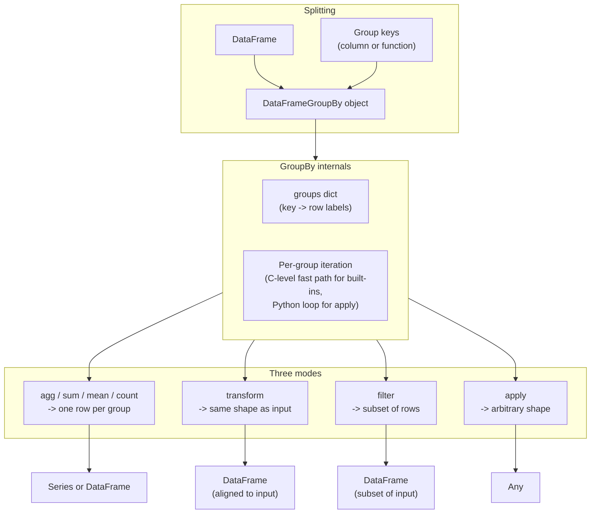

# 5. GroupBy Operations

> [!note] Why this note exists
> `df.groupby` is the single most powerful analytical operation in Pandas — it implements the **split-apply-combine** pattern that powers SQL `GROUP BY`, Excel pivot tables, and most BI dashboards. This note covers the three operation modes (aggregation, transformation, filtering), the `agg`/`transform`/`filter`/`apply` methods, named aggregations for clean column names, group-wise filling and ranking, and the subtle differences between `apply` and `transform`. Read alongside [[24. Pandas/3. Indexing and Selection|3. Indexing and Selection]] for the boolean masks you'll use to filter groups, and [[24. Pandas/4. Data Cleaning|4. Data Cleaning]] for group-wise imputation patterns.

## Why It Matters

GroupBy is how you answer questions like:
- "What's the average salary per department?"
- "Which customers placed the most orders last month?"
- "Normalise each stock's price series to its first value."
- "Drop departments with fewer than 5 employees."
- "Rank products within each category by revenue."

These are split-apply-combine operations: **split** the data into groups, **apply** a function to each group, **combine** the results back into a single structure. Knowing the API well lets you:

- **Pick the right mode.** Aggregation (returns one row per group), transformation (returns same-shape as input), or filtering (drops whole groups).
- **Use named aggregations for clean column names.** `agg(total='sum', avg='mean')` is far better than the multi-index mess from `agg(['sum', 'mean'])`.
- **Avoid slow `apply` when `transform` or `agg` would do.** `transform` and `agg` are vectorised; `apply` falls back to a Python loop per group.
- **Handle group-wise missing data.** Fill NaN with the group mean, not the global mean — preserves group structure.
- **Combine with multi-indexes.** `groupby([col1, col2])` produces a hierarchical index; knowing how to flatten it (`reset_index` or `as_index=False`) is essential.

## Background

### The split-apply-combine pattern

Coined by Hadley Wickham (of R/dplyr fame), split-apply-combine is the universal pattern for grouped analysis:

1. **Split:** Partition the data by a key (e.g., department).
2. **Apply:** Compute something per partition (mean, count, custom function).
3. **Combine:** Stitch the per-partition results into a single DataFrame/Series.



In Pandas:

```python
import pandas as pd

df = pd.DataFrame({
    'dept': ['eng', 'eng', 'sales', 'sales', 'hr'],
    'salary': [100, 110, 80, 90, 70],
})

# Step 1: split
grouped = df.groupby('dept')

# Step 2: apply
means = grouped['salary'].mean()

# Step 3: combine (happens automatically)
print(means)
# dept
# eng      105.0
# sales     85.0
# hr        70.0
```

### The three GroupBy modes

Pandas GroupBy supports three modes, each with a different output shape:

| Mode | Method | Output shape | Use case |
| ---- | ------ | ------------ | -------- |
| Aggregation | `agg()` / `sum()` / `mean()` / ... | One row per group | Summaries, statistics |
| Transformation | `transform()` | Same shape as input | Group-wise normalisation, filling |
| Filtration | `filter()` | Subset of original rows | Drop groups meeting a condition |
| Apply (general) | `apply()` | Any shape | Custom logic |

```python
# Aggregation: one row per group
df.groupby('dept')['salary'].mean()
# dept
# eng      105.0
# sales     85.0
# hr        70.0

# Transformation: same shape as input
df['dept_avg'] = df.groupby('dept')['salary'].transform('mean')
# Each row gets its department's average salary
#   dept  salary  dept_avg
# 0  eng     100     105.0
# 1  eng     110     105.0
# 2 sales      80      85.0
# ...

# Filtration: subset of rows
df.groupby('dept').filter(lambda g: g['salary'].mean() > 80)
# Only rows from departments with avg salary > 80
#   dept  salary
# 0  eng     100
# 1  eng     110
# 2 sales     80
# 3 sales     90
# (hr dropped because its mean is 70)
```

## Main content

### Basic aggregations

```python
df = pd.DataFrame({
    'dept': ['eng', 'eng', 'sales', 'sales', 'sales', 'hr'],
    'level': ['junior', 'senior', 'junior', 'senior', 'junior', 'senior'],
    'salary': [100, 110, 80, 90, 85, 70],
    'years': [1, 5, 2, 6, 1, 4],
})

# Built-in aggregations
df.groupby('dept')['salary'].mean()
df.groupby('dept')['salary'].sum()
df.groupby('dept')['salary'].count()
df.groupby('dept')['salary'].size()  # includes NaN; count doesn't
df.groupby('dept')['salary'].median()
df.groupby('dept')['salary'].std()
df.groupby('dept')['salary'].var()
df.groupby('dept')['salary'].min()
df.groupby('dept')['salary'].max()
df.groupby('dept')['salary'].first()
df.groupby('dept')['salary'].last()
df.groupby('dept')['salary'].nth(0)  # nth row per group

# Multiple aggregations
df.groupby('dept')['salary'].agg(['mean', 'sum', 'count'])
#            mean  sum  count
# dept
# eng      105.0  210      2
# hr        70.0   70      1
# sales     85.0  255      3

# Different aggregations per column
df.groupby('dept').agg({
    'salary': ['mean', 'sum'],
    'years': 'max',
})

# Named aggregations (Pandas 0.25+) — the modern, clean way
df.groupby('dept').agg(
    avg_salary=('salary', 'mean'),
    total_salary=('salary', 'sum'),
    max_years=('years', 'max'),
    headcount=('salary', 'count'),
)
#         avg_salary  total_salary  max_years  headcount
# dept
# eng          105.0           210          5          2
# hr            70.0            70          4          1
# sales         85.0           255          6          3
```

> [!tip] Use named aggregations
> Named aggregations (`agg(name=('col', 'func'))`) produce flat column names instead of a MultiIndex. Always prefer this style for readability.

### Multiple grouping keys

```python
# Group by multiple columns -> MultiIndex result
df.groupby(['dept', 'level'])['salary'].mean()
# dept   level
# eng    junior     100.0
#        senior     110.0
# hr     senior      70.0
# sales  junior       82.5
#        senior       90.0

# Flatten with reset_index or as_index=False
df.groupby(['dept', 'level'], as_index=False)['salary'].mean()
#    dept   level  salary
# 0  eng  junior   100.0
# 1  eng  senior   110.0
# ...
```

### Custom aggregation functions

```python
# Any function that takes a Series and returns a scalar
def range_(s):
    return s.max() - s.min()

df.groupby('dept')['salary'].agg(range_)

# Or use a lambda
df.groupby('dept')['salary'].agg(lambda s: s.max() - s.min())

# Mix built-in strings and custom functions
df.groupby('dept')['salary'].agg(['mean', 'sum', range_, lambda s: s.iloc[0]])
```

### Transformation

`transform` returns a result with the **same shape** as the input. Each row gets the value computed for its group.

```python
# Subtract the group mean from each row (group-wise centering)
df['salary_centered'] = df.groupby('dept')['salary'].transform(lambda s: s - s.mean())

# Fill NaN with group mean
df['salary'] = df.groupby('dept')['salary'].transform(lambda s: s.fillna(s.mean()))

# Rank within group
df['dept_rank'] = df.groupby('dept')['salary'].rank(ascending=False)

# Normalise each group to its first value (e.g., for time series)
df['salary_norm'] = df.groupby('dept')['salary'].transform(lambda s: s / s.iloc[0])

# Cumulative sum within group
df['cum_salary'] = df.groupby('dept')['salary'].cumsum()

# Use built-in function names instead of lambdas (faster)
df['salary_centered'] = df.groupby('dept')['salary'].transform('mean')
# Note: this returns the GROUP MEAN per row, not the centered value.
# To center, you need the lambda, or:
df['salary_centered'] = df['salary'] - df.groupby('dept')['salary'].transform('mean')
```

### Filtration

`filter` keeps or drops entire groups based on a per-group predicate.

```python
# Keep departments with at least 3 employees
df.groupby('dept').filter(lambda g: len(g) >= 3)

# Keep departments where the average salary is above 80
df.groupby('dept').filter(lambda g: g['salary'].mean() > 80)

# Keep groups where the max salary exceeds 90
df.groupby('dept').filter(lambda g: g['salary'].max() > 90)
```

### `apply` — the general-purpose method

`apply` runs an arbitrary function on each group. It's flexible but slow because it falls back to a Python loop.

```python
# Apply a function that returns a DataFrame (or Series, or scalar)
def top_earner(g):
    return g.nlargest(1, 'salary')

df.groupby('dept').apply(top_earner)
# Returns one row per group (the top earner)

# Use include_groups=False (Pandas 2.2+) to avoid passing the group key column
df.groupby('dept').apply(top_earner, include_groups=False)

# Apply can return any shape
def summary(g):
    return pd.Series({
        'avg': g['salary'].mean(),
        'top': g['salary'].max(),
        'span': g['years'].max() - g['years'].min(),
    })

df.groupby('dept').apply(summary)
```

> [!warning] `apply` is slow
> Whenever possible, use `agg`, `transform`, or built-in methods. They're vectorised; `apply` falls back to Python per group. Save `apply` for operations that can't be expressed any other way.

### The `agg` / `transform` / `apply` / `filter` decision



### Group-wise operations beyond aggregation

```python
# Rank within group
df['rank_in_dept'] = df.groupby('dept')['salary'].rank(method='dense', ascending=False)

# Cumulative operations
df.groupby('dept')['salary'].cumsum()
df.groupby('dept')['salary'].cummax()
df.groupby('dept')['salary'].cummin()
df.groupby('dept')['salary'].cumprod()

# Shift within group (lag/lead)
df['prev_salary'] = df.groupby('dept')['salary'].shift(1)
df['next_salary'] = df.groupby('dept')['salary'].shift(-1)

# Pct change within group
df['salary_pct_change'] = df.groupby('dept')['salary'].pct_change()

# Rolling within group (need to sort by time first)
df = df.sort_values(['dept', 'date'])
df['rolling_avg'] = df.groupby('dept')['salary'].rolling(window=3, min_periods=1).mean().reset_index(level=0, drop=True)

# Expanding within group
df.groupby('dept')['salary'].expanding().mean()

# Ewm (exponentially weighted) within group
df.groupby('dept')['salary'].ewm(span=7).mean()
```

### Iterating over groups

```python
# Iterate (slow, but useful for inspection)
for name, group in df.groupby('dept'):
    print(f"Dept: {name}")
    print(group)

# Get a specific group
df.groupby('dept').get_group('eng')

# Get group keys
df.groupby('dept').groups  # dict: key -> list of row indices
df.groupby('dept').size()  # group sizes
```

### Group-by with multiple aggregations and renaming

```python
# Named aggregations (cleanest)
result = df.groupby('dept').agg(
    avg_salary=('salary', 'mean'),
    median_salary=('salary', 'median'),
    headcount=('salary', 'count'),
    avg_years=('years', 'mean'),
)

# Multiple aggregations as list (creates MultiIndex columns)
result = df.groupby('dept')[['salary', 'years']].agg(['mean', 'sum', 'max'])
# Flatten:
result.columns = ['_'.join(col) for col in result.columns]
result = result.reset_index()
```

### Realistic examples

#### Example 1: Top-N per group

```python
# Find the 2 highest-paid employees in each department
top2 = (
    df.sort_values('salary', ascending=False)
      .groupby('dept')
      .head(2)
)
# head(n) after groupby returns the first n rows of each group.
```

#### Example 2: Group-wise normalisation

```python
# Standardise salary within each department (z-score)
df['salary_z'] = df.groupby('dept')['salary'].transform(
    lambda s: (s - s.mean()) / s.std()
)
```

#### Example 3: Time-since-last-event per group

```python
df = df.sort_values(['user_id', 'timestamp'])
df['prev_event'] = df.groupby('user_id')['timestamp'].shift(1)
df['time_since_prev'] = df['timestamp'] - df['prev_event']
```

#### Example 4: Group-wise filling

```python
# Forward-fill within group (don't carry values across users!)
df['value'] = df.groupby('user_id')['value'].ffill()

# Fill with group mean
df['value'] = df.groupby('user_id')['value'].transform(
    lambda s: s.fillna(s.mean())
)
```

#### Example 5: Filter groups by size

```python
# Keep only groups with at least 5 members
big_groups = df.groupby('category').filter(lambda g: len(g) >= 5)

# Or: use transform to broadcast the size, then filter
df['group_size'] = df.groupby('category')['value'].transform('size')
big_groups = df[df['group_size'] >= 5].drop(columns='group_size')
```

#### Example 6: Pivot tables and cross-tabs

```python
# Pivot table: average salary by dept × level
pivot = df.pivot_table(
    values='salary',
    index='dept',
    columns='level',
    aggfunc='mean',
    fill_value=0,
    margins=True,        # add 'All' row and column
    margins_name='Total',
)

# Multiple aggregations in a pivot
pivot = df.pivot_table(
    values='salary',
    index='dept',
    columns='level',
    aggfunc=['mean', 'count'],
)

# Cross-tabulation (count of co-occurrences)
pd.crosstab(df['dept'], df['level'])
pd.crosstab(df['dept'], df['level'], normalize='index')   # row percentages
pd.crosstab(df['dept'], df['level'], normalize='columns') # col percentages
pd.crosstab(df['dept'], df['level'], normalize='all')     # overall percentages
```

#### Example 7: Window functions (SQL OVER PARTITION BY)

```python
# SQL: AVG(salary) OVER (PARTITION BY dept)
df['dept_avg'] = df.groupby('dept')['salary'].transform('mean')

# SQL: ROW_NUMBER() OVER (PARTITION BY dept ORDER BY salary DESC)
df['salary_rank'] = (
    df.groupby('dept')['salary']
      .rank(method='first', ascending=False)
      .astype(int)
)

# SQL: LAG(salary, 1) OVER (PARTITION BY dept ORDER BY date)
df = df.sort_values(['dept', 'date'])
df['prev_salary'] = df.groupby('dept')['salary'].shift(1)

# SQL: SUM(salary) OVER (PARTITION BY dept ORDER BY date
#                        ROWS BETWEEN UNBOUNDED PRECEDING AND CURRENT ROW)
df['running_total'] = (
    df.sort_values(['dept', 'date'])
      .groupby('dept')['salary']
      .cumsum()
)

# SQL: PERCENT_RANK() OVER (PARTITION BY dept ORDER BY salary)
df['pct_rank'] = df.groupby('dept')['salary'].rank(pct=True)
```

### Group-by architecture



### Performance considerations

```python
# Fast: built-in aggregation methods (C-level)
df.groupby('dept')['salary'].mean()    # vectorised

# Fast: transform with built-in method names
df.groupby('dept')['salary'].transform('mean')

# Medium: transform with lambda
df.groupby('dept')['salary'].transform(lambda s: s - s.mean())

# Slow: apply with custom function
df.groupby('dept').apply(lambda g: g['salary'].mean() - g['salary'].std())

# For best performance:
# 1. Use built-in method names ('mean', 'sum', 'count', ...) where possible.
# 2. Use named aggregations to avoid MultiIndex overhead.
# 3. Convert group keys to 'category' dtype for low-cardinality groupings.
# 4. Use PyArrow-backed dtypes (Pandas 2.0+) for string-heavy groupings.
```

### Grouping with functions and arrays

You don't have to group by a column name — `groupby` accepts a function, an array of labels, or a list of these:

```python
# Group by a function applied to the index
df = pd.DataFrame({'value': [1, 2, 3, 4]}, index=['a_1', 'a_2', 'b_1', 'b_2'])
df.groupby(lambda idx: idx[0]).sum()
#   value
# a     3
# b     7

# Group by an external array (length must match df)
groups = ['A', 'A', 'B', 'B']
df.groupby(groups).sum()

# Group by the values of a Series (not a column name)
s = pd.Series(['A', 'A', 'B', 'B'], name='grp')
df.groupby(s).sum()

# Group by datetime properties
df = pd.DataFrame({'date': pd.date_range('2024-01-01', periods=10), 'v': range(10)})
df.groupby(df['date'].dt.dayofweek)['v'].mean()  # by day of week
df.groupby(pd.Grouper(key='date', freq='W'))['v'].sum()  # weekly via Grouper

# Mix columns, arrays, and Grouper
df.groupby(['dept', pd.Grouper(key='date', freq='M')])['salary'].sum()
```

### Group-by with categorical keys

```python
# Categorical group keys: faster, and you can include empty groups
df['dept'] = df['dept'].astype('category')

# observed=False (default in 2.0): include all categories, even empty
df.groupby('dept', observed=False).size()
# All categories appear, with 0 for empty ones.

# observed=True: only groups with at least one row
df.groupby('dept', observed=True).size()

# Ordered categorical — group order is preserved
df['size'] = pd.Categorical(df['size'], categories=['S', 'M', 'L'], ordered=True)
df.groupby('size', observed=True).mean()  # rows in order S, M, L
```

## Common Pitfalls

1. **`count()` vs `size()`.** `count` returns non-null counts; `size` returns total group size (including NaN rows). For "how many rows", use `size`.

2. **MultiIndex result when you want a flat DataFrame.** Pass `as_index=False` to keep the group key as a column: `df.groupby('dept', as_index=False)['salary'].mean()`.

3. **Forgetting named aggregations.** `df.groupby('dept').agg({'salary': ['mean', 'sum']})` creates a MultiIndex column structure that's annoying to work with. Use `agg(mean_salary=('salary', 'mean'), total_salary=('salary', 'sum'))`.

4. **`transform` with built-in string method.** `df.groupby('dept')['salary'].transform('mean')` returns the GROUP MEAN broadcast to each row — not the centered value. To center, subtract: `df['salary'] - df.groupby('dept')['salary'].transform('mean')`.

5. **`apply` returns MultiIndex with the group key.** `df.groupby('dept').apply(func)` adds 'dept' as the first index level. Pass `include_groups=False` (2.2+) or reset_index.

6. **Group-wise operations without sorting.** `shift`, `cumsum`, etc. operate within group, but order matters. Sort by time first for time-series operations.

7. **`ffill()` across group boundaries.** `df.ffill()` ignores groups. Use `df.groupby('user_id')['value'].ffill()` to avoid carrying a value from one user to the next.

8. **`filter` with `len(g)` is slow on large groups.** Use `transform('size')` to broadcast sizes, then filter the original DataFrame — usually faster.

9. **`groupby` on a column with NaN.** NaN values are excluded from groups by default. Pass `dropna=False` to keep them as a group.

10. **Chained group-bys.** `df.groupby('a').mean().groupby('b')...` — the second groupby groups the result, not the original. Usually a logic error.

11. **`apply` with side effects.** `apply` should be pure — modifying the input group inside `apply` is undefined behaviour.

12. **Categorical group keys with unobserved categories.** `df.groupby('cat_col')` includes all categories, even empty ones, by default (Pandas 2.0+). Pass `observed=True` to skip empties.

13. **Mixing aggregation with non-aggregation.** `df.groupby('dept').agg({'salary': 'mean', 'name': 'first'})` — fine, but `df.groupby('dept').agg({'salary': 'mean', 'name': 'count'})` mixes aggregations on different columns.

14. **`agg` with a function that returns non-scalars.** `agg` expects scalar outputs. If your function returns an array/Series, use `apply` instead.

15. **Forgetting to sort before `shift`/`cumsum`/`rolling`.** These operations are order-sensitive within group. Sort by the relevant axis (often time) first.

16. **Group-by on a string column with mixed case.** `'Eng'` and `'eng'` become different groups. Normalise case before grouping.

17. **`groupby` without selecting a column.** `df.groupby('dept').mean()` returns means for ALL numeric columns. Usually you want `df.groupby('dept')[['salary', 'years']].mean()`.

18. **Forgetting `numeric_only=True` (Pandas 2.0+).** `df.groupby('dept').mean()` raises on non-numeric columns in 2.0+. Pass `numeric_only=True` or select columns explicitly.

## Tips and Tricks

- **Use named aggregations: `agg(name=('col', 'func'))`.** Flat column names, clean code.
- **`as_index=False` keeps the group key as a column.** Avoids `reset_index()` later.
- **`groupby('cat', observed=True)`** for categorical groups — skips empty groups.
- **`groupby('col', dropna=False)`** to treat NaN as its own group.
- **`transform('mean')` to broadcast group means to original rows.**
- **`groupby + head(n)` for top-N per group.** After `sort_values`.
- **`groupby + rank(method='dense')` for in-group rankings.** Methods: average, min, max, first, dense.
- **`groupby + cumsum/cummax/cummin/cumprod`** for cumulative ops within group.
- **`groupby + shift(n)` for lag/lead within group.** Critical for time series.
- **`groupby + rolling(window=n)` for moving averages within group.** Sort first.
- **`groupby + ewm(span=n)` for exponentially weighted means within group.**
- **`groupby + ffill/bfill` for gap-filling within group.** Don't cross group boundaries.
- **`groupby + transform(lambda s: s.fillna(s.mean()))` for group-wise imputation.**
- **`groupby + filter(lambda g: len(g) >= n)` to drop small groups.**
- **`df.groupby('dept').groups` to inspect the group → row-labels mapping.**
- **`df.groupby('dept').get_group('eng')` to extract a single group as a DataFrame.**
- **`df.groupby('dept').size()` for group counts.** Faster than `count()` if you don't care about NaN.
- **`df.groupby('dept').describe()` for a full statistical summary per group.**
- **Convert group keys to `category` dtype before groupby for low-cardinality groupings.** Faster.
- **`pd.Grouper(key='date', freq='M')` for time-based grouping.** See [[24. Pandas/6. Time Series|6. Time Series]].
- **`pd.Grouper(key='lat', axis=0)` for axis-specific grouping in multi-key groupby.**
- **For very large datasets, consider Polars — its group-by is multi-threaded.**

## Active Recall

1. What's the split-apply-combine pattern? Describe each step.
2. What are the three modes of GroupBy? What does each return?
3. What's the difference between `count()` and `size()`?
4. How would you compute multiple aggregations with clean column names?
5. What does `as_index=False` do in `groupby`?
6. What does `transform` return? How does its shape compare to the input?
7. How would you subtract the group mean from each row?
8. How would you fill missing values with the group mean?
9. What does `filter` do? Give an example.
10. Why is `apply` slower than `agg` or `transform`?
11. How would you get the top 2 rows per group by a column?
12. How would you rank rows within each group?
13. How would you compute a cumulative sum within each group?
14. How would you compute a 7-day rolling mean within each group?
15. Why must you sort before `shift`/`cumsum`/`rolling`?
16. How would you forward-fill within group without crossing group boundaries?
17. How would you drop groups with fewer than 5 members?
18. What's `observed=True` for in groupby on a categorical column?
19. What's `dropna=False` for?
20. What's `pd.Grouper` for?

## Next Steps

- [[24. Pandas/2. Series and DataFrame|2. Series and DataFrame]] — the structures being grouped.
- [[24. Pandas/3. Indexing and Selection|3. Indexing and Selection]] — selecting columns and filtering groups.
- [[24. Pandas/4. Data Cleaning|4. Data Cleaning]] — group-wise imputation patterns.
- [[24. Pandas/6. Time Series|6. Time Series]] — `pd.Grouper` for time-based grouping.
- [[24. Pandas/1. Pandas Basics|1. Pandas Basics]] — the conceptual model.
- [[23. NumPy/4. Universal Functions|Universal Functions]] — the underlying aggregation primitives.
- [[24. Pandas/7. IO and File Formats|7. IO and File Formats]] — group-by after loading from SQL/Parquet.
