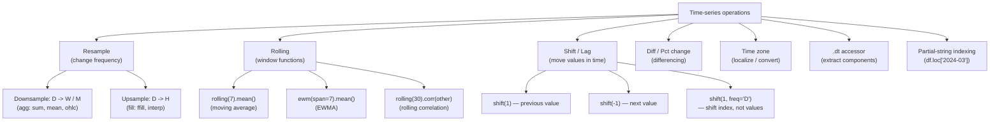
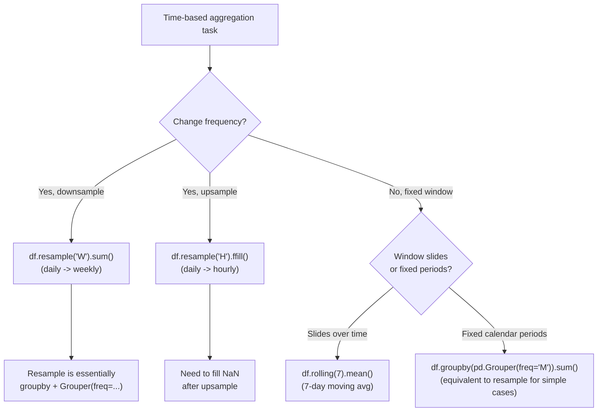

# 6. Time Series

> [!note] Why this note exists
> Time-series analysis is the killer feature that made Pandas dominant in finance, IoT, and operations research. This note covers `DatetimeIndex`, `pd.to_datetime`, `pd.date_range`, resampling (`resample('D'/'W'/'M'/'Y')`), rolling windows (`rolling(window=7)`), shifting (`shift(1)`, `tshift`), time-zone handling (`tz_localize`, `tz_convert`), and the `.dt` accessor for component extraction. Read alongside [[24. Pandas/5. GroupBy Operations|5. GroupBy Operations]] (resampling is fundamentally a time-based group-by) and [[24. Pandas/4. Data Cleaning|4. Data Cleaning]] (forward/backward fill in time-indexed context).

## Why It Matters

Time-series data is everywhere: stock prices, sensor readings, web traffic, sales, weather, telemetry. Pandas was *built* for it — Wes McKinney started the library at a quantitative finance firm specifically because Python lacked good time-series tools. Knowing the API lets you:

- **Index by timestamp.** `df.loc['2024-01-15']` selects all rows from that day; `df.loc['2024-01':'2024-03']` selects a quarter. No boolean masks needed.
- **Resample to any frequency.** Convert tick data to OHLC bars, daily sales to weekly sums, hourly measurements to daily averages — all with `df.resample('W').sum()`.
- **Compute rolling statistics.** Moving averages, exponentially weighted means, Bollinger bands — all one-liners.
- **Handle time zones.** `tz_localize` to attach, `tz_convert` to switch — handles DST automatically.
- **Lag and shift.** `shift(1)` for "yesterday's value", `pct_change()` for returns — the foundation of time-series modelling.
- **Extract components.** Year, month, day of week, quarter, is_month_end — all via `.dt`.

## Background

### Time series in Pandas vs NumPy

NumPy has `datetime64[ns]` as a dtype, but no built-in time-series operations — no resampling, no rolling, no business-day arithmetic. Pandas adds:

1. **`DatetimeIndex`** — a typed index of timestamps with frequency awareness.
2. **`TimedeltaIndex`** — durations, for shifting and differencing.
3. **`PeriodIndex`** — fixed-length periods (e.g., '2024Q1'), vs DatetimeIndex's instants.
4. **Resampling, rolling, shifting** — the three core operations.
5. **Time-zone support** — first-class via `pytz` or `zoneinfo`.

### Timestamp vs Period vs Timedelta

Pandas has three time-related types:

| Type | Represents | Example | Use case |
| ---- | ---------- | ------- | -------- |
| `Timestamp` | An instant in time | `2024-01-15 14:30:00` | Point-in-time events |
| `Period` | A fixed-length interval | `2024-01` (a month), `2024Q1` (a quarter) | Aggregations, accounting periods |
| `Timedelta` | A duration | `3 days 04:00:00` | Differences, shifts |

```python
import pandas as pd

# Timestamp
ts = pd.Timestamp('2024-01-15 14:30:00')
ts.year, ts.month, ts.day, ts.hour

# Period
p = pd.Period('2024-01', freq='M')
p.start_time, p.end_time

# Timedelta
td = pd.Timedelta('3 days 4 hours')
td.total_seconds()
```

## Main content

### Creating datetime indexes

```python
import pandas as pd

# From strings
dates = pd.to_datetime(['2024-01-01', '2024-01-02', '2024-01-03'])
s = pd.Series([1, 2, 3], index=dates)

# From a column
df = pd.DataFrame({'date': ['2024-01-01', '2024-01-02'], 'value': [10, 20]})
df['date'] = pd.to_datetime(df['date'])
df = df.set_index('date')

# From components
df = pd.DataFrame({'year': [2024, 2024], 'month': [1, 2], 'day': [15, 20]})
df['date'] = pd.to_datetime(df[['year', 'month', 'day']])

# With explicit format (faster)
df['date'] = pd.to_datetime(df['date_str'], format='%Y-%m-%d')

# Handle invalid values
df['date'] = pd.to_datetime(df['date_str'], errors='coerce')  # invalid -> NaT

# date_range — generate a sequence of timestamps
pd.date_range('2024-01-01', '2024-01-10')                    # daily
pd.date_range('2024-01-01', periods=10)                      # 10 days
pd.date_range('2024-01-01', periods=10, freq='H')            # hourly
pd.date_range('2024-01-01', '2024-12-31', freq='MS')         # month starts
pd.date_range('2024-01-01', '2024-12-31', freq='W-MON')      # weekly on Monday
pd.date_range('2024-01-01', '2024-12-31', freq='B')          # business days
pd.date_range('2024-01-01', '2024-12-31', freq='QS')         # quarter starts
pd.date_range('2024-01-01', '2024-12-31', freq='3H')         # every 3 hours
pd.date_range('2024-01-01', '2024-12-31', freq='2W')         # every 2 weeks

# period_range — fixed-length periods
pd.period_range('2024Q1', periods=4, freq='Q')
pd.period_range('2024-01', periods=12, freq='M')

# timedelta_range — durations
pd.timedelta_range('0 days', periods=5, freq='6H')
```

### Frequency aliases

| Alias | Meaning | Example |
| ----- | ------- | ------- |
| `D` | Calendar day | daily |
| `B` | Business day | Mon-Fri |
| `W` | Weekly (default Sunday) | weekly |
| `W-MON`, `W-TUE`, ... | Weekly on specific day | |
| `M` | Month end | last day of month |
| `MS` | Month start | first day of month |
| `Q` | Quarter end | |
| `QS` | Quarter start | |
| `A` / `Y` | Year end | |
| `AS` / `YS` | Year start | |
| `H` | Hourly | |
| `T` / `min` | Minutely | |
| `S` | Secondly | |
| `L` / `ms` | Milliseconds | |
| `U` / `us` | Microseconds | |
| `N` / `ns` | Nanoseconds | |
| `BM` | Business month end | |
| `BMS` | Business month start | |

Combine with multipliers: `2H` (every 2 hours), `3W` (every 3 weeks), `15min` (every 15 minutes).

### The `.dt` accessor

```python
s = pd.Series(pd.date_range('2024-01-01', periods=5, freq='D'))

# Components
s.dt.year
s.dt.month
s.dt.day
s.dt.hour
s.dt.minute
s.dt.second
s.dt.microsecond
s.dt.nanosecond
s.dt.date             # Python date objects
s.dt.time             # Python time objects

# Day of week / month
s.dt.dayofweek        # Monday=0, Sunday=6
s.dt.day_name()       # 'Monday', 'Tuesday', ...
s.dt.month_name()     # 'January', ...
s.dt.dayofyear        # 1-366
s.dt.weekofyear       # deprecated in 2.0
s.dt.isocalendar()    # DataFrame with year, week, day (ISO calendar)
s.dt.quarter          # 1-4
s.dt.days_in_month    # 28-31

# Boolean checks
s.dt.is_month_start
s.dt.is_month_end
s.dt.is_quarter_start
s.dt.is_quarter_end
s.dt.is_year_start
s.dt.is_year_end
s.dt.is_leap_year

# Time zone
s_utc = s.dt.tz_localize('UTC')
s_et = s_utc.dt.tz_convert('US/Eastern')

# Floor / ceil / round
s.dt.floor('D')     # round down to day
s.dt.ceil('H')      # round up to hour
s.dt.round('15min')

# For Period:
p = pd.Series(pd.period_range('2024Q1', periods=4, freq='Q'))
p.dt.qyear
p.dt.start_time
p.dt.end_time
```

### Resampling — change frequency

`resample` is time-based group-by. It's the workhorse for OHLC, weekly sums, etc.

```python
# Daily data
idx = pd.date_range('2024-01-01', '2024-12-31', freq='D')
ts = pd.Series(np.random.rand(len(idx)), index=idx)

# Downsample: daily -> weekly sum
ts.resample('W').sum()
ts.resample('W').mean()
ts.resample('W').agg(['min', 'max', 'mean', 'sum'])  # OHLC-style

# Downsample: daily -> monthly
ts.resample('M').mean()       # month END (last day)
ts.resample('MS').mean()      # month START
ts.resample('ME').mean()      # Pandas 2.2+: month END (new alias)

# Upsample: daily -> hourly (creates NaN, must fill)
ts_hourly = ts.resample('H').asfreq()         # NaN for missing
ts_hourly = ts.resample('H').ffill()          # forward-fill
ts_hourly = ts.resample('H').interpolate()    # linear interpolation

# Business-day resampling
ts.resample('B').mean()       # business days only

# Custom aggregation per period
ts.resample('W').agg({
    'min': 'min',
    'max': 'max',
    'open': 'first',
    'close': 'last',
})

# Multiple columns with different aggregations
df = pd.DataFrame({'price': ..., 'volume': ...}, index=idx)
df.resample('W').agg({
    'price': 'ohlc',
    'volume': 'sum',
})
```

### Rolling windows

```python
ts = pd.Series(np.random.rand(100))

# Simple rolling mean
ts.rolling(window=7).mean()                 # 7-day moving average
ts.rolling(window='7D').mean()              # time-based (works on irregular index)

# Other rolling aggregations
ts.rolling(7).sum()
ts.rolling(7).std()
ts.rolling(7).var()
ts.rolling(7).min()
ts.rolling(7).max()
ts.rolling(7).median()
ts.rolling(7).quantile(0.75)

# With minimum periods (don't produce NaN at the start)
ts.rolling(7, min_periods=1).mean()

# Centered window (useful for smoothing)
ts.rolling(7, center=True).mean()

# Exponentially weighted (no fixed window)
ts.ewm(span=7).mean()       # EWMA with span=7
ts.ewm(alpha=0.3).mean()    # EWMA with smoothing factor
ts.ewm(halflife=3).mean()   # EWMA with halflife

# Custom function (slow — Python loop)
ts.rolling(7).apply(lambda w: w.iloc[-1] / w.iloc[0] - 1)

# Weighted rolling (use NumPy)
weights = np.array([0.5, 0.3, 0.2])
ts.rolling(3).apply(lambda w: (w * weights).sum())

# Rolling correlation
ts1.rolling(30).corr(ts2)

# Rolling covariance
ts1.rolling(30).cov(ts2)
```

### Shifting and lagging

```python
ts = pd.Series([1, 2, 3, 4, 5])

# Shift values forward (lag) — introduces NaN at start
ts.shift(1)    # [NaN, 1, 2, 3, 4]
ts.shift(3)    # [NaN, NaN, NaN, 1, 2]

# Shift backward (lead) — introduces NaN at end
ts.shift(-1)   # [2, 3, 4, 5, NaN]

# Shift by time frequency (only works on datetime index)
ts.shift(1, freq='D')   # shifts the INDEX, not the values
ts.shift(-1, freq='D')

# Percent change
ts.pct_change()       # ts / ts.shift(1) - 1
ts.pct_change(2)      # 2-period return
ts.pct_change(fill_method=None)  # don't ffill before computing (Pandas 2.1+)

# Difference
ts.diff()       # ts - ts.shift(1)
ts.diff(2)      # ts - ts.shift(2)
ts.diff(-1)     # ts - ts.shift(-1)
```

### Time zones

```python
# Localize: attach a tz to naive timestamps
s = pd.Series(pd.date_range('2024-01-01', periods=5, freq='H'))
s_utc = s.dt.tz_localize('UTC')

# Convert: switch to a different tz
s_et = s_utc.dt.tz_convert('US/Eastern')
s_pt = s_utc.dt.tz_convert('US/Pacific')
s_london = s_utc.dt.tz_convert('Europe/London')

# DST is handled automatically
s_march = pd.Series(pd.date_range('2024-03-10', periods=5, freq='H')).dt.tz_localize('US/Eastern')
# 2024-03-10 is DST transition in US — watch for missing/duplicate hours

# Using zoneinfo (Python 3.9+)
from zoneinfo import ZoneInfo
s.dt.tz_localize(ZoneInfo('America/New_York'))

# For a DataFrame with a DatetimeIndex:
df.index = df.index.tz_localize('UTC')
df.index = df.index.tz_convert('US/Eastern')
```

### Time-based indexing

```python
df = pd.DataFrame({'value': np.random.rand(365)},
                  index=pd.date_range('2024-01-01', periods=365, freq='D'))

# Partial string indexing — super convenient!
df.loc['2024-03-15']           # one day
df.loc['2024-03']              # all of March
df.loc['2024']                 # all of 2024
df.loc['2024-01':'2024-03']    # Q1
df.loc['2024-01-15':'2024-01-20']  # date range

# Slicing is inclusive on both ends (Pandas convention for label slicing)
df['2024-03-15':'2024-03-20']

# Get year, month, etc. directly (works on the index)
df[df.index.month == 3]
df[df.index.dayofweek == 0]   # all Mondays
df[df.index.is_month_end]
```

### Time-series operations overview



### Resample vs Rolling vs GroupBy



### Realistic examples

#### Example 1: Daily stock returns

```python
# Daily prices
prices = pd.Series(
    [100, 102, 101, 105, 107, 106, 108],
    index=pd.date_range('2024-01-01', periods=7, freq='D')
)

# Daily returns
returns = prices.pct_change()

# Cumulative return
cumulative = (1 + returns).cumprod() - 1

# 3-day moving average
ma3 = prices.rolling(3).mean()

# Volatility (rolling std of returns)
vol = returns.rolling(7).std() * np.sqrt(252)  # annualised
```

#### Example 2: Resample tick data to OHLC bars

```python
# Tick data: timestamp -> price
ticks = pd.Series(
    np.random.rand(1000) * 100,
    index=pd.date_range('2024-01-01', periods=1000, freq='30s')
)

# 5-minute OHLC bars
ohlc = ticks.resample('5min').ohlc()
#              open   high    low  close
# 2024-01-01 00:00:00  ...
# 2024-01-01 00:05:00  ...
```

#### Example 3: Weekly sales report

```python
df = pd.DataFrame({
    'date': pd.date_range('2024-01-01', periods=90, freq='D'),
    'sales': np.random.randint(100, 1000, 90),
})
df = df.set_index('date')

# Weekly totals (week ending on Sunday)
weekly = df.resample('W').sum()

# Month-over-month growth
monthly = df.resample('M').sum()
mom_growth = monthly.pct_change()

# 7-day moving average for smoothing
df['ma7'] = df['sales'].rolling(7).mean()
```

#### Example 4: Cross-time-zone analysis

```python
# Server logs in UTC
logs = pd.DataFrame({
    'timestamp': pd.date_range('2024-01-01', periods=24, freq='H'),
    'requests': np.random.randint(0, 1000, 24),
}).set_index('timestamp')

# Convert to US/Eastern for business-hour analysis
logs_et = logs.tz_localize('UTC').tz_convert('US/Eastern')

# Filter business hours (9-17 EST)
business_hours = logs_et.between_time('09:00', '17:00')

# Average requests by hour-of-day
hourly_avg = logs_et.groupby(logs_et.index.hour).mean()
```

#### Example 5: Filling gaps in time series

```python
# Sparse data with gaps
sparse = pd.Series(
    [1.0, 2.0, np.nan, np.nan, 5.0, np.nan, 7.0],
    index=pd.date_range('2024-01-01', periods=7, freq='D')
)

# Fill methods:
sparse.ffill()              # forward-fill: 1, 2, 2, 2, 5, 5, 7
sparse.bfill()              # back-fill: 1, 2, 5, 5, 5, 7, 7
sparse.interpolate()        # linear: 1, 2, 3, 4, 5, 6, 7
sparse.interpolate(method='time')  # time-aware (same here)
sparse.fillna(sparse.mean())  # constant fill

# Reindex to fill missing timestamps
full_idx = pd.date_range(sparse.index.min(), sparse.index.max(), freq='D')
sparse_reindexed = sparse.reindex(full_idx).ffill()
```

#### Example 6: Business-day calendar

```python
# Custom business-day calendar excluding US holidays
from pandas.tseries.holiday import USFederalHolidayCalendar
from pandas.tseries.offsets import CustomBusinessDay

us_bday = CustomBusinessDay(calendar=USFederalHolidayCalendar())
pd.date_range('2024-01-01', '2024-12-31', freq=us_bday)

# Add/subtract business days
ts = pd.Timestamp('2024-01-05')
ts + 5 * us_bday   # 5 business days ahead

# Custom business hours
bh = CustomBusinessDay(calendar=USFederalHolidayCalendar())
pd.date_range('2024-01-01', '2024-01-31', freq='4h')  # every 4 hours
```

#### Example 7: Period vs Timestamp conversion

```python
# Periods (fixed intervals)  Timestamps (instants)
periods = pd.period_range('2024Q1', periods=4, freq='Q')
periods.to_timestamp(how='start')   # first instant of each quarter
periods.to_timestamp(how='end')     # last instant of each quarter

ts = pd.date_range('2024-01-15', '2024-12-15', freq='M')
ts.to_period('M')                    # convert month-end timestamps to monthly periods

# Period arithmetic
p = pd.Period('2024-01', freq='M')
p + 3   # 2024-04 (3 months later)
p - 1   # 2023-12 (1 month earlier)
```

#### Example 8: Time-based groupby with pd.Grouper

```python
# Group by month, regardless of explicit resample
df.groupby(pd.Grouper(key='date', freq='M'))['sales'].sum()

# Group by multiple keys: month + category
df.groupby([pd.Grouper(key='date', freq='M'), 'category'])['sales'].sum()

# Group by hour of day
df.groupby(df['timestamp'].dt.hour).mean()

# Group by day of week
df.groupby(df['timestamp'].dt.day_name()).mean()

# Group by weekend/weekday
df['is_weekend'] = df['timestamp'].dt.dayofweek >= 5
df.groupby('is_weekend')['sales'].mean()
```

#### Example 9: Detecting seasonality

```python
# Autocorrelation — how correlated is the series with itself lagged?
from pandas.plotting import autocorrelation_plot
ts = pd.Series(np.random.rand(365) + np.sin(np.arange(365) * 2 * np.pi / 365))
autocorrelation_plot(ts)

# Manual lag plot
pd.plotting.lag_plot(ts, lag=7)

# Seasonal decomposition (statsmodels — beyond Pandas but worth knowing)
# from statsmodels.tsa.seasonal import seasonal_decompose
# result = seasonal_decompose(ts, model='additive', period=7)
# result.plot()

# Resample to detect weekly pattern
daily = ts.resample('D').mean()
weekly_pattern = daily.groupby(daily.index.dayofweek).mean()
```

#### Example 10: As-of joins (last known value at time T)

```python
# Trade data with timestamps
trades = pd.DataFrame({
    'time': pd.to_datetime(['2024-01-01 09:30:00', '2024-01-01 10:15:00',
                            '2024-01-01 11:00:00', '2024-01-01 14:00:00']),
    'price': [100.0, 101.5, 102.0, 103.5],
}).set_index('time')

# Quotes (more frequent)
quotes = pd.DataFrame({
    'time': pd.to_datetime(['2024-01-01 09:00:00', '2024-01-01 09:45:00',
                            '2024-01-01 10:30:00', '2024-01-01 11:30:00']),
    'bid': [99.5, 100.5, 101.0, 102.5],
    'ask': [100.5, 101.5, 102.0, 103.0],
}).set_index('time')

# Merge_asof: for each trade, find the most recent quote
merged = pd.merge_asof(trades, quotes, on='time', direction='backward')
# Each trade row gets the last known bid/ask at the trade time.

# Tolerance: don't match if quote is too old
merged = pd.merge_asof(trades, quotes, on='time',
                        direction='backward',
                        tolerance=pd.Timedelta('1h'))
```

#### Example 11: Windowed aggregations on irregular data

```python
# Time-based rolling on irregular timestamps
irregular = pd.Series(
    [1, 2, 3, 4, 5],
    index=pd.to_datetime(['2024-01-01', '2024-01-03', '2024-01-04',
                          '2024-01-08', '2024-01-09'])
)

# Window of 3 calendar days (not 3 rows!)
irregular.rolling('3D').sum()
# 2024-01-01: 1     (just itself)
# 2024-01-03: 3     (1 + 2 from 01-01 within 3 days)
# 2024-01-04: 5     (2 + 3 from 01-03 within 3 days, 1 from 01-01 too far)
# ...

# EWM on irregular data uses time-decay
irregular.ewm(halflife='3D', times=irregular.index).mean()
```

## Common Pitfalls

1. **`pd.to_datetime` without `format=` is slow on large datasets.** Always pass `format='%Y-%m-%d'` (or similar) when you know it. 10× speedup.

2. **`errors='ignore'` in `to_datetime` leaves invalid values as strings.** Usually you want `errors='coerce'` to get `NaT` instead.

3. **Forgetting to set the datetime index.** `resample`, `rolling(window='7D')`, and partial-string indexing all require a `DatetimeIndex`.

4. **`df['date'] = pd.to_datetime(...)` doesn't set the index.** Follow with `df = df.set_index('date')`.

5. **Resampling alias confusion.** `'M'` is month END (last day); `'MS'` is month START (first day). Pandas 2.2+ adds `'ME'`/`'MS'` for clarity.

6. **`resample('W').sum()` includes incomplete weeks at the boundaries.** Use `closed='right'` or filter to full weeks.

7. **`rolling(7).mean()` produces 6 NaN at the start.** Pass `min_periods=1` if you want partial windows filled.

8. **`shift(1)` vs `shift(1, freq='D')`.** The first shifts values (introduces NaN); the second shifts the index (no NaN). Different semantics!

9. **`pct_change()` fills with `ffill` by default.** This may hide data gaps. Pass `fill_method=None` (Pandas 2.1+) to disable.

10. **Time-zone naive vs aware.** You can't combine them — `tz_localize` to attach, `tz_convert` to switch. Mixing raises `TypeError`.

11. **DST transitions create duplicate or missing hours.** `tz_localize('US/Eastern', ambiguous='NaT', nonexistent='shift_forward')` to handle.

12. **`df.loc['2024-03-15']` on a date column (not index) doesn't work.** Either set the index or use `df[df['date'] == '2024-03-15']`.

13. **`df.resample('M')` on non-datetime index raises.** Convert with `to_datetime` first.

14. **Resampling with multiple aggregations creates MultiIndex columns.** Use named aggregations: `agg(total=('col', 'sum'), avg=('col', 'mean'))`.

15. **`rolling` on irregularly-spaced data is window-by-count, not by-time.** Use `rolling('7D')` for time-based windows.

16. **`ewm` without `adjust=False` has a startup bias.** For financial EWMA, usually pass `adjust=False`.

17. **`df.index.tz_localize('UTC')` on an already-localized index raises.** Check `df.index.tz` first.

18. **Comparing timestamps with strings.** `df.loc[df.index == '2024-01-01']` works but `df.loc['2024-01-01']` is cleaner.

## Tips and Tricks

- **`pd.to_datetime(s, format=..., errors='coerce')`** for safe, fast conversion.
- **`pd.date_range(start, end, freq=...)`** to generate timestamps. Memorise the alias table.
- **`df.set_index('date')` then `df.loc['2024-03']`** for partial-string indexing — the killer feature.
- **`df.resample('W').sum()` for downsampling, `df.resample('H').ffill()` for upsampling.**
- **`df.rolling('7D').mean()`** for time-based windows (handles irregular spacing).
- **`df.rolling(7, min_periods=1).mean()`** to avoid NaN at the start.
- **`df.ewm(span=20).mean()` for exponential weighting.** Use `adjust=False` for finance.
- **`df.shift(1)` for lags, `df.shift(-1)` for leads, `df.diff()` for differences.**
- **`df.pct_change()` for returns.** Pass `fill_method=None` (Pandas 2.1+) to disable ffill.
- **`df.index.tz_localize('UTC').tz_convert('US/Eastern')`** for tz conversion.
- **`df.between_time('09:00', '17:00')`** for business-hours filtering.
- **`df.at_time('12:00')`** for a specific time of day.
- **`df.last('5D')` / `df.first('5D')`** for the last/first N days.
- **`df.index.day_name()`** for human-readable day names.
- **`df.index.is_month_end`** for boolean masks.
- **`pd.Grouper(key='date', freq='M')`** for time-based group-by in `df.groupby`.
- **`df.resample('M').agg(open=('price', 'first'), high=('price', 'max'), low=('price', 'min'), close=('price', 'last'))`** for OHLC bars.
- **`s.dt.tz_localize(None)`** to strip timezone (drops the tz info; values stay the same).
- **`pd.Timedelta('3 days 4 hours')` for durations.** Arithmetic: `ts + timedelta`.
- **`df.index.to_period('M')`** to convert DatetimeIndex to PeriodIndex (e.g., for monthly accounting).
- **`df.asfreq('D')`** to force a frequency (introduces NaN for missing timestamps).
- **`df.interpolate(method='time')` for time-aware interpolation.** Respects irregular timestamps.
- **`s.dt.floor('D')` / `s.dt.ceil('H')` / `s.dt.round('15min')`** for bucketing timestamps.

## Active Recall

1. What are Pandas' three time-related types? Give a one-sentence description of each.
2. How would you convert a string column to datetime? What's the `format=` argument for?
3. What does `pd.date_range('2024-01-01', periods=10, freq='W-MON')` produce?
4. What's the difference between `'M'` and `'MS'` in resampling?
5. How would you resample daily data to weekly sums?
6. How would you upsample daily data to hourly with forward-fill?
7. What does `df.rolling(7).mean()` produce? What's at the start?
8. What's `min_periods` for in `rolling`?
9. What's the difference between `df.rolling(7)` and `df.rolling('7D')`?
10. How would you compute an exponentially weighted moving average?
11. What does `df.shift(1)` do? What about `df.shift(1, freq='D')`?
12. How would you compute daily returns from daily prices?
13. How would you compute the month-over-month growth?
14. What's `tz_localize` vs `tz_convert`? When do you use each?
15. How would you filter a DataFrame to business hours (9-17) in US/Eastern?
16. How would you partial-string-index all of March 2024?
17. What does `df.last('5D')` return?
18. How would you extract the day of the week from a datetime index?
19. How would you handle DST transitions when localizing?
20. What's `pd.Grouper(key='date', freq='M')` for?

## Next Steps

- [[24. Pandas/1. Pandas Basics|1. Pandas Basics]] — the conceptual model.
- [[24. Pandas/2. Series and DataFrame|2. Series and DataFrame]] — `DatetimeIndex` is a core index type.
- [[24. Pandas/3. Indexing and Selection|3. Indexing and Selection]] — partial-string indexing builds on `loc`.
- [[24. Pandas/4. Data Cleaning|4. Data Cleaning]] — `ffill`, `bfill`, `interpolate` in time-indexed context.
- [[24. Pandas/5. GroupBy Operations|5. GroupBy Operations]] — `resample` is fundamentally time-based group-by.
- [[24. Pandas/7. IO and File Formats|7. IO and File Formats]] — `parse_dates=` in `read_csv`.
- [[23. NumPy/1. NumPy Basics|NumPy Basics]] — `datetime64[ns]` is the underlying dtype.
