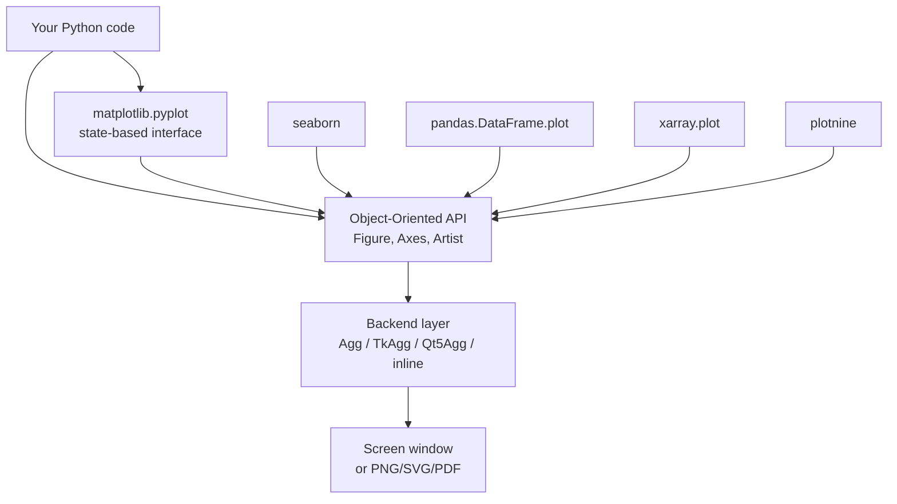
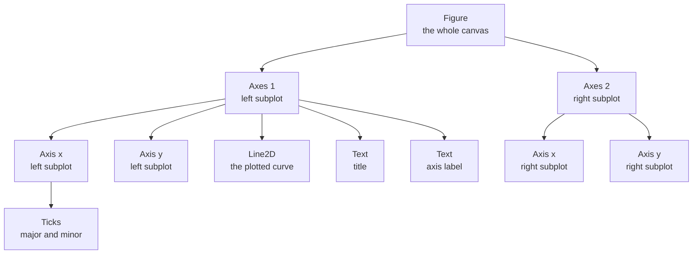
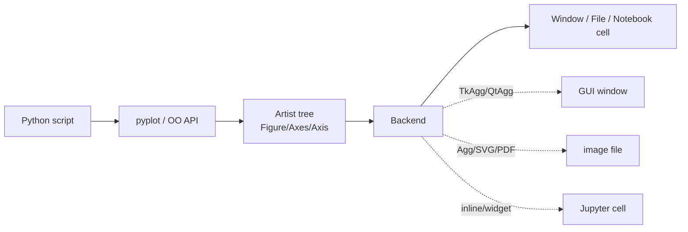

# 1. Matplotlib Basics

> [!note] Why this note exists
> Matplotlib is the **foundational plotting library** of the Python scientific stack — every other plotting package you'll meet (`seaborn`, `pandas.plotting`, `plotnine`, even `geopandas` and `xarray`) is either built on top of it or mirrors its conventions. This note gives you the mental model you need to use Matplotlib **deliberately**: the `Figure` → `Axes` → `Axis` → `Artist` hierarchy, the difference between the **state-based `pyplot` interface** and the **object-oriented API**, the role of backends, and the absolute minimum vocabulary (`plt.plot`, `plt.show`, `plt.savefig`) you need to put a chart on the screen. Once you finish this note, the next ones — [[2. Line Plots and Styling]], [[3. Bar, Scatter, Histogram]], [[4. Subplots and Layouts]], [[5. Advanced Visualization]] — become much easier, because they all build on the vocabulary introduced here.

## Why It Matters

If you have ever typed `plt.plot(x, y)` and seen a chart appear, you have used Matplotlib. The library is so ubiquitous that tutorials often skip the theory and jump straight to recipes. That works for a one-off plot. It breaks down the moment you need to:

- Put **two plots side by side** with shared axes.
- Make a chart that looks **good in a paper, a slide deck, and a dark-mode dashboard** — three different surfaces, three different colour cycles, three different DPI targets.
- Animate a figure, or update it in response to a slider widget.
- Debug why `plt.show()` blocks forever in a script but returns immediately in Jupyter.
- Understand why `plt.plot()` sometimes draws into a new window and sometimes into "the previous one", with no obvious reason.

All of these are easy **if** you understand three things:

1. The **object hierarchy** of a Matplotlib figure (Figure contains Axes contains Axis contains Artists).
2. The **two interfaces** (`pyplot` state machine vs explicit OO API) and when each one helps or hurts.
3. The **backend** concept — the layer that turns Artist objects into pixels on your screen or bytes in a file.

This note covers all three. The rest of the chapter assumes you know them.

## Background

### A short history

Matplotlib was written by **John Hunter** in 2003 while he was a postdoc in neuroscience. He needed to make EEG plots from intracranial electrodes and was frustrated by the licence policy of MATLAB, which his lab could not afford to upgrade. The original goal was, in his own words, to "build a MATLAB-like plotting interface in Python". Two design decisions from that origin still echo today:

- The `pyplot` module mimics MATLAB's state-based plotting: `plt.plot`, `plt.xlabel`, `plt.title` all operate on "the current axes" — a hidden global pointer. This is convenient for quick plots and confusing as soon as you have more than one axes on screen.
- The colour cycle, the default marker styles, and the `gcf`/`gca` helpers ("get current figure", "get current axes") all come straight from MATLAB.

Matplotlib is now maintained by a NumFOCUS-sponsored team. Version 3.x (current as of this writing: 3.9/3.10) has modernised many defaults (the `seaborn-v0_8` style replaced the old default in 3.6, the colour cycle moved from `'b'`-first to the Okabe-Ito-inspired set), but the layered architecture has not changed since the early days.

### Where it fits in the ecosystem



Notice that **`seaborn`, `pandas.plotting`, and friends all call the OO API under the hood**. When you write `df.plot(kind='bar')`, pandas is constructing `Axes` objects and calling `ax.bar()` for you. This means learning the OO API lets you tweak anything that comes out of those higher-level libraries — usually by grabbing the returned `Axes` and continuing to call methods on it.

## Main Content

### 1. The object hierarchy

Every Matplotlib plot is a tree. The root is a `Figure`. A figure contains one or more `Axes` (note: an *Axes* is one plot, with its own x and y axis — the name is misleading because it looks plural). Each `Axes` contains two or more `Axis` objects (typically one x, one y, optionally a z). Both `Axis` and `Axes` contain `Artist` objects: titles, labels, lines, text, patches, collections.



Key facts about this hierarchy:

- The `Figure` is the **top-level container**. It owns the canvas (the pixel buffer or vector output), the size, the DPI, and the colour of the background. One figure = one saved PNG/PDF/SVG.
- An `Axes` is **one plot**. Most of the methods you'll call (`plot`, `scatter`, `bar`, `set_xlabel`, `legend`, `set_xlim`) live on `Axes`, not on `Figure`.
- An `Axis` handles ticks, tick labels, and the axis label. You usually don't touch `Axis` directly — `Axes.set_xticks` and friends are wrappers.
- An `Artist` is the base class for **everything you can see** in a figure. Lines, text, patches (rectangles, circles), and collections (PathCollection, LineCollection) are all Artists. If you ever need to do something exotic (animate a single artist, listen for click events on a line), you'll be working with the `Artist` API directly.

### 2. The two interfaces

Matplotlib exposes two parallel ways to draw:

| Interface | Module | Mental model | Best for |
|---|---|---|---|
| **State-based (`pyplot`)** | `matplotlib.pyplot` | "There is a current figure and a current axes; functions operate on whatever is current" | Quick one-off plots, interactive exploration |
| **Object-Oriented** | `matplotlib.figure.Figure`, `matplotlib.axes.Axes` | "I hold references to the objects I want to draw into; I call methods on them" | Anything reusable, anything with subplots, anything programmatic |

#### State-based (pyplot)

```python
import matplotlib.pyplot as plt

plt.plot([1, 2, 3], [4, 5, 6])
plt.xlabel("x")
plt.ylabel("y")
plt.title("Quick plot")
plt.show()
```

`plt.plot()` implicitly creates a Figure, an Axes, and a Line2D. Each subsequent `plt.*` call operates on the same "current" axes. `plt.show()` blocks until the window is closed (in script mode) or returns immediately (in inline Jupyter mode).

#### Object-Oriented

```python
import matplotlib.pyplot as plt

fig, ax = plt.subplots()       # explicit Figure + Axes
ax.plot([1, 2, 3], [4, 5, 6])
ax.set_xlabel("x")
ax.set_ylabel("y")
ax.set_title("Quick plot")
plt.show()                     # or fig.show()
```

The two snippets produce the same chart. The OO version is slightly longer but has two huge advantages:

1. You hold **direct references** to `fig` and `ax`, so you can manipulate them in functions, pass them around, store them in lists, and reason about them without a hidden global pointer.
2. As soon as you have **more than one axes**, the OO style is the only thing that scales. The pyplot state machine keeps track of "current axes" by index, and you end up writing `plt.subplot(2, 3, 4)` to switch contexts — readable for 2 subplots, a nightmare for 6.

> [!tip] Rule of thumb
> Use `pyplot` for **creating** figures (`plt.subplots()`, `plt.figure()`) and **showing/saving** them (`plt.show()`, `plt.savefig()`). Use the OO API for **everything else**. This is the style used by `pandas`, `seaborn`, and the Matplotlib docs themselves.

### 3. The minimum vocabulary

These six functions are enough for 80% of plots:

```python
import matplotlib.pyplot as plt
import numpy as np

# 1. Make data
x = np.linspace(0, 2 * np.pi, 200)
y = np.sin(x)

# 2. Create figure + axes
fig, ax = plt.subplots(figsize=(8, 4))

# 3. Draw
ax.plot(x, y, label="sin(x)")

# 4. Decorate
ax.set_xlabel("x")
ax.set_ylabel("sin(x)")
ax.set_title("A sine wave")
ax.legend()
ax.grid(True)

# 5. Save OR show (rarely both)
fig.savefig("sine.png", dpi=150, bbox_inches="tight")
plt.show()
```

- `plt.subplots()` — returns a `(Figure, Axes)` pair (or a `(Figure, ndarray-of-Axes)` pair if you ask for >1 subplot). This is the modern, recommended way to start a plot.
- `ax.plot(x, y)` — draw a line. Returns a list of `Line2D` artists.
- `ax.set_xlabel` / `set_ylabel` / `set_title` — set the decorations. Note: `set_xlabel` is a method on `Axes`; `plt.xlabel` is a pyplot function that calls `set_xlabel` on the current axes.
- `ax.legend()` — show a legend, using the `label=` arguments from each plotting call.
- `fig.savefig(path)` — write the figure to disk. Supports PNG, JPG, SVG, PDF, WebP. `dpi=` controls raster resolution; `bbox_inches="tight"` trims whitespace.
- `plt.show()` — display all open figures and block until they are closed (or, in Jupyter, render them inline and return).

### 4. Backends

A **backend** is the layer that turns the Artist tree into pixels or vector commands. There are two flavours:

- **Interactive backends** — render to a GUI window. Examples: `TkAgg` (Tkinter, default if no Qt installed), `QtAgg` (PyQt5/6 or PySide6), `MacOSX` (native macOS, no longer recommended).
- **Non-interactive (hardcopy) backends** — render directly to a file. Examples: `Agg` (PNG raster, used by `savefig` regardless of interactive backend), `SVG`, `PDF`, `PS`.

In **Jupyter**, the special `inline` backend (provided by `IPython`/`matplotlib` magic) captures each figure and embeds a PNG in the cell output. `%matplotlib widget` switches to `ipympl`, which makes plots interactive (zoom, pan) inside the notebook.

```python
# Inspect / switch backends
import matplotlib
print(matplotlib.get_backend())           # e.g. 'QtAgg'
matplotlib.use("Agg")                      # use BEFORE pyplot is imported
import matplotlib.pyplot as plt
```



> [!warning] Backend must be set before pyplot is imported
> `matplotlib.use("Agg")` only works if called **before** `import matplotlib.pyplot as plt`. Once pyplot is imported, the backend is frozen. Inside Jupyter, use the `%matplotlib` magic instead — it correctly reconfigures the already-imported library.

### 5. The two execution contexts

The same `plt.show()` call behaves differently depending on where you run it:

| Context | `plt.show()` behaviour | What you see |
|---|---|---|
| **Plain script** (`python myplot.py`) | Blocks until the figure window is closed | A GUI window; script resumes only after you close it |
| **Jupyter notebook** (inline backend) | Returns immediately; figure is embedded in cell output | A PNG in the cell output |
| **Jupyter notebook** (`%matplotlib widget`) | Returns immediately; figure is interactive | An interactive plot in the cell output |
| **IPython shell** (`--matplotlib`) | Returns immediately; figures can be edited live | A GUI window that stays open as you keep typing |

This difference is the source of the most common Matplotlib confusion: "my script hangs" or "my plot doesn't show". The rule is:

- In a **script**, call `plt.show()` exactly once, at the end. Without it, the script exits and the figure is destroyed before the GUI loop runs.
- In **Jupyter with inline**, you do **not** need `plt.show()` — the figure is rendered automatically at the end of the cell. Calling it does no harm, but it's idiomatic to omit it.

### 6. Saving figures

```python
fig.savefig("plot.png",              # format inferred from extension
            dpi=300,                  # raster resolution
            bbox_inches="tight",      # trim whitespace around the figure
            facecolor="white",        # match the figure's background
            transparent=False)        # set True for an alpha-capable PNG

# Vector formats are first-class citizens
fig.savefig("plot.svg")
fig.savefig("plot.pdf")
fig.savefig("plot.pdf", format="pdf") # explicit format overrides extension
```

For papers and posters, **always prefer PDF or SVG**: they are resolution-independent, the text remains selectable, and LaTeX can `\includegraphics` them directly. For web, PNG at 150–300 DPI is fine; WebP gives better compression.

## Code Examples

### Example A — minimal pyplot plot

```python
import matplotlib.pyplot as plt

plt.plot([0, 1, 2, 3], [0, 1, 4, 9])
plt.title("y = x squared")
plt.show()
```

### Example B — OO version of the same plot, ready for extension

```python
import matplotlib.pyplot as plt
import numpy as np

x = np.array([0, 1, 2, 3])
y = x ** 2

fig, ax = plt.subplots(figsize=(6, 4))
ax.plot(x, y, marker="o", label="y = x²")
ax.set_xlabel("x")
ax.set_ylabel("y")
ax.set_title("y = x squared")
ax.legend()
ax.grid(alpha=0.3)
fig.savefig("square.png", dpi=150, bbox_inches="tight")
```

### Example C — inspecting the Artist tree

```python
import matplotlib.pyplot as plt

fig, ax = plt.subplots()
ax.plot([1, 2, 3], [4, 5, 6])
ax.set_title("Inspect me")

# The Axes children: a list of every Artist contained in ax
print(ax.get_children())
# [<matplotlib.lines.Line2D object>, <matplotlib.spines.Spine>, ...,
#  Text(0.5, 1.0, 'Inspect me'), ...]

# Grab the title explicitly
print(ax.title.get_text())  # 'Inspect me'
```

### Example D — choosing a backend at import time

```python
import matplotlib
matplotlib.use("Agg")          # headless: only savefig works
import matplotlib.pyplot as plt
import numpy as np

fig, ax = plt.subplots()
ax.plot(np.arange(10), np.arange(10) ** 2)
fig.savefig("headless.png")
# plt.show()  -- would do nothing under Agg
```

## Common Pitfalls

> [!danger] `plt.show()` in a script blocks forever
> If your script seems to hang right after `plt.show()`, that's by design — the GUI event loop runs until you close the window. To save and exit without blocking, skip `plt.show()` and call `fig.savefig(...)` directly, or set the backend to `Agg`.

> [!danger] Importing pyplot before setting the backend
> `matplotlib.use("Agg")` after `import matplotlib.pyplot as plt` raises a warning and is silently ignored. The backend has already been chosen. Set the backend **first**.

> [!danger] Mixing `plt.xlabel` and OO style on the same axes
> `plt.xlabel("x")` operates on `plt.gca()` (the current axes), which is usually what you want — but in code that creates multiple axes programmatically, "current axes" can silently become a different axes than the one you intended. Stick to `ax.set_xlabel("x")` in OO code.

> [!danger] Two `plt.show()` calls produce two windows
> In a script, every `plt.show()` blocks and then **destroys** all open figures. If you call `plt.plot()` again afterwards, you're plotting into a fresh, empty figure — not into the chart you had before. Group all your plotting, then a single `plt.show()`.

> [!danger] Forgetting to call `fig.savefig()` before `plt.show()`
> After `plt.show()` returns, the figure is gone (in script mode). If you try `fig.savefig("out.png")` afterwards, you'll get an empty or corrupted image. Save first, show second — or skip `show` entirely in headless contexts.

> [!danger] "Why does Jupyter show my plot twice?"
> In an inline Jupyter cell, the figure is rendered automatically at the end. If you also call `plt.show()`, Jupyter often still renders once — but with `ipympl` or some custom setups, you can get a double render. The fix is to omit `plt.show()` in inline notebooks.

> [!warning] Default DPI vs figure size confusion
> `figsize=(8, 6)` is in **inches**. The pixel size of the output is `figsize * dpi`. A `figsize=(8, 6)` figure at the default `dpi=100` is 800×600 pixels. At `dpi=300` it's 2400×1800 — which suddenly looks "too zoomed in" because your labels didn't scale. Use `plt.rcParams` to scale fonts (see [[2. Line Plots and Styling]]) or accept the larger canvas.

## Tips and Tricks

> [!tip] Use `plt.close()` to free memory in loops
> If you generate hundreds of figures in a loop (e.g. one per cluster, one per timestep), `fig.savefig(...)` does not free the figure. Each iteration accumulates a new `Figure` object until you OOM. Add `plt.close(fig)` (or `plt.close('all')`) after saving.

> [!tip] `plt.subplots()` returns an array when `nrows>1 or ncols>1`
> ```python
> fig, axes = plt.subplots(2, 3)
> # axes is a 2x3 numpy array of Axes objects
> for ax in axes.flat:
>     ax.plot(...)
> ```
> Use `axes.flat` (or `axes.ravel()`) to iterate over all subplots regardless of shape.

> [!tip] `fig, ax = plt.subplots()` works for the single-axes case
> When `nrows=ncols=1` (the default), `plt.subplots()` returns `ax` as a single `Axes` (not an array). This asymmetry is intentional but easy to forget. If you write `for ax in axes:`, you'll get a single iteration over the Axes's children — a confusing bug. The fix is the convention: always use `fig, ax = plt.subplots()` for the single case and `fig, axes = plt.subplots(n, m)` for the multi case.

> [!tip] Set sane defaults with `plt.rcParams`
> Instead of repeating `figsize=(8, 4)` and `fontsize=12` everywhere, set them once at the top of your script:
> ```python
> plt.rcParams.update({
>     "figure.figsize": (8, 4),
>     "font.size": 12,
>     "axes.grid": True,
>     "axes.grid.which": "both",
> })
> ```
> We cover this in depth in [[2. Line Plots and Styling]].

> [!tip] Inspect the artist tree with `ax.get_children()`
> When a plot looks wrong and you can't tell why, `ax.get_children()` lists every Artist attached to the Axes. You'll often spot a stray `Text` from a forgotten `ax.text()` call, or a hidden `Line2D` from an earlier `plot()` call you forgot to clear with `ax.cla()`.

> [!tip] Use `ax.clear()` or `fig.clear()` to reset
> In a long-lived notebook, you sometimes want to redraw a cell into the same axes. `ax.clear()` removes all artists but keeps the Axes object (and its position). `plt.cla()` and `plt.clf()` clear the current axes/figure respectively.

> [!tip] The `constrained_layout` flag is the modern alternative to `tight_layout`
> ```python
> fig, ax = plt.subplots(constrained_layout=True)
> ```
> It recomputes layout incrementally as you add elements, and handles edge cases (colorbars, suptitles) that `tight_layout` routinely botches. We compare them in [[4. Subplots and Layouts]].

## Active Recall

1. Name the four classes in Matplotlib's core object hierarchy, in order from outermost to innermost.
2. What is the difference between `plt.xlabel("x")` and `ax.set_xlabel("x")`? Which one is preferred in OO code?
3. What does `plt.subplots()` return when called with no arguments? What does it return when called as `plt.subplots(2, 3)`?
4. Why must `matplotlib.use("Agg")` be called before `import matplotlib.pyplot as plt`?
5. What is the difference between an interactive backend and a non-interactive backend? Give one example of each.
6. In a plain `python script.py` run, what happens if you call `plt.plot(...)` but never `plt.show()`?
7. What does `bbox_inches="tight"` do in `fig.savefig()`? Why is it commonly paired with `dpi=300`?
8. Why does the same `plt.show()` call block in a script but return immediately in a Jupyter inline cell?
9. You call `fig.savefig("out.png")` after `plt.show()` returns. The image is blank. Why?
10. What is an `Artist`? Give three concrete subclasses.
11. Why does Matplotlib have both a state-based and an OO API? Which was the original design?
12. Convert the following pyplot snippet to OO style:
    ```python
    plt.figure()
    plt.plot([1, 2, 3], [4, 5, 6])
    plt.title("hi")
    plt.show()
    ```
13. What is `gca()` short for, and why is reaching for it usually a code smell?
14. Name two vector formats that `savefig` supports natively, and explain when you'd choose them over PNG.

## Next Steps

You now have the vocabulary. The next note, [[2. Line Plots and Styling]], takes the single most common Matplotlib call — `ax.plot()` — and walks through everything you can do with it: line styles, markers, colour specifications, labels, legends, grids, axis limits, and the global `rcParams` system for setting style across a whole project. Once you can produce a clean, well-styled line chart, [[3. Bar, Scatter, Histogram]] broadens the menu of chart types, and [[4. Subplots and Layouts]] teaches you to compose multiple axes into a single figure. When you're ready to leave two dimensions behind, [[5. Advanced Visualization]] covers 3D, heatmaps, contour plots, animations, and the modern alternatives (`seaborn`, `plotly`).

If you plan to do scientific or statistical work, also look ahead to the [[26. Image Processing/1. Pillow Basics]] chapter — Matplotlib's `imshow` is the standard way to inspect images returned by Pillow and OpenCV, and we will rely on it heavily there.
