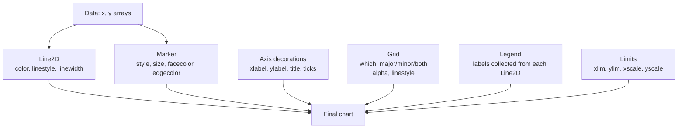
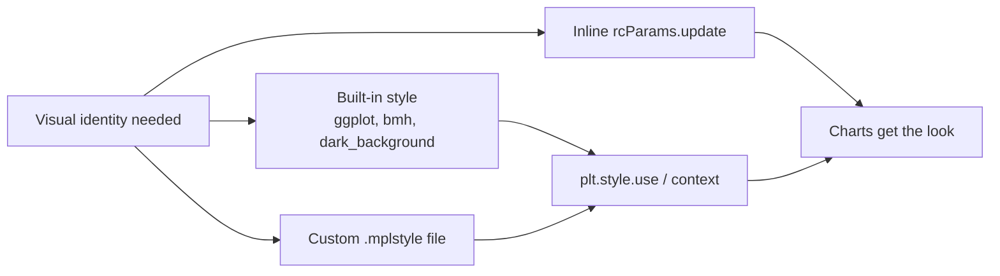

# 2. Line Plots and Styling

> [!note] Why this note exists
> `ax.plot()` is the single most-called function in Matplotlib. Despite its simplicity — pass x, pass y, get a line — the function carries an enormous amount of stylistic machinery: line styles, markers, colours, colour maps, label/legend interactions, axis limits, grid control, ticks, and a global configuration system called `rcParams` that lets you set a project-wide visual identity in a few lines. This note walks through every layer of that machinery, then shows how to apply it **consistently** across a notebook or a library by using stylesheets. Master this note and the next three ([[3. Bar, Scatter, Histogram]], [[4. Subplots and Layouts]], [[5. Advanced Visualization]]) become easy, because every other chart type in Matplotlib reuses the same colour, label, and legend infrastructure introduced here.

## Why It Matters

A line plot is the default way to communicate **continuous change** — stock prices over time, loss curves during training, signal intensity along a sensor array. The mechanics are trivial:

```python
ax.plot(x, y)
```

But making the chart **readable** — distinguishing five series without a legend, emphasising the most important line, matching your publication's font, surviving conversion to grayscale, and looking good on both a projector and a 4K monitor — is a craft. The craft has three parts:

1. **Pick a marker/line combination** that maps onto the eye's preattentive features (length, width, colour, shape).
2. **Pick a colour cycle** that is colour-blind safe and survives grayscale printing.
3. **Set defaults once** with `rcParams` or a stylesheet, so the same look appears on every chart in the project.

This note covers all three.

## Background

### The format string

Matplotlib borrows MATLAB's three-character `format string` for `plot()`. The string is a concatenation of `[marker][line][color]`, in any order, all optional:

- **Colour** (single letter): `b` blue, `g` green, `r` red, `c` cyan, `m` magenta, `y` yellow, `k` black, `w` white.
- **Line style**: `-` solid, `--` dashed, `:` dotted, `-.` dash-dot, `''` (empty) no line.
- **Marker**: `.` point, `,` pixel, `o` circle, `v` down-triangle, `^` up-triangle, `<` left, `>` right, `s` square, `p` pentagon, `*` star, `h`/`H` hexagon, `+` plus, `x` x-mark, `D`/`d` diamond, `|` vertical, `_` horizontal.

```python
ax.plot(x, y, "ro--")    # red circles joined by dashed line
ax.plot(x, z, "k:")      # black dotted line, no markers
ax.plot(x, w, "g^")      # green up-triangles, no line
```

This concise syntax is great for quick exploration but becomes limiting fast: you cannot specify marker edge colour separately, you cannot use hex colours, you cannot set line width. For any non-trivial chart, use the **keyword form**.

### Keyword form

```python
ax.plot(x, y,
        color="#1f77b4",          # any CSS colour: name, hex, rgb tuple, rgba
        linestyle="--",            # or "dashed"
        linewidth=2,               # float, in points
        marker="o",
        markersize=6,
        markerfacecolor="white",
        markeredgecolor="#1f77b4",
        markeredgewidth=1.5,
        label="Observed")
```

The keyword form is fully explicit and is the only way to access the full palette of options. The format string is a shortcut; keywords win when both are present.

### Colour specifications

Matplotlib accepts colours in many forms:

```python
ax.plot(x, y, color="C0")                  # cycle colour 0 (default palette index)
ax.plot(x, y, color="steelblue")           # CSS named colour
ax.plot(x, y, color="#1f77b4")             # hex
ax.plot(x, y, color=(0.12, 0.47, 0.71))    # RGB tuple in [0, 1]
ax.plot(x, y, color=(0.12, 0.47, 0.71, 0.5))  # RGBA (alpha = 0.5)
ax.plot(x, y, color="tab:blue")            # Tableau palette name
ax.plot(x, y, color="xkcd:sky blue")       # xkcd colour survey name
```

The `"C0"`–`"C9"` shorthand is especially useful: it picks the i-th colour of the **current colour cycle**, so your line automatically matches whatever palette the stylesheet defines. This is what you should use when you want "the next default colour" explicitly.

## Main Content

### 1. Anatomy of a styled line plot



Each layer is independent — you can build them up in any order — but they interact: a legend pulls `label=` from each `Line2D`, a grid draws behind the lines, and axis limits affect where the grid is drawn.

### 2. Drawing multiple series

```python
import numpy as np
import matplotlib.pyplot as plt

x = np.linspace(0, 2 * np.pi, 200)
fig, ax = plt.subplots(figsize=(8, 4))

ax.plot(x, np.sin(x), label="sin")
ax.plot(x, np.cos(x), label="cos")
ax.plot(x, np.sin(2 * x), label="sin 2x", linestyle="--")
ax.plot(x, np.cos(2 * x), label="cos 2x", linestyle="--")

ax.set_xlabel("x")
ax.set_ylabel("amplitude")
ax.set_title("Trigonometric functions")
ax.legend(loc="upper right", framealpha=0.9)
ax.grid(True, alpha=0.3)
ax.set_xlim(0, 2 * np.pi)
ax.set_ylim(-1.2, 1.2)
plt.show()
```

The `label=` argument on each `plot()` call is what `ax.legend()` reads. If you forget `label=`, the legend either shows nothing or falls back to `"_childN"` placeholder strings.

### 3. Markers and line combinations

| Visual need | Recommended combo |
|---|---|
| Smooth function, dense x | Line only, no markers (`linestyle="-"`, no `marker=`) |
| Sparse sampled data | Markers only (`linestyle="None"`, `marker="o"`) |
| Sampled data with interpolation | Both (`marker="o", linestyle="-"`) |
| Multiple similar series | Same marker, different colours |
| One "highlight" series among many | All others grey, highlight in colour with `linewidth=2.5` |

```python
# Highlight pattern
ax.plot(x, background_series_1, color="lightgrey")
ax.plot(x, background_series_2, color="lightgrey")
ax.plot(x, highlight, color="crimson", linewidth=2.5, label="focus")
ax.legend()
```

This pattern — desaturate everything except the one series you want the reader to look at — is one of the most effective single changes you can make to a noisy chart.

### 4. Colours and the colour cycle

The **colour cycle** is the list of colours Matplotlib rotates through when you call `plot()` repeatedly without specifying a colour. The default cycle (since Matplotlib 3.6) is the `tab10` palette:

```python
import matplotlib as mpl
print(mpl.rcParams["axes.prop_cycle"].by_key()["color"])
# ['#1f77b4', '#ff7f0e', '#2ca02c', '#d62728', '#9467bd',
#  '#8c564b', '#e377c2', '#7f7f7f', '#bcbd22', '#17becf']
```

You can override it per-figure:

```python
mpl.rcParams["axes.prop_cycle"] = mpl.cycler(
    color=["#4C72B0", "#DD8452", "#55A868", "#C44E52", "#8172B3"]
)
```

Or use a **stylesheet** (covered below) for a full visual identity.

> [!tip] Use the Okabe-Ito palette for accessibility
> ```python
> okabe_ito = ["#0072B2", "#E69F00", "#009E73", "#CC79A7",
>              "#56B4E9", "#D55E00", "#F0E442", "#000000"]
> mpl.rcParams["axes.prop_cycle"] = mpl.cycler(color=okabe_ito)
> ```
> The Okabe-Ito palette was designed to be distinguishable by people with all common forms of colour blindness. It is the de facto standard for scientific publications.

### 5. Labels, titles, and the legend

```python
ax.set_xlabel("Time (s)", fontsize=12)
ax.set_ylabel("Voltage (mV)", fontsize=12)
ax.set_title("Membrane potential over time", fontsize=14, pad=12)
ax.set_title("Subscript: $V_m$", fontsize=14)  # inline LaTeX via $...$
```

Matplotlib renders inline LaTeX inside `$...$` for any text — labels, titles, tick labels, legends. The default `mathtext` renderer handles a useful subset (fractions, subscripts, superscripts, Greek letters, accents). For full LaTeX, configure `text.usetex=True` (requires a working TeX installation).

```python
ax.legend(
    loc="best",                # "upper right", "lower left", or (x, y) tuple
    ncol=2,                    # number of columns
    frameon=True,
    fancybox=True,
    framealpha=0.9,
    title="Series",            # optional title above the legend
    fontsize=10,
)
```

The `loc="best"` option uses a simple heuristic to place the legend where it covers the fewest data points. It's not perfect, but it's the right default.

### 6. Grid, ticks, and limits

```python
ax.grid(True, which="major", axis="both", linestyle="-", alpha=0.4)
ax.grid(True, which="minor", axis="both", linestyle=":", alpha=0.2)
ax.minorticks_on()                                 # enable minor ticks

ax.set_xlim(0, 10)
ax.set_ylim(-1.5, 1.5)
ax.set_xticks([0, 2.5, 5, 7.5, 10])                # explicit major ticks
ax.set_xticklabels(["0", "¼", "½", "¾", "1"])      # custom labels
```

For **logarithmic axes**:

```python
ax.set_xscale("log")
ax.set_yscale("log")
# or "symlog" for axes that include zero or negative values
ax.set_yscale("symlog", linthresh=1e-3)
```

### 7. Annotations and text

```python
ax.annotate(
    "peak",
    xy=(np.pi / 2, 1),                # point being annotated
    xytext=(np.pi / 2 + 0.5, 1.2),    # where the text goes
    arrowprops=dict(arrowstyle="->", color="black"),
    fontsize=11,
)
ax.text(0.05, 0.95, "n = 200",
        transform=ax.transAxes,       # axes coordinates: (0,0)=bottom-left
        verticalalignment="top",
        fontsize=10)
```

The `transform=ax.transAxes` trick is enormously useful: it places the text in axes-fraction coordinates `(0, 0)`–`(1, 1)` instead of data coordinates, so a "n = 200" label in the corner stays put regardless of how the data limits change.

### 8. `rcParams` and stylesheets

`rcParams` is a global dictionary that controls every default in Matplotlib — figure size, font, line width, colour cycle, grid style, and a few hundred other things. You can set values one at a time:

```python
plt.rcParams["figure.figsize"] = (8, 4)
plt.rcParams["font.size"] = 12
plt.rcParams["axes.grid"] = True
```

Or in bulk:

```python
plt.rcParams.update({
    "figure.figsize": (8, 4),
    "font.size": 12,
    "axes.titlesize": 14,
    "axes.labelsize": 12,
    "axes.grid": True,
    "grid.alpha": 0.3,
    "lines.linewidth": 2,
    "lines.markersize": 6,
})
```

Even better, package your settings as a **stylesheet** — a `.mplstyle` file:

```text
# my_style.mplstyle
figure.figsize: 8, 4
font.size: 12
axes.titlesize: 14
axes.labelsize: 12
axes.grid: True
grid.alpha: 0.3
lines.linewidth: 2
lines.markersize: 6
axes.prop_cycle: cycler('color', ['4C72B0', 'DD8452', '55A868', 'C44E52', '8172B3'])
```

Then use it by name:

```python
plt.style.use("my_style")                  # applied globally
with plt.style.context("my_style"):        # applied for a single block
    fig, ax = plt.subplots()
    ax.plot(x, y)
```

Matplotlib ships with several built-in styles:

```python
print(plt.style.available)
# ['default', 'classic', 'bmh', 'dark_background', 'fast', 'ggplot',
#  'grayscale', 'seaborn-v0_8', 'seaborn-v0_8-darkgrid', ...]
```



> [!tip] The style-composition trick
> `plt.style.use(["dark_background", "ggplot"])` applies styles in order — later styles override earlier ones. This is a clean way to combine a base style with a small overlay (e.g. dark background + your custom colour cycle).

## Code Examples

### Example A — minimal styled line chart

```python
import numpy as np
import matplotlib.pyplot as plt

x = np.linspace(0, 10, 100)
y = np.exp(-x / 3) * np.cos(2 * x)

fig, ax = plt.subplots(figsize=(8, 4))
ax.plot(x, y, color="#1f77b4", linewidth=2, label="damped oscillation")
ax.set_xlabel("Time (s)")
ax.set_ylabel("Amplitude")
ax.set_title("Exponentially damped cosine")
ax.grid(True, alpha=0.3)
ax.legend()
plt.show()
```

### Example B — multiple series with intentional styling

```python
import numpy as np
import matplotlib.pyplot as plt

x = np.linspace(0, 4, 200)
series = {
    "x":      x,
    "x^2":    x ** 2,
    "x^3":    x ** 3,
    "exp(x)": np.exp(x) / np.exp(4),     # normalise to [0, 1]
}

fig, ax = plt.subplots(figsize=(8, 5))
colors = ["#4C72B0", "#DD8452", "#55A868", "#C44E52"]
for (name, y), c in zip(series.items(), colors):
    ax.plot(x, y, color=c, linewidth=2, label=name)

ax.set_xlabel("x")
ax.set_ylabel("f(x)")
ax.set_title("Polynomial and exponential growth")
ax.set_xlim(0, 4)
ax.set_ylim(0, 1.1)
ax.grid(True, alpha=0.3)
ax.legend(loc="upper left", framealpha=0.95)
plt.show()
```

### Example C — highlight pattern

```python
import numpy as np
import matplotlib.pyplot as plt

rng = np.random.default_rng(0)
x = np.linspace(0, 10, 100)
background = rng.normal(0, 0.05, size=(5, 100)) + np.sin(x)[None, :]
highlight = np.sin(x) + 0.3 * np.cos(3 * x)

fig, ax = plt.subplots(figsize=(8, 4))
for row in background:
    ax.plot(x, row, color="lightgrey", linewidth=1)
ax.plot(x, highlight, color="crimson", linewidth=2.5, label="signal of interest")
ax.set_title("Background series desaturated, one series highlighted")
ax.legend()
plt.show()
```

### Example D — log scale and LaTeX labels

```python
import numpy as np
import matplotlib.pyplot as plt

decades = np.logspace(0, 5, 100)   # 1, 10, 100, ..., 1e5
noise = 1e-3 / np.sqrt(decades)

fig, ax = plt.subplots(figsize=(8, 4))
ax.loglog(decades, noise, color="#1f77b4", marker="o", markersize=4,
          linestyle="-", label=r"$\sigma \propto 1/\sqrt{N}$")
ax.set_xlabel(r"Sample size $N$")
ax.set_ylabel(r"Standard error $\sigma$")
ax.set_title("Noise decreases with sample size (log-log)")
ax.grid(True, which="both", alpha=0.3)
ax.legend()
plt.show()
```

The `r"..."` (raw string) prefix lets backslashes pass through to Matplotlib's math renderer.

### Example E — rcParams + stylesheet

```python
# Save this block as my_style.mplstyle:
# figure.figsize: 9, 4.5
# font.size: 11
# axes.grid: True
# grid.alpha: 0.25
# lines.linewidth: 2
# axes.prop_cycle: cycler('color', ['0072B2', 'E69F00', '009E73', 'CC79A7'])

import matplotlib.pyplot as plt
import numpy as np

plt.style.use("my_style.mplstyle")
x = np.linspace(0, 2 * np.pi, 200)
fig, ax = plt.subplots()
ax.plot(x, np.sin(x), label="sin")
ax.plot(x, np.cos(x), label="cos")
ax.legend()
plt.show()
```

## Common Pitfalls

> [!danger] Format string order is not enforced
> `"ro--"` and `"--or"` and `"o-r"` all mean the same thing. But `"r--o"` is **also** valid (red dashed line with circle markers) — the parser is permissive. This permissiveness is a footgun when you write `"--r"` expecting a dashed red line but mistype it as `"-r"` (solid red line). Always use the keyword form for any chart you intend to keep.

> [!danger] Single-letter colours are limited
> `color="r"` works, `color="red"` works, but `color="purple"` also works while `color="purpl"` raises. Stick to hex codes or canonical CSS colour names (`"steelblue"`, `"crimson"`, `"teal"`) for unambiguous, future-proof specs.

> [!danger] `legend()` without `label=` shows nothing useful
> If you call `ax.plot(...)` without `label=` and then `ax.legend()`, you get a legend with the placeholder text `"_child0"`. The leading underscore triggers Matplotlib's "skip in legend" rule, so the entry may vanish entirely. Always pass `label=` on every series you want in the legend.

> [!danger] `plt.xlim(...)` vs `ax.set_xlim(...)`
> In OO code, `plt.xlim()` operates on `plt.gca()`, which may not be the axes you think. Use `ax.set_xlim()` explicitly.

> [!danger] LaTeX strings need raw strings
> `ax.set_xlabel("$\sigma$")` will raise `SyntaxWarning: invalid escape sequence` in modern Python (3.12+) because `\s` is not a valid escape. Use `r"$\sigma$"` (raw string) to pass the backslash through to Matplotlib.

> [!warning] Default DPI is 100
> A `figsize=(8, 4)` chart at `dpi=100` is 800×400 pixels — which looks fine on screen but fuzzy when projected or printed. For publication, set `dpi=300` in `savefig`, or change `plt.rcParams["savefig.dpi"] = 300` once.

> [!warning] Markers can dominate the chart
> With dense data, drawing a marker at every sample produces a thick black sausage that hides the line. Either omit markers entirely, use a smaller `markersize`, or subsample (`ax.plot(x[::10], y[::10], marker="o")`).

## Tips and Tricks

> [!tip] Reuse a colour with `"C0"`–`"C9"`
> `color="C0"` means "the first colour of the current cycle". Use it to keep a series' colour consistent across multiple plots even if you change the stylesheet.

> [!tip] `zorder` controls draw order
> ```python
> ax.fill_between(x, y - err, y + err, alpha=0.2, zorder=1)
> ax.plot(x, y, color="C0", zorder=2)
> ax.scatter(x[peaks], y[peaks], color="red", zorder=3)
> ```
> Higher `zorder` is drawn on top. Without `zorder`, Matplotlib draws in the order you call methods — which is often fine but fails the moment a `fill_between` covers your line.

> [!tip] Use `ax.axhline` and `ax.axvline` for reference lines
> ```python
> ax.axhline(0, color="black", linewidth=0.5, linestyle="--")  # zero line
> ax.axvline(np.pi, color="red", linewidth=0.5, linestyle=":")
> ```
> These draw across the full axes regardless of limits, which is exactly what you want for reference markers.

> [!tip] `ax.tick_params` for tick formatting
> ```python
> ax.tick_params(axis="both", which="major", labelsize=10, length=5)
> ax.tick_params(axis="both", which="minor", length=2.5)
> ```
> Use this when the default tick length / font size is wrong; use a stylesheet when you want it everywhere.

> [!tip] Use `plt.tight_layout()` for quick fixes
> If labels are clipped at the edge, `plt.tight_layout()` (or the `constrained_layout=True` option to `subplots`) usually fixes it. For complex layouts, see [[4. Subplots and Layouts]].

> [!tip] Cycle through markers as well as colours
> ```python
> import itertools
> markers = itertools.cycle(["o", "s", "^", "D", "v"])
> for name, y in series.items():
>     ax.plot(x, y, marker=next(markers), label=name)
> ```
> This makes a chart readable even when printed in grayscale.

> [!tip] Save both PNG and PDF
> ```python
> fig.savefig("plot.png", dpi=300, bbox_inches="tight")
> fig.savefig("plot.pdf", bbox_inches="tight")
> ```
> Use the PDF in the paper; use the PNG in the README. They share the same figure, so they're guaranteed to look identical apart from resolution.

## Active Recall

1. What are the three components of a Matplotlib format string? Give an example that uses all three.
2. Write a single `plot()` call that produces a red dashed line with circle markers, line width 2, marker size 6, and label `"observed"`.
3. What does `color="C2"` mean? Why is it more maintainable than `color="#2ca02c"`?
4. How do you place a text label at the top-left of the axes, regardless of data limits? (Hint: which `transform`?)
5. What does `loc="best"` do in `ax.legend()`?
6. Write the `rcParams.update({...})` block to set a default figure size of `(10, 5)`, font size 11, and enable the grid.
7. Convert a one-off style into a reusable stylesheet. What file extension do you use? How do you apply it?
8. Why is `r"$\sigma$"` preferable to `"$\sigma$"` as an axis label?
9. What is the difference between `ax.set_xlim(0, 10)` and `plt.xlim(0, 10)`? Which should you use in OO code?
10. You have five series, all in shades of grey. How do you make them distinguishable in a chart that will be printed in colorblind-safe mode?
11. What does `zorder` control? Give an example where it matters.
12. Why is drawing markers on every point of a dense line plot a bad idea? What are two fixes?
13. Describe the "highlight pattern" — desaturate background series, emphasise one — and explain why it works.
14. Name three built-in Matplotlib styles. How do you combine two styles into one?

## Next Steps

Now that you can produce a polished single-axis line chart, [[3. Bar, Scatter, Histogram]] widens the menu: bar charts for categorical comparisons, scatter plots for two-dimensional distributions, histograms for one-dimensional distributions, plus `pie`, `boxplot`, and `violinplot` for specialised needs. After that, [[4. Subplots and Layouts]] teaches you to compose multiple axes into a single figure — using `plt.subplot`, `plt.subplots`, `GridSpec`, and the layout engines (`tight_layout`, `constrained_layout`). Finally, [[5. Advanced Visualization]] leaves two dimensions behind for 3D plots, heatmaps, contour plots, animations, and the modern alternatives `seaborn` and `plotly`.
