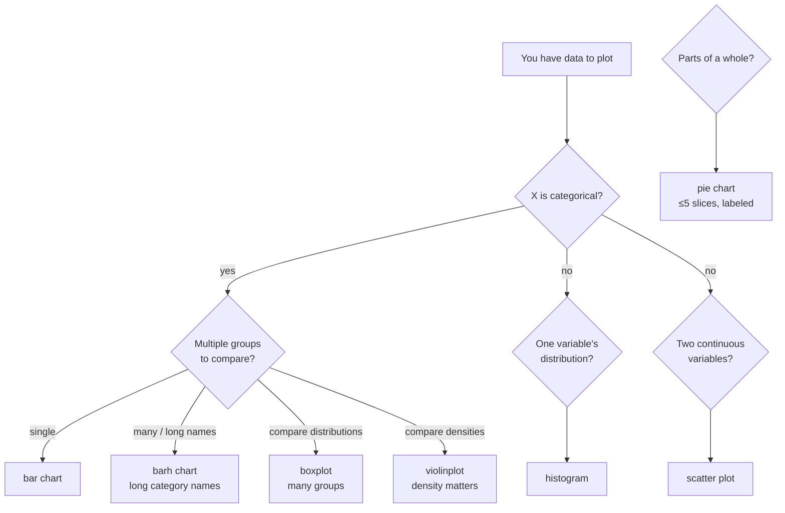
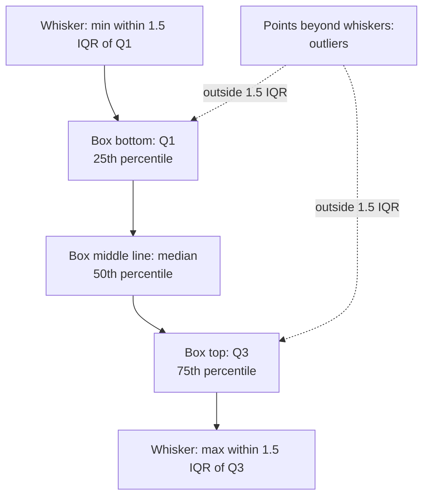

# 3. Bar, Scatter, Histogram

> [!note] Why this note exists
> Line charts are the right tool when x is **continuous and ordered**, but a huge amount of real data is categorical, two-dimensional, or distributional. This note covers the chart types that handle those cases: **bar charts** (categorical comparisons), **scatter plots** (joint distributions of two continuous variables), **histograms** (one-variable distributions), plus the supporting cast of **pie, boxplot, and violinplot**. For each chart type we explain when it's the right choice, how to call it, what its key keyword arguments are, and what alternative (sometimes a *better* alternative) you should consider. By the end you'll be able to look at a dataset and reach for the right chart type without hesitation.

## Why It Matters

Choosing the wrong chart type doesn't just look amateurish — it actively misleads. A bar chart with a non-zero-baseline axis exaggerates differences; a pie chart with more than five slices is unreadable; a histogram with too few bins hides bimodality; a scatter plot without alpha-blending turns into a black blob when there are ten thousand points. The craft of chart selection is mostly about avoiding these failure modes.

The decision tree below, drawn out as a Mermaid diagram, captures the most common routing:



Read the chart by following the branches: ask about your x axis, then about the cardinality and structure of what you're comparing, then arrive at a recommendation. The rest of the note fills in the details for each leaf node.

## Background

### Vocabulary

- **Categorical** — discrete labels: `"Jan"`, `"Feb"`, ..., or `"control"`, `"treatment"`. The order may or may not matter (ordinal vs nominal).
- **Continuous** — real-valued numbers where intermediate values are meaningful: temperature, time, height.
- **Distributional** — a single variable whose **spread** is the point, not individual values.
- **Joint** — two variables whose **relationship** is the point.

### A note on `pyplot` vs OO

All examples in this note use the OO style (`fig, ax = plt.subplots(); ax.bar(...)`). The equivalent `pyplot` calls (`plt.bar`, `plt.scatter`, `plt.hist`) work the same way and accept the same keyword arguments — they just operate on the current axes. See [[1. Matplotlib Basics]] if you need a refresher on why we prefer the OO style.

## Main Content

### 1. Bar charts — `ax.bar` and `ax.barh`

A bar chart compares a single numeric value across a small number of categories.

```python
import matplotlib.pyplot as plt

categories = ["A", "B", "C", "D"]
values = [23, 45, 12, 67]

fig, ax = plt.subplots(figsize=(6, 4))
ax.bar(categories, values, color="#4C72B0", edgecolor="black")
ax.set_ylabel("Count")
ax.set_title("Bar chart")
plt.show()
```

Key arguments:

| Argument | Effect |
|---|---|
| `height` (or `width` for `barh`) | The bar lengths. |
| `width` | Bar width in axes-fraction units. Default `0.8` (leaves 20% gap). Set `1.0` for contiguous bars. |
| `bottom` | Where the bar starts on the y axis. Use for **stacked** bars (`bottom=prev_values`). |
| `color` | Fill colour. Accepts a list (one per bar) or a single colour. |
| `edgecolor`, `linewidth` | Outline colour and thickness. Setting `edgecolor="black"` makes bars crisper in print. |
| `align` | `"center"` (default) or `"edge"`. |
| `label` | Legend entry. |

#### Horizontal bars

When category names are long, `barh` reads better:

```python
languages = ["Python", "JavaScript", "TypeScript", "Rust", "Go"]
users = [12.4, 8.9, 4.2, 1.1, 2.0]   # millions

fig, ax = plt.subplots(figsize=(7, 3))
ax.barh(languages, users, color="#55A868", edgecolor="black")
ax.set_xlabel("Users (millions)")
plt.show()
```

#### Grouped (side-by-side) bars

Matplotlib does not have a single "grouped bar" function — you compose it manually by offsetting the x positions:

```python
import numpy as np

labels = ["Q1", "Q2", "Q3", "Q4"]
region_a = [20, 35, 30, 35]
region_b = [25, 32, 34, 20]

x = np.arange(len(labels))
width = 0.35

fig, ax = plt.subplots(figsize=(8, 4))
ax.bar(x - width/2, region_a, width, label="Region A", color="#4C72B0")
ax.bar(x + width/2, region_b, width, label="Region B", color="#DD8452")
ax.set_xticks(x)
ax.set_xticklabels(labels)
ax.set_ylabel("Revenue (M USD)")
ax.legend()
plt.show()
```

#### Stacked bars

```python
fig, ax = plt.subplots(figsize=(8, 4))
ax.bar(labels, region_a, label="Region A", color="#4C72B0")
ax.bar(labels, region_b, bottom=region_a, label="Region B", color="#DD8452")
ax.set_ylabel("Revenue (M USD)")
ax.legend()
plt.show()
```

> [!warning] Always start bar charts at zero
> A bar chart whose y-axis starts at, say, 50 instead of 0 exaggerates the difference between 60 and 70 by a factor of two. The visual encoding (bar length) must be proportional to the data value, which requires a zero baseline. If you cannot start at zero, you don't want a bar chart — use a dot plot instead.

### 2. Scatter plots — `ax.scatter`

A scatter plot shows the joint distribution of two continuous variables. Unlike `plot()`, `scatter()` lets you vary marker size and colour per point, encoding up to four dimensions (x, y, size, colour).

```python
import numpy as np
import matplotlib.pyplot as plt

rng = np.random.default_rng(0)
n = 200
x = rng.normal(0, 1, n)
y = x * 0.7 + rng.normal(0, 0.5, n)
size = rng.uniform(20, 200, n)
colour = rng.uniform(0, 1, n)

fig, ax = plt.subplots(figsize=(7, 5))
sc = ax.scatter(x, y, c=colour, s=size, cmap="viridis",
                alpha=0.6, edgecolors="black", linewidth=0.5)
ax.set_xlabel("x")
ax.set_ylabel("y")
ax.set_title("Scatter with size and colour encodings")
fig.colorbar(sc, label="value")
plt.show()
```

Key arguments:

| Argument | Effect |
|---|---|
| `s` | Marker size in points². Can be a scalar or array. Note: area, not radius. |
| `c` | Marker colour. Scalar (single colour) or array (mapped through `cmap`). |
| `cmap` | Name of a Matplotlib colourmap (`"viridis"`, `"plasma"`, `"coolwarm"`, ...). |
| `alpha` | Transparency. Essential when points overlap. |
| `marker` | Default `"o"`. Others: `"s"`, `"^"`, `"D"`, `"+"`, `"x"`. |
| `edgecolors` | Outline colour. `"none"` for no outline (faster, denser look). |
| `linewidths` | Outline thickness. |

#### `scatter` vs `plot` for many points

For **more than ~1000 points**, `ax.scatter()` becomes slow because it creates one `PathCollection` per point. `ax.plot(x, y, "o", markersize=3, alpha=0.3)` is much faster — it creates a single `Line2D` artist with marker styling. For very large data (100k+ points), use `ax.hexbin` (2D binning) or `ax.plot` with rasterisation (`rasterized=True`).

#### `hexbin` for dense 2D data

```python
fig, ax = plt.subplots(figsize=(7, 5))
hb = ax.hexbin(x, y, gridsize=30, cmap="Blues", mincnt=1)
fig.colorbar(hb, label="count")
plt.show()
```

`hexbin` aggregates points into hexagonal bins and colours each cell by count. It is the right tool when scatter points overlap so much that you can't see the structure.

### 3. Histograms — `ax.hist`

A histogram bins a one-dimensional dataset and shows the count (or density) in each bin. It's the standard way to visualise a distribution.

```python
import numpy as np
import matplotlib.pyplot as plt

rng = np.random.default_rng(0)
data = rng.normal(0, 1, 5000)

fig, ax = plt.subplots(figsize=(8, 4))
ax.hist(data, bins=30, color="#55A868", edgecolor="black", alpha=0.8)
ax.set_xlabel("value")
ax.set_ylabel("frequency")
ax.set_title("Histogram of a normal sample")
plt.show()
```

Key arguments:

| Argument | Effect |
|---|---|
| `bins` | Number of bins (`int`), explicit edges (`list`/`array`), or a name (`"auto"`, `"fd"`, `"scott"`, `"sqrt"`). |
| `density` | If `True`, normalises so the total area is 1 (a probability density). |
| `cumulative` | If `True`, draws a cumulative histogram (Ogives). |
| `histtype` | `"bar"` (default), `"barstacked"`, `"step"`, `"stepfilled"`. |
| `alpha` | Transparency. |
| `color`, `edgecolor` | Fill and outline. |
| `range` | `(low, high)` to limit the binning range. |

#### Choosing the number of bins

This is the most important decision with histograms. Too few bins hide features (bimodality looks unimodal); too many bins turn the chart into noise. Rules of thumb:

- **Sturges**: `bins = log2(n) + 1`. Conservative; assumes normality.
- **Freedman-Diaconis** (`"fd"`): bin width = `2 * IQR(x) / n^(1/3)`. Robust to outliers.
- **Square root** (`"sqrt"`): `bins = sqrt(n)`. Simple, often good.
- **`"auto"`**: Matplotlib's default — max of Sturges and Freedman-Diaconis.

```python
ax.hist(data, bins="auto")    # let Matplotlib choose
```

For most exploratory work, `"auto"` is fine. For publication, manually pick a bin count and justify it in the caption.

#### Multiple overlapping histograms

```python
group_a = rng.normal(0, 1, 2000)
group_b = rng.normal(0.5, 1.2, 2000)

fig, ax = plt.subplots(figsize=(8, 4))
ax.hist(group_a, bins=40, alpha=0.6, label="A", color="#4C72B0", density=True)
ax.hist(group_b, bins=40, alpha=0.6, label="B", color="#DD8452", density=True)
ax.set_xlabel("value")
ax.set_ylabel("density")
ax.legend()
plt.show()
```

Use `density=True` whenever the groups have different sample sizes — otherwise the taller group dominates for reasons that have nothing to do with shape.

#### Cumulative histogram

```python
fig, ax = plt.subplots(figsize=(8, 4))
ax.hist(data, bins=50, cumulative=True, color="#55A868",
        edgecolor="black", alpha=0.8)
ax.set_ylabel("cumulative count")
plt.show()
```

### 4. Pie charts — `ax.pie`

Pie charts are **discouraged** for serious work — the human eye is bad at comparing angles, and they don't scale past 5–6 slices. But they are appropriate for "parts of a whole" with 2–4 large, clearly labelled slices.

```python
labels = ["Production", "Marketing", "R&D", "Operations"]
sizes = [45, 25, 15, 15]
explode = (0, 0.05, 0, 0)   # offset one slice

fig, ax = plt.subplots(figsize=(6, 6))
ax.pie(sizes, labels=labels, explode=explode, autopct="%1.1f%%",
       startangle=90, colors=["#4C72B0", "#DD8452", "#55A868", "#C44E52"])
ax.axis("equal")   # equal aspect ratio -> circular pie
plt.show()
```

> [!tip] Prefer bar charts to pie charts
> Edward Tufte: "the only worse design than a pie chart is several of them." If you're tempted to use a pie, try a bar chart first — it's almost always clearer. Use a pie only when the parts-of-whole framing is essential and there are ≤5 slices.

### 5. Box plots — `ax.boxplot`

A box plot summarises a distribution with five numbers: minimum, first quartile, median, third quartile, maximum (plus outliers as separate points). It's the right tool for comparing distributions across many groups.

```python
import numpy as np
import matplotlib.pyplot as plt

rng = np.random.default_rng(0)
groups = [rng.normal(0, 1, 100),
          rng.normal(1, 1.5, 100),
          rng.normal(2, 0.8, 100),
          rng.exponential(1, 100)]

fig, ax = plt.subplots(figsize=(7, 4))
ax.boxplot(groups, labels=["A", "B", "C", "D"])
ax.set_ylabel("value")
ax.set_title("Boxplot of four groups")
plt.show()
```

Box plot anatomy:



The interquartile range (IQR) is `Q3 - Q1`. Whiskers extend to the most extreme data point within `1.5 × IQR` of the box; anything beyond is drawn as an outlier.

### 6. Violin plots — `ax.violinplot`

A violin plot is a **box plot plus a density estimate** — the width of the "violin" at each y value is proportional to the density there. Use it when the distribution shape matters more than the five-number summary.

```python
fig, ax = plt.subplots(figsize=(7, 4))
parts = ax.violinplot(groups, showmeans=False, showmedians=True, showextrema=False)
for body in parts["bodies"]:
    body.set_facecolor("#4C72B0")
    body.set_edgecolor("black")
    body.set_alpha(0.6)
ax.set_xticks([1, 2, 3, 4])
ax.set_xticklabels(["A", "B", "C", "D"])
ax.set_ylabel("value")
plt.show()
```

`ax.violinplot` returns a dictionary of artists (`bodies`, `cmeans`, `cmedians`, `cmaxes`, `cmins`, `cbars`). You customise by iterating over `bodies` (one per group) and setting properties.

## Code Examples

### Example A — full dashboard of distributions

```python
import numpy as np
import matplotlib.pyplot as plt

rng = np.random.default_rng(42)
groups = {
    "control":   rng.normal(0, 1, 200),
    "treatment": rng.normal(0.6, 1, 200),
    "placebo":   rng.normal(0.1, 1.1, 200),
}

fig, axes = plt.subplots(1, 3, figsize=(14, 4), constrained_layout=True)

# 1. Histograms overlaid
for name, data in groups.items():
    axes[0].hist(data, bins=30, alpha=0.5, label=name, density=True)
axes[0].set_title("Histograms")
axes[0].legend()

# 2. Box plots
axes[1].boxplot(groups.values(), labels=groups.keys())
axes[1].set_title("Boxplots")

# 3. Violin plots
parts = axes[2].violinplot(groups.values(), showmedians=True)
axes[2].set_xticks(range(1, len(groups) + 1))
axes[2].set_xticklabels(groups.keys())
axes[2].set_title("Violin plots")

plt.show()
```

### Example B — scatter with colourbar and size encoding

```python
import numpy as np
import matplotlib.pyplot as plt

rng = np.random.default_rng(7)
n = 300
x = rng.uniform(0, 10, n)
y = 2 * x + rng.normal(0, 2, n)
size = np.abs(rng.normal(50, 30, n))
temp = x * 10 + rng.normal(0, 5, n)

fig, ax = plt.subplots(figsize=(8, 6))
sc = ax.scatter(x, y, c=temp, s=size, cmap="coolwarm",
                alpha=0.7, edgecolors="black", linewidth=0.5)
ax.set_xlabel("x")
ax.set_ylabel("y")
ax.set_title("Scatter: size encodes one variable, colour another")
fig.colorbar(sc, label="temperature (°C)")
plt.show()
```

### Example C — stacked bar chart

```python
import numpy as np
import matplotlib.pyplot as plt

years = ["2019", "2020", "2021", "2022", "2023"]
segments = {
    "Hardware": [12, 14, 16, 18, 21],
    "Software": [8, 10, 13, 17, 22],
    "Services": [4, 5, 7, 9, 12],
}

fig, ax = plt.subplots(figsize=(8, 4))
bottom = np.zeros(len(years))
for name, values in segments.items():
    ax.bar(years, values, bottom=bottom, label=name, edgecolor="black")
    bottom += np.array(values)

ax.set_ylabel("Revenue (M USD)")
ax.set_title("Revenue by segment, 2019–2023")
ax.legend(loc="upper left")
plt.show()
```

### Example D — Freedman-Diaconis bins

```python
import numpy as np
import matplotlib.pyplot as plt

rng = np.random.default_rng(0)
bimodal = np.concatenate([rng.normal(-3, 1, 2000),
                          rng.normal(3, 1, 2000)])

fig, axes = plt.subplots(1, 3, figsize=(15, 4), constrained_layout=True)
for ax, bins in zip(axes, [5, 200, "fd"]):
    ax.hist(bimodal, bins=bins, color="#55A868", edgecolor="black")
    ax.set_title(f"bins={bins!r}")
plt.show()
```

The middle panel (too many bins) looks like noise. The left panel (too few bins) hides the bimodality. The right panel (Freedman-Diaconis) reveals both modes clearly.

## Common Pitfalls

> [!danger] Non-zero baseline on bar charts
> A bar chart whose y-axis starts at 50 instead of 0 doubles the visual height of a 60→70 jump. The visual encoding (bar length) must be proportional to the data value, which requires a zero baseline. If you cannot start at zero, switch to a dot plot (`ax.scatter(categories, values)`).

> [!danger] `scatter()` with too many points
> With 100k points, `scatter()` takes seconds and produces an opaque black blob. Use `plot(x, y, "o", markersize=2, alpha=0.2)` (faster, single artist), `hexbin` (denser regions get darker), or downsample.

> [!danger] Histogram bin count too low
> A bimodal distribution with `bins=10` looks unimodal. Always try `bins="auto"` first, then sweep a few bin counts to make sure the shape is stable.

> [!danger] Stacked bars without `bottom=`
> Calling `ax.bar(labels, b)` repeatedly without `bottom=` overwrites earlier bars instead of stacking them. Each call must pass `bottom=prev_total`.

> [!danger] Pie chart with more than 6 slices
> Past six slices, the angles become indistinguishable and the legend takes longer to read than a bar chart would. Switch to a bar chart.

> [!warning] Forgetting `density=True` when comparing groups
> Two groups of size 1000 and size 100 plotted on the same histogram: the larger group dominates the y-axis. Use `density=True` to compare shapes rather than absolute counts.

> [!warning] Box plot `labels` deprecated in newer Matplotlib
> As of Matplotlib 3.9, the `labels` argument to `boxplot` is deprecated in favour of `tick_labels`. Check your Matplotlib version and use the right one — both still work, but the deprecation warning is noisy.

## Tips and Tricks

> [!tip] Use `ax.bar_label` to annotate bars
> ```python
> bars = ax.bar(categories, values)
> ax.bar_label(bars, padding=3, fmt="%d")
> ```
> `bar_label` is the modern, simple way to put numeric labels on top of each bar. No manual `ax.text()` loop needed.

> [!tip] Log-colour with `norm=LogNorm()`
> ```python
> from matplotlib.colors import LogNorm
> sc = ax.scatter(x, y, c=counts, norm=LogNorm(), cmap="viridis")
> ```
> When your colour values span several orders of magnitude, a linear colour map crushes everything below the 99th percentile into one colour. `LogNorm` fixes this.

> [!tip] `histtype="step"` for cleaner overlays
> ```python
> ax.hist(a, bins=30, histtype="step", linewidth=2, label="A")
> ax.hist(b, bins=30, histtype="step", linewidth=2, label="B")
> ```
> Stepped histograms (no fill) overlap more cleanly than filled ones, even without alpha blending.

> [!tip] `ax2 = ax.twinx()` for a second y-axis
> ```python
> ax.bar(years, revenue, color="#4C72B0", label="revenue")
> ax.set_ylabel("Revenue (M USD)")
> ax2 = ax.twinx()
> ax2.plot(years, growth_rate, color="#DD8452", marker="o", label="growth")
> ax2.set_ylabel("Growth rate (%)")
> ```
> Use sparingly — two y-axes can mislead. But for "revenue + growth" or "count + density" they're natural.

> [!tip] `sns.histplot` and `sns.kdeplot` for density estimates
> When a histogram feels too coarse, a kernel density estimate (KDE) smooths it into a curve. `seaborn.histplot(data, kde=True)` overlays both. See [[5. Advanced Visualization]] for the seaborn integration.

> [!tip] `np.histogram2d` + `ax.pcolormesh` for 2D binning
> ```python
> H, xedges, yedges = np.histogram2d(x, y, bins=40)
> ax.pcolormesh(xedges, yedges, H.T, cmap="Blues")
> ```
> This is the rectangular equivalent of `hexbin` and works well when you need exact counts (you have `H` as an array to analyse).

> [!tip] Sort categorical bar charts by value
> ```python
> order = np.argsort(values)
> sorted_cats = [categories[i] for i in order]
> sorted_vals = [values[i] for i in order]
> ax.barh(sorted_cats, sorted_vals)
> ```
> A sorted bar chart is almost always easier to read than one in arbitrary order.

## Active Recall

1. When should you choose a bar chart over a line chart? When the reverse?
2. Why must bar charts always start their y-axis at zero? What's a better chart if you can't?
3. Write the code to produce a stacked bar chart from three lists `a`, `b`, `c` over `labels`.
4. What is the difference between `ax.scatter(x, y)` and `ax.plot(x, y, "o")`? When is each preferred?
5. What does the `s` argument to `scatter()` represent — radius or area? In what units?
6. Name three rules of thumb for choosing the number of bins in a histogram.
7. What does `density=True` do in `ax.hist`? When must you use it?
8. Why are pie charts discouraged for more than 5–6 slices?
9. In a box plot, what does the box represent? The whiskers? The points beyond the whiskers?
10. What extra information does a violin plot give compared to a box plot?
11. What is the IQR rule for outlier detection in box plots?
12. Write the call to draw a horizontal bar chart for `["Python", "JavaScript", "Rust"]` with values `[12, 9, 2]`.
13. Why is `ax.hexbin` better than `ax.scatter` for 100,000 points?
14. You have a colour encoding whose values span 0.01 to 1000. What `norm` should you use?

## Next Steps

You can now produce most chart types in Matplotlib. The next note, [[4. Subplots and Layouts]], teaches you to **compose multiple axes into a single figure**: `plt.subplot`, `plt.subplots`, `GridSpec` for complex grids, `twinx`/`twiny` for shared axes, and the layout engines (`tight_layout`, `constrained_layout`) that keep labels from being clipped. After that, [[5. Advanced Visualization]] moves into 3D plots, heatmaps (`imshow`), contour plots, quiver fields, animations (`FuncAnimation`), and the modern alternatives `seaborn` and `plotly`.
