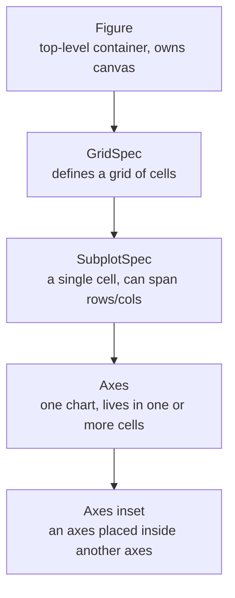
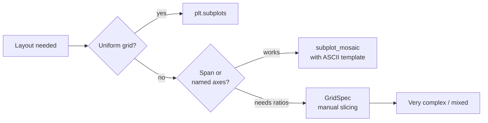
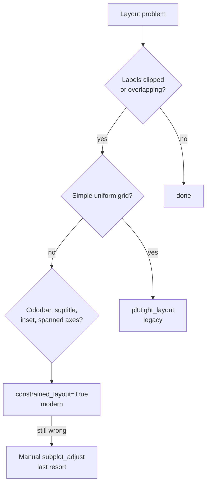

# 4. Subplots and Layouts

> [!note] Why this note exists
> A single axes can show one chart. A **figure** can hold many axes — and almost every non-trivial visualisation needs at least two: side-by-side comparisons, "small multiples" across categories, a main plot plus an inset zoom, an overview plus a detail, a grid of diagnostics. This note covers every layout tool Matplotlib offers: `plt.subplot` (the MATLAB-style state machine), `plt.subplots` (the modern, recommended factory function), `GridSpec` (for non-uniform grids), `subplot_mosaic` (for layout by ASCII template), the `twinx`/`twiny` trick for shared axes, and the layout engines (`tight_layout`, `constrained_layout`) that prevent labels from being clipped. By the end you'll be able to lay out any combination of plots you need, cleanly and reproducibly.

## Why It Matters

Once you start combining plots, you immediately hit four problems:

1. **How do I create the axes?** — `plt.subplot`, `plt.subplots`, `GridSpec`, `subplot_mosaic`, all with slightly different APIs.
2. **How do I keep labels from overlapping?** — `tight_layout` is the quick fix; `constrained_layout=True` is the modern, robust one.
3. **How do I share axes?** — shared x or y axis means labels appear only on the bottom row and zoom/pan syncs across subplots.
4. **How do I handle non-uniform layouts?** — one chart spanning two columns, an inset inside a larger chart, a colourbar attached to one axes but not the whole figure.

This note answers all four. Get this right and you'll never again write `plt.savefig("x.png")` only to discover that your title is clipped off the top of the image.

## Background

### The three layers



- **Figure** — the canvas. One figure = one saved image.
- **GridSpec** — abstract grid of `nrows × ncols` cells.
- **SubplotSpec** — one cell (or a rectangular range of cells) within the grid.
- **Axes** — one plot, with its own x/y axis. Lives inside a SubplotSpec.
- **Axes inset** — a smaller axes placed inside another axes, using `ax.inset_axes(...)`. Common for zoom insets.

### `plt.subplot` vs `plt.subplots` vs `GridSpec` vs `subplot_mosaic`

| Tool | API style | Best for |
|---|---|---|
| `plt.subplot(nrows, ncols, index)` | MATLAB-style state machine | Single quick subplot, scripts |
| `fig, axes = plt.subplots(nrows, ncols)` | Factory, returns fig + array of axes | Uniform grids (the 90% case) |
| `GridSpec(nrows, ncols)` + `fig.add_subplot(spec)` | Explicit grid with span support | Non-uniform layouts (one big + several small) |
| `fig.subplot_mosaic("ABC\nDEF")` | ASCII template | Complex layouts, named axes |

For any new code, **default to `plt.subplots`** for uniform grids and **`subplot_mosaic`** for anything more complex. The other two are still useful when reading older code or when you need very fine control.

## Main Content

### 1. Uniform grids — `plt.subplots`

```python
import numpy as np
import matplotlib.pyplot as plt

x = np.linspace(0, 2 * np.pi, 200)
fig, axes = plt.subplots(2, 2, figsize=(10, 8), constrained_layout=True,
                         sharex=True, sharey=True)

for ax, (label, fn) in zip(axes.flat,
                           [("sin", np.sin), ("cos", np.cos),
                            ("tan", np.tan), ("-sin", lambda t: -np.sin(t))]):
    ax.plot(x, fn(x))
    ax.set_title(label)
    ax.grid(True, alpha=0.3)

plt.show()
```

Key points:

- `plt.subplots(2, 2)` returns `axes` as a **2×2 NumPy array**. Use `axes.flat` (or `axes.ravel()`) to iterate.
- For the **single-axes** case (`plt.subplots()` with no args), `axes` is a single `Axes`, not an array.
- `sharex=True, sharey=True` makes the subplots share axis ranges. Matplotlib then hides the inner tick labels automatically.
- `constrained_layout=True` is the modern alternative to `plt.tight_layout()`. It recomputes the layout as you add elements, handling edge cases (colorbars, suptitles) that `tight_layout` routinely botches.

### 2. MATLAB-style — `plt.subplot`

```python
plt.figure(figsize=(10, 4))

plt.subplot(1, 3, 1)   # 1 row, 3 cols, index 1 (left)
plt.plot(x, np.sin(x))
plt.title("sin")

plt.subplot(1, 3, 2)   # index 2 (middle)
plt.plot(x, np.cos(x))
plt.title("cos")

plt.subplot(1, 3, 3)   # index 3 (right)
plt.plot(x, np.tan(x))
plt.title("tan")
plt.ylim(-5, 5)

plt.tight_layout()
plt.show()
```

`plt.subplot(nrows, ncols, index)` switches the "current axes" to the `index`-th cell (1-indexed, row-major). The state-machine nature of this API is fine for three subplots and unreadable for nine. Use it only when porting MATLAB code or for genuinely quick scripts.

### 3. Non-uniform grids — `GridSpec`

When you need a chart that spans multiple cells, `GridSpec` is the right tool:

```python
import matplotlib.pyplot as plt
import matplotlib.gridspec as gridspec
import numpy as np

fig = plt.figure(figsize=(10, 6), constrained_layout=True)
gs = gridspec.GridSpec(3, 3, figure=fig)

ax_main = fig.add_subplot(gs[0:2, :])    # rows 0-1, all cols (the big top chart)
ax_left  = fig.add_subplot(gs[2, 0])     # row 2, col 0
ax_mid   = fig.add_subplot(gs[2, 1])     # row 2, col 1
ax_right = fig.add_subplot(gs[2, 2])     # row 2, col 2

x = np.linspace(0, 10, 200)
ax_main.plot(x, np.sin(x), label="sin")
ax_main.plot(x, np.cos(x), label="cos")
ax_main.legend()
ax_main.set_title("Overview")

ax_left.hist(np.random.normal(0, 1, 500), bins=20)
ax_mid.scatter(np.random.normal(0, 1, 100), np.random.normal(0, 1, 100), s=10)
ax_right.bar(["A", "B", "C"], [3, 5, 2])

plt.show()
```

`GridSpec` slicing follows NumPy conventions: `gs[0:2, :]` means "rows 0 and 1, all columns". This makes complex layouts surprisingly readable.

### 4. Layout by template — `subplot_mosaic`

```python
fig = plt.figure(figsize=(10, 6), constrained_layout=True)
axd = fig.subplot_mosaic(
    """
    AAB
    CCD
    """
)
# axd is a dict: {'A': Axes, 'B': Axes, 'C': Axes, 'D': Axes}
# 'A' appears twice in the template -> spans two columns

axd["A"].plot([0, 1], [0, 1])
axd["B"].scatter([1, 2, 3], [3, 2, 1])
axd["C"].bar(["x", "y"], [1, 2])
axd["D"].hist(np.random.normal(0, 1, 100), bins=20)
plt.show()
```

`subplot_mosaic` reads an ASCII template where each unique character becomes a labelled axes. Repeated characters span multiple cells. This is the **most readable** way to express non-uniform layouts in code.

```python
# Complex mosaic with a colourbar
axd = fig.subplot_mosaic(
    """
    main.main.colorbar
    side.detail.colorbar
    """,
    gridspec_kw={"width_ratios": [3, 1, 0.2]},
)
```

`gridspec_kw` lets you pass `width_ratios` and `height_ratios` for further control.



### 5. Shared axes

`sharex=True, sharey=True` on `plt.subplots()` makes all axes share ranges. Benefits:

- Inner tick labels are hidden (less visual clutter).
- Zoom and pan in one axes updates all the others (in interactive backends).
- Y-axis comparisons across panels become valid because the scale is identical.

```python
fig, axes = plt.subplots(2, 2, figsize=(8, 6), sharex=True, sharey=True,
                         constrained_layout=True)
# Only the bottom row shows x tick labels
# Only the left column shows y tick labels
```

For partial sharing — e.g. each column shares x, each row shares y — pass `sharex="col", sharey="row"`.

### 6. Twin axes — `ax.twinx()` and `ax.twiny()`

When two series share an x axis but have unrelated y scales:

```python
fig, ax = plt.subplots(figsize=(8, 4))
x = np.arange(2000, 2024)
revenue = np.exp((x - 2000) * 0.08) * 10
headcount = (x - 2000) * 8 + 5

ax.plot(x, revenue, color="#4C72B0", label="revenue (M USD)")
ax.set_ylabel("Revenue (M USD)", color="#4C72B0")
ax.tick_params(axis="y", labelcolor="#4C72B0")

ax2 = ax.twinx()
ax2.plot(x, headcount, color="#DD8452", label="headcount")
ax2.set_ylabel("Headcount", color="#DD8452")
ax2.tick_params(axis="y", labelcolor="#DD8452")

plt.show()
```

> [!warning] Twin axes can mislead
> Two y-axes on the same chart invite the reader to compare trends that may not be comparable. Use them only when the two series genuinely share an x axis (time, distance) and the relationship between the y axes is unambiguous (e.g. temperature in °C and °F, which are linearly related).

### 7. Inset axes — `ax.inset_axes`

An inset is a small axes drawn inside a larger axes, typically used for a zoom-in detail:

```python
fig, ax = plt.subplots(figsize=(8, 5))
x = np.linspace(0, 10, 500)
ax.plot(x, np.sin(x) * np.exp(-x / 5))

ax_inset = ax.inset_axes([0.55, 0.55, 0.4, 0.4])  # [x, y, w, h] in axes-fraction
ax_inset.plot(x, np.sin(x) * np.exp(-x / 5))
ax_inset.set_xlim(2, 4)
ax_inset.set_ylim(-0.4, 0.4)
ax_inset.set_title("zoom")

ax.indicate_inset_zoom(ax_inset, edgecolor="black")
plt.show()
```

`indicate_inset_zoom` draws the connecting lines between the inset and the region it zooms on.

### 8. Layout engines

Two layout engines prevent label clipping:

#### `tight_layout` (the legacy fix)

```python
fig, axes = plt.subplots(2, 2)
# ... plot things ...
plt.tight_layout()
```

`tight_layout` computes bounding boxes of all artists and adjusts subplot parameters to fit. It works well for simple cases but fails for:

- Figures with `suptitle` (the title often overlaps the top row).
- Figures with a `colorbar` attached via `fig.colorbar`.
- Layouts where one axes is much taller than another.

#### `constrained_layout` (the modern fix)

```python
fig, axes = plt.subplots(2, 2, constrained_layout=True)
# ... plot things ...
# No tight_layout call needed
```

`constrained_layout` runs **incrementally** — every time you add an artist, the layout is recomputed. It handles `suptitle`, colorbars, and uneven layouts correctly. The only downside is that it's slightly slower and can't be combined with `tight_layout` (pick one).



### 9. Manual fine-tuning — `subplots_adjust`

When both `tight_layout` and `constrained_layout` fail (rare), fall back to manual:

```python
fig.subplots_adjust(left=0.1, right=0.95, bottom=0.1, top=0.9,
                    wspace=0.2, hspace=0.3)
```

`left`, `right`, `bottom`, `top` are figure-fraction coordinates of the subplot rectangle. `wspace` and `hspace` are the gaps between subplots, as fractions of the average axis width/height. This is tedious but always works.

### 10. Colorbars

The most common layout mistake with colorbars is calling `fig.colorbar(sc)` without specifying `ax=`. The colorbar then steals space from the **whole figure**, distorting every subplot. Always pass the axes you want it to attach to:

```python
fig, axes = plt.subplots(1, 2, constrained_layout=True)
sc1 = axes[0].scatter(x, y, c=z, cmap="viridis")
sc2 = axes[1].scatter(x, y, c=w, cmap="plasma")

fig.colorbar(sc1, ax=axes[0], label="z")
fig.colorbar(sc2, ax=axes[1], label="w")
```

For a single colorbar shared across multiple axes:

```python
fig, axes = plt.subplots(1, 3, constrained_layout=True)
for ax in axes:
    sc = ax.scatter(x, y, c=z, cmap="viridis", vmin=z.min(), vmax=z.max())
fig.colorbar(sc, ax=axes, label="z")   # ax=axes (array) shares the space
```

## Code Examples

### Example A — small multiples

```python
import numpy as np
import matplotlib.pyplot as plt

rng = np.random.default_rng(0)
x = np.linspace(0, 10, 200)

fig, axes = plt.subplots(4, 5, figsize=(15, 8), sharex=True, sharey=True,
                         constrained_layout=True)
for ax in axes.flat:
    noise = rng.normal(0, 0.2, 200)
    slope = rng.uniform(-1, 1)
    ax.plot(x, slope * x + noise, color="C0", alpha=0.7)
    ax.set_xticks([])
    ax.set_yticks([])
```

### Example B — dashboard with mosaic

```python
import numpy as np
import matplotlib.pyplot as plt

rng = np.random.default_rng(0)
fig = plt.figure(figsize=(12, 8), constrained_layout=True)
axd = fig.subplot_mosaic(
    """
    header header header
    main   main   side
    main   main   side
    """
)

axd["header"].set_title("Quarterly Dashboard", fontsize=14)
axd["header"].axis("off")

x = np.linspace(0, 10, 100)
axd["main"].plot(x, np.sin(x), label="sin")
axd["main"].plot(x, np.cos(x), label="cos")
axd["main"].legend()

axd["side"].hist(rng.normal(0, 1, 500), bins=20, orientation="horizontal")
plt.show()
```

### Example C — spanned axes with GridSpec

```python
import matplotlib.pyplot as plt
import matplotlib.gridspec as gridspec
import numpy as np

fig = plt.figure(figsize=(10, 6), constrained_layout=True)
gs = gridspec.GridSpec(2, 2, figure=fig,
                       width_ratios=[2, 1], height_ratios=[1, 1])

ax_top    = fig.add_subplot(gs[0, :])     # top, spans both columns
ax_bl     = fig.add_subplot(gs[1, 0])     # bottom-left
ax_br     = fig.add_subplot(gs[1, 1])     # bottom-right

x = np.linspace(0, 1, 200)
ax_top.plot(x, np.sin(2 * np.pi * x))
ax_top.set_title("Full-width top plot")

ax_bl.hist(np.random.normal(0, 1, 1000), bins=30)
ax_br.scatter(np.random.normal(0, 1, 100), np.random.normal(0, 1, 100))
plt.show()
```

### Example D — colourbar attached to one axes

```python
import numpy as np
import matplotlib.pyplot as plt

fig, ax = plt.subplots(figsize=(7, 5), constrained_layout=True)
x = np.linspace(-3, 3, 200)
y = np.linspace(-3, 3, 200)
X, Y = np.meshgrid(x, y)
Z = np.sin(X) * np.cos(Y)

im = ax.imshow(Z, extent=[-3, 3, -3, 3], origin="lower", cmap="RdBu_r")
fig.colorbar(im, ax=ax, label="value", shrink=0.8)
plt.show()
```

## Common Pitfalls

> [!danger] Forgetting `constrained_layout=True` then having labels clipped
> The most common layout bug. The fix is almost always: add `constrained_layout=True` to `plt.subplots()` or `plt.figure()`.

> [!danger] Calling `tight_layout()` after `constrained_layout=True`
> The two are mutually exclusive. `tight_layout` will raise a warning and be ignored. Pick one — and that one should usually be `constrained_layout`.

> [!danger] Iterating over a 1×N axes array incorrectly
> When `plt.subplots(1, 3)` returns a 1D array of three axes, `for ax in axes:` works. But `axes[0, 0]` raises `IndexError` because it's 1D, not 2D. Use `axes[i]` for 1D, `axes[i, j]` for 2D. To be safe, use `axes.flat` always.

> [!danger] Title overlapping with `suptitle`
> `fig.suptitle("Big title")` sits above all subplots and often overlaps the top row's titles. `constrained_layout=True` fixes this; `tight_layout` does not.

> [!danger] Colorbar stealing space from all axes
> `fig.colorbar(sc)` without `ax=` resizes the entire figure. Always pass `ax=the_axes_you_care_about`.

> [!danger] `sharex=True` but inner tick labels are still visible
> This usually means you added the axes after `plt.subplots()` returned, e.g. via `fig.add_subplot`. Re-check that all relevant axes were created through `subplots`.

> [!warning] `subplot_mosaic` requires unique single characters
> The template uses one character per cell. If you want 27+ unique axes, use multi-character labels: `subplot_mosaic("""A1.B1\nA2.B2""", empty_sentinel=".")` or pass a list of lists instead of a string.

## Tips and Tricks

> [!tip] Use `fig.suptitle` for figure-wide titles
> ```python
> fig, axes = plt.subplots(2, 2, constrained_layout=True)
> fig.suptitle("Experiment results across four seeds", fontsize=14)
> ```
> Without `constrained_layout`, `suptitle` overlaps. With it, it just works.

> [!tip] `width_ratios` and `height_ratios` for uneven grids
> ```python
> fig, axes = plt.subplots(1, 3, figsize=(10, 4),
>                          gridspec_kw={"width_ratios": [3, 1, 1]},
>                          constrained_layout=True)
> ```
> The first axes is three times as wide as the other two. Excellent for "main plot + two side panels".

> [!tip] `ax.set_axis_off()` to hide axes for text panels
> When using a mosaic and one cell is just a title or annotation, call `ax.set_axis_off()` to remove the spines and ticks.

> [!tip] `fig.set_facecolor` and `ax.set_facecolor` for dark mode
> ```python
> fig.patch.set_facecolor("#1a1a2e")
> ax.set_facecolor("#16213e")
> ```
> Use this when the chart needs to embed in a dark-mode dashboard.

> [!tip] `plt.subplots_adjust` for one-off tweaks
> If `constrained_layout` gets you 95% of the way but a colorbar is too thin, `fig.subplots_adjust(right=0.92)` after layout can nudge it.

> [!tip] Save with `bbox_inches="tight"`
> Even with `constrained_layout`, calling `fig.savefig("out.png", bbox_inches="tight", dpi=300)` removes any remaining whitespace around the figure. Belt-and-braces.

> [!tip] Reuse axes via `ax.clear()`
> For animations or interactive updates, don't recreate the figure each frame — call `ax.clear()` and redraw into the same axes. See [[5. Advanced Visualization]] for `FuncAnimation`.

## Active Recall

1. What is the difference between `plt.subplot(2, 3, 4)` and `plt.subplots(2, 3)`? Which is preferred?
2. `plt.subplots(2, 2)` returns `axes` as what type? How do you iterate over it?
3. `plt.subplots(1, 3)` returns `axes` as what type? Why is this different from the 2×2 case?
4. What does `sharex="col"` do? When would you use it?
5. Write a `GridSpec` call that creates a 3×3 grid where the top-left axes spans 2 rows and 2 columns.
6. Write the same layout using `subplot_mosaic` with an ASCII template.
7. What is the difference between `tight_layout()` and `constrained_layout=True`? Which should you use?
8. Why does `fig.colorbar(sc)` without `ax=` often distort the figure? How do you fix it?
9. You want a single colorbar shared across three side-by-side axes. How?
10. What does `ax.twinx()` return? What's a legitimate use case? What's a misleading one?
11. How do you create an inset axes inside another axes? What method draws the connecting lines?
12. Write a `gridspec_kw` argument to `plt.subplots` that makes the first column three times as wide as the second.
13. What is the role of `fig.suptitle`? Why does it overlap titles without `constrained_layout`?
14. Convert this MATLAB-style snippet to OO style with shared axes:
    ```python
    plt.subplot(2, 1, 1); plt.plot(x, y1)
    plt.subplot(2, 1, 2); plt.plot(x, y2)
    ```

## Next Steps

You can now compose figures of arbitrary complexity. The final note in this chapter, [[5. Advanced Visualization]], covers what you can't do with two dimensions: 3D plots via `mpl_toolkits.mplot3d`, heatmaps with `imshow`, contour plots, quiver fields for vector data, animations with `FuncAnimation`, and the modern alternatives `seaborn` (for statistical plots) and `plotly` (for interactive, web-native charts).

When you start working with images — in the [[26. Image Processing/1. Pillow Basics]] chapter — you'll use `imshow` heavily to inspect what comes out of Pillow and OpenCV. The layout skills from this note (especially `subplots` with shared axes and colorbars) will be essential for showing original vs processed image pairs side by side.
