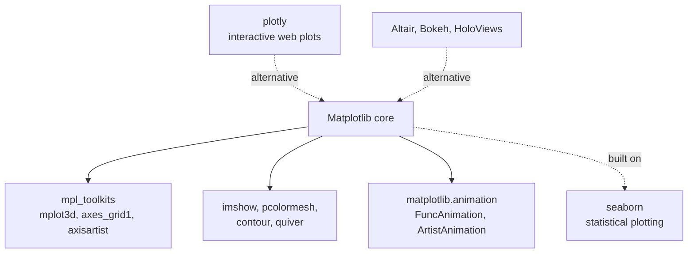
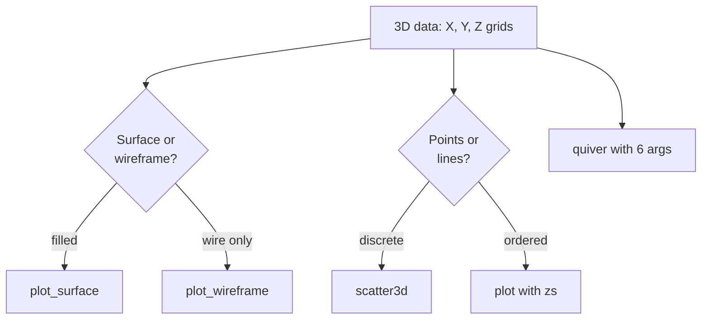
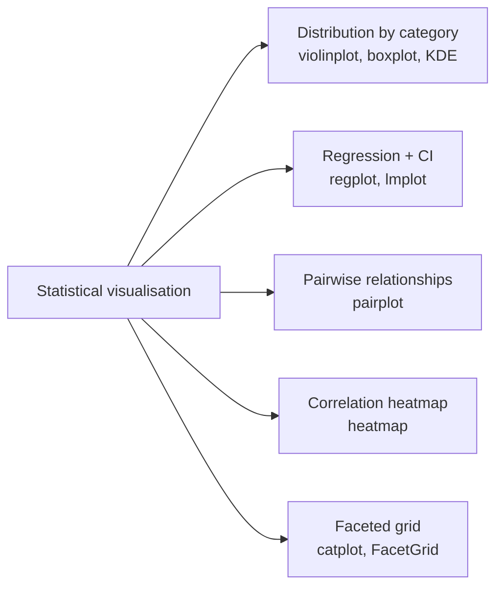
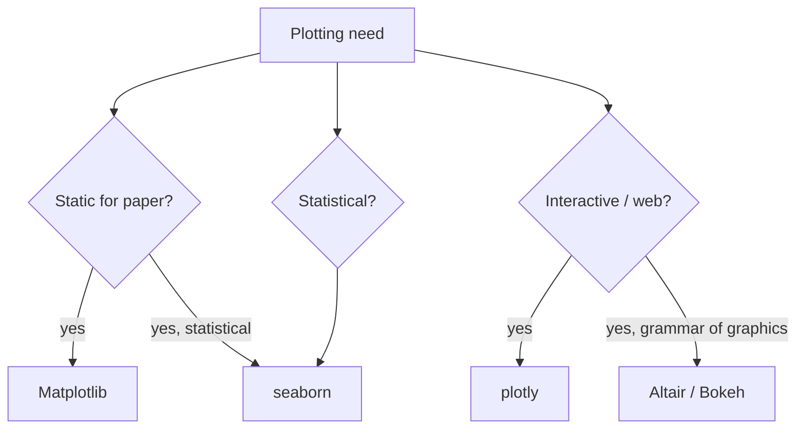

# 5. Advanced Visualization

> [!note] Why this note exists
> Most charts you'll ever make are covered by the previous four notes: lines, bars, scatters, histograms, subplots. But a few visualisations need either **more than two axes** (3D surfaces, contour plots), **time as a dimension** (animations), or **richer statistical content** than vanilla Matplotlib makes easy (regression plots, kernel density estimates, faceted grids). This note covers all of those: 3D plots with `mpl_toolkits.mplot3d`, heatmaps with `imshow`, contour and quiver plots, animations with `FuncAnimation`, and the two libraries that extend Matplotlib's reach further — `seaborn` for statistical work and `plotly` for interactive web-native charts. After this note you'll know which tool to reach for when a static 2D chart isn't enough.

## Why It Matters

Three situations push you past basic Matplotlib:

1. **Your data is intrinsically 3D or 2D-field** — surfaces, vector fields, images, heatmaps of correlations. A flat line chart is the wrong encoding.
2. **You need to show change over time** — a system evolving, a training loss decreasing, a wave propagating. Static charts can be tiled (small multiples) but animations are often clearer.
3. **You need richer statistical content** — distributions split by category, regression lines with confidence intervals, marginal histograms. Vanilla Matplotlib can do all of these, but `seaborn` does them in one call and looks better by default.

Each of these has a right tool. The wrong tool — forcing a 3D bar chart, animating what should be a static grid — actively confuses readers. This note helps you pick correctly.

## Background

### What "advanced" means

We use the word "advanced" loosely here. None of the techniques below require more Matplotlib knowledge than the previous notes; they require a different **vocabulary**:

- **Field data** — values on a 2D grid (image, heatmap, contour).
- **Vector data** — values with direction (quiver, streamplot).
- **3D data** — three spatial dimensions (surface, wireframe, scatter, mesh).
- **Time-varying data** — a sequence of frames (animation).

### The Matplotlib extension ecosystem



`seaborn` is built on Matplotlib — every chart it returns is a normal Matplotlib `Axes` you can keep customising. `plotly`, `Altair`, `Bokeh`, and `HoloViews` are **alternatives**: they render via JavaScript in a browser, with full interactivity (hover, zoom, pan), but they don't share Matplotlib's API.

## Main Content

### 1. Heatmaps — `ax.imshow`

`imshow` displays a 2D array as a coloured image. It's the standard tool for correlation matrices, confusion matrices, and any 2D scalar field.

```python
import numpy as np
import matplotlib.pyplot as plt

rng = np.random.default_rng(0)
data = rng.normal(0, 1, (10, 12))

fig, ax = plt.subplots(figsize=(8, 6))
im = ax.imshow(data, cmap="RdBu_r", vmin=-3, vmax=3, aspect="auto")
ax.set_xticks(range(12))
ax.set_yticks(range(10))
fig.colorbar(im, ax=ax, label="value")
plt.show()
```

Key arguments:

| Argument | Effect |
|---|---|
| `cmap` | Colourmap name. Diverging data → `"RdBu_r"`, `"coolwarm"`. Sequential → `"viridis"`, `"plasma"`. |
| `vmin`, `vmax` | Range for colour scaling. Set explicitly for cross-chart consistency. |
| `aspect` | `"equal"` (default, square pixels) or `"auto"` (fill the axes). |
| `origin` | `"upper"` (default, matrix convention) or `"lower"` (Cartesian convention). |
| `extent` | `[left, right, bottom, top]` in data coordinates — for non-pixel grids. |
| `interpolation` | `"nearest"`, `"bilinear"`, `"bicubic"`, etc. Default is `"antialiased"`. |

#### Annotated heatmap

```python
fig, ax = plt.subplots(figsize=(8, 6))
im = ax.imshow(data, cmap="viridis")
for i in range(data.shape[0]):
    for j in range(data.shape[1]):
        ax.text(j, i, f"{data[i, j]:.1f}",
                ha="center", va="center",
                color="white" if data[i, j] < 0 else "black")
fig.colorbar(im, ax=ax)
```

This is the canonical "confusion matrix" or "correlation matrix" pattern.

### 2. Pseudocolor plots — `ax.pcolormesh`

`pcolormesh` is like `imshow` but for **non-uniform grids**. You pass `X`, `Y`, `C` where `X` and `Y` define the cell edges.

```python
x = np.linspace(-3, 3, 100)
y = np.linspace(-3, 3, 100)
X, Y = np.meshgrid(x, y)
Z = np.sin(X) * np.cos(Y)

fig, ax = plt.subplots(figsize=(7, 5))
mesh = ax.pcolormesh(X, Y, Z, cmap="RdBu_r", shading="auto")
fig.colorbar(mesh, ax=ax)
plt.show()
```

`pcolormesh` is faster than the older `pcolor` and is the recommended choice for new code.

### 3. Contour plots — `ax.contour` and `ax.contourf`

```python
fig, axes = plt.subplots(1, 2, figsize=(12, 5), constrained_layout=True)

# Line contours
cs = axes[0].contour(X, Y, Z, levels=15, cmap="RdBu_r")
axes[0].clabel(cs, inline=True, fontsize=8)   # label each contour
axes[0].set_title("contour")

# Filled contours
csf = axes[1].contourf(X, Y, Z, levels=15, cmap="RdBu_r")
fig.colorbar(csf, ax=axes[1])
axes[1].set_title("contourf")
plt.show()
```

- `levels` — integer (Matplotlib picks) or explicit list `[0, 0.2, 0.5, 1]`.
- `clabel` — annotate each contour with its value. Useful for engineering charts (isobars, isotherms).

### 4. Vector fields — `ax.quiver` and `ax.streamplot`

```python
# Quiver: arrows on a grid
x = np.linspace(-2, 2, 20)
y = np.linspace(-2, 2, 20)
X, Y = np.meshgrid(x, y)
U = -Y
V = X

fig, ax = plt.subplots(figsize=(6, 6))
ax.quiver(X, Y, U, V, pivot="middle")
ax.set_title("Rotational vector field")
plt.show()
```

```python
# Streamplot: smooth flow lines
fig, ax = plt.subplots(figsize=(7, 5))
strm = ax.streamplot(X, Y, U, V, color=np.sqrt(U**2 + V**2),
                     cmap="viridis", linewidth=1.5, density=1.5)
fig.colorbar(strm.lines, ax=ax)
plt.show()
```

`streamplot` produces the beautiful "field lines" visualisation common in fluid dynamics and electromagnetism textbooks.

### 5. 3D plots — `mpl_toolkits.mplot3d`

To enable 3D, pass `projection="3d"` to `add_subplot` or `plt.subplots`:

```python
import numpy as np
import matplotlib.pyplot as plt

fig = plt.figure(figsize=(9, 6))
ax = fig.add_subplot(projection="3d")

x = np.linspace(-5, 5, 100)
y = np.linspace(-5, 5, 100)
X, Y = np.meshgrid(x, y)
Z = np.sin(np.sqrt(X**2 + Y**2))

surf = ax.plot_surface(X, Y, Z, cmap="viridis", edgecolor="none",
                       rstride=2, cstride=2)
fig.colorbar(surf, ax=ax, shrink=0.5, label="z")
ax.set_xlabel("x"); ax.set_ylabel("y"); ax.set_zlabel("z")
plt.show()
```

3D plotting tools:

| Function | Effect |
|---|---|
| `ax.plot_surface(X, Y, Z)` | Filled surface. |
| `ax.plot_wireframe(X, Y, Z)` | Wireframe only. |
| `ax.scatter(xs, ys, zs)` | 3D scatter. |
| `ax.plot(xs, ys, zs)` | 3D line. |
| `ax.contour(X, Y, Z, offset=...)` | Contour projected onto a plane. |
| `ax.bar3d(x, y, z, dx, dy, dz)` | 3D bars. |
| `ax.quiver(x, y, z, u, v, w)` | 3D vector field. |



> [!warning] 3D plots are often a bad idea
> 3D charts on a 2D screen suffer from occlusion (front hides back) and perspective distortion (the back of the bar looks smaller than the front). Edward Tufte's rule: "the only thing worse than a pie chart is a 3D pie chart." Use 3D when the data is intrinsically volumetric (medical imaging, fluid flow); otherwise use a contour or heatmap.

### 6. Animations — `FuncAnimation`

`FuncAnimation` calls a function repeatedly, each frame producing a new state of the figure. The function receives a frame index and updates artists in place.

```python
import numpy as np
import matplotlib.pyplot as plt
from matplotlib.animation import FuncAnimation

fig, ax = plt.subplots(figsize=(8, 4))
x = np.linspace(0, 2 * np.pi, 200)
line, = ax.plot(x, np.sin(x))
ax.set_ylim(-1.2, 1.2)

def update(frame):
    line.set_ydata(np.sin(x + frame * 0.05))
    return line,

ani = FuncAnimation(fig, update, frames=200, interval=30, blit=True)
# Save to file:
ani.save("wave.mp4", writer="ffmpeg", fps=30)
# ani.save("wave.gif", writer="pillow", fps=30)
plt.show()
```

Key points:

- `blit=True` redraws only the artists returned from `update`. Much faster, but requires the returned list to be exact.
- `interval` is milliseconds between frames.
- Saving requires a writer: `"ffmpeg"` for MP4, `"pillow"` for GIF. Install via `pip install ffmpeg-python` or rely on the system `ffmpeg` binary.
- In Jupyter with `ipympl`, the animation plays inline.

### 7. Statistical plots with `seaborn`

`seaborn` is a high-level interface for statistical chart types, built on Matplotlib. It shines for:

- **Distribution comparisons** across categories (violin, KDE, box).
- **Regression** with confidence intervals.
- **Faceted grids** ("small multiples" by category).
- **Beautiful defaults** out of the box.

```python
import seaborn as sns
import matplotlib.pyplot as plt

# Load a built-in dataset
tips = sns.load_dataset("tips")

# 1. Distribution by category
sns.violinplot(data=tips, x="day", y="total_bill", hue="sex", split=True)
plt.show()

# 2. Regression with confidence interval
sns.regplot(data=tips, x="total_bill", y="tip")
plt.show()

# 3. Pairwise relationships
sns.pairplot(tips, hue="sex")
plt.show()

# 4. Heatmap of correlations
sns.heatmap(tips.select_dtypes("number").corr(), annot=True, cmap="coolwarm")
plt.show()
```



Seaborn returns Matplotlib `Axes` or `FacetGrid` objects, so you can keep customising:

```python
ax = sns.regplot(data=tips, x="total_bill", y="tip")
ax.set_title("Tips vs total bill")
ax.set_xlabel("Total bill (USD)")
```

### 8. Interactive plots with `plotly`

`plotly` is a separate ecosystem that renders charts as interactive JavaScript widgets. Charts support hover tooltips, zoom, pan, and clickable legend entries out of the box. They render in Jupyter, in HTML dashboards, and in Streamlit apps.

```python
import plotly.express as px

df = px.data.iris()
fig = px.scatter(df, x="sepal_width", y="sepal_length",
                 color="species", size="petal_length",
                 hover_data=["petal_width"])
fig.show()
fig.write_html("iris.html")
```

```python
import plotly.graph_objects as go

fig = go.Figure(data=go.Surface(z=np.sin(np.sqrt(X**2 + Y**2))))
fig.update_layout(title="3D surface", scene=dict(zaxis_title="z"))
fig.show()
```

When to use plotly instead of Matplotlib:

- **Dashboards** — plotly charts are interactive by default and integrate cleanly with Dash and Streamlit.
- **Exploratory analysis** — hover tooltips let you inspect individual points.
- **3D data** — plotly's 3D rendering is genuinely interactive (rotate, zoom), unlike Matplotlib's static 3D.

When to stick with Matplotlib:

- **Publications** — Matplotlib produces vector PDFs that look perfect in print; plotly's static export is rasterised.
- **Reproducibility** — a static PNG is easier to embed in a report than a JavaScript widget.
- **Customisation** — Matplotlib exposes every artist; plotly's API is higher-level and harder to push past its designed use cases.



## Code Examples

### Example A — correlation heatmap

```python
import numpy as np
import matplotlib.pyplot as plt
import pandas as pd

rng = np.random.default_rng(0)
df = pd.DataFrame(rng.normal(0, 1, (200, 6)),
                  columns=["A", "B", "C", "D", "E", "F"])
df["B"] = df["A"] * 0.7 + df["B"] * 0.3   # induce correlation
corr = df.corr()

fig, ax = plt.subplots(figsize=(6, 5))
im = ax.imshow(corr, cmap="RdBu_r", vmin=-1, vmax=1)
ax.set_xticks(range(len(corr)))
ax.set_yticks(range(len(corr)))
ax.set_xticklabels(corr.columns, rotation=45)
ax.set_yticklabels(corr.columns)
for i in range(len(corr)):
    for j in range(len(corr)):
        ax.text(j, i, f"{corr.iloc[i, j]:.2f}",
                ha="center", va="center",
                color="white" if abs(corr.iloc[i, j]) > 0.5 else "black")
fig.colorbar(im, ax=ax)
plt.show()
```

### Example B — 3D surface with projected contour

```python
import numpy as np
import matplotlib.pyplot as plt

x = np.linspace(-3, 3, 80)
y = np.linspace(-3, 3, 80)
X, Y = np.meshgrid(x, y)
Z = np.sin(X) * np.cos(Y) * np.exp(-(X**2 + Y**2) / 8)

fig = plt.figure(figsize=(10, 7))
ax = fig.add_subplot(projection="3d")
ax.plot_surface(X, Y, Z, cmap="viridis", alpha=0.8)
ax.contour(X, Y, Z, zdir="z", offset=-0.5, cmap="viridis")
ax.set_zlim(-0.5, 0.5)
plt.show()
```

### Example C — animated gradient descent

```python
import numpy as np
import matplotlib.pyplot as plt
from matplotlib.animation import FuncAnimation

# 1D loss: f(x) = (x - 3)^2
xs = np.linspace(-2, 8, 200)
ys = (xs - 3) ** 2

# Gradient descent trajectory
x = -1.5
lr = 0.1
trajectory = [x]
for _ in range(50):
    x = x - lr * 2 * (x - 3)
    trajectory.append(x)

fig, ax = plt.subplots(figsize=(8, 4))
ax.plot(xs, ys, color="lightgrey")
point, = ax.plot([], [], "ro", markersize=10)
ax.set_xlim(-2, 8)
ax.set_ylim(-1, 30)

def update(i):
    px = trajectory[i]
    point.set_data([px], [(px - 3) ** 2])
    return point,

ani = FuncAnimation(fig, update, frames=len(trajectory),
                    interval=100, blit=True)
ani.save("gd.mp4", writer="ffmpeg", fps=10)
plt.show()
```

### Example D — seaborn pairplot

```python
import seaborn as sns
import matplotlib.pyplot as plt

penguins = sns.load_dataset("penguins")
sns.pairplot(penguins, hue="species",
             vars=["bill_length_mm", "bill_depth_mm",
                   "flipper_length_mm", "body_mass_g"])
plt.show()
```

### Example E — plotly interactive 3D

```python
import plotly.express as px
import numpy as np

df = px.data.iris()
fig = px.scatter_3d(df, x="sepal_length", y="sepal_width", z="petal_length",
                    color="species", size="petal_width", opacity=0.7)
fig.update_layout(margin=dict(l=0, r=0, b=0, t=0))
fig.write_html("iris_3d.html")
```

## Common Pitfalls

> [!danger] `imshow` with default `aspect="equal"` squishes small charts
> If your axes is wider than tall, `imshow` with `aspect="equal"` (the default) leaves large empty bands on either side. Pass `aspect="auto"` to fill the axes, or accept the empty space if you want pixels to stay square.

> [!danger] Wrong `origin` for image data
> `imshow` defaults to `origin="upper"`, matching the matrix convention (row 0 at the top). When displaying photographs or fields where the Cartesian convention is expected (y increases upward), pass `origin="lower"`. Mismatched origin is the most common reason a chart looks "upside down".

> [!danger] `vmin`/`vmax` inconsistent across panels
> If you compare two heatmaps side by side, the colour scale must be identical. Without `vmin` and `vmax` on both, Matplotlib normalises each independently and the comparison is meaningless.

> [!danger] 3D bar charts
> 3D bars suffer from perspective distortion and occlusion. The back row appears smaller and is hidden by the front row. Use a grouped 2D bar chart or a heatmap instead.

> [!danger] `FuncAnimation` doesn't show in Jupyter inline
> Inline Jupyter shows only static images by default. To see animations, switch to `%matplotlib widget` (ipympl) or save to a file and embed.

> [!danger] Forgetting to keep a reference to the animation
> ```python
> ani = FuncAnimation(...)   # works
> FuncAnimation(...)         # garbage-collected immediately; never plays
> ```
> Always assign the return value to a variable that lives at module scope. The animation is driven by a timer that Python's GC will happily reap if there's no reference.

> [!warning] `blit=True` with the wrong returned list
> With `blit=True`, `update` must return an iterable of every artist it modified. Forgetting one means it never updates on screen. For complex updates, use `blit=False` — slower but bulletproof.

> [!warning] `seaborn` API changes
> Seaborn had a major rewrite at v0.11 (2020) and another at v0.12 (2022). Older tutorials use `sns.distplot` (deprecated → `sns.histplot`) and `sns.factorplot` (deprecated → `sns.catplot`). Pin your seaborn version or follow the latest docs.

## Tips and Tricks

> [!tip] `imshow` is the fastest way to inspect any 2D array
> Whether it's an image, a correlation matrix, a confusion matrix, or a NumPy field, `ax.imshow(arr)` immediately shows structure. Pair with `fig.colorbar(im)` and you have a complete diagnostic.

> [!tip] Use `np.histogram2d` + `pcolormesh` for non-uniform 2D binning
> ```python
> H, xe, ye = np.histogram2d(x, y, bins=[np.linspace(0, 10, 50),
>                                        np.linspace(0, 5, 25)])
> ax.pcolormesh(xe, ye, H.T, cmap="Blues")
> ```

> [!tip] Combine `plot_surface` with `contour` for context
> Projecting contours onto the "floor" of a 3D plot helps readers understand the surface's shape. See Example B above.

> [!tip] `set_box_aspect` for 3D plots
> ```python
> ax.set_box_aspect((1, 1, 0.5))   # x : y : z ratio
> ```
> Default 3D plots often look stretched. `set_box_aspect` fixes the aspect ratio of the bounding box.

> [!tip] Save animations as both MP4 and GIF
> MP4 is smaller and higher quality; GIF works in PowerPoint and older systems. `ani.save("a.mp4", writer="ffmpeg")` and `ani.save("a.gif", writer="pillow")`.

> [!tip] `sns.set_theme()` for project-wide seaborn style
> ```python
> import seaborn as sns
> sns.set_theme(style="whitegrid", palette="Set2")
> ```
> After this, every Matplotlib chart inherits seaborn's style. Use `sns.reset_defaults()` to revert.

> [!tip] `plotly` for hover-only interactivity
> If the only reason you reach for plotly is hover tooltips, you can get similar behaviour in Matplotlib via `mplcursors`:
> ```python
> import mplcursors
> sc = ax.scatter(x, y)
> mplcursors.cursor(sc)
> ```

> [!tip] `Altair` if you want the grammar of graphics
> Altair implements a declarative "grammar of graphics" style (similar to R's ggplot2). Charts are JSON specs rendered by Vega-Lite in the browser. Excellent for quick interactive exploration; not as flexible as Matplotlib for finicky publication details.

## Active Recall

1. What does `ax.imshow(arr)` do? Name three things it's commonly used for.
2. Why does `imshow` default to `aspect="equal"`? When would you change it?
3. What's the difference between `contour` and `contourf`?
4. Write a `pcolormesh` call for non-uniformly spaced `X` and `Y` grids.
5. Name three 3D plotting functions on a 3D axes.
6. Why are 3D bar charts usually a bad idea? What should you use instead?
7. What does `FuncAnimation` need from the `update` function? What changes when `blit=True`?
8. Why must you keep a reference to the return value of `FuncAnimation`?
9. What does `seaborn.regplot` add over a plain `ax.scatter`?
10. What does `sns.pairplot` show? When would you use it?
11. Name two reasons to use `plotly` instead of Matplotlib.
12. Name two reasons to use Matplotlib instead of `plotly`.
13. How do you keep colour scales consistent across two side-by-side heatmaps?
14. What is `mplcursors`, and when is it a viable alternative to plotly?

## Next Steps

This concludes Chapter 25. You now have the complete vocabulary to produce, style, and compose Matplotlib charts of any kind, and to know when to reach for `seaborn` or `plotly` instead.

Chapter 26, [[26. Image Processing/1. Pillow Basics]], pivots from *drawing* images (charts) to *processing* them (photographs, scans, screenshots). Pillow is the entry point — opening, saving, resizing, cropping, filtering — and the NumPy/OpenCV chapters that follow assume you can display intermediate results with `imshow`. The Matplotlib skills you've just learned will be indispensable for that.

If you want to deepen your Matplotlib knowledge further, the official gallery at `matplotlib.org/stable/gallery` is the best resource — every example comes with source code you can copy, and the gallery is organised by chart type. Pair it with the `seaborn` gallery and the `plotly` tutorial for a complete picture of the Python visualisation ecosystem.
