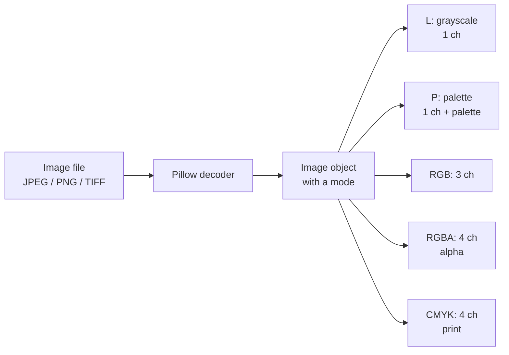
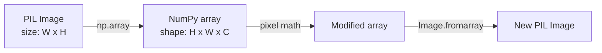

# 1. Pillow Basics

> [!note] Why this note exists
> Pillow is the **standard image-processing library** in Python — the one you reach for when you need to open a JPEG, resize it, paste a watermark on it, convert it to grayscale, and save it back to disk. It is the maintained fork of the original Python Imaging Library (PIL), and although the package name on PyPI is `Pillow`, you still import it as `import PIL` — a relic of its history that trips up every newcomer. This note introduces Pillow's core vocabulary: the `Image` class, the **image modes** (`RGB`, `RGBA`, `L`, `P`, `CMYK`), the basic open/save/inspect cycle, and the bridging to NumPy and Matplotlib that you'll need throughout the rest of this chapter. After this note, [[2. Image Operations]] dives deeper into resize/crop/filter, and [[3. OpenCV Basics]] contrasts Pillow's high-level interface with OpenCV's NumPy-centric one.

## Why It Matters

Almost every Python program that touches an image will use Pillow at some point, even if it ultimately processes the pixels with OpenCV, NumPy, or PyTorch. The reasons:

- Pillow is the **default decoder/encoder** for image files. `tf.keras.utils.load_img`, `torchvision.io.read_image`, and `cv2.imread` (with `cv2.IMREAD_UNCHANGED` on certain formats) all rely on Pillow's format plugins under the hood.
- Pillow's `Image` objects are **ergonomic**: `image.resize((w, h))`, `image.rotate(90)`, `image.crop((left, top, right, bottom))` are simple, chainable, and well-documented. They do not require thinking about NumPy array shapes or channel ordering.
- Pillow handles **metadata** (EXIF, ICC profiles, DPI) in a way that's easy to preserve across transformations.
- Pillow has a clean **conversion** story between image modes (`RGB`  `RGBA`  `L`  `P`) that takes care of gamma, palettes, and alpha compositing correctly.

If you only learn one image library in Python, make it Pillow. The rest of the chapter adds OpenCV (for computer vision), NumPy (for pixel-level manipulation), and SciPy (for convolutions) — but they all coexist with Pillow, not replace it.

## Background

### History: PIL → Pillow

- **1995–2009**: Fredrik Lundh writes the Python Imaging Library (PIL), the first serious image library for Python. PIL supports JPEG, PNG, GIF, BMP, TIFF, and many other formats.
- **2010**: PIL's development stalls. The Python 3 port never ships.
- **2010–2012**: Alex Clark and contributors fork PIL as **Pillow**, add Python 3 support, fix bugs, and keep the original `PIL` import name for backwards compatibility.
- **Today**: Pillow is the de facto standard. The original PIL is unmaintained and should not be used.

The split means: install `Pillow` (with a capital P), import `PIL` (with a capital P, no `l`). This is the number-one confusion for newcomers.

```bash
pip install Pillow        # the package
```

```python
from PIL import Image     # the import
img = Image.open("photo.jpg")
```

### What Pillow does — and doesn't

Pillow's strengths:

- File I/O for ~30 image formats (JPEG, PNG, GIF, BMP, TIFF, WebP, and many more).
- Basic operations: resize, rotate, crop, paste, transpose.
- Filters: blur, sharpen, edge enhance, contour, emboss, find edges.
- Colour space conversions: RGB  L (grayscale), RGB  RGBA, RGB  CMYK, RGB  HSV, RGB  YCbCr.
- Image enhancement: brightness, contrast, color, sharpness.
- Drawing primitives: lines, rectangles, ellipses, polygons, text (`ImageDraw`).
- Font rendering: TrueType and OpenType via FreeType (`ImageFont`).

Pillow's limits:

- **No computer vision.** No edge detection (Canny, Sobel), no contour finding, no feature matching. Use OpenCV — see [[3. OpenCV Basics]].
- **No NumPy-style array math on pixels.** You *can* convert to a NumPy array (`np.array(img)`) and back (`Image.fromarray(arr)`), but the conversion is a copy. For heavy pixel math, work in NumPy directly — see [[7. NumPy for Images]].
- **Limited multi-page TIFF support** — Pillow can read multi-frame TIFFs and GIFs but is not a full scientific imaging library. For multidimensional arrays (e.g. microscopy), use `tifffile` or `imageio`.

## Main Content

### 1. The `Image` class

The `Image` class is Pillow's central type. An `Image` object holds:

- A pixel buffer (stored internally as a contiguous array of bytes).
- A **mode** (e.g. `"RGB"`, `"RGBA"`, `"L"`) describing the buffer's layout.
- A **size** `(width, height)` in pixels.
- An optional **palette** (for mode `"P"`).
- An optional **info** dict (EXIF, DPI, ICC profile, transparency index).

You create `Image` objects in three ways:

```python
from PIL import Image

# 1. Open from a file
img = Image.open("photo.jpg")

# 2. Create a blank image
blank = Image.new("RGB", (800, 600), color=(255, 255, 255))

# 3. Convert from a NumPy array
import numpy as np
arr = np.zeros((600, 800, 3), dtype=np.uint8)
arr[:] = (128, 128, 128)
img_from_arr = Image.fromarray(arr)
```

### 2. The open / save cycle

```python
from PIL import Image

# Open — lazy: the file header is read but pixel data is not loaded
img = Image.open("photo.jpg")

# Force-load pixels (rarely needed; operations do this implicitly)
img.load()

# Inspect
print(img.format)       # 'JPEG'
print(img.mode)         # 'RGB'
print(img.size)         # (1920, 1080) — width, height
print(img.info)         # {'dpi': (72, 72), 'jfif': 1, ...}

# Save
img.save("output.png")             # extension determines format
img.save("output.jpg", quality=90) # JPEG-specific option
img.save("output.webp", lossless=True)
```

Key facts:

- `Image.open` is **lazy** — it reads the header but defers pixel loading until you call `img.load()` or perform an operation that needs pixels. This lets Pillow open enormous files efficiently and means that **the file must remain open** until the pixels are loaded. If you open many images in a loop, the underlying file handle is held until garbage collection. Use a context manager to be safe:

```python
with Image.open("photo.jpg") as img:
    img.load()
    img.thumbnail((1024, 1024))
    img.save("thumb.png")
```

- The **extension** of the filename usually determines the format on save. To override, pass `format=`:
  ```python
  img.save("output.bin", format="PNG")
  ```
- JPEG-specific options: `quality` (1–95), `progressive=True`, `optimize=True`, `subsampling`.
- PNG-specific options: `compress_level` (0–9, default 6), `optimize=True`.
- WebP options: `quality`, `lossless=True`, `method` (0–6, tradeoff speed vs size).

### 3. Image modes

The **mode** of an image describes how its pixels are stored. Pillow supports many modes; the five you'll meet constantly are:

| Mode | Meaning | Channels | Bits per pixel |
|---|---|---|---|
| `"L"` | Luminance (grayscale) | 1 | 8 |
| `"P"` | Palette (indexed) | 1 index into a 256-colour palette | 8 |
| `"RGB"` | Red, Green, Blue | 3 | 24 |
| `"RGBA"` | RGB + Alpha | 4 | 32 |
| `"CMYK"` | Cyan, Magenta, Yellow, Key (black) | 4 | 32 |

Less common modes include `"1"` (1-bit black/white), `"I"` (32-bit signed int), `"F"` (32-bit float), `"YCbCr"`, `"LAB"`, `"HSV"`, `"I;16"` (16-bit grayscale).



#### Converting between modes

```python
img_rgb = Image.open("photo.jpg")            # typically RGB
img_gray = img_rgb.convert("L")              # to grayscale
img_rgba = img_rgb.convert("RGBA")           # add alpha channel
img_p = img_rgb.convert("P", palette=Image.ADAPTIVE, colors=256)  # to palette
img_cmyk = img_rgb.convert("CMYK")           # for print
```

Mode conversions are **not always lossless**:

- RGB → L uses `L = R * 299/1000 + G * 587/1000 + B * 114/1000` (the ITU-R 601-2 luma transform). Information about hue is irretrievably lost.
- RGB → P quantises to 256 colours (or fewer, with `colors=`). The palette is built adaptively unless you specify `palette=Image.WEB`.
- RGBA → RGB drops the alpha channel. Use `img.convert("RGB")` directly, or first composite over a background (`Image.alpha_composite`).
- CMYK  RGB depends on the colour profile. Without ICC profile management, the conversion is approximate.

> [!tip] Always convert to RGB before saving as JPEG
> JPEG does not support alpha. If you save an `RGBA` image as JPEG, Pillow raises `OSError: cannot write mode RGBA as JPEG`. Call `img.convert("RGB")` first.

### 4. Image attributes

```python
img = Image.open("photo.jpg")
print(img.format)        # 'JPEG' — original file format, None for new()
print(img.mode)          # 'RGB'
print(img.size)          # (1920, 1080) — (width, height) tuple
print(img.width)         # 1920
print(img.height)        # 1080
print(img.info)          # dict of metadata
print(img.palette)       # ImagePalette object or None
```

Note the **width-first** convention: `img.size == (width, height)`. This is the **opposite** of NumPy, where an array shape is `(height, width, channels)`. This single difference is the source of countless bugs when converting between Pillow and NumPy — see [[7. NumPy for Images]].

### 5. Displaying images

Pillow has a built-in viewer:

```python
img.show()   # opens the system's default image viewer
```

`show()` is convenient for quick checks but platform-dependent (it writes a temporary PNG and invokes `open` on macOS, `xdg-open` on Linux, the default photo viewer on Windows). For anything you want to embed in a notebook or control programmatically, use Matplotlib:

```python
import matplotlib.pyplot as plt

plt.imshow(img)        # Matplotlib accepts PIL Image directly
plt.axis("off")
plt.show()
```

In Jupyter, a PIL `Image` object is rendered inline automatically if it's the last expression in a cell — just type `img` and the image appears.

### 6. The info dict and EXIF

```python
img = Image.open("DSC_0123.jpg")
print(img.info.keys())
# dict_keys(['exif', 'dpi', 'adobe', 'progression', 'icc_profile'])

# Extract EXIF
from PIL import ExifTags
exif = img._getexif()                       # dict of tag_number -> value
for tag_id, value in exif.items():
    name = ExifTags.TAGS.get(tag_id, tag_id)
    print(f"{name}: {value}")
```

For orientation, the `Orientation` EXIF tag (0x0112) is critical — many phone cameras store landscape photos rotated, with the orientation tag indicating that the decoder should rotate. Pillow does **not** apply this automatically; use `ImageOps.exif_transpose`:

```python
from PIL import ImageOps
img = ImageOps.exif_transpose(img)   # rotates to the correct orientation
```

Without this, photos taken on a phone in portrait mode often appear sideways when displayed.

### 7. Bridging to NumPy

```python
import numpy as np
from PIL import Image

img = Image.open("photo.jpg")          # RGB Image
arr = np.array(img)                    # shape: (H, W, 3), dtype: uint8
print(arr.shape, arr.dtype)            # (1080, 1920, 3) uint8

# Modify
arr[:, :, 1] = 0                        # zero out green channel
new_img = Image.fromarray(arr)         # back to Image
new_img.save("no_green.jpg")
```

Important notes:

- `np.array(img)` shares memory with the Image's buffer where possible (for modes `"L"`, `"RGB"`, `"RGBA"`). Modifying the array modifies the image. If you want a copy, use `arr = np.array(img).copy()`.
- The shape is `(height, width, channels)` — the **opposite** of Pillow's `(width, height)`. This is the single biggest source of off-by-one bugs.
- `Image.fromarray` infers the mode from the array shape and dtype:
  - `(H, W)` uint8 → `"L"`
  - `(H, W, 3)` uint8 → `"RGB"`
  - `(H, W, 4)` uint8 → `"RGBA"`
  - `(H, W)` float32 → `"F"`
  - For other dtypes (e.g. uint16), pass `mode=` explicitly.



### 8. Loading from bytes (in-memory)

When images arrive over HTTP or from a database, you have bytes, not a file path. Pillow's `Image.open` accepts any binary stream:

```python
from io import BytesIO
from PIL import Image
import requests

r = requests.get("https://example.com/photo.jpg")
img = Image.open(BytesIO(r.content))
img.load()   # important — Image.open is lazy
```

Without `img.load()`, the bytes object can be garbage-collected while the Image still references it, leading to a `ValueError: seek on closed file` later.

## Code Examples

### Example A — full open/inspect/save cycle

```python
from PIL import Image

with Image.open("input.jpg") as img:
    print(f"Format: {img.format}")
    print(f"Mode:   {img.mode}")
    print(f"Size:   {img.size}")

    # Convert to grayscale
    gray = img.convert("L")

    # Save in three formats
    gray.save("output.png")
    gray.save("output.jpg", quality=85)
    gray.save("output.webp", quality=85)
```

### Example B — creating an image programmatically

```python
from PIL import Image, ImageDraw

W, H = 800, 200
img = Image.new("RGB", (W, H), color=(30, 30, 30))
draw = ImageDraw.Draw(img)
draw.text((20, 80), "Hello, Pillow!", fill=(255, 255, 255))
img.save("banner.png")
```

### Example C — EXIF orientation fix

```python
from PIL import Image, ImageOps

img = Image.open("phone_photo.jpg")
img = ImageOps.exif_transpose(img)   # apply EXIF orientation
img.thumbnail((1024, 1024))           # downscale for web
img.save("web_ready.jpg", quality=85)
```

### Example D — Pillow  NumPy round trip

```python
import numpy as np
from PIL import Image

img = Image.open("photo.jpg")
arr = np.array(img)
print(f"Image size (W, H): {img.size}")
print(f"Array shape (H, W, C): {arr.shape}")

# Invert colours
arr_inverted = 255 - arr
img_inv = Image.fromarray(arr_inverted)
img_inv.save("inverted.png")
```

### Example E — loading from a URL

```python
from io import BytesIO
from PIL import Image
import requests

r = requests.get("https://picsum.photos/800/600", timeout=10)
r.raise_for_status()
img = Image.open(BytesIO(r.content))
img.load()
print(img.format, img.mode, img.size)
```

## Common Pitfalls

> [!danger] `import PIL.Image` vs `from PIL import Image`
> Both work, but the second is the conventional form. If you do `import PIL` and then `PIL.Image.open(...)`, you'll get an `AttributeError` because Pillow does not eagerly import submodules. Always use `from PIL import Image` (and `from PIL import ImageDraw`, `from PIL import ImageFilter`, etc.).

> [!danger] Width-first, height-second
> `Image.new("RGB", (800, 600))` creates an 800-pixel-wide, 600-pixel-tall image. NumPy arrays are height-first: `np.zeros((600, 800, 3))`. Mixing these conventions causes silent shape mismatches.

> [!danger] `Image.open` is lazy
> ```python
> images = [Image.open(f"img_{i}.jpg") for i in range(1000)]
> # No pixels loaded yet — but file handles are held open
> for img in images:
>     img.thumbnail((100, 100))
> ```
> If you don't load or close the images, you'll exhaust file descriptors. Use a context manager (`with Image.open(...) as img:`) or call `img.close()` after processing.

> [!danger] Saving RGBA as JPEG
> JPEG has no alpha channel. Pillow raises `OSError: cannot write mode RGBA as JPEG`. Convert first: `img.convert("RGB").save("out.jpg")`.

> [!danger] JPEG quality defaults
> The default JPEG `quality` is 75. For web thumbnails, 80–85 is usually fine. For archival, 95+. For lossless, use PNG or WebP (`lossless=True`).

> [!danger] Phone photos appear sideways
> Phone cameras store the photo's true orientation in EXIF, not in the pixel data. Always call `ImageOps.exif_transpose(img)` after opening if the source is a phone.

> [!warning] `convert("P")` dithers by default
> When converting a photograph to palette mode, Pillow applies Floyd–Steinberg dithering. If you want clean quantisation without dithering, pass `dither=Image.Dither.NONE`.

> [!warning] `Image.fromarray` requires contiguous arrays
> If your NumPy array comes from slicing (`arr[::2, ::2]`), it may be a non-contiguous view. `Image.fromarray` will raise `TypeError: Cannot handle this data type`. Fix with `np.ascontiguousarray(arr)`.

## Tips and Tricks

> [!tip] Use `with Image.open(...) as img:`
> The context manager closes the file handle when the block exits, preventing file-descriptor leaks in loops.

> [!tip] `Image.thumbnail` preserves aspect ratio
> ```python
> img.thumbnail((1024, 1024))
> ```
> `thumbnail` resizes the image to fit inside the given box, preserving aspect ratio. Unlike `resize`, it operates **in place** and returns `None`. Use `resize` for exact dimensions, `thumbnail` for "make it fit".

> [!tip] `img.copy()` for an independent duplicate
> ```python
> copy = img.copy()
> ```
> Cheap (shares the pixel buffer until one is modified), and lets you keep the original around for comparison.

> [!tip] `Image.alpha_composite` for proper blending
> ```python
> background = Image.new("RGBA", img.size, (255, 255, 255, 255))
> result = Image.alpha_composite(background, img_with_alpha)
> ```
> `alpha_composite` does correct alpha blending; `paste` with a mask is faster but trickier. See [[2. Image Operations]].

> [!tip] Inspect with `np.array(img)[:5, :5]`
> When debugging, peek at the first few pixels as a NumPy array. You'll instantly spot mode mismatches (an `"L"` image's array has shape `(H, W)` not `(H, W, 3)`) and dtype issues.

> [!tip] Use `ImageOps` for common shortcuts
> `ImageOps.grayscale`, `ImageOps.invert`, `ImageOps.autocontrast`, `ImageOps.equalize`, `ImageOps.expand` (border), `ImageOps.fit` (smart crop to a target aspect ratio). All return new images, no manual pixel work needed.

> [!tip] Set DPI metadata for print
> ```python
> img.save("print.png", dpi=(300, 300))
> ```
> The pixel dimensions don't change, but the embedded DPI tells layout software (InDesign, Word) how large to render the image.

> [!tip] `Image.register_extension` for custom formats
> If you have a custom decoder plugin, register the extension so `Image.open` recognises it. Advanced usage — but invaluable for niche formats (medical, satellite).

## Active Recall

1. What is the relationship between PIL and Pillow? Why is the import still `from PIL import Image`?
2. Name four image modes Pillow supports. How many channels does each have?
3. `Image.open` is "lazy". What does this mean? When does it matter?
4. What is the difference between `img.size` and the shape of `np.array(img)`?
5. Why does saving an RGBA image as JPEG fail? How do you fix it?
6. What does `ImageOps.exif_transpose` do, and when must you call it?
7. Write the snippet to load an image from a URL using `requests` and Pillow.
8. How do you create a blank 400×300 RGB image filled with red?
9. What is the default JPEG quality in Pillow? How would you change it?
10. What does `img.convert("L")` compute mathematically?
11. Why might `Image.fromarray(arr[::2, ::2])` raise? How do you fix it?
12. Name three things stored in `img.info`.
13. What's the difference between `img.copy()` and `np.array(img).copy()`?
14. Write a snippet to convert a JPEG to a 256-colour PNG without dithering.

## Next Steps

You now know how to open, inspect, convert, and save images. The next note, [[2. Image Operations]], dives into the manipulation toolbox: `resize`, `rotate`, `crop`, `paste`, `transpose`, the `ImageFilter` module (blur, sharpen, edge enhance), and the `ImageEnhance` module (brightness, contrast, color, sharpness). After that, [[3. OpenCV Basics]] switches paradigms — OpenCV treats images as NumPy arrays from the start, with different conventions (BGR instead of RGB!) that you need to know about. [[4. Color Spaces and Thresholding]] takes the colour conversion story further with HSV, HLS, and Lab, plus thresholding for binary masks. [[5. Contours and Edge Detection]] moves into computer-vision territory with Canny edge detection and contour finding. [[6. Morphological Operations]] covers erosion, dilation, opening, closing. Finally, [[7. NumPy for Images]] ties it all together by treating the image as a NumPy array for pixel-level math, convolutions, and histograms.

If you plan to use Matplotlib to display images (and you will — `imshow` is the standard way to inspect any 2D array), review [[25. Matplotlib/5. Advanced Visualization]] for the `imshow` API and its gotchas (origin, aspect, vmin/vmax).
