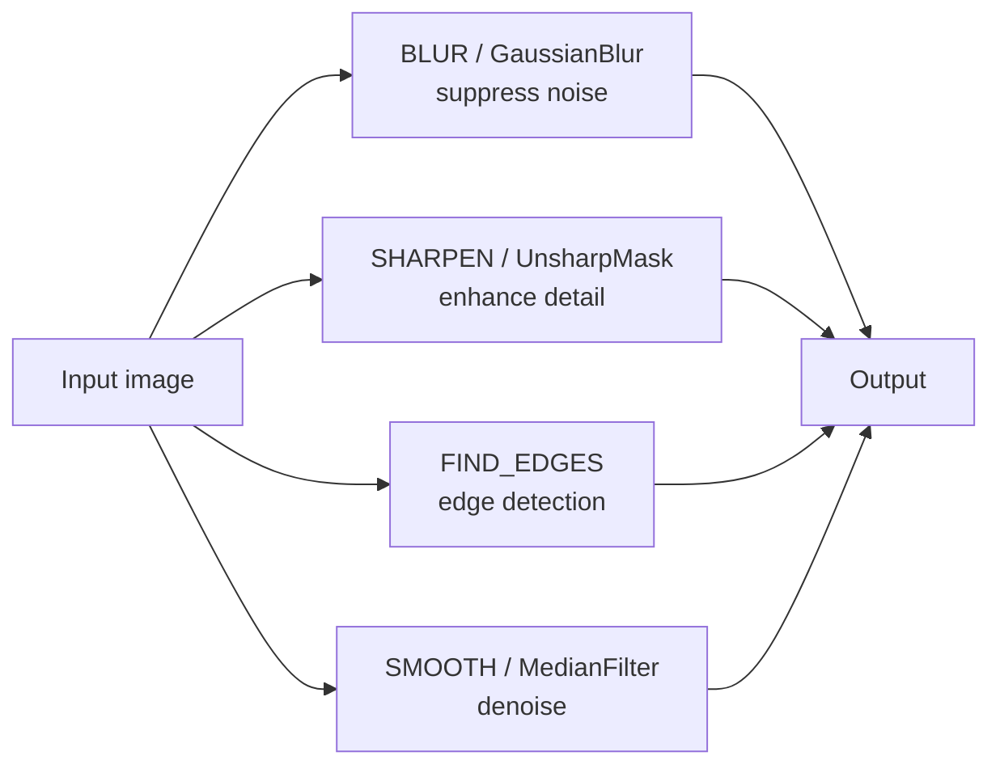

# 2. Image Operations

> [!note] Why this note exists
> Once you can open and save images with Pillow (see [[1. Pillow Basics]]), the next step is to **transform** them: resize, rotate, crop, paste, flip, transpose, blur, sharpen, brighten, contrast-stretch. This note covers the full Pillow operation toolbox — the `Image` methods for geometric transforms, the `ImageFilter` module for convolution-based filters, and the `ImageEnhance` module for the four classical enhancement axes (brightness, contrast, color, sharpness). For each operation we explain what it does, what its keyword arguments mean, what its pitfalls are, and what the equivalent NumPy or OpenCV approach would be. After this note you'll be able to build a basic image editor — the first of the projects the source roadmap mentions.

## Why It Matters

Almost every image-processing pipeline — whether it's preparing photos for a website, augmenting data for a deep learning model, or building a screenshot analyser — starts with a handful of geometric and tonal transformations:

- **Resize** to fit a target display or model input.
- **Crop** to focus on the region of interest.
- **Rotate** to correct orientation or to test invariance.
- **Flip** for data augmentation (a horizontally flipped cat is still a cat).
- **Blur** to suppress noise before edge detection.
- **Sharpen** to recover perceived detail.
- **Brightness / contrast / colour** adjustments to compensate for poor lighting.

Pillow provides all of these as one-liners. The catch is that each has **multiple variants** with subtly different semantics: `resize` vs `thumbnail`, `rotate` vs `transpose`, `paste` vs `alpha_composite`. Choosing the wrong one produces a result that *looks* right but is subtly broken (alpha lost, aspect ratio squished, palette corrupted). This note makes the choices explicit.

## Background

### Pillow's two operation styles

Pillow operations come in two flavours:

1. **Methods on `Image`** that return a new `Image` (most operations). The original is unchanged.
   ```python
   new_img = img.resize((256, 256))
   ```
2. **Methods that operate in place** (a few — `thumbnail`, `paste`).
   ```python
   img.thumbnail((256, 256))   # returns None, modifies img in place
   img.paste(other, (10, 10))  # modifies img in place
   ```

The asymmetry catches beginners: they call `img.resize((256, 256))` without assigning the result and then wonder why `img.size` is unchanged. The rule: **if the documentation says "returns an Image", assign the result.** If it says "in place", don't.

### Resampling filters

Whenever you resize, rotate, or warp an image, you must **resample** — pick new pixel values from the original. Pillow offers five resampling filters, each with a different speed/quality tradeoff:

| Filter | Constant | Speed | Quality | Use case |
|---|---|---|---|---|
| **Nearest** | `Image.NEAREST` | Fastest | Blocky | Pixel art, indexed images, masks |
| **Box** | `Image.BOX` | Fast | Good for downscale | Thumbnails (no aliasing) |
| **Bilinear** | `Image.BILINEAR` | Medium | Smooth | General-purpose upscaling |
| **Hamming** | `Image.HAMMING` | Medium | Good | Downscaling (better than bilinear) |
| **Bicubic** | `Image.BICUBIC` | Slow | High | Photos, print |
| **Lanczos** | `Image.LANCZOS` | Slowest | Best | High-quality thumbnails |

```python
img.resize((256, 256), Image.LANCZOS)   # high quality
img.resize((256, 256), Image.NEAREST)   # pixelated, fast
```

The default for `resize` is `Image.BICUBIC`. The default for `thumbnail` is `Image.BICUBIC` too. For downscaling photos, `LANCZOS` is the gold standard; for upscaling pixel art, `NEAREST` (to preserve hard edges).

## Main Content

### 1. Resize — `img.resize`

```python
from PIL import Image

img = Image.open("photo.jpg")            # 1920x1080
small = img.resize((640, 360), Image.LANCZOS)
small.save("small.jpg")
```

- `img.resize((width, height))` returns a new image of exactly the requested size.
- **Aspect ratio is not preserved.** If your input is 16:9 and you resize to 4:3, the image is squished.
- The size tuple is **width-first**, matching Pillow's convention everywhere.

### 2. Thumbnail — `img.thumbnail`

`thumbnail` is the smart-crop cousin of `resize`: it preserves aspect ratio and never enlarges.

```python
img = Image.open("photo.jpg")            # 1920x1080
img.thumbnail((1024, 1024))              # in-place, returns None
print(img.size)                          # (1024, 576) — fits inside 1024x1024
```

- The argument is a **maximum bounding box**. The longest side becomes that size; the other is computed to preserve aspect ratio.
- It **never enlarges**. If the image is already smaller than the box, it's unchanged.
- It operates **in place**. Don't assign the result.

Use `thumbnail` when you want "make it fit", `resize` when you want "make it exactly this size".

### 3. Crop — `img.crop`

```python
img = Image.open("photo.jpg")            # 1920x1080
cropped = img.crop((100, 200, 800, 900))
#                      left, top, right, bottom
```

- The argument is a 4-tuple `(left, top, right, bottom)` — **inclusive on the left/top, exclusive on the right/bottom**, matching Python slice semantics.
- Coordinates are in pixels, with `(0, 0)` at the **top-left** corner.
- Out-of-bounds coordinates are clipped to the image boundary, with the missing region filled with the image's background colour (or transparent, for RGBA).

```python
# Crop a 200x200 square from the centre
W, H = img.size
left = (W - 200) // 2
top  = (H - 200) // 2
centre = img.crop((left, top, left + 200, top + 200))
```

For "smart crop" — fitting to a target aspect ratio with optional centre bias — use `ImageOps.fit`:

```python
from PIL import ImageOps
square = ImageOps.fit(img, (300, 300), method=Image.LANCZOS, bleed=0.0, centering=(0.5, 0.5))
```

### 4. Rotate — `img.rotate`

```python
rotated = img.rotate(90)                          # counter-clockwise 90°
rotated = img.rotate(45, expand=True)             # expand canvas to fit
rotated = img.rotate(45, expand=True, fillcolor=(0, 0, 0))  # fill new area
rotated = img.rotate(45, resample=Image.BICUBIC, center=(100, 100))  # custom pivot
```

- The angle is in **degrees**, counter-clockwise (mathematical convention, opposite to image editors).
- `expand=False` (default) keeps the canvas size, cropping the rotated image.
- `expand=True` enlarges the canvas so the whole rotated image fits.
- `fillcolor` sets the colour of pixels that fall outside the original image (only meaningful with `expand=True`).

For exact 90° rotations, use `transpose` (see below) — it's lossless and faster.

### 5. Transpose — `img.transpose`

`transpose` performs lossless flips and 90° rotations:

```python
from PIL import Image

flipped_h = img.transpose(Image.FLIP_LEFT_RIGHT)
flipped_v = img.transpose(Image.FLIP_TOP_BOTTOM)
rot90     = img.transpose(Image.ROTATE_90)      # 90° counter-clockwise
rot180    = img.transpose(Image.ROTATE_180)
rot270    = img.transpose(Image.ROTATE_270)
transposed = img.transpose(Image.TRANSPOSE)     # swap x and y axes
```

These operations are pure data rearrangements — no resampling, no quality loss. They are the correct choice for any axis-aligned flip or 90° rotation.

### 6. Paste — `img.paste`

`paste` copies pixels from one image into another. The destination is modified in place.

```python
background = Image.open("background.jpg").convert("RGB")
overlay = Image.open("logo.png").convert("RGB")
background.paste(overlay, (50, 50))   # paste at (x, y)
```

- The position argument is `(x, y)` — the top-left corner of the pasted region in the destination.
- The pasted image's mode should match the destination's. If they differ, convert first.
- For **transparency-aware pasting**, pass a mask:
  ```python
  logo_rgba = Image.open("logo.png")     # has alpha
  mask = logo_rgba.split()[3]            # alpha channel as a mask
  background.paste(logo_rgba, (50, 50), mask)
  ```

Without the mask, the alpha channel is **silently dropped** — a PNG with rounded corners pastes as a rectangle of the original RGB pixels, including the transparent regions (which now show as black or random data).

### 7. Alpha composite — `Image.alpha_composite`

For correct alpha blending of two RGBA images, use `Image.alpha_composite`:

```python
background = Image.new("RGBA", img.size, (255, 255, 255, 255))
result = Image.alpha_composite(background, img_rgba)
```

- Both images must be RGBA and the **same size**.
- Returns a new RGBA image, with each pixel computed as `out = src * src_alpha + dst * (1 - src_alpha)`.
- This is the operation you want whenever you're compositing semi-transparent layers — watermarks, drop shadows, UI overlays.

For more than two layers, `Image.alpha_composite` accepts a list of equally-sized RGBA images:

```python
stack = [bg, layer1, layer2, layer3]
result = Image.alpha_composite(*stack)
```

### 8. Filters — `ImageFilter`

Pillow's `ImageFilter` module provides convolution-based filters:

```python
from PIL import Image, ImageFilter

blurred = img.filter(ImageFilter.BLUR)
sharpened = img.filter(ImageFilter.SHARPEN)
edge_enhance = img.filter(ImageFilter.EDGE_ENHANCE)
edges = img.filter(ImageFilter.FIND_EDGES)
emboss = img.filter(ImageFilter.EMBOSS)
contour = img.filter(ImageFilter.CONTOUR)
smooth = img.filter(ImageFilter.SMOOTH_MORE)

# Gaussian blur with custom radius
heavy_blur = img.filter(ImageFilter.GaussianBlur(radius=5))

# Unsharp mask: sharpen = original + (original - blurred) * amount
sharper = img.filter(ImageFilter.UnsharpMask(radius=2, percent=150, threshold=3))
```

Filter reference:

| Filter | Effect |
|---|---|
| `BLUR` | Box blur, 5×5. Quick but blocky. |
| `GaussianBlur(radius)` | True Gaussian. The radius controls the spread; for strong blur use 5–10. |
| `SHARPEN` | Fixed sharpening kernel. |
| `UnsharpMask(radius, percent, threshold)` | Pro-quality sharpening. The standard tool. |
| `EDGE_ENHANCE` | Mild edge enhancement. |
| `EDGE_ENHANCE_MORE` | Stronger. |
| `FIND_EDGES` | Sobel-like edge detection. |
| `EMBOSS` | Embossing effect. |
| `CONTOUR` | Black background with white outlines. |
| `SMOOTH`, `SMOOTH_MORE` | Noise reduction. |
| `BoxBlur(radius)` | Faster than Gaussian for moderate radii. |
| `MedianFilter(size)` | Salt-and-pepper noise removal. |
| `MinFilter(size)`, `MaxFilter(size)` | Morphological-style operations. |
| `ModeFilter(size)` | Replaces pixel with most common in window. |



### 9. Custom convolution kernels

For a filter Pillow doesn't provide, build one with `ImageFilter.Kernel`:

```python
from PIL import ImageFilter

# 3x3 horizontal edge detector (Sobel X)
kernel = ImageFilter.Kernel(
    size=(3, 3),
    kernel=[-1, 0, 1, -2, 0, 2, -1, 0, 1],
    scale=1,            # divisor for the kernel sum (auto if omitted)
    offset=0,           # added to the final pixel value
)
edges = img.filter(kernel)
```

For more sophisticated kernels (Gabor, Laplacian-of-Gaussian, oriented filters), use `scipy.ndimage.convolve` or `cv2.filter2D` — see [[7. NumPy for Images]] and [[3. OpenCV Basics]].

### 10. Enhancement — `ImageEnhance`

The `ImageEnhance` module provides four axes of tonal adjustment:

```python
from PIL import ImageEnhance

enhancer = ImageEnhance.Brightness(img)
brighter = enhancer.enhance(1.5)        # 50% brighter
darker   = enhancer.enhance(0.5)        # 50% darker

contrast = ImageEnhance.Contrast(img).enhance(1.2)
color    = ImageEnhance.Color(img).enhance(0.0)   # 0 = grayscale, 1 = unchanged, 2 = saturated
sharpness = ImageEnhance.Sharpness(img).enhance(2.0)
```

| Enhancer | 0.0 | 0.5 | 1.0 (default) | 2.0 |
|---|---|---|---|---|
| `Brightness` | black | half as bright | unchanged | double brightness |
| `Contrast` | grey | half contrast | unchanged | double contrast |
| `Color` | grayscale | half saturation | unchanged | double saturation |
| `Sharpness` | blurred | less sharp | unchanged | sharper |

Each `enhance(factor)` returns a new image; the original is unchanged. The factor of `1.0` is always identity.

### 11. Point operations — `img.point`

For arbitrary per-pixel lookups, `point` applies a function (or LUT) to every pixel:

```python
# Invert
inverted = img.point(lambda p: 255 - p)

# Threshold at 128
binary = img.convert("L").point(lambda p: 255 if p > 128 else 0, mode="1")

# Gamma correction
gamma = 2.2
lut = [int((i / 255) ** (1 / gamma) * 255) for i in range(256)]
adjusted = img.point(lut)
```

`point` is much faster than iterating pixels in Python because the lookup table is applied in C. For complex per-pixel math, convert to NumPy instead.

### 12. ImageOps shortcuts

`ImageOps` bundles common operations:

```python
from PIL import ImageOps

gray = ImageOps.grayscale(img)                # shortcut for img.convert("L")
inverted = ImageOps.invert(img)               # shortcut for img.point(lambda p: 255 - p)
auto = ImageOps.autocontrast(img, cutoff=2)   # stretch contrast, ignore 2% extremes
eq = ImageOps.equalize(img)                   # histogram equalization
mirrored = ImageOps.mirror(img)               # horizontal flip
flipped = ImageOps.flip(img)                  # vertical flip
padded = ImageOps.expand(img, border=20, fill=(0, 0, 0))  # add black border
fitted = ImageOps.fit(img, (300, 300), Image.LANCZOS)     # smart crop to aspect ratio
solarized = ImageOps.solarize(img, threshold=128)         # invert pixels above threshold
posterized = ImageOps.posterize(img, bits=2)              # reduce to 2 bits per channel
```

## Code Examples

### Example A — make a thumbnail sheet

```python
from PIL import Image
import os

files = ["a.jpg", "b.jpg", "c.jpg", "d.jpg"]
thumb_size = (200, 200)
sheet = Image.new("RGB", (len(files) * 200, 200), "white")

for i, fname in enumerate(files):
    img = Image.open(fname)
    img.thumbnail(thumb_size)
    # Centre on the white background
    x = i * 200 + (200 - img.width) // 2
    y = (200 - img.height) // 2
    sheet.paste(img, (x, y))

sheet.save("thumbnails.jpg", quality=90)
```

### Example B — overlay a watermark

```python
from PIL import Image, ImageDraw, ImageFont

photo = Image.open("photo.jpg").convert("RGBA")
txt_layer = Image.new("RGBA", photo.size, (0, 0, 0, 0))
draw = ImageDraw.Draw(txt_layer)

try:
    font = ImageFont.truetype("DejaVuSans-Bold.ttf", 60)
except OSError:
    font = ImageFont.load_default()

draw.text((20, photo.height - 80), "© 2025", font=font, fill=(255, 255, 255, 180))
watermarked = Image.alpha_composite(photo, txt_layer)
watermarked.convert("RGB").save("watermarked.jpg", quality=90)
```

### Example C — denoise + sharpen

```python
from PIL import Image, ImageFilter, ImageEnhance

img = Image.open("noisy.jpg")

# Step 1: median filter to kill salt-and-pepper noise
denoised = img.filter(ImageFilter.MedianFilter(size=3))

# Step 2: mild Gaussian to smooth any remaining noise
smooth = denoised.filter(ImageFilter.GaussianBlur(radius=0.8))

# Step 3: unsharp mask to recover perceived detail
final = smooth.filter(ImageFilter.UnsharpMask(radius=2, percent=120, threshold=2))

# Step 4: slight contrast bump
final = ImageEnhance.Contrast(final).enhance(1.1)
final.save("clean.jpg", quality=92)
```

### Example D — centre crop to square

```python
from PIL import Image

img = Image.open("photo.jpg")
W, H = img.size
side = min(W, H)
left = (W - side) // 2
top = (H - side) // 2
square = img.crop((left, top, left + side, top + side))
square = square.resize((224, 224), Image.LANCZOS)   # ImageNet input size
square.save("input_224.jpg")
```

### Example E — flip and rotate for data augmentation

```python
from PIL import Image
import random

img = Image.open("cat.jpg")
augmentations = [
    img,
    img.transpose(Image.FLIP_LEFT_RIGHT),
    img.transpose(Image.FLIP_TOP_BOTTOM),
    img.rotate(15, expand=True, fillcolor=(0, 0, 0)),
    img.rotate(-15, expand=True, fillcolor=(0, 0, 0)),
    img.filter(ImageFilter.GaussianBlur(radius=1.5)),
]

for i, aug in enumerate(augmentations):
    aug.save(f"aug_{i}.jpg")
```

## Common Pitfalls

> [!danger] `resize` does not preserve aspect ratio
> `img.resize((300, 300))` squishes a 16:9 image to 1:1. Use `thumbnail` for "fit inside" or compute the correct dimensions manually.

> [!danger] `thumbnail` returns `None`
> ```python
> new = img.thumbnail((256, 256))   # new is None
> new.save(...)                     # AttributeError
> ```
> `thumbnail` is in-place. Don't assign the result.

> [!danger] `paste` without a mask drops alpha
> Pasting an RGBA image onto an RGB image without `mask=alpha_channel` produces a rectangle of the original RGB pixels — including what should have been transparent areas. Always pass the alpha channel as the mask.

> [!danger] `rotate` angle is counter-clockwise
> Most image editors rotate clockwise. Pillow uses the mathematical convention (counter-clockwise positive). `img.rotate(90)` rotates left, not right. Use `img.rotate(-90)` for "rotate right".

> [!danger] Crop coordinates use `(left, top, right, bottom)`, not `(x, y, w, h)`
> Mixing these conventions is the most common crop bug. If you want a 100×100 box at `(50, 50)`, the crop is `(50, 50, 150, 150)`, not `(50, 50, 100, 100)`.

> [!danger] `ImageEnhance.Color(img).enhance(0.0)` returns an `"L"` mode image? No — it returns `"RGB"`
> Setting colour to 0 desaturates but keeps the RGB mode. The result is grey pixels in a 3-channel image. If you want a true grayscale image, use `img.convert("L")` instead.

> [!warning] Default resize filter is `BICUBIC`
> For high-quality downscaling, switch to `LANCZOS`. For upscaling pixel art, switch to `NEAREST`. The default is a good general-purpose compromise but not optimal for either extreme.

> [!warning] Filters can be slow on large images
> A `GaussianBlur(radius=20)` on a 6000×4000 image takes seconds. If you're processing many large images, downscale first (`thumbnail`), then filter.

> [!warning] `ImageFilter.Kernel` requires the kernel sum to be normalisable
> If your kernel sums to zero (an edge detector), pass `scale=1` and `offset=128` to centre the output. Otherwise Pillow will scale by the sum and produce all-black output.

## Tips and Tricks

> [!tip] `thumbnail` for any "fit inside" need
> ```python
> img.thumbnail((1024, 1024), Image.LANCZOS)
> ```
> This is the right call 90% of the time you reach for `resize`. It preserves aspect ratio, never enlarges, and is in-place so it doesn't allocate a new image.

> [!tip] `ImageOps.fit` for "smart crop to aspect ratio"
> ```python
> square = ImageOps.fit(img, (300, 300), method=Image.LANCZOS, centering=(0.5, 0.4))
> ```
> `centering=(0.5, 0.4)` shifts the crop region slightly above centre — useful for portraits where the face is in the upper third.

> [!tip] `ImageOps.exif_transpose` before any other operation
> Apply EXIF orientation first so all subsequent operations work on the visually-correct image. Otherwise crop/rotate results look wrong.

> [!tip] `UnsharpMask` for "real" sharpening
> `SHARPEN` is a fixed kernel — quick but crude. `UnsharpMask(radius=2, percent=150, threshold=3)` is the pro tool, with controllable radius, strength, and edge threshold. Default values are a good starting point.

> [!tip] `MedianFilter` for salt-and-pepper noise
> A 3×3 median filter is dramatically better than Gaussian blur for impulse noise. It removes the noisy pixels without blurring edges.

> [!tip] Chain operations lazily
> Pillow operations return new images, so you can chain:
> ```python
> final = (Image.open("p.jpg")
>          .convert("RGB")
>          .filter(ImageFilter.GaussianBlur(1))
>          .filter(ImageFilter.UnsharpMask(2, 150, 3)))
> ```
> Each step allocates a new image, so this isn't memory-efficient — but for prototyping it's clean.

> [!tip] `point` with a LUT is fast
> ```python
> lut = [min(255, int(i * 1.2)) for i in range(256)]
> bright = img.point(lut)
> ```
> Faster than `ImageEnhance.Brightness` for a single-channel image, and you can do arbitrary non-linear mappings (gamma, log, piecewise).

> [!tip] `Image.alpha_composite` for proper layering
> Whenever you have multiple semi-transparent layers, composite them with `Image.alpha_composite` rather than `paste` with masks. It's faster, clearer, and handles pre-multiplied alpha correctly.

> [!tip] Preview with `img.show()`
> During development, `img.show()` opens the system viewer. Quick and convenient. For batch processing, replace with `img.save("/tmp/debug.png")` and tail the file.

## Active Recall

1. What is the difference between `img.resize((w, h))` and `img.thumbnail((w, h))`? Which preserves aspect ratio?
2. Why does `thumbnail` return `None`? What's the correct usage?
3. Write the crop call to extract a 100×100 box from the top-left corner.
4. What does `expand=True` do in `img.rotate(45, expand=True)`? What about `fillcolor`?
5. For exact 90° rotations, what should you use instead of `rotate`? Why?
6. What happens if you `paste` an RGBA image onto an RGB image without a mask?
7. Write the correct paste call to overlay a transparent PNG logo onto a JPEG background.
8. Name three Pillow filters and their effects. Which one is best for salt-and-pepper noise?
9. What is the difference between `SHARPEN` and `UnsharpMask`?
10. `ImageEnhance.Color(img).enhance(0.0)` does what visually? What mode does the result have?
11. Why is `point` faster than iterating pixels in a Python `for` loop?
12. What does `ImageOps.exif_transpose` do? Why should it usually be the first operation you perform?
13. Write a `Kernel` call for a horizontal Sobel edge detector.
14. Name the six resampling filters Pillow provides, in order of increasing quality.

## Next Steps

You now have Pillow's full basic-operation toolbox. The next note, [[3. OpenCV Basics]], introduces the other major Python image library. OpenCV treats images as NumPy arrays from the start, with a different convention (BGR instead of RGB) and a vastly larger API covering computer vision tasks (edge detection, contours, feature matching, object detection). Understanding when to use Pillow (high-level I/O and enhancement) vs OpenCV (CV and pixel-level math) is the key decision this chapter teaches.

After that, [[4. Color Spaces and Thresholding]] dives into HSV, HLS, and Lab — colour spaces where thresholding is much easier than in RGB. [[5. Contours and Edge Detection]] moves into Canny edge detection and `cv2.findContours`. [[6. Morphological Operations]] covers erosion, dilation, opening, closing. [[7. NumPy for Images]] returns to the array representation and shows how to do convolutions, histograms, and pixel arithmetic with NumPy and SciPy.

For visualising intermediate results, you'll use Matplotlib's `imshow` extensively — see [[25. Matplotlib/5. Advanced Visualization]] for the API, and pay attention to the `origin`, `aspect`, and `vmin`/`vmax` arguments.
