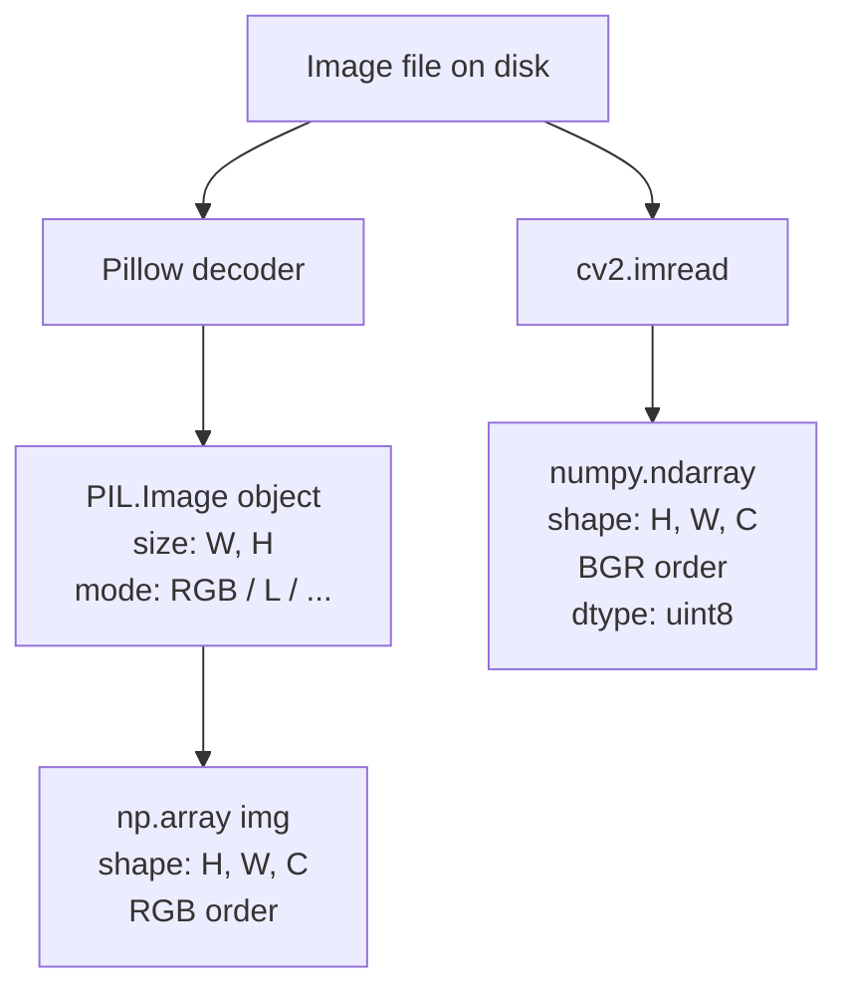
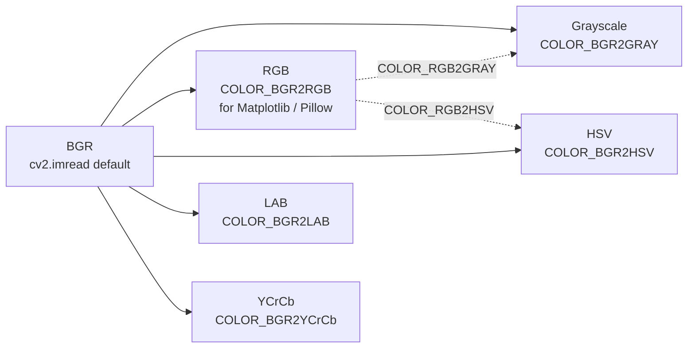

# 3. OpenCV Basics

> [!note] Why this note exists
> Pillow (see [[1. Pillow Basics]] and [[2. Image Operations]]) is a great library for **photographic** image operations — resizing, filtering, format conversion. But the moment you need **computer vision** — edge detection, contour finding, feature matching, object tracking, camera calibration — you need OpenCV. This note introduces OpenCV's Python bindings (`cv2`), its conventions (which differ from Pillow's in two crucial ways: BGR channel order and NumPy-first data model), and the minimum API surface you need to start working: `cv2.imread`, `cv2.imwrite`, `cv2.imshow`, `cv2.waitKey`, `cv2.cvtColor`, and `cv2.split`/`cv2.merge`. After this note, [[4. Color Spaces and Thresholding]], [[5. Contours and Edge Detection]], and [[6. Morphological Operations]] drill into the specific CV algorithms that make OpenCV worth learning.

## Why It Matters

OpenCV (Open Source Computer Vision Library) is the most widely-used computer vision library in the world. It was started by Intel in 1999, is now maintained by Itseez (acquired by Intel), and has C++, Python, Java, and MATLAB bindings. Its Python API (`cv2`) wraps the C++ core and exposes nearly the entire library to Python.

The reason OpenCV is the standard for CV work:

- **Speed.** Core functions are C++ with SIMD optimisation (SSE, AVX, NEON). Many operations run 10–100× faster than equivalent NumPy code.
- **Coverage.** 2500+ algorithms covering everything from basic filtering to deep-learning inference (`cv2.dnn`).
- **Real-time.** Designed for video pipelines — every operation works on `numpy.ndarray` directly, with no format conversion overhead.
- **Ecosystem.** Most CV tutorials, courses, and Stack Overflow answers assume OpenCV. If you're stuck on a CV problem, the OpenCV answer is the one you'll find.

But OpenCV has two famous gotchas that catch every newcomer:

1. **Images are BGR, not RGB.** `cv2.imread` returns an array whose channels are ordered blue, green, red. This is historical (early cameras had BGR sensors) and never fixed for backwards compatibility. Displaying a BGR image with Matplotlib (which expects RGB) produces red-and-blue-swapped colours.
2. **Images are NumPy arrays.** There's no `cv2.Image` class. Operations are functions that take and return arrays. This is more flexible than Pillow's `Image` class but requires you to think in NumPy.

This note explains both gotchas and shows how to interoperate with Pillow and Matplotlib.

## Background

### Install

```bash
pip install opencv-python           # main modules only
pip install opencv-contrib-python   # + extra modules (xfeatures2d, etc.)
pip install opencv-python-headless  # no GUI (for servers)
```

Three packages, all maintained by the OpenCV team:

- `opencv-python` — the standard set of modules. Includes GUI (`cv2.imshow`).
- `opencv-contrib-python` — adds extra modules that are either patented (SIFT, SURF used to be here) or experimental. Use this if you need `cv2.xfeatures2d`.
- `opencv-python-headless` — for servers and Docker containers where GUI dependencies cause crashes.

```python
import cv2
print(cv2.__version__)   # e.g. '4.9.0'
```

### The cv2 vs Pillow mental model



Both libraries ultimately hand you a NumPy array. The differences are:

| Aspect | Pillow | OpenCV |
|---|---|---|
| Image type | `PIL.Image.Image` | `numpy.ndarray` |
| Channel order | RGB | BGR |
| Size attribute | `img.size = (W, H)` | `arr.shape = (H, W, C)` |
| Coordinates | `(x, y)` (width-first) | `[y, x]` (row, col — height-first) |
| Grayscale | `convert("L")` → 1-channel `Image` | `cv2.cvtColor(arr, cv2.COLOR_BGR2GRAY)` → 2D array `(H, W)` |
| Lazy loading | Yes (`Image.open`) | No (`imread` reads everything) |
| Display | `img.show()` or Matplotlib | `cv2.imshow` + `cv2.waitKey` |

The flip from `(x, y)` to `[y, x]` is the second-most-common bug source after BGR/RGB. NumPy indexing is row-major, so `arr[row, col]` = `arr[y, x]`. When you copy a coordinate from a Pillow call to an OpenCV call, **swap the order**.

## Main Content

### 1. Reading images — `cv2.imread`

```python
import cv2

img = cv2.imread("photo.jpg")
print(type(img))           # <class 'numpy.ndarray'>
print(img.shape)           # (1080, 1920, 3) — (H, W, C)
print(img.dtype)           # uint8
print(img[0, 0])           # [B, G, R] of the top-left pixel
```

The shape is `(height, width, channels)`. The top-left pixel is at index `[0, 0]` and its value is `[blue, green, red]` — the opposite of what you'd expect from any other library.

`imread` flags:

```python
img = cv2.imread("photo.jpg", cv2.IMREAD_COLOR)         # default, BGR, 3 channels
img = cv2.imread("photo.jpg", cv2.IMREAD_GRAYSCALE)     # grayscale, 1 channel
img = cv2.imread("photo.jpg", cv2.IMREAD_UNCHANGED)     # include alpha, EXR depth, etc.
```

Common shorthand: `cv2.imread("p.jpg", 0)` for grayscale, `cv2.imread("p.jpg", 1)` for color (the default), `cv2.imread("p.jpg", -1)` for unchanged.

> [!danger] `cv2.imread` returns `None` on failure
> Unlike Pillow (which raises `FileNotFoundError`), OpenCV silently returns `None` if the file doesn't exist or can't be decoded. Always check:
> ```python
> img = cv2.imread("maybe.jpg")
> if img is None:
>     raise FileNotFoundError("could not read maybe.jpg")
> ```

### 2. Writing images — `cv2.imwrite`

```python
cv2.imwrite("out.png", img)
cv2.imwrite("out.jpg", img, [cv2.IMWRITE_JPEG_QUALITY, 90])
cv2.imwrite("out.webp", img, [cv2.IMWRITE_WEBP_QUALITY, 85])
```

- The extension determines the format.
- JPEG quality is 0–100, default 95.
- PNG compression is 0–9, default 1 (fast).
- For PNG with alpha, pass `[cv2.IMWRITE_PNG_COMPRESSION, 9]`.

### 3. Displaying images — `cv2.imshow` and `cv2.waitKey`

```python
cv2.imshow("window title", img)
cv2.waitKey(0)       # wait indefinitely for a key press
cv2.destroyAllWindows()
```

`cv2.imshow` opens a native window. `cv2.waitKey(0)` blocks until any key is pressed. Without `waitKey`, the window may not appear (or may freeze immediately) because OpenCV needs the event loop to pump.

```python
cv2.waitKey(0)              # wait forever
cv2.waitKey(25)             # wait 25ms; useful for video loops
key = cv2.waitKey(0) & 0xFF # get the key code; mask for cross-platform
if key == ord("q"):
    print("quitting")
elif key == 27:
    print("ESC pressed")
```

The `& 0xFF` mask is a Linux/X11 quirk: on some systems `waitKey` returns a 32-bit value with modifier flags in the upper byte. Masking to 0xFF gives you the ASCII code reliably.

> [!warning] `cv2.imshow` doesn't work in Jupyter
> The GUI window requires a running X11/Wayland/Windows event loop, which Jupyter doesn't provide. Use Matplotlib instead:
> ```python
> import matplotlib.pyplot as plt
> plt.imshow(cv2.cvtColor(img, cv2.COLOR_BGR2RGB))
> plt.axis("off")
> plt.show()
> ```

### 4. Color conversion — `cv2.cvtColor`

The single most-called OpenCV function:

```python
gray = cv2.cvtColor(img, cv2.COLOR_BGR2GRAY)        # → (H, W) uint8
rgb  = cv2.cvtColor(img, cv2.COLOR_BGR2RGB)         # → (H, W, 3)
hsv  = cv2.cvtColor(img, cv2.COLOR_BGR2HSV)         # → (H, W, 3)
lab  = cv2.cvtColor(img, cv2.COLOR_BGR2LAB)         # → (H, W, 3)
rgba = cv2.cvtColor(img, cv2.COLOR_BGR2BGRA)        # add alpha
```



We cover HSV, HLS, and LAB in depth in [[4. Color Spaces and Thresholding]] — they matter because thresholding in HSV is dramatically easier than in RGB.

### 5. Splitting and merging channels

```python
b, g, r = cv2.split(img)               # three 2D arrays
merged  = cv2.merge([b, g, r])         # back to 3-channel

# Faster: NumPy indexing
b = img[:, :, 0]
g = img[:, :, 1]
r = img[:, :, 2]

# Swap channels: BGR → RGB without cvtColor
rgb = img[:, :, ::-1]                  # reverse channel axis
```

`cv2.split` is a convenient function but it's a **full memory copy** of each channel. NumPy indexing (`img[:, :, 0]`) is a view — no copy, much faster, but modifying the view modifies the original.

### 6. Geometric operations

```python
# Resize
resized = cv2.resize(img, (640, 360), interpolation=cv2.INTER_LANCZOS4)
# Note: cv2.resize takes (W, H), matching Pillow convention (the ONE exception!)

# Crop — pure NumPy slicing
cropped = img[100:500, 200:800]   # [y1:y2, x1:x2]

# Flip
flipped_h = cv2.flip(img, 1)   # 1 = horizontal, 0 = vertical, -1 = both

# Rotate 90° k times
rot90 = cv2.rotate(img, cv2.ROTATE_90_CLOCKWISE)
rot180 = cv2.rotate(img, cv2.ROTATE_180)
rot270 = cv2.rotate(img, cv2.ROTATE_90_COUNTERCLOCKWISE)

# Arbitrary rotation
M = cv2.getRotationMatrix2D(center=(W/2, H/2), angle=45, scale=1.0)
rotated = cv2.warpAffine(img, M, (W, H))
```

`cv2.resize`'s size argument is **(width, height)**, the opposite of every other OpenCV function. This is because `resize` mirrors the Pillow/cv2 IO convention; everything else uses NumPy's row-major `(y, x)`.

#### Interpolation methods

| Constant | Use case |
|---|---|
| `INTER_NEAREST` | Pixel art, masks, label maps |
| `INTER_LINEAR` | Default. Fast, good for upscaling. |
| `INTER_CUBIC` | Slower, smoother. Good for photos. |
| `INTER_LANCZOS4` | Highest quality. For downscaling. |
| `INTER_AREA` | Best for downscaling (anti-aliasing). |

### 7. Drawing

OpenCV's drawing functions modify an image in place:

```python
import numpy as np
import cv2

canvas = np.zeros((400, 400, 3), dtype=np.uint8)

cv2.line(canvas, (10, 10), (390, 390), color=(0, 255, 0), thickness=2)
cv2.rectangle(canvas, (50, 50), (200, 200), color=(0, 0, 255), thickness=2)
cv2.circle(canvas, (300, 100), radius=50, color=(255, 0, 0), thickness=-1)  # -1 = filled
cv2.putText(canvas, "OpenCV", (50, 350), cv2.FONT_HERSHEY_SIMPLEX,
            fontScale=1.0, color=(255, 255, 255), thickness=2)

cv2.imshow("drawings", canvas)
cv2.waitKey(0)
```

- `color=` is **BGR** here too: `(0, 255, 0)` is green, `(0, 0, 255)` is red.
- Coordinates are `(x, y)` — Pillow convention.
- `thickness=-1` means filled.

### 8. Video capture

```python
cap = cv2.VideoCapture(0)   # 0 = default webcam; or path to a video file

while True:
    ret, frame = cap.read()
    if not ret:
        break

    # Process the frame
    gray = cv2.cvtColor(frame, cv2.COLOR_BGR2GRAY)

    cv2.imshow("webcam", gray)
    if cv2.waitKey(1) & 0xFF == ord("q"):
        break

cap.release()
cv2.destroyAllWindows()
```

The four-step pattern — `VideoCapture` → `read` → process → `waitKey` — is the standard OpenCV video loop. `waitKey(1)` is essential: it gives OpenCV 1 ms to pump the GUI event loop, without which the window freezes.

### 9. Interop with Pillow and Matplotlib

```python
# OpenCV → Pillow
img_cv = cv2.imread("p.jpg")                  # BGR
img_pil = Image.fromarray(cv2.cvtColor(img_cv, cv2.COLOR_BGR2RGB))

# Pillow → OpenCV
img_pil = Image.open("p.jpg")                  # RGB
img_cv = cv2.cvtColor(np.array(img_pil), cv2.COLOR_RGB2BGR)

# OpenCV → Matplotlib (for Jupyter display)
img_cv = cv2.imread("p.jpg")                   # BGR
plt.imshow(cv2.cvtColor(img_cv, cv2.COLOR_BGR2RGB))
plt.axis("off")
plt.show()

# Or, use NumPy slicing (no copy)
plt.imshow(img_cv[:, :, ::-1])
```

The `img[:, :, ::-1]` trick reverses the channel axis without copying — fast and idiomatic. But beware: it returns a **view**, so modifying it modifies the original. Use `.copy()` if you need a separate array.

## Code Examples

### Example A — load, convert, save

```python
import cv2

img = cv2.imread("photo.jpg")
if img is None:
    raise FileNotFoundError("photo.jpg not found")

gray = cv2.cvtColor(img, cv2.COLOR_BGR2GRAY)
cv2.imwrite("gray.png", gray)

# Threshold to binary
_, binary = cv2.threshold(gray, 128, 255, cv2.THRESH_BINARY)
cv2.imwrite("binary.png", binary)
```

### Example B — webcam capture with Canny edges

```python
import cv2

cap = cv2.VideoCapture(0)
while True:
    ret, frame = cap.read()
    if not ret:
        break

    edges = cv2.Canny(frame, threshold1=100, threshold2=200)
    cv2.imshow("edges", edges)

    if cv2.waitKey(1) & 0xFF == ord("q"):
        break

cap.release()
cv2.destroyAllWindows()
```

### Example C — overlay rectangles for detection

```python
import cv2

img = cv2.imread("scene.jpg")
boxes = [(50, 80, 200, 250), (300, 100, 450, 320)]   # (x1, y1, x2, y2)
labels = ["cat", "dog"]

for (x1, y1, x2, y2), label in zip(boxes, labels):
    cv2.rectangle(img, (x1, y1), (x2, y2), color=(0, 255, 0), thickness=2)
    cv2.putText(img, label, (x1, y1 - 10),
                cv2.FONT_HERSHEY_SIMPLEX, 0.8, (0, 255, 0), 2)

cv2.imwrite("annotated.jpg", img)
```

### Example D — convert to Pillow, apply Pillow filter, convert back

```python
import cv2
import numpy as np
from PIL import Image, ImageFilter

img_cv = cv2.imread("photo.jpg")                                  # BGR
img_pil = Image.fromarray(cv2.cvtColor(img_cv, cv2.COLOR_BGR2RGB))
sharpened = img_pil.filter(ImageFilter.UnsharpMask(radius=2, percent=150))
img_back = cv2.cvtColor(np.array(sharpened), cv2.COLOR_RGB2BGR)
cv2.imwrite("sharpened.jpg", img_back)
```

### Example E — display in Jupyter

```python
import cv2
import matplotlib.pyplot as plt

img = cv2.imread("photo.jpg")
fig, axes = plt.subplots(1, 3, figsize=(15, 5))

axes[0].imshow(cv2.cvtColor(img, cv2.COLOR_BGR2RGB))
axes[0].set_title("correct (BGR→RGB)")

axes[1].imshow(img)   # WRONG: BGR displayed as RGB
axes[1].set_title("wrong (raw BGR)")

axes[2].imshow(cv2.cvtColor(img, cv2.COLOR_BGR2GRAY), cmap="gray")
axes[2].set_title("grayscale")

for ax in axes:
    ax.axis("off")
plt.show()
```

## Common Pitfalls

> [!danger] BGR vs RGB
> `cv2.imread` returns BGR. Matplotlib and Pillow expect RGB. If you mix them without conversion, red and blue swap. The fix: `cv2.cvtColor(img, cv2.COLOR_BGR2RGB)` or `img[:, :, ::-1]`.

> [!danger] `cv2.imread` returns `None` on failure
> Always check `if img is None:`. Otherwise the next operation (`cvtColor`, `imshow`) raises a cryptic error about NoneType.

> [!danger] `cv2.imshow` in Jupyter
> The window needs an event loop that Jupyter doesn't have. Use Matplotlib instead.

> [!danger] Forgetting `cv2.waitKey`
> Without `waitKey`, the imshow window either doesn't appear or appears frozen. Always pair them.

> [!danger] `cv2.resize` size is `(W, H)`
> Every other OpenCV function takes `(y, x)` (NumPy convention). `cv2.resize` takes `(width, height)` (Pillow convention). This single exception is the source of countless shape bugs.

> [!danger] Cropping with `(x1:y1, x2:y2)`
> NumPy slicing is `[y1:y2, x1:x2]` — rows first, columns second. Writing `img[x1:x2, y1:y2]` produces a silently wrong crop (or an empty array if the indices happen to be out of range in one dimension).

> [!danger] Modifying a NumPy view modifies the original
> ```python
> view = img[:, :, ::-1]   # BGR → RGB view, no copy
> view[0, 0] = [255, 0, 0]
> # img[0, 0] is now [0, 0, 255] — modified!
> ```
> If you need an independent copy, use `.copy()`.

> [!warning] `cv2.split` is slow
> It allocates three new arrays. Prefer NumPy views (`img[:, :, 0]`) unless you need an independent array per channel.

> [!warning] JPEG quality default is 95
> OpenCV's default JPEG quality (95) is higher than Pillow's (75). For consistency across libraries, set the quality explicitly.

> [!warning] `cv2.putText` has limited font support
> Only Hershey fonts are supported — no TrueType. For text rendering with custom fonts, use Pillow's `ImageDraw.text` and convert back.

## Tips and Tricks

> [!tip] `img[:, :, ::-1]` for BGR  RGB without copying
> The fastest way to swap channels is NumPy slicing with `::-1`. It returns a view, so it's free. Use `.copy()` if you need an independent array.

> [!tip] Check the return of `imread` early
> ```python
> img = cv2.imread(path)
> assert img is not None, f"failed to read {path}"
> ```
> A 1-line assert saves hours of debugging when a path is wrong.

> [!tip] Use `cv2.IMREAD_UNCHANGED` for alpha
> ```python
> img = cv2.imread("logo.png", cv2.IMREAD_UNCHANGED)   # (H, W, 4) BGRA
> ```
> Without this flag, alpha is silently dropped.

> [!tip] `cv2.IMREAD_REDUCED_*` for fast thumbnails
> ```python
> thumb = cv2.imread("huge.jpg", cv2.IMREAD_REDUCED_COLOR_4)   # 1/4 size
> ```
> Reads at 1/2, 1/4, or 1/8 scale directly — much faster than full read + resize.

> [!tip] `cv2.VideoWriter` to save videos
> ```python
> fourcc = cv2.VideoWriter_fourcc(*"mp4v")
> out = cv2.VideoWriter("out.mp4", fourcc, 30.0, (W, H))
> for frame in frames:
>     out.write(frame)
> out.release()
> ```
> Note the `(W, H)` size — same exception as `resize`.

> [!tip] `cv2.cvtColor` is its own inverse
> `cv2.cvtColor(cv2.cvtColor(img, cv2.COLOR_BGR2RGB), cv2.COLOR_RGB2BGR)` returns the original. Use the matching constant for the round trip.

> [!tip] `np.ascontiguousarray` for OpenCV compatibility
> Some OpenCV functions reject non-contiguous arrays (created by slicing or transposing). `arr = np.ascontiguousarray(arr)` fixes this cheaply.

> [!tip] `cv2.destroyAllWindows()` at exit
> Always call this before your script ends, or window handles leak. Use `atexit.register(cv2.destroyAllWindows)` for safety.

> [!tip] Profile with `cv2.getTickCount()`
> ```python
> t0 = cv2.getTickCount()
> # ... operation ...
> t1 = cv2.getTickCount()
> ms = (t1 - t0) * 1000 / cv2.getTickFrequency()
> ```
> High-resolution timer for benchmarking OpenCV calls.

## Active Recall

1. Why does OpenCV use BGR instead of RGB? What's the consequence when displaying with Matplotlib?
2. What does `cv2.imread` return if the file doesn't exist? How should you check?
3. What is the shape of `cv2.imread("photo.jpg")`? Of `cv2.imread("photo.jpg", cv2.IMREAD_GRAYSCALE)`?
4. `cv2.resize(img, (640, 360))` — is `(640, 360)` `(width, height)` or `(height, width)`? Why is this surprising?
5. Why must `cv2.imshow` always be paired with `cv2.waitKey`?
6. Write the snippet to display a BGR OpenCV image correctly in Matplotlib.
7. Convert an OpenCV BGR image to a Pillow RGB image without using `cv2.cvtColor`.
8. Why is `img[:, :, 0]` faster than `cv2.split(img)[0]`?
9. What does `cv2.waitKey(0)` do? `cv2.waitKey(25)`?
10. Why does `cv2.waitKey` need `& 0xFF` on some systems?
11. Crop the region `(x=100, y=200)` to `(x=400, y=500)` from an OpenCV image.
12. Name three OpenCV interpolation methods. When is `INTER_AREA` the right choice?
13. `cv2.putText` accepts which font family? What do you use if you need TrueType?
14. Write the four-step video loop pattern with `VideoCapture`.

## Next Steps

You now have the OpenCV vocabulary to read, write, display, and convert images. The next note, [[4. Color Spaces and Thresholding]], dives deep into the conversions that make computer vision tractable: HSV, HLS, and Lab. We'll cover `cv2.threshold` (basic binary thresholding), `cv2.adaptiveThreshold` (locally adaptive), and **Otsu's method** (data-driven threshold selection). After that, [[5. Contours and Edge Detection]] moves into Canny edge detection, Sobel/Laplacian gradients, `cv2.findContours`, and contour properties (area, perimeter, bounding box). [[6. Morphological Operations]] covers erosion, dilation, opening, closing, gradient, top hat, and black hat — the toolbox for cleaning up binary masks. [[7. NumPy for Images]] closes the chapter by treating the image as a NumPy array for pixel math, convolutions, and histograms.

For displaying OpenCV results in Jupyter, you'll use Matplotlib's `imshow` heavily — review [[25. Matplotlib/5. Advanced Visualization]] for the API. The BGR/RGB swap is the most common bug you'll hit; build the conversion into your display helper and forget about it.
