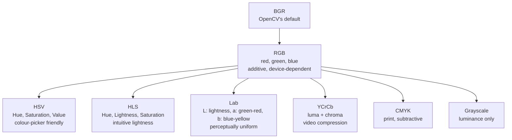
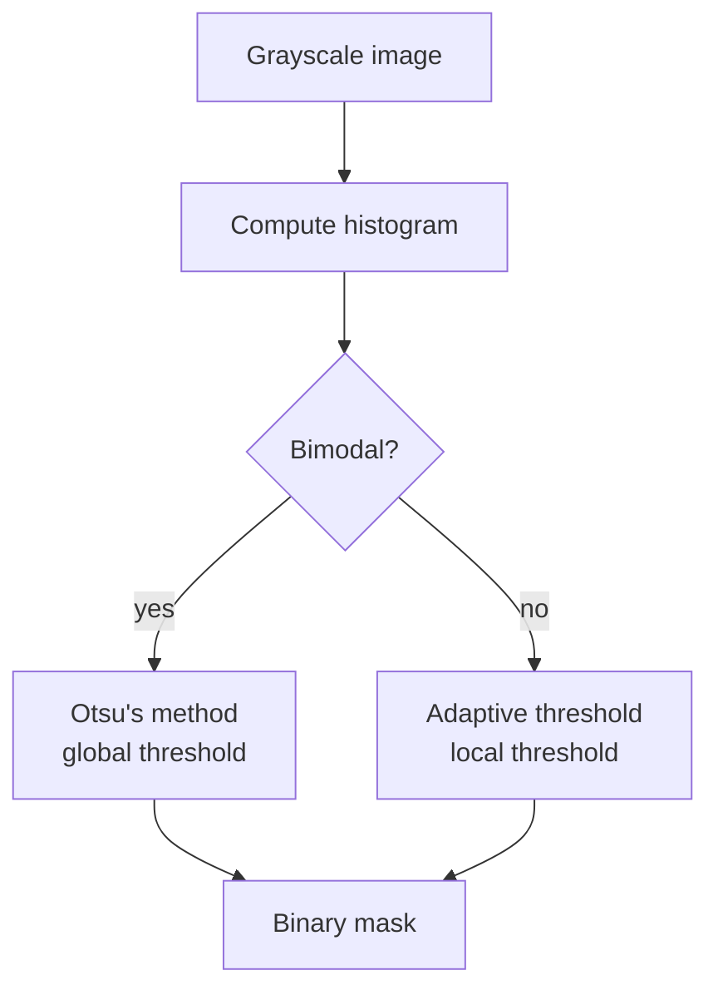
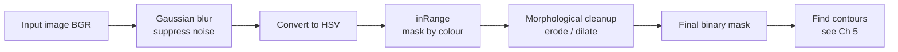

# 4. Color Spaces and Thresholding

> [!note] Why this note exists
> RGB is the right colour space for **displaying** images — monitors emit red, green, and blue light. But RGB is the wrong space for **analysing** them. The three channels are highly correlated (a bright yellow pixel has high R *and* high G), small changes in lighting shift all three channels together, and the "colour" you perceive is tangled with the "brightness" in ways that make thresholding painful. This note introduces the colour spaces that solve these problems — **HSV, HLS, and Lab** — and the **thresholding** operations that turn a colour image into a binary mask. We cover `cv2.threshold` (global), `cv2.adaptiveThreshold` (local), and **Otsu's method** (data-driven). After this note, [[5. Contours and Edge Detection]] takes the binary masks we produce and extracts shape information from them.

## Why It Matters

Consider a simple-sounding task: **detect all the red pixels in a photo.** In RGB, "red" means R is high and G, B are low — but how high? It depends on lighting. A red apple in shadow has R=120; the same apple in sunlight has R=240. There's no single RGB threshold that works.

In **HSV** (Hue, Saturation, Value), this is trivial: the hue channel tells you the colour, independent of brightness. Red lives at hue ≈ 0° (or 180° in OpenCV's 8-bit representation, which wraps). A single hue threshold `H < 10 or H > 170` finds red regardless of whether the apple is lit by sun or shade.

This pattern — convert to a perceptually-meaningful colour space, threshold, extract — is the foundation of almost all classical computer vision: skin detection, traffic-light recognition, ripe-fruit sorting, license-plate localisation, green-screen chroma keying. Master this note and you can solve a huge class of problems without ever training a neural network.

## Background

### Colour space taxonomy



The three workhorses for CV:

| Space | Components | Best for |
|---|---|---|
| **HSV** | Hue (0–179), Saturation (0–255), Value (0–255) | Colour-based segmentation by hue |
| **HLS** | Hue, Lightness, Saturation | Same as HSV but with a more intuitive lightness axis |
| **Lab** | L (lightness), a (greenred), b (blueyellow) | Perceptually uniform comparisons; colour difference |

### OpenCV's HSV quirks

OpenCV's 8-bit HSV is **not** the textbook 0–360°, 0–100%, 0–100% representation. To fit in 8 bits:

- **Hue**: 0–179 (i.e. 0°–360° divided by 2). Red wraps: hue 0 *and* hue 179 are both "red".
- **Saturation**: 0–255 (i.e. 0–100% scaled).
- **Value**: 0–255 (i.e. 0–100% scaled).

For floating-point HSV (convert from a `float32` BGR), the ranges are 0–360, 0–1, 0–1.

### Why Lab is "perceptually uniform"

A Euclidean distance in RGB space does not correspond to perceived colour difference: `(0, 0, 0)` → `(50, 0, 0)` looks like a big change, but `(200, 200, 200)` → `(210, 200, 200)` looks identical. The Lab space was designed so that **equal Euclidean distances correspond to equal perceived differences** — a property called perceptual uniformity. This makes Lab the right space for:

- Colour difference calculations (`ΔE = sqrt(ΔL² + Δa² + Δb²)`).
- Colour quantisation (k-means in Lab gives visually meaningful clusters).
- Colour transfer between images (matching histograms in Lab).

## Main Content

### 1. Converting colour spaces

```python
import cv2

img = cv2.imread("photo.jpg")   # BGR

hsv = cv2.cvtColor(img, cv2.COLOR_BGR2HSV)
hls = cv2.cvtColor(img, cv2.COLOR_BGR2HLS)
lab = cv2.cvtColor(img, cv2.COLOR_BGR2LAB)
ycrcb = cv2.cvtColor(img, cv2.COLOR_BGR2YCrCb)
gray = cv2.cvtColor(img, cv2.COLOR_BGR2GRAY)

# Back to BGR
bgr_from_hsv = cv2.cvtColor(hsv, cv2.COLOR_HSV2BGR)
```

### 2. Thresholding — `cv2.threshold`

```python
import cv2

gray = cv2.cvtColor(cv2.imread("photo.jpg"), cv2.COLOR_BGR2GRAY)

# Global binary threshold
_, binary = cv2.threshold(gray, thresh=128, maxval=255,
                          type=cv2.THRESH_BINARY)
# Pixels ≥ 128 become 255; pixels < 128 become 0.

# Inverted: pixels ≥ 128 become 0, < 128 become 255
_, binary_inv = cv2.threshold(gray, 128, 255, cv2.THRESH_BINARY_INV)

# Truncate: pixels ≥ 128 stay 128, others unchanged
_, trunc = cv2.threshold(gray, 128, 255, cv2.THRESH_TRUNC)

# To-zero: pixels < 128 → 0, ≥ 128 unchanged
_, tozero = cv2.threshold(gray, 128, 255, cv2.THRESH_TOZERO)
```

| Type | Behaviour |
|---|---|
| `THRESH_BINARY` | `dst = src ≥ thresh ? maxval : 0` |
| `THRESH_BINARY_INV` | `dst = src ≥ thresh ? 0 : maxval` |
| `THRESH_TRUNC` | `dst = min(src, thresh)` |
| `THRESH_TOZERO` | `dst = src ≥ thresh ? src : 0` |
| `THRESH_TOZERO_INV` | `dst = src ≥ thresh ? 0 : src` |

The function returns `(retval, dst)`. For a plain threshold, `retval == thresh`. For Otsu's method (below), `retval` is the automatically chosen threshold.

### 3. Otsu's method — automatic threshold

```python
# Otsu picks the threshold that maximises inter-class variance
retval, binary = cv2.threshold(gray, 0, 255,
                               cv2.THRESH_BINARY + cv2.THRESH_OTSU)
print(f"Otsu chose: {retval}")   # e.g. 117
```

Otsu's method assumes the histogram is bimodal (two peaks — foreground and background). It finds the threshold that minimises intra-class variance, equivalently maximising inter-class variance. The threshold value passed (`0` here) is ignored; only the OTSU flag matters.

When the histogram is **not** bimodal — e.g. a photo with smooth gradients — Otsu produces a poor threshold. In that case, use adaptive thresholding instead.



### 4. Adaptive thresholding — `cv2.adaptiveThreshold`

When lighting varies across the image (a shadowed half, a glare spot), no global threshold works. Adaptive thresholding computes a different threshold for each pixel, based on the local neighbourhood:

```python
binary = cv2.adaptiveThreshold(
    gray,
    maxValue=255,
    adaptiveMethod=cv2.ADAPTIVE_THRESH_MEAN_C,    # or GAUSSIAN_C
    thresholdType=cv2.THRESH_BINARY,
    blockSize=11,                                  # must be odd, ≥ 3
    C=2,                                            # constant subtracted from mean
)
```

- `ADAPTIVE_THRESH_MEAN_C` — threshold = mean of `blockSize × blockSize` neighbourhood, minus `C`.
- `ADAPTIVE_THRESH_GAUSSIAN_C` — threshold = Gaussian-weighted mean, minus `C`. Smoother; usually preferred.
- `blockSize` must be **odd** (3, 5, 7, ...) and large enough to capture local context (typically 11–31).
- `C` is a small constant (2–10) that nudges the threshold to bias toward one class.

Adaptive thresholding is the standard tool for **document scanning** — photos of text with uneven lighting.

### 5. Thresholding in HSV

The killer app for HSV: colour-based segmentation.

```python
import cv2
import numpy as np

img = cv2.imread("apples.jpg")
hsv = cv2.cvtColor(img, cv2.COLOR_BGR2HSV)

# Red wraps around hue 0 (and 179). Define two ranges and OR them.
lower_red1 = np.array([0, 70, 50])
upper_red1 = np.array([10, 255, 255])
lower_red2 = np.array([170, 70, 50])
upper_red2 = np.array([180, 255, 255])

mask1 = cv2.inRange(hsv, lower_red1, upper_red1)
mask2 = cv2.inRange(hsv, lower_red2, upper_red2)
mask = cv2.bitwise_or(mask1, mask2)

# Apply the mask
result = cv2.bitwise_and(img, img, mask=mask)
```

`cv2.inRange(src, lower, upper)` returns a binary mask: 255 where the pixel is within the range, 0 otherwise. This is the single most useful function for colour segmentation.

#### Common HSV ranges (OpenCV 8-bit)

| Colour | Lower (H, S, V) | Upper (H, S, V) |
|---|---|---|
| Red | (0, 70, 50) | (10, 255, 255) and (170, 70, 50)–(180, 255, 255) |
| Orange | (11, 70, 50) | (25, 255, 255) |
| Yellow | (26, 70, 50) | (34, 255, 255) |
| Green | (35, 50, 50) | (85, 255, 255) |
| Cyan | (86, 70, 50) | (100, 255, 255) |
| Blue | (101, 50, 50) | (130, 255, 255) |
| Purple | (131, 50, 50) | (155, 255, 255) |
| Pink | (156, 50, 50) | (169, 255, 255) |

Saturation and value lower bounds of 50–70 avoid matching near-white (low saturation) and near-black (low value) pixels.

### 6. Skin detection in HSV

A classic HSV application:

```python
lower_skin = np.array([0, 48, 80])    # hue 0, low sat, mid value
upper_skin = np.array([20, 255, 255]) # hue up to 20 covers light to medium skin

hsv = cv2.cvtColor(img, cv2.COLOR_BGR2HSV)
skin_mask = cv2.inRange(hsv, lower_skin, upper_skin)
skin = cv2.bitwise_and(img, img, mask=skin_mask)
```

This is the simplest skin detector — it works in controlled lighting but breaks under coloured light. For robustness, combine HSV with YCrCb (where skin tone clusters tightly in Cr/Cb) or train a classifier.

### 7. Thresholding in Lab

For tasks where **perceptual colour difference** matters, threshold in Lab:

```python
lab = cv2.cvtColor(img, cv2.COLOR_BGR2LAB)
L, a, b = cv2.split(lab)

# Find pixels whose colour is "reddish": a > 150 (high a = red side)
reddish = cv2.threshold(a, 150, 255, cv2.THRESH_BINARY)[1]
```

The `a` channel encodes the greenred axis (low = green, high = red). The `b` channel encodes the blueyellow axis. Thresholding on `a` and `b` is roughly equivalent to thresholding on hue but with perceptual uniformity.

### 8. Colour distance

```python
import numpy as np

target = np.array([100, 150, 200])   # BGR reference colour
dist = np.sqrt(np.sum((img.astype(np.float32) - target) ** 2, axis=2))
mask = (dist < 50).astype(np.uint8) * 255
```

For perceptually correct distance, do it in Lab:

```python
lab = cv2.cvtColor(img, cv2.COLOR_BGR2LAB).astype(np.float32)
target_lab = cv2.cvtColor(np.uint8([[target]]), cv2.COLOR_BGR2LAB)[0, 0].astype(np.float32)
dist = np.sqrt(np.sum((lab - target_lab) ** 2, axis=2))
mask = (dist < 25).astype(np.uint8) * 255   # ΔE < 25 is "similar"
```

A `ΔE` (Delta E) below ~2.3 is "perceptually indistinguishable"; below 25 is "the same colour family".

### 9. Putting it together — pipeline for colour segmentation



A typical segmentation pipeline has five stages: blur (remove noise), convert colour space, threshold (`inRange`), morphological cleanup (see [[6. Morphological Operations]]), and finally extract shapes (see [[5. Contours and Edge Detection]]). Skipping any stage degrades results.

## Code Examples

### Example A — Otsu thresholding

```python
import cv2

gray = cv2.cvtColor(cv2.imread("page.jpg"), cv2.COLOR_BGR2GRAY)
retval, binary = cv2.threshold(gray, 0, 255,
                               cv2.THRESH_BINARY + cv2.THRESH_OTSU)
print(f"Otsu threshold: {retval}")
cv2.imwrite("page_binary.png", binary)
```

### Example B — adaptive threshold for document scan

```python
import cv2

gray = cv2.cvtColor(cv2.imread("receipt.jpg"), cv2.COLOR_BGR2GRAY)
gray = cv2.GaussianBlur(gray, (5, 5), 0)

binary = cv2.adaptiveThreshold(
    gray, 255,
    cv2.ADAPTIVE_THRESH_GAUSSIAN_C,
    cv2.THRESH_BINARY,
    blockSize=21, C=5
)
cv2.imwrite("receipt_binary.png", binary)
```

### Example C — track a green object

```python
import cv2
import numpy as np

cap = cv2.VideoCapture(0)

while True:
    ret, frame = cap.read()
    if not ret:
        break

    hsv = cv2.cvtColor(frame, cv2.COLOR_BGR2HSV)
    lower = np.array([35, 50, 50])
    upper = np.array([85, 255, 255])
    mask = cv2.inRange(hsv, lower, upper)

    # Find the largest contour (see Ch 5)
    contours, _ = cv2.findContours(mask, cv2.RETR_EXTERNAL,
                                   cv2.CHAIN_APPROX_SIMPLE)
    if contours:
        c = max(contours, key=cv2.contourArea)
        x, y, w, h = cv2.boundingRect(c)
        cv2.rectangle(frame, (x, y), (x + w, y + h), (0, 255, 0), 2)

    cv2.imshow("tracked", frame)
    if cv2.waitKey(1) & 0xFF == ord("q"):
        break

cap.release()
cv2.destroyAllWindows()
```

### Example D — chroma key (green screen)

```python
import cv2
import numpy as np

foreground = cv2.imread("subject_on_green.jpg")
background = cv2.imread("background.jpg")
background = cv2.resize(background, (foreground.shape[1], foreground.shape[0]))

hsv = cv2.cvtColor(foreground, cv2.COLOR_BGR2HSV)
lower_green = np.array([35, 80, 80])
upper_green = np.array([85, 255, 255])
green_mask = cv2.inRange(hsv, lower_green, upper_green)

# Where mask is white (green), use background; else use foreground
mask_inv = cv2.bitwise_not(green_mask)
fg = cv2.bitwise_and(foreground, foreground, mask=mask_inv)
bg = cv2.bitwise_and(background, background, mask=green_mask)
composite = cv2.add(fg, bg)

cv2.imwrite("composite.jpg", composite)
```

### Example E — perceptual colour matching in Lab

```python
import cv2
import numpy as np

img = cv2.imread("fabric.jpg")
lab = cv2.cvtColor(img, cv2.COLOR_BGR2LAB).astype(np.float32)

target_bgr = np.uint8([[[40, 80, 200]]])  # a reddish target
target_lab = cv2.cvtColor(target_bgr, cv2.COLOR_BGR2LAB)[0, 0].astype(np.float32)

dist = np.sqrt(np.sum((lab - target_lab) ** 2, axis=2))
mask = (dist < 20).astype(np.uint8) * 255
result = cv2.bitwise_and(img, img, mask=mask)
cv2.imwrite("matched.jpg", result)
```

## Common Pitfalls

> [!danger] Hue wraps in OpenCV
> OpenCV's 8-bit hue is 0–179. Red lives at both ends (0 *and* 179). A single `inRange(hsv, (0, ...), (10, ...))` misses the upper half of red. Always define two ranges and OR them.

> [!danger] Adaptive threshold `blockSize` must be odd
> `cv2.adaptiveThreshold(..., blockSize=10, ...)` raises an error. Use 11, 21, 31, etc. The value should be large enough to span the local lighting variation.

> [!danger] Thresholding on RGB instead of HSV
> Trying to threshold "red" in RGB means R > threshold AND G < threshold AND B < threshold — and the right threshold depends on lighting. Convert to HSV first.

> [!danger] Otsu on a non-bimodal histogram
> If your image's histogram is unimodal (one big peak — e.g. a low-contrast photo), Otsu picks a threshold that splits the peak, producing a noisy mask. Use adaptive thresholding or hand-pick the threshold.

> [!danger] Using `cv2.THRESH_BINARY` without the `+` syntax for Otsu
> ```python
> cv2.threshold(gray, 0, 255, cv2.THRESH_BINARY)         # plain threshold at 0
> cv2.threshold(gray, 0, 255, cv2.THRESH_BINARY + cv2.THRESH_OTSU)  # Otsu
> ```
> The two flags must be combined with `+`. Without OTSU, threshold 0 produces an all-white image.

> [!danger] Forgetting to convert to grayscale first
> `cv2.threshold` expects a single-channel image. Passing a 3-channel BGR image produces a confusing error or silently thresholds only the first channel.

> [!warning] Lab `a` and `b` channels have unusual ranges
> In OpenCV's 8-bit Lab, L is 0–255 (not 0–100), a and b are 0–255 (offset by 128 from the standard -128 to 127 range). When converting to float for `ΔE` calculations, subtract 128 from `a` and `b` first.

> [!warning] Lighting changes break HSV thresholds
> Even HSV isn't immune — under tungsten light, "white" shifts toward yellow. For robustness, white-balance the image first (gray-world or learning-based) or train a classifier.

## Tips and Tricks

> [!tip] `cv2.inRange` is the workhorse
> Once you have an HSV image, `cv2.inRange` is the simplest way to threshold by colour. It accepts the lower and upper bounds as NumPy arrays.

> [!tip] Always blur before thresholding
> Noise creates spurious threshold crossings. A 3×3 or 5×5 Gaussian blur before thresholding eliminates most of them. Heavier blurs give smoother masks but lose detail.

> [!tip] Combine masks with bitwise ops
> ```python
> mask = cv2.bitwise_or(mask_red, mask_orange)  # red OR orange
> mask = cv2.bitwise_and(mask_hue, mask_sat)    # hue AND saturation
> mask = cv2.bitwise_not(mask)                  # invert
> ```

> [!tip] `cv2.bitwise_and(img, img, mask=mask)` to apply a mask
> The idiomatic way to keep only the pixels where `mask > 0`. The repeated `img` argument is the source and destination; only the masked region is copied.

> [!tip] Use `np.where` for conditional pixel logic
> ```python
> result = np.where(mask[..., None] > 0, img, background)
> ```
> Equivalent to a masked composite but expressed in NumPy. Useful for non-binary masks (soft alpha).

> [!tip] Visualise the threshold with a side-by-side plot
> ```python
> import matplotlib.pyplot as plt
> fig, axes = plt.subplots(1, 3, figsize=(15, 5))
> axes[0].imshow(cv2.cvtColor(img, cv2.COLOR_BGR2RGB)); axes[0].set_title("input")
> axes[1].imshow(mask, cmap="gray");                    axes[1].set_title("mask")
> axes[2].imshow(cv2.cvtColor(result, cv2.COLOR_BGR2RGB)); axes[2].set_title("result")
> ```

> [!tip] Otsu + Gaussian blur is the default document-scan pipeline
> ```python
> gray = cv2.GaussianBlur(gray, (5, 5), 0)
> _, binary = cv2.threshold(gray, 0, 255, cv2.THRESH_BINARY + cv2.THRESH_OTSU)
> ```
> Works on 80% of scanned documents out of the box.

> [!tip] Use `cv2.split` to inspect individual channels
> ```python
> h, s, v = cv2.split(hsv)
> cv2.imshow("hue", h); cv2.imshow("sat", s); cv2.imshow("val", v)
> ```
> Looking at each channel separately often reveals which one to threshold.

> [!tip] Calibrate thresholds with trackbars
> ```python
> def nothing(x): pass
> cv2.namedWindow("tune")
> cv2.createTrackbar("H_low", "tune", 0, 179, nothing)
> cv2.createTrackbar("H_high", "tune", 179, 179, nothing)
> # ... inside the loop:
> h_low = cv2.getTrackbarPos("H_low", "tune")
> h_high = cv2.getTrackbarPos("H_high", "tune")
> mask = cv2.inRange(hsv, (h_low, 50, 50), (h_high, 255, 255))
> ```
> Interactive tuning saves hours of trial and error.

## Active Recall

1. Why is RGB a poor colour space for image analysis? Name two reasons.
2. What are the three components of HSV? What are their ranges in OpenCV's 8-bit representation?
3. Why does the hue channel "wrap" for red? How do you handle this in code?
4. What is the difference between `cv2.THRESH_BINARY` and `cv2.THRESH_BINARY_INV`?
5. What does `cv2.threshold(gray, 0, 255, cv2.THRESH_BINARY + cv2.THRESH_OTSU)` do? Why is the `0` ignored?
6. When should you use adaptive thresholding instead of Otsu?
7. What does `blockSize` mean in adaptive thresholding? What constraint must it satisfy?
8. Write the HSV range to detect pure blue in OpenCV's 8-bit representation.
9. Why is Lab called "perceptually uniform"? What practical benefit does that give?
10. What is `ΔE`? Below what value are two colours "indistinguishable"?
11. Write the snippet to apply a binary mask to an image (keep only masked pixels).
12. Why should you blur before thresholding?
13. Write the two-mask trick for detecting red in HSV.
14. Name the five stages of a colour-segmentation pipeline.

## Next Steps

You can now turn a colour image into a binary mask. The next note, [[5. Contours and Edge Detection]], takes those masks (and grayscale images) and extracts **shape information**: edges via Canny, Sobel, and Laplacian; contours via `cv2.findContours`; properties like area, perimeter, and bounding box. After that, [[6. Morphological Operations]] teaches you to clean up binary masks — removing noise, filling holes, separating touching objects — using erosion, dilation, opening, closing, and the morphological gradient. [[7. NumPy for Images]] returns to the pixel level for arithmetic, blending, and convolutions.

For displaying binary masks alongside their source images, review [[25. Matplotlib/4. Subplots and Layouts]] — the side-by-side layout (`fig, axes = plt.subplots(1, 3)`) is the standard way to show "input / mask / result" comparisons.
