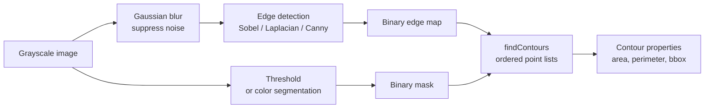
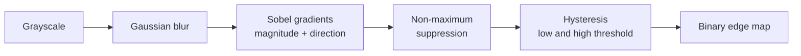
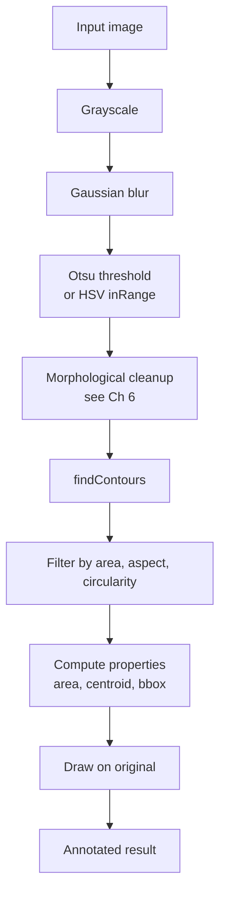

# 5. Contours and Edge Detection

> [!note] Why this note exists
> Thresholding (see [[4. Color Spaces and Thresholding]]) gives you a binary mask: white where the object is, black elsewhere. The next question is **what shape is the white region?** That's where edge detection and contour finding come in. This note covers the three classic edge-detection algorithms — **Sobel** (gradient magnitude), **Laplacian** (second derivative), and **Canny** (multi-stage with hysteresis) — and the contour API: `cv2.findContours`, `cv2.drawContours`, and the property functions (`cv2.contourArea`, `cv2.arcLength`, `cv2.boundingRect`, `cv2.minAreaRect`, `cv2.fitEllipse`, `cv2.approxPolyDP`). After this note you can take any binary mask and turn it into structured shape data — the foundation of object detection, OCR, and shape analysis.

## Why It Matters

Once you can extract contours, you can answer questions like:

- **How many objects are in this image?** → count the contours.
- **What is each object's position?** → `cv2.boundingRect` or `cv2.moments` for the centroid.
- **What is each object's size?** → `cv2.contourArea`.
- **What is each object's shape?** → `cv2.approxPolyDP` to polygonise, then count vertices (3 = triangle, 4 = rectangle, many = circle).
- **What is each object's orientation?** → `cv2.minAreaRect` or `cv2.fitEllipse`.

Combined with the colour-based segmentation from the previous note, this is enough to build:

- A coin counter (segment by colour, find contours, count).
- A license-plate reader (segment white rectangles on dark background, find contours, extract the rectangular ones).
- A document scanner (find the largest quadrilateral contour).
- A simple object tracker (segment by colour, find the largest contour, track its centroid frame to frame).

None of these require deep learning. They are the workhorses of classical computer vision and they run in real time on a Raspberry Pi.

## Background

### Edges vs contours

An **edge** is a curve along which the image intensity changes sharply. A **contour** is a closed curve outlining a region. The two are related but distinct:

- Edge detection finds **pixels** where the gradient is high. The output is a binary edge map.
- Contour finding takes a binary mask (or edge map) and traces the **boundaries** of the white regions, returning them as ordered lists of points.



You can feed either an edge map or a threshold mask into `findContours`. Threshold masks usually give cleaner contours because edges detected by Canny often have gaps that confuse the contour tracer.

### The image gradient

The **gradient** of an image at a pixel is the vector `(∂I/∂x, ∂I/∂y)` — how fast intensity changes in x and y. The **gradient magnitude** is `sqrt((∂I/∂x)² + (∂I/∂y)²)`; high magnitudes occur at edges. The **gradient direction** is `atan2(∂I/∂y, ∂I/∂x)`; perpendicular to the edge.

All edge-detection algorithms are some flavour of "compute gradient, threshold magnitude". The differences are in how the gradient is approximated and how the threshold is applied.

## Main Content

### 1. Sobel operator

Sobel approximates the gradient by convolving with small kernels:

```python
import cv2

gray = cv2.cvtColor(cv2.imread("photo.jpg"), cv2.COLOR_BGR2GRAY)

# Sobel X (horizontal gradient)
sobel_x = cv2.Sobel(gray, cv2.CV_64F, dx=1, dy=0, ksize=3)
# Sobel Y (vertical gradient)
sobel_y = cv2.Sobel(gray, cv2.CV_64F, dx=0, dy=1, ksize=3)

# Gradient magnitude
import numpy as np
magnitude = np.sqrt(sobel_x ** 2 + sobel_y ** 2)
magnitude = np.uint8(255 * magnitude / magnitude.max())
```

The Sobel kernels are:

```
Gx = [-1  0  1]      Gy = [-1 -2 -1]
     [-2  0  2]           [ 0  0  0]
     [-1  0  1]           [ 1  2  1]
```

- `dx=1, dy=0` → horizontal gradient (detects vertical edges).
- `dx=0, dy=1` → vertical gradient (detects horizontal edges).
- `ksize` is the kernel size: 1, 3, 5, or 7. Larger = smoother but blurs detail.
- Use `CV_64F` (float64) for the output to avoid overflow with negative gradients. Convert back to `uint8` with `np.abs()` and scaling.

### 2. Laplacian operator

The Laplacian is the second derivative: `∇²I = ∂²I/∂x² + ∂²I/∂y²`. It highlights edges (zero crossings of the second derivative) but is very sensitive to noise — always blur first.

```python
blurred = cv2.GaussianBlur(gray, (5, 5), 0)
laplacian = cv2.Laplacian(blurred, cv2.CV_64F, ksize=3)
laplacian = np.uint8(np.absolute(laplacian))
```

Laplacian is rarely used standalone — it's the basis for **LoG** (Laplacian-of-Gaussian) and **DoG** (Difference-of-Gaussians) blob detectors.

### 3. Canny edge detection

Canny is a multi-stage algorithm:

1. **Gaussian blur** to suppress noise.
2. **Sobel gradients** to compute magnitude and direction.
3. **Non-maximum suppression**: thin edges to one pixel wide by keeping only the local maxima along the gradient direction.
4. **Hysteresis thresholding**: two thresholds (high, low). Pixels above `high` are strong edges; pixels between `low` and `high` are kept only if connected to a strong edge.

```python
edges = cv2.Canny(gray, threshold1=100, threshold2=200,
                  apertureSize=3, L2gradient=False)
```

- `threshold1` is the low threshold; `threshold2` is the high. A common rule of thumb: `high / low ≈ 2:1` or `3:1`.
- `apertureSize` is the Sobel kernel size (3, 5, 7). Default 3.
- `L2gradient=True` uses the exact L2 norm (slower, slightly more accurate). Default `False` (L1 approximation).



#### Choosing Canny thresholds

The classic recommendation by John Canny himself: set `high` so that 70–90% of edge pixels are rejected, and `low = high / 2` or `high / 3`. For automated thresholding, compute thresholds from the image's median:

```python
def auto_canny(gray, sigma=0.33):
    v = np.median(gray)
    lower = int(max(0, (1.0 - sigma) * v))
    upper = int(min(255, (1.0 + sigma) * v))
    return cv2.Canny(gray, lower, upper)
```

This "auto-Canny" trick works well across many images without per-image tuning.

### 4. Finding contours — `cv2.findContours`

```python
import cv2

gray = cv2.cvtColor(cv2.imread("shapes.jpg"), cv2.COLOR_BGR2GRAY)
_, binary = cv2.threshold(gray, 128, 255, cv2.THRESH_BINARY + cv2.THRESH_OTSU)

contours, hierarchy = cv2.findContours(
    binary,
    mode=cv2.RETR_EXTERNAL,
    method=cv2.CHAIN_APPROX_SIMPLE,
)
```

- `mode` controls the contour hierarchy:
  - `RETR_EXTERNAL` — only the outermost contours (ignores holes).
  - `RETR_LIST` — all contours, no hierarchy.
  - `RETR_CCOMP` — two-level hierarchy (outer + holes).
  - `RETR_TREE` — full nested hierarchy (parent/child).
- `method` controls point compression:
  - `CHAIN_APPROX_SIMPLE` — collapses horizontal, vertical, and diagonal segments to their endpoints. (Use this.)
  - `CHAIN_APPROX_NONE` — every boundary pixel. (Memory-heavy, rarely useful.)

Each contour is a NumPy array of shape `(N, 1, 2)` — N points, each `(x, y)`. The number of contours is `len(contours)`.

> [!warning] OpenCV 3 vs 4 return signature
> In OpenCV 3, `findContours` returns `(image, contours, hierarchy)` — three values. In OpenCV 4+, it returns `(contours, hierarchy)` — two values. If you're writing version-portable code, check `cv2.__version__` or use a try/except.

### 5. Drawing contours

```python
img = cv2.imread("shapes.jpg")
cv2.drawContours(img, contours, -1, color=(0, 255, 0), thickness=2)
# contourIdx=-1 means "draw all"; otherwise, index into contours
cv2.imwrite("contours.jpg", img)
```

For labelled drawing:

```python
for i, c in enumerate(contours):
    color = tuple(int(x) for x in np.random.randint(0, 255, 3))
    cv2.drawContours(img, [c], -1, color, 2)
```

### 6. Contour properties

```python
c = contours[0]

# Area (in pixels)
area = cv2.contourArea(c)

# Perimeter (arc length)
perimeter = cv2.arcLength(c, closed=True)

# Bounding rectangle (axis-aligned)
x, y, w, h = cv2.boundingRect(c)
cv2.rectangle(img, (x, y), (x + w, y + h), (0, 255, 0), 2)

# Rotated bounding rectangle (minimum area)
rect = cv2.minAreaRect(c)            # ((cx, cy), (w, h), angle)
box = cv2.boxPoints(rect)            # 4 corner points
box = np.int0(box)
cv2.drawContours(img, [box], 0, (0, 0, 255), 2)

# Minimum enclosing circle
(cx, cy), radius = cv2.minEnclosingCircle(c)
cv2.circle(img, (int(cx), int(cy)), int(radius), (255, 0, 0), 2)

# Fitted ellipse (needs ≥ 5 points)
ellipse = cv2.fitEllipse(c)
cv2.ellipse(img, ellipse, (255, 255, 0), 2)

# Centroid via moments
M = cv2.moments(c)
cx = int(M["m10"] / M["m00"])
cy = int(M["m01"] / M["m00"])
cv2.circle(img, (cx, cy), 4, (255, 0, 255), -1)
```

### 7. Polygon approximation — `cv2.approxPolyDP`

```python
epsilon = 0.02 * cv2.arcLength(c, True)
approx = cv2.approxPolyDP(c, epsilon, closed=True)
n_vertices = len(approx)

if n_vertices == 3:
    shape = "triangle"
elif n_vertices == 4:
    shape = "rectangle"
elif n_vertices > 10:
    shape = "circle"
else:
    shape = "polygon"
```

`epsilon` is the maximum distance between the original curve and its approximation. Larger epsilon = fewer vertices, more aggressive simplification. The `0.02 * perimeter` rule of thumb works for most shapes.

### 8. Convex hull and defects

```python
hull = cv2.convexHull(c)
cv2.drawContours(img, [hull], -1, (0, 255, 255), 2)

# Convexity defects (useful for hand-gesture recognition)
hull_indices = cv2.convexHull(c, returnPoints=False)
defects = cv2.convexityDefects(c, hull_indices)
```

The convex hull is the smallest convex polygon enclosing the contour. Convexity defects are the "dips" between the contour and its hull — the gaps between fingers in a hand contour.

### 9. Filtering contours

In practice, most images produce hundreds of small spurious contours. Filter by area:

```python
MIN_AREA = 500
big_contours = [c for c in contours if cv2.contourArea(c) > MIN_AREA]
```

Filter by aspect ratio (for finding rectangles):

```python
for c in contours:
    x, y, w, h = cv2.boundingRect(c)
    aspect_ratio = w / h
    if 0.8 < aspect_ratio < 1.2:
        print("roughly square")
```

Filter by circularity (for finding circles):

```python
for c in contours:
    area = cv2.contourArea(c)
    perimeter = cv2.arcLength(c, True)
    if perimeter == 0:
        continue
    circularity = 4 * np.pi * area / perimeter ** 2
    if circularity > 0.85:
        print("roughly circular")
```

Circularity is 1.0 for a perfect circle, lower for elongated shapes.

### 10. The full pipeline



Every classical CV pipeline follows this shape. The morphological cleanup step (see [[6. Morphological Operations]]) is essential: without it, noisy masks produce dozens of tiny spurious contours that pollute the analysis.

## Code Examples

### Example A — Canny edge detection

```python
import cv2

img = cv2.imread("photo.jpg")
gray = cv2.cvtColor(img, cv2.COLOR_BGR2GRAY)
blurred = cv2.GaussianBlur(gray, (5, 5), 0)

edges = cv2.Canny(blurred, 100, 200)
cv2.imwrite("edges.png", edges)
```

### Example B — count coins

```python
import cv2

img = cv2.imread("coins.jpg")
gray = cv2.cvtColor(img, cv2.COLOR_BGR2GRAY)
blurred = cv2.GaussianBlur(gray, (11, 11), 0)

_, binary = cv2.threshold(blurred, 0, 255,
                          cv2.THRESH_BINARY + cv2.THRESH_OTSU)

# Morphological closing to fuse coin boundaries
kernel = cv2.getStructuringElement(cv2.MORPH_ELLIPSE, (5, 5))
binary = cv2.morphologyEx(binary, cv2.MORPH_CLOSE, kernel, iterations=2)

contours, _ = cv2.findContours(binary, cv2.RETR_EXTERNAL,
                               cv2.CHAIN_APPROX_SIMPLE)

coin_count = 0
for c in contours:
    if cv2.contourArea(c) < 200:
        continue
    coin_count += 1
    x, y, w, h = cv2.boundingRect(c)
    cv2.rectangle(img, (x, y), (x + w, y + h), (0, 255, 0), 2)

print(f"Found {coin_count} coins")
cv2.imwrite("coins_counted.jpg", img)
```

### Example C — classify shapes

```python
import cv2

img = cv2.imread("shapes.png")
gray = cv2.cvtColor(img, cv2.COLOR_BGR2GRAY)
_, binary = cv2.threshold(gray, 240, 255, cv2.THRESH_BINARY_INV)

contours, _ = cv2.findContours(binary, cv2.RETR_EXTERNAL,
                               cv2.CHAIN_APPROX_SIMPLE)

for c in contours:
    if cv2.contourArea(c) < 100:
        continue

    epsilon = 0.02 * cv2.arcLength(c, True)
    approx = cv2.approxPolyDP(c, epsilon, True)
    n = len(approx)

    if n == 3:
        label = "triangle"
    elif n == 4:
        label = "rectangle"
    elif n > 8:
        label = "circle"
    else:
        label = f"{n}-gon"

    x, y, w, h = cv2.boundingRect(c)
    cv2.putText(img, label, (x, y - 5),
                cv2.FONT_HERSHEY_SIMPLEX, 0.6, (0, 0, 255), 2)
    cv2.drawContours(img, [c], -1, (0, 255, 0), 2)

cv2.imwrite("shapes_classified.jpg", img)
```

### Example D — document scanner (find largest quadrilateral)

```python
import cv2
import numpy as np

img = cv2.imread("receipt.jpg")
gray = cv2.cvtColor(img, cv2.COLOR_BGR2GRAY)
blurred = cv2.GaussianBlur(gray, (5, 5), 0)
edges = cv2.Canny(blurred, 75, 200)

contours, _ = cv2.findContours(edges, cv2.RETR_LIST,
                               cv2.CHAIN_APPROX_SIMPLE)
contours = sorted(contours, key=cv2.contourArea, reverse=True)[:5]

for c in contours:
    epsilon = 0.02 * cv2.arcLength(c, True)
    approx = cv2.approxPolyDP(c, epsilon, True)
    if len(approx) == 4:
        # Found the document outline
        for point in approx:
            cv2.circle(img, tuple(point[0]), 8, (0, 0, 255), -1)
        break

cv2.imwrite("document_detected.jpg", img)
```

### Example E — Sobel magnitude visualization

```python
import cv2
import numpy as np

gray = cv2.cvtColor(cv2.imread("photo.jpg"), cv2.COLOR_BGR2GRAY)
gray = cv2.GaussianBlur(gray, (3, 3), 0)

sx = cv2.Sobel(gray, cv2.CV_64F, 1, 0, ksize=3)
sy = cv2.Sobel(gray, cv2.CV_64F, 0, 1, ksize=3)
mag = np.sqrt(sx ** 2 + sy ** 2)
mag = np.uint8(255 * mag / mag.max())

cv2.imwrite("sobel_magnitude.png", mag)
```

## Common Pitfalls

> [!danger] Forgetting to blur before Canny
> Canny has a built-in blur, but it's small (3×3). Noisy images produce thick, broken edges. Always pre-blur with at least 5×5.

> [!danger] Wrong threshold ratio in Canny
> `threshold1` and `threshold2` are the LOW and HIGH thresholds respectively (not the other way around). `cv2.Canny(img, 200, 100)` gives almost no edges; `cv2.Canny(img, 100, 200)` gives reasonable ones.

> [!danger] OpenCV 3 vs 4 return signature
> OpenCV 3: `_, contours, hierarchy = cv2.findContours(...)`. OpenCV 4+: `contours, hierarchy = cv2.findContours(...)`. Mixing these crashes.

> [!danger] Modifying the input to `findContours`
> `findContours` modifies the input image in place (in some OpenCV versions). Pass `binary.copy()` if you need the binary mask afterwards.

> [!danger] `findContours` expects a binary image (0 or 255)
> A grayscale image with values in between produces nonsense contours. Threshold first.

> [!danger] `cv2.contourArea` returns 0 for unclosed contours
> If you pass `closed=False` to `arcLength` but use `contourArea`, the area is computed as if the contour were closed — which may give a wrong answer. Use the same `closed` value consistently.

> [!danger] Drawing order matters
> `drawContours(img, contours, -1, ...)` draws on `img` in place. If you want to keep the original, pass a copy: `cv2.drawContours(img.copy(), ...)`.

> [!warning] `approxPolyDP` epsilon too small
> With `epsilon = 0.001 * perimeter`, you get the original contour back. With `epsilon = 0.1 * perimeter`, you get a triangle for almost everything. Start at `0.02` and tune.

> [!warning] Small contours are noise
> Always filter by `cv2.contourArea(c) > some_threshold`. Without filtering, a single noisy pixel becomes a contour of area 1, polluting the analysis.

## Tips and Tricks

> [!tip] Auto-Canny with median-based thresholds
> ```python
> def auto_canny(gray, sigma=0.33):
>     v = np.median(gray)
>     lower = int(max(0, (1.0 - sigma) * v))
>     upper = int(min(255, (1.0 + sigma) * v))
>     return cv2.Canny(gray, lower, upper)
> ```
> Works across most images without manual tuning.

> [!tip] Always pre-blur
> Even a 3×3 blur dramatically reduces spurious edges. For noisy images, 5×5 or 7×7.

> [!tip] Sort contours by area to find "the big one"
> ```python
> contours = sorted(contours, key=cv2.contourArea, reverse=True)
> biggest = contours[0]
> ```
> Useful when you know there's one main object (a document, a hand, a face).

> [!tip] `cv2.moments` for centroid
> ```python
> M = cv2.moments(c)
> if M["m00"] != 0:
>     cx = int(M["m10"] / M["m00"])
>     cy = int(M["m01"] / M["m00"])
> ```
> More robust than the bounding-box centre for irregular shapes.

> [!tip] Use `cv2.RETR_EXTERNAL` first
> Most applications only want the outermost contours. Switch to `RETR_TREE` only if you need to analyse nested structure (e.g. holes inside objects).

> [!tip] `cv2.boundingRect` for fast ROI extraction
> ```python
> x, y, w, h = cv2.boundingRect(c)
> roi = img[y:y+h, x:x+w]
> ```
> Crop each detected object for downstream classification.

> [!tip] Combine edge detection + contour finding
> Sometimes thresholding fails but edges are clean. Run Canny, then `findContours` on the edge map. Sometimes the reverse. Try both.

> [!tip] `cv2.matchShapes` for shape matching
> ```python
> score = cv2.matchShapes(c1, c2, cv2.CONTOURS_MATCH_I1, 0)
> ```
> Returns 0 for identical shapes, larger for dissimilar. Use Hu moments (translation/rotation/scale invariant).

> [!tip] `cv2.pointPolygonTest` for hit testing
> ```python
> result = cv2.pointPolygonTest(c, (x, y), False)
> # +1 inside, 0 on edge, -1 outside
> ```

> [!tip] Visualise the contour hierarchy
> ```python
> for i, c in enumerate(contours):
>     color = tuple(int(x) for x in np.random.randint(0, 255, 3))
>     cv2.drawContours(img, [c], -1, color, 2)
>     M = cv2.moments(c)
>     cx = int(M["m10"] / M["m00"]) if M["m00"] else 0
>     cy = int(M["m01"] / M["m00"]) if M["m00"] else 0
>     cv2.putText(img, str(i), (cx, cy), cv2.FONT_HERSHEY_SIMPLEX, 0.5, color, 1)
> ```

## Active Recall

1. What is the difference between an edge and a contour?
2. Name the four stages of the Canny algorithm.
3. Why does Canny use hysteresis thresholding instead of a single threshold?
4. Write the auto-Canny snippet and explain how the thresholds are derived.
5. What does `cv2.findContours` return in OpenCV 4? What did it return in OpenCV 3?
6. What is the difference between `RETR_EXTERNAL` and `RETR_TREE`?
7. Why is `CHAIN_APPROX_SIMPLE` preferred over `CHAIN_APPROX_NONE`?
8. Write the snippet to compute the centroid of a contour using `cv2.moments`.
9. What does `cv2.approxPolyDP` do? What is the role of `epsilon`?
10. How do you classify a contour as a triangle, rectangle, or circle?
11. What is circularity? How is it computed? What value indicates a perfect circle?
12. Why should you always filter contours by area?
13. What is the convex hull of a contour? When are convexity defects useful?
14. Write a snippet to find the largest quadrilateral contour in an image (for a document scanner).

## Next Steps

You can now extract structured shape data from images. The next note, [[6. Morphological Operations]], covers the cleanup operations that make contour finding reliable: **erosion, dilation, opening, closing, gradient, top hat, and black hat**. These operate on binary masks (the input to `findContours`) to remove noise, fill holes, separate touching objects, and detect edges. After that, [[7. NumPy for Images]] returns to the pixel level for arithmetic, blending, histograms, and convolutions with SciPy.

For visualising contours and edges, you'll want side-by-side comparisons — review [[25. Matplotlib/4. Subplots and Layouts]] for the layout patterns. The "input / mask / contour" three-panel layout is the standard way to present CV results in a notebook or report.
