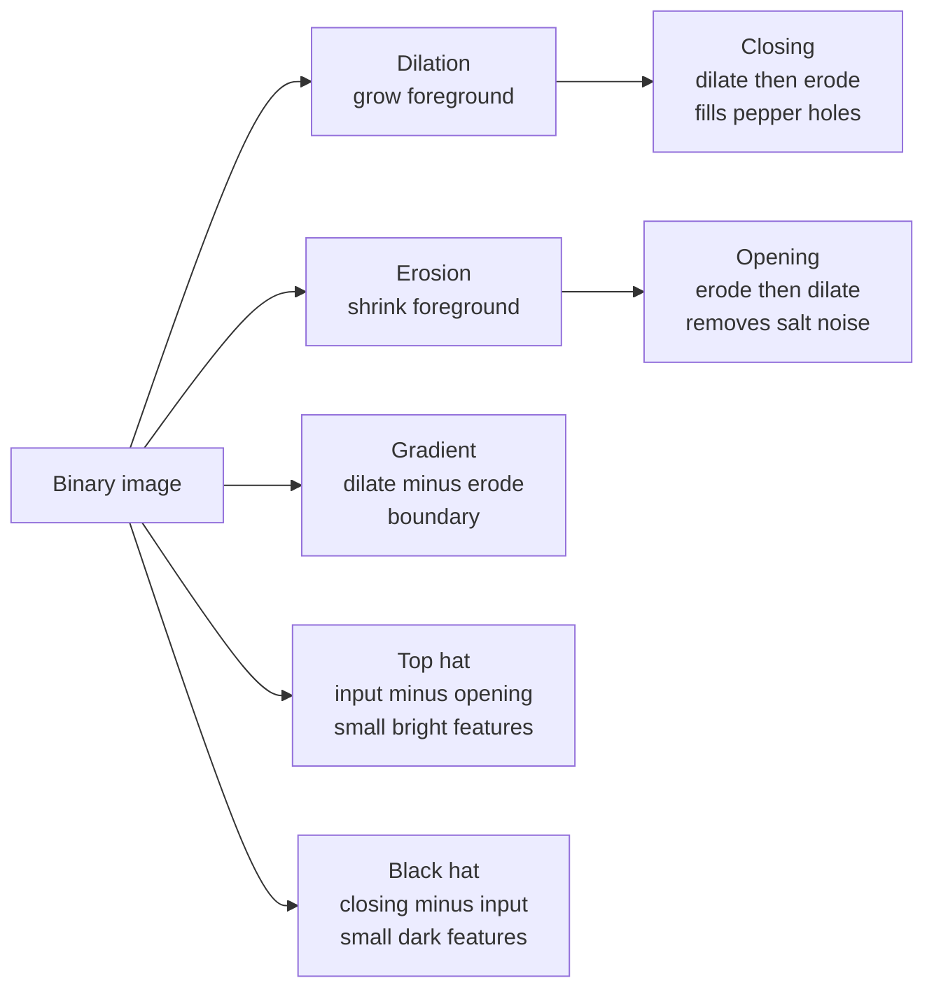
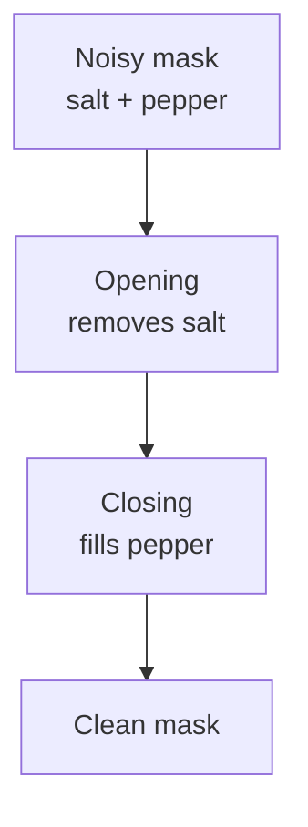

# 6. Morphological Operations

> [!note] Why this note exists
> Thresholding (see [[4. Color Spaces and Thresholding]]) rarely produces a clean binary mask. Real masks have speckle noise, small holes inside objects, ragged boundaries, and occasionally two objects touching that should be separate. **Morphological operations** are the cleanup toolbox: erosion, dilation, opening, closing, gradient, top hat, and black hat. Each is a simple, fast, deterministic transform on a binary image that fixes one specific defect. This note covers all seven, the structuring element (kernel) that controls their behaviour, and the canonical recipes (e.g. "open then close" for noise removal, "gradient" for edge detection, "closing" for filling holes). After this note you'll be able to take a noisy mask and turn it into something `cv2.findContours` (see [[5. Contours and Edge Detection]]) can analyse cleanly.

## Why It Matters

Open a photo of a coin on a table. Threshold by colour. You'll get a mask that's mostly correct but has:

- **Salt noise**: tiny white specks outside the coin (reflections, dust).
- **Pepper noise**: tiny black holes inside the coin (shadows, scratches).
- **Ragged boundary**: the outline is jittery, not smooth.
- **Touching objects**: if two coins are close, their masks merge into one blob.

Each of these has a one-line fix:

- Salt noise → `cv2.erode` (or `opening`).
- Pepper noise → `cv2.dilate` (or `closing`).
- Ragged boundary → `closing` then `opening`.
- Touching objects → `cv2.watershed` (advanced) or careful erosion followed by dilation.

Morphological operations are deterministic, fast (microseconds per megapixel), and require no parameters beyond a structuring element. They are the right first attempt at any binary-image cleanup problem.

## Background

### Binary images and sets

A binary image is a 2D array of 0s and 1s (or 0 and 255). Mathematical morphology treats it as a **set** of points (the foreground, where the value is 1). Every morphological operation is defined in terms of set operations between the image and a small **structuring element** (also a binary set).

The structuring element (often called the **kernel**) is typically a 3×3, 5×5, or 7×7 square, rectangle, ellipse, or cross. The choice of shape and size controls how the operation behaves:

- A **square** kernel treats all 8 (or 24, or 48) neighbours equally.
- A **cross** kernel (`+` shape) considers only the 4-connected neighbours — gives thinner results.
- An **ellipse** kernel treats neighbours proportionally to their distance from the centre — gives smoother, more "circular" results.

```python
import cv2
import numpy as np

square = cv2.getStructuringElement(cv2.MORPH_RECT, (5, 5))
ellipse = cv2.getStructuringElement(cv2.MORPH_ELLIPSE, (5, 5))
cross = cv2.getStructuringElement(cv2.MORPH_CROSS, (5, 5))
```

The three look like:

```
MORPH_RECT          MORPH_ELLIPSE       MORPH_CROSS
1 1 1 1 1           0 0 1 0 0           0 0 1 0 0
1 1 1 1 1           1 1 1 1 1           0 0 1 0 0
1 1 1 1 1           1 1 1 1 1           1 1 1 1 1
1 1 1 1 1           1 1 1 1 1           0 0 1 0 0
1 1 1 1 1           0 0 1 0 0           0 0 1 0 0
```

### Dilation and erosion — the two primitives

Every morphological operation is a combination of two primitives:

- **Dilation** (`∨`): the output pixel is 1 if **any** of the input pixels under the structuring element is 1. Dilation **grows** the foreground.
- **Erosion** (`∧`): the output pixel is 1 only if **all** of the input pixels under the structuring element are 1. Erosion **shrinks** the foreground.



The other operations are combinations:

- **Opening** = erode then dilate. Removes small foreground objects (salt noise) without changing the size of large objects.
- **Closing** = dilate then erode. Fills small holes (pepper noise) without changing the size of large objects.
- **Gradient** = dilation minus erosion. Gives the boundary of the foreground.
- **Top hat** = input minus opening. Isolates small bright features on a darker background.
- **Black hat** = closing minus input. Isolates small dark features on a brighter background.

## Main Content

### 1. Erosion — `cv2.erode`

```python
import cv2
import numpy as np

binary = cv2.imread("mask.png", cv2.IMREAD_GRAYSCALE)
kernel = np.ones((5, 5), np.uint8)
eroded = cv2.erode(binary, kernel, iterations=1)
```

- Each output pixel is 255 only if **all** pixels under the kernel are 255.
- `iterations=1` applies the erosion once. `iterations=3` is equivalent to eroding with a 3× larger kernel.
- Effect: foreground shrinks, small foreground objects disappear, thin bridges between objects break.

Use cases:

- Remove salt noise (small white specks).
- Separate touching objects (erode until the bridge breaks).
- Shrink the boundary inward by a known amount.

### 2. Dilation — `cv2.dilate`

```python
dilated = cv2.dilate(binary, kernel, iterations=1)
```

- Each output pixel is 255 if **any** pixel under the kernel is 255.
- Effect: foreground grows, small holes fill, broken edges reconnect.

Use cases:

- Fill pepper noise (small black holes).
- Reconnect broken edges after edge detection.
- Grow a region outward (e.g. to merge nearby detections).

### 3. Opening — `cv2.morphologyEx(binary, cv2.MORPH_OPEN, kernel)`

```python
opened = cv2.morphologyEx(binary, cv2.MORPH_OPEN, kernel)
```

Equivalent to `dilate(erode(binary))`. The erosion removes small foreground objects; the dilation restores the survivors to their original size. Net effect: **salt noise removed, large objects unchanged**.

### 4. Closing — `cv2.morphologyEx(binary, cv2.MORPH_CLOSE, kernel)`

```python
closed = cv2.morphologyEx(binary, cv2.MORPH_CLOSE, kernel)
```

Equivalent to `erode(dilate(binary))`. The dilation fills small holes; the erosion restores the boundary. Net effect: **pepper holes filled, large objects unchanged**.



For most masks, the recipe "open then close" produces a clean result. Try "close then open" if the noise pattern is different.

### 5. Morphological gradient — `cv2.MORPH_GRADIENT`

```python
gradient = cv2.morphologyEx(binary, cv2.MORPH_GRADIENT, kernel)
```

Equivalent to `dilate(binary) - erode(binary)`. The result is a one-pixel-wide (or kernel-wide) outline of the foreground. Useful as a quick-and-dirty edge detector on binary images.

### 6. Top hat — `cv2.MORPH_TOPHAT`

```python
tophat = cv2.morphologyEx(binary, cv2.MORPH_TOPHAT, kernel)
```

Equivalent to `binary - opening(binary)`. The opening removes small bright features; subtracting from the original leaves **only the small bright features**. Useful for:

- Highlighting small bright objects on a non-uniform background.
- Correcting uneven illumination (subtract the top-hat result from the original).

Works on grayscale images too — `cv2.morphologyEx` accepts any single-channel array.

### 7. Black hat — `cv2.MORPH_BLACKHAT`

```python
blackhat = cv2.morphologyEx(binary, cv2.MORPH_BLACKHAT, kernel)
```

Equivalent to `closing(binary) - binary`. The closing fills small dark features; subtracting the original leaves **only the small dark features**. Useful for:

- Finding dark spots (defects, pupils) on a bright background.
- Detecting text on a non-uniform page background.

### 8. Structuring elements

```python
import cv2
import numpy as np

# Built-in shapes
rect = cv2.getStructuringElement(cv2.MORPH_RECT, (5, 5))
ellipse = cv2.getStructuringElement(cv2.MORPH_ELLIPSE, (7, 7))
cross = cv2.getStructuringElement(cv2.MORPH_CROSS, (5, 5))

# Custom kernel
kernel = np.array([[0, 1, 0],
                   [1, 1, 1],
                   [0, 1, 0]], dtype=np.uint8)

# Larger kernels
big = cv2.getStructuringElement(cv2.MORPH_ELLIPSE, (15, 15))

# Non-square (anisotropic)
wide = cv2.getStructuringElement(cv2.MORPH_RECT, (15, 3))   # good for horizontal features
tall = cv2.getStructuringElement(cv2.MORPH_RECT, (3, 15))   # good for vertical features
```

Choosing the kernel:

| Goal | Shape | Size |
|---|---|---|
| General-purpose cleanup | Ellipse | 3×3 or 5×5 |
| Aggressive noise removal | Ellipse | 7×7 or larger |
| Thin lines (preserve connectivity) | Cross | 3×3 |
| Horizontal text lines | Rectangle | (W, 1) with W=15–30 |
| Vertical strokes | Rectangle | (1, H) with H=15–30 |
| Circular objects (preserve roundness) | Ellipse | match object diameter |

### 9. Iterations vs kernel size

```python
# These are roughly equivalent:
result1 = cv2.erode(binary, np.ones((3, 3), np.uint8), iterations=5)
result2 = cv2.erode(binary, np.ones((11, 11), np.uint8), iterations=1)
```

For separable kernels (rectangles), `iterations=N` with a 3×3 is faster than a single (2N+1)×(2N+1) kernel — OpenCV optimises the iterative form. For non-separable kernels (ellipses), the single-large-kernel form is more accurate (iterating a 3×3 ellipse approximates a diamond, not a circle).

### 10. Use cases

#### A. Document noise removal

```python
binary = cv2.adaptiveThreshold(gray, 255, cv2.ADAPTIVE_THRESH_GAUSSIAN_C,
                                cv2.THRESH_BINARY, 21, 5)
# Invert: text is white, background is black
binary = cv2.bitwise_not(binary)
# Remove specks
clean = cv2.morphologyEx(binary, cv2.MORPH_OPEN,
                          cv2.getStructuringElement(cv2.MORPH_RECT, (3, 3)))
```

#### B. Filling holes in objects

```python
filled = cv2.morphologyEx(binary, cv2.MORPH_CLOSE,
                          cv2.getStructuringElement(cv2.MORPH_ELLIPSE, (15, 15)),
                          iterations=2)
```

#### C. Separating touching objects

```python
# Erode until the bridge breaks, then count
eroded = cv2.erode(binary, np.ones((15, 15), np.uint8), iterations=3)
contours, _ = cv2.findContours(eroded, cv2.RETR_EXTERNAL, cv2.CHAIN_APPROX_SIMPLE)
print(f"Separate objects: {len(contours)}")
```

#### D. Edge detection on a binary mask

```python
edges = cv2.morphologyEx(binary, cv2.MORPH_GRADIENT,
                         cv2.getStructuringElement(cv2.MORPH_RECT, (3, 3)))
```

#### E. Background correction for uneven illumination

```python
# Estimate the background by morphological opening with a large kernel
gray = cv2.cvtColor(img, cv2.COLOR_BGR2GRAY)
kernel = cv2.getStructuringElement(cv2.MORPH_ELLIPSE, (51, 51))
background = cv2.morphologyEx(gray, cv2.MORPH_OPEN, kernel)
# Subtract the background to flatten illumination
flat = cv2.subtract(gray, background)
```

This is a quick alternative to a full background-illumination model. The kernel must be larger than the largest foreground object.

### 11. Operations on grayscale images

Morphological operations work on grayscale too — dilation takes the local max, erosion takes the local min. This is the basis for top-hat / black-hat background subtraction.

```python
import cv2

gray = cv2.cvtColor(cv2.imread("uneven.jpg"), cv2.COLOR_BGR2GRAY)
kernel = cv2.getStructuringElement(cv2.MORPH_ELLIPSE, (25, 25))

# White top hat: small bright features on darker background
tophat = cv2.morphologyEx(gray, cv2.MORPH_TOPHAT, kernel)

# Black hat: small dark features on brighter background
blackhat = cv2.morphologyEx(gray, cv2.MORPH_BLACKHAT, kernel)

# Contrast-normalised image
normalised = cv2.add(gray, tophat)
normalised = cv2.subtract(normalised, blackhat)
```

## Code Examples

### Example A — full cleanup pipeline

```python
import cv2
import numpy as np

# Threshold a noisy image
gray = cv2.cvtColor(cv2.imread("noisy.jpg"), cv2.COLOR_BGR2GRAY)
gray = cv2.GaussianBlur(gray, (5, 5), 0)
_, binary = cv2.threshold(gray, 0, 255, cv2.THRESH_BINARY + cv2.THRESH_OTSU)

# Clean up
kernel = cv2.getStructuringElement(cv2.MORPH_ELLIPSE, (5, 5))
opened = cv2.morphologyEx(binary, cv2.MORPH_OPEN, kernel, iterations=2)
closed = cv2.morphologyEx(opened, cv2.MORPH_CLOSE, kernel, iterations=2)

# Find contours on the cleaned mask
contours, _ = cv2.findContours(closed, cv2.RETR_EXTERNAL, cv2.CHAIN_APPROX_SIMPLE)
print(f"Found {len(contours)} objects")
```

### Example B — text line detection

```python
import cv2
import numpy as np

gray = cv2.cvtColor(cv2.imread("document.jpg"), cv2.COLOR_BGR2GRAY)
binary = cv2.adaptiveThreshold(gray, 255, cv2.ADAPTIVE_THRESH_GAUSSIAN_C,
                                cv2.THRESH_BINARY_INV, 25, 15)

# Close with a wide horizontal kernel to fuse characters into lines
wide_kernel = cv2.getStructuringElement(cv2.MORPH_RECT, (50, 1))
lines = cv2.morphologyEx(binary, cv2.MORPH_CLOSE, wide_kernel)

# Find one contour per line
contours, _ = cv2.findContours(lines, cv2.RETR_EXTERNAL, cv2.CHAIN_APPROX_SIMPLE)
print(f"Found {len(contours)} text lines")
```

### Example C — uneven illumination correction

```python
import cv2

gray = cv2.cvtColor(cv2.imread("uneven_light.jpg"), cv2.COLOR_BGR2GRAY)
large_kernel = cv2.getStructuringElement(cv2.MORPH_ELLIPSE, (51, 51))

# Background = opening with large kernel (removes small bright features)
background = cv2.morphologyEx(gray, cv2.MORPH_OPEN, large_kernel)
flat = cv2.subtract(gray, background)
# Normalise to use full 0-255 range
flat = cv2.normalize(flat, None, 0, 255, cv2.NORM_MINMAX)

cv2.imwrite("flat.jpg", flat)
```

### Example D — separate touching coins

```python
import cv2
import numpy as np

gray = cv2.cvtColor(cv2.imread("coins_touching.jpg"), cv2.COLOR_BGR2GRAY)
_, binary = cv2.threshold(gray, 0, 255, cv2.THRESH_BINARY_INV + cv2.THRESH_OTSU)

# Distance transform, then find local maxima as seeds
dist = cv2.distanceTransform(binary, cv2.DIST_L2, 5)
_, seeds = cv2.threshold(dist, 0.5 * dist.max(), 255, 0)
seeds = np.uint8(seeds)

# Watershed from the seeds
_, markers = cv2.connectedComponents(seeds)
markers = markers + 1
markers[binary == 0] = 0
img = cv2.cvtColor(gray, cv2.COLOR_GRAY2BGR)
markers = cv2.watershed(img, markers)

# Count unique markers (excluding -1 boundaries and 0 background)
unique = np.unique(markers)
print(f"Separate coins: {len(unique) - 2}")  # subtract bg and boundary
```

### Example E — gradient as edge detector

```python
import cv2

gray = cv2.cvtColor(cv2.imread("shapes.jpg"), cv2.COLOR_BGR2GRAY)
_, binary = cv2.threshold(gray, 128, 255, cv2.THRESH_BINARY)

kernel = cv2.getStructuringElement(cv2.MORPH_RECT, (3, 3))
edges = cv2.morphologyEx(binary, cv2.MORPH_GRADIENT, kernel)

cv2.imwrite("edges_morph.png", edges)
```

## Common Pitfalls

> [!danger] Applying morphology to colour images
> Morphological operations are defined for single-channel images. Passing a 3-channel BGR image silently operates on each channel independently, producing odd colour shifts. Convert to grayscale or binary first.

> [!danger] Wrong kernel dtype
> The kernel must be `np.uint8`. `np.ones((5, 5))` defaults to `float64`, which OpenCV may reject or interpret incorrectly. Always pass `np.uint8` or use `cv2.getStructuringElement`.

> [!danger] `iterations` vs larger kernel confusion
> `erode(img, k3, iterations=5)` and `erode(img, k11, iterations=1)` are similar for square kernels but **not identical** for ellipses. The iterative form produces a diamond; the single big kernel produces an actual ellipse. Pick the form that matches your intent.

> [!danger] Closing then opening can destroy thin objects
> Closing with a large kernel can bridge gaps and merge nearby objects; opening can then remove thin features. Always inspect the intermediate result before continuing.

> [!danger] Forgetting to invert
> Morphology operates on the **foreground** (white pixels). If your mask has objects as black and background as white (some thresholding modes produce this), invert with `cv2.bitwise_not` first.

> [!danger] Too-large kernels
> A 51×51 erosion obliterates everything smaller than 51 pixels. Start with 3×3 or 5×5 and increase only if needed.

> [!warning] `cv2.morphologyEx` modifies the input in some versions
> Pass `binary.copy()` if you need the original afterwards.

> [!warning] Order matters
> `opening` (erode then dilate) is not the same as `closing` (dilate then erode). The former removes small bright features; the latter fills small dark holes. Mixing them up gives the opposite of what you want.

## Tips and Tricks

> [!tip] "Open then close" is the default cleanup recipe
> ```python
> cleaned = cv2.morphologyEx(binary, cv2.MORPH_OPEN, kernel)
> cleaned = cv2.morphologyEx(cleaned, cv2.MORPH_CLOSE, kernel)
> ```
> This removes salt, then fills pepper. Try the reverse ("close then open") if your noise pattern is different.

> [!tip] Use an ellipse kernel by default
> `cv2.getStructuringElement(cv2.MORPH_ELLIPSE, (5, 5))` produces smoother results than a rectangle, with no preferred direction. Use rectangles only when you specifically want directional behaviour.

> [!tip] Distance transform + watershed for touching objects
> Pure erosion breaks touching objects but also shrinks them. The distance transform + watershed approach (Example D above) is the proper tool — see OpenCV's watershed docs.

> [!tip] Top hat for uneven background
> A large-kernel opening estimates the background; subtracting it flattens the image. This is the standard trick for microscopy and document scanning.

> [!tip] Combine morphology with contours for robust segmentation
> ```python
> cleaned = cv2.morphologyEx(binary, cv2.MORPH_OPEN, kernel)
> cleaned = cv2.morphologyEx(cleaned, cv2.MORPH_CLOSE, kernel)
> contours, _ = cv2.findContours(cleaned, cv2.RETR_EXTERNAL, cv2.CHAIN_APPROX_SIMPLE)
> ```
> Without the cleanup, a noisy mask produces dozens of spurious contours.

> [!tip] Anisotropic kernels for directional features
> ```python
> horizontal = cv2.getStructuringElement(cv2.MORPH_RECT, (25, 1))
> vertical = cv2.getStructuringElement(cv2.MORPH_RECT, (1, 25))
> ```
> A wide horizontal kernel closes horizontal gaps (text lines); a tall vertical kernel closes vertical gaps (table columns).

> [!tip] `cv2.distanceTransform` for "distance to nearest background"
> ```python
> dist = cv2.distanceTransform(binary, cv2.DIST_L2, 5)
> ```
> Returns a float image where each foreground pixel's value is its distance to the nearest background pixel. Useful for skeletonisation, watershed seeding, and width estimation.

> [!tip] Skeletonisation via repeated thinning
> OpenCV doesn't have a built-in skeleton function, but you can implement Zhang-Suen thinning in ~30 lines, or use `skimage.morphology.skeletonize` from scikit-image.

> [!tip] Visualise each step in a subplot
> ```python
> import matplotlib.pyplot as plt
> fig, axes = plt.subplots(1, 4, figsize=(16, 4))
> for ax, im, title in zip(axes,
>                          [binary, opened, closed, edges],
>                          ["binary", "opened", "closed", "gradient"]):
>     ax.imshow(im, cmap="gray"); ax.set_title(title); ax.axis("off")
> ```

## Active Recall

1. What are the two primitive morphological operations? Define each in terms of set operations.
2. What is the difference between opening and closing? Which removes salt noise? Which fills pepper holes?
3. What does the morphological gradient compute?
4. What is the difference between top hat and black hat?
5. Name the three built-in structuring element shapes. When would you choose each?
6. Why is `np.ones((5, 5))` a poor kernel argument? What should you use instead?
7. Write the "open then close" cleanup recipe.
8. What does `iterations=3` do in `cv2.erode`? How does it differ from a single pass with a larger kernel?
9. Why is morphological gradient a useful edge detector on binary masks?
10. How would you remove salt noise (small white specks) from a binary mask?
11. How would you fill small dark holes inside a white object?
12. Why does morphology on a 3-channel BGR image produce odd results?
13. Describe the top-hat background subtraction trick. What kernel size do you need?
14. What does `cv2.distanceTransform` compute? Give one use case.

## Next Steps

This concludes the binary-image portion of the chapter. The final note, [[7. NumPy for Images]], returns to the pixel level: treating images as NumPy arrays, extracting channels, doing arithmetic and blending, computing histograms with `np.histogram` and `plt.hist`, and performing convolutions with `scipy.ndimage`. These are the building blocks you'll combine with everything in this chapter — colour thresholding, contour finding, and morphological cleanup — to build the projects the roadmap mentions: an image editor, an OCR preprocessor, a screenshot analyser, an edge detector, and an object tracker.

For visualising morphological results, you'll want side-by-side comparisons of "before / after" — review [[25. Matplotlib/4. Subplots and Layouts]] for the layout patterns. A common debugging pattern is to display binary → opened → closed → contours in a 4-panel grid.
