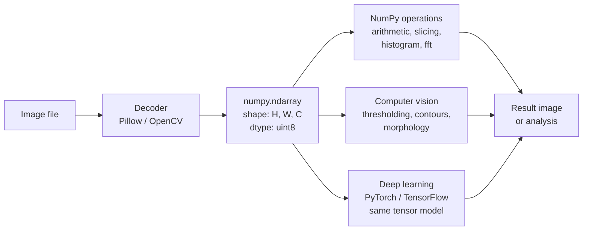

# 7. NumPy for Images

> [!note] Why this note exists
> Every image in Python — whether opened by Pillow (see [[1. Pillow Basics]]) or read by OpenCV (see [[3. OpenCV Basics]]) — ultimately becomes a **NumPy array**. Once you accept that, an enormous toolbox opens up: vectorised arithmetic, channel manipulation, blending, histograms, Fourier analysis, convolutions via `scipy.ndimage`. This note covers the array representation (`(H, W, C)` shape, `uint8` dtype, channel ordering), the basic pixel operations (extraction, slicing, arithmetic, blending), histogram computation and equalisation, and the convolution-based filters that go beyond what `ImageFilter.Kernel` can do. After this note you'll think of an image not as a "picture" but as a numeric tensor — and that mental shift is the foundation of everything in deep learning, scientific imaging, and advanced computer vision.

## Why It Matters

The source roadmap puts it bluntly:

```text
Image = Matrix = NumPy Array
```

This identity is the key insight of the entire chapter. Once an image is a NumPy array:

- **Arithmetic becomes element-wise**: `img * 1.2` brightens; `255 - img` inverts; `(img_a + img_b) // 2` averages.
- **Channels become slices**: `img[:, :, 0]` is the blue channel (in BGR); `img[:, :, ::-1]` swaps to RGB.
- **Crop becomes slicing**: `img[100:500, 200:800]` is a 400×600 region.
- **Filters become convolutions**: any 3×3 or 5×5 kernel can be applied via `scipy.ndimage.convolve` or `cv2.filter2D`.
- **Statistics become NumPy**: histograms, means, std deviations, percentiles — all one-liners.
- **GPU pipelines start here**: PyTorch and TensorFlow expect the same shape (with a batch dimension prepended) and the same channel semantics.

If you've ever wondered why every deep-learning framework uses `(B, C, H, W)` tensors — that's a NumPy array with a batch dimension and channels moved to axis 1 for GPU performance. The mental model is identical.

## Background

### The image as a tensor

A grayscale image is a 2D array of shape `(H, W)`, dtype usually `uint8` (0–255) or `float32` (0.0–1.0). A colour image is a 3D array of shape `(H, W, C)` where `C` is 3 (RGB or BGR) or 4 (RGBA, BGRA).

```python
import numpy as np
from PIL import Image

img = Image.open("photo.jpg")           # PIL Image
arr = np.array(img)                      # NumPy array
print(arr.shape, arr.dtype)              # (1080, 1920, 3) uint8
print(arr.min(), arr.max())              # 0 255
```



### dtype matters

The same image can be represented in multiple dtypes:

| dtype | Range | Use case |
|---|---|---|
| `uint8` | 0–255 | Default for JPEG/PNG. Most APIs expect this. |
| `uint16` | 0–65535 | Medical imaging, RAW photos. |
| `float32` | 0.0–1.0 (typically) | Computed values, deep learning. |
| `float64` | 0.0–1.0 | High-precision scientific work. |
| `bool` | True/False | Binary masks. |

The same arithmetic gives **wildly different results** depending on dtype:

```python
arr_u8 = np.array([200, 200, 200], dtype=np.uint8)
arr_f  = np.array([200, 200, 200], dtype=np.float32) / 255

print(arr_u8 + arr_u8)   # [400, 400, 400] mod 256 → [144, 144, 144]   OVERFLOW!
print(arr_f  + arr_f)    # [1.569, 1.569, 1.569]   → clamps visually to white
```

`uint8` arithmetic wraps on overflow. This is the most common bug in pixel math. Convert to `float32` before any arithmetic that might overflow, then convert back:

```python
arr_f = arr.astype(np.float32)
result = (arr_f * 1.5).clip(0, 255).astype(np.uint8)
```

### Coordinate convention

NumPy indexing is **row-major**: `arr[row, col]` = `arr[y, x]`. This is the opposite of Pillow's `(x, y)` convention and the opposite of the way coordinates are usually written.

```python
# Crop the centre 100x100 region of an HxW image
H, W = arr.shape[:2]
centre = arr[H//2 - 50 : H//2 + 50, W//2 - 50 : W//2 + 50]

# Get pixel at coordinate (x=42, y=17)
pixel = arr[17, 42]
```

## Main Content

### 1. Channel extraction and manipulation

```python
# BGR (OpenCV) channels
b = arr[:, :, 0]
g = arr[:, :, 1]
r = arr[:, :, 2]

# Each is a (H, W) array — a 2D grayscale image of one channel.

# Zero out the red channel
arr_no_red = arr.copy()
arr_no_red[:, :, 2] = 0

# Swap red and blue (BGR  RGB)
rgb = arr[:, :, ::-1]                # view, no copy
rgb = arr[:, :, ::-1].copy()         # explicit copy if needed

# Reorder channels to RGB with explicit indices
rgb = arr[:, :, [2, 1, 0]]
```

#### Channel statistics

```python
print("mean per channel:", arr.mean(axis=(0, 1)))
print("std per channel: ", arr.std(axis=(0, 1)))
print("R range:", arr[:, :, 2].min(), arr[:, :, 2].max())
```

`axis=(0, 1)` collapses the spatial dimensions, leaving one value per channel.

### 2. Pixel arithmetic

```python
import numpy as np

arr = np.array(Image.open("photo.jpg"))
f = arr.astype(np.float32)

# Brighten by 30
bright = (f + 30).clip(0, 255).astype(np.uint8)

# Invert
inverted = (255 - arr).astype(np.uint8)

# Gamma correction
gamma = 2.2
gamma_corrected = (255 * (f / 255) ** (1 / gamma)).clip(0, 255).astype(np.uint8)

# Contrast stretch
lo, hi = np.percentile(f, [2, 98])
stretched = ((f - lo) * 255 / (hi - lo)).clip(0, 255).astype(np.uint8)
```

`.clip(0, 255)` is essential before casting back to `uint8` — without it, values outside the range wrap.

### 3. Blending two images

```python
import numpy as np
from PIL import Image

a = np.array(Image.open("a.jpg").convert("RGB")).astype(np.float32)
b = np.array(Image.open("b.jpg").convert("RGB")).astype(np.float32)

# Ensure same shape
b = np.array(Image.fromarray(b.astype(np.uint8)).resize((a.shape[1], a.shape[0]))).astype(np.float32)

# Linear blend: 0.7 * a + 0.3 * b
alpha = 0.3
blended = (a * (1 - alpha) + b * alpha).clip(0, 255).astype(np.uint8)

Image.fromarray(blended).save("blended.jpg")
```

For per-pixel alpha (a soft mask):

```python
mask = np.random.rand(*a.shape[:2])           # (H, W) random soft mask
mask = mask[:, :, None]                        # broadcast to (H, W, 1)
blended = (a * (1 - mask) + b * mask).clip(0, 255).astype(np.uint8)
```

### 4. Histograms

```python
import numpy as np
import matplotlib.pyplot as plt

gray = np.array(Image.open("photo.jpg").convert("L"))

# Compute histogram
hist, bin_edges = np.histogram(gray, bins=256, range=(0, 255))

# Plot
plt.figure(figsize=(8, 4))
plt.bar(bin_edges[:-1], hist, width=1, color="black")
plt.xlabel("pixel value")
plt.ylabel("count")
plt.title("Grayscale histogram")
plt.show()
```

Or with Matplotlib's built-in:

```python
plt.hist(gray.ravel(), bins=256, range=(0, 255), color="black")
plt.show()
```

`.ravel()` flattens the 2D array to 1D — `hist` expects a 1D input.

#### Per-channel colour histogram

```python
colours = ["red", "green", "blue"]
plt.figure(figsize=(8, 4))
for i, c in enumerate(colours):
    plt.hist(arr[:, :, i].ravel(), bins=256, range=(0, 255),
             color=c, alpha=0.5, label=c)
plt.legend()
plt.show()
```

#### Histogram equalisation

```python
def histogram_equalise(gray):
    hist, _ = np.histogram(gray, bins=256, range=(0, 255))
    cdf = hist.cumsum()
    cdf_normalised = cdf * 255 / cdf[-1]   # scale to 0-255
    lut = cdf_normalised.astype(np.uint8)
    return lut[gray]

equalised = histogram_equalise(gray)
```

The Cumulative Distribution Function (CDF) of the histogram gives a lookup table that maps each input value to its equalised output. The result has an approximately flat histogram — maximising contrast.

OpenCV provides a faster version:

```python
import cv2
equalised = cv2.equalizeHist(gray)

# For colour, equalise the L channel of LAB
lab = cv2.cvtColor(img, cv2.COLOR_BGR2LAB)
lab[:, :, 0] = cv2.equalizeHist(lab[:, :, 0])
result = cv2.cvtColor(lab, cv2.COLOR_LAB2BGR)
```

### 5. Convolutions

A convolution slides a small kernel over the image, computing at each position the sum of element-wise products. It is the fundamental operation of image filtering.

```python
import numpy as np
from scipy.ndimage import convolve

gray = np.array(Image.open("photo.jpg").convert("L"), dtype=np.float32)

# Box blur (3x3 average)
box = np.ones((3, 3)) / 9
blurred = convolve(gray, box)

# Sharpen (Laplacian sharpening)
sharpen = np.array([[ 0, -1,  0],
                    [-1,  5, -1],
                    [ 0, -1,  0]])
sharpened = convolve(gray, sharpen)

# Sobel X
sobel_x = np.array([[-1, 0, 1],
                    [-2, 0, 2],
                    [-1, 0, 1]])
edges_x = convolve(gray, sobel_x)

# Sobel Y
sobel_y = np.array([[-1, -2, -1],
                    [ 0,  0,  0],
                    [ 1,  2,  1]])
edges_y = convolve(gray, sobel_y)

# Gradient magnitude
magnitude = np.sqrt(edges_x ** 2 + edges_y ** 2)
```

`scipy.ndimage.convolve` defaults to `mode="reflect"` at boundaries, which is usually what you want. OpenCV's `cv2.filter2D` is faster but uses a slightly different convention.

```python
import cv2
blurred = cv2.filter2D(gray, ddepth=cv2.CV_32F, kernel=box)
```

The `ddepth` argument controls the output dtype. `cv2.CV_8U` clips to 0–255; `cv2.CV_32F` keeps floats; `cv2.CV_64F` keeps doubles. Use `CV_32F` or higher for kernels that can produce negatives (Sobel, Laplacian).

### 6. Gaussian blur from scratch

```python
def gaussian_kernel(size, sigma):
    ax = np.linspace(-(size // 2), size // 2, size)
    xx, yy = np.meshgrid(ax, ax)
    kernel = np.exp(-(xx ** 2 + yy ** 2) / (2 * sigma ** 2))
    return kernel / kernel.sum()

k = gaussian_kernel(5, sigma=1.0)
blurred = convolve(gray, k)
```

OpenCV's `cv2.GaussianBlur(gray, (5, 5), 1.0)` is faster (it uses separable 1D convolutions: a 5×5 Gaussian is two 5×1 convolutions, which is O(5n) instead of O(25n)).

### 7. Thresholding with NumPy

```python
# Binary threshold
binary = (gray > 128).astype(np.uint8) * 255

# Multi-level threshold
segmented = np.zeros_like(gray)
segmented[gray < 50]    = 0
segmented[(gray >= 50) & (gray < 128)] = 85
segmented[(gray >= 128) & (gray < 200)] = 170
segmented[gray >= 200]  = 255
```

NumPy boolean indexing is faster than `cv2.threshold` for complex multi-condition thresholds.

### 8. Image statistics

```python
print("mean:", gray.mean())
print("std: ", gray.std())
print("min / max:", gray.min(), gray.max())
print("median:", np.median(gray))
print("95th percentile:", np.percentile(gray, 95))

# Region statistics
top_left = gray[:H//2, :W//2]
print("top-left mean:", top_left.mean())
```

### 9. Fourier analysis — `np.fft`

```python
import numpy as np

f = np.fft.fft2(gray)
f_shifted = np.fft.fftshift(f)        # centre the zero-frequency component
magnitude = np.log(np.abs(f_shifted) + 1)

# High-pass filter: zero out low frequencies
rows, cols = gray.shape
centre = (rows // 2, cols // 2)
mask = np.ones((rows, cols), dtype=np.float32)
cv2.circle(mask, centre, 30, 0, -1)   # zero inside radius 30

f_filtered = f_shifted * mask
f_unshifted = np.fft.ifftshift(f_filtered)
high_pass = np.real(np.fft.ifft2(f_unshifted))
```

Fourier analysis is the basis for frequency-domain filtering — useful for periodic noise removal (Moiré patterns), large-scale blur detection, and compression analysis.

### 10. NumPy  OpenCV  Pillow

```mermaid
flowchart LR
    PIL[PIL.Image]
    NP[numpy.ndarray<br/>RGB, uint8]
    CV[numpy.ndarray<br/>BGR, uint8]

    PIL -->|np.array| NP
    NP -->|Image.fromarray| PIL
    NP -->|arr[:, :, ::-1]| CV
    CV -->|arr[:, :, ::-1]| NP
    CV -->|Image.fromarray after swap| PIL
    PIL -->|swap then cv2 not needed| CV
```

The three representations are all NumPy arrays under the hood — the only differences are channel order (RGB vs BGR) and whether the wrapping object is a `PIL.Image` or a raw `ndarray`.

```python
# PIL → NumPy (RGB)
arr = np.array(Image.open("p.jpg"))

# NumPy → PIL (RGB)
img = Image.fromarray(arr)

# NumPy (RGB) → OpenCV (BGR)
cv_arr = arr[:, :, ::-1].copy()

# OpenCV (BGR) → NumPy (RGB)
arr = cv_arr[:, :, ::-1].copy()

# OpenCV (BGR) → PIL (RGB)
img = Image.fromarray(cv_arr[:, :, ::-1])
```

The `.copy()` is needed when you want to modify the new array without affecting the original. Without it, the slice is a view.

### 11. Tiling and batching

```python
# Split a large image into 256x256 tiles
H, W, C = arr.shape
tile = 256
tiles = []
for y in range(0, H, tile):
    for x in range(0, W, tile):
        t = arr[y:y+tile, x:x+tile]
        if t.shape[:2] == (tile, tile):
            tiles.append(t)

tiles = np.stack(tiles)   # shape: (N, 256, 256, 3) — ready for batch inference
```

This pattern — tile → stack → batch infer → un-stack → reassemble — is the standard pipeline for running a CNN on a large image.

## Code Examples

### Example A — full NumPy pipeline

```python
import numpy as np
from PIL import Image
import matplotlib.pyplot as plt

img = Image.open("photo.jpg").convert("RGB")
arr = np.array(img, dtype=np.float32)

# 1. Convert to grayscale (luma)
gray = arr @ np.array([0.299, 0.587, 0.114])
gray = gray.astype(np.uint8)

# 2. Contrast stretch
lo, hi = np.percentile(gray, [2, 98])
stretched = ((gray - lo) * 255 / (hi - lo)).clip(0, 255).astype(np.uint8)

# 3. Histogram
hist, _ = np.histogram(stretched, bins=256, range=(0, 255))

fig, axes = plt.subplots(1, 3, figsize=(15, 4))
axes[0].imshow(img); axes[0].set_title("original"); axes[0].axis("off")
axes[1].imshow(stretched, cmap="gray"); axes[1].set_title("stretched"); axes[1].axis("off")
axes[2].bar(np.arange(256), hist, color="black"); axes[2].set_title("histogram")
plt.show()
```

### Example B — sharpen with convolution

```python
import numpy as np
from scipy.ndimage import convolve
from PIL import Image

gray = np.array(Image.open("photo.jpg").convert("L"), dtype=np.float32)

sharpen = np.array([[ 0, -1,  0],
                    [-1,  5, -1],
                    [ 0, -1,  0]])
sharp = convolve(gray, sharpen).clip(0, 255).astype(np.uint8)
Image.fromarray(sharp).save("sharp.png")
```

### Example C — blend with a soft mask

```python
import numpy as np
from PIL import Image

a = np.array(Image.open("a.jpg").convert("RGB"), dtype=np.float32)
b = np.array(Image.open("b.jpg").convert("RGB").resize((a.shape[1], a.shape[0])), dtype=np.float32)

# Vertical gradient mask: 0 at top, 1 at bottom
H, W = a.shape[:2]
yy = np.linspace(0, 1, H)[:, None] * np.ones(W)[None, :]
mask = yy[:, :, None]   # (H, W, 1)

blended = (a * (1 - mask) + b * mask).clip(0, 255).astype(np.uint8)
Image.fromarray(blended).save("gradient_blend.jpg")
```

### Example D — colour histogram with channels

```python
import numpy as np
from PIL import Image
import matplotlib.pyplot as plt

arr = np.array(Image.open("photo.jpg"))
colours = ["red", "green", "blue"]

plt.figure(figsize=(8, 4))
for i, c in enumerate(colours):
    plt.hist(arr[:, :, i].ravel(), bins=64, range=(0, 255),
             color=c, alpha=0.5, label=c)
plt.legend()
plt.xlabel("pixel value")
plt.ylabel("count")
plt.title("Per-channel colour histogram")
plt.show()
```

### Example E — frequency-domain high-pass

```python
import numpy as np
import cv2
from PIL import Image

gray = np.array(Image.open("photo.jpg").convert("L"), dtype=np.float32)
f = np.fft.fft2(gray)
f_shifted = np.fft.fftshift(f)

rows, cols = gray.shape
mask = np.ones((rows, cols), np.float32)
cv2.circle(mask, (cols // 2, rows // 2), 30, 0, -1)

f_filtered = f_shifted * mask
high_pass = np.real(np.fft.ifft2(np.fft.ifftshift(f_filtered)))
high_pass = (high_pass - high_pass.min()) / (high_pass.max() - high_pass.min()) * 255
high_pass = high_pass.astype(np.uint8)
Image.fromarray(high_pass).save("high_pass.png")
```

## Common Pitfalls

> [!danger] `uint8` arithmetic overflow
> ```python
> arr = np.array([200, 200, 200], dtype=np.uint8)
> arr + 100          # [44, 44, 44] — overflow wraps around
> ```
> Always convert to `float32` before arithmetic that might exceed 0–255.

> [!danger] Shape order: `(H, W, C)` not `(W, H, C)`
> Pillow uses `(W, H)`; NumPy uses `(H, W, C)`. Mixing these in the same script causes silent shape mismatches.

> [!danger] Channel order: RGB vs BGR
> Pillow and Matplotlib use RGB. OpenCV uses BGR. The same `arr[:, :, 0]` is red in one and blue in the other.

> [!danger] Forgetting `.copy()` when slicing
> ```python
> view = arr[:, :, ::-1]   # BGR → RGB, no copy
> view[0, 0] = [0, 0, 0]
> # arr[0, 0] is now [0, 0, 0] — original modified
> ```

> [!danger] Modifying a view returned by `Image.fromarray`
> `Image.fromarray(arr)` shares memory with `arr`. Modifying the Image (via `paste`, `point`, etc.) may modify `arr` too. If you need independence, copy first.

> [!danger] `np.histogram` returns `(hist, bin_edges)`, not just `hist`
> `bin_edges` has length `len(hist) + 1`. Plot with `plt.bar(bin_edges[:-1], hist, width=1)`.

> [!danger] `convolve` from `scipy.signal` vs `scipy.ndimage`
> They have different semantics. `scipy.ndimage.convolve` does **true** convolution (kernel is flipped). `scipy.signal.convolve2d` also flips. `cv2.filter2D` does **correlation** (no flip). For symmetric kernels (Gaussian, box blur) it doesn't matter; for asymmetric ones (Sobel) it does.

> [!warning] `astype(np.uint8)` truncates, doesn't round
> `np.array([1.9]).astype(np.uint8)` gives `1`, not `2`. Use `(arr + 0.5).astype(np.uint8)` or `np.round(arr).astype(np.uint8)` for correct rounding.

> [!warning] Non-contiguous arrays and OpenCV
> Some OpenCV functions reject arrays created by `arr.transpose()` or `arr[::2, ::2]` because they're not contiguous. Fix with `np.ascontiguousarray(arr)`.

## Tips and Tricks

> [!tip] Vectorise, don't loop
> A Python `for` loop over pixels is 100–1000× slower than NumPy vectorised operations. If you find yourself writing `for y in range(H): for x in range(W):`, stop and find the NumPy way.

> [!tip] `axis=(0, 1)` collapses spatial dims
> ```python
> per_channel_mean = arr.mean(axis=(0, 1))   # shape (3,)
> ```

> [!tip] `.ravel()` for flattening
> `arr.ravel()` is a view (no copy); `arr.flatten()` is a copy. Use `ravel` for performance, `flatten` when you need a guaranteed independent array.

> [!tip] `np.clip` to clamp values
> ```python
> clipped = np.clip(arr_f, 0, 255).astype(np.uint8)
> ```
> Equivalent to `arr_f.minimum(255).maximum(0)` but more readable.

> [!tip] Use `np.where` for conditional pixel logic
> ```python
> result = np.where(gray > 128, 255, 0).astype(np.uint8)
> # Or with three branches
> result = np.where(gray < 64, 0, np.where(gray < 192, 128, 255)).astype(np.uint8)
> ```

> [!tip] `np.percentile` for robust thresholds
> ```python
> threshold = np.percentile(gray, 90)   # 90th percentile
> binary = (gray > threshold).astype(np.uint8) * 255
> ```
> More robust than a hardcoded 128.

> [!tip] Matplotlib accepts PIL Images and NumPy arrays
> ```python
> plt.imshow(img)        # PIL Image
> plt.imshow(arr)        # NumPy array
> plt.imshow(gray, cmap="gray")
> ```

> [!tip] Use `np.einsum` for advanced channel mixing
> ```python
> # Apply a 3x3 colour matrix to each pixel
> matrix = np.array([[0.393, 0.769, 0.189],   # sepia
>                    [0.349, 0.686, 0.168],
>                    [0.272, 0.534, 0.131]])
> sepia = np.einsum("ij,hwj->hwi", matrix, arr.astype(np.float32) / 255)
> sepia = (sepia * 255).clip(0, 255).astype(np.uint8)
> ```

> [!tip] `scipy.ndimage` has dozens of useful filters
> `gaussian_filter`, `median_filter`, `sobel`, `prewitt`, `laplace`, `maximum_filter`, `minimum_filter`, `uniform_filter`. All accept a `size` or `sigma` parameter.

> [!tip] `cv2.filter2D` is faster than `scipy.ndimage.convolve`
> For large images or real-time pipelines, OpenCV's filter is significantly faster. Reach for `scipy.ndimage` for prototyping and OpenCV for production.

> [!tip] `np.stack` for batching
> ```python
> batch = np.stack([tile1, tile2, tile3])   # shape (3, H, W, C)
> ```
> PyTorch wants `(B, C, H, W)` — transpose: `batch.transpose(0, 3, 1, 2)`.

## Active Recall

1. What is the shape and dtype of `np.array(Image.open("photo.jpg"))` for an RGB JPEG?
2. Why does `np.array([200, 200, 200], dtype=np.uint8) + 100` give `[44, 44, 44]`? How do you fix it?
3. What is the difference between `arr[:, :, 0]` and `arr[:, :, ::-1]`?
4. Write the snippet to swap RGB to BGR without copying.
5. Write the snippet to extract the green channel of an RGB image.
6. Why might `Image.fromarray(arr[:, :, ::-1])` produce unexpected results when you later modify the array?
7. Write the convolution call (with `scipy.ndimage.convolve`) for a 3×3 box blur.
8. What does `np.histogram(gray, bins=256, range=(0, 255))` return? How do you plot it?
9. Why is histogram equalisation usually done on the L channel of LAB rather than directly on RGB?
10. What is the difference between `scipy.ndimage.convolve` and `cv2.filter2D`?
11. Write the snippet to compute a vertical-gradient blend mask between two images.
12. What does `.ravel()` do? How is it different from `.flatten()`?
13. Write a function that tiles a 1024×1024 image into 16 non-overlapping 256×256 tiles and stacks them.
14. What does `np.fft.fft2` compute? What is `fftshift` for?

## Next Steps

This concludes Chapter 26. You now have the complete toolbox: Pillow for I/O and high-level operations, OpenCV for computer vision, NumPy for pixel math, and the bridging knowledge to move between them. The projects the source roadmap mentions — image editor, OCR preprocessor, screenshot analyser, edge detector, object tracker — are all within reach.

To go deeper:

- **For OCR**: combine this chapter with `pytesseract` or `easyocr`. The pipeline is `cv2.adaptiveThreshold` → `findContours` → crop each character → classify.
- **For object tracking**: build on the colour-segmentation pipeline in [[4. Color Spaces and Thresholding]] and add frame-to-frame centroid tracking (or use OpenCV's `cv2.TrackerCSRT`).
- **For deep learning**: move on to PyTorch or TensorFlow. The tensor model is the same as NumPy — `(B, C, H, W)` — and `torchvision.io.read_image` returns the same kind of array you've been working with throughout this chapter.
- **For visualisation**: review [[25. Matplotlib/5. Advanced Visualization]] for `imshow` patterns; the side-by-side "before / after" layout is the standard way to present image-processing results.

The mental model `Image = Matrix = NumPy Array` is the single most important takeaway. Internalise it, and every image-processing task becomes a sequence of array operations — clear, fast, and composable.
