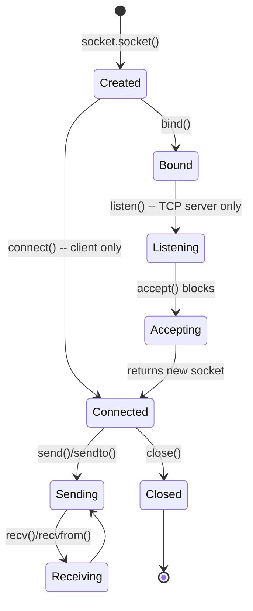
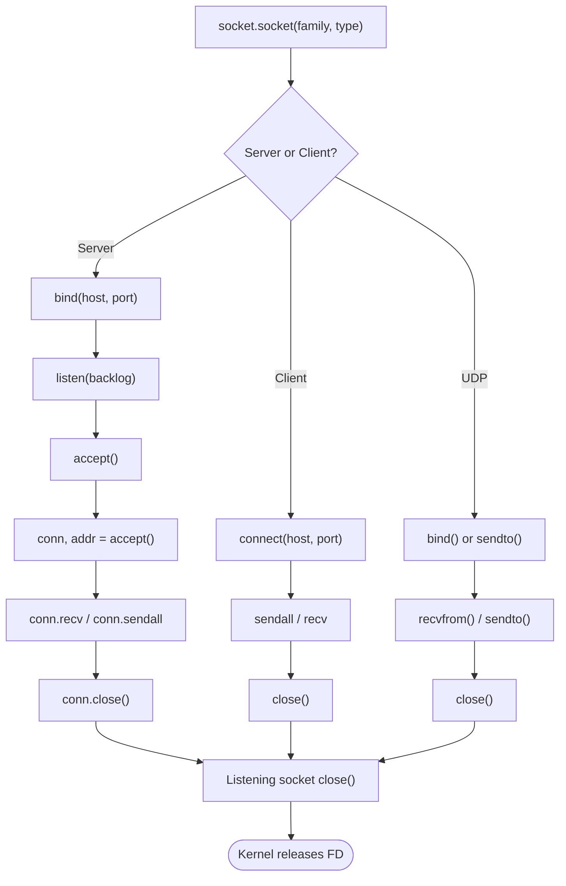
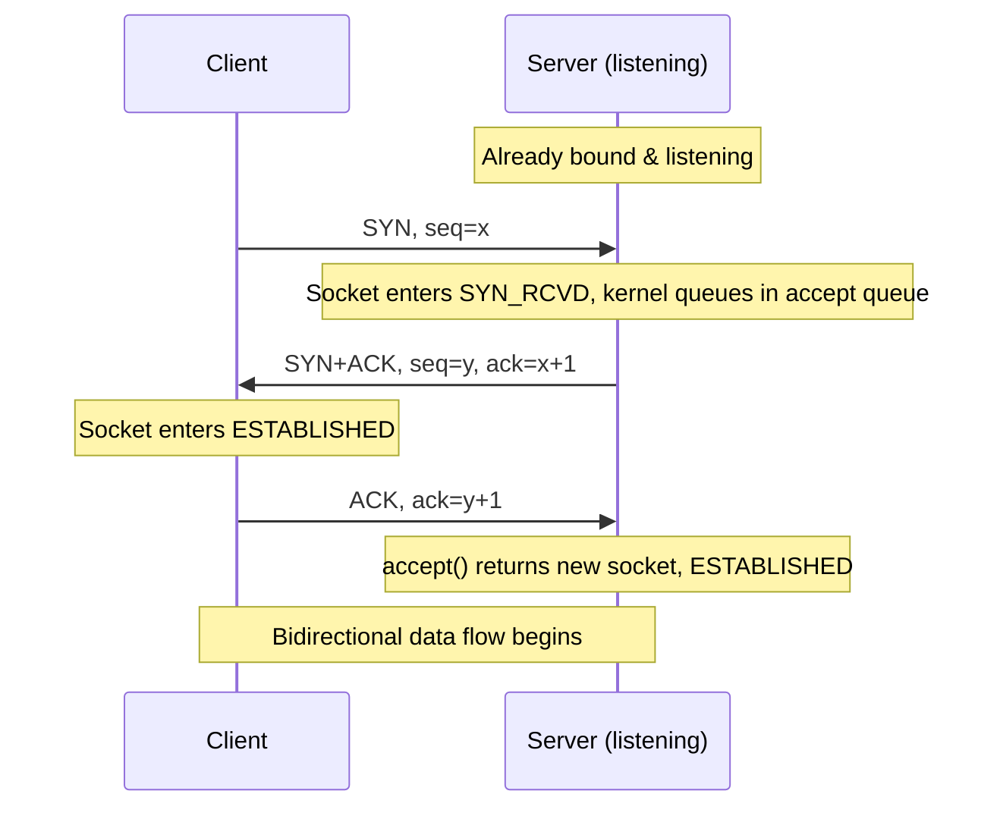

# The `socket` Module — Python's Low-Level Networking Interface

> [!info] Chapter 27 — Networking and Sockets
> This is the first note in the Networking chapter. It establishes the conceptual and API foundation that subsequent notes ([[2. TCP Server and Client]], [[3. UDP Communication]], [[4. Handling Multiple Clients]], [[5. Non-blocking Sockets]], [[6. asyncio Networking]]) build upon.

## Why This Matters

Almost every meaningful Python program eventually talks to something else — a database, a web API, a message queue, another microservice, a browser, a sensor. The libraries you normally reach for (`requests`, `httpx`, `aiohttp`, `redis-py`, `pika`, `websockets`) all sit on top of the same kernel primitive: **the socket**. Understanding `socket` directly gives you three things that high-level libraries obscure:

1. **Mental model clarity** — you stop treating networking as magic and start seeing it as file-descriptor reads/writes mediated by the OS.
2. **Debugging skill** — when an HTTP library returns `ConnectionResetError: [Errno 104] Connection reset by peer`, you understand *why* the kernel produced that, what the TCP state machine was doing, and what to do about it.
3. **Capability** — you can build protocols and tools the high-level libraries do not provide: custom binary protocols, raw ICMP ping tools, Unix domain sockets for IPC, multicast listeners, TCP servers with fine-grained control over `SO_REUSEADDR`, `TCP_NODELAY`, and `SO_KEEPALIVE`.

Python's `socket` module is a thin, faithful wrapper around the BSD sockets API that has been the standard networking interface on Unix-like systems since the 1980s. The same concepts apply in C, Rust, Go, and Java.

## Background — Where Sockets Come From

The BSD sockets API was introduced in 4.2BSD Unix (1983) and is now ubiquitous. A socket is an abstraction: it is a **file descriptor** in the kernel that represents one endpoint of a bidirectional communication channel. The other endpoint can be on the same machine (Unix domain socket, pipe) or on a different machine reachable via a network protocol (IPv4, IPv6).

From Python's perspective, a `socket.socket` object is essentially a wrapper around an integer file descriptor returned by the kernel's `socket(2)` system call. The Python object exposes that descriptor's operations as methods (`bind`, `listen`, `accept`, `connect`, `send`, `recv`, `close`). When you call `s.close()`, Python ultimately invokes `close(2)` on the underlying file descriptor, which the kernel uses to release the socket buffer memory, tear down any TCP connection, and free the port (subject to `TIME_WAIT` semantics — see [[2. TCP Server and Client]]).

The reason this matters is that **everything you know about file descriptors applies to sockets**. You can pass a socket to `select.select()`, you can `dup()` it, you can `os.sendfile()` from one to another, and you can wrap it in a `io.BufferedReader` to get buffered reads.

## Main Content

### 1. The Two Dimensions of a Socket: Family and Type

A socket is identified by two parameters at creation time:

- **Address family** (`socket.AF_*`) — what addressing scheme the socket uses.
- **Socket type** (`socket.SOCK_*`) — what semantics the socket provides (stream vs. datagram vs. raw).

```python
import socket

# IPv4 TCP socket — the most common combination on the internet
s = socket.socket(socket.AF_INET, socket.SOCK_STREAM)

# IPv4 UDP socket — used by DNS, DHCP, video streaming, online games
u = socket.socket(socket.AF_INET, socket.SOCK_DGRAM)

# IPv6 TCP socket — increasingly important as IPv4 exhausts
s6 = socket.socket(socket.AF_INET6, socket.SOCK_STREAM)

# Unix domain socket — local-only, much faster than TCP for IPC
ux = socket.socket(socket.AF_UNIX, socket.SOCK_STREAM)
```

| Family | Address Format | Use Case |
|---|---|---|
| `AF_INET` | `(host:str, port:int)` | IPv4 network communication |
| `AF_INET6` | `(host:str, port:int, flowinfo:int, scope_id:int)` | IPv6 network communication |
| `AF_UNIX` | filesystem path string | Local IPC, much faster than TCP |
| `AF_BLUETOOTH` | Bluetooth-specific | Bluetooth protocols (Linux) |
| `AF_CAN` | Controller Area Network | Embedded automotive / industrial |
| `AF_PACKET` | Link-layer interface index | Raw link-layer access (Linux) |

| Type | Protocol Behaviour | Reliability |
|---|---|---|
| `SOCK_STREAM` | TCP, connection-oriented, byte stream | Reliable, ordered, in-order delivery |
| `SOCK_DGRAM` | UDP, connectionless, datagrams | Unreliable, unordered, message-preserving |
| `SOCK_RAW` | Raw IP packets | Application builds headers itself |
| `SOCK_SEQPACKET` | Sequential packet (rare; SCTP, Unix) | Reliable ordered messages |

You can also pass an explicit `proto` argument (e.g., `socket.IPPROTO_TCP`, `socket.IPPROTO_UDP`), but for `SOCK_STREAM` and `SOCK_DGRAM` Python and the kernel infer the protocol automatically.

### 2. Socket Lifecycle

A socket transitions through several states depending on whether it is on the server side or the client side, and whether it uses TCP or UDP.



The crucial insight for TCP servers: `accept()` returns a **new socket object** distinct from the listening socket. The listening socket continues to accept more connections; the new socket is the dedicated channel for one client.

### 3. The Core Method Catalogue

These are the methods you will use on essentially every socket program. Treat them as vocabulary words; you should be able to recite them in your sleep.

#### Server-side TCP methods

| Method | Purpose |
|---|---|
| `s.bind(address)` | Associates the socket with a local address (`host`, `port`). Required before `listen()` or `recvfrom()`. |
| `s.listen(backlog)` | Marks the socket as passive (willing to accept connections). `backlog` is the maximum number of *pending* (not yet `accept()`-ed) connections the kernel will queue. |
| `s.accept()` | Blocks until a connection arrives, then returns `(conn, addr)` — a *new* socket for this client and the client's address. |

#### Client-side TCP methods

| Method | Purpose |
|---|---|
| `s.connect(address)` | Initiates the TCP three-way handshake to `address`. Blocks until established or fails. |
| `s.connect_ex(address)` | Like `connect()` but returns an errno int instead of raising — useful for port scanners. |

#### Data transfer methods

| Method | Protocol | Notes |
|---|---|---|
| `s.send(bytes)` | TCP | Returns number of bytes actually sent; may be less than requested. |
| `s.sendall(bytes)` | TCP | Repeatedly calls `send()` until all bytes are sent or an error raises. |
| `s.recv(bufsize)` | TCP | Returns up to `bufsize` bytes; returns `b""` on orderly close. |
| `s.sendto(bytes, address)` | UDP | Sends a datagram to `address`; no connection needed. |
| `s.recvfrom(bufsize)` | UDP | Returns `(bytes, address)` so you know who sent it. |

#### Lifecycle methods

| Method | Purpose |
|---|---|
| `s.close()` | Releases the file descriptor. Does **not** guarantee delivery of buffered data; use `shutdown` first if you need that. |
| `s.shutdown(how)` | `how` is `SHUT_RD`, `SHUT_WR`, or `SHUT_RDWR`. Half-closes a TCP connection — typically `SHUT_WR` to signal "I'm done sending, but I'll still read". |
| `s.fileno()` | Returns the underlying integer file descriptor — needed for `select`, `fcntl`, etc. |
| `s.settimeout(seconds)` | Sets a timeout for blocking operations; raises `socket.timeout` on expiry. |
| `s.setblocking(flag)` | `False` puts the socket in non-blocking mode (see [[5. Non-blocking Sockets]]). |
| `s.setsockopt(level, opt, val)` | Sets a protocol-level option (e.g., `SO_REUSEADDR`, `TCP_NODELAY`). |
| `s.getsockopt(level, opt)` | Reads a protocol-level option. |

### 4. A Minimal TCP Echo — The Source Example, Expanded

This is the canonical "first socket program" — a single-connection echo server. Read it carefully; every line teaches something.

```python
import socket

# 1. Create an IPv4 TCP socket.
server_socket = socket.socket(socket.AF_INET, socket.SOCK_STREAM)

# 2. Allow rapid restart of the server without "Address already in use".
server_socket.setsockopt(socket.SOL_SOCKET, socket.SO_REUSEADDR, 1)

# 3. Bind to localhost:8080. The empty-string host means "all interfaces".
server_socket.bind(("127.0.0.1", 8080))

# 4. Listen with a backlog of 5 — kernel will queue up to 5 pending
#    connections that have not yet been accept()-ed.
server_socket.listen(5)
print("Server listening on port 8080...")

while True:
    # 5. accept() blocks until a client connects.
    client_socket, addr = server_socket.accept()
    print(f"Connection from {addr}")

    # 6. recv() blocks until at least one byte arrives. Returns b"" if the
    #    peer closed the connection cleanly.
    data = client_socket.recv(1024)
    if not data:
        client_socket.close()
        continue

    print(f"Received: {data.decode('utf-8', errors='replace')}")

    # 7. sendall() guarantees all bytes are sent (or raises).
    client_socket.sendall(b"Hello from server!")

    # 8. Always close. The kernel will eventually reap the descriptor.
    client_socket.close()
```

> [!warning] `recv(1024)` does *not* mean "give me 1024 bytes"
> `recv(bufsize)` returns **up to** `bufsize` bytes. If the peer sent 4 bytes and you call `recv(1024)`, you get 4 bytes. If the peer sent 8000 bytes and you call `recv(1024)`, you get 1024 bytes and must call `recv(1024)` again to get the next chunk. There is no message boundary in TCP — see the section "TCP is a byte stream, not a message protocol" below.

The matching client:

```python
import socket

client_socket = socket.socket(socket.AF_INET, socket.SOCK_STREAM)
client_socket.connect(("127.0.0.1", 8080))
client_socket.sendall(b"Hello Server!")
response = client_socket.recv(1024)
print("Server response:", response.decode("utf-8"))
client_socket.close()
```

### 5. UDP — Connectionless, Message-Preserving

UDP does not `connect()`, `listen()`, or `accept()`. Each `sendto()` is independent and carries the destination address.

```python
import socket

# Server
udp_server = socket.socket(socket.AF_INET, socket.SOCK_DGRAM)
udp_server.bind(("127.0.0.1", 8080))
print("UDP Server listening on port 8080...")

while True:
    data, addr = udp_server.recvfrom(1024)   # returns (bytes, addr)
    print(f"Received {data!r} from {addr}")
    udp_server.sendto(b"Hello UDP Client!", addr)
```

```python
import socket

# Client
udp_client = socket.socket(socket.AF_INET, socket.SOCK_DGRAM)
udp_client.sendto(b"Hello UDP Server!", ("127.0.0.1", 8080))
response, _ = udp_client.recvfrom(1024)
print("Server response:", response.decode())
udp_client.close()
```

UDP gives you a hard guarantee TCP does not: **each `recvfrom` returns exactly the bytes from one `sendto` call**. There are message boundaries. There is also no guarantee of delivery, ordering, or uniqueness — UDP may drop, duplicate, or reorder packets freely.

### 6. Sockets Are File Objects

A socket is a file descriptor, and Python lets you convert it into a file-like object with `socket.makefile()`. This is invaluable when you want to use `for line in sock_file:` or `.readline()`.

```python
import socket

s = socket.socket()
s.connect(("example.com", 80))
s.sendall(b"GET / HTTP/1.0\r\nHost: example.com\r\n\r\n")

f = s.makefile("r", encoding="utf-8", newline="\r\n")
for line in f:
    print(line.rstrip())
s.close()
```

The downside: `makefile` always buffers, which interacts badly with `select()`. Use it only for line- or text-oriented protocols when you are not doing event-driven I/O.

### 7. Address Resolution: `getaddrinfo`

Hardcoding `"127.0.0.1"` is fine for tests, but production code must handle IPv4, IPv6, hostnames, and DNS. The correct primitive is `socket.getaddrinfo()`, which returns a list of `(family, type, proto, canonname, sockaddr)` tuples for a given host/port.

```python
import socket

# Get all candidate addresses for example.com:80
for info in socket.getaddrinfo("example.com", 80, proto=socket.IPPROTO_TCP):
    family, socktype, proto, canonname, sockaddr = info
    print(f"{family=} {socktype=} {sockaddr=}")
```

The idiomatic "connect to whatever the OS resolves first" pattern:

```python
import socket

def connect_to(host: str, port: int) -> socket.socket:
    for family, socktype, proto, _, sockaddr in socket.getaddrinfo(
        host, port, proto=socket.IPPROTO_TCP
    ):
        try:
            s = socket.socket(family, socktype, proto)
            s.connect(sockaddr)
            return s
        except OSError:
            s.close()
    raise ConnectionError(f"could not connect to {host}:{port}")
```

### 8. Common Socket Options

`setsockopt` / `getsockopt` configure the kernel's behaviour for a socket. The most common options:

| Option (level) | Effect |
|---|---|
| `SO_REUSEADDR` (`SOL_SOCKET`) | Allows `bind()` to a port still in `TIME_WAIT`. Critical for servers that restart. |
| `SO_REUSEPORT` (`SOL_SOCKET`) | Allows multiple sockets to bind the same port — used by load-balancing workers. |
| `SO_KEEPALIVE` (`SOL_SOCKET`) | Enables TCP keepalive probes — detect dead peers. |
| `SO_RCVBUF` / `SO_SNDBUF` (`SOL_SOCKET`) | Sets receive / send buffer sizes in bytes. |
| `TCP_NODELAY` (`IPPROTO_TCP`) | Disables Nagle's algorithm — sends small writes immediately. Critical for latency-sensitive protocols (e.g., Redis, SSH). |
| `TCP_QUICKACK` (`IPPROTO_TCP`, Linux) | Suppresses the delayed ACK heuristic. |
| `SO_LINGER` (`SOL_SOCKET`) | Controls what happens to unsent data on `close()`. |
| `IP_TTL` (`IPPROTO_IP`) | Sets the Time-To-Live for outgoing packets. |

Example — a low-latency TCP server:

```python
import socket

s = socket.socket(socket.AF_INET, socket.SOCK_STREAM)
s.setsockopt(socket.SOL_SOCKET, socket.SO_REUSEADDR, 1)
s.bind(("0.0.0.0", 8080))
s.listen(128)

conn, _ = s.accept()
conn.setsockopt(socket.IPPROTO_TCP, socket.TCP_NODELAY, 1)  # disable Nagle
```

### 9. Exception Handling

The `socket` module raises `OSError` (or its subclass `socket.error`, which since Python 3.3 *is* `OSError`) for almost every failure. Specific subclasses you will encounter:

- `ConnectionRefusedError` — server not listening on the port.
- `ConnectionResetError` — peer sent an RST.
- `ConnectionAbortedError` — connection aborted by software.
- `BrokenPipeError` — writing to a socket whose read end is closed.
- `socket.timeout` — a `settimeout()` deadline expired (subclass of `OSError`).
- `socket.gaierror` — DNS lookup failed.
- `socket.herror` — host-related error.

Always use `try/finally` or a context manager to guarantee `close()`. Better yet, use the context-manager protocol — `socket.socket` supports `with`:

```python
import socket

with socket.socket(socket.AF_INET, socket.SOCK_STREAM) as s:
    s.settimeout(5.0)
    try:
        s.connect(("invalid.host.example", 8080))
    except (socket.gaierror, ConnectionRefusedError, socket.timeout) as e:
        print(f"Socket error: {e}")
    # socket is auto-closed when the with block exits, even on exception
```

### 10. The `socket` Module's Other Useful Functions

Beyond the `socket` class, the module exposes:

- `socket.gethostname()` — local hostname.
- `socket.gethostbyname(name)` — IPv4 address for a hostname (single).
- `socket.gethostbyname_ex(name)` — full record including aliases and all addresses.
- `socket.getfqdn([name])` — fully qualified domain name.
- `socket.getservbyname(name)` / `getservbyport(port)` — convert between service names and ports.
- `socket.htons(x)` / `ntohs(x)` — byte-order conversions for network protocols.
- `socket.inet_aton(str)` / `inet_ntoa(bytes)` — IPv4 address <-> packed bytes.
- `socket.inet_pton(family, str)` / `inet_ntop(family, bytes)` — IPv4 or IPv6 address <-> packed bytes.

### 11. Mermaid — Socket Lifecycle in Detail



### 12. Mermaid — The TCP Three-Way Handshake



## Code Examples

### A robust TCP probe — port scanner with `connect_ex`

```python
import socket
import time
from concurrent.futures import ThreadPoolExecutor

def probe(host: str, port: int, timeout: float = 1.0) -> bool:
    """Return True if `host:port` accepts TCP connections."""
    with socket.socket(socket.AF_INET, socket.SOCK_STREAM) as s:
        s.settimeout(timeout)
        # connect_ex returns 0 on success, errno otherwise (no exception).
        return s.connect_ex((host, port)) == 0

def scan(host: str, ports: range, workers: int = 100) -> list[int]:
    with ThreadPoolExecutor(max_workers=workers) as pool:
        results = list(pool.map(lambda p: (p, probe(host, p)), ports))
    return [p for p, open_ in results if open_]

if __name__ == "__main__":
    open_ports = scan("scanme.nmap.org", range(20, 100))
    print(f"Open ports: {open_ports}")
```

### A Unix domain socket echo server

```python
import socket, os, threading

PATH = "/tmp/echo.sock"
if os.path.exists(PATH):
    os.unlink(PATH)

with socket.socket(socket.AF_UNIX, socket.SOCK_STREAM) as srv:
    srv.bind(PATH)
    srv.listen(5)
    print(f"Listening on {PATH}")
    while True:
        conn, _ = srv.accept()
        threading.Thread(target=lambda c: (
            c.sendall(c.recv(4096)), c.close()
        ), args=(conn,)).start()
```

Unix domain sockets skip the network stack entirely. They are dramatically faster than TCP for local IPC and are how Docker, Postgres, and many daemons expose their control plane.

## Common Pitfalls

> [!danger] Forgetting `SO_REUSEADDR`
> If you restart a TCP server, you often get `OSError: [Errno 98] Address already in use`. The previous socket is in `TIME_WAIT` (a TCP state that lingers for ~60 seconds to absorb stray packets). Setting `SO_REUSEADDR` before `bind()` lets the new socket reuse the port.

> [!danger] Assuming `recv(bufsize)` returns a complete message
> TCP gives you a **byte stream**, not messages. If the client calls `sendall(b"Hello")` then `sendall(b"World")`, the server might receive `b"HelloWorld"` in one `recv()`, or `b"H"` and then `b"elloWorld"`, or any other split. You must define your own message framing — length-prefix, delimiter, or fixed-width.

> [!danger] Not handling `b""` from `recv()`
> When the peer closes the connection cleanly, `recv()` returns an empty bytes object. If your loop ignores this, you get an infinite spin consuming 100% CPU. Always check `if not data: break`.

> [!danger] Mixing blocking sockets and signals
> A blocking `recv()` can be interrupted by a signal, raising `InterruptedError` (Python 3.5+ auto-retries per PEP 475, but third-party C extensions can still expose it). Be prepared.

> [!danger] Forgetting to close sockets on error paths
> If you create a socket but raise before `close()`, you leak a file descriptor. Use `with socket.socket(...) as s:` or `try/finally`.

> [!danger] Encoding binary protocols as UTF-8
> If you are speaking a binary protocol, do not call `.decode()` or `.encode()` — work in `bytes` directly. UTF-8 decoding corrupts non-UTF-8 byte sequences.

> [!danger] Trusting `gethostbyname` to give all addresses
> `gethostbyname` returns a single IPv4. Use `getaddrinfo` for robust, dual-stack resolution.

## Tips and Tricks

- **Use `sendall`, not `send`.** The single common case where `send` returns less than the full length breaks code in subtle ways.
- **`settimeout()` is the simplest form of non-blocking I/O.** If you only need timeouts, this is far simpler than `select`.
- **For high-throughput servers, prefer `asyncio` or `selectors`** over thread-per-connection — see [[5. Non-blocking Sockets]] and [[6. asyncio Networking]].
- **`socket.fromfd(fd, family, type)`** lets you wrap a file descriptor obtained from elsewhere (e.g., inherited from a parent process via `socket.socketshare()` or systemd socket activation).
- **`socket.socketpair()`** creates two connected sockets — invaluable for IPC between a parent and child process or for waking up `select()` from another thread.
- **For local IPC, Unix domain sockets are 2–10× faster than TCP.** Always prefer them when both sides are on the same host.
- **`SO_REUSEPORT` (Linux 3.9+)** allows multiple processes to bind the same port and the kernel will load-balance incoming connections across them. This is how nginx and modern workers scale.
- **For latency-sensitive workloads, set `TCP_NODELAY` on both ends.** Nagle's algorithm otherwise batches small writes, adding up to 40 ms of latency.
- **Wrap socket reads in a generator** for clean line-oriented parsing:

```python
def read_lines(sock: socket.socket) -> Iterator[str]:
    buffer = b""
    while True:
        chunk = sock.recv(4096)
        if not chunk:
            if buffer:
                yield buffer.decode("utf-8", "replace")
            return
        buffer += chunk
        while b"\n" in buffer:
            line, buffer = buffer.split(b"\n", 1)
            yield line.decode("utf-8", "replace")
```

## Active Recall

> [!question] The `socket` module in Python only supports communication via the TCP protocol.
>> [!success]- Answer
>> **False.** The `socket` module supports TCP (`SOCK_STREAM`), UDP (`SOCK_DGRAM`), raw sockets (`SOCK_RAW`), and Unix domain sockets (`AF_UNIX`). TCP is one option among many.

> [!question] `socket.AF_INET` is the constant used to specify the IPv4 address family when creating a socket.
>> [!success]- Answer
>> **True.** `AF_INET` selects IPv4; `AF_INET6` selects IPv6; `AF_UNIX` selects local Unix-domain IPC.

> [!question] `socket.SOCK_STREAM` indicates that a UDP socket should be created.
>> [!success]- Answer
>> **False.** `SOCK_STREAM` creates a TCP (connection-oriented, reliable byte stream) socket. UDP uses `SOCK_DGRAM`.

> [!question] The `bind()` method is used by a TCP server to start listening for incoming connections.
>> [!success]- Answer
>> **False.** `bind()` associates the socket with a local address. The method that starts listening is `listen()` — it must be called after `bind()` and before `accept()`.

> [!question] The `listen()` method in a TCP server specifies the maximum number of connections that can be queued before refusing new ones.
>> [!success]- Answer
>> **True.** The argument to `listen()` is the `backlog` — the maximum number of pending (not yet `accept()`-ed) connections the kernel will queue before it starts refusing or silently dropping new SYNs.

> [!question] The `connect()` method is typically called on the client-side socket to establish a TCP connection with a server.
>> [!success]- Answer
>> **True.** TCP clients call `connect()` to initiate the three-way handshake. UDP clients can also call `connect()` but it only fixes the default peer — no packets are exchanged.

> [!question] UDP, often used with `socket.SOCK_DGRAM`, is a connection-oriented protocol ensuring guaranteed delivery.
>> [!success]- Answer
>> **False.** UDP is **connectionless** and provides **no delivery guarantees**. Datagrams may be lost, duplicated, or arrive out of order.

> [!question] The `recvfrom()` method is the standard way to receive data on a connected TCP socket.
>> [!success]- Answer
>> **False.** `recvfrom()` is for UDP — it returns `(bytes, address)` so the caller knows the sender. TCP sockets use `recv()`; the sender address is already known because the socket is connected.

> [!question] Using threads is a common technique to allow a server to handle multiple client connections concurrently.
>> [!success]- Answer
>> **True.** Each accepted connection is handed to a new thread that handles it independently. See [[4. Handling Multiple Clients]] for alternatives (process-per-connection, thread pools, `select`, `asyncio`).

> [!question] By default, Python sockets operate in non-blocking mode, meaning calls like `recv()` return immediately even if no data is available.
>> [!success]- Answer
>> **False.** By default, sockets are **blocking**. To make a socket non-blocking, you must call `sock.setblocking(False)` or `sock.settimeout(0)`. In non-blocking mode, `recv()` raises `BlockingIOError` if no data is ready.

## Additional Self-Quiz

> [!question] Why does `accept()` return a *new* socket rather than reusing the listening socket?
>> [!success]- Answer
>> The listening socket exists to *accept* connections; the new socket exists to *carry data* for one specific client. If `accept` reused the listening socket, the server could only serve one client at a time.

> [!question] What is the difference between `send()` and `sendall()`?
>> [!success]- Answer
>> `send()` returns the number of bytes actually written (which can be less than requested). `sendall()` repeatedly calls `send()` until all bytes are written or an exception is raised. Use `sendall()` unless you have a specific reason not to.

> [!question] What does `recv()` return when the peer closes the connection?
>> [!success]- Answer
>> An empty bytes object `b""`. This is distinct from "no data yet" (which would block in blocking mode, or raise `BlockingIOError` in non-blocking mode).

> [!question] What does `SO_REUSEADDR` do and why is it essential for TCP servers?
>> [!success]- Answer
>> It allows a socket to bind to a port that still has a previous connection in the `TIME_WAIT` state. Without it, restarting a server within ~60 seconds of stopping it fails with "Address already in use".

> [!question] Name three differences between TCP and UDP at the socket API level.
>> [!success]- Answer
>> (1) TCP uses `listen`, `accept`, `connect`; UDP does not. (2) TCP uses `send`/`recv`; UDP uses `sendto`/`recvfrom`. (3) TCP provides a byte stream (no message boundaries); UDP preserves datagram boundaries.

## Next Steps

- Continue to [[2. TCP Server and Client]] for a deep dive into the full TCP server-client lifecycle, including `SO_REUSEADDR`, multi-threaded echo servers, half-close with `shutdown`, and proper clean-up.
- Then [[3. UDP Communication]] for connectionless messaging, multicast, broadcast, and when to choose UDP.
- Then [[4. Handling Multiple Clients]] for thread-per-connection, process-per-connection, thread pools, and a preview of `select`.
- Then [[5. Non-blocking Sockets]] for the C10K problem, `select`, `poll`, `epoll`, and the `selectors` module.
- Then [[6. asyncio Networking]] for the modern high-level approach using `asyncio.start_server` and stream readers/writers.
- Cross-reference [[14. Concurrency/1. Processes vs Threads vs Coroutines]] for the broader concurrency model that underlies socket server design.
- Cross-reference [[5. Error Handling/2. raise and Custom Exceptions]] for designing your own networking exception hierarchy on top of `OSError`.
