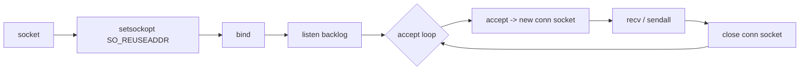
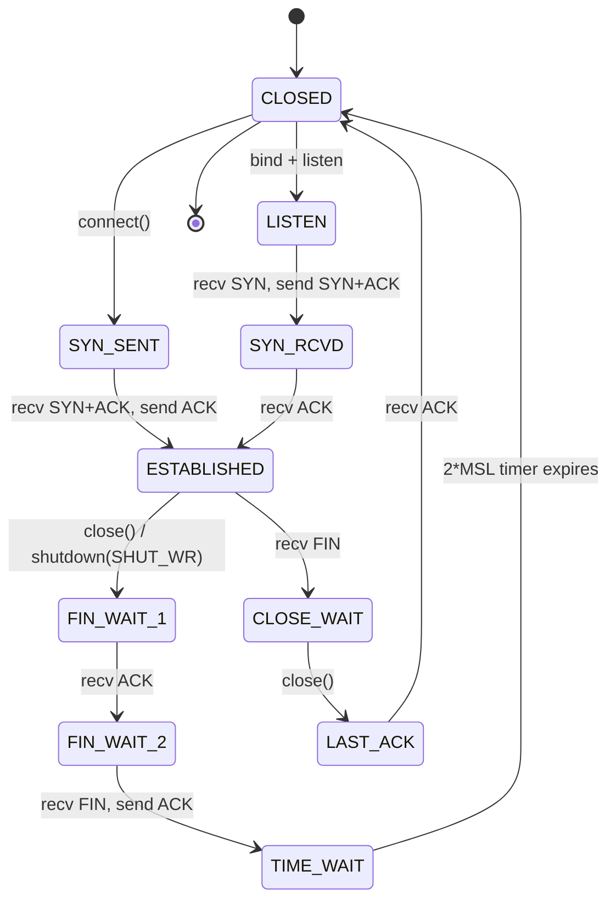
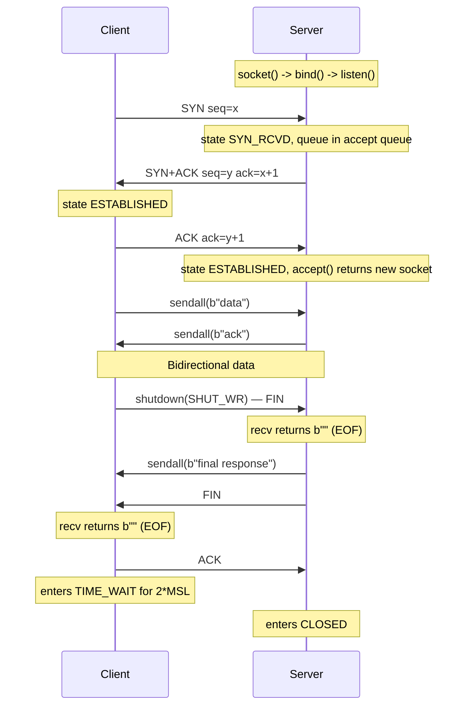

# TCP Server and Client — Building Reliable Networked Programs

> [!info] Chapter 27 — Networking and Sockets, Note 2
> Builds directly on [[1. The socket Module]]. Future notes ([[3. UDP Communication]], [[4. Handling Multiple Clients]], [[5. Non-blocking Sockets]], [[6. asyncio Networking]]) expand into other protocol choices and concurrency models.

## Why This Matters

TCP (Transmission Control Protocol) is the workhorse of the internet. HTTP, HTTPS, SMTP, IMAP, SSH, FTP, Redis, Postgres, MySQL, gRPC, and WebSocket are all built on top of TCP. When you write a TCP server and client in raw Python, you are reconstructing the same primitives that every one of those protocols depends on — and learning what the high-level libraries hide from you.

Concrete reasons to write raw TCP servers:

- **Custom binary or text protocols** that do not fit HTTP's request/response model — telemetry, gaming servers, IoT sensor streams, chat protocols.
- **Performance-critical infrastructure** where avoiding HTTP overhead matters — Redis, Memcached, and SSH all speak custom TCP protocols.
- **Educational insight** — you understand exactly what `requests.get()` does when it raises `ConnectionRefusedError` or `ConnectionResetError`.
- **Embedded systems** — many microcontrollers expose a raw TCP control port, and Python is a great language for the controlling host.

This note covers the complete TCP server-client lifecycle, from the first `socket()` call to graceful shutdown, with attention to the kernel-level details that bite you in production.

## Background — TCP as a Protocol

TCP is a **connection-oriented, reliable, ordered, byte-stream** protocol. Each property has practical consequences:

- **Connection-oriented** — before data flows, the two endpoints must complete a three-way handshake (SYN, SYN+ACK, ACK). The handshake takes one round-trip time (RTT), so the first byte sent over a fresh TCP connection is delayed by that RTT.
- **Reliable** — every byte sent must be acknowledged by the receiver. Unacknowledged bytes are retransmitted after a timeout. The receiver also validates a checksum; corrupt segments are silently dropped (forcing retransmission).
- **Ordered** — bytes arrive in the order they were sent, even if underlying IP packets arrived out of order. The receiver reassembles using sequence numbers.
- **Byte-stream** — there are no message boundaries. A single `send()` may arrive as multiple `recv()` calls, and multiple `send()` calls may be coalesced into a single `recv()`. **Application-level message framing is your responsibility.**

TCP is implemented in the kernel, not in user space. When you call `socket.send()`, you are asking the kernel to copy bytes from user space into the kernel's socket send buffer; the kernel then transmits them according to TCP's congestion control, sliding window, and retransmission algorithms.

## Main Content

### 1. The Server Lifecycle

A TCP server goes through five phases:

1. **Create** — `socket.socket(AF_INET, SOCK_STREAM)`.
2. **Configure** — set socket options like `SO_REUSEADDR` *before* `bind`.
3. **Bind** — `s.bind((host, port))` associates the socket with a local address.
4. **Listen** — `s.listen(backlog)` marks the socket as passive and sets the accept queue size.
5. **Accept loop** — repeatedly call `s.accept()`, which returns a new connected socket for each client.



#### The `bind` address

The host string controls which network interfaces the server listens on:

| `bind` host | Effect |
|---|---|
| `"127.0.0.1"` | Loopback only — not reachable from other machines. |
| `"0.0.0.0"` (or `""`) | All IPv4 interfaces — reachable from the network. |
| `"::"` | All IPv6 interfaces (and often all IPv4 too, depending on the `IPV6_V6ONLY` setting). |
| A specific IP | Only that interface. |

> [!warning] Binding to `0.0.0.0` on a cloud VM exposes your service to the internet.
> Always run a firewall (AWS security groups, `ufw`, `iptables`) — do not rely on the application for security.

#### The `listen` backlog

`listen(backlog)` sets the maximum number of *pending* connections — TCP connections that have completed the three-way handshake but have not yet been returned to the application by `accept()`. Once the queue is full, the kernel will silently drop new SYNs (or, on some systems, send an RST).

- A small backlog (e.g., `5`) is fine for low-traffic servers.
- Production servers use `128` or higher.
- On Linux, the effective backlog is `min(backlog, net.core.somaxconn)` (sysctl) — the kernel silently caps it. Modern Linux defaults to `4096`; older systems used `128`.
- `socket.SOMAXCONN` is the platform's compile-time maximum.

```python
server_socket.listen(socket.SOMAXCONN)  # use the maximum the OS allows
```

### 2. The Client Lifecycle

A TCP client is simpler:

1. **Create** the socket.
2. **(Optional)** Configure timeouts and options.
3. **Connect** — `s.connect((host, port))` performs the three-way handshake synchronously.
4. **Exchange data** — `sendall` / `recv` in whatever protocol the application defines.
5. **Close**.

```python
import socket

with socket.socket(socket.AF_INET, socket.SOCK_STREAM) as s:
    s.settimeout(10.0)
    s.connect(("example.com", 80))
    s.sendall(b"GET / HTTP/1.0\r\nHost: example.com\r\nConnection: close\r\n\r\n")
    chunks = []
    while True:
        data = s.recv(4096)
        if not data:
            break
        chunks.append(data)
    response = b"".join(chunks)
    print(response.decode("utf-8", errors="replace"))
```

### 3. `SO_REUSEADDR` — Why You Need It

When a TCP server closes a connection, the socket enters `TIME_WAIT` for ~60 seconds (typically 2 × MSL = 2 × 60s = 120s, but tunable). During `TIME_WAIT`, the kernel keeps the port reserved so that any stray delayed packets from the old connection cannot be misinterpreted as belonging to a new connection that happens to reuse the port.

Without `SO_REUSEADDR`, calling `bind()` on the same port immediately after a server crash or restart fails with `OSError: [Errno 98] Address already in use`. With it, the kernel allows the new socket to take over the port even though it has connections in `TIME_WAIT`.

```python
server_socket.setsockopt(socket.SOL_SOCKET, socket.SO_REUSEADDR, 1)
server_socket.bind((host, port))
```

> [!note] Always set `SO_REUSEADDR` *before* `bind()`.
> Once `bind()` has succeeded, changing the option has no effect — the kernel has already decided whether the bind is permitted.

There is also `SO_REUSEPORT` (Linux 3.9+, macOS 10.10+), which is stronger: multiple sockets can bind the *same* port simultaneously, and the kernel load-balances incoming connections across them. This is how nginx and modern multi-process workers achieve horizontal scaling on a single port.

### 4. A Complete Multi-Threaded Echo Server

This is the canonical "production-ready" TCP echo server. It includes error handling, graceful shutdown, and one thread per client.

```python
import socket
import threading
import logging

logging.basicConfig(level=logging.INFO, format="%(asctime)s %(threadName)s %(message)s")
HOST = "127.0.0.1"
PORT = 8080
SHUTDOWN = threading.Event()


def handle_client(conn: socket.socket, addr: tuple) -> None:
    """Echo back whatever the client sends, until they close or send 'quit'."""
    logging.info(f"Connection opened from {addr}")
    conn.settimeout(30.0)  # protect against slow/dead clients
    try:
        with conn:
            while True:
                try:
                    data = conn.recv(4096)
                except socket.timeout:
                    logging.warning(f"Timeout on {addr}, closing")
                    return
                if not data:
                    return
                if data.strip().lower() == b"quit":
                    conn.sendall(b"bye\n")
                    return
                conn.sendall(data)  # echo back
    except ConnectionResetError:
        logging.warning(f"Connection reset by {addr}")
    except OSError as e:
        logging.exception(f"Socket error from {addr}: {e}")
    finally:
        logging.info(f"Connection closed from {addr}")


def serve() -> None:
    with socket.socket(socket.AF_INET, socket.SOCK_STREAM) as srv:
        srv.setsockopt(socket.SOL_SOCKET, socket.SO_REUSEADDR, 1)
        srv.bind((HOST, PORT))
        srv.listen(128)
        srv.settimeout(1.0)  # so accept() can periodically check SHUTDOWN
        logging.info(f"Listening on {HOST}:{PORT}")
        while not SHUTDOWN.is_set():
            try:
                conn, addr = srv.accept()
            except socket.timeout:
                continue
            t = threading.Thread(target=handle_client, args=(conn, addr), daemon=True)
            t.start()
        logging.info("Server shutting down")


if __name__ == "__main__":
    try:
        serve()
    except KeyboardInterrupt:
        SHUTDOWN.set()
        logging.info("Received Ctrl-C, stopping...")
```

Key design points:

- **`with conn:` and `with srv:`** guarantee that sockets are closed even on exceptions.
- **`daemon=True`** threads do not block process exit.
- **`settimeout(30.0)` per connection** prevents a misbehaving client from holding a thread forever.
- **`srv.settimeout(1.0)`** lets the accept loop wake up periodically to check the shutdown flag — a simple alternative to `select`.
- **`SO_REUSEADDR`** is set before `bind`.
- **`listen(128)`** gives the kernel a healthy accept queue.

### 5. The Matching Echo Client

```python
import socket
import sys

def echo(host: str, port: int, message: str) -> str:
    with socket.socket(socket.AF_INET, socket.SOCK_STREAM) as s:
        s.settimeout(10.0)
        s.connect((host, port))
        s.sendall(message.encode("utf-8"))
        # Shut down the write side so the server knows we're done sending.
        s.shutdown(socket.SHUT_WR)
        chunks = []
        while True:
            data = s.recv(4096)
            if not data:
                break
            chunks.append(data)
        return b"".join(chunks).decode("utf-8", errors="replace")


if __name__ == "__main__":
    msg = sys.argv[1] if len(sys.argv) > 1 else "Hello, server!"
    print(echo("127.0.0.1", 8080, msg))
```

The `shutdown(SHUT_WR)` call signals to the server that no more data will be sent, while keeping the read direction open. This is the canonical "half-close" pattern and lets the server drain its response cleanly.

### 6. Message Framing — The Most Common TCP Bug

TCP gives you a byte stream, not messages. If you want messages, you must frame them yourself. Three common strategies:

#### Length-prefix framing

Each message is prefixed with its length as a fixed-width binary integer.

```python
import struct

def send_msg(sock: socket.socket, msg: bytes) -> None:
    # Prefix with a 4-byte big-endian length, then send the message.
    sock.sendall(struct.pack(">I", len(msg)) + msg)

def recv_msg(sock: socket.socket) -> bytes | None:
    # Read 4 bytes for the length.
    raw_len = recv_exactly(sock, 4)
    if not raw_len:
        return None
    (msg_len,) = struct.unpack(">I", raw_len)
    return recv_exactly(sock, msg_len)

def recv_exactly(sock: socket.socket, n: int) -> bytes | None:
    """Read exactly n bytes, or None if the connection closed cleanly."""
    chunks = []
    remaining = n
    while remaining > 0:
        chunk = sock.recv(remaining)
        if not chunk:
            return None
        chunks.append(chunk)
        remaining -= len(chunk)
    return b"".join(chunks)
```

#### Delimiter-based framing

Each message ends with a known byte sequence (e.g., `\n` for line-oriented protocols like Redis RESP, SMTP, HTTP/1.1 headers).

```python
def recv_line(sock: socket.socket, max_len: int = 8192) -> str | None:
    buffer = b""
    while b"\n" not in buffer:
        if len(buffer) >= max_len:
            raise ValueError("line too long")
        chunk = sock.recv(1024)
        if not chunk:
            return None
        buffer += chunk
    line, _, leftover = buffer.partition(b"\n")
    return line.decode("utf-8")
```

This pattern "leaks" leftover bytes into the next call — in real code you would attach the leftover buffer to a per-connection state object.

#### Fixed-width framing

Each message is exactly N bytes. Simple but wasteful. Used by some binary financial protocols.

### 7. Half-Close with `shutdown`

TCP allows closing one direction of the stream while keeping the other open. This is called a **half-close**.

- `shutdown(SHUT_WR)` — "I'm done sending. You can keep sending to me."
- `shutdown(SHUT_RD)` — "I'm done reading. Discard incoming data."
- `shutdown(SHUT_RDWR)` — close both directions immediately.

Half-close is essential for protocols where one side knows it is done sending but must continue receiving — for example, an HTTP/1.0 client that sends a request and then closes its write end so the server knows it can finish its response and close.

> [!warning] `close()` is not the same as `shutdown()`.
> `close()` releases the file descriptor. If this is the last reference, the kernel begins tearing down the connection — but **any data still in the send buffer may be lost** if `SO_LINGER` is set to zero, or it may be delivered in the background. `shutdown(SHUT_WR)` followed by reading until EOF, *then* `close()`, is the only way to be sure all data was delivered.

### 8. The TCP State Machine

For debugging mysterious networking behaviour, you need to know the TCP states. The most important ones from a Python developer's perspective:



The states that bite you:

- **`TIME_WAIT`** — the side that *initiated* the close lingers for ~60 seconds. This is what causes "Address already in use" without `SO_REUSEADDR`.
- **`CLOSE_WAIT`** — the side that *received* the close is waiting for the application to call `close()`. A pile of `CLOSE_WAIT` sockets on a server indicates a bug: the application is not closing sockets after the peer disconnects (often because it never reads `b""` from `recv`).

### 9. Mermaid — TCP Server-Client Handshake and First Exchange



## Code Examples

### A length-prefixed JSON-RPC server

A realistic microprotocol: each request and response is a JSON object prefixed with a 4-byte big-endian length. This is the framing used by Language Server Protocol (LSP), Minecraft server protocols, and many others.

```python
import socket, struct, json, threading

def recv_exactly(sock: socket.socket, n: int) -> bytes:
    buf = bytearray()
    while len(buf) < n:
        chunk = sock.recv(n - len(buf))
        if not chunk:
            raise ConnectionError("socket closed mid-message")
        buf.extend(chunk)
    return bytes(buf)

def recv_msg(sock: socket.socket) -> dict:
    raw_len = recv_exactly(sock, 4)
    (length,) = struct.unpack(">I", raw_len)
    return json.loads(recv_exactly(sock, length))

def send_msg(sock: socket.socket, obj: dict) -> None:
    payload = json.dumps(obj).encode("utf-8")
    sock.sendall(struct.pack(">I", len(payload)) + payload)

def handle(conn: socket.socket) -> None:
    with conn:
        try:
            while True:
                req = recv_msg(conn)
                method = req.get("method")
                if method == "add":
                    result = req["a"] + req["b"]
                elif method == "upper":
                    result = req["s"].upper()
                else:
                    result = {"error": f"unknown method {method!r}"}
                send_msg(conn, {"id": req.get("id"), "result": result})
        except (ConnectionError, json.JSONDecodeError):
            pass

def serve(host: str = "127.0.0.1", port: int = 9000) -> None:
    with socket.socket(socket.AF_INET, socket.SOCK_STREAM) as srv:
        srv.setsockopt(socket.SOL_SOCKET, socket.SO_REUSEADDR, 1)
        srv.bind((host, port))
        srv.listen(128)
        print(f"JSON-RPC server on {host}:{port}")
        while True:
            conn, _ = srv.accept()
            threading.Thread(target=handle, args=(conn,), daemon=True).start()

if __name__ == "__main__":
    serve()
```

```python
# Client
import socket, struct, json

# (re-use recv_msg, send_msg from server code)

def call(host: str, port: int, req: dict) -> dict:
    with socket.socket(socket.AF_INET, socket.SOCK_STREAM) as s:
        s.connect((host, port))
        send_msg(s, req)
        return recv_msg(s)

if __name__ == "__main__":
    print(call("127.0.0.1", 9000, {"id": 1, "method": "add", "a": 3, "b": 4}))
    print(call("127.0.0.1", 9000, {"id": 2, "method": "upper", "s": "hello"}))
```

### Graceful shutdown with `shutdown` and `SO_LINGER`

```python
import socket

def send_and_close(host: str, port: int, payload: bytes) -> None:
    with socket.socket(socket.AF_INET, socket.SOCK_STREAM) as s:
        s.connect((host, port))
        s.sendall(payload)
        # Signal we are done sending — server can finish and close.
        s.shutdown(socket.SHUT_WR)
        # Drain any final response from the server.
        while s.recv(4096):
            pass
        # close() now finds no pending data and the connection closes cleanly.
```

### Connecting with a deadline — using `socket.create_connection`

`socket.create_connection` is a higher-level helper that resolves the address with `getaddrinfo` and tries each candidate in turn. It also accepts a timeout.

```python
import socket

try:
    s = socket.create_connection(("example.com", 80), timeout=5.0)
except (socket.timeout, ConnectionRefusedError, socket.gaierror) as e:
    print(f"Could not connect: {e}")
else:
    with s:
        s.sendall(b"HEAD / HTTP/1.0\r\nHost: example.com\r\n\r\n")
        print(s.recv(4096).decode("utf-8", "replace"))
```

## Common Pitfalls

> [!danger] Treating `recv()` as if it returns one message
> The single most common TCP bug. Beginners write `data = sock.recv(1024)` and assume `data` is "the message the other side sent". It is not — it is *some bytes from the stream*. You must implement framing.

> [!danger] Forgetting `SO_REUSEADDR`
> Server restart fails with "Address already in use" because of lingering `TIME_WAIT` sockets. Always `setsockopt(SO_REUSEADDR, 1)` before `bind()`.

> [!danger] Not draining the receive buffer before close
> If you call `close()` immediately after `sendall()`, the kernel may discard data that is still in the receive buffer (especially if the peer sent a final response you did not read). Always read until EOF (`recv` returns `b""`) before closing.

> [!danger] Thread-per-connection at scale
> Each Python thread costs ~8 MB of stack (default) and the OS has a thread limit. At ~10,000 connections you will hit it. For high-scale servers, use `asyncio` or `selectors` — see [[5. Non-blocking Sockets]] and [[6. asyncio Networking]].

> [!danger] Reading or writing after the peer closed
> Writing to a socket whose read end is closed raises `BrokenPipeError`. Writing to a socket whose peer has fully reset raises `ConnectionResetError`. Always handle these gracefully and close the socket.

> [!danger] Using a small `listen` backlog for a high-traffic server
> A backlog of `5` means the kernel will drop new SYNs once 5 connections are waiting to be `accept()`-ed. Modern servers should use `128` or `socket.SOMAXCONN`.

> [!danger] Blocking the accept loop on a slow client
> If `handle_client` runs in the same thread as `accept`, one slow client can starve all other clients. Always move the per-connection work into another thread, process, or coroutine.

> [!danger] Hardcoding `127.0.0.1` for binding
> A bind to `127.0.0.1` is safe but unreachable from other hosts. If you intend the server to be reachable from the network, bind to `0.0.0.0` (IPv4) or `::` (IPv6) — but make sure a firewall is in place.

> [!danger] Not setting a timeout
> A misbehaving client can hold a thread forever by opening a connection and never sending data. Always `settimeout()` on accepted connections, or use non-blocking I/O.

## Tips and Tricks

- **Use `socket.create_connection` for clients.** It handles DNS, IPv4/IPv6 fallback, and timeout in one call.
- **Use `sendall`, not `send`.** `sendall` retries internally until all bytes are written or an error raises.
- **Frame your messages.** Length-prefix (`struct.pack(">I", len(msg))`) is the simplest robust scheme.
- **Always set a timeout on accepted connections** in production servers.
- **For protocol design, prefer length-prefix over delimiter** unless the protocol is naturally line-oriented. Length-prefix handles binary payloads cleanly.
- **Use `shutdown(SHUT_WR)` followed by reading until EOF** to ensure all data is delivered before `close()`.
- **`socketserver`** (in the standard library) wraps much of this boilerplate. The `ThreadingTCPServer` class gives you a threaded TCP server in ~10 lines. It is a good choice for simple internal tools.
- **`SO_KEEPALIVE`** detects dead peers (e.g., a laptop that closed without sending FIN). Without it, your server may keep a thread alive for hours waiting for data that never comes. Tune the keepalive parameters via `TCP_KEEPIDLE`, `TCP_KEEPINTVL`, `TCP_KEEPCNT` on Linux.
- **`TCP_NODELAY`** disables Nagle's algorithm, which otherwise batches small writes for up to 40 ms. Critical for latency-sensitive protocols. Set it on both ends.
- **For local IPC, prefer Unix domain sockets** — they are 2–10× faster than TCP and never touch the network stack.
- **Use `struct.Struct(">I")` once and reuse it** — avoids re-parsing the format string on every call.
- **Profile with `ss` (Linux) or `netstat`** — `ss -tan | grep ESTABLISHED | wc -l` gives you a live connection count.
- **Use `tcpdump` and `Wireshark`** when debugging subtle protocol issues. They are the only way to see what the kernel is actually putting on the wire.

## Active Recall

> [!question] List the five phases of a TCP server's lifecycle.
>> [!success]- Answer
>> (1) `socket()` create, (2) `setsockopt()` configure (e.g., `SO_REUSEADDR`), (3) `bind()` to a local address, (4) `listen()` mark passive and set backlog, (5) `accept()` loop returning a new connected socket per client.

> [!question] Why must `SO_REUSEADDR` be set *before* `bind()`?
>> [!success]- Answer
>> The kernel decides whether the bind is permitted at `bind()` time. Setting the option after `bind()` succeeds has no effect — the kernel has already refused or accepted the bind based on the previous option state.

> [!question] What does `recv()` return when the peer closes the connection cleanly?
>> [!success]- Answer
>> An empty bytes object `b""`. This is distinct from blocking (waiting for data) or raising an exception (error).

> [!question] Why is `recv(1024)` not guaranteed to return exactly one "message"?
>> [!success]- Answer
>> TCP is a byte-stream protocol — there are no message boundaries. The kernel may deliver any subset of the stream in a single `recv()` call. Application code must implement framing (length-prefix, delimiter, or fixed-width).

> [!question] What is the difference between `close()` and `shutdown(SHUT_WR)`?
>> [!success]- Answer
>> `close()` releases the file descriptor and starts tearing down the connection. `shutdown(SHUT_WR)` performs a TCP half-close: it sends a FIN so the peer sees EOF, but the socket remains open for reading. This lets the server send a final response while the client has already signalled it is done sending.

> [!question] What does the `listen(backlog)` argument actually control?
>> [!success]- Answer
>> The maximum number of TCP connections that have completed the three-way handshake but have not yet been returned to the application by `accept()`. The kernel silently caps it at `net.core.somaxconn` on Linux.

> [!question] What does a pile of `CLOSE_WAIT` sockets on a server indicate?
>> [!success]- Answer
>> The peer sent a FIN (closed its write end) but the application has not called `close()` on the local socket. The bug is usually failing to detect `recv()` returning `b""` and close the connection in response.

> [!question] What is `TIME_WAIT` and why does it cause "Address already in use"?
>> [!success]- Answer
>> `TIME_WAIT` is the state the side that initiated the close enters for ~60 seconds (2×MSL), during which the kernel keeps the port reserved to absorb any stray delayed packets. Binding a new socket to that port fails unless `SO_REUSEADDR` is set.

> [!question] Name three ways to frame messages on a TCP stream.
>> [!success]- Answer
>> (1) Length-prefix: prepend each message with a fixed-width length. (2) Delimiter: terminate each message with a known byte sequence (e.g., `\n`). (3) Fixed-width: every message is exactly N bytes.

> [!question] Why is thread-per-connection not suitable for high-scale servers?
>> [!success]- Answer
>> Each thread costs ~8 MB of stack and the OS has thread/process limits. At ~10,000 connections, you exhaust resources. Solutions are event-driven I/O (`select`, `epoll`, `selectors`) or `asyncio` — see [[5. Non-blocking Sockets]] and [[6. asyncio Networking]].

## Next Steps

- Continue to [[3. UDP Communication]] for the connectionless alternative — when reliability is unnecessary or unwanted.
- Then [[4. Handling Multiple Clients]] for the full taxonomy of concurrency models: thread-per-connection, process-per-connection, thread pools, and a preview of `select`.
- Then [[5. Non-blocking Sockets]] for the modern event-driven approach.
- Then [[6. asyncio Networking]] for the high-level abstraction that wraps non-blocking sockets in coroutines.
- Cross-reference [[14. Concurrency/2. threading Module]] and [[14. Concurrency/3. multiprocessing Module]] for the underlying concurrency primitives used in this note.
- Cross-reference [[5. Error Handling/3. Exception Hierarchy]] to design your own networking exceptions layered on top of `OSError`.
