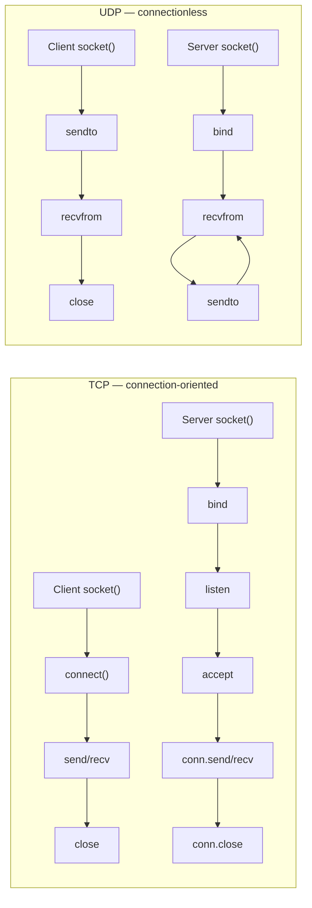
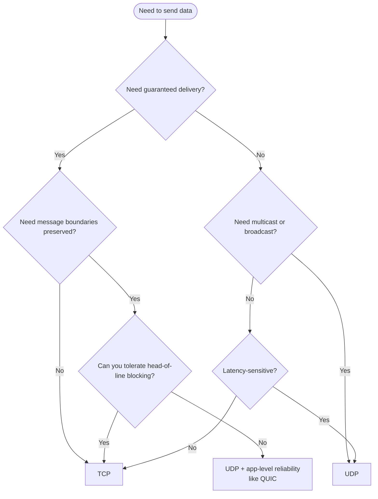
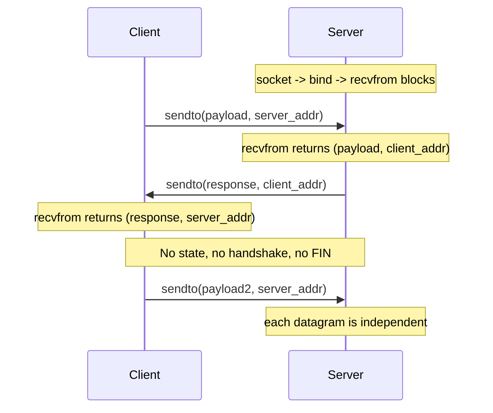
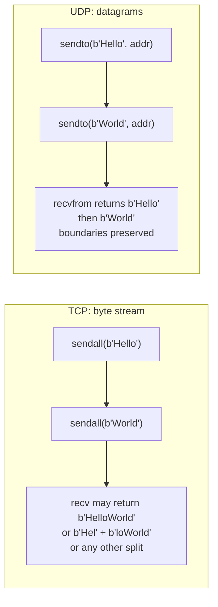
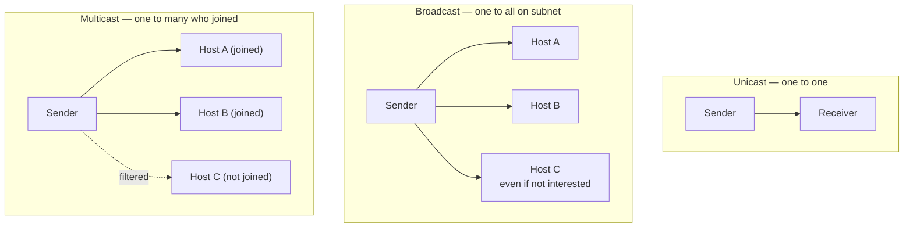

# UDP Communication — Connectionless Messaging on the Internet

> [!info] Chapter 27 — Networking and Sockets, Note 3
> Follows [[1. The socket Module]] and [[2. TCP Server and Client]]. Where TCP gives you a reliable ordered byte stream, UDP gives you unreliable, unordered, but message-preserving datagrams. The trade-offs are profound.

## Why This Matters

TCP dominates request/response traffic on the internet, but a surprising fraction of the world's traffic is UDP:

- **DNS** — the entire domain name system runs on UDP port 53. A typical DNS query is a single UDP datagram under 512 bytes; requiring TCP's three-way handshake would more than double the latency.
- **DHCP** — IP address assignment uses UDP broadcasts.
- **NTP** — network time synchronisation uses UDP port 123.
- **SNMP** — network monitoring uses UDP ports 161/162.
- **VoIP** (WebRTC, SIP, RTP) — a dropped packet is better than a delayed one; TCP's retransmission would hurt voice quality more than losing the packet.
- **Video streaming** (QUIC, WebRTC, IPTV) — modern streaming prefers to skip lost frames rather than stall waiting for retransmission.
- **Online games** — latency matters more than perfect delivery; lost position updates are simply superseded by the next update.
- **TFTP, Syslog, RIP, OSPF, mDNS** — all UDP.
- **QUIC** (HTTP/3) — built on top of UDP, because UDP datagrams pass through firewalls and middleboxes that would block a brand-new IP protocol number.

Understanding UDP lets you build protocols where TCP is the wrong tool — when you want low latency, can tolerate loss, need multicast or broadcast, or simply want a connectionless message bus.

## Background — What UDP Is

UDP (User Datagram Protocol) is defined in RFC 768 (1980). It is astonishingly simple: an 8-byte header (source port, destination port, length, checksum) followed by the payload. The protocol does **nothing** except deliver datagrams:

- **No connection** — there is no handshake. You `sendto()` and that is it.
- **No reliability** — datagrams may be lost, duplicated, or arrive out of order. The sender will not be informed.
- **No flow control** — if you send faster than the receiver can read, packets are silently dropped. There is no equivalent of TCP's sliding window.
- **No congestion control** — UDP will happily saturate a link. This is why UDP-based protocols like QUIC implement their own congestion control at the application layer.
- **Message boundaries preserved** — each `sendto()` produces exactly one datagram, and the receiver's `recvfrom()` returns exactly that datagram's payload. (Subject to fragmentation, but the reassembled datagram is delivered as one unit.)
- **Maximum size** — the theoretical maximum UDP datagram is 65,535 bytes (IPv4 total length field). In practice, datagrams larger than the path MTU (typically ~1500 bytes for Ethernet) are fragmented at the IP layer. Fragmentation is fragile — if any fragment is lost, the entire datagram is discarded. **Rule of thumb: keep UDP payloads under 512 bytes unless you know what you are doing.**

## Main Content

### 1. UDP Server and Client — The Minimal Example

A UDP server is much simpler than a TCP server: no `listen`, no `accept`. Just `bind` and `recvfrom`.

```python
import socket

# UDP server
server = socket.socket(socket.AF_INET, socket.SOCK_DGRAM)
server.bind(("127.0.0.1", 8080))
print("UDP server listening on 127.0.0.1:8080")

while True:
    data, addr = server.recvfrom(4096)
    print(f"Received {data!r} from {addr}")
    server.sendto(b"ack:" + data, addr)
```

```python
import socket

# UDP client — no connect() needed
client = socket.socket(socket.AF_INET, socket.SOCK_DGRAM)
client.sendto(b"hello", ("127.0.0.1", 8080))
response, server_addr = client.recvfrom(4096)
print(f"Response: {response!r} from {server_addr}")
client.close()
```

Notice:

- The client does **not** call `connect()`. Each `sendto()` carries the destination address explicitly.
- `recvfrom()` returns a tuple `(data, addr)` — you always know who sent the datagram, which is essential because there is no "connection" to remember the peer.
- The server can `sendto(addr)` to reply — but it must do so using the address it received from `recvfrom`. There is no implicit peer.

### 2. Mermaid — TCP vs UDP Connection Models



### 3. Mermaid — TCP vs UDP Comparison



### 4. The `connect()` Trick on UDP

Although UDP is connectionless, you *can* call `connect()` on a UDP socket. This does **not** send any packets — it simply associates the socket with a fixed peer address. After `connect()`:

- You use `send()` and `recv()` instead of `sendto()` and `recvfrom()`.
- The kernel filters incoming datagrams — only datagrams from the connected peer are delivered.
- The kernel reports asynchronous errors (ICMP "port unreachable") on the next `recv()`.

```python
import socket

s = socket.socket(socket.AF_INET, socket.SOCK_DGRAM)
s.connect(("127.0.0.1", 8080))
s.send(b"hello")         # destination is fixed
data = s.recv(4096)      # only datagrams from the connected peer arrive
```

This is the standard pattern for DNS clients and other request/response UDP protocols. It is faster than `sendto()` because the kernel does not have to look up the routing table on every call.

### 5. Broadcast

UDP supports broadcast — sending a datagram that every host on the local subnet will receive. To broadcast:

```python
import socket

s = socket.socket(socket.AF_INET, socket.SOCK_DGRAM)
s.setsockopt(socket.SOL_SOCKET, socket.SO_BROADCAST, 1)
s.sendto(b"discovery", ("255.255.255.255", 8080))   # limited broadcast
# or use subnet broadcast: ("192.168.1.255", 8080)
```

The receiver is just a normal UDP server:

```python
s = socket.socket(socket.AF_INET, socket.SOCK_DGRAM)
s.bind(("", 8080))
data, addr = s.recvfrom(4096)
```

Broadcast is being deprecated in favour of multicast, because it generates traffic that every host on the LAN must process even if it does not care. But for simple LAN discovery protocols it is still common.

### 6. Multicast

Multicast is a one-to-many delivery model: a sender sends to a *multicast group address*, and every host that has *joined* that group receives the datagram. Multicast works across routers (if they are configured for it — see IGMP and PIM).

IPv4 multicast addresses are in the range `224.0.0.0`–`239.255.255.255`. The well-known ones include `224.0.0.1` (all hosts on subnet), `224.0.0.251` (mDNS), `239.255.255.250` (SSDP — used by UPnP).

```python
import socket
import struct

MCAST_GROUP = "224.1.1.1"
MCAST_PORT = 5007

# Receiver
sock = socket.socket(socket.AF_INET, socket.SOCK_DGRAM, socket.IPPROTO_UDP)
sock.setsockopt(socket.SOL_SOCKET, socket.SO_REUSEADDR, 1)
sock.bind(("", MCAST_PORT))

# Join the group: tell the kernel to deliver datagrams sent to 224.1.1.1
mreq = struct.pack("4sl", socket.inet_aton(MCAST_GROUP), socket.INADDR_ANY)
sock.setsockopt(socket.IPPROTO_IP, socket.IP_ADD_MEMBERSHIP, mreq)

while True:
    data, addr = sock.recvfrom(4096)
    print(f"Multicast from {addr}: {data!r}")
```

```python
# Sender
sock = socket.socket(socket.AF_INET, socket.SOCK_DGRAM, socket.IPPROTO_UDP)
sock.setsockopt(socket.IPPROTO_IP, socket.IP_MULTICAST_TTL, 2)  # hop limit
sock.sendto(b"hello multicast", (MCAST_GROUP, MCAST_PORT))
```

Key options:

- `IP_ADD_MEMBERSHIP` — join a multicast group.
- `IP_DROP_MEMBERSHIP` — leave a group.
- `IP_MULTICAST_TTL` — set the Time-To-Live for outgoing multicast packets (default 1, meaning local subnet only).
- `IP_MULTICAST_LOOP` — enable/disable loopback of your own multicast packets (default on).

### 7. When to Use UDP

| Use case | Why UDP | Example protocols |
|---|---|---|
| DNS queries | Small, fast, idempotent; TCP's handshake doubles latency | DNS, mDNS, LLMNR |
| Discovery protocols | Broadcast / multicast to unknown peers | DHCP, SSDP, mDNS, Bonjour |
| Real-time media | A late packet is worse than a lost one | RTP, WebRTC, VoIP |
| Online gaming | Latency-critical; old state is replaced by new state | Quake, most FPS netcode |
| Heartbeats and telemetry | Loss of one heartbeat is irrelevant | StatsD, syslog |
| Tunneling and QUIC | Want to build custom congestion control without kernel changes | WireGuard, QUIC, OpenVPN |
| Logging at high volume | Dropped logs are tolerable | syslog, StatsD |

| Use case | Why TCP |
|---|---|
| File transfer | Every byte must arrive, in order | HTTP, FTP, SCP |
| Database queries | Correctness is paramount | Postgres, MySQL, Redis |
| Interactive shell | Stream semantics, reliability | SSH, telnet |
| Email | Loss is unacceptable | SMTP, IMAP |
| Web browsing | General-purpose, ordered | HTTP/1.1, HTTP/2 |

### 8. Application-Level Reliability

When you choose UDP for a use case that needs some reliability, you must build it yourself:

- **Sequence numbers** to detect loss and reorder.
- **Acknowledgements and retransmission** for reliable delivery.
- **A congestion control algorithm** to play fair with TCP (UDP itself has none — naive UDP floods will starve TCP flows).
- **Heartbeats / keepalives** to detect dead peers.

This is exactly what **QUIC** (RFC 9000) does — and it is why HTTP/3 runs over QUIC over UDP, not over a new IP protocol.

A minimal "reliable UDP" pattern:

```python
import socket, struct, time

def send_reliable(sock: socket.socket, addr: tuple, payload: bytes, timeout: float = 1.0, retries: int = 5) -> bytes:
    seq = 0
    for attempt in range(retries):
        # Frame: 4-byte seq + payload
        packet = struct.pack(">I", seq) + payload
        sock.sendto(packet, addr)
        sock.settimeout(timeout)
        try:
            ack, _ = sock.recvfrom(4096)
            (ack_seq,) = struct.unpack(">I", ack[:4])
            if ack_seq == seq:
                return ack[4:]  # payload portion of ACK
        except socket.timeout:
            continue
    raise TimeoutError(f"no ACK after {retries} retries")
```

This is the basic shape of TFTP and many custom UDP protocols. QUIC is the same idea but with thousands of pages of engineering.

### 9. Mermaid — UDP Packet Flow (No Connection State)



Compare to the TCP handshake diagram in [[2. TCP Server and Client]] — UDP has none of that machinery.

### 10. Sizes and Fragmentation

The UDP header is 8 bytes. The IPv4 header is 20 bytes. The Ethernet MTU is typically 1500 bytes. So the practical maximum UDP payload before IP fragmentation kicks in is `1500 - 20 - 8 = 1472` bytes.

If you `sendto()` a payload larger than the MTU, IP fragmentation splits it into multiple fragments. The receiver reassembles them. If any fragment is lost, the entire datagram is discarded — there is no partial delivery.

To avoid fragmentation:

- Keep UDP payloads under 512 bytes for maximum compatibility (RFC 5405 recommends 512 bytes as a safe upper bound).
- Use `socket.getsockopt(SOL_IP, IP_MTU)` to query the path MTU on Linux.
- For larger payloads, consider implementing your own fragmentation with forward error correction (FEC).

```python
# Discover the path MTU on Linux
import socket
s = socket.socket(socket.AF_INET, socket.SOCK_DGRAM)
s.connect(("8.8.8.8", 53))
mtu = s.getsockopt(socket.IPPROTO_IP, 14)  # IP_MTU = 14 on Linux
print(f"Path MTU: {mtu}, safe UDP payload: {mtu - 28}")
```

### 11. Mermaid — UDP Datagrams vs TCP Byte Stream



### 12. Mermaid — Broadcast vs Multicast vs Unicast



## Code Examples

### A minimal DNS client

DNS is the canonical UDP protocol. This client builds a DNS query for the A record of a hostname and parses the response.

```python
import socket
import struct
import random

def dns_query(hostname: str, dns_server: str = "8.8.8.8", port: int = 53) -> list[str]:
    # Build DNS query packet
    txid = random.randint(0, 65535)
    # Header: id, flags(0x0100 = standard query, recursion desired), 4×count
    header = struct.pack(">HHHHHH", txid, 0x0100, 1, 0, 0, 0, 0)
    # Question section: each label length-prefixed, terminated with 0
    question = b"".join(
        bytes([len(label)]) + label.encode() for label in hostname.split(".")
    ) + b"\x00"
    # Type A (1), Class IN (1)
    question += struct.pack(">HH", 1, 1)
    packet = header + question

    with socket.socket(socket.AF_INET, socket.SOCK_DGRAM) as s:
        s.settimeout(5.0)
        s.sendto(packet, (dns_server, port))
        response, _ = s.recvfrom(512)

    # Parse header
    (rid, flags, qdcount, ancount, _, _) = struct.unpack(">HHHHHH", response[:12])
    if rid != txid:
        raise ValueError("DNS transaction ID mismatch")

    # Skip the question section (length-prefixed name + 4 bytes type/class)
    pos = 12
    while response[pos] != 0:
        pos += response[pos] + 1
    pos += 5  # null byte + type(2) + class(2)

    # Parse answer section
    answers = []
    for _ in range(ancount):
        # Name (often compressed pointer 0xC0 0x0c)
        if response[pos] & 0xC0 == 0xC0:
            pos += 2
        else:
            while response[pos] != 0:
                pos += response[pos] + 1
            pos += 1
        rtype, rclass, ttl, rdlen = struct.unpack(">HHIH", response[pos:pos+10])
        pos += 10
        rdata = response[pos:pos+rdlen]
        pos += rdlen
        if rtype == 1 and rdlen == 4:  # A record
            answers.append(".".join(str(b) for b in rdata))
    return answers

if __name__ == "__main__":
    print(dns_query("example.com"))
```

### A StatsD-style metrics sink

StatsD listens on UDP port 8125 and accepts tiny metric lines like `pageviews:1|c`. The protocol is intentionally fire-and-forget — losing metrics is preferable to blocking the application.

```python
import socket

class StatsServer:
    def __init__(self, host: str = "127.0.0.1", port: int = 8125):
        self.sock = socket.socket(socket.AF_INET, socket.SOCK_DGRAM)
        self.sock.bind((host, port))
        self.counters: dict[str, int] = {}

    def serve(self) -> None:
        print(f"StatsD listening on {host}:{port}")
        while True:
            data, addr = self.sock.recvfrom(1024)
            line = data.decode("utf-8", "replace").strip()
            try:
                key, value_and_type = line.split(":", 1)
                value, type_ = value_and_type.split("|", 1)
                if type_ == "c":
                    self.counters[key] = self.counters.get(key, 0) + int(value)
            except Exception:
                continue  # malformed lines are silently dropped — UDP-style

    def stats(self) -> dict[str, int]:
        return dict(self.counters)
```

### A multicast heartbeat listener

```python
import socket, struct, threading, time

GROUP = "224.1.1.1"
PORT = 5007

def listener():
    s = socket.socket(socket.AF_INET, socket.SOCK_DGRAM)
    s.setsockopt(socket.SOL_SOCKET, socket.SO_REUSEADDR, 1)
    s.bind(("", PORT))
    mreq = struct.pack("4sl", socket.inet_aton(GROUP), socket.INADDR_ANY)
    s.setsockopt(socket.IPPROTO_IP, socket.IP_ADD_MEMBERSHIP, mreq)
    while True:
        data, addr = s.recvfrom(1024)
        print(f"heartbeat from {addr}: {data!r}")

def sender():
    s = socket.socket(socket.AF_INET, socket.SOCK_DGRAM)
    s.setsockopt(socket.IPPROTO_IP, socket.IP_MULTICAST_TTL, 1)
    while True:
        s.sendto(b"beat", (GROUP, PORT))
        time.sleep(1)

threading.Thread(target=listener, daemon=True).start()
threading.Thread(target=sender, daemon=True).start()
time.sleep(5)
```

## Common Pitfalls

> [!danger] Assuming UDP delivery
> UDP makes no guarantee. If your protocol assumes every datagram arrives, you will eventually corrupt data. Either implement ACK/retransmission or accept the loss.

> [!danger] Sending large UDP datagrams
> Payloads larger than the path MTU (~1472 bytes on Ethernet) are fragmented at the IP layer. If any fragment is lost, the entire datagram is discarded. Keep payloads under 512 bytes whenever possible.

> [!danger] Forgetting to filter `recvfrom` by address
> A UDP server has no "connection" — any client can send to it. If your protocol is request/response, you must check the `addr` returned by `recvfrom()` to know which client the response belongs to.

> [!danger] Not handling ICMP "port unreachable"
> If you `sendto()` a UDP datagram to a port where no server is listening, the remote host sends back an ICMP "port unreachable" error. On a *connected* UDP socket (one that has called `connect()`), this error is delivered to your application as `ConnectionRefusedError` on the next `recv()`. On an unconnected socket, the error is silently discarded — you simply never get a response.

> [!danger] UDP flooding without congestion control
> Naive UDP senders can saturate links and starve TCP traffic. Always implement some form of rate limiting or congestion control if you send at high rates.

> [!danger] Not setting `SO_REUSEADDR` on the receiver
> Multiple processes on the same host cannot bind the same UDP port by default. Set `SO_REUSEADDR` (or `SO_REUSEPORT` on Linux 3.9+) to allow load-balanced receivers.

> [!danger] Confusing `send` and `sendto`
> On an unconnected UDP socket, `send()` raises `OSError: [Errno 89] Destination address required`. You must use `sendto()` with an explicit address, or call `connect()` first.

> [!danger] Forgetting to set `IP_MULTICAST_TTL`
> Default TTL is 1, which means multicast packets never leave the local subnet. If you want cross-subnet multicast, raise the TTL — but check that your routers actually forward multicast (most do not by default).

> [!danger] Expecting broadcast to work across routers
> Broadcast is local-subnet only. Routers do not forward broadcasts. Use multicast or a Pub/Sub broker for cross-subnet one-to-many delivery.

## Tips and Tricks

- **Use `connect()` on UDP clients** for request/response protocols. It is faster (no per-call routing lookup) and surfaces ICMP errors as exceptions.
- **Keep payloads small.** Under 512 bytes is safe; under 1472 is OK on Ethernet.
- **For high-throughput UDP, increase `SO_RCVBUF`** — `s.setsockopt(SOL_SOCKET, SO_RCVBUF, 4 * 1024 * 1024)` gives the kernel a 4 MB buffer to absorb bursts.
- **Use `MSG_DONTWAIT` flag** with `recv()` to make a single call non-blocking without changing the socket mode.
- **Use `recvmmsg` / `sendmmsg`** (Linux, via `socket.recvmsg`) to receive or send multiple datagrams in one syscall — major performance win for high-rate servers.
- **Consider SCTP** for protocols that need reliable ordered messages (a "middle ground" between TCP and UDP). It is supported in Python via `socket.SOCK_STREAM` with `IPPROTO_SCTP`, though support varies by OS.
- **Use `SO_REUSEPORT` for multi-process UDP receivers** — the kernel will load-balance incoming datagrams across all sockets bound to the same port.
- **For LAN discovery, use broadcast.** For WAN or selective delivery, use multicast.
- **For UDP-based protocols, prefer idempotent operations** — duplicates are common and the same datagram may arrive twice.
- **Add a CRC or checksum at the application layer** if you need corruption detection beyond the UDP checksum (which is weak).
- **Use `scapy`** for testing and debugging UDP protocols — it can craft arbitrary packets and sniff traffic.
- **Remember that UDP is not "faster" than TCP** in raw throughput. It is faster in *latency* and *connection setup*, but you must build everything else yourself.

## Active Recall

> [!question] What does `recvfrom()` return that `recv()` does not?
>> [!success]- Answer
>> `recvfrom()` returns a tuple `(bytes, address)` so the caller knows who sent the datagram. `recv()` returns just the bytes. For UDP without a `connect()`-ed peer, you must use `recvfrom()` to know the sender's address.

> [!question] Does UDP guarantee delivery, ordering, or message boundaries?
>> [!success]- Answer
>> Only message boundaries. Each `sendto()` produces exactly one datagram, and the matching `recvfrom()` returns exactly that datagram. Delivery and ordering are **not** guaranteed — datagrams may be lost, duplicated, or arrive out of order.

> [!question] What does calling `connect()` on a UDP socket do?
>> [!success]- Answer
>> It does **not** send any packets. It associates the socket with a fixed peer address so that subsequent `send()` / `recv()` calls do not need to specify the address. It also causes the kernel to filter incoming datagrams to only those from the connected peer, and to deliver asynchronous errors (ICMP "port unreachable") to the application.

> [!question] What is the practical maximum UDP payload on an Ethernet LAN, and why?
>> [!success]- Answer
>> ~1472 bytes (1500 Ethernet MTU − 20 IPv4 header − 8 UDP header). Larger payloads are fragmented at the IP layer; loss of any fragment discards the entire datagram. The conservative safe upper bound recommended by RFC 5405 is 512 bytes.

> [!question] Name three protocols that use UDP and explain why.
>> [!success]- Answer
>> (1) **DNS** — small queries, latency matters, idempotent. (2) **DHCP** — discovery needs broadcast before any IP configuration is possible. (3) **VoIP/RTP** — late packets are worse than lost packets; retransmission would hurt call quality.

> [!question] What is the difference between broadcast and multicast?
>> [!success]- Answer
>> Broadcast sends a datagram to every host on the local subnet (`255.255.255.255` or subnet-broadcast address). Multicast sends to a group address (`224.0.0.0/4`) and only hosts that have explicitly joined the group receive the datagram. Multicast can also cross routers (if configured); broadcast cannot.

> [!question] Why does UDP have no congestion control by default, and what are the consequences?
>> [!success]- Answer
>> UDP is a minimal protocol — it provides only ports, length, and checksum. Congestion control is left to the application. The consequence is that naive UDP senders can saturate links and starve TCP traffic. Protocols like QUIC implement their own congestion control on top of UDP to be good network citizens.

> [!question] What ICMP error is delivered to a connected UDP socket when the destination port is unreachable, and how does it surface in Python?
>> [!success]- Answer
>> ICMP "Destination unreachable — port unreachable". On a connected UDP socket, the next `recv()` raises `ConnectionRefusedError`. On an unconnected socket, the error is silently discarded.

> [!question] Why is `SO_REUSEADDR` (or `SO_REUSEPORT`) useful for UDP receivers?
>> [!success]- Answer
>> It allows multiple processes to bind the same UDP port simultaneously. The kernel then load-balances incoming datagrams across the bound sockets. This is how multi-process UDP servers (e.g., StatsD, mDNS repeaters) scale across CPU cores.

> [!question] Give two reasons to prefer UDP over TCP for a real-time multiplayer game.
>> [!success]- Answer
>> (1) Latency: TCP retransmits lost packets, which delays subsequent ones (head-of-line blocking); stale game state is useless, so it is better to drop and continue. (2) Connectionless model: each game state update is independent, and UDP's message boundaries fit naturally.

## Next Steps

- Continue to [[4. Handling Multiple Clients]] — most of the concurrency models discussed there (thread-per-connection, thread pools, `select`) apply to UDP servers too, with differences.
- Then [[5. Non-blocking Sockets]] — UDP servers particularly benefit from non-blocking I/O because each datagram is independent.
- Then [[6. asyncio Networking]] — `asyncio.DatagramProtocol` and `loop.create_datagram_endpoint` provide a high-level UDP API.
- Cross-reference [[1. The socket Module]] for the underlying primitives.
- For an industrial-strength UDP protocol, study the QUIC specification (RFC 9000) — it is the modern textbook on building reliability on top of UDP.
