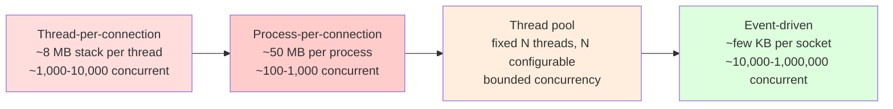
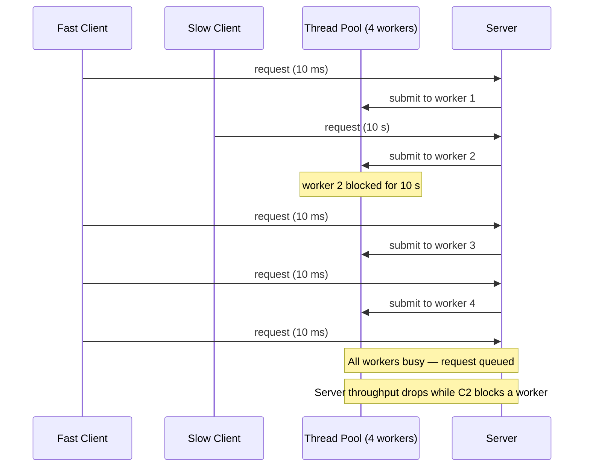
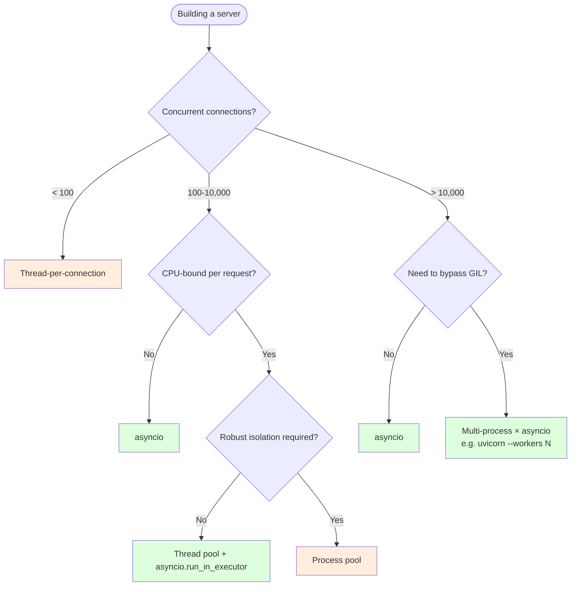

# Handling Multiple Clients — Concurrency Models for Socket Servers

> [!info] Chapter 27 — Networking and Sockets, Note 4
> Follows [[3. UDP Communication]]. Builds on [[14. Concurrency/2. threading Module]] and [[14. Concurrency/3. multiprocessing Module]]. The next notes ([[5. Non-blocking Sockets]], [[6. asyncio Networking]]) cover the event-driven alternatives.

## Why This Matters

A server that can only handle one client at a time is a toy. Real servers — web servers, databases, chat backends, game servers — must handle hundreds, thousands, or hundreds of thousands of concurrent connections. How you structure the server's concurrency model determines:

- **Throughput** — how many requests per second you can sustain.
- **Concurrency** — how many clients can be open at once.
- **Latency** — how long each client waits for a response.
- **Resource cost** — memory, file descriptors, CPU overhead per client.
- **Code complexity** — how easy the server is to write, debug, and extend.
- **Failure isolation** — what happens when one client crashes or blocks.

There is no single best model. Different workloads favour different approaches. This note surveys the four classic concurrency models for socket servers and previews the event-driven model that powers modern high-performance servers.

## Background — The Fundamental Problem

The single-threaded server from [[2. TCP Server and Client]] looks like this:

```python
while True:
    conn, addr = srv.accept()
    handle_client(conn)  # blocks until the client is done
```

This server can only serve one client at a time. While `handle_client` is running for client A, the server cannot `accept()` client B. Client B's SYN sits in the kernel's accept queue (bounded by `listen(backlog)`); once that queue fills, the kernel silently drops new connections.

The fix is to make `handle_client` non-blocking with respect to the accept loop. The four classic strategies are:

1. **Thread-per-connection** — spawn a new OS thread per accepted client.
2. **Process-per-connection** — spawn a new OS process per accepted client.
3. **Thread pool** — accept in the main thread, dispatch to a fixed pool of worker threads.
4. **Event-driven I/O** — single thread, non-blocking sockets, an event loop (`select`, `epoll`, `selectors`, `asyncio`).

Each has its own performance characteristics, complexity, and failure modes.

## Main Content

### 1. Thread-Per-Connection

The simplest concurrency model. The main thread accepts connections and spawns a worker thread for each.

```python
import socket
import threading

def handle_client(conn: socket.socket, addr: tuple) -> None:
    try:
        with conn:
            while True:
                data = conn.recv(4096)
                if not data:
                    break
                conn.sendall(data)  # echo
    except (ConnectionResetError, BrokenPipeError):
        pass

def serve(host: str = "0.0.0.0", port: int = 8080) -> None:
    with socket.socket(socket.AF_INET, socket.SOCK_STREAM) as srv:
        srv.setsockopt(socket.SOL_SOCKET, socket.SO_REUSEADDR, 1)
        srv.bind((host, port))
        srv.listen(128)
        print(f"Listening on {host}:{port}")
        while True:
            conn, addr = srv.accept()
            t = threading.Thread(target=handle_client, args=(conn, addr), daemon=True)
            t.start()

if __name__ == "__main__":
    serve()
```

**Pros:**

- Simple to write and reason about.
- Each client is fully isolated — a crash in one handler does not affect others.
- Blocking calls (`recv`, `recvfrom`, file I/O, database queries) are natural.
- Works for any workload, including CPU-bound work in the handler.

**Cons:**

- Each Python thread costs ~8 MB of stack by default (configurable). At ~10,000 threads you exhaust virtual address space on 32-bit systems; on 64-bit you hit other limits first.
- The OS thread scheduler context-switches between threads, which adds overhead at high thread counts.
- The Python GIL serialises CPU-bound Python bytecode — but I/O-bound handlers release the GIL while waiting, so they can truly run concurrently.
- Threads share memory; bugs like data races are possible if your handler touches shared state without locks.
- No bound on resource usage — a client flood can spawn unlimited threads.

**When to use:**

- Small-to-medium servers (up to a few thousand concurrent connections).
- Handlers that make blocking calls to external resources (databases, file systems, other network services).
- Internal tools where simplicity matters more than peak performance.

### 2. Process-Per-Connection

Same pattern, but using processes instead of threads. This is the model Apache HTTPD used for years (the "prefork" MPM).

```python
import socket
import os
import signal

def handle_client(conn: socket.socket) -> None:
    with conn:
        while True:
            data = conn.recv(4096)
            if not data:
                break
            conn.sendall(data)
    os._exit(0)  # worker exits immediately after handling one client

def serve(host: str = "0.0.0.0", port: int = 8080) -> None:
    # Reap zombie children
    signal.signal(signal.SIGCHLD, signal.SIG_IGN)

    with socket.socket(socket.AF_INET, socket.SOCK_STREAM) as srv:
        srv.setsockopt(socket.SOL_SOCKET, socket.SO_REUSEADDR, 1)
        srv.bind((host, port))
        srv.listen(128)
        print(f"Listening on {host}:{port}")
        while True:
            conn, _ = srv.accept()
            pid = os.fork()
            if pid == 0:  # child
                srv.close()  # child does not need the listening socket
                handle_client(conn)
            else:  # parent
                conn.close()  # parent does not need the connected socket
```

**Pros:**

- Full memory isolation — a buggy or malicious client cannot corrupt the server's state.
- No GIL — each process has its own, so CPU-bound handlers truly parallelise.
- A crash in one worker does not affect others.
- The model is robust to memory leaks — the worker exits after each request, releasing all resources.

**Cons:**

- Process creation is much more expensive than thread creation (~1 ms vs ~10 µs).
- Each process has its own memory, so memory usage is much higher per connection (no shared heap).
- IPC is harder — workers cannot share in-memory caches; you must use `multiprocessing.Manager`, pipes, or shared memory.
- `fork` is unavailable on Windows — `multiprocessing` works around this with `spawn`, but the semantics differ.
- Zombies: child processes must be reaped (`SIGCHLD` handler or `waitpid`).

**When to use:**

- Handlers are CPU-bound and you want to bypass the GIL.
- Robustness is paramount — a crash must not bring down the whole server.
- Each request is short and self-contained.

### 3. Thread Pool (or Process Pool)

Instead of spawning a thread per client, you create a fixed pool of worker threads up front and dispatch accepted connections to them.

```python
import socket
import threading
from concurrent.futures import ThreadPoolExecutor

def handle_client(conn: socket.socket) -> None:
    with conn:
        try:
            while True:
                data = conn.recv(4096)
                if not data:
                    break
                conn.sendall(data)
        except (ConnectionResetError, BrokenPipeError):
            pass

def serve(host: str = "0.0.0.0", port: int = 8080, workers: int = 100) -> None:
    pool = ThreadPoolExecutor(max_workers=workers)
    with socket.socket(socket.AF_INET, socket.SOCK_STREAM) as srv:
        srv.setsockopt(socket.SOL_SOCKET, socket.SO_REUSEADDR, 1)
        srv.bind((host, port))
        srv.listen(128)
        print(f"Listening on {host}:{port} with {workers} workers")
        while True:
            conn, _ = srv.accept()
            pool.submit(handle_client, conn)

if __name__ == "__main__":
    serve()
```

**Pros:**

- Bounded resource usage — you cap the number of threads, preventing thread explosion under load.
- No per-connection thread-creation overhead.
- Can be combined with `ProcessPoolExecutor` to use multiple processes per CPU core, getting the best of both worlds.

**Cons:**

- If all workers are busy, new clients wait in the pool's queue. This adds latency.
- A single slow client can occupy a worker for its entire connection lifetime — even when it is idle. This is the "slow client" problem and is the main motivation for event-driven I/O.
- Cannot easily exceed ~1,000–10,000 concurrent connections because each thread still costs memory.

**When to use:**

- You want to bound resource usage.
- Most handlers are short-lived.
- You want the simplicity of threaded code without unbounded thread creation.
- This is the model used by most modern Python web frameworks when running with a threaded WSGI server (gunicorn with threads).

### 4. Event-Driven I/O (Preview)

The fundamental insight: a thread-per-connection server wastes a thread on each idle client. If you have 10,000 clients and each sends a request every 100 ms, you have 100,000 threads, almost all of them blocked in `recv()`. The OS scheduler thrashes.

Event-driven I/O flips the model: a single thread runs an event loop. The loop tells the kernel "wake me up when any of these sockets is ready". When the kernel reports readiness, the loop dispatches to the appropriate handler.

```python
import socket
import select

def serve(host: str = "0.0.0.0", port: int = 8080) -> None:
    srv = socket.socket(socket.AF_INET, socket.SOCK_STREAM)
    srv.setsockopt(socket.SOL_SOCKET, socket.SO_REUSEADDR, 1)
    srv.bind((host, port))
    srv.listen(128)
    srv.setblocking(False)

    sockets = [srv]
    print(f"Listening on {host}:{port}")
    while True:
        readable, _, _ = select.select(sockets, [], [])
        for s in readable:
            if s is srv:
                conn, _ = srv.accept()
                conn.setblocking(False)
                sockets.append(conn)
            else:
                data = s.recv(4096)
                if not data:
                    sockets.remove(s)
                    s.close()
                else:
                    s.sendall(data)
```

This is the same echo server, but a single thread handles every connection. The cost per connection is tiny — just a file descriptor and a buffer — so 10,000 concurrent connections are easy.

The full treatment of event-driven I/O is in [[5. Non-blocking Sockets]] and [[6. asyncio Networking]]. Here we just preview the model.

### 5. Mermaid — Concurrency Models for Servers

```mermaid
flowchart TB
    subgraph TPC["Thread-per-connection"]
        A1["accept loop"] --> A2["spawn thread"]
        A2 --> A3["handle_client in thread"]
    end
    subgraph PPC["Process-per-connection"]
        B1["accept loop"] --> B2["fork"]
        B2 --> B3["handle_client in child process"]
    end
    subgraph Pool["Thread pool"]
        C1["accept loop"] --> C2["submit to pool"]
        C2 --> C3["worker picks up"]
        C3 --> C4["handle_client"]
    end
    subgraph Event["Event-driven (select/asyncio)"]
        D1["accept loop"] --> D2["select / epoll"]
        D2 --> D3["dispatch ready sockets to handlers"]
        D3 --> D2
    end
```



### 6. Mermaid — Resource Cost per Connection



### 7. Mermaid — The Slow Client Problem



The slow client problem is the killer argument for event-driven I/O. An event loop is never "blocked" by a single client — it just moves on to the next ready socket.

### 8. Hybrid Models

Real production servers rarely use a pure model. Common hybrids:

#### Thread pool + event loop (nginx, gunicorn async workers)

An event loop handles I/O multiplexing, and a thread pool handles CPU-bound work. When a handler needs to do CPU-bound work, it submits to the pool, freeing the event loop to handle other connections.

```python
import asyncio
import concurrent.futures

async def handle(reader, writer):
    data = await reader.read(4096)
    # Offload CPU-bound work to a thread pool
    loop = asyncio.get_running_loop()
    result = await loop.run_in_executor(None, lambda: heavy_compute(data))
    writer.write(result)
    await writer.drain()
    writer.close()

async def main():
    server = await asyncio.start_server(handle, "0.0.0.0", 8080)
    async with server:
        await server.serve_forever()

asyncio.run(main())
```

#### Process-per-core + event loop (gunicorn workers, uvicorn workers)

Each CPU core runs one process, and each process runs an event loop. This bypasses the GIL while still getting event-driven scaling. This is the model used by `uvicorn --workers 4` and `gunicorn -k uvicorn -w 4`.

#### Pre-forked process pool + thread-per-connection (Apache prefork+event MPM)

A pool of worker processes is created at startup. Each worker process handles connections one at a time (or with a small thread pool). New processes are spawned if the pool runs low. This is Apache's classic model.

### 9. Choosing a Model

| Workload | Recommended model | Why |
|---|---|---|
| Internal tool, < 100 concurrent clients | Thread-per-connection | Simplest to write |
| Production web server, < 1,000 concurrent | Thread pool (gunicorn with threads) | Bounded, simple, well-understood |
| Production web server, 1,000–100,000 concurrent | asyncio + uvicorn | Event-driven, scales well |
| Production web server, > 100,000 concurrent | Multiple processes × asyncio, or nginx fronting your app | Bypass GIL, spread across cores |
| CPU-bound per request (image processing, ML inference) | Process pool or multi-process | Bypass GIL |
| Real-time protocol (chat, gaming, WebRTC) | asyncio | Low latency, many idle connections |
| Database server | Process pool | Robust isolation, CPU-bound queries |

### 10. Graceful Shutdown

Production servers must handle `SIGTERM` and `SIGINT` cleanly: stop accepting new connections, finish in-flight requests, then exit.

```python
import socket, threading, signal, time, logging

SHUTDOWN = threading.Event()
ACTIVE_CONNS = []
ACTIVE_LOCK = threading.Lock()

def signal_handler(signum, frame):
    logging.info(f"Signal {signum} received, shutting down...")
    SHUTDOWN.set()

signal.signal(signal.SIGTERM, signal_handler)
signal.signal(signal.SIGINT, signal_handler)

def serve(host: str = "0.0.0.0", port: int = 8080) -> None:
    with socket.socket(socket.AF_INET, socket.SOCK_STREAM) as srv:
        srv.setsockopt(socket.SOL_SOCKET, socket.SO_REUSEADDR, 1)
        srv.bind((host, port))
        srv.listen(128)
        srv.settimeout(1.0)
        logging.info(f"Listening on {host}:{port}")
        while not SHUTDOWN.is_set():
            try:
                conn, _ = srv.accept()
            except socket.timeout:
                continue
            t = threading.Thread(target=handle_client, args=(conn,), daemon=True)
            t.start()
        # Wait for active connections to drain (with a deadline)
        deadline = time.time() + 30
        while time.time() < deadline:
            with ACTIVE_LOCK:
                if not ACTIVE_CONNS:
                    break
            time.sleep(0.1)
        logging.info("Shutdown complete")
```

### 11. Per-Connection State and Cleanup

In a multi-client server, you must track per-connection state carefully. Common pitfalls:

- Forgetting to remove the connection from a tracking dict when it closes — leads to memory leaks and stale references.
- Modifying shared state without a lock — leads to data races.
- Not setting a timeout — a slow client can occupy a worker forever.

A clean pattern using a connection registry:

```python
import threading
import socket
from dataclasses import dataclass, field
from typing import Optional

@dataclass
class ConnectionState:
    conn: socket.socket
    addr: tuple
    user_id: Optional[str] = None
    buffer: bytearray = field(default_factory=bytearray)

class ConnectionRegistry:
    def __init__(self):
        self._conns: dict[socket.socket, ConnectionState] = {}
        self._lock = threading.Lock()

    def add(self, state: ConnectionState) -> None:
        with self._lock:
            self._conns[state.conn] = state

    def remove(self, conn: socket.socket) -> None:
        with self._lock:
            self._conns.pop(conn, None)

    def all(self) -> list[ConnectionState]:
        with self._lock:
            return list(self._conns.values())

    def broadcast(self, message: bytes, exclude: Optional[socket.socket] = None) -> None:
        with self._lock:
            targets = [s for s in self._conns.values() if s.conn is not exclude]
        for state in targets:
            try:
                state.conn.sendall(message)
            except OSError:
                pass  # remove in handler
```

### 12. Mermaid — Choosing a Concurrency Model



## Code Examples

### Chat server using a thread pool and a registry

```python
import socket
import threading
from concurrent.futures import ThreadPoolExecutor

class ChatServer:
    def __init__(self, host: str = "0.0.0.0", port: int = 8080, workers: int = 50):
        self.host = host
        self.port = port
        self.workers = workers
        self.clients: dict[socket.socket, str] = {}
        self.lock = threading.Lock()

    def broadcast(self, message: bytes, exclude: socket.socket | None = None) -> None:
        with self.lock:
            targets = [c for c in self.clients if c is not exclude]
        for c in targets:
            try:
                c.sendall(message)
            except OSError:
                pass

    def handle_client(self, conn: socket.socket, addr: tuple) -> None:
        try:
            conn.sendall(b"Welcome! Enter your name: ")
            name = conn.recv(1024).decode("utf-8", "replace").strip() or str(addr)
            with self.lock:
                self.clients[conn] = name
            self.broadcast(f"*** {name} joined ***\n".encode(), exclude=conn)
            conn.sendall(b"You are registered. Start chatting.\n")
            buffer = b""
            while True:
                data = conn.recv(4096)
                if not data:
                    break
                buffer += data
                while b"\n" in buffer:
                    line, buffer = buffer.split(b"\n", 1)
                    msg = f"{name}: {line.decode('utf-8', 'replace')}\n".encode()
                    self.broadcast(msg)
        except (ConnectionResetError, BrokenPipeError):
            pass
        finally:
            with self.lock:
                self.clients.pop(conn, None)
            try:
                conn.close()
            except OSError:
                pass
            self.broadcast(f"*** {name} left ***\n".encode())

    def serve(self) -> None:
        with socket.socket(socket.AF_INET, socket.SOCK_STREAM) as srv:
            srv.setsockopt(socket.SOL_SOCKET, socket.SO_REUSEADDR, 1)
            srv.bind((self.host, self.port))
            srv.listen(128)
            print(f"Chat server on {self.host}:{self.port}")
            with ThreadPoolExecutor(max_workers=self.workers) as pool:
                while True:
                    conn, addr = srv.accept()
                    pool.submit(self.handle_client, conn, addr)

if __name__ == "__main__":
    ChatServer().serve()
```

### Process-per-connection with proper child reaping

```python
import socket, os, signal

def reap_children(signum, frame):
    while True:
        try:
            pid, status = os.waitpid(-1, os.WNOHANG)
            if pid == 0:
                break
        except ChildProcessError:
            break

signal.signal(signal.SIGCHLD, reap_children)

def serve(host: str = "0.0.0.0", port: int = 8080) -> None:
    with socket.socket(socket.AF_INET, socket.SOCK_STREAM) as srv:
        srv.setsockopt(socket.SOL_SOCKET, socket.SO_REUSEADDR, 1)
        srv.bind((host, port))
        srv.listen(128)
        while True:
            conn, _ = srv.accept()
            pid = os.fork()
            if pid == 0:
                srv.close()
                # handle the client
                with conn:
                    while True:
                        data = conn.recv(4096)
                        if not data:
                            break
                        conn.sendall(data)
                os._exit(0)
            else:
                conn.close()
```

## Common Pitfalls

> [!danger] Spawning unbounded threads
> A client flood can spawn thousands of threads, each consuming 8 MB of stack, exhausting memory. Always use a thread pool with a bounded `max_workers` for production.

> [!danger] Modifying shared state without a lock
> A `dict` or `list` is not safe to mutate from multiple threads simultaneously, even though the GIL prevents crashes. You can still get logic-level data races (e.g., two threads both `if key not in d: d[key] = ...`). Always use `threading.Lock` or `queue.Queue` for cross-thread coordination.

> [!danger] Daemon threads killed mid-operation
> Daemon threads are abruptly terminated when the main thread exits. If they hold a lock or are mid-write, state can be corrupted. For long-running operations, use non-daemon threads and signal them to shut down.

> [!danger] Not handling `BrokenPipeError` and `ConnectionResetError`
> If a client disconnects while you are writing, `sendall` raises one of these. Wrap your handler in a try/except so the worker thread exits cleanly.

> [!danger] Forgetting to remove closed sockets from registries
> A `dict` of `socket.socket` -> state that is never cleaned up will leak memory and file descriptors. Always remove from the registry in a `finally` block.

> [!danger] Calling `accept()` after the server is shutting down
> After `SHUTDOWN.set()`, the accept loop must stop accepting. Use a short `settimeout` on the listening socket so the loop can periodically check the shutdown flag.

> [!danger] Mixing blocking and non-blocking sockets
> If the accept loop is non-blocking but the handler is blocking (or vice versa), you get mysterious errors. Pick one model per socket role.

> [!danger] Using `fork` on Windows
> `os.fork` does not exist on Windows. Use `multiprocessing.Process` with `start_method="spawn"` for portability — but be aware that `spawn` re-imports the module, so module-level side effects run twice.

> [!danger] Zombies in process-per-connection
> If you do not reap child processes (via `waitpid` or a `SIGCHLD` handler), they become zombies that consume a process table entry indefinitely. The simplest fix: `signal.signal(signal.SIGCHLD, signal.SIG_IGN)` tells the kernel to auto-reap.

> [!danger] Not setting per-connection timeouts
> A client that opens a connection and never sends data will occupy a worker thread forever. Always `settimeout()` on accepted connections in production.

## Tips and Tricks

- **Start with thread-per-connection for prototyping.** It is the simplest correct model. Move to thread pool or asyncio only when you have measured a problem.
- **Use `concurrent.futures.ThreadPoolExecutor` for the pool.** It handles shutdown, queueing, and exception propagation cleanly.
- **For high-scale servers, prefer asyncio.** The event loop is dramatically more efficient than thousands of threads — see [[6. asyncio Networking]].
- **For CPU-bound work, use a process pool.** `ProcessPoolExecutor` parallelises CPU-bound Python across cores, bypassing the GIL.
- **Always bound your concurrency.** A server that accepts unlimited connections is a DoS waiting to happen.
- **Track per-connection state in a thread-safe registry.** Use a `Lock` or `threading.RLock` around mutations.
- **For chat-like servers, use `queue.Queue` per client** so worker threads can enqueue messages and the connection's writer thread can drain them. This decouples reading from writing.
- **Test under load.** Use `wrk`, `ab`, `locust`, or `k6` to measure how your server behaves at high concurrency.
- **Profile.** `py-spy` and `pyinstrument` show you where your server is spending time.
- **Use `socketserver.ThreadingTCPServer`** for simple cases — it handles most of the boilerplate for you:
```python
import socketserver

class EchoHandler(socketserver.BaseRequestHandler):
    def handle(self):
        while True:
            data = self.request.recv(4096)
            if not data:
                break
            self.request.sendall(data)

class ThreadingEchoServer(socketserver.ThreadingTCPServer):
    allow_reuse_address = True
    daemon_threads = True

with ThreadingEchoServer(("0.0.0.0", 8080), EchoHandler) as s:
    s.serve_forever()
```

- **Consider `SO_REUSEPORT`** to load-balance a single port across multiple processes — the kernel handles the dispatch.
- **For zero-downtime restarts, use systemd socket activation.** The socket is created by systemd and passed to your process already bound and listening. Restarting the process does not drop the listening socket.

## Active Recall

> [!question] List the four classic concurrency models for socket servers.
>> [!success]- Answer
>> (1) Thread-per-connection, (2) process-per-connection, (3) thread pool, (4) event-driven I/O (`select`/`epoll`/`asyncio`).

> [!question] What is the "slow client problem"?
>> [!success]- Answer
>> In thread-per-connection or thread-pool models, a single slow client can occupy a worker thread for its entire connection lifetime — even when it is idle. With a bounded pool, a few slow clients can exhaust the pool and prevent new clients from being served. Event-driven I/O solves this by never blocking on a single client.

> [!question] Why is process-per-connection more memory-expensive than thread-per-connection?
>> [!success]- Answer
>> Each process has its own complete address space, including the Python interpreter and all imported modules. Threads share an address space. A Python process typically uses tens of MB of resident memory, while a thread costs only its stack (~8 MB virtual, far less resident).

> [!question] Why might you choose process-per-connection despite its higher memory cost?
>> [!success]- Answer
>> (1) Robust isolation — a crash or memory leak in one worker does not affect others. (2) No GIL — CPU-bound work parallelises across processes. (3) Worker exit releases all resources — useful if your handler tends to leak memory.

> [!question] What is the role of `concurrent.futures.ThreadPoolExecutor` in a socket server?
>> [!success]- Answer
>> It provides a fixed-size pool of worker threads. The accept loop submits each accepted connection to the pool via `pool.submit(handle_client, conn)`. The pool bounds the number of concurrent threads and queues overflow.

> [!question] Why does a thread pool not solve the slow client problem?
>> [!success]- Answer
>> A thread pool bounds the number of concurrent threads, but each worker is still occupied for the lifetime of the connection it handles. If 100 workers are each handling a slow client, the 101st client waits in the pool's queue. Event-driven I/O does not have this problem because no worker is "stuck" on any one client.

> [!question] What is the C10K problem?
>> [!success]- Answer
>> The challenge of handling 10,000 concurrent connections on a single server. It was articulated by Dan Kegel in 1999 and motivated the move from thread-per-connection to event-driven I/O. Modern servers routinely handle 1M+ connections (the "C1M" or "C10M" problems). See [[5. Non-blocking Sockets]].

> [!question] What does `signal.signal(signal.SIGCHLD, signal.SIG_IGN)` do, and why is it useful for process-per-connection servers?
>> [!success]- Answer
>> It tells the kernel to automatically reap zombie children — child processes that have exited but whose exit status has not been collected by the parent. Without reaping, exited processes accumulate as zombies and consume process table entries.

> [!question] Why must the child process close the listening socket after `fork()`?
>> [!success]- Answer
>> The child does not need to accept new connections — that is the parent's job. Leaving the listening socket open in the child keeps a reference to it, preventing the kernel from fully releasing the file descriptor when the parent eventually closes it. It also prevents the child from accidentally accepting connections.

> [!question] Name two hybrid concurrency models used in production.
>> [!success]- Answer
>> (1) **Event loop + thread pool** — a single event loop handles I/O multiplexing; CPU-bound work is offloaded to a thread pool via `loop.run_in_executor`. Used by `uvicorn` and `gunicorn` async workers. (2) **Multi-process × event loop** — N processes (one per CPU core), each running its own event loop. Used by `uvicorn --workers N` and `gunicorn -k uvicorn -w N`.

> [!question] When does the GIL *not* limit concurrency in a thread-per-connection server?
>> [!success]- Answer
>> When the handler is I/O-bound — `recv`, `send`, file reads, database queries, HTTP requests to other services. The GIL is released during these blocking calls, so multiple threads can be in I/O wait simultaneously. The GIL *does* limit CPU-bound Python code (e.g., image processing, JSON parsing of huge payloads).

## Next Steps

- Continue to [[5. Non-blocking Sockets]] for the deep dive into event-driven I/O with `select`, `poll`, `epoll`, and the `selectors` module.
- Then [[6. asyncio Networking]] for the high-level abstraction that wraps event-driven I/O in coroutines.
- Cross-reference [[14. Concurrency/2. threading Module]] and [[14. Concurrency/3. multiprocessing Module]] for the underlying concurrency primitives.
- Cross-reference [[14. Concurrency/7. Concurrent Futures]] for `ThreadPoolExecutor` and `ProcessPoolExecutor`.
- For a deeper treatment of the C10K problem, read Dan Kegel's original article at https://kegel.com/c10k.html.
- Study nginx's architecture for an industrial example of multi-process × event-driven I/O.
