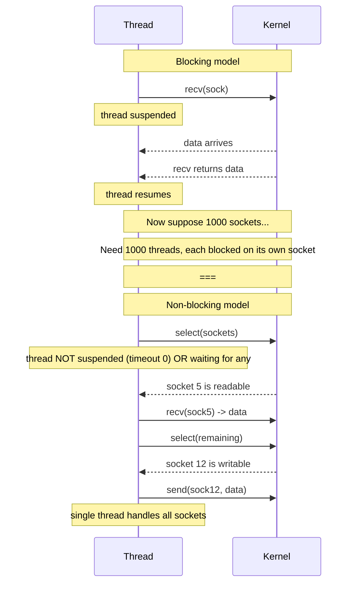
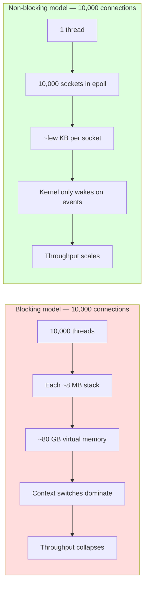
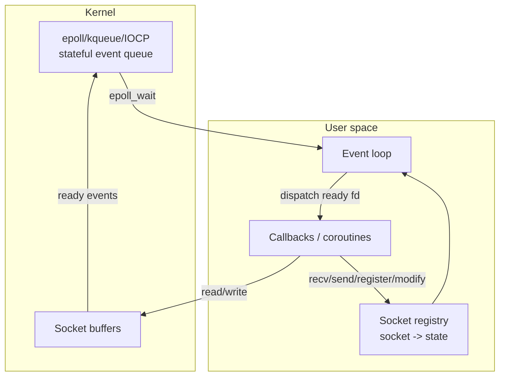
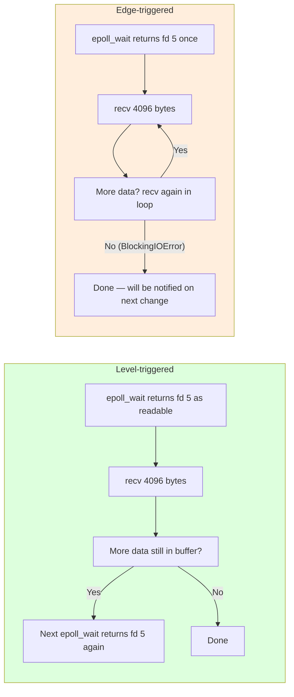
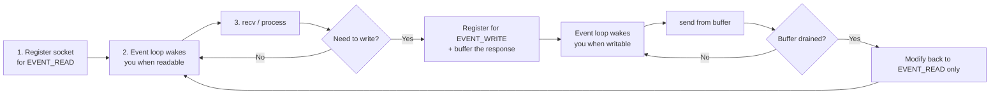

# Non-blocking Sockets — Event-Driven I/O for High-Scale Servers

> [!info] Chapter 27 — Networking and Sockets, Note 5
> Follows [[4. Handling Multiple Clients]]. The next note, [[6. asyncio Networking]], builds the high-level `asyncio` API on top of the primitives described here.

## Why This Matters

The thread-per-connection model from [[4. Handling Multiple Clients]] has a hard ceiling: each thread costs ~8 MB of stack and the OS limits how many threads a process can have. Long before you hit CPU or memory limits, you hit thread-context-switching overhead — the OS scheduler thrashes when there are 10,000+ runnable threads.

The C10K problem — articulated by Dan Kegel in 1999 — asked how a single server could handle 10,000 concurrent connections. The answer was event-driven I/O: **a single thread manages thousands of sockets, and the kernel tells it which sockets are ready for reading or writing**. This model powers nginx, Redis, Node.js, nginx, HAProxy, Envoy, and Python's `asyncio`.

Modern servers routinely handle C1M (one million) and even C10M connections using this approach. Understanding non-blocking sockets and `select`/`epoll` is the key to building high-scale network services in Python — and to understanding what `asyncio` actually does under the hood.

## Background — What "Blocking" Means

When you call `sock.recv(1024)` on a blocking socket, the kernel suspends your thread until at least one byte is available (or the peer closes). The thread is descheduled — it consumes no CPU, but it cannot do anything else. This is the natural model for thread-per-connection servers: each thread "owns" one client and can afford to block on it.

A non-blocking socket flips this: `recv()` returns immediately. If data is available, you get it. If not, you get a `BlockingIOError` exception. The thread is never suspended by I/O — it must explicitly poll for readiness or use an event-notification mechanism.

The kernel offers several event-notification mechanisms:

| Mechanism | OS | API | Performance |
|---|---|---|---|
| `select` | POSIX + Windows | `select.select(rlist, wlist, xlist, timeout)` | O(n) per call; limited to FD_SETSIZE (1024 on Linux) sockets |
| `poll` | POSIX | `select.poll()` | O(n) per call; no FD limit |
| `epoll` | Linux 2.6+ | `select.epoll()` | O(1) per event; stateful in kernel |
| `kqueue` | BSD, macOS | `select.kqueue()` | O(1) per event; stateful in kernel |
| IOCP | Windows | `asyncio` only (no direct Python API) | O(1) per event; uses overlapped I/O |

The `selectors` module (Python 3.4+) wraps these in a uniform API so you do not have to write platform-specific code. `asyncio` builds on `selectors`.

## Main Content

### 1. Making a Socket Non-blocking

Two equivalent ways:

```python
sock.setblocking(False)
# or equivalently:
sock.settimeout(0.0)
```

In non-blocking mode:

- `recv()` returns immediately. If data is available, you get bytes. If not, it raises `BlockingIOError` (subclass of `OSError`).
- `send()` returns immediately. If the kernel send buffer has space, it returns the number of bytes written. If not, it raises `BlockingIOError`.
- `accept()` returns immediately. If a connection is pending, it returns `(conn, addr)`. If not, it raises `BlockingIOError`.
- `connect()` returns immediately. On Linux, it raises `BlockingIOError` with errno `EINPROGRESS` — the connection is being established in the background. You then wait for the socket to become writable, then check `SO_ERROR` to see if the connection succeeded.

### 2. The Basic Event Loop with `select`

The simplest event loop. `select.select()` takes three lists of file objects (read, write, error) and a timeout. It returns three lists of file objects that are ready.

```python
import socket
import select

def serve(host: str = "0.0.0.0", port: int = 8080) -> None:
    srv = socket.socket(socket.AF_INET, socket.SOCK_STREAM)
    srv.setsockopt(socket.SOL_SOCKET, socket.SO_REUSEADDR, 1)
    srv.bind((host, port))
    srv.listen(128)
    srv.setblocking(False)
    print(f"Listening on {host}:{port}")

    sockets: dict[socket.socket, bytes] = {srv: b""}

    while True:
        readable, writable, exceptional = select.select(
            sockets.keys(), sockets.keys(), sockets.keys(), 1.0
        )
        for s in readable:
            if s is srv:
                conn, addr = srv.accept()
                conn.setblocking(False)
                sockets[conn] = b""
                print(f"Accepted from {addr}")
            else:
                try:
                    data = s.recv(4096)
                except BlockingIOError:
                    continue
                except (ConnectionResetError, OSError):
                    sockets.pop(s, None)
                    s.close()
                    continue
                if not data:
                    sockets.pop(s, None)
                    s.close()
                else:
                    sockets[s] += data  # echo back later

        for s in writable:
            buf = sockets.get(s)
            if not buf:
                continue
            try:
                n = s.send(buf)
            except BlockingIOError:
                continue
            except (ConnectionResetError, BrokenPipeError):
                sockets.pop(s, None)
                s.close()
                continue
            sockets[s] = buf[n:]

        for s in exceptional:
            sockets.pop(s, None)
            s.close()
```

This is a working echo server handling thousands of connections in a single thread. But it has several subtle points:

- **`select.select` is O(n)** — the kernel must scan the entire list of file descriptors on every call. At 10,000 sockets, this is a noticeable overhead. Use `epoll` (via `selectors`) to get O(1) event delivery.
- **`select` has a hard limit of `FD_SETSIZE` (1024 on Linux)** — you cannot manage more than 1024 sockets with `select.select()`. Use `poll` or `epoll` to escape this.
- **We must buffer writes** — `send()` may write only part of the buffer (or nothing at all if the kernel send buffer is full). We must keep the unwritten bytes and try again when the socket is writable.
- **We must handle exceptions on each socket** — the "exceptional" set signals out-of-band data or error conditions.

### 3. Mermaid — Blocking vs Non-blocking I/O



### 4. Mermaid — Blocking vs Non-blocking Performance



### 5. `poll` — Escaping the 1024 Limit

`select.poll()` has the same O(n) cost as `select.select()` but no hard limit on the number of file descriptors. You register each socket with a bitmask of events you care about (`POLLIN`, `POLLOUT`, `POLLERR`, `POLLHUP`), then call `poll(timeout)` to get a list of `(fd, event)` tuples.

```python
import socket
import select

srv = socket.socket(socket.AF_INET, socket.SOCK_STREAM)
srv.setsockopt(socket.SOL_SOCKET, socket.SO_REUSEADDR, 1)
srv.bind(("0.0.0.0", 8080))
srv.listen(128)
srv.setblocking(False)

poller = select.poll()
poller.register(srv, select.POLLIN)
sockets: dict[int, socket.socket] = {srv.fileno(): srv}
buffers: dict[int, bytes] = {}

while True:
    events = poller.poll(1000)  # 1-second timeout
    for fd, event in events:
        s = sockets[fd]
        if s is srv:
            conn, addr = srv.accept()
            conn.setblocking(False)
            poller.register(conn, select.POLLIN)
            sockets[conn.fileno()] = conn
            buffers[conn.fileno()] = b""
        else:
            if event & (select.POLLERR | select.POLLHUP):
                poller.unregister(s)
                sockets.pop(fd)
                buffers.pop(fd, None)
                s.close()
            elif event & select.POLLIN:
                data = s.recv(4096)
                if not data:
                    poller.unregister(s)
                    sockets.pop(fd)
                    buffers.pop(fd, None)
                    s.close()
                else:
                    buffers[fd] += data
                    poller.modify(s, select.POLLIN | select.POLLOUT)
            elif event & select.POLLOUT:
                buf = buffers.get(fd, b"")
                if buf:
                    n = s.send(buf)
                    buffers[fd] = buf[n:]
                if not buffers.get(fd):
                    poller.modify(s, select.POLLIN)
```

`poll` is portable across POSIX systems (Linux, macOS, BSDs) but has no advantage over `epoll` on Linux. Use `selectors` to get the best available mechanism automatically.

### 6. `epoll` — The Linux Performance King

`epoll` (Linux 2.6+, 2002) is **stateful**: you register a socket once, and the kernel remembers it. Subsequent `epoll_wait` calls return only the sockets that have events, in O(1) per event.

Two modes:

- **Level-triggered (default)** — `epoll_wait` keeps reporting a socket as ready as long as there is data in its buffer. This is the safest mode — you can read partial data and come back later.
- **Edge-triggered (`EPOLLET`)** — `epoll_wait` reports a socket as ready **only once** per state change. You must drain all available data in a loop until `recv` raises `BlockingIOError`, or you will miss subsequent events. Edge-triggered is faster but trickier — a buggy handler that does not drain the socket will silently lose data.

```python
import socket, select

srv = socket.socket(socket.AF_INET, socket.SOCK_STREAM)
srv.setsockopt(socket.SOL_SOCKET, socket.SO_REUSEADDR, 1)
srv.bind(("0.0.0.0", 8080))
srv.listen(128)
srv.setblocking(False)

ep = select.epoll()
ep.register(srv.fileno(), select.EPOLLIN)

try:
    while True:
        events = ep.poll(1.0)
        for fd, event in events:
            if fd == srv.fileno():
                conn, _ = srv.accept()
                conn.setblocking(False)
                ep.register(conn.fileno(), select.EPOLLIN)
            elif event & select.EPOLLIN:
                # Edge-triggered: must drain
                while True:
                    try:
                        data = sockets[fd].recv(4096)
                    except BlockingIOError:
                        break
                    if not data:
                        ep.unregister(fd)
                        sockets[fd].close()
                        del sockets[fd]
                        break
                    # process data
            elif event & (select.EPOLLHUP | select.EPOLLERR):
                ep.unregister(fd)
                sockets[fd].close()
                del sockets[fd]
finally:
    ep.close()
```

The performance difference between `epoll` and `select` is dramatic at scale: `epoll` can handle 100,000+ sockets with negligible overhead, while `select` is unusable past a few thousand.

### 7. The `selectors` Module — The Right Way

Python 3.4 introduced `selectors`, which picks the best available mechanism (`epoll` on Linux, `kqueue` on BSD/macOS, `poll` elsewhere, falling back to `select`). Always use `selectors` rather than calling `select`/`poll`/`epoll` directly — your code becomes portable without sacrificing performance.

```python
import socket
import selectors

sel = selectors.DefaultSelector()

def accept(srv: socket.socket, mask: int) -> None:
    conn, addr = srv.accept()
    conn.setblocking(False)
    sel.register(conn, selectors.EVENT_READ, data=EchoState())

class EchoState:
    def __init__(self):
        self.in_buf = b""
        self.out_buf = b""

def service(conn: socket.socket, mask: int, state: EchoState) -> None:
    if mask & selectors.EVENT_READ:
        try:
            data = conn.recv(4096)
        except BlockingIOError:
            return
        if not data:
            sel.unregister(conn)
            conn.close()
            return
        state.out_buf += data  # echo
    if mask & selectors.EVENT_WRITE and state.out_buf:
        try:
            n = conn.send(state.out_buf)
        except BlockingIOError:
            return
        state.out_buf = state.out_buf[n:]
    # Update registration to include WRITE only if we have output buffered
    events = selectors.EVENT_READ | (selectors.EVENT_WRITE if state.out_buf else 0)
    sel.modify(conn, events, data=state)

def serve(host: str = "0.0.0.0", port: int = 8080) -> None:
    srv = socket.socket(socket.AF_INET, socket.SOCK_STREAM)
    srv.setsockopt(socket.SOL_SOCKET, socket.SO_REUSEADDR, 1)
    srv.bind((host, port))
    srv.listen(128)
    srv.setblocking(False)
    sel.register(srv, selectors.EVENT_READ, data=accept)
    print(f"Listening on {host}:{port} with {type(sel).__name__}")
    while True:
        events = sel.select(timeout=1.0)
        for key, mask in events:
            callback = key.data
            callback(key.fileobj, mask) if callback is accept else callback(key.fileobj, mask, key.data)

if __name__ == "__main__":
    serve()
```

Key idioms:

- **`DefaultSelector()`** picks `epoll` on Linux, `kqueue` on macOS/BSD, `poll`/`select` elsewhere.
- **`register(fileobj, events, data)`** — attach an arbitrary Python object (`data`) to the registration. Usually this is a callback function or per-connection state.
- **`select(timeout)`** returns a list of `(SelectorKey, mask)` tuples. `SelectorKey.fileobj` is the socket, `SelectorKey.data` is the data you registered.
- **`modify(fileobj, events, data)`** — change what you are waiting for. Common pattern: register for READ, then add WRITE when you have output buffered, then remove WRITE when the buffer drains.

### 8. The C10K Problem and Beyond

Dan Kegel's C10K paper (https://kegel.com/c10k.html) catalogued the techniques needed to handle 10,000 concurrent connections. The key insights:

1. **Avoid thread-per-connection.** Threads are too expensive for 10,000+ connections.
2. **Use non-blocking I/O with `epoll`/`kqueue`.** A single thread can manage thousands of sockets.
3. **Minimise per-connection memory.** Each socket buffer and per-connection state object should be a few KB at most. At 10,000 connections, 100 KB per connection = 1 GB.
4. **Use `sendfile` for static files.** Avoids copying file data through user space.
5. **Tune the kernel.** Raise `net.core.somaxconn`, `net.ipv4.tcp_max_syn_backlog`, `fs.file-max`, the per-process file descriptor limit (`ulimit -n`).

Modern extensions:

- **C1M** — one million connections. Requires kernel tuning, multiple event loops, and significant memory.
- **C10M** — ten million connections. Requires bypassing the kernel entirely with DPDK, AF_XDP, or similar techniques. Python is not suitable for C10M.

For Python, the practical ceiling is around 100,000 concurrent connections per process, using `asyncio`. Beyond that, use multiple processes (one per core) and a load balancer.

### 9. Mermaid — Event-Driven Server Architecture



### 10. Mermaid — Edge-Triggered vs Level-Triggered



### 11. Mermaid — The Three Phases of an Event-Driven Handler



## Code Examples

### A robust echo server with `selectors`

```python
import socket
import selectors
from dataclasses import dataclass, field

@dataclass
class ConnState:
    sock: socket.socket
    addr: tuple
    in_buf: bytearray = field(default_factory=bytearray)
    out_buf: bytearray = field(default_factory=bytearray)

    def wants(self) -> int:
        events = selectors.EVENT_READ
        if self.out_buf:
            events |= selectors.EVENT_WRITE
        return events

class EchoServer:
    def __init__(self, host: str = "0.0.0.0", port: int = 8080):
        self.sel = selectors.DefaultSelector()
        self.srv = socket.socket(socket.AF_INET, socket.SOCK_STREAM)
        self.srv.setsockopt(socket.SOL_SOCKET, socket.SO_REUSEADDR, 1)
        self.srv.bind((host, port))
        self.srv.listen(128)
        self.srv.setblocking(False)
        self.sel.register(self.srv, selectors.EVENT_READ, data=None)
        print(f"Echo server on {host}:{port} using {type(self.sel).__name__}")

    def run(self) -> None:
        try:
            while True:
                events = self.sel.select(timeout=1.0)
                for key, mask in events:
                    if key.data is None:
                        self._accept()
                    else:
                        self._service(key, mask)
        except KeyboardInterrupt:
            pass
        finally:
            self.sel.close()
            self.srv.close()

    def _accept(self) -> None:
        conn, addr = self.srv.accept()
        conn.setblocking(False)
        state = ConnState(sock=conn, addr=addr)
        self.sel.register(conn, state.wants(), data=state)

    def _service(self, key, mask: int) -> None:
        state: ConnState = key.data
        try:
            if mask & selectors.EVENT_READ:
                data = state.sock.recv(4096)
                if not data:
                    self._close(state)
                    return
                state.out_buf.extend(data)
            if mask & selectors.EVENT_WRITE and state.out_buf:
                n = state.sock.send(bytes(state.out_buf))
                del state.out_buf[:n]
        except (BlockingIOError,):
            return
        except (ConnectionResetError, BrokenPipeError, OSError):
            self._close(state)
            return
        # Update registration
        self.sel.modify(state.sock, state.wants(), data=state)

    def _close(self, state: ConnState) -> None:
        try:
            self.sel.unregister(state.sock)
        except KeyError:
            pass
        try:
            state.sock.close()
        except OSError:
            pass

if __name__ == "__main__":
    EchoServer().run()
```

### Connecting with a non-blocking `connect`

`connect()` on a non-blocking socket returns immediately with `EINPROGRESS`. You wait for the socket to become writable, then check whether the connection succeeded.

```python
import socket
import selectors
import errno

def connect_async(host: str, port: int, sel: selectors.BaseSelector, callback) -> None:
    sock = socket.socket(socket.AF_INET, socket.SOCK_STREAM)
    sock.setblocking(False)
    try:
        sock.connect((host, port))
    except BlockingIOError as e:
        if e.errno != errno.EINPROGRESS:
            raise
    sel.register(sock, selectors.EVENT_WRITE, data=callback)

def on_connected(sock: socket.socket, mask: int) -> None:
    err = sock.getsockopt(socket.SOL_SOCKET, socket.SO_ERROR)
    if err != 0:
        print(f"Connect failed: {errno.errorcode.get(err, err)}")
    else:
        print("Connected!")
        sock.sendall(b"GET / HTTP/1.0\r\nHost: example.com\r\n\r\n")
        # ... continue with read state machine ...
    sock.close()
```

## Common Pitfalls

> [!danger] Forgetting to handle `BlockingIOError`
> In non-blocking mode, `recv`, `send`, and `accept` raise `BlockingIOError` when they cannot proceed. You must catch this and try again later — typically by returning to the event loop.

> [!danger] Not draining edge-triggered sockets
> With `EPOLLET` (edge-triggered), you must `recv` in a loop until `BlockingIOError`. If you read only one chunk and return, you will not be notified when more data arrives — the kernel only signals state *changes*.

> [!danger] Forgetting to buffer writes
> `send()` may write fewer bytes than you gave it (or zero). You must keep the unwritten bytes in a buffer and try again when the socket is writable. Many beginners assume `send` always writes all the data — this works fine in testing and breaks in production when the send buffer fills up.

> [!danger] Using `select.select` past 1024 sockets
> `select.select()` on Linux is limited to `FD_SETSIZE = 1024` file descriptors. Use `selectors.DefaultSelector()` (which uses `epoll`) to escape this limit.

> [!danger] Forgetting to `unregister` closed sockets
> If you `close()` a socket without `unregister`-ing it from the selector, the selector keeps a stale reference. On the next event loop iteration, you get a `KeyError` or operate on a closed fd.

> [!danger] Modifying a socket's registration while iterating events
> If you `modify` or `unregister` a socket while iterating the events from `select.select()`, you may corrupt the iteration. Collect a list of pending modifications and apply them after the loop.

> [!danger] Starving writers (or readers)
> If your event loop always processes READ events first, and a flood of reads comes in, WRITE events may be starved. Process events in a fair order, or use separate loops for read and write.

> [!danger] Using blocking calls inside handlers
> A single blocking call (e.g., `time.sleep`, `requests.get`, a database query) freezes the entire event loop. All other connections stall. If you must make blocking calls, offload them to a thread pool via `loop.run_in_executor` (in `asyncio`) or `concurrent.futures`.

> [!danger] Not raising the file descriptor limit
> Each connection uses one file descriptor. The default per-process limit on Linux is 1024. To handle 10,000+ connections, run `ulimit -n 65536` (or set it in `/etc/security/limits.conf`).

> [!danger] Not raising `net.core.somaxconn`
> Even if your `listen(128)` allows 128 queued connections, the kernel caps it at `net.core.somaxconn` (default 128 on older systems, 4096 on modern). Raise it via `sysctl`.

> [!danger] Assuming `epoll` is always fastest
> For a handful of sockets, the setup overhead of `epoll` exceeds `select`. Use `selectors.DefaultSelector()` and let Python pick.

## Tips and Tricks

- **Always use `selectors.DefaultSelector()`.** It picks the best available mechanism for your platform without you having to write platform-specific code.
- **Edge-triggered (`EPOLLET`) is faster but harder to get right.** Use level-triggered (default) unless you have measured a performance problem.
- **Use `EVENT_READ` plus conditional `EVENT_WRITE`.** Only ask for write events when you actually have output buffered. Otherwise the event loop will spin on a socket that is always "writable".
- **Keep per-connection state minimal.** At 10,000 connections, 1 KB of state per connection = 10 MB. 100 KB = 1 GB.
- **Avoid per-event allocations.** Creating a `bytes` object per `recv` is fine; creating a `dict` and three `list`s per event is not. Profile under load.
- **Use `loop.run_in_executor` for blocking work.** If a handler must call a blocking library, offload it to a thread pool. The event loop stays responsive.
- **Tune the kernel for high-scale servers:**
```bash
# /etc/sysctl.conf
net.core.somaxconn = 65535
net.ipv4.tcp_max_syn_backlog = 65535
net.ipv4.tcp_tw_reuse = 1
fs.file-max = 1000000

# /etc/security/limits.conf
*  soft  nofile  1000000
*  hard  nofile  1000000
```
- **Use `sendfile` for static files.** `os.sendfile(out_fd, in_fd, offset, count)` copies file data directly between file descriptors in the kernel, without a user-space buffer.
- **Profile with `py-spy record`.** It samples your running server and shows where time is spent.
- **For multi-core scaling, run one process per core.** Use `SO_REUSEPORT` to load-balance a single port across them.
- **Prefer `asyncio` to raw `selectors`.** `asyncio` gives you the same performance with much cleaner code — see [[6. asyncio Networking]].
- **Read the nginx source code.** It is one of the best-documented examples of high-performance event-driven networking in C.

## Active Recall

> [!question] What does `sock.setblocking(False)` do?
>> [!success]- Answer
>> It puts the socket in non-blocking mode. Operations like `recv`, `send`, `accept`, and `connect` return immediately instead of suspending the calling thread. If an operation cannot complete immediately, it raises `BlockingIOError` (a subclass of `OSError`).

> [!question] Why does `select.select()` not scale beyond ~1024 sockets on Linux?
>> [!success]- Answer
>> `select` uses a fixed-size bitmap of `FD_SETSIZE` (1024 on Linux) bits. File descriptors larger than 1024 silently corrupt the bitmap or raise `ValueError`. Use `poll` or `epoll` (via `selectors.DefaultSelector()`) to escape this limit.

> [!question] What is the difference between level-triggered and edge-triggered `epoll`?
>> [!success]- Answer
>> **Level-triggered** (default) keeps reporting a socket as ready as long as there is data in its buffer. **Edge-triggered** (`EPOLLET`) reports a socket only once per state change. Edge-triggered is faster but requires you to drain the socket in a loop until `BlockingIOError`, or you will miss events.

> [!question] Why must you drain edge-triggered sockets in a loop?
>> [!success]- Answer
>> Edge-triggered `epoll` only notifies on state *transitions* — from "no data" to "some data". If you `recv` only part of the available data and return, the kernel will not notify you again — the state has not changed (there is still data). You must `recv` in a loop until `BlockingIOError` to ensure you have consumed all currently-available data.

> [!question] What is the C10K problem?
>> [!success]- Answer
>> The challenge of handling 10,000 concurrent connections on a single server, articulated by Dan Kegel in 1999. It motivated the move from thread-per-connection (which does not scale to 10K threads) to event-driven I/O with `epoll`/`kqueue`.

> [!question] What does `selectors.DefaultSelector()` return on Linux, macOS, and Windows respectively?
>> [!success]- Answer
>> On Linux it returns an `EpollSelector`, on macOS/BSD a `KqueueSelector`, and elsewhere a `SelectSelector` or `PollSelector`. The point of `selectors` is to abstract over these platform differences so your code is portable.

> [!question] Why must you buffer writes in a non-blocking server?
>> [!success]- Answer
>> `send()` may write fewer bytes than you passed (or zero) if the kernel send buffer is full. You must keep the unwritten bytes in a buffer and try again when the socket is next writable. Otherwise you lose data.

> [!question] Why should you only register `EVENT_WRITE` when you have output buffered?
>> [!success]- Answer
>> A TCP socket is almost always "writable" — the kernel send buffer usually has space. If you always register for `EVENT_WRITE`, the event loop will wake up on every iteration, burning CPU. Register for `EVENT_WRITE` only when you have data to send, and unregister it (via `modify`) when the buffer drains.

> [!question] How do you perform a non-blocking `connect()`?
>> [!success]- Answer
>> Call `sock.connect((host, port))` on a non-blocking socket. It will raise `BlockingIOError` with `errno.EINPROGRESS` (the connection is being established in the background). Wait for the socket to become writable via the event loop, then check `sock.getsockopt(SOL_SOCKET, SO_ERROR)` — if it is 0, the connection succeeded; otherwise, it is an errno.

> [!question] What is the per-process file descriptor limit, and how do you raise it?
>> [!success]- Answer
>> The default on Linux is usually 1024 (check with `ulimit -n`). Raise it with `ulimit -n 65536` for the current shell, or set it permanently in `/etc/security/limits.conf`. Each socket is a file descriptor, so to handle 10,000+ concurrent connections you must raise this limit.

> [!question] Name three kernel parameters you should tune for a high-scale TCP server.
>> [!success]- Answer
>> (1) `net.core.somaxconn` — caps the `listen()` backlog. (2) `net.ipv4.tcp_max_syn_backlog` — caps the SYN queue. (3) `fs.file-max` — system-wide file descriptor limit. Also `net.ipv4.ip_local_port_range` and `net.ipv4.tcp_tw_reuse`.

## Next Steps

- Continue to [[6. asyncio Networking]] for the high-level `asyncio` API that wraps `selectors` in coroutines.
- Cross-reference [[14. Concurrency/4. asyncio Basics]] and [[14. Concurrency/5. async-await]] for the language-level coroutine support.
- Cross-reference [[14. Concurrency/7. Concurrent Futures]] for offloading blocking work to a thread pool.
- For the definitive reference on C10K, read Dan Kegel's article at https://kegel.com/c10k.html.
- For an industrial example, study nginx's event module source code.
- Read "The C10K Problem" by Dan Kegel and "Readable Code and the C10K Problem" follow-ups.
